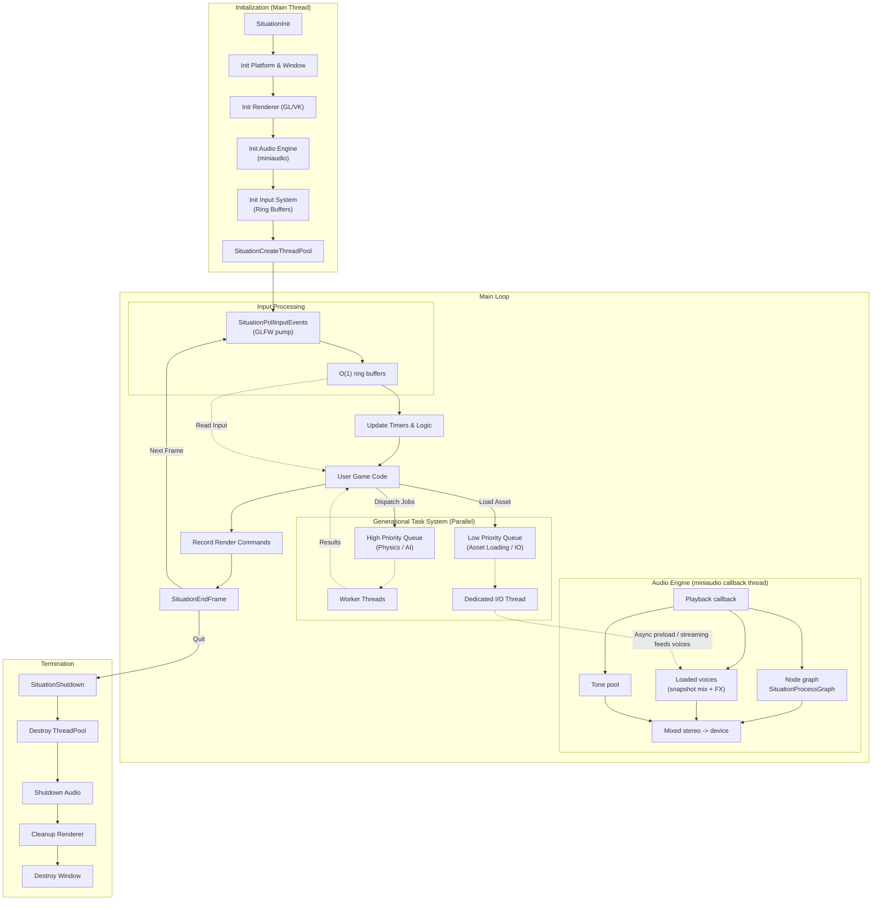
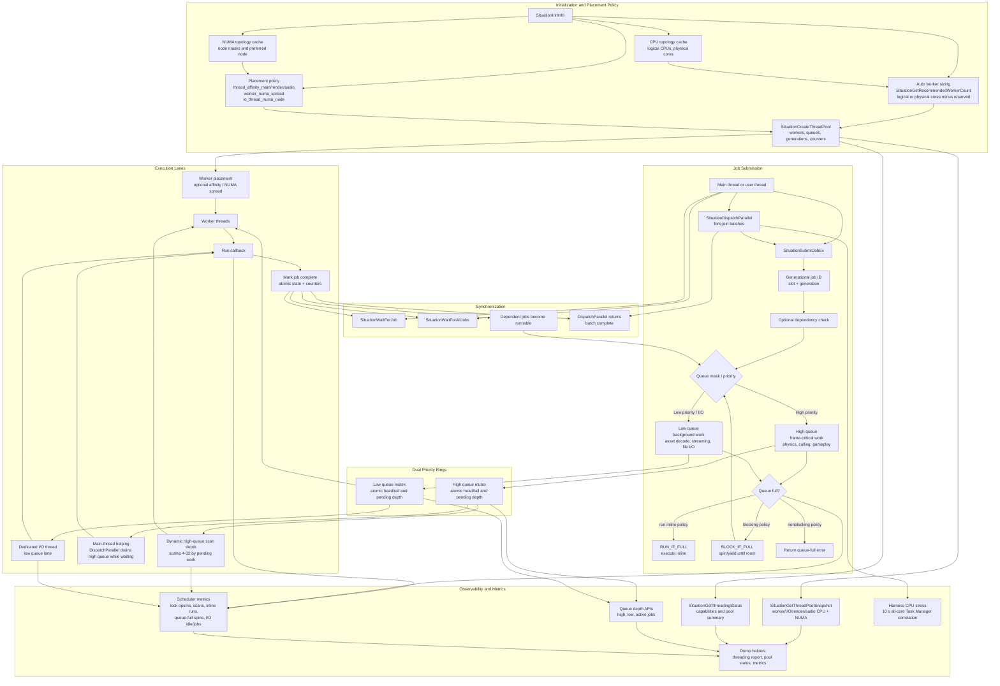
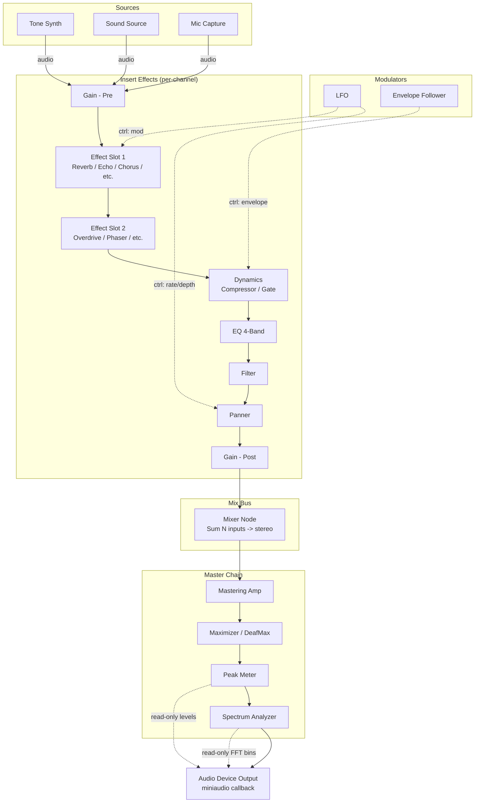
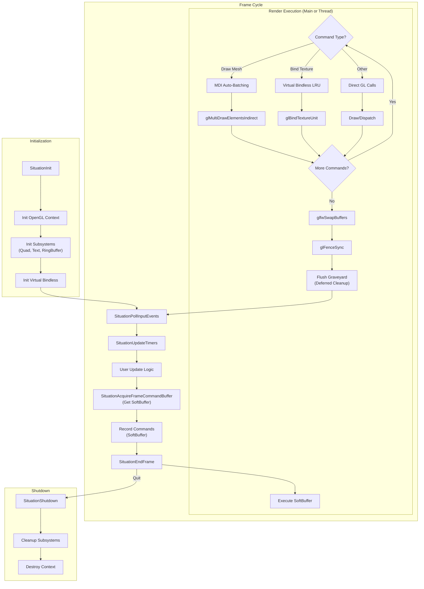
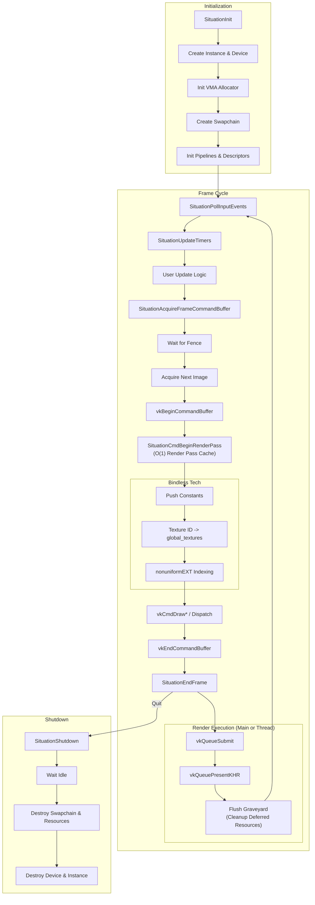

<div align="center">
  
</div>

# The "Situation" Advanced Platform Awareness, Control, and Timing

_(c) 2025-2026 Jacques Morel_

_MIT Licensed_

Welcome to "Situation", a public API engineered for high-performance, cross-platform development. "Situation" is a single-file, cross-platform **[Strict C11 (ISO/IEC 9899:2011) Compliant](doc/C11_Compliance_Report.md)** library providing unified, low-level access and control over essential application subsystems. Its purpose is to abstract away platform-specific complexities, offering a lean yet powerful API for building sophisticated, high-performance software. This library is designed as a foundational layer for professional applications, including but not limited to: real-time simulations, game engines, multimedia installations, and scientific visualization tools.

Our immediate development roadmap is focused on expanding the library's capability. See **[What's New](doc/whatsnew.md)** for a full history of recent features, optimizations, and roadmap completions!
*   **Async Compute:** Exposing dedicated transfer and compute queues in Vulkan for non-blocking background operations.
*   **Built-in Debug Tools**: Leveraging internal profiling counters to render an immediate-mode performance overlay.
*   **Advanced Audio DSP**: Expanding the effects chain with user-definable graph routing.
*   **Cross-Platform Expansion**: Formalizing support for Android and WebAssembly targets.
*   **Web & Reach (Phase 4):** Full **Emscripten** (WASM) support and a **WebGPU (Dawn)** backend to bring Situation apps to the browser with near-native performance.

"Situation" is an ambitious project that aims to become a premier, go-to solution for developers seeking a reliable and powerful platform layer. We encourage you to explore the library, challenge its capabilities, and contribute to its evolution.

The library's philosophy is reflected in its name, granting developers complete situational "Awareness," precise "Control," and fine-grained "Timing."

It provides deep **Awareness** of the host system through APIs for querying hardware **(GPU Name, VRAM)** and multi-monitor display information, and by handling operating system events like window focus and file drops.

This foundation enables precise **Control** over the entire application stack:
*   **Threading:** **Generational dual-queue** task system (mutex per queue, atomics for indices/job state): fork-join `SituationDispatchParallel`, high/low priority rings, backpressure (`RUN_IF_FULL` / `BLOCK_IF_FULL`), dedicated I/O thread, topology/affinity/NUMA placement, pool observability and scheduler metrics (v2.4.139+).
*   **Windowing:** Fullscreen, borderless, and HiDPI-aware window management with explicit **State Hardening** to prevent context poisoning from external middleware (e.g., ImGui).
*   **Input:** O(1) ring-buffered processing for Keyboard, Mouse, and Gamepad events ensures no input is ever lost during frame spikes.
*   **Audio:** **Node graph** output (**`SituationProcessGraph`**) plus **Snapshot-and-Unlock** mixing for loaded/streamed voices, zero-stall concurrency, safe RAM preloading via background threads (Async Load), disk streaming for music, and fused-loop real-time effects (Reverb, Delay, Filter).
*   **Graphics:** A unified command-buffer abstraction for **OpenGL 4.6** and **Vulkan 1.4**. It manages complex resources automatically, utilizing **Best-Fit Descriptor Recycling** and **Persistent Staging Rings** to eliminate fragmentation and allocation overhead. The OpenGL backend now features **Multi-Draw Indirect (MDI)** batching and **Bindless Textures** for console-like efficiency. It includes high-level utilities for **Compute Shaders**, **Virtual Display Compositing**, and high-quality text rendering powered by **Zero-Copy Ring Buffers**.
*   **Hot-Reloading:** A suite of tools for live-reloading assets (Shaders, Textures, Models) at runtime, safely handling GPU synchronization and resource rebuilding with **Debounced IO Polling** to prevent CPU storms.

Finally, its **Timing** capabilities range from high-resolution performance measurement **(FPS, Draw Calls, Latency Histograms)** and frame rate management to an advanced **Temporal Oscillator System** for creating complex, rhythmically synchronized events. By handling the foundational boilerplate of platform interaction, "Situation" empowers developers to focus on core application logic, enabling the creation of responsive and sophisticated software—from games and creative coding projects to data visualization tools—across all major desktop platforms.

> **CRITICAL ARCHITECTURAL NOTE:** To guarantee identical behavior between OpenGL (Immediate) and Vulkan (Deferred), developers must **update all buffer data before recording draw commands** within a frame. *The library actively enforces this rule in debug builds and will report a runtime error if violated.*

---

## Table of Contents
- [1. Introduction & Overview](#1-introduction--overview)
- [2. Getting Started](#2-getting-started)
- [3. Core Concepts & Architecture](#3-core-concepts--architecture)
    - [Threading architecture](#threading-architecture)
    - [Audio node graph (conceptual)](#audio-node-graph-architecture)
- [4. Building & Configuration](#4-building--configuration)
    - [Language Wrappers (Odin, Zig, Rust)](#language-wrappers-odin-zig-rust)
- [5. Examples & Tutorials](#5-examples--tutorials)
- [6. Frequently Asked Questions (FAQ) & Troubleshooting](#6-frequently-asked-questions-faq--troubleshooting)
- [7. API Reference](#7-api-reference)
- [8. Version History](#8-version-history)

---


## 1. Introduction & Overview

`situation.h` is a single-header C/C++ library that acts as a high-performance kernel for interactive software. It abstracts the fragmented landscape of OS APIs (Windows/Linux/macOS) and Graphics Backends (OpenGL/Vulkan) into a unified, deterministic "Situation" that you control.

Unlike simple wrappers, Situation is an **opinionated micro-engine**. It enforces a strict separation of Update and Render phases to guarantee identical behavior across immediate-mode (OpenGL) and deferred-mode (Vulkan) drivers.

### **Key Capabilities**

*   **Unified Command Architecture:** Write your rendering code once using abstract `SituationCmd*` functions. The library compiles this into direct state changes for **OpenGL 4.6** or optimized command buffers for **Vulkan 1.4**.
*   **Generational Task System:** C11 thread pool with per-queue mutexes, generational job IDs, fork-join parallelism, priority queues, and optional CPU/NUMA pinning via `SituationInitInfo`.
*   **"Hardened" Audio Engine:** miniaudio drives the device; the callback mixes **active graph** processing, **voice snapshots**, and the **tone pool** into the output buffer. **Thread-safe asset loading** (decode SFX to RAM to avoid stalls), background music streaming, real-time DSP effects (Reverb/Delay), and low-latency microphone capture.
*   **Dynamic Resource Management:** No arbitrary limits. The Vulkan backend features a **Dynamic Descriptor Manager** with a linear allocation strategy that automatically grows resource pools as you load assets, supporting scenes with thousands of textures and buffers without fragmentation.
*   **O(1) Input System:** A lock-free, ring-buffered input architecture ensures that no keypress or mouse click is ever lost, even during frame-rate spikes.
*   **Virtual Display Compositor:** Render your game to low-resolution off-screen targets (e.g., 320x240) and composite them to the main screen with precise control over scaling algorithms (Integer, Fit, Stretch) and blend modes.
*   **First-Class Compute:** Compute Shaders are not an afterthought. The API treats Compute Pipelines and Storage Buffers (SSBOs) as primary citizens, enabling complex simulations and post-processing.
*   **Deep System Awareness:** Query precise hardware details (GPU Name, dedicated VRAM usage, Monitor topology) to auto-configure your application's quality settings.


## 2. Getting Started

A minimal application requires **zero configuration** beyond selecting a backend.

1.  Download `situation.h` (and ensure stb headers are available if not using the bundled release).
2.  Create `main.c`. This example utilizes the new Task System to load music asynchronously while drawing text.

```c
#define SITUATION_IMPLEMENTATION
#define SITUATION_USE_VULKAN            // Select Backend: VULKAN or OPENGL
#define SITUATION_ENABLE_THREADING      // Enable the new Task System
#define SITUATION_ENABLE_SHADER_COMPILER // Required for Vulkan Text/Quad rendering
#include "situation.h"

int main(int argc, char** argv) {
    // 1. Initialize with config
    SituationInitInfo config = { .window_width = 1280, .window_height = 720, .window_title = "Hello Situation" };
    if (SituationInit(argc, argv, &config) != SITUATION_SUCCESS) return -1;

    // 2. Create Generational Thread Pool (Auto-detect core count)
    SituationThreadPool pool;
    SituationCreateThreadPool(&pool, 0, 1024);

    // 3. Zero Friction Assets (Async)
    SituationSound music;
    // Decodes to RAM on background thread (Low Priority), zero main-thread stalls
    SituationLoadSoundFromFileAsync(&pool, "bgm.mp3", true, &music);

    SituationFont font;
    if (SituationLoadFont("font.ttf", &font) == SITUATION_SUCCESS) {
        SituationBakeFontAtlas(&font, 24.0f); // Create GPU texture for the font
    }

    // 4. Main Loop
    while (!SituationWindowShouldClose()) {
        SITUATION_BEGIN_FRAME(); // Macro: Polls Input + Updates Timers

        // Example: Dispatch Physics in Parallel (High Priority)
        SituationDispatchParallel(&pool, 1000, 64, MyPhysicsCallback, NULL);

        if (SituationAcquireFrameCommandBuffer()) {
            SituationCommandBuffer cmd = SituationGetMainCommandBuffer();

            // Clear screen to dark slate blue
            SituationRenderPassInfo pass = {
                .display_id = -1, // Main Window
                .color_attachment = { .loadOp = SIT_LOAD_OP_CLEAR, .clear = { .color = {20, 30, 40, 255} } }
            };

            SituationCmdBeginRenderPass(cmd, &pass);

            // Draw text directly using the internal batch renderer
            SituationCmdDrawText(cmd, font, "Situation Engine Running...", (Vector2){50, 50}, (ColorRGBA){255, 255, 255, 255});

            SituationCmdEndRenderPass(cmd);
            SituationEndFrame();
        }
    }

    // 5. Cleanup (Automatic leak detection runs here)
    SituationDestroyThreadPool(&pool);
    SituationUnloadSound(&music);
    SituationUnloadFont(font);
    SituationShutdown();
    return 0;
}
```


---


## 3. Core Concepts & Architecture

The library is built on several core principles to ensure a simple, predictable, and high-performance development experience.

-   **Unified Command Abstraction:** The API exposes a single "Command Buffer" model for rendering.
    -   In **Vulkan**, this maps 1:1 to hardware command buffers for deferred execution.
    -   In **OpenGL**, this acts as a "pass-through" layer, executing commands immediately while maintaining API compatibility.
-   **The "Update-Before-Draw" Contract:** To guarantee identical behavior across backends, you must strictly separate data updates from draw calls within a frame. Always update your buffers/constants *before* recording the draw commands that use them.
-   **Generational Threading Model:**
    -   **Main Thread:** Handles OS Events, Windowing, and Recording Render Commands.
    -   **Task System:** Handles Logic, Physics, and File I/O. The system uses **Dual Priority Queues**:
        -   **High Priority:** For frame-critical tasks (Physics, Culling).
        -   **Low Priority:** For streaming (Asset Loading).
-   **Explicit Resource Management:** There is no garbage collector. Every resource created with `SituationCreate...` or `SituationLoad...` returns an opaque handle and **must** be explicitly released with its corresponding `SituationDestroy...` or `SituationUnload...` function.
-   **Three-Phase Frame:** The main loop follows a strict, non-blocking cadence:
    1.  **Input:** `SituationPollInputEvents()` (Gathers OS events into thread-safe buffers).
    2.  **Update:** `SituationUpdateTimers()` & User Logic (Physics, AI, Audio triggers).
    3.  **Render:** `SituationAcquireFrameCommandBuffer` -> Record Commands -> `SituationEndFrame`.

### Internal Architecture & Pipelines

#### Global System Architecture
This diagram illustrates the high-level flow of the Situation Engine, showing how the main thread coordinates with the parallel task system, audio engine, and I/O subsystems.



**Audio pipeline (Phase H+):** The hardware callback sums **three paths** into one buffer when enabled: **`SituationProcessGraph`** (`active_graph`, optional **default graph** at init), **`SituationPlayLoadedSound`** / streaming (**`active_voices`** snapshot + per-voice DSP), and **`SituationPlayTone`** (**tone pool**). The legacy console **`SituationAudioMixer`** has been removed in favor of **node graphs**; the diagram above replaces the older linear “snapshot mixer → DSP chain only” picture. Details: **`doc/plan/AUDIO_NODE_COMPLETION_PLAN.md`** § *Canonical miniaudio callback pipeline*.

#### Threading Architecture

Situation's threading layer is a C11 generational job system with two priority queues, explicit wait semantics, optional CPU/NUMA placement, a dedicated I/O lane, and runtime diagnostics. The queues use a mutex per ring for mutation, while job IDs, state transitions, counters, and queue indices are tracked with atomics.



In practice, use **high priority** for frame-critical jobs that the main thread may help drain during `SituationDispatchParallel`, and **low priority** for background work that can tolerate latency. Use `SituationInitInfo` affinity and NUMA fields only when you need predictable placement; the default path auto-sizes the pool and keeps affinity fail-soft so initialization does not break on restricted systems.

#### Audio Node Graph Architecture

Conceptual **signal-flow** diagram (channel strip → bus → master → device). Real routing uses the registered node types and **`SituationAudioGraph`** / **`SituationProcessGraph`**; node names are illustrative.



#### OpenGL 4.6 Lifecycle (State Machine)
The OpenGL backend is designed to be "stateless" from the user's perspective while managing complex state caching internally. It features a "Soft Command Buffer" that records commands for execution either immediately or on a dedicated render thread. Key features include **MDI Auto-Batching** for geometry and **Virtual Bindless** (LRU Slot Management) for texture compatibility.



#### Vulkan 1.4 Lifecycle (Deferred Execution)
The Vulkan backend is built for high-performance deferred rendering. It uses **Dynamic Descriptor Management** and a **Bindless Architecture** where all textures reside in a global unbound array (`global_textures[]`), indexed via Push Constants. Frame synchronization is handled via fences and semaphores, with a per-frame **Graveyard** for safe resource destruction.




---


## 4. Building & Configuration

"Situation" uses a **Header-Only + Implementation** pattern. Configuration is handled entirely via preprocessor macros, which must be defined **before** including `situation.h`.

### **Preprocessor Macros**

| Macro | Type | Description |
| :--- | :--- | :--- |
| `SITUATION_IMPLEMENTATION` | **Required** | Define this in **exactly one** `.c` or `.cpp` file to compile the library's implementation code. |
| `SITUATION_USE_VULKAN` | Backend | Selects the **Vulkan 1.4** backend. Best for high-performance, multi-threaded asset loading, and modern GPU features. |
| `SITUATION_USE_OPENGL` | Backend | Selects the **OpenGL 4.6** backend using GLAD (included). Best for compatibility and smaller binary sizes. |
| `SITUATION_ENABLE_THREADING` | Feature | **(New in v2.3.15)** Enables the Generational Task System. Requires C11 support. |
| `SITUATION_ENABLE_SHADER_COMPILER` | Feature | Enables runtime GLSL → SPIR-V compilation. **Mandatory for Vulkan** if you wish to use the built-in Text or Virtual Display renderers. Requires linking `shaderc`. |
| `SITUATION_ENABLE_DXGI` | Feature | **(Windows Only)** Enables high-precision VRAM monitoring and GPU naming using the DXGI API. Requires linking `dxgi.lib` and `ole32.lib`. |
| `SITUATION_NO_STB` | Integration | "Situation" embeds `stb_image`, `stb_truetype`, etc. Define this to disable them if your project already links these libraries to avoid symbol collisions. |

---

### **Linker Requirements**

Depending on your configuration, you must link against specific system libraries.

| Platform | Standard Links | With `SITUATION_USE_VULKAN` | With `SITUATION_ENABLE_DXGI` |
| :--- | :--- | :--- | :--- |
| **Windows (MSVC/MinGW)** | `kernel32`, `user32`, `shell32`, `gdi32` | `vulkan-1.lib`, `shaderc_shared.lib` | `dxgi.lib`, `ole32.lib`, `shlwapi.lib` |
| **Linux (GCC/Clang)** | `-lm`, `-ldl`, `-lpthread`, `-lX11` | `-lvulkan`, `-lshaderc_shared` | N/A |
| **macOS (Clang)** | `-framework Cocoa`, `-framework IOKit` | `-lvulkan`, `-lshaderc_shared` | N/A |

> **Note:** If using `SITUATION_ENABLE_SHADER_COMPILER`, ensure the `shaderc` includes and libraries are in your compiler's search path.

---

### **Language Wrappers (Odin, Zig, Rust)**

Situation provides official FFI bindings and fully featured interactive examples for **Odin**, **Zig**, and **Rust** inside the `wrappers/` folder. The binding generators parse the C public headers automatically.

#### **Odin Wrapper**
- **Source Files**: [wrappers/Odin/](file:///c:/Users/User/Desktop/hobby/_kiro/situation/wrappers/Odin/)
- **Binding Generator**: `python tools/generate_odin_bindings.py`
- **Build Command**:
  ```bat
  build_odin_example.bat hello_situation
  ```
- **Output Directory**: `build/examples/odin/`

#### **Zig Wrapper**
- **Source Files**: [wrappers/Zig/](file:///c:/Users/User/Desktop/hobby/_kiro/situation/wrappers/Zig/)
- **Binding Generator**: `python tools/generate_zig_bindings.py`
- **Build Command**:
  ```bat
  build_zig_example.bat hello_situation
  ```
- **Output Directory**: `build/examples/zig/`

#### **Rust Wrapper**
- **Source Files**: [wrappers/Rust/](file:///c:/Users/User/Desktop/hobby/_kiro/situation/wrappers/Rust/)
- **Binding Generator**: `python tools/generate_rust_bindings.py`
- **Build Command**:
  ```bat
  build_rust_example.bat hello_situation
  ```
- **Output Directory**: `build/examples/rust/`

All build commands automatically compile the wrapper example and copy the compiled binary and the dependent `situation_opengl.dll` to their corresponding output folder.

---


## 5. Examples & Tutorials

The repository includes a variety of examples demonstrating the library's features, from basic triangle rendering to more advanced topics like compute shaders and 3D model loading.

The full source code for all examples can be found in the `/examples` directory.


---


## 6. Frequently Asked Questions (FAQ) & Troubleshooting

### **Configuration Settings (Preprocessor Macros)**

"Situation" is configured via preprocessor definitions. You must define these **before** including `situation.h`.

| Macro | Description |
| :--- | :--- |
| `SITUATION_IMPLEMENTATION` | **Required** in exactly one source file to compile the library implementation. |
| `SITUATION_USE_VULKAN` | Selects the **Vulkan 1.4** backend. Requires the Vulkan SDK to be installed/linked. |
| `SITUATION_USE_OPENGL` | Selects the **OpenGL** backend. Uses GLAD (included) to load GL 4.6 Core functions. |
| `SITUATION_ENABLE_SHADER_COMPILER` | Enables runtime GLSL to SPIR-V compilation (requires `shaderc`). **Mandatory** for Vulkan if using internal renderers (Text, Virtual Displays). |
| `SITUATION_ENABLE_DXGI` | **(Windows Only)** Enables high-precision VRAM monitoring and GPU naming using the DXGI API. Requires linking `dxgi.lib` and `ole32.lib`. |
| `SITUATION_NO_STB` | Disables the automatic implementation of the STB libraries. Use this if your project already links `stb_image` or `stb_truetype` to avoid symbol collisions. |

---

### **Architectural Safeguards**

#### 1. The "Update-Before-Draw" Rule
To maintain consistency between the **Immediate Mode** nature of OpenGL and the **Deferred** nature of Vulkan command buffers, you must strictly adhere to this order in your render loop:
1.  **Update Data:** Call `SituationUpdateBuffer`, `SituationCmdSetPushConstant`, or texture uploads.
2.  **Record Commands:** Call `SituationCmdDraw*`.
**Why?** In Vulkan, commands recorded now are executed later. If you update a buffer after recording a draw call but before the frame ends, the GPU will read the new data for the old draw call. In Debug builds, the library actively monitors this and will report architectural violations.

#### 2. Thread Safety
*   **Main Thread:** Windowing, Rendering commands, and Event Polling must occur here.
*   **Worker Threads:** File I/O, Data decompression, and Logic (Physics/AI) are safe via the **Generational Task System**.
*   **Safety:** The new task system uses atomic operations for O(1) lock-free status checks. Input uses ring buffers. Audio loading uses full RAM decoding.

---

### **Best Practices**

#### Audio Loading
*   **Sound Effects:** Use `SITUATION_AUDIO_LOAD_AUTO` or `FULL`. This decodes the entire sound to RAM. It ensures instant playback with zero risk of disk-related stuttering.
*   **Music:** Use `SITUATION_AUDIO_LOAD_STREAM`. This keeps a small buffer in RAM and streams from disk. It saves memory but relies on the OS disk cache.

#### Resource Lifecycle
This library does not use garbage collection.
*   **Create/Destroy:** Every `SituationCreate*` must be paired with a `SituationDestroy*`.
*   **Load/Unload:** Every `SituationLoad*` must be paired with a `SituationUnload*`.
*   **Leak Detection:** Calling `SituationShutdown()` will scan the internal tracking lists and print warnings to `stderr` for any resources you forgot to free.

---

### **Troubleshooting**

**Q: `SituationInit` fails with `SITUATION_ERROR_VULKAN_PIPELINE_FAILED`?**
*   **Cause:** You defined `SITUATION_USE_VULKAN` but did not define `SITUATION_ENABLE_SHADER_COMPILER`. The internal 2D renderers (for Text and Virtual Displays) require `shaderc` to compile their GLSL source to SPIR-V at runtime.

**Q: Why does my game crash after loading ~500 textures in Vulkan?**
*   **Cause:** If you are on an older version (< v2.3.3C), you hit the fixed descriptor pool limit. **Upgrade to v2.3.15**, which introduces the Dynamic Descriptor Manager to automatically grow the pool as needed.

**Q: `SituationTakeScreenshot` returns false?**
*   **Cause:** Screenshots require a supported file extension (`.png` or `.bmp`). Check that your filename ends in one of these and that you haven't disabled STB support without providing an alternative writer.

**Q: Audio crackles or pops when loading a level?**
*   **Cause:** You might be streaming too many sounds from disk at once. Switch your SFX loading mode to SITUATION_AUDIO_LOAD_FULL to decode them to RAM, removing the disk I/O bottleneck from the audio thread.

**Q: My 3D Model renders black?**
*   **Cause:** The model loader likely failed to find the texture files relative to the model. Check the console output; the library logs warnings if specific texture paths in a GLTF file could not be resolved.


---


## 7. API Reference

The documentation for "Situation" is split into two key documents:

1.  [**Core API Library Reference Manual (situation_sdk.md)**](doc/situation_sdk.md): The primary SDK documentation and technical reference manual. This is the "Bible" for the library, covering architecture, concepts, and detailed component specifications.
2.  [**Situation API Programming Guide (situation_api.md)**](doc/situation_api.md): A comprehensive list of all functions, structs, and enums with usage examples.


---

## License (MIT)

"Situation" is licensed under the permissive MIT License. In simple terms, this means you are free to use, copy, modify, merge, publish, distribute, sublicense, and/or sell copies of the software for both commercial and private projects. The only requirement is that you include the original copyright and license notice in any substantial portion of the software or derivative work you distribute. This library is provided "as is", without any warranty.

---

Copyright (c) 2025-2026 Jacques Morel

Permission is hereby granted, free of charge, to any person obtaining a copy of this software and associated documentation files (the "Software"), to deal in the Software without restriction, including without limitation the rights to use, copy, modify, merge, publish, distribute, sublicense, and/or sell copies of the Software, and to permit persons to whom the Software is furnished to do so, subject to the following conditions:

The above copyright notice and this permission notice shall be included in all copies or substantial portions of the Software.

THE SOFTWARE IS PROVIDED "AS IS", WITHOUT WARRANTY OF ANY KIND, EXPRESS OR IMPLIED, INCLUDING BUT NOT LIMITED TO THE WARRANTIES OF MERCHANTABILITY, FITNESS FOR A PARTICULAR PURPOSE AND NONINFRINGEMENT. IN NO EVENT SHALL THE AUTHORS OR COPYRIGHT HOLDERS BE LIABLE FOR ANY CLAIM, DAMAGES OR OTHER LIABILITY, WHETHER IN AN ACTION OF CONTRACT, TORT OR OTHERWISE, ARISING FROM, OUT OF OR IN CONNECTION WITH THE SOFTWARE OR THE USE OR OTHER DEALINGS IN THE SOFTWARE.

---


## 8. Version History

For a detailed history of changes, improvements, and fixes, please refer to the [**Update Log**](doc/UPDATELOG.md).

