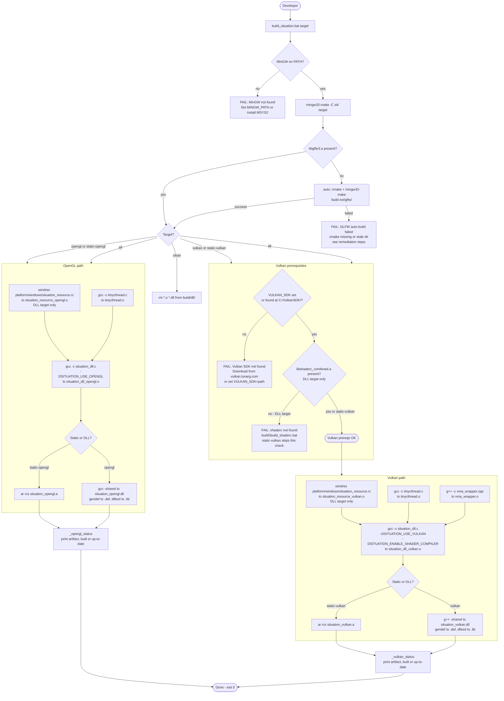

# Building the Situation Library

**Version**: 2.4.342
**Date**: 2026-06-24

This document covers building the Situation library itself — producing the static
archives (`situation_opengl.a`, `situation_vulkan.a`) or DLLs
(`situation_opengl.dll`, `situation_vulkan.dll`) from source.

If you only need to build an application that *uses* Situation, see
[COMPILATION_GUIDE.md](COMPILATION_GUIDE.md).

---

## Table of Contents

1. [How the Build System Works](#how-the-build-system-works)
2. [Targets](#targets)
3. [Toolchain Requirements](#toolchain-requirements)
4. [OpenGL Targets](#opengl-targets)
5. [Vulkan Targets](#vulkan-targets)
6. [Environment Overrides](#environment-overrides)
7. [Windows Resource / Version Stamping](#windows-resource--version-stamping)
8. [What Gets Compiled](#what-gets-compiled)
9. [Fail-Safe](#fail-safe)

---

## How the Build System Works

`build\build_situation.bat` is a **thin launcher**. All build logic lives in
`sit/Makefile`, driven by `mingw32-make`. The launcher:

1. Validates the target argument
2. Resolves the MinGW toolchain (via `MINGW_PATH` or the default `C:\msys64\mingw64\bin`)
3. Prepends MinGW to PATH so `gcc`, `g++`, `ar`, `windres`, `gendef`, `dlltool` are all available
4. Forwards the target to `mingw32-make -C sit\ <target>`
5. Propagates Make's exit code

```
build\build_situation.bat <target>
      │
      └─→ mingw32-make -C sit\ <target>
                │
                └─→ sit/Makefile
                      ├─ gcc / g++      compile situation_dll.c, vma_wrapper.cpp, tinycthread.c
                      ├─ windres        compile platform/windows/situation_resource.rc → .o  (DLL targets only)
                      ├─ ar             archive into .a  (static targets)
                      ├─ gendef         generate .def from DLL
                      └─ dlltool        generate .lib from .def
```

The Makefile lives in `sit/` and uses `../` to reach project root paths. It works
correctly whether invoked via the launcher or directly with `mingw32-make` from `sit/`.

---

## Build Process Diagram



---

## Targets

| Target | Output | Description |
|--------|--------|-------------|
| `opengl` | `build/dll/situation_opengl.dll` + `.def` + `.lib` | OpenGL DLL with embedded version resource |
| `vulkan` | `build/dll/situation_vulkan.dll` + `.def` + `.lib` | Vulkan DLL with embedded version resource |
| `all` | both DLLs | Builds `opengl` then `vulkan` |
| `static-opengl` | `build/dll/situation_opengl.a` | Self-contained OpenGL static archive |
| `static-vulkan` | `build/dll/situation_vulkan.a` | Self-contained Vulkan static archive |
| `all-static` | both static archives | Builds `static-opengl` then `static-vulkan` |
| `clean` | removes `*.o` and `*.dll` from `build/dll/` | `.def` and `.lib` intentionally kept |
| `distclean` | removes everything from `build/dll/` | `*.o` `*.dll` `*.a` `*.def` `*.lib` |
| `help` | prints usage | Default target when no argument given |

```bat
build\build_situation.bat opengl
build\build_situation.bat static-opengl
build\build_situation.bat static-vulkan
build\build_situation.bat vulkan
build\build_situation.bat all
build\build_situation.bat clean
```

**Recommended default:** `static-opengl` or `static-vulkan` — produces a fully
self-contained archive that examples and tests can link against without any DLL present
at runtime. DLL targets are faster to build and useful for iteration.

---

## Toolchain Requirements

All targets require **MSYS2 MinGW-w64** on Windows:

```bat
pacman -S mingw-w64-x86_64-toolchain
```

This installs `gcc`, `g++`, `ar`, `windres`, `gendef`, `dlltool`, and `mingw32-make`
under `C:\msys64\mingw64\bin`.

The launcher assumes this default path. Override with:

```bat
set MINGW_PATH=C:\custom\mingw\bin
build\build_situation.bat static-opengl
```

---

## OpenGL Targets

### Requirements

- MSYS2 MinGW-w64 toolchain (see above)
- `cmake` on PATH — required for the automatic GLFW build if `libglfw3.a` is missing
  (`pacman -S mingw-w64-x86_64-cmake`)

### GLFW — Automatic

GLFW (`ext/glfw/`) is compiled from source automatically on first use. If
`ext/glfw/build/src/libglfw3.a` is missing when the build runs, the Makefile
executes:

```
cmake .. -G "MinGW Makefiles" -DCMAKE_C_COMPILER=gcc
         -DGLFW_BUILD_DOCS=OFF -DGLFW_BUILD_TESTS=OFF
         -DGLFW_BUILD_EXAMPLES=OFF -DGLFW_BUILD_WIN32=ON
mingw32-make
```

This is a one-time step (~30 seconds). Subsequent builds skip it.

If the auto-build fails (most commonly: `cmake` not on PATH), the Makefile prints
a clear diagnostic with remedies:

```
[ERROR] GLFW auto-build failed -- libglfw3.a still missing.

  Common causes and fixes:

  1. cmake not on PATH
     Install via MSYS2:  pacman -S mingw-w64-x86_64-cmake
     Then re-run:        build\build_situation.bat opengl

  2. Stale or corrupted build directory
     Delete and retry:
       rmdir /s /q ext\glfw\build
       build\build_situation.bat opengl

  3. Build manually (scroll up to see cmake/make output for details):
     cd ext\glfw && mkdir build && cd build
     cmake .. -G "MinGW Makefiles" -DCMAKE_C_COMPILER=gcc ...
     mingw32-make
```

### Build

```bat
build\build_situation.bat static-opengl    REM recommended
build\build_situation.bat opengl           REM DLL
```

---

## Vulkan Targets

Vulkan targets require two things beyond the OpenGL baseline: a Vulkan SDK install
and (for the DLL target only) a pre-built shaderc archive.

### Vulkan SDK

**Required by both `vulkan` and `static-vulkan`.**

The Vulkan SDK provides the Vulkan headers and `vulkan-1.lib` at link time.
It is a system installer — it cannot be built automatically.

**Install:**

1. Download from [https://vulkan.lunarg.com/sdk/home](https://vulkan.lunarg.com/sdk/home)
2. Current version: **1.4.350.0** (May 2026)
3. Run the Windows installer — it installs to `C:\VulkanSDK\1.4.350.0\` by default
   and sets the `VULKAN_SDK` environment variable automatically
4. Open a new terminal and run the build — the Makefile will find it

**Autodetection:** The Makefile scans `C:\VulkanSDK\*/Include/vulkan/vulkan.h` and
picks the first valid match. If the SDK is in a non-standard location:

```bat
set VULKAN_SDK=C:\path\to\VulkanSDK\1.4.350.0
build\build_situation.bat static-vulkan
```

**If the SDK is not found**, the Makefile prints a full diagnostic explaining
the autodetect mechanism, the download URL, and the manual override.

**If the SDK path is invalid** (found but `vulkan.h` missing), it identifies
the exact missing file and suggests reinstall or explicit path.

### shaderc — DLL target only

**Required by `vulkan` DLL only. `static-vulkan` does NOT need this.**

`libshaderc_combined.a` provides runtime GLSL→SPIR-V compilation. Build it once
from the project root — the build takes 10–30 minutes and requires Python, git,
cmake, and MinGW:

```bat
build\build_shaderc.bat
```

Also produces `ext\shaderc\build\glslc\glslc.exe` for SPIR-V precompile scripts
(`compile_harness_shaders`, `compile_demon_hunt_shaders`, etc.).

| Command | Effect |
|---------|--------|
| `build\build_shaderc.bat` | Build if `libshaderc_combined.a` is missing |
| `build\build_shaderc.bat rebuild` | Remove `ext\shaderc\build` and rebuild |
| `build\build_shaderc.bat sync` | Run `git-sync-deps` only |
| `build\build_shaderc.bat clean` | Remove `ext\shaderc\build` |

Output: `ext/shaderc/build/libshaderc/libshaderc_combined.a`

If this file is missing and you run `build_situation.bat vulkan`, the Makefile
points at `build\build_shaderc.bat` and exits cleanly. **`static-vulkan` bypasses
this check entirely.**

### Build

```bat
build\build_situation.bat static-vulkan    REM recommended — no shaderc needed
build\build_situation.bat vulkan           REM DLL — requires shaderc
```

---

## Environment Overrides

| Variable | Default | Effect |
|----------|---------|--------|
| `MINGW_PATH` | `C:\msys64\mingw64\bin` | MinGW toolchain bin directory |
| `VULKAN_SDK` | autodetected from `C:\VulkanSDK\*` | Vulkan SDK root |
| `SIT_OPTIMIZE_CFLAGS` | `-O2 -mfma -ffp-contract=fast` | Compiler optimization flags |
| `EXTRA_VULKAN_CFLAGS` | _(empty)_ | Extra flags appended to Vulkan compile lines only |

These are consumed by the Makefile from the environment. The launcher deliberately
does **not** set them — set them before invoking the launcher to preserve override
semantics across invocations.

For a one-command debug workflow (library + test harness + GDB), use root **`debug.bat`**
instead — see **[COMPILATION_GUIDE.md](COMPILATION_GUIDE.md)** → *Debug Builds*.

```bat
REM Debug build
set SIT_OPTIMIZE_CFLAGS=-O0 -g
build\build_situation.bat static-opengl

REM Non-standard Vulkan SDK
set VULKAN_SDK=D:\SDKs\VulkanSDK\1.4.350.0
build\build_situation.bat static-vulkan
```

---

## Windows Resource / Version Stamping

DLL targets (`opengl`, `vulkan`) embed a `VS_VERSION_INFO` block via `windres`,
giving the DLL proper metadata visible in Explorer → Properties → Details.

`sit/platform/windows/situation_resource.rc` defines the block. The Makefile reads version values
from `sit/situation_base_version.h` at parse time via `$(shell grep ...)` and passes
them as `-D` flags to `windres` — no manual version sync needed.

Two separate resource objects are compiled:
- `situation_resource_opengl.o` — `InternalName` / `OriginalFilename` = `situation_opengl.dll`
- `situation_resource_vulkan.o` — `InternalName` / `OriginalFilename` = `situation_vulkan.dll`

After a version bump in `situation_base_version.h`, rebuild the DLL and the new
version appears automatically. Static archives do not embed Win32 resources.

---

## What Gets Compiled

The Makefile compiles these pieces from source on every build (or when stale):

| Source | How | All targets |
|--------|-----|-------------|
| `situation_dll.c` | `gcc -c` | Yes |
| `ext/glfw/deps/tinycthread.c` | `gcc -c` | Yes |
| `ext/vma_wrapper.cpp` | `g++ -c` | Vulkan only |
| `sit/platform/windows/situation_resource.rc` | `windres` | DLL targets only |

Everything else is either header-only (cglm, stb, miniaudio, cgltf, glad — no
build step at all) or a pre-built archive that the Makefile links against:

| Pre-built input | Used by |
|-----------------|---------|
| `ext/glfw/build/src/libglfw3.a` | All targets (auto-built if missing) |
| `ext/shaderc/build/libshaderc/libshaderc_combined.a` | `vulkan` DLL only |
| `vulkan-1.lib` (from Vulkan SDK) | Vulkan targets (system install) |
| System libs (`opengl32`, `gdi32`, etc.) | All targets (OS-provided) |

---

## Fail-Safe

The original monolithic `build\build_situation.bat` is preserved verbatim as
`build\build_situation_legacy.bat`. If the Makefile path ever fails (broken
`mingw32-make`, corrupted Makefile, etc.), the legacy script builds the library
exactly as it did before the Makefile migration.

```bat
build\build_situation_legacy.bat static-opengl
```
