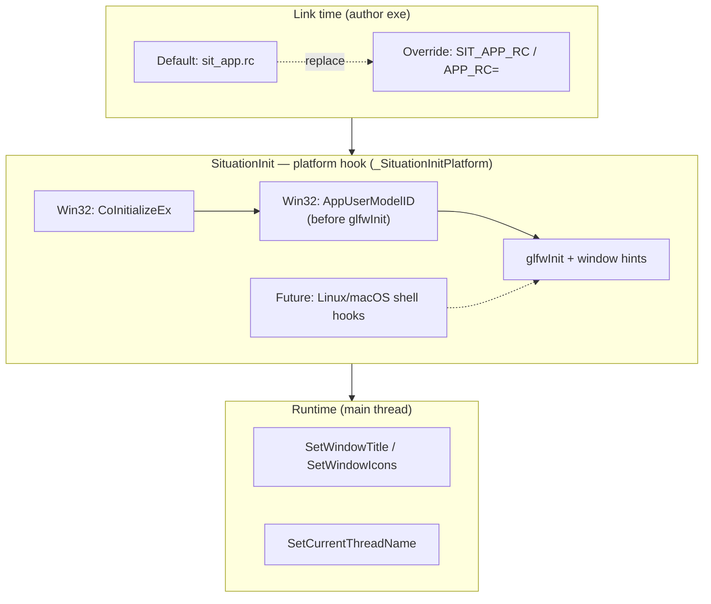
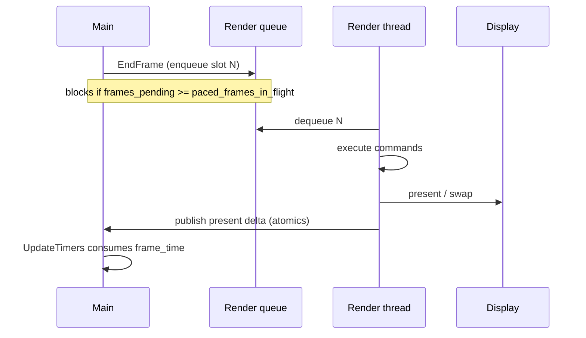
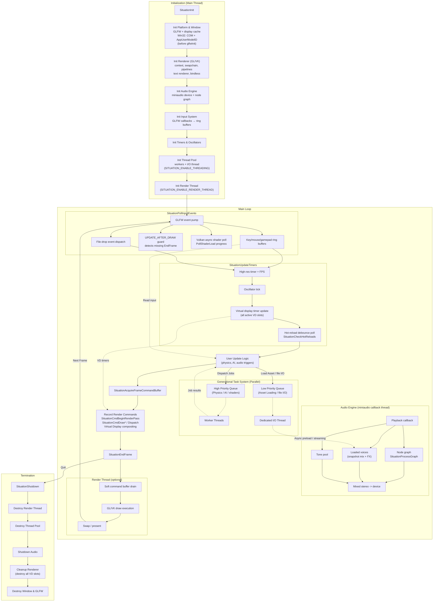
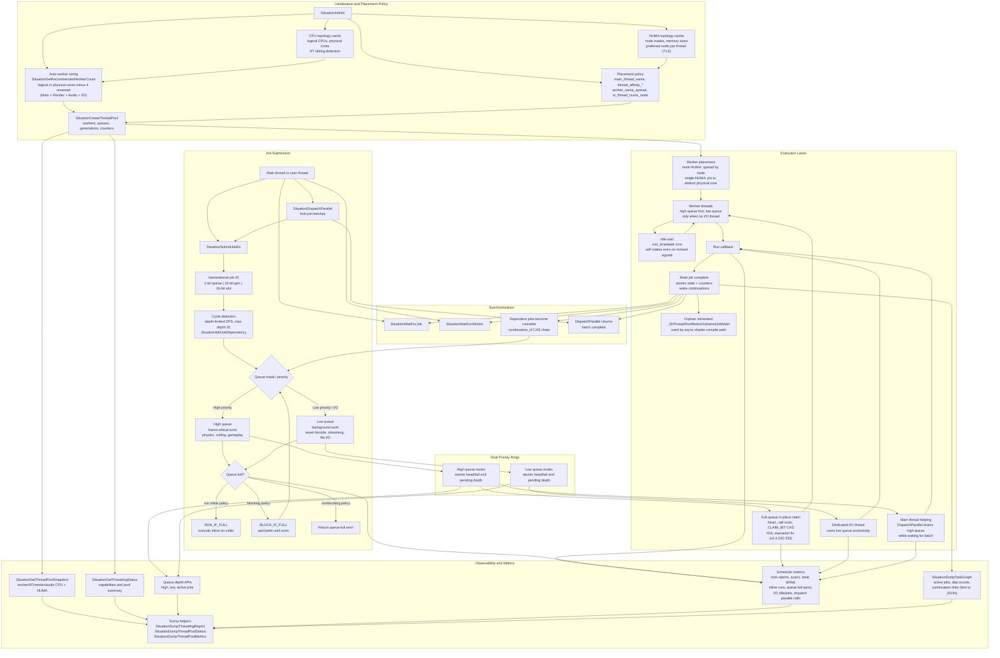
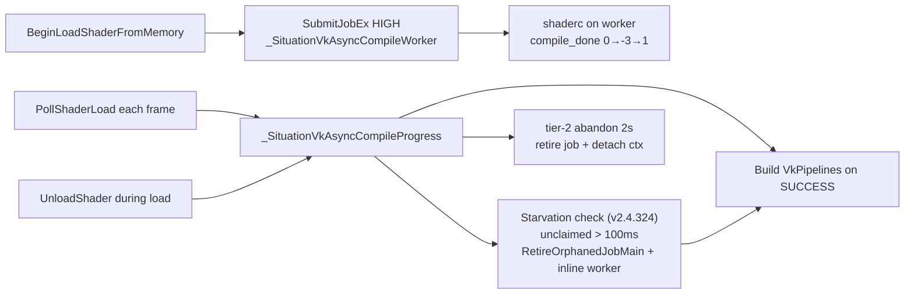
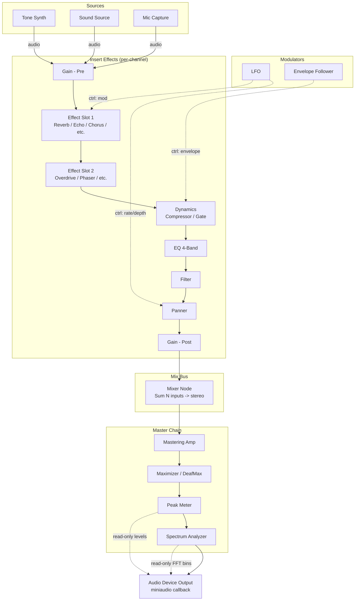
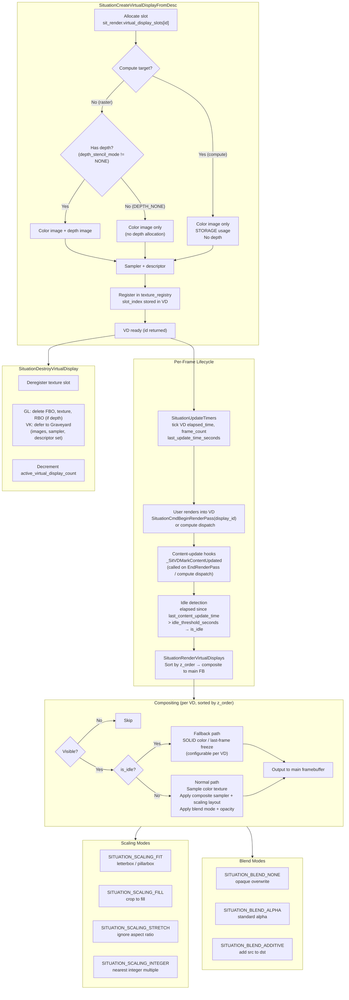
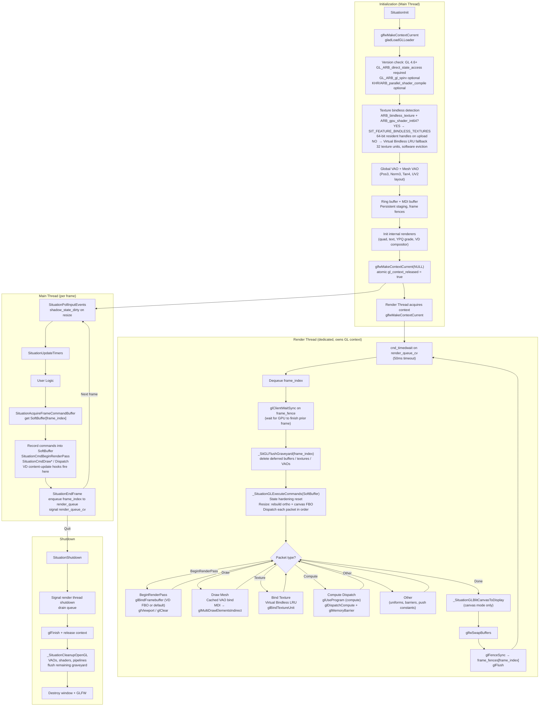

# Situation — Core Concepts & Architecture

**Last reviewed:** v2.4.403 (2026-06-29)

This document covers the internal design principles, threading model, audio pipeline, graphics backend lifecycles, and **application identity** of the Situation library. For a getting-started guide and API reference, see [introduction.md](introduction.md). **Recovery gate @ v2.4.362** (Track C closed; full suite GL+VK green): [plan/LIBRARY_RECOVERY_PLAN_244.md](plan/LIBRARY_RECOVERY_PLAN_244.md). **Track D (GL render-thread `-600`) closed @ v2.4.367** — scoped GL error drains at frame boundaries; harness `gl_endframe_execute_vd_streak` guards consumer EndFrame→Load paths.

---

## Recent Renderer Architecture Changes (since last review)

The following significant changes have landed since v2.4.326. The body of this document is updated to reflect the current state.

| Version | Change | Impact |
|---------|--------|---------|
| **v2.4.403** | **PE version stamping** — EXE `sit_app.rc` reads version from `situation_base_version.h` via `build/sit_version.mk` / `read_situation_version.py` (removed stale 2.4.399 RC default). | [COMPILATION_GUIDE.md](COMPILATION_GUIDE.md) § Application Identity. |
| **v2.4.402** | **Tone synth patch memory** — `SituationSetControl` on `patch_slot` / `patch_store` runs recall/save even when the stored value is unchanged. | [tone_synth.md](tone_synth.md) § Patch memory. |
| **v2.4.401** | **Profiling file layout** — Tracy build glue → `build/tracy_client.cpp`; CPU zone macros → `sit/situation_profiling.h` via `situation.h` (not `situation_api.h`); removed `situation_impl_trace_prof.h`. | [Profiling instrumentation layout](#profiling-instrumentation-layout-v24401); [Profiling guide](guide/profiling.md). |
| **v2.4.400** | **Application identity WI-5** — `SituationInitInfo::default_window_icon_path` auto-load (PNG / Win32 `.ico`) at end of init. | [Application Identity Architecture](#application-identity-architecture-v24399). |
| **v2.4.399** | **Application identity (Win32)** — library defaults + author overrides: AppUserModelID (`Situation.Application`), EXE `VS_VERSION_INFO` + icon via `sit_app.rc`, `SIT_APP_RC` / `APP_RC=` build hooks. | [Application Identity Architecture](#application-identity-architecture-v24399); guide [windows_app_identity.md](guide/windows_app_identity.md). |
| **v2.4.396** | **P10.3 GPU timestamp zones** — `SituationCmdGPUZoneBegin/End`, `SIT_FEATURE_GPU_TIMESTAMPS`, `gpu_zone_ns[]` in `SituationGetFrameProfile`; GL `GL_TIME_ELAPSED` + VK `VkQueryPool` readback one frame late. | [Profiling guide](guide/profiling.md); SDK §3.8.4. |
| **v2.4.387** | **VD bolster complete (Phase 11)** — explicit **`SituationVirtualDisplaySamplerDesc`** decoupled from **`SituationScalingMode`**; GL **`GL_SRGB8_ALPHA8`** + **`GL_FRAMEBUFFER_SRGB`**; aniso/mip configure + create-time storage mips; static update mode + memory hint. | [Virtual Display Compositing](#virtual-display-compositing); user guide [virtual_display.md](guide/virtual_display.md). |
| **v2.4.386** | **Fractional refresh Hz** — `SituationDisplayInfo.current_refresh_hz`; **`GetMonitorRefreshRateHz`**, **`GetDisplayRefreshRateHz`**, **`GetMeasuredPresentRateHz`**; FPS rounding uses 59.94 → 60. | [Frame Loop Contract](#frame-loop-contract-v2484). |
| **v2.4.385** | **Game loop Phases 2–4** — present-anchored `frame_time`/FPS; **`paced_frames_in_flight = 2`** under VSync/target FPS; metrics overlay refresh/paced/capture fields; Frame Loop Contract in this doc. | [Frame Loop Contract](#frame-loop-contract-v2484); [Threading](#threading-architecture). |
| **v2.4.384** | **On-demand OpenGL screen capture** — no unconditional per-frame readback; PBO async path; capture epoch + urgent latch (RT) / sync-on-Load (ST). | [Frame Loop Contract — On-demand screen capture](#on-demand-screen-capture-opengl). |
| **v2.4.367** | **Track D GL `-600` fix** — scoped `glGetError` drains after screenshot readback and VD compositor restore; consecutive `EndFrame` no longer inherits stale GL errors. | OpenGL execute path; consumer apps with implicit `LoadImageFromScreen`. |
| **v2.4.371** | **VD idle defaults** — new VDs default to animated **snow** standby (`PATTERN`, zero layers); chroma snow + unified **`SitVdStandbyConfig`**. | VD compositing idle path. |
| **v2.4.369** | **Text/font harness certification** — grid GPU text + retro font builders; white default color fix on VGA/VCR fonts. | Internal text renderer (GL/VK). |
| **v2.4.364–366** | **Vulkan shader cache Phase 6** — harness readback batching; Layer A cache hits; async reload skips redundant shaderc work. | Async shader section; see [VULKAN_SHADER_CACHE_PLAN.md](plan/VULKAN_SHADER_CACHE_PLAN.md). |
| **v2.4.360** | **Renderer modularization complete** — `situation_impl_renderer.h` trimmed to **23-line** orchestrator; five domain slices (`core`, `lc`, `shader`, `resources`, `frame_cmd`); **31,000** impl LOC; 347 statics; `inventory_renderer_module.py` + `verify_renderer_fwd.py` green. | All renderer subsections below; primary edit targets are slice files (see [Renderer module layout](#renderer-module-layout-v24360)). |
| **v2.4.352** | **VK solid DrawQuad set-1 sampler bind** — Internal solid quads bind `layout(set=1) sampler2D` via interim `quad_solid_texture`; depth bias dynamic state on internal quad draws. | Vulkan internal renderer; lifecycle cleanup open (B-L6). |
| **v2.4.351** | **VK internal quad projection push constants** — Push-constant `mat4 projection` per internal `DrawQuad` / `DrawTexture` / YPQ draw; fixes VD UBO overwrite at GPU execute time. | Vulkan VD compositing + internal 2D renderer. |
| **v2.4.349** | **VK VD quad viewport/ortho parity** — `SituationCmdDrawQuad` refreshes ortho UBO + viewport/scissor from active VD resolution; `SIT_VK_PIPELINE_NO_DEPTH` on quad pipeline. | Vulkan VD compositing section updated. |
| **v2.4.348** | **VK 2D quad depth off + 3D pattern Y-parity** — `_SitVulkanApplyQuadDrawDynamicState` disables depth for 2D quads; `sit_tp_3d_grid.glslh` bottom-origin Y for Vulkan neg-viewport. | Vulkan graphics pipeline; dual-backend shader contract. |
| **v2.4.347** | **VK shutdown crash fix (double-destroy)** — Shader cache shutdown dedup (modules/pipelines/layouts); descriptor pool destroy dedup via `seen_pools[]`; `SituationShutdown` joins render thread before thread-pool destroy; `vmaDestroyAllocator` after pool cleanup. | Vulkan shutdown lifecycle updated. |
| **v2.4.346** | **Mesh PBR layout + VK async ticket fix** — `SIT_MESH_LAYOUT_POS_NRM_TAN_TEX` (48 B); mid-load `UnloadShader` no longer orphans Phase-2 build tickets. | Mesh loading; async shader section. |
| **v2.4.345** | **GL VD PATTERN compositor (SPIR-V embed)** — Build-time glslc to `sit_vd_compositor_gl_spirv_embed.*`; `GL_ARB_gl_spirv` at init; same `#include sit_test_patterns.glslh` as Vulkan. | OpenGL VD compositing section updated. |
| **v2.4.344** | **VD idle PATTERN compositor API** — `SitTestPatternConfig` on standby path; `SOLID` / `COLORBURST` / `PATTERN` idle modes; 144 B std140 UBO on Vulkan compositor (sets 2/3). | VD compositing section updated. |
| **v2.4.343** | **Test-pattern std140 UBO contract** — `sit_tp_config_ubo.glslh` + `sit_test_pattern_config.c`; UBO `@ set=0, binding=0` on **both** GL and VK (no push/SSBO split). | Dual-backend shader binding model. |
| **v2.4.341** | **Font migration (grid GPU text)** — Bitmap/grid atlas upload, retro font builders in `situation_impl_image.h`, `SituationCmdDrawTextEx` / `DrawTextBoxed`, `SituationUnloadFont` lifecycle. | Text renderer subsection (GL/VK internal). |
| **v2.4.339** | **API header split (P2.2)** — `situation_api.h` is a 94-line umbrella fanning to nine domain headers. No ABI change (581 SITAPI symbols). | Code organization; bindings/doc tooling. |
| **v2.4.335** | **Phase D bindless backtrack** — Internal `global_textures[]` bindless migration failed (black frames); reverted to per-texture sampler model for text/YPQ/VD. | Vulkan internal binding model documented as failed experiment. |
| **v2.4.331** | **Mesh BDA / vertex pull** — `SituationGetMeshVertexBufferAddress`, `SituationGetMeshIndexBufferAddress`; `sit/gpu/vertex_pull.glslh`. | Vulkan mesh access path. |
| **v2.4.330** | **OpenGL VSync + render-thread backpressure** — `glfwSwapInterval` at present time; `_SitShouldEngageBackpressure()` always engages with render thread active. | OpenGL frame-pacing section. |

---

## Table of Contents

- [Design Principles](#design-principles)
- [Application Identity Architecture (v2.4.399+)](#application-identity-architecture-v24399)
- [Frame Loop Contract (v2.4.384+)](#frame-loop-contract-v2484)
- [Renderer module layout (v2.4.360+)](#renderer-module-layout-v24360)
- [Profiling instrumentation layout (v2.4.401+)](#profiling-instrumentation-layout-v24401)
- [Global System Architecture](#global-system-architecture)
- [Threading Architecture](#threading-architecture)
- [Async Vulkan Shader Compilation](#async-vulkan-shader-compilation-glsl--spir-v)
- [Audio Node Graph Architecture](#audio-node-graph-architecture)
- [Virtual Display Compositing](#virtual-display-compositing)
- [OpenGL 4.6 Backend Lifecycle](#opengl-46-backend-lifecycle)
- [Vulkan 1.4 Backend Lifecycle](#vulkan-14-backend-lifecycle)

---

## Renderer module layout (v2.4.360+)

The renderer is still a **single translation unit** (header-only). `situation_impl.h` includes **`situation_impl_renderer.h` only** — that orchestrator pulls five domain slices in fixed order:

```text
situation_impl_renderer.h          (23 lines — guard + #includes only)
├── situation_impl_renderer_core.h       1,587 lines — uniform map, staging, graveyard, GL backup
├── situation_impl_renderer_lc.h        10,663 lines — init/shutdown, backends, render thread, hot-reload
├── situation_impl_renderer_shader.h     6,576 lines — shader load/compile, pipelines, async workers
├── situation_impl_renderer_resources.h  3,019 lines — buffers, textures, meshes, slot registry
└── situation_impl_renderer_frame_cmd.h  9,132 lines — acquire/end frame, SituationCmd*, model I/O
```

**31,000** impl lines (+2,895 vs 28,105 monolith baseline — slice headers/guards only). Static helpers are forward-declared in **`situation_impl_renderer_fwd.h`** (347 functions, grouped by slice).

Validation:

```powershell
python scripts/inventory_renderer_module.py   # LOC + statics + SITAPI per slice
python scripts/verify_renderer_fwd.py         # 347/347 fwd parity gate
```

**VD boundary unchanged:** virtual display compositor bodies remain in **`situation_impl_vd.h`**, not in renderer slices.

Plan reference: [`doc/done/RENDERER_MODULARIZATION_PLAN.md`](done/RENDERER_MODULARIZATION_PLAN.md) (complete). First-level control/renderer split: [`doc/done/CORE_RENDERER_SPLIT_PLAN.md`](done/CORE_RENDERER_SPLIT_PLAN.md).

---

## Profiling instrumentation layout (v2.4.401+)

Situation separates **three profiling layers** by responsibility — not everything belongs in `sit/` or in the public API umbrella.

| Layer | Location | Role |
|-------|----------|------|
| **Runtime metrics API** | `situation_api_graphics.h` | P10.0–P10.1: `SituationGetFrameProfile`, spike counters, phase timers, metrics overlay |
| **GPU zone API + impl** | `SituationCmdGPUZoneBegin/End` + `situation_impl_gpu_prof.h` | P10.3: internal query pools; fills `gpu_zone_ns[]` in frame profile |
| **Tracy CPU zones (opt-in)** | `sit/situation_profiling.h` via **`sit/situation.h`** | P10.2: `SIT_PROFILE_*` macros — compile-time instrumentation, **not** SITAPI |
| **Tracy client link glue** | `build/tracy_client.cpp` | Single C++ TU including `ext/tracy/public/TracyClient.cpp`; linked only when `SIT_TRACY=1` |

**Include contract:**

- Application and library impl code: `#include "situation.h"` (or `"sit/situation.h"` with `-I` root) — gets API **and** profiling macros.
- Bindings / doc tools that include **`situation_api.h` only** do not see Tracy macros — intentional; zones are not part of the 581-symbol SITAPI surface.
- **`situation_impl_trace_prof.h` removed @ v2.4.401** — was a redundant pass-through; impl modules receive macros from `situation.h` before `situation_impl.h`.

**Build:** `SIT_TRACY=1` or `build_situation.bat opengl tracy` → `-DSITUATION_ENABLE_TRACY`, compile `build/tracy_client.cpp`, link `-ldbghelp -lsecur32`. App compile lines need the same define + `-Iext/tracy/public` for user zones to appear in captures.

Guide: [profiling.md](guide/profiling.md) · SDK §3.8.5 · [COMPILATION_GUIDE.md](COMPILATION_GUIDE.md) Tracy flags.

---

## Design Principles

The library is built on several core principles to ensure a simple, predictable, and high-performance development experience.

-   **Unified Command Abstraction:** The API exposes a single "Command Buffer" model for rendering.
    -   In **Vulkan**, this maps 1:1 to hardware command buffers for deferred execution.
    -   In **OpenGL**, this acts as a "pass-through" layer, executing commands immediately while maintaining API compatibility.
-   **The "Update-Before-Draw" Contract:** To guarantee identical behavior across backends, you must strictly separate data updates from draw calls within a frame. Always update your buffers/constants *before* recording the draw commands that use them.
-   **Generational Threading Model:**
    -   **Main Thread:** Handles OS Events, Windowing, and Recording Render Commands.
    -   **Task System:** Handles Logic, Physics, and File I/O via **Dual Priority Queues**:
        -   **High Priority:** For frame-critical tasks (Physics, Culling).
        -   **Low Priority:** For streaming (Asset Loading).
-   **Explicit Resource Management:** There is no garbage collector. Every resource created with `SituationCreate...` or `SituationLoad...` returns an opaque handle and **must** be explicitly released with its corresponding `SituationDestroy...` or `SituationUnload...` function.
-   **Three-Phase Frame:** The main loop follows a strict, non-blocking cadence:
    1.  **Input:** `SituationPollInputEvents()` — gathers OS events into thread-safe buffers.
    2.  **Update:** `SituationUpdateTimers()` & User Logic (Physics, AI, Audio triggers).
    3.  **Render:** `SituationAcquireFrameCommandBuffer` → Record Commands → `SituationEndFrame`.
-   **VSync-Aware Backpressure (v2.4.317, paced depth v2.4.384):** The main thread's frame production rate is gated by render-queue depth whenever a cadence source is active — either a software `target_frame_time` OR hardware VSync. Under pacing, `paced_frames_in_flight` is **2** (double-buffer pace); when truly uncapped (VSync OFF, no target), the limit stays at `SITUATION_MAX_FRAMES_IN_FLIGHT` (6) and the ring may overwrite stale frames. See [Frame Loop Contract](#frame-loop-contract-v2484).

---

## Application Identity Architecture (v2.4.399+)

**Operational guide (Windows):** [guide/windows_app_identity.md](guide/windows_app_identity.md). **Implementation plan:** [plan/SIT_IDENTITY_PLAN.md](plan/SIT_IDENTITY_PLAN.md) (**Phase I complete @ v2.4.400**; WI-6+, LI-*, MA-* open).

Situation treats **application identity** as independent layers the OS and shell consume. The library ships **defaults on every layer**; authors **override any layer** without forking init or window creation. This is one model across platforms — Windows is implemented today; Linux and macOS are planned under the same `sit/platform/` layout.

### Cross-platform identity layers

| Layer | What users / OS see | Runtime (all platforms) | Windows (shipped @ v2.4.399) | Linux (**LI-***) | macOS (**MA-***) |
|-------|---------------------|-------------------------|------------------------------|--------------------------|-----------------|
| **Bundle / PE metadata** | Explorer icon, Properties → Details, `.desktop` name | — | `sit_app.rc` → icon + `VS_VERSION_INFO` | `.desktop` + hicolor icons | `Info.plist` + `.icns` in bundle |
| **Shell application ID** | Taskbar pin, grouping, launcher identity | — | `AppUserModelID` → default **`Situation.Application`** | `StartupWMClass` + `.desktop` `StartupWMClass=` | Bundle ID / `LSApplicationCategoryType` |
| **Window title** | Title bar, live taskbar label | `SituationInitInfo::window_title`, `SituationSetWindowTitle()` | same | same | same |
| Window icon (live) | Taskbar / title bar after window exists | `SituationSetWindowIcons()`; **`default_window_icon_path`** @ init (v2.4.400) | same | same (X11/Wayland) | same |
| **Thread name** | Task Manager Threads, debuggers | `main_thread_name` → title → `"Sit Main"`, `SituationSetCurrentThreadName()` | MinGW: `OpenThread` on main thread (v2.4.247+) | `pthread_setname_np` / prctl | `pthread_setname_np` |

**Precedence (all platforms):**

1. **Build-time metadata** — explicit author resource file replaces library default entirely (no silent merge).
2. **Process shell ID** — set once before the first top-level window; init applies default only if not already set.
3. **Runtime window APIs** — affect the live window only; they do not rewrite PE/bundle resources.



### Windows implementation (@ v2.4.399)

| Concern | Location | Default | Override |
|---------|----------|---------|----------|
| AppUserModelID | `sit/platform/windows/situation_win32_identity.h` | `SITUATION_DEFAULT_APP_USER_MODEL_ID` (`Situation.Application`) | `SituationInitInfo::app_user_model_id`, `SituationWin32SetAppUserModelId()` |
| Init hook | `sit/situation_impl_ctrl.h` → `_SituationInitPlatform` | Applied after COM init, **before** `glfwInit` | Pre-init API wins if already set |
| EXE PE resources | `sit/platform/windows/sit_app.rc` | Hourglass icon + `FileDescription`: "Situation Application" | Author `.rc`; `SIT_APP_RC` (`build_examples.bat`) or `APP_RC=` (`tests/harness/Makefile`) |
| Author template | `sit/platform/windows/sit_app_template.rc` | Same structure, `-DAPP_*` windres flags | Copy or invoke with custom defines |
| DLL PE resources | `sit/platform/windows/situation_resource.rc` | Situation **library** branding | Separate from EXE — Task Manager reads the **process EXE** |

`SetCurrentProcessExplicitAppUserModelID` is resolved via `GetProcAddress` on `shell32.dll` (MinGW-safe). Idempotent per process.

**Repo policy:** in-tree examples and harness use library defaults (distinct `window_title` only). See guide § Repo examples.

### Future ports (Linux / macOS)

Planned layout (not yet in tree):

```text
sit/platform/
├── windows/   ← shipped (WI-0–WI-4)
├── linux/     ← LI-0–LI-4: .desktop, icon theme paths, StartupWMClass alignment
└── macos/     ← MA-0–MA-3: bundle metadata, dock icon, CFBundleIdentifier parity
```

Cross-platform fields such as `app_user_model_id` and `default_window_icon_path` live in `SituationInitInfo` and are **ignored off Windows** (AppID) or use portable paths (PNG icon) until platform-specific hooks expand.

**Optional (tracked in plan):** jump lists (**WI-6**), taskbar progress/overlay (**WI-7**) — see [SIT_IDENTITY_PLAN.md](plan/SIT_IDENTITY_PLAN.md) Phase II.

---

## Frame Loop Contract (v2.4.384+)

Plan reference: [`doc/plan/GAME_LOOP_PERFORMANCE_PLAN.md`](plan/GAME_LOOP_PERFORMANCE_PLAN.md).

### Canonical loop order

Every frame must follow this sequence on the **main thread**:

```text
SituationPollInputEvents()
SituationUpdateTimers()
  → user logic (physics, AI, audio triggers)
SituationAcquireFrameCommandBuffer()
  → record SituationCmd* draw/dispatch calls
SituationEndFrame()
```

Calling `SituationPollInputEvents()` or `SituationUpdateTimers()` while `in_frame == true` (between acquire and end) is an architectural violation — debug builds log `UPDATE_AFTER_DRAW_VIOLATION` with a pointer to this section.

### Present-anchored timing

| Mode | Who measures `frame_time` | FPS rollup |
|------|---------------------------|------------|
| **Render thread ON** | Render thread at `glfwSwapBuffers` / `vkQueuePresentKHR` → atomics consumed in `SituationUpdateTimers` | Present counter + refresh-aware rounding |
| **Render thread OFF** | Main thread at synchronous present inside `SituationEndFrame` | Same 1 s window on main |

`SituationGetFrameTime()` returns the **display delta** (time between successive presents), suitable for rendering and camera motion. It is **not** guaranteed to equal main-thread wall time between `UpdateTimers` calls when the render queue is pipelined.

`SituationGetDisplayRefreshRate()` reports the primary monitor refresh as an **integer** Hz from OS/GLFW (e.g. **59** on NTSC-style panels). **`SituationGetDisplayRefreshRateHz()`** returns the **fractional nominal** rate when DXGI mode rational is available (e.g. **59.94**). **`SituationGetMeasuredPresentRateHz()`** reports the measured present-to-present rate. With VSync ON, `SituationGetFPS()` uses fractional nominal Hz for refresh-aware rounding so 59.94 Hz panels report **60** instead of truncating to **59**.

### Paced queue depth

```text
SituationSetVSync / SetTargetFPS
        ↓
_SituationRecomputePacedFramesInFlight()
        ↓
paced_frames_in_flight = 2   (VSync ON or target FPS active)
paced_frames_in_flight = 6   (truly uncapped)
```

Backpressure waits use `_SituationEffectiveQueueDepthLimit()` → `paced_frames_in_flight`, not the compile-time maximum. Under VSync-only pacing (no software target), adaptive **SLEEP** backpressure is disabled — **YIELD** (or **SPIN** on desktop) lets the compositor/VSync be the sleeper and avoids 1–15 ms `cnd_wait` jitter on Windows.



### On-demand screen capture (OpenGL)

Vulkan already captured only on request; OpenGL matches that contract as of v2.4.384. **No unconditional per-frame readback** on the steady path.

| Path | Present | Implicit `EndFrame` → `LoadImageFromScreen` |
|------|---------|-----------------------------------------------|
| **Render thread ON** | Async on RT after `EndFrame` returns | **Urgent latch** on frame slot N; call `Load` promptly or use `RequestScreenCapture` before `EndFrame` |
| **Render thread OFF** | Synchronous inside `EndFrame` | **Sync on-demand read** inside `LoadImageFromScreen` when cache miss |

Pre-swap capture runs only when `screenshot_requested` or `screenshot_urgent[slot]` is set. PBO async readback is used when pre-swap capture runs; `glFinish` is not invoked every frame.

Debug builds warn once if the RT urgent latch times out waiting for the render thread.

### Metrics overlay

`SituationDrawMetricsOverlay()` (example 02, **M** key) shows refresh Hz, `paced X/6`, present interval (display delta), and capture state (`none` / `requested` / `urgent`) alongside existing FPS, phase, and queue stats.

---

## Global System Architecture

This diagram illustrates the high-level flow of the Situation Engine, showing how the main thread coordinates with the renderer, parallel task system, audio engine, I/O, and hot-reload subsystems.



**Audio pipeline (Phase H+):** The hardware callback sums **three paths** into one buffer: **`SituationProcessGraph`** (active graph), **`SituationPlayLoadedSound`** / streaming (voice snapshots + per-voice DSP), and **`SituationPlayTone`** (tone pool). Details: `doc/plan/AUDIO_NODE_COMPLETION_PLAN.md` § *Canonical miniaudio callback pipeline*.

**Hot-reload** (`SituationCheckHotReloads`) runs in `SituationUpdateTimers` via debounced I/O polling — file modification timestamps are checked on the I/O thread and reloads are dispatched to the render thread for safe GPU synchronization.

**Virtual displays** (`sit_render.virtual_display_slots`) have their timers ticked inside `SituationUpdateTimers` and are composited to the main framebuffer during the render phase. All active VD slots are destroyed during `_SituationCleanupRenderer`.

---

## Threading Architecture

Situation's threading layer is a C11 generational job system with two priority queues, explicit wait semantics, optional CPU/NUMA placement, a dedicated I/O lane, and runtime diagnostics. The queues use a mutex per ring for mutation, while job IDs, state transitions, counters, and queue indices are tracked with atomics.



In practice, use **high priority** for frame-critical jobs that the main thread may help drain during `SituationDispatchParallel`, and **low priority** for background work that can tolerate latency. Use `SituationInitInfo` affinity and NUMA fields only when you need predictable placement; the default path auto-sizes the pool and keeps affinity fail-soft so initialization does not break on restricted systems.

Key implementation details:
- Workers idle via `cnd_timedwait` (1ms cap) rather than an indefinite wait, ensuring they self-wake even if a signal is missed.
- Worker NUMA placement is context-sensitive: on multi-NUMA systems workers spread across NUMA nodes; on single-NUMA systems they pin to distinct physical cores instead.
- Dependency edges are validated with a depth-limited cycle detection DFS (max depth 32) before being committed — jobs exceeding the depth limit are rejected with `SITUATION_ERROR_THREAD_CYCLE`.
- The orphan retirement path (`_SitThreadPoolRetireOrphanedJobMain`) allows the main thread to cleanly retire pool jobs whose work was satisfied out-of-band, used primarily by the async shader compile path.

---

## Async Vulkan Shader Compilation (GLSL → SPIR-V)

Vulkan async GLSL loads run **shaderc on the high-priority thread pool**, then build pipelines on the main thread during poll. Poll and unload share one internal progress driver (`_SituationVkAsyncCompileProgress`, v2.4.238+). The starvation fast-path (v2.4.324) handles the case where the pool job is never claimed.



**`compile_done` state machine (Vulkan + shaderc only):**

| Value | State | Meaning |
|-------|-------|---------|
| `0` | PENDING | Submitted; worker not yet started |
| `-3` | COMPILING | Worker owns shaderc (CAS `0→-3`) |
| `1` | SPIRV_READY | shaderc OK; poll builds pipelines |
| `-1` | FAILED | shaderc failed |
| `-2` | ABANDONED | Main released ctx; worker frees if it runs |

**Contract:** call **`SituationPollShaderLoad`** each frame (not during acquire); terminal errors **-99** (lost job) and **-557** (compile timeout) if the compile can never complete. The `build_ticket` (shader cache phase 2) is nulled on every terminal exit path to prevent use-after-free on cache-reuse loads. OpenGL uses driver async compile on the host GL context — no thread-pool shaderc job. Details: `doc/situation_sdk.md` §3.3.1 and `doc/plan/ASYNC_SHADER_LOAD_HARDENING_PLAN.md`.

---

## Audio Node Graph Architecture

Conceptual **signal-flow** diagram (channel strip → bus → master → device). Real routing uses the registered node types and **`SituationAudioGraph`** / **`SituationProcessGraph`**; node names are illustrative.



---

## Virtual Display Compositing

A virtual display is an independent offscreen render target — its own color texture, optional depth buffer, and per-display timing state. Up to `SITUATION_MAX_VIRTUAL_DISPLAYS` (**16**) can coexist. Each is registered in the shared texture registry so its output can be sampled by user shaders or bound to compute dispatches.

**Three creation modes:**
- `SituationCreateVirtualDisplayFromDesc` — full desc-struct creation (VD-1). Specifies color format (`RGBA8_UNORM` / `RGBA8_SRGB`), depth mode (`NONE` / `D24`), attachment defaults (load/store/clear), layout fields.
- `SituationCreateVirtualDisplayEx` — legacy 7-param + flags form. Wraps `FromDesc` with UNORM + D24 defaults.
- `SituationCreateVirtualDisplay` — simplest form. Wraps `Ex` with no flags.

**Depth attachment is optional (VD-1):**
- `SIT_VD_DEPTH_NONE` — color-only VD. No depth buffer allocated. GL skips depth RBO; Vulkan skips depth image. Begin-pass disables depth test.
- `SIT_VD_DEPTH_D24` — default. Full depth buffer (GL `GL_DEPTH_COMPONENT24`; Vulkan device depth format).

**Vulkan VD rendering uses dynamic rendering (v2.4.316+):**
- VDs do NOT use `VkRenderPass` or `VkFramebuffer`. Begin-pass emits `vkCmdBeginRendering` with `VkRenderingAttachmentInfo` populated from the resolved `SituationRenderPassInfo`.
- Layout transitions are explicit: `SHADER_READ_ONLY → COLOR_ATTACHMENT_OPTIMAL` before begin, `COLOR_ATTACHMENT → SHADER_READ_ONLY` after end. Tracked in `vd->vk.color_image_layout`.
- Per-shader VD pipeline variants use `VkPipelineRenderingCreateInfo` (`renderPass = VK_NULL_HANDLE`), keyed by `(shader_slot, pipeline_family, raster_variant, vd_color_format, vd_depth_format)`. Coexist with main-window render-pass-based pipelines.

**Attachment inherit (tier C):**
- `SituationRenderPassInfoInherit(display_id)` copies VD attachment defaults into an explicit pass struct. One-liner that avoids manual load/store/clear boilerplate.
- `SituationSetVirtualDisplayAttachmentDefaults` — tier B storage-only mutation. Rejects if VD has an active render pass (`SITUATION_ERROR_RENDER_PASS_ACTIVE`).
- `SituationSetVirtualDisplayClearColor` — tier B sugar for `attachment_defaults.clear.color` only (VD-2, v2.4.387).

**Composite sampler vs scaling (VD-3, v2.4.387):**
- **`SituationScalingMode`** (`FIT`, `STRETCH`, `INTEGER`, …) controls **layout only** — the rectangle the compositor maps into window space. It does **not** change min/mag/mip filter.
- **`SituationVirtualDisplaySamplerDesc`** + **`SituationSetVirtualDisplaySampler`** control composite-time filtering (nearest/linear, mip filter, wrap, **`max_anisotropy`**, **`max_mip_level`**). Default via **`SituationVirtualDisplaySamplerDescDefault()`** at create.
- Configure calls reject inside an active VD render pass (`SITUATION_ERROR_RENDER_PASS_ACTIVE`).

**Color / sRGB storage (VD-2, v2.4.387):**
- **`SIT_VD_FORMAT_RGBA8_SRGB`** at create → OpenGL `GL_SRGB8_ALPHA8` FBO; Vulkan `VK_FORMAT_R8G8B8A8_SRGB`.
- OpenGL enables **`GL_FRAMEBUFFER_SRGB`** during VD render passes when the attachment is sRGB; compositor samples stored encoding (hardware decode on sample).
- VD pass clear on OpenGL uses SDR clear floats for 8-bit attachments; HDR PQ clear helper applies to **main window only** (`display_id == -1`). Vulkan VD pass clear can ride main-window HDR when `output_hdr_active`.
- **Readback / CPU pixels:** attachment texels vs composited screen differ — see **[guide/virtual_display.md — Color encoding & readback](guide/virtual_display.md#color-encoding--readback-v2487)**.

**Mips and aniso (VD-4a, v2.4.387):**
- **`SituationVirtualDisplayDesc.color_mip_levels`** (create-time) allocates storage mips; post-draw mipgen runs at end of VD pass (GL `glGenerateTextureMipmap`; VK in `_SitVkEndVDDynamicRendering`).
- **`SituationSetVirtualDisplayMaxAnisotropy`** / **`SituationSetVirtualDisplayMipLevels`** adjust composite sampler only; runtime storage mip count change returns **`NOT_IMPLEMENTED`** (create-time only).

**Update mode / memory (VD-5, v2.4.387):**
- **`SIT_VD_UPDATE_STATIC`** — VD **`frame_time_multiplier`** forced to 0; **`SituationUpdateTimers`** skips frame-clock advance for that slot (manual **`SituationSetVirtualDisplayDirty`** still drives redraw intent).
- **`SituationSetVirtualDisplayMemoryHint`** — stored on VD; passed to VMA at create (best-effort today).



**Idle compositor modes (v2.4.344+):**
- When a VD is idle (`elapsed since last_content_update > idle_threshold`), the compositor can show `SOLID`, `COLORBURST` (SMPTE subset), or **`PATTERN`** (full test-pattern compositor).
- Pattern config is per-VD: `SituationSet/GetVirtualDisplayPatternConfig`, `Set/GetVirtualDisplayPatternLayers`; `standby_pattern` holds a `SitTestPatternConfig` (layer bitmask + tuning).
- **Vulkan** uploads a 144 B std140 UBO (descriptor sets 2/3) and runs the modular `sit/gpu/test_patterns/` shader library.
- **OpenGL** (v2.4.345+) uses the same GLSL sources, compiled at build time to SPIR-V and loaded via `GL_ARB_gl_spirv` (`sit_vd_compositor_gl_spirv_embed.*`). Init wires explicit sampler uniform locations (SPIR-V strips names).

**Key details:**
- VD timers (`elapsed_time`, `frame_count`, `last_update_time_seconds`) are ticked in `SituationUpdateTimers`, not in the render path. **`SIT_VD_UPDATE_STATIC`** slots skip clock advance (v2.4.387).
- Content-update tracking is automatic — `_SitVDMarkContentUpdated` fires on `SituationCmdEndRenderPass` (when a draw was recorded) and on compute dispatches that write to the VD's texture slot. The `is_dirty` flag and `last_content_update_time` are set by this hook.
- Idle fallback is per-VD configurable: `SituationSetVirtualDisplayIdleThreshold` (default 1s), `SituationSetVirtualDisplayFallbackMode`, `SituationSetVirtualDisplayFallbackColor`.
- **VK VD quad parity (v2.4.349–352):** Internal `SituationCmdDrawQuad` in VD passes refreshes ortho + viewport/scissor from active VD resolution; projection is also pushed per-draw (v2.4.351) so compositor UBO overwrites cannot shrink VD tiles at execute time. Open lifecycle tickets for interim `quad_solid_texture`: `LIBRARY_RECOVERY_PLAN_244.md` §B.5.
- On Vulkan, destruction defers all GPU resource destruction to the per-frame **Graveyard** to avoid stalling — no `vkDeviceWaitIdle` needed on normal destroy. The Graveyard flushes after `vkQueuePresentKHR`.
- At shutdown, `_SituationCleanupRenderer` iterates all slots and calls `SituationDestroyVirtualDisplay` for any still-active VDs.

---

## OpenGL 4.6 Backend Lifecycle

The OpenGL 4.6 backend requires `GL_ARB_direct_state_access` and enforces a strict version check at init — anything below 4.6 is rejected. It is built around a **Soft Command Buffer** (`SituationGLSoftCommandBuffer`) that records all draw commands on the main thread and dispatches them for execution on the dedicated render thread. The render thread owns the GL context exclusively after init; the main thread releases it via a `gl_context_released` atomic handoff before the render thread acquires it.

Key features:
- **State hardening** — critical GL state is reset at the top of every `_SituationGLExecuteCommands` call, preventing context poisoning from external middleware (ImGui, etc.)
- **Texture Bindless — two-path system** — at init, the library checks for `GL_ARB_bindless_texture` + `GL_ARB_gpu_shader_int64` together. If both are present, `SIT_FEATURE_BINDLESS_TEXTURES` is set: each texture gets a 64-bit resident handle via `glGetTextureHandleARB` / `glMakeTextureHandleResidentARB`, passed to shaders as a `uint64_t` uniform — this is true bindless, equivalent to Vulkan's descriptor indexing. If either extension is missing (common on Intel iGPUs, older AMD/Mesa drivers — `ARB_bindless_texture` was never promoted to GL core), the library falls back to **Virtual Bindless**: a software LRU across 32 texture units (`glBindTextureUnit`), evicting the least-recently-used slot when all units are occupied. Both paths expose the same API (`SituationGetTextureHandle`, `SituationBindTexture`) — user code doesn't change.
- **MDI Auto-Batching** — `glMultiDrawElementsIndirect` for geometry, reducing draw call overhead
- **Per-frame fences** — `glFenceSync` / `glClientWaitSync` for GPU/CPU synchronization, mirroring Vulkan's fence semantics
- **Scoped GL error drain (v2.4.367)** — after screenshot readback and VD compositor state restore, stale GL errors are cleared so the next `EndFrame` does not surface `-600` from prior subsystems
- **Shadow state + dirty flag** — viewport and ortho projection rebuild on resize is deferred to the render thread via `gl.shadow_state_dirty`
- **Per-frame Graveyard** — deferred buffer/texture/VAO deletion after fence signals, flushed by `_SitGLFlushGraveyard`
- **SPIR-V support** — `GL_ARB_gl_spirv` checked at init; required for the VD PATTERN compositor (v2.4.345+). User shaders may fall back to GLSL when SPIR-V is unavailable. Async compile via `KHR_parallel_shader_compile` / `ARB_parallel_shader_compile`
- **VD PATTERN compositor (v2.4.345+)** — Build-time glslc embed (`sit_vd_compositor_gl_spirv_embed.*`) shares `#include sit_test_patterns.glslh` with Vulkan; loaded at init via `GL_ARB_gl_spirv`
- **Grid/bitmap text (v2.4.341+)** — Internal text renderer supports NEAREST grid atlases from `SituationBakeBitmapFontAtlas` / retro builder APIs in `situation_impl_image.h`; `SituationCmdDrawTextEx` draws any grid atlas
- **Canvas** — optional fixed-resolution render target that blits to the window at frame end (`_SituationGLBlitCanvasToDisplay`), enabling integer-scaled retro rendering. The same canvas concept exists on Vulkan (`_SituationVulkanRecordCanvasStretchBlit`, `_SituationVulkanEnsureCanvasResources`) where the blit is recorded into the command buffer via `vkCmdBlitImage` with layout transitions.



Key implementation details:
- The Soft Command Buffer is the fundamental difference from Vulkan — `SituationCmd*` calls on the main thread push packets into `SoftBuffer[frame_index]`; the render thread drains and executes them via `_SituationGLExecuteCommands`. There is no direct GL call on the main thread during recording.
- Context ownership is enforced via an atomic `gl_context_released` flag. The main thread calls `glfwMakeContextCurrent(NULL)` and sets the flag before the render thread starts; the render thread spins on the flag before calling `glfwMakeContextCurrent`. This prevents the race where both threads hold the context.
- State hardening runs unconditionally at the top of every `_SituationGLExecuteCommands` call — depth test, cull face, blend, stencil, and VAO state are all reset to known values. This is what makes the backend resilient to ImGui and other middleware that leave GL state dirty.
- Virtual Bindless (`_SituationVirtualBindlessInit`) initialises the LRU table but the actual path taken at runtime depends on driver capability. When `GLAD_GL_ARB_bindless_texture` and `GLAD_GL_ARB_gpu_shader_int64` are both available, every texture gets a 64-bit resident handle on upload (`glGetTextureHandleARB` + `glMakeTextureHandleResidentARB`) and `SIT_FEATURE_BINDLESS_TEXTURES` is set in `enabled_features_mask` — this is real bindless, same concept as Vulkan's global descriptor array. When either extension is absent (not a core GL feature — Intel iGPU and older Mesa drivers frequently miss it), the library falls back to the LRU unit manager silently. User code is identical in both cases.
- VAO caching (`_SitGLGetCachedVAO`) keys on `SituationMesh` handle — the VAO is created once and reused every frame. Mesh VBOs are shared; the mesh VAO binds them at draw time via DSA (`glVertexArrayVertexBuffer`).
- MDI batching accumulates draw calls into an indirect buffer and flushes with a single `glMultiDrawElementsIndirect` when the batch limit is hit or a state change forces a flush. This mirrors the draw-call reduction strategy of the Vulkan backend.
- The per-frame Graveyard (`_SitGLFlushGraveyard`) runs before executing that frame's commands, not after present. This means resources from 2 frames ago are freed, matching the in-flight frame count fence semantics.
- Canvas mode (`_SituationGLEnsureCanvasResources` / `_SituationGLBlitCanvasToDisplay`) renders to a fixed-resolution FBO and stretches to the window at frame end. When inactive, rendering goes directly to the default framebuffer.

---

## Vulkan 1.4 Backend Lifecycle

The Vulkan 1.4 backend requires bindless texture support (`VK_EXT_descriptor_indexing` / `VK_DESCRIPTOR_BINDING_PARTIALLY_BOUND_BIT`) — devices that don't support it are rejected at init. Like the GL backend, it runs a dedicated render thread that dequeues frames from a ring buffer. Unlike GL, command recording happens on the **main thread** directly into `VkCommandBuffer`s, with the render thread only responsible for `vkQueueSubmit` + `vkQueuePresentKHR` + Graveyard flush.

Key features:
- **True Bindless** — a global `VkDescriptorSet` backed by a `SITUATION_MAX_TEXTURES`-element `COMBINED_IMAGE_SAMPLER` array with `UPDATE_AFTER_BIND`. Texture IDs are passed via Push Constants and indexed with `nonuniformEXT` in shaders
- **VMA** — all GPU memory (images, buffers, staging) allocated through Vulkan Memory Allocator
- **Dynamic Descriptor Manager** — growing pool chain (`VK_DESCRIPTOR_POOL_CREATE_FREE_DESCRIPTOR_SET_BIT`), no fixed descriptor limits
- **Per-frame Graveyards** — deferred resource destruction (buffers, images, pipelines, descriptor sets, framebuffers, render passes); flushed by the render thread after the frame fence signals
- **Dynamic frame count** — `max_frames_in_flight` is negotiated against swapchain `minImageCount` at init; capped to `SITUATION_MAX_FRAMES_IN_FLIGHT`
- **Dual command buffers per frame** — one graphics `VkCommandBuffer`, one compute `VkCommandBuffer`; both begun at acquire time
- **Compute/graphics sync semaphore** — if compute writes data consumed by draw (indirect draw, vertex input), a `compute_finished_semaphore` is added to the submit wait list via `needs_compute_wait[frame_index]`
- **O(1) Render Pass Cache (main window only)** — `_SituationVulkanGetOrCreateRenderPass` hashes `SituationRenderPassInfo` for the main window swapchain target. Virtual Displays use **dynamic rendering** (`vkCmdBeginRendering`) and do not participate in the render pass cache.
- **VD Dynamic Rendering (v2.4.316)** — Virtual Displays use `vkCmdBeginRendering` / `vkCmdEndRendering` with explicit layout barriers. No `VkRenderPass` or `VkFramebuffer` per VD. Per-shader VD pipeline variants are created with `VkPipelineRenderingCreateInfo` (renderPass = NULL), keyed by format + raster state tuple.
- **Swapchain recovery** — `VK_ERROR_OUT_OF_DATE_KHR` / `VK_SUBOPTIMAL_KHR` on present triggers `recreate_swapchain_request` (atomic); recreation runs at the top of the next acquire
- **Persistent staging ring** — mapped CPU→GPU buffer for texture uploads, avoids `vkDeviceWaitIdle` during streaming
- **Per-frame dynamic VBO** — 512 KB persistently-mapped `CPU_TO_GPU` vertex buffer per frame for text/quad/UI geometry
- **Per-frame UBO** — persistently-mapped `ViewDataUBO` (view/projection matrices) updated by the main thread before submit
- **Screenshot pipeline** — staging buffer allocated on-demand; copy recorded into the command buffer; CPU readback resolved after the frame fence on the main thread
- **Canvas mode** — optional fixed-resolution offscreen target. When active, `SituationCmdBeginRenderPass` targets the canvas framebuffer; `_SituationVulkanRecordCanvasStretchBlit` blits to the swapchain at `EndFrame` via `vkCmdBlitImage`. Fail-soft path (v2.4.320): if canvas resources fail during a display-mode transition, rendering falls back to the swapchain directly for that frame.
- **Windowed latency metric (v2.4.319)** — `metric_max_latency_ns` resets every `SIT_LATENCY_METRIC_WINDOW_FRAMES` (120) frames so transient startup/alt-tab spikes don't permanently lock the adaptive backpressure policy into SLEEP mode.
- **Swap-interval change-detection (v2.4.319)** — render thread tracks `last_applied_swap_interval`; `glfwSwapInterval()` is called only on change, not every frame.
- **Mode-aware spike threshold (v2.4.319)** — spike counting uses 25 ms (VSync-paced), 2× target (software limiter active), or 20 ms (truly uncapped).
- **Internal 2D draws (v2.4.348–352)** — `SituationCmdDrawQuad` disables depth for 2D quads (`_SitVulkanApplyQuadDrawDynamicState`); solid quads bind set-1 sampler via interim `quad_solid_texture`; projection pushed per internal quad/texture/YPQ draw so VD compositor UBO updates cannot corrupt execute-time transforms
- **Shutdown teardown (v2.4.347)** — `SituationShutdown` joins render thread before thread-pool destroy; `_SitVkShaderCacheShutdown` deduplicates module/pipeline/layout destroys; descriptor pool cleanup uses `seen_pools[]` to prevent double-free
- **Mesh PBR (v2.4.346)** — `SIT_MESH_LAYOUT_POS_NRM_TAN_TEX` (48-byte vertex: pos + normal + tangent + UV); GLTF/OBJ loaders use `CreateMeshEx` with propagated errors

```mermaid
graph TD
    subgraph Init ["Initialization (Main Thread)"]
        I1["SituationInit"]
        I2["CreateInstance + Debug Messenger<br/>CreateSurface (GLFW KHR)"]
        I3["PickPhysicalDevice<br/>Require bindless + VK 1.4<br/>FindQueueFamilies (graphics / compute / present)"]
        I4["CreateLogicalDevice<br/>Enable: descriptor_indexing, dynamic_rendering,<br/>synchronization2, maintenance4, etc.<br/>(dynamicRendering used for VD passes)"]
        I5["CreateAllocator (VMA)"]
        I6["Negotiate frame count<br/>min(desired, swapchain.minImageCount)<br/>Alloc per-frame arrays (graveyards, fences,<br/>semaphores, cmd buffers, UBOs, VBOs)"]
        I7["CreateSwapchain + ImageViews<br/>CreateRenderPass + DepthResources<br/>CreateFramebuffers"]
        I8["Descriptor infrastructure<br/>Persistent pool + dynamic manager<br/>Layouts: UBO, SSBO, bindless, sampler,<br/>storage image, dynamic UBO, VD composite<br/>Global bindless set (UPDATE_AFTER_BIND)"]
        I9["Per-frame UBOs + dynamic VBOs<br/>(persistently mapped CPU_TO_GPU)"]
        I10["Pipeline layouts<br/>_SituationVulkanInitComputeLayouts<br/>_SituationVulkanInitGraphicsSpirvLayouts"]
        I11["Internal renderers<br/>(quad, text, YPQ grade, VD compositor)<br/>(requires SITUATION_ENABLE_SHADER_COMPILER)"]
        I12["Staging ring buffers<br/>Screenshot mutex + resources"]
        I13["Render Thread starts<br/>pins to logical core 1 (configurable)"]
    end

    subgraph MainThread ["Main Thread (per frame)"]
        M1["SituationPollInputEvents<br/>Vulkan async shader poll<br/>framebuffer_resized check"]
        M2["SituationUpdateTimers<br/>VD timers, hot-reload"]
        M3["User Logic"]
        M4["SituationAcquireFrameCommandBuffer<br/>① vkWaitForFences (frame_index fence)<br/>② Swapchain resize check (recreate if needed)<br/>③ vkAcquireNextImageKHR → acquired_image_indices<br/>④ vkResetFences<br/>⑤ vkResetCommandBuffer<br/>⑥ vkBeginCommandBuffer (graphics + compute)"]
        M5A["SituationCmdBeginRenderPass<br/>→ O(1) render pass cache lookup<br/>→ vkCmdBeginRenderPass (inline, no queue)"]
        M5B["SituationCmdDraw* / CmdDrawMesh<br/>→ vkCmdBindPipeline<br/>→ vkCmdPushConstants (texture slot IDs)<br/>→ vkCmdBindVertexBuffers / vkCmdBindIndexBuffer<br/>→ vkCmdDrawIndexed / vkCmdDrawIndirect"]
        M5C["SituationCmdDispatchCompute<br/>→ vkCmdBindPipeline (compute)<br/>→ vkCmdDispatch<br/>sets needs_compute_wait[frame_index]"]
        M5D["SituationRenderVirtualDisplays<br/>→ vkCmdBeginRendering (VD dynamic rendering)<br/>→ Layout barrier: SHADER_READ → COLOR_ATTACH<br/>→ vkCmdBindPipeline (VD compositor variant)<br/>→ vkCmdDraw (fullscreen quad)<br/>→ vkCmdEndRendering<br/>→ Layout barrier: COLOR_ATTACH → SHADER_READ"]
        M5E["SituationCmdEndRenderPass<br/>→ vkCmdEndRenderPass<br/>VD content-update hook fires"]
        M6["SituationEndFrame<br/>vkEndCommandBuffer (graphics + compute)<br/>Record canvas stretch blit if canvas active<br/>(_SituationVulkanRecordCanvasStretchBlit)<br/>Update dynamic VBO + UBO<br/>Enqueue frame_index → render_queue<br/>signal render_queue_cv"]
    end

    subgraph RenderThread ["Render Thread (dedicated)"]
        RT1["cnd_timedwait 50ms<br/>on render_queue_cv"]
        RT2["Dequeue frame_index"]
        RT3["vkQueueSubmit<br/>Wait: image_available_semaphore<br/>+ compute_finished_semaphore (if needs_compute_wait)<br/>Signal: render_finished_semaphore<br/>Fence: in_flight_fences[frame_index]"]
        RT4["_SituationVulkanWaitFencePumpWindow<br/>(pump window events while waiting)"]
        RT5["vkQueuePresentKHR<br/>Wait: render_finished_semaphore<br/>On OUT_OF_DATE → set recreate_swapchain_request"]
        RT6["Graveyard flush<br/>_SitFlushFrameResources(frame_index)<br/>via frame_refcount reaching 0<br/>(destroy deferred: images, buffers,<br/>pipelines, descriptor sets, render passes)"]
        RT7["Record metrics<br/>submit → present latency histogram"]
        RT8["Signal main_wait_cv<br/>(unblock SituationEndFrame backpressure)"]

        RT1 --> RT2 --> RT3 --> RT4 --> RT5 --> RT6 --> RT7 --> RT8 --> RT1
    end

    subgraph Bindless ["Bindless Texture System"]
        BL1["Texture registered in texture_registry<br/>slot_index = handle"]
        BL2["vkUpdateDescriptorSets → global_bindless_set<br/>(binding 0, array element = slot_index)"]
        BL3["Draw: Push Constants carry texture slot IDs"]
        BL4["GLSL: layout(set=N) sampler2D textures[]<br/>texture(textures[nonuniformEXT(id)], uv)"]

        BL1 --> BL2 --> BL3 --> BL4
    end

    subgraph Swapchain ["Swapchain Recovery"]
        SC1["framebuffer_resized flag set<br/>(GLFW callback or acquire result)"]
        SC2["_SituationVulkanRecreateSwapchain<br/>at top of next AcquireFrameCommandBuffer"]
        SC3["Destroy old swapchain resources<br/>Recreate: swapchain, image views,<br/>depth, framebuffers"]

        SC1 --> SC2 --> SC3
    end

    subgraph Exit ["Shutdown"]
        E1["SituationShutdown"]
        E2["Signal render thread shutdown<br/>drain render_queue"]
        E3["vkDeviceWaitIdle"]
        E4["_SituationCleanupVulkan<br/>Flush all graveyards<br/>Destroy: swapchain, pipelines,<br/>descriptor pools, images, buffers,<br/>sync objects, command pool, VMA, device, instance"]
        E5["Destroy window + GLFW"]
    end

    I1 --> I2 --> I3 --> I4 --> I5 --> I6 --> I7 --> I8 --> I9 --> I10 --> I11 --> I12 --> I13
    I13 --> RT1
    I12 --> M1
    M1 --> M2 --> M3 --> M4 --> M5A --> M5B --> M5C --> M5D --> M5E --> M6
    M6 -- "Next frame" --> M1
    M6 -- "Quit" --> E1
    E1 --> E2 --> E3 --> E4 --> E5
    M4 -. "resize detected" .-> Swapchain
    M5B -. "texture bind" .-> Bindless
```



Key implementation details:
- The render thread does **not** record commands — it only submits and presents. All `vkCmd*` calls happen on the main thread inside `SituationCmdBeginRenderPass` / `SituationCmdDraw*` / `SituationEndFrame`.
- `vkWaitForFences` is called at `SituationAcquireFrameCommandBuffer` on the **main thread**, not the render thread. The render thread separately calls `_SituationVulkanWaitFencePumpWindow` after submit to pump window events while waiting for GPU completion before present.
- Swapchain recreation is deferred — the `framebuffer_resized` atomic flag is set in the GLFW resize callback or on `VK_SUBOPTIMAL_KHR` present result, and the actual recreation happens at the top of the next `SituationAcquireFrameCommandBuffer` call.
- The compute semaphore path (`needs_compute_wait`) is per-frame: set when `SituationCmdDispatchCompute` writes results that will be consumed by a subsequent draw (indirect draw buffer, vertex input). Cleared after submit.
- Frame refcounts gate Graveyard flush — the count starts at 1 when a frame is enqueued and is decremented by the render thread after present. When it reaches 0, `_SitFlushFrameResources` runs, destroying all deferred resources for that frame slot.
- **VSync-aware backpressure (v2.4.317, paced depth v2.4.384)** — `_SitShouldEngageBackpressure()` returns true when `target_frame_time > 0` OR when VSync is active (`SITUATION_FLAG_VSYNC_HINT` set). When engaged, the main thread blocks on `frames_pending >= paced_frames_in_flight` (typically **2** under VSync) in both `AcquireFrameCommandBuffer` and `EndFrame`. When truly uncapped (no target, no VSync), the limit is `SITUATION_MAX_FRAMES_IN_FLIGHT` (6) and the ring may overwrite stale frames — the render thread always processes the latest. See [Frame Loop Contract](#frame-loop-contract-v2484).
- **Adaptive backpressure policy** — evaluates frame latency only when pacing is engaged and a software target is active. Under VSync-only pacing, policy stays at **YIELD**/**SPIN** (no adaptive SLEEP). When a software target is set, spike/steady thresholds still apply.
- **Shutdown fullscreen guard (v2.4.320/322)** — `_SituationCleanupRenderer` calls `glfwSetWindowMonitor(NULL)` before GL teardown when a window owns exclusive fullscreen; `SituationShutdown` tracks overall teardown success and sets `SITUATION_ERROR_SHUTDOWN_INCOMPLETE` if any step fails. The next `SituationInit` checks a process-lifetime flag and raises `SITUATION_ERROR_INIT_STALE_DRIVER_STATE` if the previous session terminated with errors.
- **Window state caching (v2.4.318)** — `_SituationGLFWWindowMaximizeCallback` syncs `SITUATION_FLAG_WINDOW_MAXIMIZED` and `_SituationGLFWWindowPosCallback` caches `window_pos_x/y` on every OS-driven move. `SituationGetWindowPosition()` is now zero-cost (reads cached values, no live GLFW query).
- **Forward-declaration hygiene (v2.4.321, updated v2.4.360)** — `situation_impl_forward.h` is the canonical single source of truth for all non-renderer, non-inline static forward declarations (131 functions across 17 impl files). `situation_impl_renderer_fwd.h` covers renderer statics (**347 functions** across six renderer headers). Both are validated by `scripts/verify_impl_forward.py` and `scripts/verify_renderer_fwd.py`; post-split LOC audit: `scripts/inventory_renderer_module.py`.
- **Phase D bindless backtrack (v2.4.335)** — Migrating all internal textured draws (text, YPQ, VD) to sole `global_textures[]` bindless sampling failed (black frames on GTX 1070). Shipped state reverts to v2.4.171 per-texture sampler model. See `plan/plan_handles_ssbo.md`.
- **Dual-backend test-pattern contract (v2.4.343)** — Config delivery is a single std140 UBO at `set=0, binding=0` on both backends via `SituationCmdBindDescriptorSet` + `SituationUpdateBuffer`; no Vulkan-push / GL-SSBO splits.
