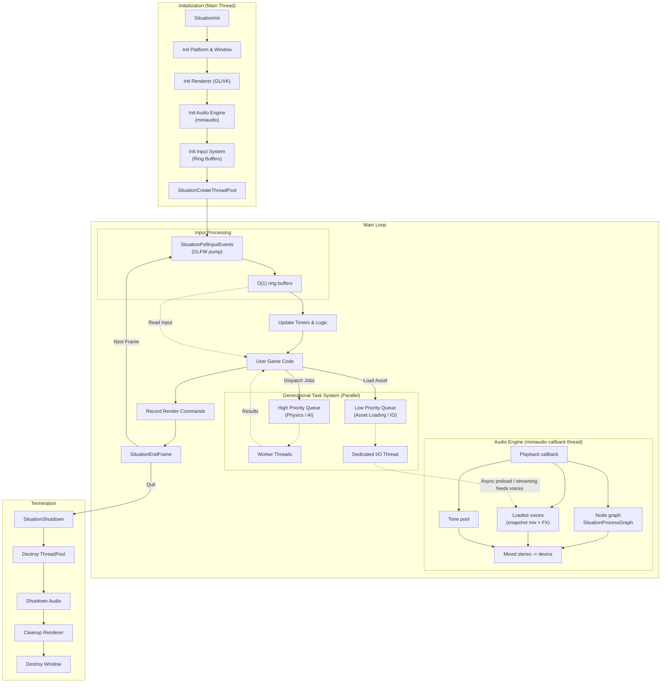
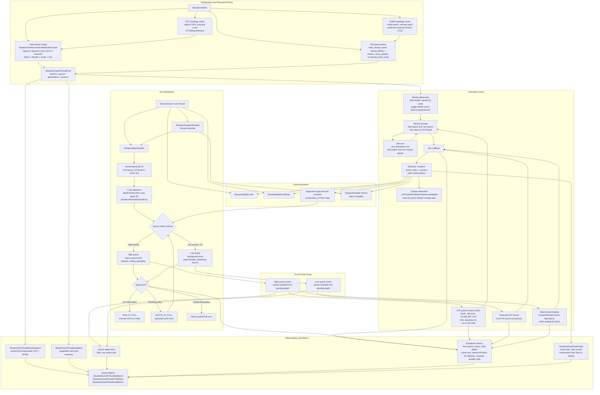
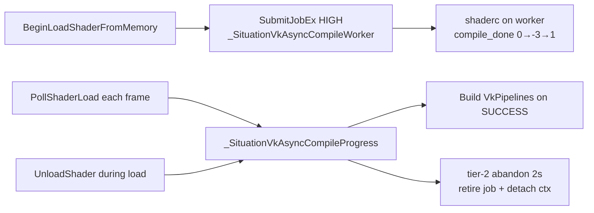
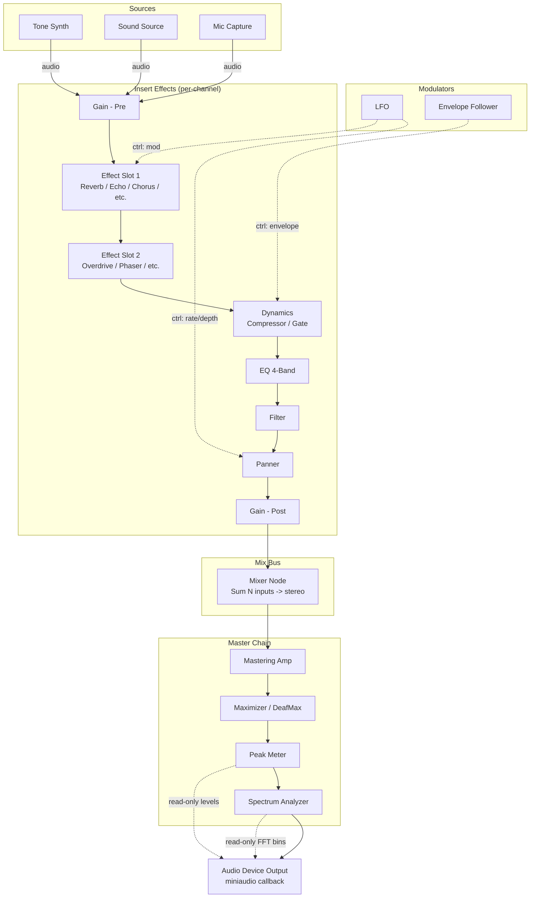
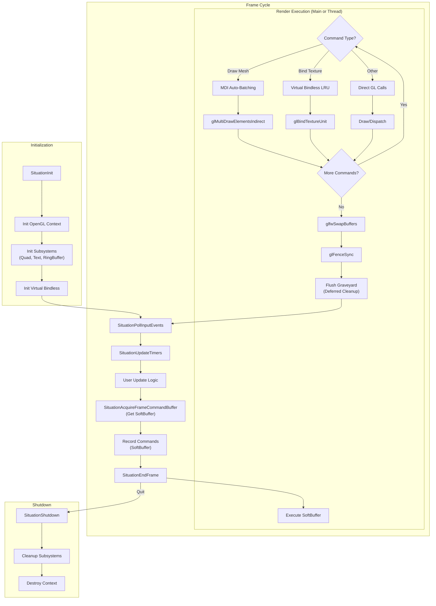
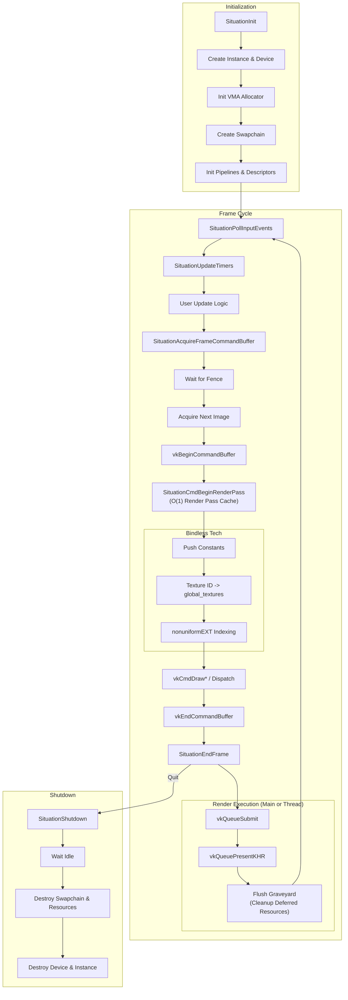

# Situation — Core Concepts & Architecture

This document covers the internal design principles, threading model, audio pipeline, and graphics backend lifecycles of the Situation library. For a getting-started guide and API reference, see [introduction.md](introduction.md).

---

## Table of Contents

- [Design Principles](#design-principles)
- [Global System Architecture](#global-system-architecture)
- [Threading Architecture](#threading-architecture)
- [Async Vulkan Shader Compilation](#async-vulkan-shader-compilation-glsl--spir-v)
- [Audio Node Graph Architecture](#audio-node-graph-architecture)
- [OpenGL 4.6 Backend Lifecycle](#opengl-46-backend-lifecycle)
- [Vulkan 1.4 Backend Lifecycle](#vulkan-14-backend-lifecycle)

---

## Design Principles

The library is built on several core principles to ensure a simple, predictable, and high-performance development experience.

-   **Unified Command Abstraction:** The API exposes a single "Command Buffer" model for rendering.
    -   In **Vulkan**, this maps 1:1 to hardware command buffers for deferred execution.
    -   In **OpenGL**, this acts as a "pass-through" layer, executing commands immediately while maintaining API compatibility.
-   **The "Update-Before-Draw" Contract:** To guarantee identical behavior across backends, you must strictly separate data updates from draw calls within a frame. Always update your buffers/constants *before* recording the draw commands that use them.
-   **Generational Threading Model:**
    -   **Main Thread:** Handles OS Events, Windowing, and Recording Render Commands.
    -   **Task System:** Handles Logic, Physics, and File I/O via **Dual Priority Queues**:
        -   **High Priority:** For frame-critical tasks (Physics, Culling).
        -   **Low Priority:** For streaming (Asset Loading).
-   **Explicit Resource Management:** There is no garbage collector. Every resource created with `SituationCreate...` or `SituationLoad...` returns an opaque handle and **must** be explicitly released with its corresponding `SituationDestroy...` or `SituationUnload...` function.
-   **Three-Phase Frame:** The main loop follows a strict, non-blocking cadence:
    1.  **Input:** `SituationPollInputEvents()` — gathers OS events into thread-safe buffers.
    2.  **Update:** `SituationUpdateTimers()` & User Logic (Physics, AI, Audio triggers).
    3.  **Render:** `SituationAcquireFrameCommandBuffer` → Record Commands → `SituationEndFrame`.

---

## Global System Architecture

This diagram illustrates the high-level flow of the Situation Engine, showing how the main thread coordinates with the parallel task system, audio engine, and I/O subsystems.

**Audio pipeline (Phase H+):** The hardware callback sums **three paths** into one buffer when enabled: **`SituationProcessGraph`** (`active_graph`, optional default graph at init), **`SituationPlayLoadedSound`** / streaming (**`active_voices`** snapshot + per-voice DSP), and **`SituationPlayTone`** (**tone pool**). The legacy console **`SituationAudioMixer`** has been removed in favor of **node graphs**. Details: `doc/plan/AUDIO_NODE_COMPLETION_PLAN.md` § *Canonical miniaudio callback pipeline*.

---

## Threading Architecture

Situation's threading layer is a C11 generational job system with two priority queues, explicit wait semantics, optional CPU/NUMA placement, a dedicated I/O lane, and runtime diagnostics. The queues use a mutex per ring for mutation, while job IDs, state transitions, counters, and queue indices are tracked with atomics.

In practice, use **high priority** for frame-critical jobs that the main thread may help drain during `SituationDispatchParallel`, and **low priority** for background work that can tolerate latency. Use `SituationInitInfo` affinity and NUMA fields only when you need predictable placement; the default path auto-sizes the pool and keeps affinity fail-soft so initialization does not break on restricted systems.

Key implementation details:
- Workers idle via `cnd_timedwait` (1ms cap) rather than an indefinite wait, ensuring they self-wake even if a signal is missed.
- Worker NUMA placement is context-sensitive: on multi-NUMA systems workers spread across NUMA nodes; on single-NUMA systems they pin to distinct physical cores instead.
- Dependency edges are validated with a depth-limited cycle detection DFS (max depth 32) before being committed — jobs exceeding the depth limit are rejected with `SITUATION_ERROR_THREAD_CYCLE`.
- The orphan retirement path (`_SitThreadPoolRetireOrphanedJobMain`) allows the main thread to cleanly retire pool jobs whose work was satisfied out-of-band, used primarily by the async shader compile path.

---

## Async Vulkan Shader Compilation (GLSL → SPIR-V)

Vulkan async GLSL loads run **shaderc on the high-priority thread pool**, then build pipelines on the main thread during poll. Poll and unload share one internal progress driver (v2.4.238+).

**Contract:** call **`SituationPollShaderLoad`** each frame (not during acquire); terminal errors **-99** (lost job) and **-557** (compile timeout) if the compile can never finish. OpenGL uses driver async compile on the host GL context — no thread-pool shaderc job. Details: `doc/situation_sdk.md` §3.3.1 and `doc/plan/ASYNC_SHADER_LOAD_HARDENING_PLAN.md`.

---

## Audio Node Graph Architecture

Conceptual **signal-flow** diagram (channel strip → bus → master → device). Real routing uses the registered node types and **`SituationAudioGraph`** / **`SituationProcessGraph`**; node names are illustrative.

---

## OpenGL 4.6 Backend Lifecycle

The OpenGL backend is designed to be "stateless" from the user's perspective while managing complex state caching internally. It features a "Soft Command Buffer" that records commands for execution either immediately or on a dedicated render thread. Key features include **MDI Auto-Batching** for geometry and **Virtual Bindless** (LRU Slot Management) for texture compatibility.

---

## Vulkan 1.4 Backend Lifecycle

The Vulkan backend is built for high-performance deferred rendering. It uses **Dynamic Descriptor Management** and a **Bindless Architecture** where all textures reside in a global unbound array (`global_textures[]`), indexed via Push Constants. Frame synchronization is handled via fences and semaphores, with a per-frame **Graveyard** for safe resource destruction.

