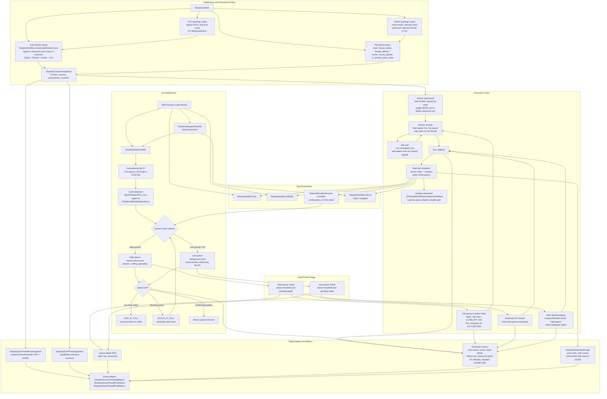
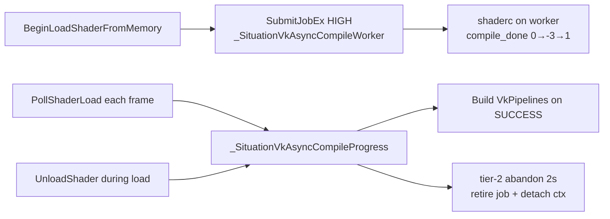
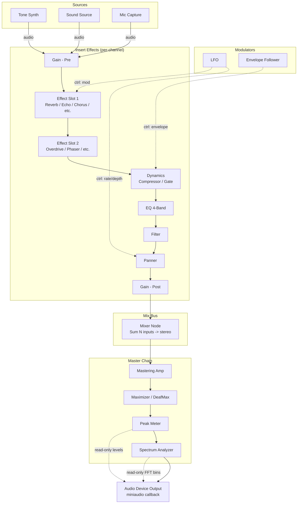
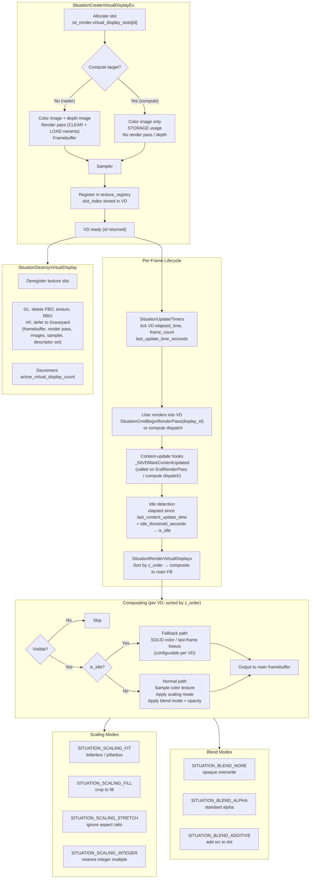
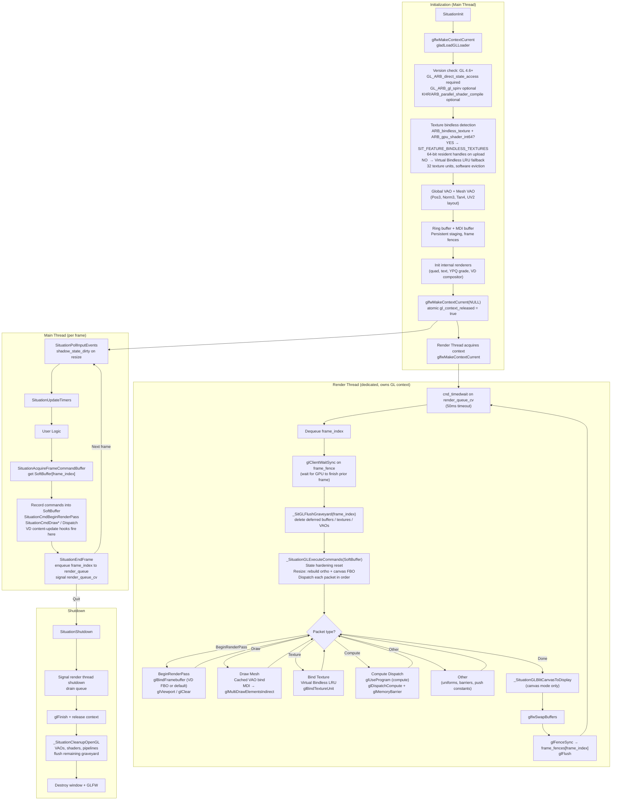

# Situation — Core Concepts & Architecture

This document covers the internal design principles, threading model, audio pipeline, and graphics backend lifecycles of the Situation library. For a getting-started guide and API reference, see [introduction.md](introduction.md).

---

## Table of Contents

- [Design Principles](#design-principles)
- [Global System Architecture](#global-system-architecture)
- [Threading Architecture](#threading-architecture)
- [Async Vulkan Shader Compilation](#async-vulkan-shader-compilation-glsl--spir-v)
- [Audio Node Graph Architecture](#audio-node-graph-architecture)
- [Virtual Display Compositing](#virtual-display-compositing)
- [OpenGL 4.6 Backend Lifecycle](#opengl-46-backend-lifecycle)
- [Vulkan 1.4 Backend Lifecycle](#vulkan-14-backend-lifecycle)

---

## Design Principles

The library is built on several core principles to ensure a simple, predictable, and high-performance development experience.

-   **Unified Command Abstraction:** The API exposes a single "Command Buffer" model for rendering.
    -   In **Vulkan**, this maps 1:1 to hardware command buffers for deferred execution.
    -   In **OpenGL**, this acts as a "pass-through" layer, executing commands immediately while maintaining API compatibility.
-   **The "Update-Before-Draw" Contract:** To guarantee identical behavior across backends, you must strictly separate data updates from draw calls within a frame. Always update your buffers/constants *before* recording the draw commands that use them.
-   **Generational Threading Model:**
    -   **Main Thread:** Handles OS Events, Windowing, and Recording Render Commands.
    -   **Task System:** Handles Logic, Physics, and File I/O via **Dual Priority Queues**:
        -   **High Priority:** For frame-critical tasks (Physics, Culling).
        -   **Low Priority:** For streaming (Asset Loading).
-   **Explicit Resource Management:** There is no garbage collector. Every resource created with `SituationCreate...` or `SituationLoad...` returns an opaque handle and **must** be explicitly released with its corresponding `SituationDestroy...` or `SituationUnload...` function.
-   **Three-Phase Frame:** The main loop follows a strict, non-blocking cadence:
    1.  **Input:** `SituationPollInputEvents()` — gathers OS events into thread-safe buffers.
    2.  **Update:** `SituationUpdateTimers()` & User Logic (Physics, AI, Audio triggers).
    3.  **Render:** `SituationAcquireFrameCommandBuffer` → Record Commands → `SituationEndFrame`.

---

## Global System Architecture

This diagram illustrates the high-level flow of the Situation Engine, showing how the main thread coordinates with the renderer, parallel task system, audio engine, I/O, and hot-reload subsystems.

**Audio pipeline (Phase H+):** The hardware callback sums **three paths** into one buffer: **`SituationProcessGraph`** (active graph), **`SituationPlayLoadedSound`** / streaming (voice snapshots + per-voice DSP), and **`SituationPlayTone`** (tone pool). Details: `doc/plan/AUDIO_NODE_COMPLETION_PLAN.md` § *Canonical miniaudio callback pipeline*.

**Hot-reload** (`SituationCheckHotReloads`) runs in `SituationUpdateTimers` via debounced I/O polling — file modification timestamps are checked on the I/O thread and reloads are dispatched to the render thread for safe GPU synchronization.

**Virtual displays** (`sit_render.virtual_display_slots`) have their timers ticked inside `SituationUpdateTimers` and are composited to the main framebuffer during the render phase. All active VD slots are destroyed during `_SituationCleanupRenderer`.

---

## Threading Architecture

Situation's threading layer is a C11 generational job system with two priority queues, explicit wait semantics, optional CPU/NUMA placement, a dedicated I/O lane, and runtime diagnostics. The queues use a mutex per ring for mutation, while job IDs, state transitions, counters, and queue indices are tracked with atomics.

In practice, use **high priority** for frame-critical jobs that the main thread may help drain during `SituationDispatchParallel`, and **low priority** for background work that can tolerate latency. Use `SituationInitInfo` affinity and NUMA fields only when you need predictable placement; the default path auto-sizes the pool and keeps affinity fail-soft so initialization does not break on restricted systems.

Key implementation details:
- Workers idle via `cnd_timedwait` (1ms cap) rather than an indefinite wait, ensuring they self-wake even if a signal is missed.
- Worker NUMA placement is context-sensitive: on multi-NUMA systems workers spread across NUMA nodes; on single-NUMA systems they pin to distinct physical cores instead.
- Dependency edges are validated with a depth-limited cycle detection DFS (max depth 32) before being committed — jobs exceeding the depth limit are rejected with `SITUATION_ERROR_THREAD_CYCLE`.
- The orphan retirement path (`_SitThreadPoolRetireOrphanedJobMain`) allows the main thread to cleanly retire pool jobs whose work was satisfied out-of-band, used primarily by the async shader compile path.

---

## Async Vulkan Shader Compilation (GLSL → SPIR-V)

Vulkan async GLSL loads run **shaderc on the high-priority thread pool**, then build pipelines on the main thread during poll. Poll and unload share one internal progress driver (v2.4.238+).

**Contract:** call **`SituationPollShaderLoad`** each frame (not during acquire); terminal errors **-99** (lost job) and **-557** (compile timeout) if the compile can never finish. OpenGL uses driver async compile on the host GL context — no thread-pool shaderc job. Details: `doc/situation_sdk.md` §3.3.1 and `doc/plan/ASYNC_SHADER_LOAD_HARDENING_PLAN.md`.

---

## Audio Node Graph Architecture

Conceptual **signal-flow** diagram (channel strip → bus → master → device). Real routing uses the registered node types and **`SituationAudioGraph`** / **`SituationProcessGraph`**; node names are illustrative.

---

## Virtual Display Compositing

A virtual display is an independent offscreen render target — its own framebuffer, color texture, optional depth buffer, and per-display timing state. Up to `SITUATION_MAX_VIRTUAL_DISPLAYS` (32) can coexist. Each is registered in the shared texture registry so its output can be sampled by user shaders or bound to compute dispatches.

**Two creation modes:**
- `SITUATION_VD_FLAG_NONE` — standard rasterisation target. Gets FBO + color texture + depth renderbuffer (GL) or render pass + framebuffer + depth image (VK). Full `SituationCmdBeginRenderPass` / draw / `SituationCmdEndRenderPass` workflow.
- `SITUATION_VD_FLAG_COMPUTE_TARGET` — compute-only target. Color texture has `STORAGE` usage; no depth buffer or render pass is created. Written by compute dispatches, sampled for compositing.

**Key details:**
- VD timers (`elapsed_time`, `frame_count`, `last_update_time_seconds`) are ticked in `SituationUpdateTimers`, not in the render path.
- Content-update tracking is automatic — `_SitVDMarkContentUpdated` fires on `SituationCmdEndRenderPass` (when a draw was recorded) and on compute dispatches that write to the VD's texture slot. The `is_dirty` flag and `last_content_update_time` are set by this hook.
- Idle fallback is per-VD configurable: `SituationSetVirtualDisplayIdleThreshold` (default 1s), `SituationSetVirtualDisplayFallbackMode` (`SOLID` color or last-frame freeze), `SituationSetVirtualDisplayFallbackColor`.
- On Vulkan, destruction defers all GPU resource destruction to the per-frame **Graveyard** to avoid stalling — no `vkDeviceWaitIdle` needed on normal destroy. The Graveyard flushes after `vkQueuePresentKHR`.
- At shutdown, `_SituationCleanupRenderer` iterates all slots and calls `SituationDestroyVirtualDisplay` for any still-active VDs.

---

## OpenGL 4.6 Backend Lifecycle

The OpenGL 4.6 backend requires `GL_ARB_direct_state_access` and enforces a strict version check at init — anything below 4.6 is rejected. It is built around a **Soft Command Buffer** (`SituationGLSoftCommandBuffer`) that records all draw commands on the main thread and dispatches them for execution on the dedicated render thread. The render thread owns the GL context exclusively after init; the main thread releases it via a `gl_context_released` atomic handoff before the render thread acquires it.

Key features:
- **State hardening** — critical GL state is reset at the top of every `_SituationGLExecuteCommands` call, preventing context poisoning from external middleware (ImGui, etc.)
- **Texture Bindless — two-path system** — at init, the library checks for `GL_ARB_bindless_texture` + `GL_ARB_gpu_shader_int64` together. If both are present, `SIT_FEATURE_BINDLESS_TEXTURES` is set: each texture gets a 64-bit resident handle via `glGetTextureHandleARB` / `glMakeTextureHandleResidentARB`, passed to shaders as a `uint64_t` uniform — this is true bindless, equivalent to Vulkan's descriptor indexing. If either extension is missing (common on Intel iGPUs, older AMD/Mesa drivers — `ARB_bindless_texture` was never promoted to GL core), the library falls back to **Virtual Bindless**: a software LRU across 32 texture units (`glBindTextureUnit`), evicting the least-recently-used slot when all units are occupied. Both paths expose the same API (`SituationGetTextureHandle`, `SituationBindTexture`) — user code doesn't change.
- **MDI Auto-Batching** — `glMultiDrawElementsIndirect` for geometry, reducing draw call overhead
- **Per-frame fences** — `glFenceSync` / `glClientWaitSync` for GPU/CPU synchronization, mirroring Vulkan's fence semantics
- **Shadow state + dirty flag** — viewport and ortho projection rebuild on resize is deferred to the render thread via `gl.shadow_state_dirty`
- **Per-frame Graveyard** — deferred buffer/texture/VAO deletion after fence signals, flushed by `_SitGLFlushGraveyard`
- **SPIR-V support** — `GL_ARB_gl_spirv` checked at init; available if present, GLSL fallback otherwise. Async compile via `KHR_parallel_shader_compile` / `ARB_parallel_shader_compile`
- **Canvas** — optional fixed-resolution render target that blits to the window at frame end (`_SituationGLBlitCanvasToDisplay`), enabling integer-scaled retro rendering

Key implementation details:
- The Soft Command Buffer is the fundamental difference from Vulkan — `SituationCmd*` calls on the main thread push packets into `SoftBuffer[frame_index]`; the render thread drains and executes them via `_SituationGLExecuteCommands`. There is no direct GL call on the main thread during recording.
- Context ownership is enforced via an atomic `gl_context_released` flag. The main thread calls `glfwMakeContextCurrent(NULL)` and sets the flag before the render thread starts; the render thread spins on the flag before calling `glfwMakeContextCurrent`. This prevents the race where both threads hold the context.
- State hardening runs unconditionally at the top of every `_SituationGLExecuteCommands` call — depth test, cull face, blend, stencil, and VAO state are all reset to known values. This is what makes the backend resilient to ImGui and other middleware that leave GL state dirty.
- Virtual Bindless (`_SituationVirtualBindlessInit`) initialises the LRU table but the actual path taken at runtime depends on driver capability. When `GLAD_GL_ARB_bindless_texture` and `GLAD_GL_ARB_gpu_shader_int64` are both available, every texture gets a 64-bit resident handle on upload (`glGetTextureHandleARB` + `glMakeTextureHandleResidentARB`) and `SIT_FEATURE_BINDLESS_TEXTURES` is set in `enabled_features_mask` — this is real bindless, same concept as Vulkan's global descriptor array. When either extension is absent (not a core GL feature — Intel iGPU and older Mesa drivers frequently miss it), the library falls back to the LRU unit manager silently. User code is identical in both cases.
- VAO caching (`_SitGLGetCachedVAO`) keys on `SituationMesh` handle — the VAO is created once and reused every frame. Mesh VBOs are shared; the mesh VAO binds them at draw time via DSA (`glVertexArrayVertexBuffer`).
- MDI batching accumulates draw calls into an indirect buffer and flushes with a single `glMultiDrawElementsIndirect` when the batch limit is hit or a state change forces a flush. This mirrors the draw-call reduction strategy of the Vulkan backend.
- The per-frame Graveyard (`_SitGLFlushGraveyard`) runs before executing that frame's commands, not after present. This means resources from 2 frames ago are freed, matching the in-flight frame count fence semantics.
- Canvas mode (`_SituationGLEnsureCanvasResources` / `_SituationGLBlitCanvasToDisplay`) renders to a fixed-resolution FBO and stretches to the window at frame end. When inactive, rendering goes directly to the default framebuffer.

---

## Vulkan 1.4 Backend Lifecycle

The Vulkan 1.4 backend requires bindless texture support (`VK_EXT_descriptor_indexing` / `VK_DESCRIPTOR_BINDING_PARTIALLY_BOUND_BIT`) — devices that don't support it are rejected at init. Like the GL backend, it runs a dedicated render thread that dequeues frames from a ring buffer. Unlike GL, command recording happens on the **main thread** directly into `VkCommandBuffer`s, with the render thread only responsible for `vkQueueSubmit` + `vkQueuePresentKHR` + Graveyard flush.

Key features:
- **True Bindless** — a global `VkDescriptorSet` backed by a `SITUATION_MAX_TEXTURES`-element `COMBINED_IMAGE_SAMPLER` array with `UPDATE_AFTER_BIND`. Texture IDs are passed via Push Constants and indexed with `nonuniformEXT` in shaders
- **VMA** — all GPU memory (images, buffers, staging) allocated through Vulkan Memory Allocator
- **Dynamic Descriptor Manager** — growing pool chain (`VK_DESCRIPTOR_POOL_CREATE_FREE_DESCRIPTOR_SET_BIT`), no fixed descriptor limits
- **Per-frame Graveyards** — deferred resource destruction (buffers, images, pipelines, descriptor sets, framebuffers, render passes); flushed by the render thread after the frame fence signals
- **Dynamic frame count** — `max_frames_in_flight` is negotiated against swapchain `minImageCount` at init; capped to `SITUATION_MAX_FRAMES_IN_FLIGHT`
- **Dual command buffers per frame** — one graphics `VkCommandBuffer`, one compute `VkCommandBuffer`; both begun at acquire time
- **Compute/graphics sync semaphore** — if compute writes data consumed by draw (indirect draw, vertex input), a `compute_finished_semaphore` is added to the submit wait list via `needs_compute_wait[frame_index]`
- **O(1) Render Pass Cache** — `_SituationVulkanGetOrCreateRenderPass` hashes `SituationRenderPassInfo` to avoid recreating render passes each frame
- **Swapchain recovery** — `VK_ERROR_OUT_OF_DATE_KHR` / `VK_SUBOPTIMAL_KHR` on present triggers `recreate_swapchain_request` (atomic); recreation runs at the top of the next acquire
- **Persistent staging ring** — mapped CPU→GPU buffer for texture uploads, avoids `vkDeviceWaitIdle` during streaming
- **Per-frame dynamic VBO** — 512 KB persistently-mapped `CPU_TO_GPU` vertex buffer per frame for text/quad/UI geometry
- **Per-frame UBO** — persistently-mapped `ViewDataUBO` (view/projection matrices) updated by the main thread before submit
- **Screenshot pipeline** — staging buffer allocated on-demand; copy recorded into the command buffer; CPU readback resolved after the frame fence on the main thread

```mermaid
graph TD
    subgraph Init ["Initialization (Main Thread)"]
        I1["SituationInit"]
        I2["CreateInstance + Debug Messenger<br/>CreateSurface (GLFW KHR)"]
        I3["PickPhysicalDevice<br/>Require bindless + VK 1.4<br/>FindQueueFamilies (graphics / compute / present)"]
        I4["CreateLogicalDevice<br/>Enable: descriptor_indexing, dynamic_rendering,<br/>synchronization2, maintenance4, etc."]
        I5["CreateAllocator (VMA)"]
        I6["Negotiate frame count<br/>min(desired, swapchain.minImageCount)<br/>Alloc per-frame arrays (graveyards, fences,<br/>semaphores, cmd buffers, UBOs, VBOs)"]
        I7["CreateSwapchain + ImageViews<br/>CreateRenderPass + DepthResources<br/>CreateFramebuffers"]
        I8["Descriptor infrastructure<br/>Persistent pool + dynamic manager<br/>Layouts: UBO, SSBO, bindless, sampler,<br/>storage image, dynamic UBO, VD composite<br/>Global bindless set (UPDATE_AFTER_BIND)"]
        I9["Per-frame UBOs + dynamic VBOs<br/>(persistently mapped CPU_TO_GPU)"]
        I10["Pipeline layouts<br/>_SituationVulkanInitComputeLayouts<br/>_SituationVulkanInitGraphicsSpirvLayouts"]
        I11["Internal renderers<br/>(quad, text, YPQ grade, VD compositor)<br/>(requires SITUATION_ENABLE_SHADER_COMPILER)"]
        I12["Staging ring buffers<br/>Screenshot mutex + resources"]
        I13["Render Thread starts<br/>pins to logical core 1 (configurable)"]
    end

    subgraph MainThread ["Main Thread (per frame)"]
        M1["SituationPollInputEvents<br/>Vulkan async shader poll<br/>framebuffer_resized check"]
        M2["SituationUpdateTimers<br/>VD timers, hot-reload"]
        M3["User Logic"]
        M4["SituationAcquireFrameCommandBuffer<br/>① vkWaitForFences (frame_index fence)<br/>② Swapchain resize check (recreate if needed)<br/>③ vkAcquireNextImageKHR → acquired_image_indices<br/>④ vkResetFences<br/>⑤ vkResetCommandBuffer<br/>⑥ vkBeginCommandBuffer (graphics + compute)"]
        M5A["SituationCmdBeginRenderPass<br/>→ O(1) render pass cache lookup<br/>→ vkCmdBeginRenderPass (inline, no queue)"]
        M5B["SituationCmdDraw* / CmdDrawMesh<br/>→ vkCmdBindPipeline<br/>→ vkCmdPushConstants (texture slot IDs)<br/>→ vkCmdBindVertexBuffers / vkCmdBindIndexBuffer<br/>→ vkCmdDrawIndexed / vkCmdDrawIndirect"]
        M5C["SituationCmdDispatchCompute<br/>→ vkCmdBindPipeline (compute)<br/>→ vkCmdDispatch<br/>sets needs_compute_wait[frame_index]"]
        M5D["SituationRenderVirtualDisplays<br/>→ vkCmdBeginRenderPass (VD framebuffer)<br/>→ vkCmdBindPipeline (VD compositor)<br/>→ vkCmdDraw (fullscreen quad)"]
        M5E["SituationCmdEndRenderPass<br/>→ vkCmdEndRenderPass<br/>VD content-update hook fires"]
        M6["SituationEndFrame<br/>vkEndCommandBuffer (graphics + compute)<br/>Update dynamic VBO + UBO<br/>Enqueue frame_index → render_queue<br/>signal render_queue_cv"]
    end

    subgraph RenderThread ["Render Thread (dedicated)"]
        RT1["cnd_timedwait 50ms<br/>on render_queue_cv"]
        RT2["Dequeue frame_index"]
        RT3["vkQueueSubmit<br/>Wait: image_available_semaphore<br/>+ compute_finished_semaphore (if needs_compute_wait)<br/>Signal: render_finished_semaphore<br/>Fence: in_flight_fences[frame_index]"]
        RT4["_SituationVulkanWaitFencePumpWindow<br/>(pump window events while waiting)"]
        RT5["vkQueuePresentKHR<br/>Wait: render_finished_semaphore<br/>On OUT_OF_DATE → set recreate_swapchain_request"]
        RT6["Graveyard flush<br/>_SitFlushFrameResources(frame_index)<br/>via frame_refcount reaching 0<br/>(destroy deferred: images, buffers,<br/>pipelines, descriptor sets, render passes)"]
        RT7["Record metrics<br/>submit → present latency histogram"]
        RT8["Signal main_wait_cv<br/>(unblock SituationEndFrame backpressure)"]

        RT1 --> RT2 --> RT3 --> RT4 --> RT5 --> RT6 --> RT7 --> RT8 --> RT1
    end

    subgraph Bindless ["Bindless Texture System"]
        BL1["Texture registered in texture_registry<br/>slot_index = handle"]
        BL2["vkUpdateDescriptorSets → global_bindless_set<br/>(binding 0, array element = slot_index)"]
        BL3["Draw: Push Constants carry texture slot IDs"]
        BL4["GLSL: layout(set=N) sampler2D textures[]<br/>texture(textures[nonuniformEXT(id)], uv)"]

        BL1 --> BL2 --> BL3 --> BL4
    end

    subgraph Swapchain ["Swapchain Recovery"]
        SC1["framebuffer_resized flag set<br/>(GLFW callback or acquire result)"]
        SC2["_SituationVulkanRecreateSwapchain<br/>at top of next AcquireFrameCommandBuffer"]
        SC3["Destroy old swapchain resources<br/>Recreate: swapchain, image views,<br/>depth, framebuffers"]

        SC1 --> SC2 --> SC3
    end

    subgraph Exit ["Shutdown"]
        E1["SituationShutdown"]
        E2["Signal render thread shutdown<br/>drain render_queue"]
        E3["vkDeviceWaitIdle"]
        E4["_SituationCleanupVulkan<br/>Flush all graveyards<br/>Destroy: swapchain, pipelines,<br/>descriptor pools, images, buffers,<br/>sync objects, command pool, VMA, device, instance"]
        E5["Destroy window + GLFW"]
    end

    I1 --> I2 --> I3 --> I4 --> I5 --> I6 --> I7 --> I8 --> I9 --> I10 --> I11 --> I12 --> I13
    I13 --> RT1
    I12 --> M1
    M1 --> M2 --> M3 --> M4 --> M5A --> M5B --> M5C --> M5D --> M5E --> M6
    M6 -- "Next frame" --> M1
    M6 -- "Quit" --> E1
    E1 --> E2 --> E3 --> E4 --> E5
    M4 -. "resize detected" .-> Swapchain
    M5B -. "texture bind" .-> Bindless
```

Key implementation details:
- The render thread does **not** record commands — it only submits and presents. All `vkCmd*` calls happen on the main thread inside `SituationCmdBeginRenderPass` / `SituationCmdDraw*` / `SituationEndFrame`.
- `vkWaitForFences` is called at `SituationAcquireFrameCommandBuffer` on the **main thread**, not the render thread. The render thread separately calls `_SituationVulkanWaitFencePumpWindow` after submit to pump window events while waiting for GPU completion before present.
- Swapchain recreation is deferred — the `framebuffer_resized` atomic flag is set in the GLFW resize callback or on `VK_SUBOPTIMAL_KHR` present result, and the actual recreation happens at the top of the next `SituationAcquireFrameCommandBuffer` call.
- The compute semaphore path (`needs_compute_wait`) is per-frame: set when `SituationCmdDispatchCompute` writes results that will be consumed by a subsequent draw (indirect draw buffer, vertex input). Cleared after submit.
- Frame refcounts gate Graveyard flush — the count starts at 1 when a frame is enqueued and is decremented by the render thread after present. When it reaches 0, `_SitFlushFrameResources` runs, destroying all deferred resources for that frame slot.
