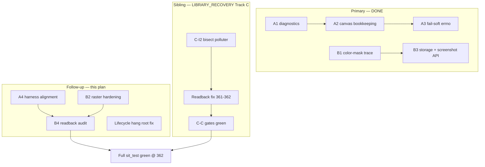

# Canvas Stretch & Storage Readback Fix Plan

**Date**: 2026-06-20  
**Status**: ✅ **ARCHIVED** — primary bugs @ v2.4.328; Track C sibling closed @ v2.4.362; full suite GL+VK green  
**Last updated**: 2026-06-25 (v2.4.362 — moved to `doc/done/`)  
**Priority**: **HIGH** (harness regressions on reference OpenGL CI machine)  
**Primary files**: `sit/situation_impl_renderer.h`, `sit/situation_impl_wdm.h`, `sit/situation_impl_input.h`, `tests/harness/test_output_color_depth.c`, `tests/harness/test_graphics.c`

---

## Plan status at a glance

| Tier | Scope | Status |
|------|-------|--------|
| **Primary** | Bug A (`monitor_hot_swap_recreate`) + Bug B (`texture_storage_write_readback`) | **DONE** (v2.4.320–322, v2.4.328) |
| **Follow-up (this plan)** | Hardening A4, B2, B4 optional; lifecycle hang root fix | **Mostly optional** — library readback fixed @ 362 |
| **Sibling plans** | OpenGL VD order failures, full-suite release gate | **CLOSED @ 362** — [`LIBRARY_RECOVERY_PLAN_244.md`](../plan/LIBRARY_RECOVERY_PLAN_244.md) Track C |
| **Out of scope** | Async shader, HDR/10-bit opt-in | See §Out of scope |

**Do not read the header alone.** Primary bugs are fixed. **Full `sit_test_opengl.exe` + VK green @ v2.4.362** (user verified).

### Definition of done

**Primary (shipped):**

- [x] `output_color_depth.monitor_hot_swap_recreate` passes on dual-monitor reference machine
- [x] `graphics.texture_storage_write_readback` passes in full `graphics` module (110/110 @ v2.4.328)
- [x] No `-502` from canvas FBO path during monitor hot-swap stress

**This plan fully closed (optional hardening + hygiene):**

- [ ] All items in §Follow-up checklist checked

**Full OpenGL harness green (cross-plan):**

- [x] [`LIBRARY_RECOVERY_PLAN_244.md`](../plan/LIBRARY_RECOVERY_PLAN_244.md) Track C **C-C1 … C-C9** — **@ v2.4.362**
- [x] Full OpenGL + Vulkan suite green — **@ v2.4.362** (user verified)

---

## Related plans (dependency map)

Work mentioned in this document but **not owned here**:

| Topic | Owner plan | Status @ 362 |
|-------|------------|--------------|
| OpenGL VD order-dependent failures | [`LIBRARY_RECOVERY_PLAN_244.md`](../plan/LIBRARY_RECOVERY_PLAN_244.md) Track C | **Closed** — readback @ 361–362 |
| `vd_idle_pattern_standby` / SMPTE full-suite failures | Recovery plan P2/P3 | **Closed** — same readback class |
| VD idle compositor / content-update FSM | [`VIRTUAL_DISPLAY_UPDATE_DETECTION_PLAN.md`](VIRTUAL_DISPLAY_UPDATE_DETECTION_PLAN.md) | No FSM bug found — pixels were stale |
| Vulkan async shader / shutdown | [`ASYNC_SHADER_LOAD_HARDENING_PLAN.md`](../plan/ASYNC_SHADER_LOAD_HARDENING_PLAN.md) | Explicitly out of scope below |
| Errno taxonomy (`-502`, `-215`, …) | [`renderer_bolster_plan.md`](../plan/renderer_bolster_plan.md) | Reference only |

**Rule:** Bisect and library fixes for VD pixel failures happen in **LIBRARY_RECOVERY Track C**, not duplicated here. This plan lists VD only as **context** (same harness run) and **harness hygiene** (screenshot API) that unblocks bisect.

---

## Executive summary

Two harness failures were traced to **library behavior**, not flaky hardware:

| Test | Symptom | errno | Library locus | Fix |
|------|---------|-------|---------------|-----|
| `output_color_depth.monitor_hot_swap_recreate` | `SituationEndFrame()` fails on first solid-color frame after resize + reposition to secondary monitor | `-502` (`SITUATION_ERROR_RENDER_COMMAND_FAILED`) | `_SituationGLEnsureCanvasResources()` during `SIT_OP_BEGIN_RENDER_PASS` execute | **Bug A** — v2.4.320–322 |
| `graphics.texture_storage_write_readback` | Center pixel R=0 while G≈141, B≈175 (expected ~128 each) | assertion | Stale `screenshot_buffer` from prior test | **Bug B** — v2.4.328 |

Both issues are **reproducible** on dual 2560×1440 monitors + GTX 1070. Neither is an HDR/10-bit opt-in failure (those tests correctly skip without env vars).

**Scope note:** Bug A canvas bookkeeping is **backend-agnostic** (`situation_impl_wdm.h`). Bug B readback hygiene is OpenGL-specific for the screenshot buffer; Vulkan is unaffected by stale GL screenshot state.

---

## Reproduction matrix

*Verified on reference machine (dual 2560×1440, GTX 1070, v2.4.327+) unless noted.*

| Command | `monitor_hot_swap_recreate` | `texture_storage_write_readback` |
|---------|----------------------------|----------------------------------|
| Full `sit_test_opengl.exe` | **PASS** (v2.4.320+) | **PASS** (v2.4.328; graphics module 110/110) |
| `--module output_color_depth` | **PASS** | — |
| `--module output_color_depth --filter monitor_hot_swap` | **PASS** (was FAIL 10/10 pre-v2.4.320) | — |
| `--module graphics` (full module) | — | **PASS** (110/110, v2.4.328) |
| `--filter texture_storage_write_readback` (isolated) | — | **PASS** |
| `--filter compute_image_write` (isolated) | — | **PASS** |
| `--module virtual_display` (full module) | — | — (4 FAIL @ v2.4.346 — **Track C**, not Bug B) |

**Confirmed error message** (monitor hot-swap, via `SituationGetLastErrorMsg`):

```text
Command failed to be recorded to command buffer: SIT_OP_BEGIN_RENDER_PASS: canvas FBO creation failed.
```

**Confirmed pixel dump** (storage readback, full graphics module, pre-fix):

```text
center (512,384) RGBA=(0, 141, 175, 255)  screen=1024×768
```

---

## Bug A — Canvas FBO creation fails during monitor hot-swap (`-502`) — PRIMARY DONE

### Symptoms

- Failure occurs inside `sit_test_render_solid_clear()` → `SituationEndFrame()` (line 79 in `test_output_color_depth.c`).
- Often preceded by `[STUTTER]` spikes on first frames after window move (timing noise, not root cause).
- Test sequence: resize 640×480 → move to secondary monitor → render → `SituationSetWindowMonitor` (exclusive fullscreen) → toggle fullscreen → return to primary.

### Root cause (confirmed)

1. **Exclusive fullscreen canvas stretch** (`_SituationRenderCanvasStretchActive` in `situation_impl_wdm.h`) activates when `glfwGetWindowMonitor != NULL` and render canvas size differs from display present size.
2. On stretch, OpenGL renders into an offscreen canvas FBO, then blits to the default framebuffer before swap.
3. FBO creation failure **pre-v2.4.320** returned hard `-502`. **v2.4.320 A1** added diagnostics; **v2.4.322** fail-soft uses `SITUATION_ERROR_DISPLAY_MODE_SETTLING` (-215).
4. Trigger: display topology changes before hot-swap stress completes; `SituationSetWindowMonitor` lacked canvas bookkeeping.

### Why Vulkan survives today (latent bug — closed by A2)

Vulkan's lazy swapchain recreation masked stale `render_canvas_*` until A2 shared fix in `situation_impl_wdm.h`.

### Fix strategy (landed)

#### Phase A1 — Diagnostics

- [x] In `_SituationGLEnsureCanvasResources`, on FBO failure log: `cw`, `ch`, display size, `render_canvas_*`, monitor state, `glGetError()`, FBO status
- [x] Gate verbose logs behind existing debug/trace hooks

#### Phase A2 — Canvas bookkeeping on monitor changes (shared — both backends)

- [x] Audit all `glfwSetWindowMonitor` paths; identify `SituationSetWindowMonitor` as root cause
- [x] Capture windowed framebuffer into `render_canvas_*` before exclusive fullscreen in `SituationSetWindowMonitor`
- [x] After monitor change + poll, ensure main window and canvas dimensions stable before next acquire

#### Phase A3 — Resilience at execute time

- [x] Fail-soft to default FBO (FBO 0) when canvas FBO creation fails instead of hard `-502`
- [x] Set **`SITUATION_ERROR_DISPLAY_MODE_SETTLING` (-215)** on fail-soft; clear when canvas succeeds
- [x] Emergency path: stretch active but FBO unavailable → direct default-FBO render + `shadow_state_dirty`

#### Phase A4 — Harness alignment (follow-up — optional hardening)

- [ ] After `SituationSetWindowSize` / `SituationSetWindowPosition` in harness, pump until `SituationGetRenderWidth/Height` stable (reuse `sit_test_force_render_resolution` discard-frame pattern)
- [ ] Add harness comment in `test_monitor_hot_swap_recreate`: `SituationSetWindowMonitor` enters **exclusive fullscreen** on the target monitor (not merely "move window")

### Acceptance criteria (Bug A)

- [x] `output_color_depth.monitor_hot_swap_recreate` passes 10/10 on dual-monitor reference machine
- [x] No `-502` from canvas FBO path during test's first solid-color frames after reposition
- [x] Full `sit_test_opengl.exe`: module `output_color_depth` green

---

## Bug B — Storage texture readback loses red channel — PRIMARY DONE

### Symptoms

- `texture_storage_write_readback` fails on `pixels[pidx] > 80` (R channel).
- Observed RGBA at screen center: **(0, 141, 175, 255)** — G and B consistent with gradient; **R stuck at clear value 0**.
- Order-dependent: passes isolated; fails after ~109 tests in full `graphics` module.

### Root cause (confirmed 2026-06-22)

1. **B1 ruled out** color-mask leak at `SIT_OP_DRAW_QUAD` execute.
2. **Compute path correct** — GPU storage image had all channels.
3. **Actual bug:** stale `screenshot_buffer` when `SituationLoadImageFromScreen()` ran after `EndFrame()` without fresh pre-swap capture on the render thread.

4. **Extended fix @ v2.4.362:** always pre-swap capture on every `EndFrame`; invalidate cache on render-thread handoff; `CreateReadbackBuffer` binds loader GL context; `CopyBuffer` fallback on render thread. **`EndFrame` → `Load` is the supported app pattern** — explicit `RequestScreenCapture()` optional.
4. Symptom RGBA matched the **left column** of an old gradient frame, not the current draw.

### Fix (landed)

- [x] **`SituationRequestScreenCapture()`** — new API; arms pre-swap capture on next `EndFrame`
- [x] **`SituationAcquireFrameCommandBuffer`** — clears `screenshot_valid` each frame (OpenGL)
- [x] **`test_texture_storage_write_readback`** — calls `SituationRequestScreenCapture()` before draw `EndFrame`
- [x] **B3 hardening kept:** storage prepare before sampled draw, image unbind, barriers, render-dimension dest helper

### Fix strategy detail

#### Phase B1 — Confirm color-mask hypothesis

- [x] Add `SIT_TEST_DEBUG_GL=1` trace for `GL_COLOR_WRITEMASK` at textured `SIT_OP_DRAW_QUAD`
- [x] Run full `graphics` module with trace — **no `[B1 DIAG]` lines**; mask always all TRUE
- [x] Conclude: root cause is readback hygiene (B3/B4), not color-mask leak at draw time

#### Phase B2 — Raster state hardening (defense-in-depth — follow-up)

- [x] `glDisable(GL_SCISSOR_TEST)` in baseline raster state and `SIT_OP_BEGIN_RENDER_PASS`
- [x] Unconditional `glUseProgram(quad)` at textured draw batch entry
- [x] UV scale sanity + object-color leak guard at `SIT_OP_DRAW_QUAD` execute
- [ ] Add harness regression: textured draw after `push_pop_raster_color_mask` verifies all channels (not just mask API)
- [ ] In `test_color_write_mask_blocks_red`, explicitly restore full color write mask before any subsequent draw in same test (defense-in-depth; test already passes)

#### Phase B3 — Compute → graphics storage sampling + readback hygiene (OpenGL)

- [x] `_SituationGLPrepareStorageTextureForSampling` before textured draw
- [x] Track `texture_slot_index` in draw packet; image binding unit on storage bind
- [x] Unbind image units 0–7 at main-window render-pass start
- [x] Pipeline barrier: compute-write src + `GL_TEXTURE_UPDATE_BARRIER_BIT` on fragment-read dst
- [x] **`SituationRequestScreenCapture()` + per-frame `screenshot_valid` invalidation**
- [x] `sit_test_full_window_dest()` uses render (not client) dimensions

#### Phase B4 — Harness readback robustness (optional @ 362)

Library fix @ 362 makes B4 **optional** — harness `RequestScreenCapture()` calls are no longer required for correctness.

- [x] `test_texture_storage_write_readback`: `SituationRequestScreenCapture()` before draw `EndFrame` (v2.4.328)
- [ ] Optional: shared helper `graphics_test_read_center_pixel_rgba` — Request before read (redundant post-362)
- [ ] Optional: audit remaining harness readback call sites

### Acceptance criteria (Bug B)

- [x] `graphics.texture_storage_write_readback` passes in **full** `graphics` module run (110/110 @ 2026-06-22)
- [x] Full `sit_test_opengl.exe`: **graphics module green** on reference machine
- [x] No new failures in `color_write_mask_blocks_red`, `push_pop_raster_color_mask`, `compute_image_write`, `texture_cpu_gpu_cpu_roundtrip`

---

## Follow-up checklist

Optional hardening only — **release gate satisfied @ v2.4.362**.

### Screenshot readback hygiene (B4)

- [x] Library: always pre-swap capture + RT handoff invalidation — **v2.4.362**
- [ ] Optional harness audits (redundant for correctness post-362)

### Harness alignment (A4)

- [ ] Stable-size pump after window size/position changes in hot-swap test
- [ ] Document exclusive-fullscreen semantics of `SituationSetWindowMonitor` in harness

### Raster hardening (B2)

- [ ] Push/pop raster textured channel regression test
- [ ] Explicit mask restore in `color_write_mask_blocks_red`

### Teardown / leak warnings

- [ ] Identify source of "Leaked Texture / Compute Pipeline" warnings at `graphics` module teardown (likely `demon_hunt_sky_spirv_begin_poll` or similar)
- [ ] Ensure teardown destroys compute pipeline + storage texture for that test path
- [ ] Confirm zero new leak warnings vs baseline after fix

### Multi-monitor fullscreen lifecycle hang (OpenGL)

*Discovered during Bug A work — mitigated in v2.4.320–323, root cause open.*

- [x] Harness exits fullscreen + settling frames before `output_color_depth` teardown
- [x] `_SituationCleanupRenderer` releases exclusive mode via `glfwSetWindowMonitor(NULL, …)` before GL teardown
- [x] Errno guards: `FULLSCREEN_RELEASE_FAILED`, `CONTEXT_RECLAIM_FAILED`, `SHUTDOWN_INCOMPLETE`, `INIT_STALE_DRIVER_STATE`
- [x] Removed obsolete `Sleep(50)` teardown delays (v2.4.323)
- [x] Full suite **completes** (no cross-module init hang in normal suite order @ v2.4.327)
- [ ] Reproduce and document minimal sequence for ACCESS_VIOLATION if `glfwPollEvents()` after mode release (NVIDIA `WM_DISPLAYCHANGE`)
- [ ] Reproduce isolated `--filter vd_offset_position` hang after prior suite — **likely obsolete @ 362**; file triage only if repro returns
- [ ] Root-fix driver/GLFW lifecycle: verify `SituationInit` after exclusive-fullscreen module without harness workarounds

### Informational (no code gate)

- [ ] Optional: tune `[STUTTER]` log threshold separately (informational only)
- [x] HDR/10-bit skipped tests — expected without `SIT_TEST_HDR` / `SIT_TEST_10BIT` (no action)

---

## OpenGL virtual_display — **CLOSED @ v2.4.362** (was Track C)

Failures @ 346 were **readback race**, not compositor offset/FSM. **`--module virtual_display` 34/34** @ 362; full suite GL+VK green.

Historical (@ 346): `--module virtual_display` was 28/32; `--filter vd_offset_position` passed in isolation.

**Owner:** [`LIBRARY_RECOVERY_PLAN_244.md`](../plan/LIBRARY_RECOVERY_PLAN_244.md) Track C — **closed @ 362**. Siamese S2 colocation (`vd.h`) was mechanical only.

- [x] **C-I2 … C-C6** — readback fix @ v2.4.361–362
- [ ] Optional harness `RequestScreenCapture` audit — not required for green suite

---

## Implementation order



**Recommended sequence for follow-up**

1. **Siamese S3→S4** — renderer colocation (see SIAMESE plan)
2. **A4 + B2** — optional harness polish
3. **Lifecycle hang** — only if repro reappears

---

## Test plan

### Primary regressions (must stay green)

```powershell
Set-Location "C:\Users\User\Desktop\hobby\_kiro\situation\build"
$env:PATH = "dll;C:\msys64\mingw64\bin;$env:PATH"

& ".\tests\sit_test_opengl.exe" --module output_color_depth --filter monitor_hot_swap
& ".\tests\sit_test_opengl.exe" --module graphics --filter texture_storage_write_readback
& ".\tests\sit_test_opengl.exe" --module output_color_depth
& ".\tests\sit_test_opengl.exe" --module graphics
```

### Follow-up verification

```powershell
# After B4 helper change
& ".\tests\sit_test_opengl.exe" --module graphics --filter "color_write_mask|push_pop_raster|compute_image|texture_cpu_gpu"

# B1 diagnostic (optional)
$env:SIT_TEST_DEBUG_GL = "1"
& ".\tests\sit_test_opengl.exe" --module graphics

# VD — closed @ 362
& ".\run_tests.bat" opengl --headless --module virtual_display   # 34/34

# Full suite — release gate
& ".\run_tests.bat" opengl --headless
& ".\run_tests.bat" vulkan --headless
```

### Vulkan smoke (A2 shared fix — no regression)

```powershell
& ".\tests\sit_test_vulkan.exe" --module output_color_depth --filter monitor_hot_swap
& ".\tests\sit_test_vulkan.exe" --module graphics --filter texture_storage_write_readback
```

**Hardware matrix** (minimum):

- Dual monitor, Windows 10, NVIDIA GTX 1070 class (repro machine)
- Single monitor smoke (monitor test should skip; storage test should pass)

---

## References

- Canvas stretch design: `doc/UPDATELOG.md` (v2.4.223 OpenGL canvas FBO / blit notes)
- Errno taxonomy: `doc/plan/renderer_bolster_plan.md` (`SITUATION_ERROR_RENDER_COMMAND_FAILED` = -502)
- Full-suite recovery gate: `doc/plan/LIBRARY_RECOVERY_PLAN_244.md` (Track C closed @ 362)
- VD idle / compositor: `doc/plan/VIRTUAL_DISPLAY_UPDATE_DETECTION_PLAN.md`
- Related passing test: `test_compute_image_write` — graceful black-center skip (`test_graphics.c` ~3457)
- Historical triage: `doc/done/LIBRARY_BUGFIX_PLAN.md`

---

## Out of scope

- [x] Documented: Vulkan async shader failures — [`ASYNC_SHADER_LOAD_HARDENING_PLAN.md`](../plan/ASYNC_SHADER_LOAD_HARDENING_PLAN.md)
- [x] Documented: HDR/10-bit opt-in tests (correctly skipped without env vars)
- [x] Documented: Render-thread-specific bugs in modules that run before `output_color_depth`

---

## Backend coverage summary

| Fix phase | OpenGL | Vulkan | Notes |
|-----------|--------|--------|-------|
| A1 (diagnostics) | Yes | N/A | GL-specific debug info |
| A2 (canvas bookkeeping) | **Fixes active failure** | **Closes latent edge case** | Shared `situation_impl_wdm.h` |
| A3 (execute-time fail-soft) | Yes | N/A | GL-specific; Vulkan lazy recreate covers equivalent |
| A4 (harness alignment) | Follow-up | Same test code | Shared harness |
| B1 (confirm color mask) | Done | N/A | Ruled out as root cause |
| B2 (raster hardening) | Follow-up | N/A | Vulkan immune (per-pipeline state) |
| B3 (storage + screenshot) | Done | N/A | GL-only barriers; VK layout transitions |
| B4 (harness readback) | Follow-up | Same test code | Shared harness |
| VD compositor (Track C) | **Closed @ 362** | Green | Readback fix, not compositor |
