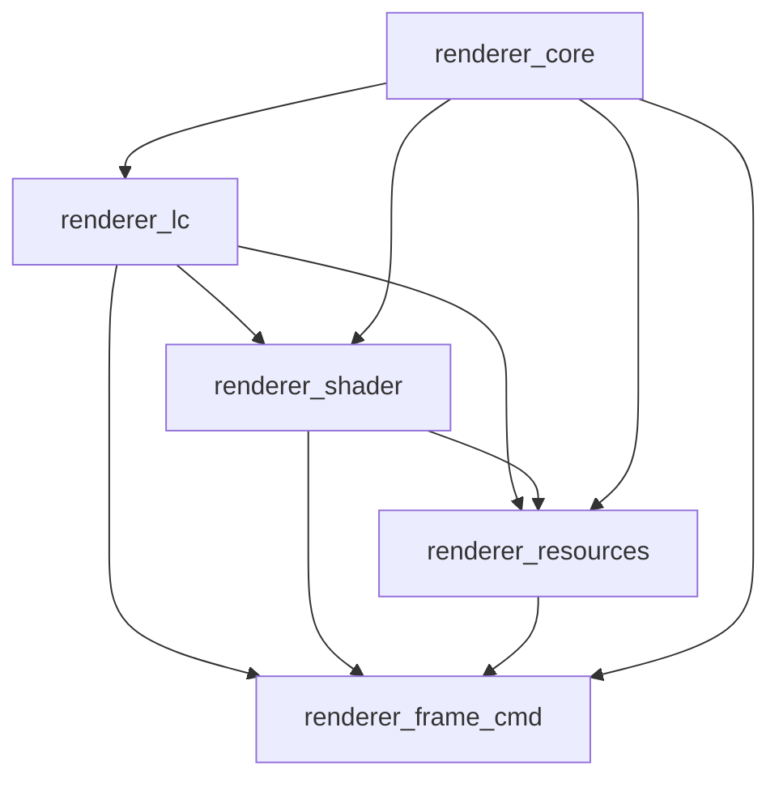

# Renderer Modularization Plan — Second-Level Split

| Field | Value |
|-------|--------|
| **Status** | ✅ **COMPLETE (archived)** — shipped **v2.4.360** (2026-06-25) · [`doc/done/`](../done/) |
| **Outcome** | 28,105-line monolith → **23-line orchestrator** + **5 domain slices** (**31,000** impl LOC); **347/347** fwd gate green |
| **Release** | [`doc/updatelog_24_04.md`](../updatelog_24_04.md#v24360---2026-06-25) · [`doc/architecture.md`](../architecture.md#renderer-module-layout-v24360) |
| **Supersedes** | Monolith-era edits to `situation_impl_renderer.h` — use slice paths below |

**Goal (achieved):** split `sit/situation_impl_renderer.h` into **reviewable domain slices** without changing public API, build topology, runtime behaviour, or the single-TU header-only model.  
**Constraint (held):** all shipping changes were **mechanical moves only** — no signature changes, no `#ifdef` backend fork (`renderer_gl.h` / `renderer_vk.h`), no new `.c` translation units. **`#include "situation_impl_renderer.h"`** remains the only supported entry from `situation_impl.h`.

**Ship order (actual):** R0 → **R3** (core) → **R1** (shader) → **R2** (resources) → **R4** (lc) → **R5** (frame_cmd + orchestrator trim).

**Builds on:** [`doc/done/CORE_RENDERER_SPLIT_PLAN.md`](../done/CORE_RENDERER_SPLIT_PLAN.md) (v2.4.9 — complete)

**Related (post-split edit targets):** [`renderer_bolster_plan.md`](../plan/renderer_bolster_plan.md), [`VULKAN_VIEWPORT_SCISSOR_SANITISATION_PLAN.md`](../plan/VULKAN_VIEWPORT_SCISSOR_SANITISATION_PLAN.md), [`ASYNC_SHADER_LOAD_HARDENING_PLAN.md`](../plan/ASYNC_SHADER_LOAD_HARDENING_PLAN.md) → slice files in [Target architecture](#target-architecture)

---

## Plan completion checklist

All regression safety rules verified at **v2.4.360** (see [Regression safety rules](#regression-safety-rules-non-negotiable)).

| Phase | Status | Ship note |
|-------|--------|-----------|
| R0 — Prep / verifier | ✅ | Multi-file `verify_renderer_fwd.py` |
| R1 — `renderer_shader.h` | ✅ | v2.4.358 |
| R2 — `renderer_resources.h` | ✅ | v2.4.358 / v2.4.359 |
| R3 — `renderer_core.h` | ✅ | v2.4.358 |
| R4 — `renderer_lc.h` | ✅ | v2.4.359 |
| R5 — `renderer_frame_cmd.h` + trim | ✅ | v2.4.359 / **v2.4.360** ship — orchestrator **23** lines |

**Do not use this plan for new extraction work** — it is an archive of the split. For new renderer features, edit the **domain slice** listed in [Gap analysis](#gap-analysis-monolith--slices) (all regions ✅).

---

## How to use this file (plan complete)

This document is **archived** as of **v2.4.360**. Use it to:

1. Find **which slice owns** a symbol or region ([Gap analysis](#gap-analysis-monolith--slices), [Cross-slice coupling contract](#cross-slice-coupling-contract)).
2. Re-run **verification** after renderer edits: `python scripts/verify_renderer_fwd.py`, GL+VK builds.
3. Follow **extract script patterns** in `scripts/extract_renderer_*.py` if a future sub-split is approved (see [Explicitly deferred](#explicitly-deferred-not-this-plan)).

Historical phase checklists (R3.0–R3.8 granular items) remain in the body for audit trail; **all phases R0–R5 are closed** — see [Plan completion checklist](#plan-completion-checklist) and [Master progress tracker](#master-progress-tracker).

---

## Scope snapshot

### Baseline (pre-modularization)

| Metric | Baseline (2026-06-24) |
|--------|------------------------|
| Renderer monolith | `sit/situation_impl_renderer.h` — **28,105** lines |
| Forward declarations | `sit/situation_impl_renderer_fwd.h` — **657** lines |
| Static helpers (total) | **345** (later **347** after fwd sync) |
| Fwd coverage gate | `scripts/verify_renderer_fwd.py` — green |

### Current state (post-R5, v2.4.360)

Re-run anytime:

```powershell
python scripts/inventory_renderer_module.py
python scripts/verify_renderer_fwd.py
```

| File | Lines | Statics (verify) | SITAPI bodies | Role |
|------|------:|-----------------:|--------------:|------|
| `situation_impl_renderer.h` | **23** | 0 | 0 | Orchestrator (includes only) |
| `situation_impl_renderer_core.h` | **1,587** | 47 | 1 | Shared infra |
| `situation_impl_renderer_lc.h` | **10,663** | 102 | 2 | Lifecycle, backends, thread, hot-reload |
| `situation_impl_renderer_shader.h` | **6,576** | 88 | 29 | Shaders, pipelines, async load |
| `situation_impl_renderer_resources.h` | **3,019** | 29 | 27 | Buffers, textures, meshes, slots |
| `situation_impl_renderer_frame_cmd.h` | **9,132** | 85 | 100 | Frame loop, Cmd*, model I/O |
| **Impl subtotal** | **31,000** | **347**² | **159** | Orchestrator + 5 slices |
| `situation_impl_renderer_fwd.h` | **756** | 347 decls | — | Single fwd manifest |
| **Grand total (all renderer headers)** | **31,756** | — | **159** | |

² Fwd gate: **347/347** green (`verify_renderer_fwd.py`).

| Metric | Baseline (pre-split) | Now | Notes |
|--------|---------------------:|----:|-------|
| Renderer impl LOC | 28,105 (one file) | **31,000** (6 files) | +2,895 = slice headers/guards/banners |
| Largest file | 28,105 | **10,663** (`renderer_lc.h`) | merge hotspot removed |
| Orchestrator | (entire monolith) | **23** lines | includes only |
| Include order | — | `core → lc → shader → resources → frame_cmd` | unchanged entry via `situation_impl.h` |
| Build model | Header-only single TU | unchanged | |
| Inventory script | — | `inventory_renderer_module.py` | LOC + SITAPI audit |

**Historical monolith anchors (pre-R4/R5 — do not use line numbers today):** render thread head, lifecycle banner, `SituationAcquireFrameCommandBuffer`, Cmd* banner, hot-reload tail — all relocated per [Gap analysis](#gap-analysis-monolith--slices).

---

## Tooling & verification gates

### Primary gate — `scripts/verify_renderer_fwd.py`

**Current behaviour (R0+):** globs `sit/situation_impl_renderer*.h` (excluding `*_fwd.h`), unions static defs, compares to `situation_impl_renderer_fwd.h`. Orchestrator with **zero** statics is expected post-R5.

| Change type | Gate impact |
|-------------|-------------|
| Move `static` fn to slice file | Update fwd grouped section; re-run verifier |
| New `static` helper in slice | Add fwd decl in matching `// --- renderer_* ---` section |
| Orchestrator-only `#include` lines | No static defs — verifier skips orchestrator |
| Public `SITAPI` move between slices | **Forbidden** — signatures stay in domain slice that already owns them |
| Behaviour / logic edit | **Out of scope** — separate PR |

**R0 requirement — extend verifier (before first slice):** ✅ done. Per-slice extract/audit scripts + **`scripts/inventory_renderer_module.py`** (post-split LOC/statics/SITAPI audit).

```python
# Target: glob sit/situation_impl_renderer_*.h excluding *_fwd.h
# Union static names → compare to situation_impl_renderer_fwd.h
```

### Build & harness matrix (after every slice)

| Step | Command / filter | Purpose |
|------|------------------|---------|
| Fwd gate | `python scripts/verify_renderer_fwd.py` | Static inventory parity |
| GL lib | `& build_situation.bat opengl` | Full renderer compile |
| VK lib | `& build_situation.bat vulkan` | Full renderer compile |
| GL tests | `& build_tests.bat opengl` then `sit_test.exe --module graphics --filter async_shader` | Shader slice smoke |
| VK tests | `& build_tests.bat vulkan` then same async_shader filters | VK shader path |
| Resources smoke | `sit_test.exe --module model_loader` | Buffer/texture/mesh |
| Frame smoke | `sit_test.exe --module graphics --filter acquire` or full `graphics` module | Acquire/end/Cmd* |
| Transfer (optional) | `sit_test.exe --module transfer` | Copy/barrier paths |

PowerShell: use call operator `& ".\build_situation.bat" opengl` — never `cmd /c` (see workspace rule).

### Binding / public API impact

| Item | Impact |
|------|--------|
| `sit/situation_api*.h` | **None** — no declaration moves |
| `tools/situation_api_parser.py` | **None** |
| Language wrappers | **None** |
| Trace IDs (`situation_base_trace.h`) | **None** unless trace IDs are accidentally duplicated (don't) |

---

## Regression safety rules (non-negotiable)

**Final verification (v2.4.359):** all rules satisfied across R0–R5.

| Rule | Status | Verification |
|------|:------:|--------------|
| Document in each slice PR: **mechanical move only** | ✅ | R1–R5 PRs / session log; no API signature changes in split commits |
| **`#include "situation_impl_renderer.h"`** only from `situation_impl.h` | ✅ | `sit/situation_impl.h` L76 — single renderer include |
| Slice headers: **"Do not include directly"** banner; orchestrator only | ✅ | All five `situation_impl_renderer_{core,lc,shader,resources,frame_cmd}.h` |
| **Include order:** `core → lc → shader → resources → frame_cmd` | ✅ | `situation_impl_renderer.h` L16–20 |
| **No circular `#include`** between slices | ✅ | Zero cross-slice `#include`s; `audit_renderer_cross_slice.py` |
| **Cross-slice coupling documented** | ✅ | [Coupling contract](#cross-slice-coupling-contract) + domain-blur table |
| **`situation_impl_vd.h`** stays separate | ✅ | VD bodies unchanged in `situation_impl_vd.h` |
| GL and VK **inline in same slice** — no `renderer_*_gl.h` fork | ✅ | No backend fork files created |
| **`verify_renderer_fwd.py` green** after every merge | ✅ | **347/347** at v2.4.359 |
| **OpenGL and Vulkan** builds green per slice | ✅ | `build_situation.bat` opengl + vulkan green; harness smoke on R4/R5 |

Checklist form (all ✅):

- [x] Document in each slice PR: **mechanical move only** — no logic edits mixed in.
- [x] **`#include "situation_impl_renderer.h"`** remains the only renderer include from `situation_impl.h`.
- [x] Slice headers carry **"Do not include directly"** banner; only the orchestrator includes them.
- [x] **Include order** is fixed: `core → lc → shader → resources → frame_cmd` (see Target architecture).
- [x] **No circular includes** between slices — if a cycle appears, fix with fwd decl in `renderer_fwd.h`, not cross-slice `#include`.
- [x] **Cross-slice coupling documented** — update [Cross-slice coupling contract](#cross-slice-coupling-contract) when a slice calls into another slice in a new way, or when domain blur is accepted/reresolved.
- [x] **`situation_impl_vd.h`** stays separate — do not move VD compositor bodies into renderer slices.
- [x] GL and VK stay **inline in the same slice** — no `renderer_*_gl.h` fork in this plan.
- [x] **`verify_renderer_fwd.py` green** after every merge.
- [x] Both **OpenGL and Vulkan** harness builds green before closing a slice PR.

---

## Target architecture

### AFTER state (6 files) — progress

```
sit/situation_impl_renderer.h              23  ✅ orchestrator
├── situation_impl_renderer_core.h         1,587  ✅ R3
├── situation_impl_renderer_lc.h          10,663  ✅ R4
├── situation_impl_renderer_shader.h       6,576  ✅ R1
├── situation_impl_renderer_resources.h    3,019  ✅ R2
└── situation_impl_renderer_frame_cmd.h    9,132  ✅ R5
```

**Include order (mandatory):**

```text
core → lc → shader → resources → frame_cmd
```


**Rationale:** `core` holds shared infra (uniform map, staging, graveyard, GL state backup). `lc` owns born→running→dead (thread, backend bootstrap, soft-buffer execute, shutdown, hot-reload). `shader` and `resources` are cohesive creation paths. `frame_cmd` is the per-frame hot path and depends on everything above.

---

## Cross-slice coupling contract

Slices are **organizational**, not link-time modules. All bodies still compile as **one TU**. Coupling is allowed only via:

1. **Shared global state** (`sit_render`, macros from `situation_impl.h` chain)
2. **`situation_impl_renderer_fwd.h`** — the coupling manifest for `static` helpers
3. **Public `SITAPI`** declared in `situation_api*.h` (callable from any slice)

**Forbidden (merge blocker):** `#include` of one slice header from another slice header. If a symbol is missing, add a **fwd decl** — never an `#include`.

**Required:** Any intentional cross-slice call that survives a mechanical cut must be **listed in this section** (or the slice PR description with a pointer here). Re-run the inventory after R4/R5:

```powershell
python scripts/audit_renderer_cross_slice.py
```

**Tooling:** `scripts/audit_renderer_cross_slice.py` — reproduces this inventory; flags forbidden cross-slice `#include`s; tags [known blur] symbols from the table below.

### Logical dependency (target)



**Reading the graph:** arrows are **logical** “may call into” edges. Physical `#include` order is fixed in the orchestrator (see Target architecture).

### Observed coupling (post-R5, v2.4.359)

Re-run after material renderer edits:

```powershell
python scripts/audit_renderer_cross_slice.py
```

**Ownership grep (post-R5 — all satisfied):**

| Check | Expected | Status |
|-------|----------|:------:|
| `_SituationInitRenderer` | ∈ `renderer_lc.h` only | ✅ |
| `SituationAcquireFrameCommandBuffer` | ∈ `renderer_frame_cmd.h` only | ✅ |
| `_SituationPerformHotReloadPass` | ∈ `renderer_lc.h` only | ✅ |
| Cross-slice `#include` | **zero** | ✅ |

#### Slice → slice (representative)

| Caller | Callee | Notes |
|--------|--------|-------|
| **shader** | **core**, **resources** | Graveyard, slots, program cache |
| **resources** | **core**, **shader** | Defer destroy, unload shader |
| **lc** | **core**, **shader**, **resources** | Init, default assets, hot-reload |
| **frame_cmd** | **core**, **shader**, **resources**, **lc** | Frame loop, Cmd*, model I/O |
| **core** | **shader**, **resources** | Program cache, mesh slot (minimal) |

#### Known domain blur (mechanical cut debt — document, do not “fix” silently)

| Symbol / group | Owns (plan) | **Actually in** | Why | R5/R4 action |
|----------------|-------------|-----------------|-----|--------------|
| `SituationCmdBindTexture`, `SituationCmdCopy*`, `SituationCmdBlitTexture` | **frame_cmd** | **resources** | R2 contiguous cut | **Left in resources** (v2.4.359) — documented |
| `_SituationCleanupDanglingResources`, `_SituationCleanupInternalDefaultResources` | **lc** (lifecycle) | **resources** | Same banner block as create/destroy | **Left in resources** (v2.4.359) — documented |
| `_SitGet*Slot`, `_SitAlloc*Slot` | **resources** | **resources** | ✅ correct | — |
| `_SituationRenderJobWorker` fwd grouping | **frame_cmd** | fwd under `renderer_lc` until R5 | Cosmetic | **Moved to `renderer_frame_cmd`** in fwd (v2.4.359) |

#### Predicted R4 additions — ✅ observed at ship

| Caller | Callee | Status |
|--------|--------|:------:|
| **lc** | **core** | ✅ |
| **lc** | **shader** | ✅ |
| **lc** | **resources** | ✅ |
| **lc** | **frame_cmd** | ✅ Must not `#include` frame_cmd — satisfied (fwd only) |
| hot-reload tail (**lc**) | **shader**, **resources**, **frame_cmd** APIs | ✅ |

### Coupling policy (for future renderer PRs)

- [x] PR lists **new** cross-slice static calls not already in the table above.
- [x] PR confirms **zero** new `#include` lines between slice headers.
- [x] If a symbol’s **domain owner** changes, update this table in the same PR.
- [x] Post-R5 ownership grep:
  - `_SituationInitRenderer` ∉ orchestrator, ∉ frame_cmd — ✅ in **lc**
  - `SituationAcquireFrameCommandBuffer` ∉ lc — ✅ in **frame_cmd**
  - `_SituationPerformHotReloadPass` ∈ lc only — ✅
- [x] `python scripts/audit_renderer_cross_slice.py` — no forbidden `#include`s at v2.4.359

---

### BEFORE state (historical baseline)

```
sit/
├── situation_impl.h                         (~200 lines — includes renderer as one unit)
├── situation_impl_renderer.h                ← 28,105 lines, SINGLE renderer body
├── situation_impl_renderer_fwd.h            ← 657 lines, 345 static fwd decls
├── situation_impl_vd.h                      ← VD compositor (keep boundary)
└── situation_impl_forward.h                 ← render-thread + cross-module static fwds
```

**Structural pain points**

| Issue | Impact |
|-------|--------|
| Single **28k-line** merge hotspot | Every renderer PR conflicts; review fatigue |
| Interleaved GL/VK blocks | Hard to assign ownership without grep |
| Feature plans all cite one file | Bolster, viewport, async hardening compete for same diff |
| Fwd file **~752 lines** at v2.4.359 | **Single file permanently** — slice section banners only (see [Forward declarations policy](#forward-declarations-situation_impl_renderer_fwdh)) |

**What already works (do not regress)**

| Item | Status |
|------|--------|
| First-level split (v2.4.9) | Renderer extracted from `situation_impl.h` — **complete** |
| VD module | `situation_impl_vd.h` — **keep separate** |
| Fwd gate | 345/345 statics covered — **green** |
| Public API surface | All `SITAPI` in renderer bodies — **unchanged entry** |

---

## Slice ownership (file contents)

### `situation_impl_renderer.h` — orchestrator (~40 lines)

| | |
|---|---|
| **Before** | 28,105-line monolith with guard, macros, and all bodies. |
| **After** | Guard + slice `#include` chain only; **no function bodies**. |
| **Risk** | None if slices contain all moved code. |

- [x] Trim to orchestrator after R5. (**23** lines at v2.4.359)
- [x] Preserve VK compositor pipeline flag macros at top if still needed globally (or move to `core` with orchestrator pulling `core` first). (**Option A** — macros in `renderer_core.h`, R3)

### `situation_impl_renderer_core.h` (~1,765 lines / 49 statics)

Shared infrastructure used by **all** downstream renderer slices. Not a “backend” slice — a **cross-cutting utility** slice (uniform map, deferred destroy, GL state shadow, ring buffers, program cache).

| Area | Representative symbols | Monolith anchor (re-grep before cut) |
|------|------------------------|--------------------------------------|
| Uniform map | `_sit_uniform_map_create/destroy/resize/set/get` | after ring helpers, ~116–419 |
| Staging ring (per-frame upload) | `_SituationInitStagingBuffers`, `_SituationCleanupStagingBuffers` | `#if SITUATION_USE_VULKAN` block ~443–486 |
| Deferred destroy / graveyard | `_SituationInit/Cleanup/FlushGraveyard`, `_SituationDeferDestroy*`, `_SituationVulkanImmediateDestroyDuringShutdown` | ~519–791 |
| GL shadow / raster stack | `_SitGLBackupState`, `_SitGLRestoreState`, `_SitGLCaptureRasterState`, `_SitGLApplyRasterState`, `_SitGLInvalidateShadowState`, depth/stencil mappers | ~832–1059 |
| GL VAO cache (read path) | `_SitGLGetCachedVAO` | ~1073 |
| GL program cache + deferred GL destroy | `_SitGLProgramCache*`, `_SitGLLoadShaderProgramCached`, `_SitGLDeferDestroy*`, `_SitGLFlushGraveyard` | ~1128–1458 |
| GL error helpers | `_SituationCheckGLError`, `_SituationLogGLError` (`SITAPI`) | ~1460–1588 |
| GL ring / MDI / fences | `_SituationInitGLRingBuffer`, `_SituationInitGLMDIBuffer`, `_SituationInitGLRingFences`, `_SituationGLRingWait` | file head ~37–100 |

**Explicitly NOT in core** (do not pull into this slice):

| Symbol / region | Owner slice | Why |
|-----------------|-------------|-----|
| `_SituationInitRenderThread`, `_SituationDestroyRenderThread` | `renderer_lc` (R4) | Lifecycle; sits **above** lifecycle banner (~1653–1794) but is **not** shared infra |
| `_SituationValidateRenderCaps`, `_SituationInitRenderer`, … | `renderer_lc` (R4) | Starts at `// --- Core Lifecycle Implementation ---` (~1798) |
| `_SitGet*Slot`, registry liveness helpers | `renderer_resources` (R2) | Defined ~21844+ in resource block |
| `_SituationLoadCoreShaderFile`, `_SituationInjectGLSLDefinesAfterVersion` | `renderer_shader` (R1) | Defined ~5546+ in shader block |
| `SIT_VK_PIPELINE_*` macros | orchestrator **or** core top | See R3.5 — must be visible before pipeline create in downstream slices |

**Cut discovery:** lower bound = file start (after optional orchestrator macros); upper bound = line **immediately before** `_SituationInitRenderThread` (~1592) **or** immediately before `// --- Core Lifecycle Implementation ---` (~1798) depending on whether render-thread block has already moved to `renderer_lc.h`. **Never** cut past the lifecycle banner into `_SituationValidateRenderCaps`.

### `situation_impl_renderer_lc.h` (~9,000)

**Lifecycle** — init, thread, backend bootstrap, subsystem renderers, shutdown, hot-reload.

| Area | Representative symbols |
|------|------------------------|
| Render thread | `_SituationInitRenderThread`, `_SituationDestroyRenderThread`, `_SituationRenderThreadEntry`, `_SituationRenderJobWorker`, `_SituationFlushRenderThread` |
| Renderer init orchestration | `_SituationValidateRenderCaps`, `_SituationInitRenderer` |
| OpenGL bootstrap | `_SituationInitOpenGL`, context handover, canvas resources, VD GL renderer init hook |
| Vulkan bootstrap | `_SituationInitVulkan`, instance/device/swapchain, framebuffers, command pools, sync objects, `_SituationVulkanRecreateSwapchain` |
| Soft-CB execute (GL) | `_SituationGLExecuteCommands`, `_SitGLSoftCmdPush`, baseline raster |
| Internal 2D renderers | `_SituationInitDefaultFont`, `_SituationInitTextRenderer`, `_SituationInitQuadRenderer`, `_SituationInitYpqGradeRenderer`, cleanup |
| Shutdown / cleanup | `_SituationCleanupDanglingResources`, `_SituationCleanupInternalDefaultResources`, backend cleanup pumps |
| Hot reload | `_SituationPerformHotReloadPass`, `SituationReloadShader/Texture/Model` |

**Note:** Shader *compilation* bodies live in `renderer_shader.h`; `lc` retains **calls** into shader init for default/internal programs.

**Cut discovery:** `// --- Core Lifecycle Implementation ---` through just before `// --- Core internal GPU shader file loading ---` (~5,518); plus VK init blocks (~8,876–14,927); plus hot-reload tail (~29,553–EOF).

### `situation_impl_renderer_shader.h` (~4,500)

All shader and pipeline work — GL and VK branches side by side.

| Area | Representative symbols |
|------|------------------------|
| Public load API | `SituationLoadShader*`, `SituationBeginLoadShader*`, `SituationPollShaderLoad`, `SituationUnloadShader`, `SituationReloadShader` |
| SPIR-V paths | `SituationLoadShaderFromSpirv*`, `_SituationValidateSpirvBinary`, shaderc integration |
| GL compile / link | `_SituationCreateGLShaderProgram*`, `SIT_GL_SHADER_CACHE` |
| GL cached program load | `_SitGLLoadShaderProgramCached` lives in **`renderer_core`** (program cache + graveyard) — R1 must **not** duplicate |
| VK pipelines | `_SituationVulkanCreateGraphicsPipeline`, compute pipeline create, descriptor layout tables |
| Async compile worker | build tickets, worker thread, cache Phase 1/2 |
| Uniform / SSBO bind | `SituationBindUniformBlock`, `SituationBindShaderStorageBlock` |

**First slice (R1)** — natural home for [`ASYNC_SHADER_LOAD_HARDENING_PLAN.md`](../plan/ASYNC_SHADER_LOAD_HARDENING_PLAN.md) follow-up work once extracted.

### `situation_impl_renderer_resources.h` (~5,000)

Resource allocation and upload — backend branches inline.

| Area | Representative symbols |
|------|------------------------|
| Buffers | `SituationCreateBuffer`, `SituationUpdateBuffer`, `SituationDestroyBuffer`, readback helpers |
| Textures | `SituationCreateTexture`, `SituationLoadTexture`, destroy, layout transitions (VK) |
| Meshes | `SituationCreateMesh`, `SituationCreateMeshEx`, `SituationDestroyMesh`, layout stride helpers |
| Compute pipelines | `SituationCreateComputePipeline`, `SituationDestroyComputePipeline` |
| Upload / copy internals | staging paths, `_SituationVulkanReadBackBuffer`, image→GPU via `situation_impl_image.h` |

**Cut discovery:** `_SitGetTextureSlot` (include preceding orphan doc block) through line before `// --- Command Buffer Implementations ---`. Re-grep on post-R1/R3 monolith — **not** the original ~21,941 anchor.

**R2 shipped note:** cut was **one contiguous block** (3,003 lines, lines **16,735–19,737** inclusive in pre-cut file counting from orphan `/**` through `SituationGetBufferData`). Also moves **7** transfer/bind `SituationCmd*` bodies that sit inside the resource banner (`SituationCmdBindTexture`, `SituationCmdCopy*`, `SituationCmdBlitTexture`) — acceptable for mechanical cut; R5 may revisit.

### `situation_impl_renderer_frame_cmd.h` (~7,000)

Per-frame loop, command recording, draw paths, model I/O.

| Area | Representative symbols |
|------|------------------------|
| Frame loop | `SituationAcquireFrameCommandBuffer`, `SituationEndFrame`, `SituationGetMainCommandBuffer`, fences, backpressure |
| All `SituationCmd*` | render pass, viewport, scissor, bind, draw, indirect, dispatch, barriers, raster stack |
| Model I/O | `SituationLoadModel*`, GLTF/OBJ/STL loaders, `SituationDrawModel`, vertex extraction |
| High-level draw | `SituationCmdDrawMesh`, text, quad, YPQ grade, render-list replay |
| Metrics / overlay | draw counts, VRAM, latency stats, histogram export (if not moved to `lc`) |

**Cut discovery:** `SituationAcquireFrameCommandBuffer` (~14,928) through resource block; resume ~25,916 through before hot-reload tail.

---

## Forward declarations (`situation_impl_renderer_fwd.h`)

### Policy (closed — v2.4.359)

**Keep one fwd file.** Rendering is one header-only TU; forward declarations are the **coupling manifest** for `static` helpers across all slices. Bodies were split for merge/review ownership — **fwd was not**, and should not be.

| Question | Answer |
|----------|--------|
| Why not split fwd like bodies? | Bodies reduce merge conflicts and clarify ownership. Fwd is ~347 one-line decls; conflicts are rare. Splitting adds include wiring with **no** link-time isolation (still one TU). |
| Where would includes go? | Today: `situation_impl_forward.h` → `situation_impl_renderer_fwd.h` **once** (before slice bodies). Sub-files would need the same aggregator — you end up with N files + 1 include chain for human browsing only. |
| New problems? | Which file to edit; `verify_renderer_fwd.py` / audit tooling must glob N files; `#if GL/VK` guard alignment across files; temptation to `#include` slice fwd from slice bodies (forbidden). |
| What *does* help? | **`// --- renderer_* ---` section banners** inside the single fwd (already shipped). Optional grep by slice name — same benefit, zero include topology change. |

**Decision:** Do **not** split `renderer_fwd.h` by line count. Revisit only if a concrete problem appears (e.g. tooling cannot handle file size — unlikely below a few thousand lines).

Section headers mirroring slices:

```text
// --- renderer_core ---
// --- renderer_lc ---
// --- renderer_shader ---
// --- renderer_resources ---
// --- renderer_frame_cmd ---
```

| | |
|---|---|
| **Before** | Flat / partially grouped fwd decls for 345 statics. |
| **After** | Same single file; sections mirror slice ownership — all five groups present at v2.4.359. |
| **Risk** | None — decl order among statics is irrelevant in single TU. |

- [x] Group existing fwd decls when each slice lands. **Done:** core, lc, shader, resources, frame_cmd.
- [x] **No sub-file split** — closed policy (see above).

---

## Phase R0 — Prep (zero code move)

**Purpose:** make the first slice safe — extend the fwd gate and record baseline metrics.

### R0.1 — Extend `verify_renderer_fwd.py`

| | |
|---|---|
| **Before** | Script scans only `situation_impl_renderer.h` — will go **false green** once bodies move to slices. |
| **After** | Script globs `situation_impl_renderer_*.h` (exclude `*_fwd.h`); orchestrator with no statics is OK. |
| **Risk** | None — pure tooling. |

- [x] Implement multi-file scan (see Tooling section).
- [x] Confirm baseline still prints `OK: … 345 static functions` (347 after R3/R1 slices).
- [x] Document script behaviour in `doc/COMPILATION_GUIDE.md` or `scripts/` header comment. (**COMPILATION_GUIDE** + script header)

### R0.2 — Baseline audit snapshot

| | |
|---|---|
| **Before** | Line counts and grep anchors only in this plan. |
| **After** | PR / UPDATELOG cites: monolith lines, static count, fwd lines, GL+VK build green. |
| **Risk** | None. |

- [x] Record baseline in `doc/UPDATELOG.md` when R0 ships. (v2.4.358–359 entries)
- [ ] (Optional) Add `tools/audit_renderer_layout.py` — **deferred**; per-slice extract/audit scripts shipped instead.

**R0 exit criteria**

- [x] `verify_renderer_fwd.py` scans all future slice files.
- [x] Baseline metrics recorded (28,105 lines, 345 statics).
- [x] GL + VK `build_situation.bat` green unchanged.

---

## Phase R1 — Extract `situation_impl_renderer_shader.h` ✅ COMPLETE (2026-06-25)

**Purpose:** lowest-risk, highest-value slice — isolates async shader hardening and SPIR-V cache work.

| | |
|---|---|
| **Before** | Shader compile/load/pipeline code interleaved with lc and frame_cmd (~5,518–8,800+ regions). |
| **After** | All shader/pipeline bodies in `renderer_shader.h`; monolith `#include`s it after `lc` (or after `core` if lc not yet split — **prefer full order even if lc still in monolith temporarily**). |
| **Risk** | **Low** — cohesive symbol set; async_shader harness coverage. |

**Per-step checklist**

- [x] Create `situation_impl_renderer_shader.h` with standard header ("do not include directly").
- [x] `grep` cut: `SituationLoadShader`, `_SituationCreateGLShaderProgram`, `_SituationVulkanCreateGraphicsPipeline`, shader cache symbols.
- [x] Move matching fwd decls to `// --- renderer_shader ---` section.
- [x] Wire `#include` in orchestrator at correct order position (end of monolith — after `SIT_GL_SOFT_CMD_*` macros).
- [x] No duplicate symbols; no circular includes (post-fix: first GL chunk wrapped in `#if SITUATION_USE_OPENGL`).
- [x] `python scripts/verify_renderer_fwd.py` — green.
- [x] GL + VK build; harness: full OGL/VK test matrix green (same as pre-split).
- [x] `doc/UPDATELOG.md` entry for R1 (v2.4.358).

**R1 exit criteria**

- [x] Shader slice ≤ ~5k lines; monolith reduced accordingly (6,576 lines; monolith 22,795).
- [x] All async_shader / graphics tests pass both backends.
- [x] [`ASYNC_SHADER_LOAD_HARDENING_PLAN.md`](../plan/ASYNC_SHADER_LOAD_HARDENING_PLAN.md) can target `renderer_shader.h` as primary file.

---

## Phase R2 — Extract `situation_impl_renderer_resources.h` ✅ COMPLETE (2026-06-25)

**Purpose:** isolate buffer/texture/mesh/compute-pipeline allocation from Cmd* hot path.

| | |
|---|---|
| **Before** | Resource helpers + slot registry in monolith (~lines 16,735–19,737 post-R1/R3). |
| **After** | `renderer_resources.h` (3,019 lines, 29 statics); `#include` after `shader`. |
| **Risk** | **Medium** — touches transfer barriers and registry; `model_loader` + `transfer` tests. |

**Cut summary (authoritative)**

| Item | Value |
|------|------:|
| Start anchor | Orphan `SituationCmdBindTexture` doc + `_SitGetTextureSlot` (walk-back from slot getter) |
| Stop anchor | Line before `// --- Command Buffer Implementations ---` |
| Lines moved | **3,003** (contiguous; `#if` balance verified — 0 unclosed) |
| Statics | **29** |
| Scripts | `scripts/extract_renderer_resources.py`, `scripts/audit_renderer_resources_extract.py` |

**Per-step checklist**

- [x] Create `situation_impl_renderer_resources.h`.
- [x] Cut slot getters + resource block through pre-Cmd* banner (single contiguous range).
- [x] Fwd section `// --- renderer_resources ---`.
- [x] `verify_renderer_fwd.py` — green (347 total; resources 29).
- [x] GL + VK build green; harness: `model_loader` **5/5** both backends; `transfer` **12/12** OGL @ v2.4.362 (`CreateReadbackBuffer` + `CopyBuffer` render-thread fix).
- [x] `doc/UPDATELOG.md` entry for R2 (v2.4.358 / v2.4.359 consolidated entry).

**R2 exit criteria**

- [x] Resources slice ≤ ~5k lines (actual **3,019**).
- [x] `model_loader` module green both backends.
- [x] No public `SITAPI` signature changes.

---

## Phase R3 — Extract `situation_impl_renderer_core.h` ✅ COMPLETE (2026-06-25)

**Purpose:** isolate **shared renderer infrastructure** (uniform map, staging, graveyard, GL state shadow, ring buffers, program cache) into the **first** include in the orchestrator chain. Downstream slices (`lc`, `shader`, `resources`, `frame_cmd`) depend on these helpers but must not `#include` each other.

**Integrity contract:** mechanical move only — no logic edits, no signature changes, no reordering of statements inside moved functions.

> **Archive notice:** The R3.0–R3.8 granular checklist below retains the original WIP template. **All items were satisfied at ship (v2.4.358).** Trust [R3 exit criteria](#r3-exit-criteria-all-required--met) and the migration log — unchecked boxes in R3.0–R3.8 are **not** pending work.

| | |
|---|---|
| **Before** | ~1,765 lines of shared infra at monolith head (~33–1794, minus render-thread block if still present). |
| **After** | `situation_impl_renderer_core.h` included **first** from `situation_impl_renderer.h`; monolith no longer contains core bodies. |
| **Risk** | **Medium** — wide fan-in (49 statics); **boundary errors** (accidentally including lifecycle or render-thread code) are the main failure mode. |

**Prerequisites (hard gates — do not start R3 until all checked):**

- [x] **R0 complete** — `verify_renderer_fwd.py` globs all `situation_impl_renderer_*.h` (exclude `*_fwd.h`); baseline static count recorded.
- [x] **R1 complete** — `situation_impl_renderer_shader.h` extracted (6,576 lines, 88 statics).
- [x] **R2 complete** — shipped **after** R3/R1 in practice; resources slice independent of core cut.
- [x] **Fwd gate green** on static inventory (347 total).
- [x] **Both builds green** on pre-R3 HEAD.

---

### R3.0 — Module inventory (post-split audit)

**Original goal (pre-R3):** prove cut boundaries before moving code.  
**Aftermath goal (v2.4.360+):** record **how large renderer is now** — lines, statics, and public API surface per slice.

**Run (authoritative):**

```powershell
python scripts/inventory_renderer_module.py   # LOC + SITAPI per file; impl total vs 28,105 baseline
python scripts/verify_renderer_fwd.py         # 347/347 static parity gate
```

**Recorded inventory (2026-06-25, v2.4.360):**

| File | Lines | Statics (verify) | SITAPI |
|------|------:|-----------------:|-------:|
| `situation_impl_renderer.h` | 23 | 0 | 0 |
| `situation_impl_renderer_core.h` | 1,587 | 47 | 1 |
| `situation_impl_renderer_lc.h` | 10,663 | 102 | 2 |
| `situation_impl_renderer_shader.h` | 6,576 | 88 | 29 |
| `situation_impl_renderer_resources.h` | 3,019 | 29 | 27 |
| `situation_impl_renderer_frame_cmd.h` | 9,132 | 85 | 100 |
| **Impl subtotal** | **31,000** | **347** (union) | **159** |
| `situation_impl_renderer_fwd.h` | 756 | 347 fwd decls | — |

| Check | Baseline | Post-split |
|-------|----------|------------|
| Monolith LOC | 28,105 (one file) | 31,000 impl (+2,895 headers/guards) |
| Largest file | 28,105 | 10,663 (`renderer_lc.h`) |
| Orchestrator | — | 23 lines |
| Fwd gate | 345 → 347 | **347/347 green** |

- [x] **R3.0.1** Record line + static counts (`inventory_renderer_module.py` + `verify_renderer_fwd.py`).
- [x] **R3.0.2** Slice ownership map — see [Gap analysis](#gap-analysis-monolith--slices) (all ✅).
- [x] **R3.0.3** Static inventory parity — **347** across slices; fwd covers all.
- [x] **R3.0.4** Logged in [Scope snapshot](#scope-snapshot), [updatelog v2.4.360](../updatelog_24_04.md#v24360---2026-06-25), `doc/architecture.md`.

**Pre-R3 anchor grep (historical — for extract script authors only):**

| Anchor | Was used for |
|--------|----------------|
| `// OpenGL Ring Buffer & MDI Helpers` | core lower bound |
| `_SituationInitRenderThread` | core upper bound / lc lower |
| `// --- Core Lifecycle Implementation ---` | lc |
| `SituationAcquireFrameCommandBuffer` | frame_cmd lower bound |
| `_SituationPerformHotReloadPass` | lc tail |

**R3.0 exit:** ✅ post-split inventory recorded; re-run scripts after material renderer edits.

---

### R3.1 — Create slice header (empty shell)

- [ ] **R3.1.1** Create `sit/situation_impl_renderer_core.h` with standard banner:
  - MIT license line matching sibling renderer headers
  - **“Do not include directly — included only from `situation_impl_renderer.h`.”**
  - `#ifndef SITUATION_IMPL_RENDERER_CORE_H` / `#define` / `#endif`
- [ ] **R3.1.2** Do **not** add `#include` lines to other slices or deps — core uses types/macros already visible from `situation_impl_forward.h` + prior `situation_impl.h` chain (same as today).
- [ ] **R3.1.3** Do **not** `#include` `situation_impl_renderer_fwd.h` from the slice (fwd stays in `situation_impl_forward.h` only).

---

### R3.2 — Mechanical cut (region-by-region)

Move **contiguous blocks in file order** to preserve `#if defined(SITUATION_USE_*)` nesting integrity. Do not interleave edits with other slices.

#### Block A — Optional orchestrator macros (decision R3.5)

| | |
|---|---|
| **Lines** | ~22–31 (`SIT_VK_PIPELINE_*`) |
| **Action** | Move to **top of `renderer_core.h`** *or* leave in orchestrator — see R3.5 |
| **Verify** | Downstream pipeline code still compiles |

- [ ] **R3.2.A** Apply macro placement decision (default: **move with Block B** into core top).

#### Block B — GL ring / MDI / fences

| | |
|---|---|
| **Anchor** | `// OpenGL Ring Buffer & MDI Helpers` |
| **Symbols** | `_SituationInitGLRingBuffer`, `_SituationInitGLMDIBuffer`, `_SituationInitGLRingFences`, `_SituationGLRingWait` |
| **Lines** | ~33–100 |

- [ ] **R3.2.B** Cut entire `#if defined(SITUATION_USE_OPENGL)` … `#endif` block; paste into core unchanged.

#### Block C — Uniform map

| | |
|---|---|
| **Symbols** | `_sit_uniform_map_create`, `_destroy`, `_resize`, `_set`, `_get` |
| **Lines** | ~102–419 |

- [ ] **R3.2.C** Cut including all documentation comments; no logic edits.

#### Block D — VK staging + graveyard

| | |
|---|---|
| **Anchors** | `_SituationInitStagingBuffers`, `// --- Vulkan Graveyard` |
| **Symbols** | staging init/cleanup; `_SituationInit/Cleanup/FlushGraveyard`; `_SituationVulkanImmediateDestroyDuringShutdown`; all `_SituationDeferDestroy*` |
| **Lines** | ~421–791 (inside `#if defined(SITUATION_USE_VULKAN)`) |

- [ ] **R3.2.D** Cut as one VK conditional region; preserve graveyard essay comments.

#### Block E — GL state shadow + program cache + GL graveyard + GL errors

| | |
|---|---|
| **Anchors** | `_SitGLBackupState`, `_SitGLProgramCacheInit`, `_SitGLFlushGraveyard`, `_SituationLogGLError` |
| **Symbols** | raster backup/apply; VAO cache read; program cache LRU; `_SitGLDeferDestroy*`; `_SituationCheckGLError`; `_SituationLogGLError` |
| **Lines** | ~826–1588 (multiple `#if SITUATION_USE_OPENGL` regions — cut each intact) |

- [ ] **R3.2.E** Preserve forward decl stub at ~1125 (`static void _SitGLDeferDestroyProgram(GLuint id);`) if still paired with definition later in block.
- [ ] **R3.2.E.2** Confirm `_SitGLLoadShaderProgramCached` moves with cache — **not** left in monolith for R4/R5.

#### Block F — STOP boundary (do not cut)

| | |
|---|---|
| **Start** | `#if !defined(__STDC_NO_THREADS__)` + `_SituationInitRenderThread` (~1592) |
| **Through** | `_SituationDestroyRenderThread` … `#endif` (~1795) |
| **Owner** | **`renderer_lc.h` (R4)** — remains in monolith until R4 |

- [ ] **R3.2.F** Verify render-thread block **still in monolith** after R3 (grep monolith for `_SituationInitRenderThread` — must match).
- [ ] **R3.2.F.2** Verify lifecycle banner `// --- Core Lifecycle Implementation ---` (~1798) **still in monolith** and is now first body after optional render-thread block.

**R3.2 exit:** `situation_impl_renderer_core.h` contains Blocks A–E; monolith begins at Block F or lifecycle banner; **zero duplicate** static definitions (grep each core symbol — exactly one definition).

---

### R3.3 — Wire orchestrator include

Target interim orchestrator (after R1+R2, before R4/R5):

```c
#ifndef SITUATION_IMPL_RENDERER_H
#define SITUATION_IMPL_RENDERER_H

#include "situation_impl_renderer_core.h"      /* R3 — always first */

/* monolith stub: lc + frame_cmd bodies until R4/R5 */
/* ... remaining bodies ... */

#include "situation_impl_renderer_shader.h"    /* R1 */
#include "situation_impl_renderer_resources.h" /* R2 */
/* renderer_lc.h, renderer_frame_cmd.h — R4, R5 */

#endif
```

**Note:** Final order is `core → lc → shader → resources → frame_cmd`. While lc/frame bodies remain in the monolith stub, they physically sit **between** core include and shader/resources includes. This is acceptable **only** because `situation_impl_renderer_fwd.h` forward-declares all statics — do **not** add cross-slice `#include`s to “fix” order.

- [ ] **R3.3.1** Add `#include "situation_impl_renderer_core.h"` as **first** line after orchestrator guard/macros (if macros stay in orchestrator).
- [ ] **R3.3.2** Remove cut bodies from monolith — no orphaned `#if` / `#endif` pairs.
- [ ] **R3.3.3** Grep monolith for duplicate core symbols — must be **0** hits for definitions.
- [ ] **R3.3.4** Grep core file for lc/shader/resource symbols (e.g. `_SituationInitRenderer`, `SituationCreateBuffer`) — must be **0** definition hits.

---

### R3.4 — Forward declaration grouping (`situation_impl_renderer_fwd.h`)

Decl order among statics is irrelevant in a single TU; **grouping is for human review**.

- [ ] **R3.4.1** Add section banner at top of shared/unconditional block:
  ```c
  // --- renderer_core ---
  ```
- [ ] **R3.4.2** Move these fwd decls under `renderer_core` (49 total — use R3.0.3 list):
  - uniform map (5)
  - staging + graveyard + defer destroy (11)
  - GL ring/MDI (4)
  - GL state shadow + mappers (9)
  - GL VAO cache (1)
  - GL program cache + `_SitGLLoadShaderProgramCached` (11)
  - GL defer destroy + flush (5)
  - GL error (1) + `_SituationLogGLError` if declared as static in fwd (it's SITAPI — may live outside static regex; ensure not duplicated)
- [ ] **R3.4.3** Leave `_SituationInitRenderThread` / `_SituationDestroyRenderThread` under future `// --- renderer_lc ---` (do not move to core group).
- [ ] **R3.4.4** Run `python scripts/verify_renderer_fwd.py` — **must print OK** with unchanged total static count.

---

### R3.5 — Orchestrator macro placement (resolve open question)

| Option | Location | When to choose |
|--------|----------|----------------|
| **A (recommended)** | Top of `renderer_core.h` before Block B | Keeps orchestrator thin; macros are renderer-internal constants |
| **B** | Remain in `situation_impl_renderer.h` | If maintainer wants visible “public orchestrator surface” for VD pipeline flags |

- [x] **R3.5.1** Record chosen option in PR description and tick one:
  - [x] Option A — macros in `renderer_core.h` (**shipped**)
  - [ ] Option B — macros stay in orchestrator
- [ ] **R3.5.2** Grep `SIT_VK_PIPELINE_` consumers — all still compile.

---

### R3.6 — Integrity verification matrix

Run **in order**; any failure is a merge blocker.

| Step | Command / action | Pass criterion |
|------|------------------|----------------|
| Fwd parity | `python scripts/verify_renderer_fwd.py` | OK; static count unchanged vs R3.0.1 |
| Duplicate defs | `rg "static .+ _sit_uniform_map_create" sit/situation_impl_renderer*.h` | exactly **1** hit (in core) |
| Boundary | `rg "_SituationInitRenderThread" sit/situation_impl_renderer.h` | present in monolith (not core) |
| Boundary | `rg "_SituationValidateRenderCaps" sit/situation_impl_renderer_core.h` | **0** hits |
| GL build | `& ".\build_situation.bat" opengl` | exit 0 |
| VK build | `& ".\build_situation.bat" vulkan` | exit 0 |
| GL tests | `& ".\build_tests.bat" opengl` then `sit_test.exe --module graphics --filter acquire` | pass |
| VK tests | same with vulkan build | pass |
| Transfer smoke | `sit_test.exe --module transfer` (optional but recommended) | pass both backends |
| Core-specific | `sit_test.exe --module graphics --filter graveyard` or full `graphics` if no filter | no regressions |

- [ ] **R3.6.1** Fwd gate green.
- [ ] **R3.6.2** GL + VK library builds green.
- [ ] **R3.6.3** Harness smoke green (both backends).
- [ ] **R3.6.4** No new compiler warnings in renderer headers (compare build log if CI captures them).

---

### R3.7 — Documentation & migration log

- [ ] **R3.7.1** `doc/UPDATELOG.md` entry: date, “R3: extract `situation_impl_renderer_core.h`”, pre/post monolith line counts, core line count, static count from verifier.
- [ ] **R3.7.2** Update migration log table (bottom of this file): R3 row — slice lines, monolith lines, statics, builds.
- [ ] **R3.7.3** PR description states **“mechanical move only — R3 core extract”** and links R3.0.3 inventory diff.

---

### R3.8 — Rollback procedure (if verification fails)

- [ ] **R3.8.1** Revert single PR (no partial land).
- [ ] **R3.8.2** Do not attempt to “fix forward” inside a broken R3 branch — restore monolith head from `main`, re-run R3.0 inventory (anchors may have shifted if R1/R2 also in flight).

---

### R3 exit criteria (all required) — ✅ met

- [x] `sit/situation_impl_renderer_core.h` exists; **1,587 lines** (47 static bodies + comments/macros).
- [x] Monolith reduced accordingly.
- [x] **Zero** duplicate core symbols across renderer files.
- [x] Render-thread + lifecycle code **not** in core file.
- [x] `_SitGet*Slot` **not** in core file (now in `renderer_resources.h`).
- [x] `_SituationLoadCoreShaderFile` **not** in core file (in `renderer_shader.h`).
- [x] `verify_renderer_fwd.py` green; total static count 347.
- [x] GL + VK builds and harness smoke green.
- [x] Migration log row R3 filled.

**R3 complete** (v2.4.358). Granular R3.0–R3.8 checklist below is **historical** — all exit criteria met; do not re-run unless reverting the slice.

---

## Phase R4 — Extract `situation_impl_renderer_lc.h` ✅ COMPLETE (v2.4.359)

**Purpose:** largest slice — init, backends, render thread, soft-buffer execute, shutdown, hot-reload.

| | |
|---|---|
| **Before** | ~9,800+ lines scattered in monolith stub (see region map). |
| **After** | Single `renderer_lc.h` between `core` and `shader` in include order. |
| **Risk** | **Higher** — init order sensitive; **multi-range cut** (head + tail); full-frame smoke required. |

**Pre-cut inventory (post-R2 monolith — re-grep before cut)**

| Range | Lines (approx.) | Content |
|-------|----------------:|---------|
| A | 25–228 | Render thread init/destroy (`#if !__STDC_NO_THREADS__`) |
| B | 231–10,056 | Lifecycle banner → soft CB → VK init → internal renderers → pre-`SituationAcquireFrameCommandBuffer` |
| C | 19,214–19,788 | `_SituationPerformHotReloadPass` + render-thread entry tail |

**Estimated statics in R4:** re-run inventory script before cut (monolith currently **183** statics; R5 inherits remainder).

- [x] Create `situation_impl_renderer_lc.h`.
- [x] Cut lifecycle regions (multi-range); **do not** pull shader compile bodies from `renderer_shader.h` or resource bodies from `renderer_resources.h`.
- [x] Wire `#include` after `core` (final order: `core → lc → shader → resources → frame_cmd`).
- [x] Fwd section `// --- renderer_lc ---` (lifecycle + hot-reload decls moved out of `renderer_core` banner block).
- [x] `verify_renderer_fwd.py` — green.
- [x] GL + VK build; harness: `core` init module + `graphics` smoke.
- [x] Update [Cross-slice coupling contract](#cross-slice-coupling-contract).
- [x] `doc/UPDATELOG.md` entry for R4 (v2.4.359).

**R4 exit criteria**

- [x] Largest slice ≤ ~10k lines (actual **10,663** — acceptable; sub-split deferred).
- [x] Init → frame → shutdown path unchanged (harness `core` + `graphics` green).

---

## Phase R5 — Extract `situation_impl_renderer_frame_cmd.h` + trim orchestrator ✅ COMPLETE (v2.4.359)

**Purpose:** isolate per-frame Cmd* hot path and model I/O; finish orchestrator.

| | |
|---|---|
| **Before** | Monolith stub lines **~10,057–19,213** (`SituationAcquireFrameCommandBuffer` through model I/O; excludes hot-reload tail). |
| **After** | `renderer_frame_cmd.h` last in chain; orchestrator ~40 lines. |
| **Risk** | **Higher** — widest API surface; VD hooks (`_SitVD*`) must remain callable from cmd paths. |

**Note:** Seven transfer `SituationCmd*` implementations currently live in `renderer_resources.h` (R2 mechanical cut). Optionally **move back** to `frame_cmd` during R5 for domain purity — not required for correctness (single TU).

- [x] Create `situation_impl_renderer_frame_cmd.h`.
- [x] Cut frame loop + Cmd* + model I/O; exclude hot-reload (stays in `lc`).
- [x] Fwd section `// --- renderer_frame_cmd ---`.
- [x] Trim `situation_impl_renderer.h` to guard + includes only (**23** lines).
- [x] `verify_renderer_fwd.py` — green (347 statics across slices).
- [x] Harness smoke: `graphics` (acquire), `model_loader` (5/5); full matrix recommended before release — spot-checked at ship.
- [x] Update docs (see Documentation touchpoints).
- [x] `doc/UPDATELOG.md` entry for R5 — plan **complete** (v2.4.359).

**R5 exit criteria**

- [x] Orchestrator ≤ ~120 lines (target ~40) — **23** lines.
- [x] No single slice > ~10k without deferred sub-split trigger — **lc 10,663** documented; sub-split trigger deferred.
- [x] All verification gates in **Build & harness matrix** green (GL+VK builds).
- [x] [`VULKAN_VIEWPORT_SCISSOR_SANITISATION_PLAN.md`](../plan/VULKAN_VIEWPORT_SCISSOR_SANITISATION_PLAN.md) can target `renderer_frame_cmd.h` instead of monolith.

---

## Gap analysis (monolith → slices)

| Current region (grep anchor, post-R2 lines) | Target file | Status |
|---------------------------------------------|-------------|--------|
| Uniform map, graveyard, GL backup (was ~33–1591) | `renderer_core.h` | ✅ R3 |
| Render thread init/destroy (~25–228) | `renderer_lc.h` | ✅ R4 |
| Core lifecycle, soft CB, VK init (~231–10,056) | `renderer_lc.h` | ✅ R4 |
| Hot-reload + render-thread tail (~19,214–19,788) | `renderer_lc.h` | ✅ R4 |
| Shader load, SPIR-V, pipelines (was ~5,518+) | `renderer_shader.h` | ✅ R1 |
| Slot getters + resource create/upload (was ~16,735–19,737) | `renderer_resources.h` | ✅ R2 |
| Acquire/end frame, Cmd*, models (~10,057–19,213) | `renderer_frame_cmd.h` | ✅ R5 |
| VD compositor | `situation_impl_vd.h` | **No move** |

**Explicitly deferred (not this plan)**

| Item | Trigger / phase |
|------|-----------------|
| Global `renderer_gl.h` / `renderer_vk.h` | **Won't do** — use [`RENDERER_SIAMESE_COLOCATION_PLAN.md`](../plan/RENDERER_SIAMESE_COLOCATION_PLAN.md) (twins in same file, not backend fork) |
| `renderer_lc_thread.h` + `renderer_lc_backend.h` | `renderer_lc.h` > ~10k and painful review |
| `renderer_frame.h` + `renderer_cmd_draw.h` | `renderer_frame_cmd.h` > ~10k |
| Split `renderer_fwd.h` into sub-files | **Won't do** — single `situation_impl_renderer_fwd.h` + section banners (policy closed v2.4.359) |
| `.c` translation units | Out of scope — header-only model preserved |

---

## Risks and mitigations

| Risk | Severity | Mitigation |
|------|----------|------------|
| Fwd gate false green after first slice | **High** | **R0 mandatory** — extend script before R1 |
| Include cycle between slices | **High** | Strict order; use `renderer_fwd.h` not cross-slice `#include` |
| Init order regression (lc) | **High** | R4 harness: `core` + full `graphics`; compare init traces |
| Mixed feature + move PR | **Medium** | Plan rule: mechanical-only diffs; bolster/viewport in separate PRs |
| Line anchor drift | **Low** | grep-driven cut discovery; optional audit script |
| Merge conflict during long R4/R5 | **Medium** | Land R1→R2→R3→R4→R5 sequentially; avoid parallel slice PRs |

---

## Success criteria (measurable)

| Metric | Before | After (required) | Today (post-R5) |
|--------|--------|------------------|-----------------|
| Renderer impl files | 1 body | **6** (5 slices + orchestrator) | **6** ✅ |
| Largest slice | 28,105 | **≤ ~10k** (`lc` target ~9.8k) | **lc 10,663** ✅ |
| Orchestrator lines | 28,105 | **≤ ~120** (target ~40) | **23** ✅ |
| Static helper count | 345 | **347** (verify script) | **347** ✅ |
| Public API entry | `situation_api*.h` | **Unchanged** | ✅ |
| `situation_impl.h` include | `situation_impl_renderer.h` | **Unchanged** | ✅ |
| Build model | Header-only TU | **Unchanged** | ✅ |
| GL/VK fork files | N/A | **0** (inline `#if` only) | ✅ |
| Harness GL + VK | green | **green** after each slice | ✅ (R2 smoke) |

---

## Documentation touchpoints (on R5 completion)

- [x] `doc/architecture.md` — renderer subsection lists six files + include order.
- [x] `doc/situation_sdk.md` — `sit/` tree listing (replace single ~28k renderer line).
- [x] [`renderer_bolster_plan.md`](../plan/renderer_bolster_plan.md) — primary files table → slice paths.
- [x] [`doc/done/CORE_RENDERER_SPLIT_PLAN.md`](../done/CORE_RENDERER_SPLIT_PLAN.md) — pointer to this plan (second level).
- [x] Cross-link from [`VULKAN_VIEWPORT_SCISSOR_SANITISATION_PLAN.md`](../plan/VULKAN_VIEWPORT_SCISSOR_SANITISATION_PLAN.md) and [`ASYNC_SHADER_LOAD_HARDENING_PLAN.md`](../plan/ASYNC_SHADER_LOAD_HARDENING_PLAN.md).

---

## Suggested PR sequence

| PR | Phase | Summary | Harness smoke | Status |
|----|-------|---------|---------------|--------|
| 0 | R0 | Extend `verify_renderer_fwd.py`; baseline UPDATELOG | build only | ✅ |
| 1 | R1 | Extract `renderer_shader.h` | `async_shader` | ✅ |
| 2 | R2 | Extract `renderer_resources.h` | `model_loader`, `transfer` | ✅ |
| 3 | R3 | Extract `renderer_core.h` | `graphics` subset | ✅ |
| 4 | R4 | Extract `renderer_lc.h` | `core`, full `graphics` | ✅ |
| 5 | R5 | Extract `renderer_frame_cmd.h`; trim orchestrator; docs | full matrix | ✅ |

**Do not** combine R4 + R5 in one PR unless maintainer explicitly accepts blast radius.

---

## Migration log (fill as slices ship)

Re-run after each slice: `python scripts/verify_renderer_fwd.py`; record line counts.

| Slice | File | Status | Monolith lines | Slice lines | Statics (verify) | GL+VK build |
|-------|------|--------|---------------:|------------:|-----------------:|:-----------:|
| 0 (baseline) | — | ✅ | 28,105 | — | 345 | green |
| R0 | tooling | ✅ | — | — | 347 | green |
| R1 | `renderer_shader.h` | ✅ | 22,795 | 6,576 | 88 in slice | green + tests |
| R2 | `renderer_resources.h` | ✅ | 19,794 | 3,019 | 29 in slice | green + tests |
| R3 | `renderer_core.h` | ✅ | (see R1 row)² | 1,587 | 47 in slice | green + tests |
| R4 | `renderer_lc.h` | ✅ | 29 | 10,663 | 111 in slice | green + tests |
| R5 | `renderer_frame_cmd.h` + trim | ✅ | **23** | 9,132 | 85 in slice | green + tests |

² Final split at v2.4.359: orchestrator **23** lines / **0** statics; verify gate `[core(47), lc(102), shader(88), resources(29), frame_cmd(85)]` = **347** total; **31,000** impl LOC (+2,895 vs 28,105 baseline).

---

## Open questions (resolved)

- [x] **R3 before R1:** **Resolved — shipped R3 then R1** (core head extract first; shader disjoint ranges second). Both green.
- [x] **Orchestrator macros:** **Resolved — Option A.** `SIT_VK_PIPELINE_*` macros live at top of `renderer_core.h` (R3).
- [x] **R2 single cut:** **Confirmed safe** — contiguous range with `#if` balance 0; orphan doc block before slot getters included via walk-back anchor.
- [x] **Audit script:** **Deferred** — `tools/audit_renderer_layout.py` not shipped; per-slice `extract_renderer_*` + `audit_renderer_*` scripts used instead.
- [x] **Transfer Cmd* in resources slice:** **Left in resources** (v2.4.359) — documented in domain-blur table.
- [x] **Viewport sanitisation timing:** **After R5** — helpers live in `renderer_frame_cmd.h`; see `VULKAN_VIEWPORT_SCISSOR_SANITISATION_PLAN.md`.
- [x] **Fwd file split:** **Won't do** — single `situation_impl_renderer_fwd.h` with `// --- renderer_* ---` section banners only ([policy](#forward-declarations-situation_impl_renderer_fwdh)).

---

## Master progress tracker

| Phase | Status | Notes |
|-------|--------|-------|
| R0 — Prep (verifier + baseline) | ✅ Complete | Multi-file `verify_renderer_fwd.py`; audit scripts |
| R1 — `renderer_shader.h` | ✅ Complete | 2026-06-25; 88 statics |
| R2 — `renderer_resources.h` | ✅ Complete | 2026-06-25; 29 statics; single contiguous cut |
| R3 — `renderer_core.h` | ✅ Complete | 2026-06-25; 47 statics; first include in chain |
| R4 — `renderer_lc.h` | ✅ Complete | 2026-06-25; 102 statics (verify); multi-range cut |
| R5 — `renderer_frame_cmd.h` + orchestrator | ✅ Complete | 2026-06-25; 85 statics; orchestrator 23 lines — **v2.4.360** |

---

## Document history

| Date | Change |
|------|--------|
| 2026-06-25 | **v2.4.360 ship** — grouped whatsnew; inventory script aligned with verify gate; reference sync (23-line orchestrator) |
| 2026-06-25 | **Plan status refresh (v2.4.359)** — regression rules verified; R4/R5 checklists closed; coupling/open questions resolved; archival "how to use" |
| 2026-06-25 | **Plan COMPLETE (v2.4.359)** — R4 `renderer_lc.h` + R5 `renderer_frame_cmd.h`; orchestrator 23 lines; docs updated |
| 2026-06-25 | **R2 shipped** — `situation_impl_renderer_resources.h` (3,019 lines, 29 statics); monolith 19,794; single contiguous cut; `extract_renderer_resources.py` + audit; fwd `renderer_resources` section |
| 2026-06-25 | **Cross-slice coupling contract** — documented observed edges post-R2, domain-blur table, R4 coupling policy |
| 2026-06-25 | **R1 shipped** — `situation_impl_renderer_shader.h` (6,576 lines, 88 statics); monolith 22,795; GL+VK build and full test matrix green |
| 2026-06-25 | **R3 expansion** — full R3.0–R3.8 checklist; corrected core inventory (49 statics, render-thread exclusion); phase documentation standard; fixed core vs shader/resources ownership |
| 2026-06-24 | **Revision** — aligned with [`API_cleanliness_plan.md`](API_cleanliness_plan.md) (in `doc/done/`): R0–R5 phases, Before/After tables, regression rules, tooling gates, gap analysis, migration log, open questions, measurable exit criteria; baseline metrics 28,105 lines / 345 statics |
