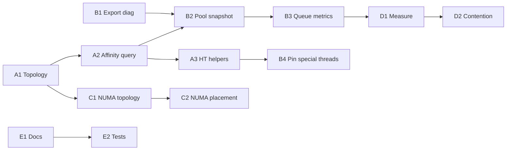

# Threading Bolstering Plan

**Status**: **Complete** — shipped **v2.4.144** (Epics A–E, patches 139–144). 21/21 threading harness tests pass. API reference: `doc/THREADING_BOLSTERING_API.md`.

Remaining unchecked items are **intentionally deferred**, not missing work:
- `C3` — Large payload NUMA-local allocation: deferred to mybuddy multi-arena (separate track)
- `D1` — Dual-socket baseline benchmark: requires hardware not in loop; skip unless dual-socket machine available
- `D2` — Lock-free MPMC ring, per-worker steal, `MutexTryLockTimeout` review: deferred behind `SITUATION_EXPERIMENTAL_STEALING` flag
- `D3` — Worker-to-worker steal: deferred
- Manual validation checklist — conditional on dual-socket/NUMA host availability

**Date**: 2026-05-24  
**Scope**: Second major threading pass after v2.3.15 generational pool + defensive “Threading Manicure” patches (Patches 1–7). Focus on **observability**, **affinity query/feedback**, **NUMA awareness**, and measured scheduler improvements — not re-architecting the job system from scratch.  
**Risk Level**: Medium — new public APIs, platform topology code, pool struct extensions; requires harness + manual validation on multi-socket hosts.  
**Prerequisite**: `SITUATION_ENABLE_THREADING` builds green; `tests/harness/test_threading.c` (**21** tests) passing. Internal error propagation push complete.

**Related**:

- Implementation: `sit/situation_impl_threading.h`, `sit/situation_impl_threading_diag.h`, `sit/situation_api.h`
- Tests: `tests/harness/test_threading.c`
- Allocator NUMA (separate track): `sit/mybuddy/SCALING_PLAN.md`, `sit/mybuddy/HARDENING_PLAN.md`
- Prior defensive work: Patches 1–7 in `situation_impl_threading.h` (tinycthread sleep, HOL scan-forward, dependency-safe main-thread steal, I/O inline fallback)

**Version gate**: Ship as **v2.4.x patches** until Epic A–B deliverables are stable on reference hardware; optional minor bump if public API surface is large enough to warrant a narrative release entry in `doc/UPDATELOG.md`.

---

## Motivation

v2.3.15+ delivered a solid **generational dual-queue job pool** with defensive hardening (work-stealing safety on the main thread, HOL blocking mitigation, platform sleep fixes, dedicated I/O thread, etc.). That was mostly **defensive** — it does not answer operational questions on high-core / dual-socket machines:

- Which **physical cores** and **NUMA nodes** are workers actually running on?
- Are **hyperthreads** shared or avoided?
- Did `SituationSetThreadAffinity` actually take effect? What was the **previous mask**?
- Is pool backpressure / queue depth healthy beyond the low-priority I/O queue?

**Highest leverage now**: observability into topology + affinity with feedback, then NUMA placement policy, then contention/scheduling changes **only where metrics justify them**.

---

## Current State (Investigation Summary)

### Architecture

| Aspect | Current behavior |
|--------|------------------|
| Scheduler model | Generational dual-ring buffers (low + high), **not** Chase–Lev cross-worker stealing |
| Workers | Up to `SITUATION_MAX_THREADS` (32), `_SituationWorkerEntry`, mutex per queue |
| I/O | Dedicated `_SituationIOThreadEntry` on low queue when `disable_io == false` |
| “Stealing” | Main thread only during `SituationDispatchParallel` on **high** queue (`mtx_trylock`) |
| HOL mitigation | `SIT_WORKER_SCAN_DEPTH` (8) scan-forward past blocked tail jobs |
| Version label in code | `v2.3.15+patch` (Patches 1–7) — not labeled v2.4.11 in Situation sources |

### Public API (threading-related)

| API | Status |
|-----|--------|
| `SituationGetCPUThreadCount()` | Logical CPUs — implemented in `situation_impl_io.h` |
| `SituationGetCPUCoreCount()` | Physical cores — good on Windows; Linux uses `threads/2` heuristic |
| `SituationSetThreadAffinity(mask)` | Pins **calling thread only**; no query, no previous mask |
| `SituationDumpTaskGraph` | Active jobs per queue (JSON or text) |
| `SituationGetIOQueueDepth()` | **Low queue only** on global `sit_gs.thread_pool` |
| `SituationCreateThreadPool` / submit / parallel / wait / deps | Core pool surface |

### Affinity usage in-tree

- **Render thread**: `SituationSetThreadAffinity(1 << 1)` — `situation_impl_renderer.h`
- **Audio callback**: `SituationSetThreadAffinity(1ULL << 2)` — `situation_impl_audio.h`
- **Pool workers**: no affinity at spawn

### Diagnostics gaps

- `SituationGetThreadingStatus()` exists in `situation_impl_threading_diag.h` as **static** — not exported in `situation_api.h`
- `pool->active_jobs` is atomic but has **no public getter**
- Doc block at `situation_impl_threading.h` ~399–428 describes combined high+low pending count — **no implementation** (orphan)
- Referenced `THREADING_TROUBLESHOOTING_GUIDE.md` — **missing** from tree
- Trace IDs 20040001–20040003 mark diag APIs as **internal**

### NUMA

- **None** in Situation threading
- mybuddy plans NUMA arenas separately — align policies later, do not duplicate allocator work in this epic

### Tests

`test_threading.c`: pool create, submit/wait, pointer-only, wait-all, parallel, dependency, dump graph. **Missing**: affinity, topology, queue depth APIs, worker placement, NUMA.

---

## Priority Matrix

| Direction | Value | Current state | Plan priority |
|-----------|-------|---------------|---------------|
| Thread affinity & core placement diagnostics | Very high | Weak / almost non-existent | **P0** — Epic A, B4 |
| Thread pool observability (which cores workers use) | Very high | Poor | **P0** — Epic B |
| Better threading diagnostics / introspection | High | Basic status exists (internal) | **P0** — Epic B1–B3 |
| NUMA awareness | High | Basically none | **P1** — Epic C |
| Lock-free / contention improvements | Medium–high | Already decent (mutex + atomics) | **P2** — Epic D (measure first) |
| More aggressive work-stealing / scheduling | Medium | Main-thread helping only | **P2** — Epic D3 (experimental) |

---

## Execution Order

**Recommended first sprint**: A1 → A2 → B1 → B2 → B4 → E2 (topology + affinity query + pool snapshot + pin audit + tests).

---

# Epic A — CPU Topology & Affinity Foundation

*Highest leverage for dual Xeon / multi-socket; unblocks Epics B and C.*

## Phase A1 — Topology model (read-only)

- [x] Add `SituationCpuTopology` struct: `logical_count`, `physical_count`, `numa_node_count`, per-logical-processor `{logical_id, physical_core_id, numa_node, is_hyperthread_sibling}`
- [x] Implement `SituationRefreshCpuTopology()` — cache at init, refresh on demand
- [x] **Windows**: `GetLogicalProcessorInformation` + `RelationNumaNode` (processor groups / >64 LP: documented `SITUATION_AFFINITY_MASK_BITS` limit)
- [x] **Linux**: sysfs topology (`core_id`, `node0` link); `SituationGetCPUCoreCount` uses cache
- [x] **macOS**: `sysctl` hw.logicalcpu / hw.physicalcpu
- [x] Add `SituationGetCpuTopology(const SituationCpuTopology** out)`
- [x] Harness: `cpu_topology_refresh`

## Phase A2 — Affinity query + set with feedback

- [x] Add `SituationGetThreadAffinity(uint64_t* out_mask)` for **current thread**
- [x] `SituationSetThreadAffinityEx` returns **previous mask**; `SituationSetThreadAffinity` wraps with NULL
- [x] Add `SituationGetCurrentProcessorIndex()`
- [x] Add `SituationGetThreadNumaNode()`
- [x] Windows >64 LP: documented via `SITUATION_AFFINITY_MASK_BITS` (64); `GetThreadGroupAffinity` via `GetProcAddress`
- [x] errno via `SITUATION_ERROR_DEVICE_QUERY` / `INVALID_PARAM`
- [x] Harness: `affinity_roundtrip`

## Phase A3 — Hyperthread-aware helpers

- [x] `SituationBuildPhysicalCoreMask`
- [x] `SituationBuildUniqueCoreMask`
- [x] `SituationBuildNumaNodeMask`
- [x] Document bitmask semantics in `situation_api.h`
- [x] `SituationInitInfo::thread_affinity_render` / `thread_affinity_audio`; render/audio use configured masks

---

# Epic B — Thread Pool Observability

*“Is bolstering working?” — primary user-visible win.*

## Phase B1 — Export diagnostics already half-built

- [x] Move `SituationThreadingStatus` + `SituationGetThreadingStatus()` to **public** `situation_api.h`
- [x] Add `SituationPrintThreadingStatus(FILE* out)` (not stdout-only)
- [x] Extend status: `pool_thread_count`, `io_thread_enabled`, `platform_topology_ok`, `numa_available`
- [x] Add `doc/THREADING_TROUBLESHOOTING_GUIDE.md` — diag header reference updated

## Phase B2 — Per-thread pool snapshot

- [x] Extend `SituationThreadPool`: `SituationWorkerStartArg`, `worker_last_logical_cpu[]`
- [x] Sample `SituationGetCurrentProcessorIndex()` every 8 jobs + idle wake; I/O thread each loop
- [x] Add `SituationThreadPoolSnapshot` + `SituationGetThreadPoolSnapshot`
- [x] Add `SituationDumpThreadPoolStatus` (text + JSON)
- [x] Harness: `pool_snapshot_parallel`

## Phase B3 — Queue & load metrics

- [x] Removed orphan pending-job doc block from `situation_impl_threading.h`
- [x] `SituationGetQueueDepth`, `SituationGetHighQueueDepth`, `SituationGetActiveJobCount`
- [x] Stats: `stats_jobs_submitted/completed`, `stats_main_steal_success`
- [x] `SituationDrawMetricsOverlay` shows jobs + queue depths

## Phase B4 — Affinity audit for special threads

- [x] Render / audio: record mask + CPU in snapshot
- [ ] Optional worker affinity at `thrd_create` (deferred — Epic C / init policy)
- [x] `SituationDumpThreadingReport` — status + topology line + pool dump

---

# Epic C — NUMA Awareness

*High value on dual Xeon; depends on Epic A.*

## Phase C1 — NUMA topology (read-only)

- [x] Add `SituationNumaTopology`: node count, processors per node, memory per node (if available)
- [x] **Windows**: `GetNumaHighestNodeNumber`, `GetNumaAvailableMemoryNode`
- [x] **Linux**: sysfs `nodeN/meminfo` (no libnuma required)
- [x] `SituationGetNumaTopology()` / `SituationRefreshNumaTopology()`
- [x] Harness: `numa_topology_refresh`, `numa_node_mask`

## Phase C2 — Placement policy hooks

- [x] `SituationInitInfo`: `numa_prefer_local`, `worker_numa_spread`, `io_thread_numa_node`
- [x] Worker `i` → NUMA node `i % node_count` at worker entry when spread enabled
- [x] `_SituationSetThreadAffinityForRole` — render/audio; I/O placement helper
- [x] `doc/THREADING_TROUBLESHOOTING_GUIDE.md` — mybuddy coordination note

## Phase C3 — Allocation locality (optional; pairs with mybuddy)

- [x] Thread-local preferred NUMA node at worker/I/O/render/audio placement
- [x] `SituationGetPreferredNumaNode()`
- [ ] Large job payload local allocation — deferred (mybuddy multi-arena)

---

# Epic D — Scheduler & Contention

*Medium priority — measure in Epic B/D1 before structural changes.*

## Phase D1 — Measure before changing

- [x] Debug counters: high-queue lock hold time, main steal success/fail/empty, scan-forward swap/exhausted, I/O idle % (`SituationThreadPoolMetrics`)
- [x] Harness `cpu_stress_10s_taskmgr` — 10 s `DispatchParallel` burn + logical CPU histogram vs Task Manager (optional `SIT_SKIP_CPU_STRESS`)
- [ ] Harness or script benchmark: `SituationDispatchParallel` sweep batch sizes on reference dual-socket host (manual / dual-socket)
- [ ] Baseline report template: snapshot + counters before/after Epic A affinity policies

## Phase D2 — Contention improvements (gated on D1)

- [ ] Evaluate lock-free MPMC ring for **high** queue only — **deferred** (measure first)
- [ ] Per-worker local queues + neighbor steal — **deferred** (`SITUATION_EXPERIMENTAL_STEALING`)
- [x] Full-queue in-place claim scan (v2.4.232–233; supersedes `_SitWorkerScanDepthForPending` 4–32 cap)
- [ ] Review `SituationMutexTryLockTimeout` — wire to deadlock detection or remove if unused

## Phase D3 — Scheduling policy

- [x] `SituationCreateThreadPool`: size from physical or logical cores via `SituationInitInfo`
- [x] Auto policy: `num_threads = cores - reserved` (`SituationGetRecommendedWorkerCount`)
- [ ] Optional worker-to-worker steal on high queue — **deferred**

---

# Epic E — API Hygiene, Docs & Tests

*Ship-quality bolstering.*

## Phase E1 — API & documentation

- [x] Fix `situation_api.h` threading comments — accurate mutex vs atomic split (not overstated “lock-free”)
- [x] Sync `sit/k-term/doc/situation_api.md` and README threading section with new APIs
- [x] Thread naming docs (v2.4.239): `SituationSetCurrentThreadName`, `main_thread_name` in SDK / API / troubleshooting guides
- [x] Fix stale worker-thread doc block in `situation_impl_threading.h` (was incorrect lock-free / queue_mutex narrative)
- [x] `doc/UPDATELOG.md` — per-epic entries v2.4.139–143 + bolstering summary in 143

## Phase E2 — Test matrix

| Test | Epic |
|------|------|
| Topology refresh + counts | A1 |
| Affinity set/get round-trip | A2 |
| Unique-core mask builder | A3 |
| Pool snapshot after parallel work | B2 |
| High + active job counts | B3 |
| NUMA topology (conditional) | C1 |
| Worker NUMA spread (multi-node skip) | C2 |

- [x] Extended `test_threading.c` (metrics dump/reset, main affinity default, prior A–D tests)
- [x] Manual checklist — `doc/THREADING_MANUAL_VALIDATION.md` (dual-socket / NUMA host)

## Phase E3 — Init integration

- [x] `SituationInitInfo`: `thread_affinity_main` / render / audio (+ NUMA/pool fields from C/D)
- [x] `situation_impl_ctrl.h`: main affinity after `glfwCreateWindow` via `_SituationSetThreadAffinityForRole`
- [x] Fail-soft: affinity failure → debug warning; init continues (no strict abort)

---

## Suggested PR Slices

| PR | Contents | Epics |
|----|----------|-------|
| 1 | Topology struct + refresh + `GetCpuTopology` + tests | A1, E2 partial |
| 2 | Affinity get / current CPU / previous mask + tests | A2 |
| 3 | Export threading status + pool snapshot + dump | B1, B2 |
| 4 | Queue depth APIs + fix orphan doc | B3, E1 |
| 5 | InitInfo affinity config + render/audio defaults | A3, B4, E3 |
| 6 | NUMA topology + spread policy | C1, C2 |
| 7 | Metrics + experimental stealing (if justified) | D1–D3 |

---

## Manual Validation Checklist (Dual-Socket / NUMA Host)

- [ ] `SituationPrintThreadingStatus` reports correct logical/physical counts and NUMA node count
- [ ] `SituationDumpThreadPoolStatus` after heavy `SituationDispatchParallel` shows workers on distinct cores (not all on core 0)
- [ ] Render and audio threads report stable affinity masks and CPUs matching policy
- [ ] `SituationSetThreadAffinity` + `SituationGetThreadAffinity` round-trip matches intended mask
- [ ] No regression: `sit_test.exe --module threading` and full sequential suite green
- [ ] Rebuild DLL discipline: `copy /Y build\dll\*.dll build\` before harness runs

---

## Out of Scope (This Plan)

- Replacing generational job IDs or dependency model
- Full Chase–Lev scheduler (unless Epic D experimental flag proves necessary)
- mybuddy NUMA allocator implementation (track separately in `sit/mybuddy/SCALING_PLAN.md`)
- k-term terminal threading (`sit/k-term/doc/THREAD_SAFETY.md`) — single-threaded library remains

---

## Changelog (This Document)

| Date | Note |
|------|------|
| 2026-05-24 | Initial plan from codebase investigation (`sit/` threading impl, harness, mybuddy NUMA docs). |
| 2026-05-24 | **Epic A implemented** — `situation_impl_threading_topology.h`, 11/11 threading harness tests green (OpenGL). |
| 2026-05-24 | Released as **v2.4.139** — `doc/UPDATELOG.md`. |
| 2026-05-24 | **Epic B implemented** — v2.4.140, 14/14 threading harness tests. |
| 2026-05-24 | **Epic C implemented** — v2.4.141, 16/16 threading harness tests. |
| 2026-05-24 | **Epic D implemented** — v2.4.142, 18/18 threading harness tests (metrics + dynamic scan + physical-core sizing; experimental steal deferred). |
| 2026-05-24 | **Epic E implemented** — v2.4.143, 20/20 threading harness tests; manual validation doc; API/doc hygiene complete for bolstering plan. |
| 2026-05-24 | **Release cap** — v2.4.144, `cpu_stress_10s_taskmgr`, `doc/THREADING_BOLSTERING_API.md`, 21/21 threading tests. |
