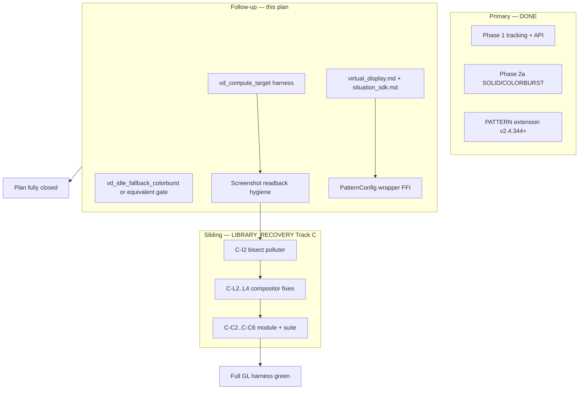

# Virtual Display — Content Update Detection & Idle Fallback Plan

**Date:** 2026-06-08  
**Last updated:** 2026-06-25 (follow-up harness, docs, wrappers landed)  
**Scope:** Per-VD **content write** tracking, query API, and **shader-only** compositor fallback when a display goes idle  
**Related:** [`renderer_bolster_plan.md`](renderer_bolster_plan.md) (VD compositor) · [`RGL_TEST_PATTERN_SHADER_MIGRATION_PLAN.md`](RGL_TEST_PATTERN_SHADER_MIGRATION_PLAN.md) (PATTERN idle extension) · [`LIBRARY_RECOVERY_PLAN_244.md`](LIBRARY_RECOVERY_PLAN_244.md) (OpenGL VD module-order failures)

---

## Plan status at a glance

| Tier | Scope | Status |
|------|-------|--------|
| **Primary — Phase 1** | Content-write tracking + `SituationGetVirtualDisplayUpdateInfo` | **DONE** (v2.4.221) — library + info harness tests |
| **Primary — Phase 2a** | SOLID / COLORBURST idle compositor (GL + VK) | **DONE** (v2.4.222) — core + switch harness tests |
| **Extension — PATTERN idle** | `SITUATION_VD_FALLBACK_PATTERN` + pattern config API | **DONE** (v2.4.344–345) — owned by [`RGL_TEST_PATTERN_SHADER_MIGRATION_PLAN.md`](RGL_TEST_PATTERN_SHADER_MIGRATION_PLAN.md) |
| **Follow-up — this plan** | Missing harness, docs, wrappers, readback hygiene | **DONE** (2026-06-25) — Track C still sibling |
| **Sibling — Track C** | VD tests fail in full `--module virtual_display` (OpenGL) | **Closed @ 362** — readback fix; [`LIBRARY_RECOVERY_PLAN_244.md`](../plan/LIBRARY_RECOVERY_PLAN_244.md) Track C |
| **Optional — Phase 2b** | Debug text overlay when idle | **Not started** |

**Do not read “Phase 1 COMPLETE / Phase 2a implemented” as “full harness green.”** This plan’s own follow-up work is done; OpenGL **module-order** failures remain in Track C.

### Definition of done

**Primary (shipped):**

- [x] Content writes bump `last_content_update_time` / `last_content_update_frame` (raster EndRenderPass, copy, dispatch hooks in `situation_impl_vd.h` + `situation_impl_renderer.h`)
- [x] `SituationGetVirtualDisplayUpdateInfo` + `SituationSetVirtualDisplayIdleThreshold` exported (`.def` + `situation_api_graphics.h`)
- [x] Idle compositor branch in Path A + Path B shaders (`sit/gpu/vd.frag`, `sit/gpu/composite.frag`) — no stale texture sample when idle
- [x] `SituationSetVirtualDisplayFallbackMode` / `SituationSetVirtualDisplayFallbackColor` (SOLID, COLORBURST, PATTERN)
- [x] Info harness tests pass in isolation: `vd_content_update_info_after_draw`, `vd_content_update_info_idle`, `vd_content_update_info_after_draw_texture`

**This plan fully closed:**

- [x] All items in §Follow-up checklist checked (except deferred Phase 2b + product open questions)

**Harness confidence (feature-level):**

- [x] `vd_compute_target_updates_on_dispatch`, `vd_idle_fallback_colorburst` — **PASS** isolated OpenGL @ 2026-06-25
- [x] Idle switch + PATTERN tests — **PASS** isolated OpenGL (pre-existing; readback hygiene improved)
- [ ] Vulkan isolated re-run of new tests (recommended smoke)

**Full OpenGL VD module green (cross-plan):**

- [ ] [`LIBRARY_RECOVERY_PLAN_244.md`](LIBRARY_RECOVERY_PLAN_244.md) Track C gates **C-C2 … C-C6** (module + full suite)

---

## Related plans (dependency map)

| Topic | Owner | Notes |
|-------|-------|-------|
| PATTERN standby shaders, `SitTestPatternConfig`, SMPTE headers | [`RGL_TEST_PATTERN_SHADER_MIGRATION_PLAN.md`](RGL_TEST_PATTERN_SHADER_MIGRATION_PLAN.md) | Extension to Phase 2a; not duplicated here |
| `vd_offset_position`, `vd_color_only_no_depth`, idle switch **module-order** failures | [`LIBRARY_RECOVERY_PLAN_244.md`](LIBRARY_RECOVERY_PLAN_244.md) Track C | **P1** — GL compositor state after ~20 earlier VD tests; tests pass `--filter` alone |
| `vd_idle_pattern_standby` full-suite-only failure | Recovery **P3** | Passes `--module virtual_display`; fails full suite |
| Screenshot readback hygiene in idle tests | [`CANVAS_STRETCH_READBACK_FIX_PLAN.md`](CANVAS_STRETCH_READBACK_FIX_PLAN.md) B4 | **Done** — library readback @ 362; optional harness audits remain |

---

## Code verification (2026-06-25)

Confirmed in tree — use this table when triaging “is it built?” vs “is it verified?”

| Item | Location | Verified |
|------|----------|----------|
| `_SitVDMarkContentUpdated` | `sit/situation_impl_vd.h` | [x] |
| Idle decision `since > idle_threshold_seconds` | `_SitVDGetCompositorIdleState` | [x] |
| GL idle uniforms | `_SitVDApplyCompositorIdleUniformsGL` | [x] |
| VK Path A/B push constants | `_SitVDFillPathAPushConstants`, `_SitVDFillPathBPushConstants` | [x] |
| Recording hooks (draw, EndRenderPass, dispatch, copy) | `situation_impl_renderer.h` + vd module | [x] |
| `SITUATION_VD_FALLBACK_PATTERN` + pattern UBO | `situation_impl_vd.h`, `vd_idle_pattern.glslh` | [x] |
| `SituationSetVirtualDisplayPatternConfig` | `situation_impl_vd.h`, `.def` | [x] |
| FFI: UpdateInfo, IdleThreshold, FallbackMode/Color | All wrapper `foreign.*` / `.def` | [x] |
| FFI: PatternConfig / PatternLayers | All wrapper `foreign.*` (regenerated 2026-06-25) | [x] |
| Rust helper `situation_get_virtual_display_update_info` | `situation_helpers.rs` | [x] |
| Rust helpers PatternConfig / PatternLayers | `situation_helpers.rs` | [x] |
| `doc/guide/virtual_display.md` idle section | SOLID / COLORBURST / PATTERN + threshold semantics | [x] |
| `doc/situation_sdk.md` §3.6.6 | Content-update vs frame-clock subsection | [x] |
| Harness `vd_compute_target_updates_on_dispatch` | `test_virtual_display.c` | [x] |
| Harness `vd_idle_fallback_colorburst` | `test_virtual_display.c` | [x] |

---

## Problem (unchanged intent)

Applications need to know when a Virtual Display (VD) last received **new pixel content**, distinct from:

| Field | Meaning | Updated when |
|-------|---------|--------------|
| `last_update_time_seconds` | VD **frame clock** (animation / delta time) | Every VD tick in `SituationUpdateTimers()` |
| `is_dirty` | Offscreen buffer **may** need redraw (manual / best-effort) | Set on content update; compositor does not gate on it alone |
| `last_content_update_time` | **Last pixel write** (this plan) | Draw / copy / dispatch hooks |

Without content-write tracking, stale VDs composite unchanged textures with no visible indication. Idle fallback generates standby RGB **in the compositor shader** instead of sampling stale texels.

---

## Design principles

1. **Situation-only scope** — core, compositor shaders, harness, wrappers, docs.
2. **Content tracking is CPU metadata** — cheap hooks at real write sites.
3. **Idle fallback is shader-only** in compositor FS (`vd.frag`, `composite.frag`). No CPU pixel fills.
4. **Phase 2b debug text** — optional, off by default; not required for plan closure.
5. **Non-disruptive:** when not idle, compositor behaviour matches pre-change texture sampling.

---

## Phase 1 — Content update tracking & query API — PRIMARY DONE

### Shipped API & fields

- [x] `last_content_update_time`, `last_content_update_frame`, `idle_threshold_seconds` on `SituationVirtualDisplay`
- [x] Defaults at create: content time = now; threshold = `1.0` s
- [x] `SituationGetVirtualDisplayUpdateInfo` — optional outputs + errno on bad id
- [x] `SituationSetVirtualDisplayIdleThreshold` — clamps negative to `0.0` (see open question on `0.0` semantics)
- [x] `fallback_mode`, `fallback_color`, setters (extended later with PATTERN)

### Recording state & hooks

- [x] Per-CB `recording_pass_display_id` / `recording_pass_had_draw` (GL soft buffer + VK)
- [x] `_SitVDResetGLRecordingState` on acquire / recovery
- [x] `EndRenderPass` → mark updated when VD pass had draw
- [x] `CopyTexture` / copy-to-texture → compute-target VD slot lookup
- [x] `BindComputeTexture` bind-state only (no timestamp)
- [x] `Dispatch` / `DispatchIndirect` → mark bound compute-target slots
- [x] Draw commands → `recording_pass_had_draw`

**Policy (decided):** clear-only pass does **not** count as content update.

### Phase 1 harness

| Test | Isolated | Full `--module virtual_display` (GL @ 346) |
|------|----------|---------------------------------------------|
| `vd_content_update_info_after_draw` | PASS | PASS (runs before polluter prefix) |
| `vd_content_update_info_idle` | PASS | PASS |
| `vd_content_update_info_after_draw_texture` | PASS | PASS (needs asset) |
| `vd_compute_target_updates_on_dispatch` | — | **Not written** |

### Phase 1 exit criteria

- [x] API returns sensible `seconds_since_update` after known writes
- [x] Compute dispatch/copy hooks in library (bind alone does not bump)
- [ ] **`vd_compute_target_updates_on_dispatch` harness** — create `COMPUTE_TARGET` VD, dispatch write, assert `seconds_since_update ≈ 0`
- [x] `last_update_time_seconds` (frame clock) unchanged
- [x] Info tests avoid pixel readback (API-only)

---

## Phase 2a — Shader-only idle compositor (SOLID / COLORBURST) — PRIMARY DONE

### Shipped behaviour

- [x] CPU idle decision in compositor path (`_SitVDGetCompositorIdleState`)
- [x] Path B (`SIT_VD_FRAGMENT_SHADER_SRC`) + Path A (`SIT_COMPOSITE_FRAGMENT_SHADER_SRC`) idle branch
- [x] When idle: SOLID uses `fallback_color`; COLORBURST uses SMPTE subset (`vd_colorburst_subset.glslh` / test_patterns)
- [x] When not idle: unchanged texture sample
- [x] Advanced blend: idle RGB uses `opacity` before blend math

### Phase 2a harness

| Test | What it checks | Isolated `--filter` | Full GL module @ 346 |
|------|----------------|---------------------|----------------------|
| `vd_idle_content_switch` | Timed SOLID → live photo → SOLID | PASS | **FAIL** (`screen_is_live()` @ ~1966) — **Track C P1** |
| `vd_idle_content_switch_colorburst` | Timed COLORBURST → live → COLORBURST | PASS | **FAIL** (`screen_is_idle()` @ ~1949) — **Track C P1** |
| `vd_idle_fallback_colorburst` | Dedicated ≥4 SMPTE bar kinds at readback | **Not written** | — |

**Important:** Phase 2a **implementation is in core**; module-order failures are **compositor state pollution** (recovery Track C), not missing idle shaders. Do not re-implement Phase 2a to fix P1 — bisect polluter and fix GL restore/offset paths per recovery plan.

### Phase 2a exit criteria

- [x] Idle VD shows solid or colorburst without sampling stale texels (core)
- [x] Non-idle VD regression coverage via existing draw/composite tests
- [x] Both Path A and Path B covered
- [x] `vd_idle_content_switch` passes isolated filter (timed pixel FSM)
- [ ] **`vd_idle_fallback_colorburst`** — static idle frame, readback classifies ≥4 SMPTE bar colors (or document `vd_idle_content_switch_colorburst` as sole gate and check it here)
- [ ] **`vd_idle_content_switch*` green in full OpenGL module order** — gate on **C-C4 / C-C5**, not this plan alone

---

## Phase 2a extension — PATTERN idle (shipped elsewhere)

Added after original plan; **do not re-scope here**.

- [x] `SITUATION_VD_FALLBACK_PATTERN` enum value
- [x] `SituationSetVirtualDisplayPatternConfig` / `Get` / `PatternLayers` API
- [x] `vd_idle_pattern_standby` harness (checkerboard readback)
- [x] `vd_pattern_config_api` harness (config round-trip, no pixels)

| Test | Isolated | Full GL module @ 346 | Full suite @ 346 |
|------|----------|------------------------|------------------|
| `vd_pattern_config_api` | PASS | PASS | — |
| `vd_idle_pattern_standby` | PASS | PASS | **FAIL** — recovery **P3** |

Details: [`RGL_TEST_PATTERN_SHADER_MIGRATION_PLAN.md`](RGL_TEST_PATTERN_SHADER_MIGRATION_PLAN.md).

- [ ] Cross-link PATTERN section in this plan’s Phase 3 docs tasks (below) — **done in this revision**
- [ ] Formal §5.3 COLORBURST pixel-identical gate (RGL plan) — optional closure for pattern library

---

## Phase 2b — Optional debug text overlay — NOT STARTED

Out of scope for strict shader-only rule unless explicitly enabled.

- [ ] Gate behind `SITUATION_VERBOSE_DIAGNOSTICS` or VD debug flag
- [ ] When idle + debug: overlay idle seconds + `frames_since_update` via text draw
- [ ] Default off in release builds

Do not start until follow-up harness/docs closed unless product asks for it.

---

## Phase 3 — Wrappers & docs — PARTIAL

### Wrappers (verified 2026-06-25)

| Symbol | `.def` | Python/Rust/Odin/Zig/Fortran FFI | Rust helper |
|--------|--------|-----------------------------------|-------------|
| `SituationGetVirtualDisplayUpdateInfo` | [x] | [x] | [x] |
| `SituationSetVirtualDisplayIdleThreshold` | [x] | [x] | [x] |
| `SituationSetVirtualDisplayFallbackMode` | [x] | [x] | [x] |
| `SituationSetVirtualDisplayFallbackColor` | [x] | [x] | [x] |
| `SituationSetVirtualDisplayPatternConfig` | [x] | [x] | [x] |
| `SituationGetVirtualDisplayPatternConfig` | [x] | [x] | [x] |
| `SituationSetVirtualDisplayPatternLayers` | [x] | [x] | [x] |
| `SituationGetVirtualDisplayPatternLayers` | [x] | [x] | [x] |

- [x] Regenerate PatternConfig / PatternLayers in all wrapper `foreign.*` + `API_INDEX.md` (`tools/generate_*_bindings.py`, 2026-06-25)
- [x] Rust helpers for pattern config (`situation_helpers.rs`)
- [x] Odin/Zig/Fortran/Modula2 FFI via binding generators (opaque / struct per language)

### Documentation

- [x] `doc/guide/graphics.md` — `SituationGetVirtualDisplayUpdateInfo` entry
- [x] `doc/guide/test_patterns.md` — three compositor states + PATTERN summon
- [x] `doc/architecture.md` — idle detection diagram
- [x] `doc/whatsnew.md` / `doc/updatelog_24_03.md` — v2.4.221–222 ship notes
- [x] **`doc/guide/virtual_display.md`** — idle section: PATTERN + threshold semantics
- [x] **`doc/situation_sdk.md` §3.6.6** — content write vs frame clock vs `is_dirty`
- [x] Wrapper **`API_INDEX.md`** files — PatternConfig via generator (per-language)
- [ ] **`doc/UPDATELOG.md`** — optional consolidated plan-closure note on next version bump

---

## Follow-up checklist

Execute in recommended order. Track C items are **linked**, not duplicated.

### 1. Harness gaps (this plan)

- [x] **`test_vd_compute_target_updates_on_dispatch`** — COMPUTE_TARGET VD + dispatch → `seconds_since_update < 0.25` (OpenGL PASS @ 2026-06-25)
- [x] **`test_vd_idle_fallback_colorburst`** — static COLORBURST idle readback (≥4 bar kinds; OpenGL PASS @ 2026-06-25)
- [x] Registered in `virtual_display_tests[]` after info tests
- [x] Re-run isolated filters OpenGL (see commands below)
- [ ] Re-run isolated filters Vulkan (recommended smoke)

### 2. Readback hygiene (supports idle + Track C bisect)

- [x] `vd_composite_only_end_frame` / `vd_draw_photo_and_composite`: **`SituationRequestScreenCapture()`** before `EndFrame`
- [x] `test_vd_idle_fallback_colorburst`: composite frame immediately before screen readback assert
- [ ] `test_vd_offset_position` and other VD pixel tests: audit (Track C bisect — canvas plan B4)

### 3. Phase 3 docs & wrappers

- [x] Update `doc/guide/virtual_display.md` idle fallback table (SOLID / COLORBURST / PATTERN)
- [x] Add `doc/situation_sdk.md` §3.6.6 content-update + idle subsection
- [x] Export PatternConfig API in all wrapper FFI layers (binding generators)
- [x] Rust helpers for pattern config setters/getters

### 4. Open questions → decisions

- [x] Clear-only pass counts as content update? **No.**
- [x] Invalid display id returns errno from `GetVirtualDisplayUpdateInfo`? **Yes.**
- [x] **`idle_threshold_seconds == 0.0`**: documented — clamp negative to 0; threshold 0 ⇒ idle when `seconds_since_update > 0` (`virtual_display.md`)
- [ ] **`SITUATION_VD_FLAG_NO_IDLE_FALLBACK`**: deferred product decision

### 5. Sibling plan — OpenGL VD module order (not feature gaps)

Failure profile **P1** (@ v2.4.346, GTX 1070 headless): four tests fail together in one `SituationInit`:

- [ ] **`vd_offset_position`** — recovery **C-C2** / **C-L2**
- [ ] **`vd_color_only_no_depth`** — **C-C3** / **C-L3**
- [ ] **`vd_idle_content_switch`** — **C-C4** / **C-L4**
- [ ] **`vd_idle_content_switch_colorburst`** — **C-C5** / **C-L4**

Prerequisites in recovery plan (do first):

- [ ] **C-I2** — bisect `virtual_display_tests[]`; name smallest polluter prefix
- [ ] **C-I3** — log actual vs expected pixels on first fail
- [ ] **C-I5** — audit offset math + color-only FBO after polluter named

Full suite extras (same recovery doc):

- [ ] **P2** `pattern_smpte_vd_bar_color` — **C-C1**
- [ ] **P3** `vd_idle_pattern_standby` — **C-C6**

### 6. Phase 2b (optional)

- [ ] See §Phase 2b — only if still wanted after §1–5

---

## Harness inventory (`test_virtual_display.c`)

Registration order matters for P1 bisect. Key rows:

| # | Test | Phase | Pixel readback | GL module @ 346 |
|---|------|-------|----------------|-----------------|
| … | blend / scale / composite … | — | some | PASS |
| ~20 | `vd_offset_position` | — | yes | **FAIL** |
| … | `vd_content_update_info_*` | 1 | no / texture | PASS |
| … | `vd_color_only_no_depth` | — | yes | **FAIL** |
| … | `vd_idle_content_switch_colorburst` | 2a | yes | **FAIL** |
| … | `vd_idle_content_switch` | 2a | yes | **FAIL** |
| … | `vd_pattern_config_api` | ext | no | PASS |
| … | `vd_idle_pattern_standby` | ext | yes | PASS (module) / FAIL (full suite P3) |

---

## Verification commands

### Primary regressions (must stay green)

```powershell
Set-Location "C:\Users\User\Desktop\hobby\_kiro\situation\build"
$env:PATH = "dll;C:\msys64\mingw64\bin;$env:PATH"

& ".\tests\sit_test_opengl.exe" --module virtual_display --filter content_update
& ".\tests\sit_test_vulkan.exe" --module virtual_display --filter content_update
```

### Follow-up / feature-level idle

```powershell
& ".\tests\sit_test_opengl.exe" --filter "vd_idle_content_switch|vd_idle_pattern"
& ".\tests\sit_test_vulkan.exe" --filter "vd_idle_content_switch|vd_idle_pattern"
```

### Release gate (cross-plan)

```powershell
& ".\tests\sit_test_opengl.exe" --module virtual_display --headless   # expect 32/32 when Track C done
& ".\tests\sit_test_opengl.exe" --headless                            # full suite
```

---

## Implementation order (updated)



**Recommended sequence:** harness gaps (§1) → readback hygiene (§2) → docs/wrappers (§3) → open-question decisions (§4) → Track C library work (§5) → optional 2b (§6).

---

## Non-goals

- Rewriting offscreen VD FBO contents when idle
- CPU-generated fallback bitmaps
- Fixing unrelated stale VD comment references (`BeginVirtualDisplayFrame`, etc.) — separate cleanup
- Track C compositor bugs under the guise of “idle detection incomplete”

---

## Historical design reference

<details>
<summary>Codebase alignment notes (implementation-time)</summary>

| Topic | Plan implication |
|-------|------------------|
| `is_dirty` | Independent from content timestamps; auto-set on mark updated |
| `COMPUTE_TARGET` VD | Writes via dispatch/copy, not raster BeginRenderPass |
| Time base | `_SitVDGetTimeSeconds()` — same as VD frame clock |
| OpenGL deferred execute | Track draws at execute time on `SIT_OP_END_RENDER_PASS` |
| Push constants | Separate Path A vs Path B layouts; mind 128-byte limit |

</details>

<details>
<summary>Original Phase 2a shader sketch (landed in vd.frag / composite.frag)</summary>

When `is_idle != 0`: SOLID → `fallback_color`; COLORBURST → `_sit_smpte_color_bars(uv)`; PATTERN → `_sit_vd_idle_pattern_rgb(...)` (extension).

When `is_idle == 0`: sample VD texture unchanged.

</details>

---

## References

- Ship notes: `doc/updatelog_24_03.md` (v2.4.221–222), `doc/updatelog_24_04.md` (PATTERN v2.4.344–345)
- Compositor: `doc/plan/renderer_bolster_plan.md`
- Pattern library: `doc/plan/RGL_TEST_PATTERN_SHADER_MIGRATION_PLAN.md`
- OpenGL VD failures: `doc/plan/LIBRARY_RECOVERY_PLAN_244.md` §C.1.3
- Screenshot API: `doc/done/CANVAS_STRETCH_READBACK_FIX_PLAN.md`
