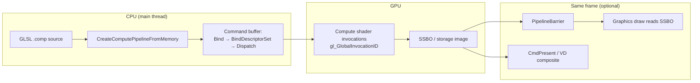
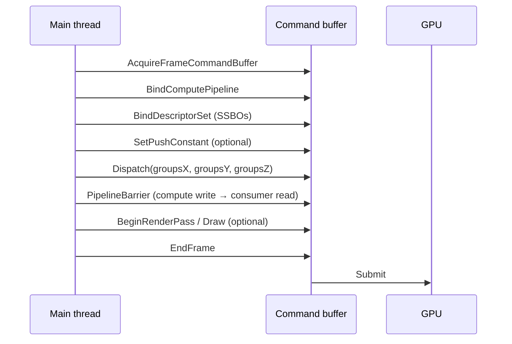
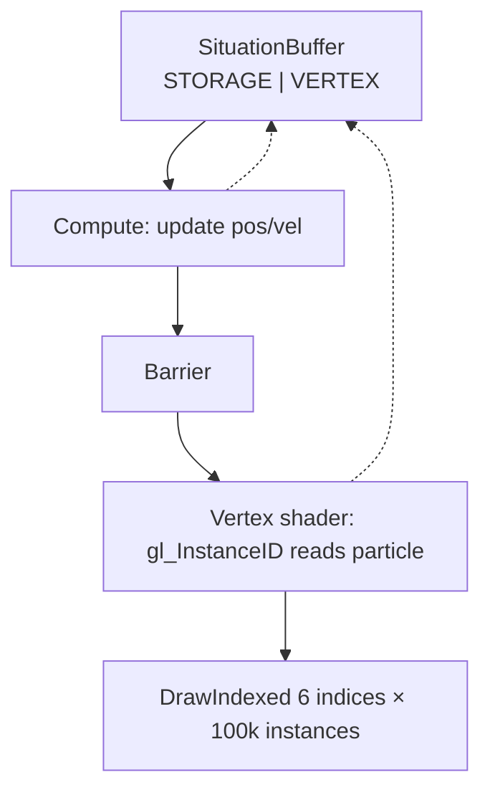

## Compute Shaders Module

**Overview:** Compute shaders run **general-purpose parallel work on the GPU** — outside the triangle pipeline. Use them for particle physics, image processing, procedural fields, terminal glyph layout, and any algorithm that maps cleanly to `(x, y, z)` thread indices. Situation exposes a unified API: create a pipeline from GLSL, bind SSBOs and storage images, dispatch work groups, insert barriers, then optionally draw or present the result.

**When to use compute vs graphics:**

| Use | Path |
|-----|------|
| Triangles, sprites, textured quads | [2D](drawing_2d.md) / [3D](drawing_3d.md) graphics pipelines |
| Per-element parallel update (1024 floats, 100k particles) | **Compute** |
| Compute updates buffer → same frame draws it | **Compute → barrier → graphics** |
| Compute writes texture → show on screen (no raster scene) | **Compute → `SituationCmdPresent`** or [Virtual Display](virtual_display.md) compute target |
| **Stacked 2D cell playfield** (tiles, scroll, layers) | **[2D Grid](grid.md)** → compute VD → composite |
| CPU parallel loops | [Threading](threading.md) — not GPU compute |

**Prerequisites:**

- `SituationInit()` succeeded; GPU supports compute (checked at init).
- **`SITUATION_ENABLE_SHADER_COMPILER`** — mandatory for Vulkan runtime GLSL→SPIR-V; required for in-memory GLSL on both backends.
- A window/context still exists (Situation owns GL/VK context through the normal init path).

**Canonical examples:**

| Example | Teaches |
|---------|---------|
| `examples/other/compute_shader_image_processing.c` | SSBO multiply, dispatch, barrier, CPU readback |
| `examples/other/gpu_particle_simulation.c` | Shared SSBO/VBO, compute → barrier → instanced draw |
| **`examples/27_grid_playfield/`** | **`SituationGridStackPresent`** — canonical stacked cell playfield → compute VD |
| `sit/k-term/` | **Grid client** — packs VT cells into `SituationGrid*`; uses `SIT_COMPUTE_LAYOUT_GRID` + `sit/gpu/grid.comp` (legacy `terminal.comp` when `KTERM_USE_SIT_GRID=0`) |
| [Virtual Display — compute target](virtual_display.md#pattern-grid-playfield-present) | Storage image via VD texture |

**Canonical grid API:** Prefer **`SituationGridCreate`**, **`SituationGridSetCell`**, **`SituationGridDispatch`**, and **`SituationGridStackPresent`** for fullscreen cell surfaces — not ad-hoc SSBO + custom shaders. K-Term (`kt_grid_sit.h`) is the reference **client** that maps `EnhancedTermChar` → `SitGridCell`. Full workflow: **[2D Grid](grid.md)**.

**Related:** [2D Grid](grid.md) · [Advanced GPU commands](renderer_bolster.md) · [situation_command_reference.md §7](../situation_command_reference.md#7-compute) · [Graphics — compute API detail](graphics.md#compute-shaders)

---

### Mental model



Unlike graphics, compute has **no** raster state (blend, depth, cull). You only choose: pipeline, resources, push constants, and dispatch size.

---

### Frame workflow (typical)

Compute usually runs **inside the same frame** as rendering, on the **main command buffer**:



**Compute-only apps** (no render pass): dispatch → barrier → `SituationCmdPresent(texture)` to swapchain.

---

### Step 1 — Write GLSL (`#version 450`)

Minimal SSBO kernel (from `compute_shader_image_processing.c`):

```glsl
#version 450
layout(local_size_x = 64, local_size_y = 1, local_size_z = 1) in;

layout(std430, set = 0, binding = 0) readonly buffer InBuffer {
    float values[];
} input_data;

layout(std430, set = 1, binding = 0) writeonly buffer OutBuffer {
    float values[];
} output_data;

layout(push_constant) uniform PushConsts {
    float multiplier;
    uint count;
} pc;

void main() {
    uint idx = gl_GlobalInvocationID.x;
    if (idx >= pc.count) return;
    output_data.values[idx] = input_data.values[idx] * pc.multiplier;
}
```

**Dispatch math:**

```
groups_x = ceil(element_count / local_size_x)
total invocations ≈ groups_x × groups_y × groups_z × local_size_x × ...
```

Example: 1024 elements, `local_size_x = 64` → `Dispatch(16, 1, 1)`.

---

### Step 2 — Pick a layout type

`SituationComputeLayoutType` must **match** the descriptor sets in your shader. Situation pre-builds Vulkan pipeline layouts for each enum:

| Layout | Sets / resources |
|--------|------------------|
| `SIT_COMPUTE_LAYOUT_ONE_SSBO` | Set 0: one SSBO |
| `SIT_COMPUTE_LAYOUT_TWO_SSBOS` | Set 0 + set 1 SSBOs |
| `SIT_COMPUTE_LAYOUT_IMAGE_AND_SSBO` | Set 0 storage image, set 1 SSBO |
| `SIT_COMPUTE_LAYOUT_BUFFER_IMAGE` | Set 0 SSBO, set 1 storage image |
| `SIT_COMPUTE_LAYOUT_PUSH_CONSTANT` | Push constants only (64 B) |
| `SIT_COMPUTE_LAYOUT_EMPTY` | No external bindings |
| **`SIT_COMPUTE_LAYOUT_GRID`** | **Cell SSBO (set 0) + storage image (set 1) + font sampler (set 2) + overlay sampler (set 3)** — `sit/gpu/grid.comp`, K-Term terminal, texture blit |
| `SIT_COMPUTE_LAYOUT_VECTOR` | Vector/raster helper layout |
| `SIT_COMPUTE_LAYOUT_TERMINAL` | **Deprecated alias** — same numeric value as `SIT_COMPUTE_LAYOUT_GRID` (retained for K-Term / wrapper compat) |

Mismatch between shader `layout(set=N)` and chosen layout → bind/dispatch failures at runtime.

---

### Step 3 — Create pipeline and buffers

```c
SituationComputePipeline pipeline = {0};
SituationError err = SituationCreateComputePipelineFromMemory(
    compute_shader_src,
    SIT_COMPUTE_LAYOUT_TWO_SSBOS,
    &pipeline);

SituationBuffer in_buf = {0}, out_buf = {0};
SituationCreateBuffer(sizeof(data), data,
    SITUATION_BUFFER_USAGE_STORAGE_BUFFER | SITUATION_BUFFER_USAGE_TRANSFER_DST,
    &in_buf);
SituationCreateBuffer(sizeof(data), NULL,
    SITUATION_BUFFER_USAGE_STORAGE_BUFFER | SITUATION_BUFFER_USAGE_TRANSFER_SRC,
    &out_buf);
```

**Buffer usage flags (common):**

| Flag | Purpose |
|------|---------|
| `STORAGE_BUFFER` | SSBO read/write in compute or graphics |
| `TRANSFER_DST` / `TRANSFER_SRC` | CPU upload / readback |
| `VERTEX_BUFFER` | Same buffer consumed as VBO after compute (particles) |

---

### Step 4 — Record dispatch

```c
if (SituationAcquireFrameCommandBuffer() != SITUATION_SUCCESS) return;
SituationCommandBuffer cmd = SituationGetMainCommandBuffer();

SituationCmdBindComputePipeline(cmd, pipeline);
SituationCmdBindDescriptorSet(cmd, 0, in_buf);
SituationCmdBindDescriptorSet(cmd, 1, out_buf);

struct { float mult; uint32_t count; } pc = { 10.0f, DATA_SIZE };
SituationCmdSetPushConstant(cmd, 0, &pc, sizeof(pc));

SituationCmdDispatch(cmd, DATA_SIZE / 64, 1, 1);

SituationCmdPipelineBarrier(cmd,
    SITUATION_BARRIER_COMPUTE_SHADER_WRITE,
    SITUATION_BARRIER_TRANSFER_READ);

SituationEndFrame();
```

Prefer **`SituationCmdBindDescriptorSet`** for SSBOs. `SituationCmdBindComputeBuffer` exists but descriptor sets are the documented path.

**Storage images:** `SituationCmdBindComputeTexture(cmd, binding, texture)` — texture must have storage-compatible usage. For [Virtual Display compute targets](virtual_display.md), get the texture via `SituationGetVirtualDisplayTexture`.

---

### Barriers — non-optional between producers and consumers

GPU work is asynchronous. Without a barrier, a vertex shader may read SSBO data before compute finishes writing it.


| From (src) | To (dst) | Use case |
|------------|----------|----------|
| `COMPUTE_SHADER_WRITE` | `VERTEX_SHADER_READ` | Particles → instanced draw |
| `COMPUTE_SHADER_WRITE` | `FRAGMENT_SHADER_READ` | Compute texture → sample in FS |
| `COMPUTE_SHADER_WRITE` | `COMPUTE_SHADER_READ` | Multi-pass compute |
| `COMPUTE_SHADER_WRITE` | `TRANSFER_READ` | GPU write → CPU readback |
| `TRANSFER_WRITE` | `FRAGMENT_SHADER_READ` | Upload texture → draw |

```c
SituationCmdPipelineBarrier(cmd,
    SITUATION_BARRIER_COMPUTE_SHADER_WRITE,
    SITUATION_BARRIER_VERTEX_SHADER_READ);
```

Avoid deprecated coarse `SituationMemoryBarrier` — use `SituationCmdPipelineBarrier` for new code.

---

### Pattern A — SSBO process + CPU readback

`compute_shader_image_processing.c` — multiply array on GPU, verify on CPU:

```c
SituationGetBufferData(out_buf, 0, sizeof(results), results);
/* results[50] should be 500.0f when input[50] was 50.0f */
```

Barrier before readback: `COMPUTE_SHADER_WRITE` → `TRANSFER_READ`.

---

### Pattern B — Compute → graphics (GPU particles)

`gpu_particle_simulation.c` — **one buffer**, three roles:



```c
SituationCreateBuffer(PARTICLE_COUNT * sizeof(Particle), data,
    SITUATION_BUFFER_USAGE_STORAGE_BUFFER | SITUATION_BUFFER_USAGE_VERTEX_BUFFER,
    &g_particle_buffer);

/* Frame: */
SituationCmdBindComputePipeline(cmd, g_compute_pipeline);
SituationCmdBindDescriptorSet(cmd, 0, g_particle_buffer);
SituationCmdDispatch(cmd, (PARTICLE_COUNT + 255) / 256, 1, 1);

SituationCmdPipelineBarrier(cmd,
    SITUATION_BARRIER_COMPUTE_SHADER_WRITE,
    SITUATION_BARRIER_VERTEX_SHADER_READ);

SituationCmdBeginRenderPass(cmd, &pass);
SituationCmdBindPipeline(cmd, g_render_pipeline);
SituationCmdBindDescriptorSet(cmd, 0, g_particle_buffer);
SituationCmdDrawIndexed(cmd, 6, PARTICLE_COUNT, 0, 0, 0);
SituationCmdEndRenderPass(cmd);
```

---

### Pattern C — Compute-only presentation

No render pass — blit storage result to swapchain:

```c
SituationCmdBindComputePipeline(cmd, pipeline);
/* ... dispatch into storage texture ... */
SituationCmdPipelineBarrier(cmd, ...);
SituationCmdPresent(cmd, result_texture);
```

See [situation_command_reference.md §8](../situation_command_reference.md#8-transfer--presentation).

---

### Pattern D — Compute → Virtual Display

Create VD with `SITUATION_VD_FLAG_COMPUTE_TARGET`, bind texture, dispatch, composite:

```c
SituationCreateVirtualDisplayEx(res, 1.0, 0,
    SITUATION_SCALING_STRETCH, SITUATION_BLEND_ALPHA,
    SITUATION_VD_FLAG_COMPUTE_TARGET, &g_fx_vd);

SituationTexture tex = {0};
SituationGetVirtualDisplayTexture(g_fx_vd, &tex);
SituationCmdBindComputeTexture(cmd, 0, tex);
SituationCmdDispatch(cmd, res.x / 16, res.y / 16, 1);
/* Later: SituationRenderVirtualDisplays in window pass */
```

Full walkthrough: [Virtual Display Module](virtual_display.md).

---

### Pattern E — Situation grid (canonical cell playfield)

For tile/cell playfields, use the **grid subsystem** instead of rolling a custom SSBO kernel:

```c
SituationGridSurface grid = SituationGridCreate(cols, rows, cell_w, cell_h);
/* SituationGridSetCell / FillCells / UploadCells … */
SituationGridDispatch(cmd, grid, vd_id);           /* single layer */
/* or */
SituationGridStackPresent(cmd, stack, vd_id);    /* stacked layers — example 27 */
```

Pipeline layout: **`SIT_COMPUTE_LAYOUT_GRID`**. Shader assets: **`sit/gpu/grid_preamble.glslh`** + **`sit/gpu/grid.comp`**.

K-Term embeds the same path when **`KTERM_USE_SIT_GRID=1`** (default). See **[2D Grid](grid.md)** and **`doc/plan/GRID_RENDER_PLAN.md`**.

---

### Hot-reload

`SituationReloadComputePipeline(&pipeline)` recompiles from the **stored file path** (file-based create only). For in-memory shaders, recreate the pipeline manually. See [Hot-Reloading](hot_reload.md) — compute is **manual**, not I/O-thread auto.

---

### Advanced

| Topic | Where |
|-------|--------|
| Indirect dispatch | `SituationCmdDispatchIndirect` — [command reference §7](../situation_command_reference.md#7-compute) |
| Max work groups | `SituationGetMaxComputeWorkGroups(&x, &y, &z)` |
| Bindless / BDA | `SituationGetBufferDeviceAddress`, mesh VA — [Advanced GPU commands](renderer_bolster.md), `sit/gpu/vertex_pull.glslh` |
| Separate compute queue (VK) | `SituationGetComputeCommandBuffer()` — Vulkan-only advanced path |

---

### Troubleshooting

| Symptom | Likely cause | Fix |
|---------|--------------|-----|
| Pipeline create fails (VK) | No `SITUATION_ENABLE_SHADER_COMPILER` | Define at compile; link shaderc |
| Garbled / stale particle positions | Missing barrier | `COMPUTE_WRITE` → `VERTEX_READ` before draw |
| Wrong output values | Dispatch count too small | `ceil(count / local_size)` groups |
| Bind fails | Layout type ≠ shader sets | Match `SIT_COMPUTE_LAYOUT_*` to GLSL |
| Readback zeros | Barrier before `GetBufferData` | `COMPUTE_WRITE` → `TRANSFER_READ` |
| Can't render into compute VD | `COMPUTE_TARGET` flag | Use storage + composite, not render pass |
| GL debug hazard message | Same as missing barrier | Insert `SituationCmdPipelineBarrier` |

Always check `SituationGetLastErrorMsg()` after pipeline creation — GLSL compile errors include driver detail.

---

### API quick reference

#### Pipeline

```c
SituationError SituationCreateComputePipeline(const char* path,
    SituationComputeLayoutType layout, SituationComputePipeline* out);
SituationError SituationCreateComputePipelineFromMemory(const char* src,
    SituationComputeLayoutType layout, SituationComputePipeline* out);
SituationError SituationReloadComputePipeline(SituationComputePipeline* pipeline);
void SituationDestroyComputePipeline(SituationComputePipeline* pipeline);
```

#### Record (command buffer)

```c
SituationError SituationCmdBindComputePipeline(SituationCommandBuffer cmd, SituationComputePipeline p);
SituationError SituationCmdBindDescriptorSet(SituationCommandBuffer cmd, uint32_t set, SituationBuffer buf);
SituationError SituationCmdBindComputeTexture(SituationCommandBuffer cmd, uint32_t binding, SituationTexture tex);
SituationError SituationCmdSetPushConstant(SituationCommandBuffer cmd, uint32_t offset, const void* data, size_t size);
SituationError SituationCmdDispatch(SituationCommandBuffer cmd, uint32_t gx, uint32_t gy, uint32_t gz);
SituationError SituationCmdDispatchIndirect(SituationCommandBuffer cmd, SituationBuffer buf, size_t offset);
void SituationCmdPipelineBarrier(SituationCommandBuffer cmd, uint32_t src_flags, uint32_t dst_flags);
SituationError SituationCmdPresent(SituationCommandBuffer cmd, SituationTexture texture);
```

Per-flag tables: see barrier section above and [renderer_bolster.md](renderer_bolster.md).
