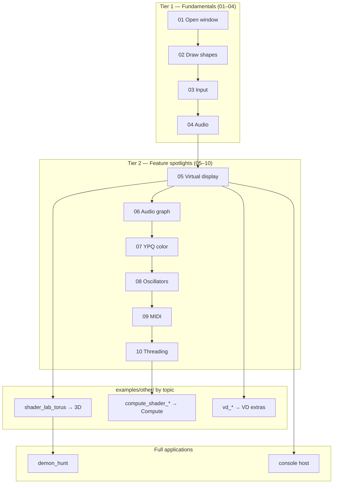

## Examples & Tutorials

**Overview:** Situation ships numbered, self-contained examples under `examples/` that teach one concept each. Every example builds with a single command, uses shared scaffolding from `examples/shared/sit_example.h`, and supports both OpenGL and Vulkan backends.

**Build once, then run any example:**

```bat
build\build_situation.bat static-opengl
build\build_examples.bat static-opengl 01_open_a_window
```

Replace `static-opengl` with `static-vulkan` for the Vulkan backend. See [`examples/README.md`](../../examples/README.md) for the full quick-build table.

**Universal hotkeys** (provided by `sit_example.h` in every numbered example):

| Key | Action |
|-----|--------|
| `ESC` | Quit |
| `F11` | Toggle fullscreen |
| `F9` | Toggle VSync |
| `P` | Toggle pause |
| `F12` | Save screenshot |

---

### Learning path



| After you finish… | Read next |
|-------------------|-----------|
| 01–04 | [Core](core.md), [2D Drawing](drawing_2d.md), [Input](input.md), [Audio](audio.md) |
| 05 | [Virtual Display](virtual_display.md) |
| 06 | [Audio Node Graph](audio_graph.md) |
| 07 | [YPQ Color](ypq_color.md) |
| 08 | [Miscellaneous — oscillators](miscellaneous.md) |
| 09 | [MIDI Integration](midi.md) |
| 10 | [Threading](threading.md) |
| `other/` 3D | [3D Drawing](drawing_3d.md) |
| `other/` compute | [Compute Shaders](compute.md) |

---

### Example → guide index

| Example | Guide module(s) | Build |
|---------|-----------------|-------|
| 01–04 | [Core](core.md), [2D](drawing_2d.md), [Input](input.md), [Audio](audio.md) | `build\build_examples.bat static-opengl NN_*` |
| 05 | [Virtual Display](virtual_display.md) | `… 05_virtual_display_retro` |
| 06 | [Audio Graph](audio_graph.md) | `… 06_audio_node_graph` |
| 07 | [YPQ Color](ypq_color.md) | `… 07_ypq_color_grading` |
| 08 | [Miscellaneous](miscellaneous.md) | `… 08_temporal_oscillators` |
| 09 | [MIDI](midi.md) | `… 09_midi_control` |
| 10 | [Threading](threading.md) | `… 10_thread_pool` |
| `shader_lab_torus` | [3D Drawing](drawing_3d.md) | CMake / `examples/other/` target |
| `compute_shader_image_processing` | [Compute](compute.md) | `examples/other/` |
| `gpu_particle_simulation` | [Compute](compute.md), [3D](drawing_3d.md) | `examples/other/` |
| `demon_hunt` | [VD](virtual_display.md), [3D](drawing_3d.md) | game project under `examples/demon_hunt/` |
| `console` | K-Term + [Compute](compute.md) | `examples/console/` host |

---

### Tier 1 — Fundamentals

<a id="01-open-a-window"></a>

#### 01 — Open a Window (`examples/01_open_a_window/`)

Minimal application: `SituationInit`, main loop with input/update/render phases, `SituationShutdown`. Prints GPU, CPU, and OS info to the console.

| | |
|--|--|
| **Build** | `build\build_examples.bat static-opengl 01_open_a_window` |
| **Keys** | Universal hotkeys only |
| **APIs** | `SituationInit`, `SituationAcquireFrameCommandBuffer`, `SituationCmdBeginRenderPass`, `SituationEndFrame`, `SituationShutdown` |
| **Guide** | [Core Module](core.md) |

#### 02 — Draw Shapes (`examples/02_draw_shapes/`)

Animated colored quads and a bouncing ball using `SituationCmdDrawQuad`.

| | |
|--|--|
| **Build** | `build\build_examples.bat static-opengl 02_draw_shapes` |
| **Keys** | Universal hotkeys only |
| **APIs** | `SituationCmdDrawQuad`, orthographic transforms, delta time |
| **Guide** | [2D Drawing](drawing_2d.md) |

#### 03 — Keyboard and Mouse (`examples/03_keyboard_and_mouse/`)

A movable square controlled by keyboard and mouse input.

| | |
|--|--|
| **Build** | `build\build_examples.bat static-opengl 03_keyboard_and_mouse` |
| **Keys** | Arrow keys / WASD move; mouse position tracked |
| **APIs** | `SituationPollInputEvents`, `SituationIsKeyDown`, `SituationGetMousePosition` |
| **Guide** | [Input Module](input.md) |

#### 04 — Play a Sound (`examples/04_play_a_sound/`)

On-screen piano using procedural tone synthesis — no audio files required.

| | |
|--|--|
| **Build** | `build\build_examples.bat static-opengl 04_play_a_sound` |
| **Keys** | Piano keys (see on-screen layout); universal hotkeys |
| **APIs** | `SituationPlayToneEx`, audio device resume |
| **Guide** | [Audio Module](audio.md) |

---

### Tier 2 — Feature Spotlights

<a id="05-virtual-display-retro"></a>

#### 05 — Virtual Display Retro (`examples/05_virtual_display_retro/`)

Integer-scaled 320×240 CRT framebuffer with corner minimap picture-in-picture.

| | |
|--|--|
| **Build** | `build\build_examples.bat static-opengl 05_virtual_display_retro` |
| **Keys** | `N` toggle minimap · `B` toggle minimap glow · universal hotkeys |
| **APIs** | `SituationCreateVirtualDisplayEx`, VD render pass, `SituationRenderVirtualDisplays`, manual PiP composite |
| **Guide** | [Virtual Display Module](virtual_display.md) |

#### 06 — Audio Node Graph (`examples/06_audio_node_graph/`)

Live ASCII signal-flow diagram: Tone Synth → EQ → Reverb → Mixer → Output.

| | |
|--|--|
| **Build** | `build\build_examples.bat static-opengl 06_audio_node_graph` |
| **Keys** | On-screen node controls (see HUD); universal hotkeys |
| **APIs** | Full node graph create/connect/process API |
| **Guide** | [Audio Node Graph](audio_graph.md) |

#### 07 — YPQ Color Grading (`examples/07_ypq_color_grading/`)

Split-screen color lab with GPU live preview.

| | |
|--|--|
| **Build** | `build\build_examples.bat static-opengl 07_ypq_color_grading` |
| **Keys** | Sliders / presets (see HUD); universal hotkeys |
| **APIs** | YPQ transform uniforms, split render |
| **Guide** | [YPQ Color](ypq_color.md) |

#### 08 — Temporal Oscillators (`examples/08_temporal_oscillators/`)

8-beat polyrhythm pulse machine with visual flash and audio tick.

| | |
|--|--|
| **Build** | `build\build_examples.bat static-opengl 08_temporal_oscillators` |
| **Keys** | Pattern controls (see HUD); universal hotkeys |
| **APIs** | Temporal oscillator registration and triggers |
| **Guide** | [Miscellaneous](miscellaneous.md) |

#### 09 — MIDI Control (`examples/09_midi_control/`)

MIDI port list, piano keyboard, CC bars, and learn mode for reverb room size. Hardware optional (virtual loopback supported).

| | |
|--|--|
| **Build** | `build\build_examples.bat static-opengl 09_midi_control` |
| **Keys** | On-screen piano; MIDI learn; universal hotkeys |
| **APIs** | MIDI port enum, CC routing, learn mode |
| **Guide** | [MIDI Integration](midi.md) |

#### 10 — Thread Pool (`examples/10_thread_pool/`)

64×64 Game of Life comparing serial vs `SituationDispatchParallel` performance.

| | |
|--|--|
| **Build** | `build\build_examples.bat static-opengl 10_thread_pool` |
| **Keys** | `T` run threaded · `R` run serial · `Space` pause/step · universal hotkeys |
| **APIs** | `SituationDispatchParallel`, generational jobs, dual queues |
| **Guide** | [Threading Module](threading.md) |

<a id="27-grid-playfield"></a>

#### 27 — Grid Playfield (`examples/27_grid_playfield/`)

Stacked 2D cell grids — Kenney tile background with scroll, static FG labels, compute Virtual Display, integer scale.

| | |
|--|--|
| **Build** | `build\build_examples.bat static-opengl grid_playfield` |
| **Keys** | `A`/`D` or arrows scroll BG · `Space` auto-scroll · universal hotkeys |
| **APIs** | `SituationGridCreate`, `SituationGridStackPresent`, `SituationGridSetScroll`, compute VD |
| **Guide** | [2D Grid Module](grid.md) |

---

### Tier 3 — Showcase (planned)

`examples/README.md` lists tier 3 examples **11–12** as combined personality demos. When added, they will appear here with build commands. Until then, use tier 2 + `other/` showcases.

---

### 3D rendering (`examples/other/`)

Numbered examples 01–10 focus on 2D, audio, and systems. For **mesh + shader 3D**, build from `examples/other/`:

| Example | Teaches | Start here? |
|---------|---------|-------------|
| `shader_lab_torus` | Orbit camera, depth buffer, custom GLSL, procedural mesh | **Yes** |
| `basic_triangle` | Minimal interactive mesh | After torus |
| `loading_and_rendering_a_3d_model` | GLTF + `SituationDrawModel` | Asset pipeline |
| `vertex_pull_triangle` | Bindless / buffer device address pull | Advanced |
| `demon_hunt` | Full game: VD world, sky shader, post FX | Integration capstone |

See [3D Drawing](drawing_3d.md) for workflow and build commands.

---

### Compute examples (`examples/other/`)

| Example | Teaches | Guide |
|---------|---------|-------|
| `examples/27_grid_playfield/` | Stacked grids → compute VD → composite | [2D Grid](grid.md) |
| `compute_shader_image_processing.c` | SSBO multiply, dispatch, barrier, CPU readback | [Compute](compute.md#pattern-a-ssbo-process-cpu-readback) |
| `gpu_particle_simulation.c` | Shared SSBO/VBO, compute → barrier → instanced draw | [Compute](compute.md#pattern-b-compute-graphics-gpu-particles) |
| `digital_rain.c` | Compute + presentation | [Compute](compute.md#pattern-c-compute-only-presentation) |

**Vulkan note:** runtime GLSL compute requires `SITUATION_ENABLE_SHADER_COMPILER` at library build time — see [Compute — Prerequisites](compute.md#compute-shaders-module).

---

### Virtual Display extras (`examples/other/`)

| Example | Teaches |
|---------|---------|
| `vd_idle_standby_demo.c` | Idle fallback / compositor safety |
| `vd_*` (other) | Integration tests — prefer example **05** for learning |

→ [Virtual Display Module](virtual_display.md)

---

### Full demo — `demon_hunt`

`examples/demon_hunt/` is a complete first-person-style demo combining:

- Low-res world rendered into a [Virtual Display](virtual_display.md)
- Custom sky / post shaders ([3D Drawing](drawing_3d.md))
- Audio and game loop integration

Use it as a **capstone** after example 05 and `shader_lab_torus`. Build via the project's CMake/target for `demon_hunt` (see `examples/other/CMakeLists.txt` and local README if present).

---

### Full demo — Console host (`examples/console/`)

The **K-Term** terminal emulator (`sit/k-term/`) integrates with Situation via a compute-driven glyph layout. The `examples/console/` host is a full application shell:

| | |
|--|--|
| **Role** | VT100/xterm-compatible terminal UI rendered on GPU |
| **Key APIs** | `KTerm_Init`, `KTerm_WriteString`, `KTerm_Update`, compute `DrawTerminal` |
| **Layout** | `SIT_COMPUTE_LAYOUT_GRID` (alias `SIT_COMPUTE_LAYOUT_TERMINAL`) — see [Compute](compute.md) |
| **Docs** | `sit/k-term/doc/` |

This is tier 4 in `examples/README.md` alongside `demon_hunt`.

---

### Legacy examples

`examples/other/` contains many development and integration test files (~85). They are **not** the primary learning path. Use numbered examples 01–10 first, then pick `other/` files by topic using the tables above.

---

## Frequently Asked Questions (FAQ) & Troubleshooting

**Overview:** Common problems when integrating Situation. Always check return values from `SituationInit` and resource creation; call `SituationGetLastErrorMsg()` after any `SituationError` failure. See also [Logging](logging.md).

### Initialization failures

| Symptom | Likely cause | Fix |
|---------|--------------|-----|
| GLFW init failed | Missing GLFW / display server | Install GLFW; on Linux check X11/Wayland |
| OpenGL loader failed | GLAD not linked | Build with `SITUATION_USE_OPENGL` + GLAD |
| Vulkan instance/device failed | SDK or driver | Install Vulkan SDK; try validation layers (`enable_vulkan_validation = true`) |
| Audio device failed | System audio / permissions | Check default output device; resume audio after user gesture |
| Shader compile failed (VK) | No runtime compiler | Rebuild library with `SITUATION_ENABLE_SHADER_COMPILER` |

### Virtual Display issues

| Symptom | Fix |
|---------|-----|
| Blurry pixel art | `SITUATION_SCALING_INTEGER` on create — [Scaling modes](virtual_display.md#scaling-modes) |
| UI draws under world | Higher z-order for UI (lower number = back) — [Compositor stack](virtual_display.md#compositor-stack-z-order) |
| Static VD never updates | `SituationSetVirtualDisplayDirty(id, true)` or `frame_time_mult > 0` |
| Black screen after VD pass | Call `SituationRenderVirtualDisplays` inside **window** pass (`display_id = -1`) |
| Compute VD won't accept draw calls | Use `SITUATION_VD_FLAG_COMPUTE_TARGET` — no raster pass — [Compute target pattern](virtual_display.md#pattern-compute-written-texture) |

### Compute / GPU sync

| Symptom | Fix |
|---------|-----|
| Garbled particles / stale SSBO | Missing barrier: `COMPUTE_SHADER_WRITE` → `VERTEX_SHADER_READ` — [Barriers](compute.md#barriers-non-optional-between-producers-and-consumers) |
| Wrong dispatch results | `groups = ceil(count / local_size_x)` — [Step 1 GLSL](compute.md#step-1-write-glsl-version-450) |
| Pipeline create fails | Match `SIT_COMPUTE_LAYOUT_*` to shader descriptor sets |

### Hot-reload

| Question | Answer |
|----------|--------|
| Shaders not reloading? | Set `SituationInitInfo.hot_reload_poll_rate > 0` (debug build) — [Hot-Reloading](hot_reload.md) |
| `SituationCheckHotReloads()` does nothing | Legacy no-op; polling is on I/O thread |
| Models / compute auto-reload? | **No** — shaders/textures/audio only; compute is manual reload |

### Threading

| Question | Answer |
|----------|--------|
| Where is the pool? | Created at init — [Thread landscape](threading.md) |
| Can workers call graphics API? | **No** — GPU recording is main thread only |
| `DispatchParallel` from worker? | **No** — main thread only — example 10 shows correct usage |

### Resource invalid errors

Occur when using a handle (`id == 0`) that was never created or was already destroyed. Verify creation return code before first use.

### Performance tips

- Batch similar draw calls; minimize pipeline/texture churn per frame.
- Use `SituationCmdDrawTextEx` for HUD blocks instead of per-glyph draws.
- VD compositor: mark static layers dirty only when content changes.
- Profile serial vs parallel — example 10 is the reference for CPU parallelism.

### Backend differences (OpenGL vs Vulkan)

- OpenGL: easier bring-up; some barriers emulated via `glMemoryBarrier`.
- Vulkan: explicit barriers and descriptor sets; enable validation layers during development.
- Both: same Situation API surface; examples accept `static-opengl` or `static-vulkan`.

### Debugging checklist

1. Check `SituationInit` and every `SituationError` return.
2. `SituationGetLastErrorMsg()` / `SituationErrorToString()`.
3. Vulkan: validation layers on.
4. OpenGL: `SIT_CHECK_GL_ERROR` after suspicious calls — [Logging](logging.md).
5. Reproduce with the **smallest numbered example** for the feature (e.g. 05 for VD, 10 for threads).
