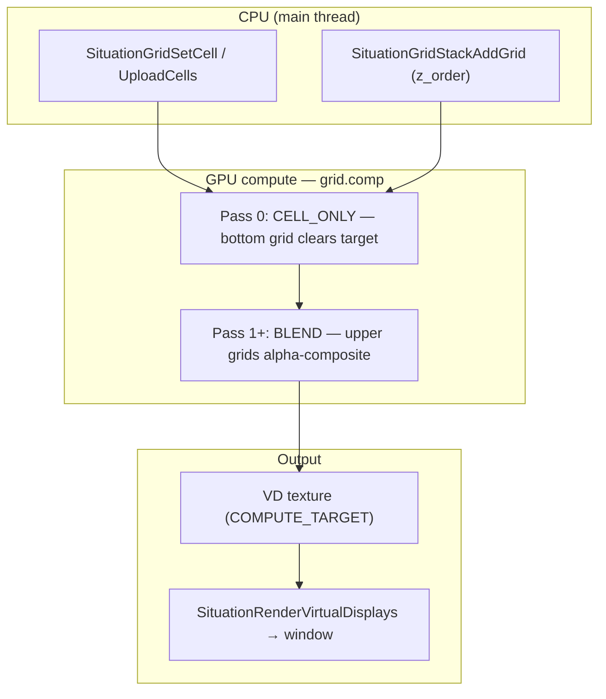
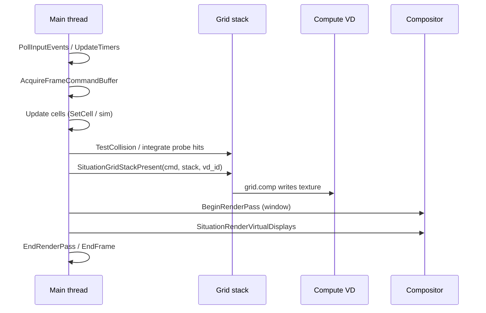

## 2D Grid Module

**Overview:** The **grid subsystem** renders uniform 2D cell surfaces on the GPU via compute (`sit/gpu/grid.comp`). Each cell is **`code` + `fg` + `bg`** — the same core model K-Term uses for terminal glyphs, repurposed for tile playfields, layered backgrounds, and (eventually) collision maps.

**Layers are stacked grids**, not multiple SSBO planes inside one surface. You create separate `SituationGridSurface` handles (BG, FG, UI, collision), add them to a `SituationGridStack`, and composite bottom→top into a [Virtual Display](virtual_display.md) compute target.

**Status (v2.4.407):** Phase **B** (single grid + VD present), **C** (stack + scroll), **D** (actor grid clear/blit), and **E v1** (CPU collision probe vs collision grid) are shipped. GPU `GRID_PASS_COLLIDE` in `grid.comp` is deferred to E.2. See [GRID_RENDER_PLAN.md](../plan/GRID_RENDER_PLAN.md) for the full roadmap.

**Canonical example:**

| Example | What it teaches |
|---------|-----------------|
| `examples/27_grid_playfield/` | Kenney tile BG + scrolling, **actor grid** (moving entity), static FG labels, `SituationGridStackPresent`, integer-scaled compute VD |

**Related:** [Virtual Display — compute target](virtual_display.md#pattern-compute-written-texture) · [Compute](compute.md) · [Fonts — grid atlases](font.md#situationloadbitmapfontfromtexture) · [2D Drawing](drawing_2d.md) · [Text rendering](text_rendering.md) · API header `sit/situation_api_grid.h` · Harness `tests/harness/test_grid.c`

---

### When to use the grid vs other 2D paths

| Goal | Use |
|------|-----|
| HUD panels, debug rects, one-off sprites | [2D Drawing](drawing_2d.md) — `SituationCmdDrawQuad` / `DrawTexture` |
| Sparse labels, menus, chat | [Text rendering](text_rendering.md) — `SituationCmdDrawTextEx` |
| **Fixed cell playfield** (tile map, roguelike, terminal-style world) | **Grid** — dense cells, GPU composite |
| **Multiple scrolling planes** (parallax BG + FG + UI) | **Grid stack** — one surface per plane |
| **Solidity separate from art** (future) | **Collision grid** in stack (`SIT_GRID_ROLE_COLLISION`) |

The grid path excels when the world is **cell-addressable** and you want **integer scroll**, **layer compositing**, and (Phase E+) **GPU collision feedback** without maintaining a separate tile engine.

---

### Mental model



**One grid** = `cols × rows` cells, each `cell_w × cell_h` pixels → pixel size `(cols * cell_w) × (rows * cell_h)`.

**One stack** = up to 8 grids sharing the **same topology** (same cols, rows, cell size). Each grid may use a **different font/atlas** via `SituationGridSetFont`.

---

### Cell model (`SitGridCell`)

```c
typedef struct SitGridCell {
    uint32_t code;    /* Atlas index or ASCII; 0 = no glyph */
    uint32_t fg;      /* Foreground RGBA8 — SIT_GRID_COLOR_RGBA8(r,g,b,a) */
    uint32_t bg;      /* Background RGBA8 */
    uint32_t flags;   /* K-Term bridge — usually 0 for games */
    uint32_t attr0;   /* K-Term bridge (underline color) */
    uint32_t attr1;   /* K-Term bridge (strike color) */
    uint32_t version; /* CPU-only upload generation */
} SitGridCell;

#define SIT_GRID_CELL(c, f, b) ((SitGridCell){ .code = (c), .fg = (f), .bg = (b) })
```

**Game cells** typically set only `code`, `fg`, and `bg` via `SIT_GRID_CELL`.

| Field | Role |
|-------|------|
| `code` | Index into the grid's font atlas (row-major: `col = code % atlas_cols`, `row = code / atlas_cols`) |
| `fg` | Tint applied to atlas **alpha** (glyph shape) |
| `bg` | Solid fill behind the glyph |

**Transparency (stack blend pass):** When `code == 0` **and** `bg` alpha is `0`, the pixel **passes through** to layers below (`SIT_GRID_PASS_BLEND`).

**Solid tiles without a glyph:** `code = 0`, opaque `bg` (sky color, dirt fill).

Color packing:

```c
uint32_t sky = SIT_GRID_COLOR_RGBA8(135, 206, 235, 255);
uint32_t clear = SIT_GRID_COLOR_TRANSPARENT;
```

---

### Tile atlases and fonts

Each grid binds one `SituationFont` atlas (`SituationGridSetFont`). For Kenney-style tile sheets:

```c
SituationTexture sheet = {0};
SituationLoadTexture("examples/assets/.../spritesheet-tiles-default.png", false, &sheet);

SituationFont tile_font = {0};
SituationLoadBitmapFontFromTexture(sheet, 64, 64, 0, &tile_font);
SituationGridSetFont(bg_grid, tile_font);
```

See [Fonts — `SituationLoadBitmapFontFromTexture`](font.md#situationloadbitmapfontfromtexture). Use **NEAREST** filtering (default for loaded textures in grid context). Atlas layout is a uniform grid: `chars_per_row = atlas_width / cell_w`.

**Note:** `grid.comp` composites atlas **alpha** with `fg`/`bg` — full-color PNG tiles appear as **fg-tinted silhouettes**. For Phase C demos, pick `fg` colors per tile type (grass green, brick brown). Full RGB atlas sampling is a future shader enhancement.

A label grid can keep the **built-in 8×8 VGA font** (zero-initialized `SituationFont` → default atlas, centered inside larger cells).

---

### Single grid lifecycle

```c
SituationGridSurface grid = SituationGridCreate(cols, rows, cell_w, cell_h);

SitGridCell grass = SIT_GRID_CELL(tile_index, SIT_GRID_COLOR_RGBA8(76, 175, 80, 255), SIT_GRID_COLOR_TRANSPARENT);
SituationGridSetCell(grid, x, y, grass);

/* Optional: bulk upload after editing a row range */
SituationGridUploadCells(grid, cells, count, dirty_row_begin, dirty_row_end);

SituationGridDestroy(grid);
```

`SituationGridSetCell` marks rows dirty; the SSBO upload happens on the next dispatch.

---

### Per-grid configuration

| API | Purpose |
|-----|---------|
| `SituationGridSetFont` | Atlas for `code` lookup |
| `SituationGridSetScroll` | Scroll offset in **cells** (8.8 fixed internally); subtracts from sample coords, wraps at grid bounds |
| `SituationGridSetScaleMode` | Reserved for VD integration (`SITUATION_SCALING_INTEGER` default) |
| `SituationGridSetRole` | `SIT_GRID_ROLE_VISUAL` (default), `SIT_GRID_ROLE_COLLISION` (skipped during blend), `SIT_GRID_ROLE_UI` |

**Scroll example:** `SituationGridSetScroll(bg_grid, 2.5f, 0.0f)` shifts the background 2.5 cells to the right (content appears to move left).

---

### Stack compositing order

```c
SituationGridStack stack = SituationGridStackCreate();
SituationGridStackAddGrid(stack, bg_grid, 0);   /* bottom */
SituationGridStackAddGrid(stack, fg_grid, 1);   /* top */

SituationGridStackPresent(cmd, stack, vd_id);
```

`SituationGridStackPresent` internally:

1. Sorts entries by `z_order` (lower = farther back).
2. Skips grids with `SIT_GRID_ROLE_COLLISION`.
3. Dispatches the **first visual grid** with `SIT_GRID_PASS_CELL_ONLY` (full redraw — does not blend with the previous VD contents).
4. Dispatches each subsequent visual grid with `SIT_GRID_PASS_BLEND` (transparent cells pass through).
5. Inserts compute→compute barriers between blend layers.

All grids in the stack must match dimensions (`cols`, `rows`, `cell_w`, `cell_h`). The VD resolution must equal `cols * cell_w` by `rows * cell_h`.

---

### Actor grid (Phase D — interim entity layer)

Until the **sprite subsystem** (Phase K) lands, moving entities use a **dedicated grid layer** in the stack: each frame, **clear the layer** and **stamp** entity cells.

```c
SitGridCell empty = SIT_GRID_CELL(0, SIT_GRID_COLOR_TRANSPARENT, SIT_GRID_COLOR_TRANSPARENT);
SituationGridClear(actor_grid, empty);

SitGridCell body[] = {
    SIT_GRID_CELL(tile_head, fg, SIT_GRID_COLOR_TRANSPARENT),
    SIT_GRID_CELL(tile_body, fg, SIT_GRID_COLOR_TRANSPARENT),
};
SituationGridBlitCells(actor_grid, entity_x, entity_y, body, 1, 2);

SituationGridStackAddGrid(stack, bg_grid, 0);
SituationGridStackAddGrid(stack, actor_grid, 1);
SituationGridStackAddGrid(stack, fg_grid, 2);
```

| API | Purpose |
|-----|---------|
| `SituationGridClear` | Fill every cell (typical actor-layer reset) |
| `SituationGridBlitCells` | Stamp a `src_cols × src_rows` block at `(dst_x, dst_y)`; clips to grid bounds |

**Pattern:** simulation updates position → `Clear` → `BlitCells` → `StackPresent`. Same `SitGridCell` tile setup as the BG grid; only placement changes each frame. Example 27 walks a 1×2 entity between BG and UI layers.

---

### Collision grid (Phase E v1 — CPU probe)

Solidity lives on a **dedicated collision grid** in the stack (`SIT_GRID_ROLE_COLLISION` — skipped during blend). A probe is an **AABB in cell coordinates** (same space as `SetCell` / `BlitCells`).

**Solidity rule (v1):** cell is solid when `code != 0` **and** `bg.a > 0`.

```c
SituationGridSetRole(collide_grid, SIT_GRID_ROLE_COLLISION);
/* fill wall / ground cells with opaque bg + non-zero code */

SitGridCollisionProbe probe = {
    .probe_id = 1,
    .x = entity_x,
    .y = (float)entity_y,
    .w = (float)entity_w,
    .h = (float)entity_h,
};
SituationGridSetCollisionProbe(stack, probe);

SitGridCollisionEvent hits[8];
int hit_count = 0;
SituationGridTestCollision(cmd, stack, probe.probe_id, hits, 8, &hit_count);
for (int i = 0; i < hit_count; ++i) {
    if (hits[i].normal_flags & SIT_GRID_COLLISION_NORM_LEFT)  { /* push right */ }
    if (hits[i].normal_flags & SIT_GRID_COLLISION_NORM_RIGHT) { /* push left  */ }
}
```

| API | Purpose |
|-----|---------|
| `SituationGridSetCollisionProbe` | Set probe AABB before collide |
| `SituationGridDispatchCollide` | Upload collision grid + resolve overlaps (CPU v1) |
| `SituationGridReadCollisions` | Copy events from last dispatch |
| `SituationGridTestCollision` | Dispatch + read in one call |

**Frame contract:** simulate motion → set probe → `TestCollision` (or `DispatchCollide` + `ReadCollisions`) → integrate separation → update actor cells → `StackPresent`. Example 27 bounces the actor off side walls encoded in `g_collide_grid`.

**Note:** v2.4.407 resolves on CPU against `cpu_cells`; collision grid SSBO is flushed for a future GPU `GRID_PASS_COLLIDE` pass (E.2).

---

### Virtual Display workflow (recommended)

Grid output targets a **compute VD**, then composites to the window — same pattern as K-Term and example 27.

```c
int vd_w = cols * cell_w;
int vd_h = rows * cell_h;

int vd_id = -1;
SituationCreateVirtualDisplayEx(
    (Vector2){{(float)vd_w, (float)vd_h}},
    1.0, 0,
    SITUATION_SCALING_INTEGER,
    SITUATION_BLEND_NONE,
    SITUATION_VD_FLAG_COMPUTE_TARGET,
    &vd_id);

/* Inside frame, before main-window render pass: */
SituationGridStackPresent(cmd, stack, vd_id);

SituationRenderPassInfo main_rp = {0};
main_rp.display_id = -1;
main_rp.color_attachment.loadOp = SIT_LOAD_OP_CLEAR;
main_rp.color_attachment.clear.color = (ColorRGBA){0, 0, 0, 255};
SituationCmdBeginRenderPass(cmd, &main_rp);
SituationRenderVirtualDisplays(cmd);   /* integer-scaled playfield */
/* HUD via SituationCmdDrawTextEx on window, if desired */
SituationCmdEndRenderPass(cmd);
```

Requirements:

- VD must be created with `SITUATION_VD_FLAG_COMPUTE_TARGET`.
- VD pixel size must match stack pixel size exactly.
- `SituationGridStackPresent` runs **outside** a render pass (compute dispatch).
- Host chrome / HUD can still use [2D Drawing](drawing_2d.md) on `display_id = -1`.

Full VD compositor details: [Virtual Display Module](virtual_display.md).

---

### Frame loop pattern



**Frame contract:** simulate → set collision probe → `TestCollision` (integrate normals) → upload/repaint grids → `StackPresent` → window composite. Low-level split: `DispatchCollide` then `ReadCollisions`.

---

### Pass modes (`SitGridPassMode`)

| Mode | Use |
|------|-----|
| `SIT_GRID_PASS_CELL_ONLY` | First layer or single-grid draw — writes all pixels |
| `SIT_GRID_PASS_BLEND` | Upper stack layers — transparent cells preserve destination |
| `SIT_GRID_PASS_COLLIDE` | Phase E.2 — GPU probe vs collision grid (CPU resolve shipped in v2.4.407) |

Low-level single-grid dispatch (custom target texture):

```c
SituationTexture target = {0};
SituationGetVirtualDisplayTexture(vd_id, &target);
SituationGridDispatch(cmd, grid, target, SIT_GRID_PASS_CELL_ONLY);
```

`SituationGridPresent` combines `GetVirtualDisplayTexture` + `Dispatch` for one grid.

---

### API quick reference

| Category | Functions |
|----------|-----------|
| **Create/destroy** | `SituationGridCreate`, `SituationGridDestroy` |
| **Cells** | `SituationGridSetCell`, `SituationGridUploadCells`, `SituationGridClear`, `SituationGridBlitCells` |
| **Config** | `SituationGridSetFont`, `SituationGridSetScroll`, `SituationGridSetRole`, `SituationGridSetScaleMode` |
| **Draw** | `SituationGridDispatch`, `SituationGridPresent` |
| **Stack** | `SituationGridStackCreate`, `SituationGridStackDestroy`, `SituationGridStackAddGrid`, `SituationGridStackPresent` |
| **Collision (Phase E)** | `SituationGridSetCollisionProbe`, `SituationGridDispatchCollide`, `SituationGridReadCollisions`, `SituationGridTestCollision` |

Public types and macros: `sit/situation_api_grid.h`.

---

### K-Term relationship

K-Term (`sit/k-term/`) was the extraction source. It adapts `EnhancedTermChar` → `SitGridCell` and routes through **`SituationGrid*`** when **`KTERM_USE_SIT_GRID=1`** (default since v2.4.408). Set **`KTERM_USE_SIT_GRID=0`** at compile time to keep the preserved **`terminal.comp`** baseline for side-by-side comparison. Terminal-specific attributes (`SIT_GRID_ATTR_*`) remain for VT bridge compatibility; game grids leave `flags` at zero.

For terminal emulation, see K-Term docs and [Compute — terminal layout](compute.md). For new playfield games, use **`SituationGrid*`** directly.

---

### Troubleshooting

| Symptom | Likely cause | Fix |
|---------|--------------|-----|
| `GridStackPresent`: VD not COMPUTE_TARGET | Raster VD used | Create with `SITUATION_VD_FLAG_COMPUTE_TARGET` |
| Resolution mismatch error | VD size ≠ grid pixels | Match `cols*cell_w`, `rows*cell_h` |
| Shader compile failed (examples + render thread) | Pipeline compile off GL context | Rebuild v2.4.406+ library; uses host loader context |
| Black playfield | No visual grids / all transparent | Ensure at least one opaque bottom layer |
| Top layer hides bottom | Wrong z_order | Lower `z_order` = back |
| Collision grid visible | Role not set | `SituationGridSetRole(grid, SIT_GRID_ROLE_COLLISION)` |
| Tiles wrong shape / bleed | Atlas stride ≠ cell size | Align Kenney sheets to uniform grid or pad atlas |
| `grid.comp` not found | Wrong working directory | Run from repo root; shaders load from `sit/gpu/` |
| Labels tiny in large cells | Default font is 8×8 | Expected — glyph is centered with padding in `grid.comp` |

Harness regression: `build\run_tests.bat opengl --module grid` (eight tests: checkerboard, VD present, stack blend, scroll, collision skip, actor over tiles, blit/clear, collision probe).

---

### Roadmap pointers

| Phase | Feature | Guide status |
|-------|---------|--------------|
| **C** | Stack + scroll + example 27 | **Documented above** |
| **D** | Actor grid repaint pattern | **Documented above** |
| **E** | CPU collision probe (GPU pass E.2 pending) | **Documented above** |
| **H** | `platformer_plumber.c` conversion | Full-game case study (planned) |
