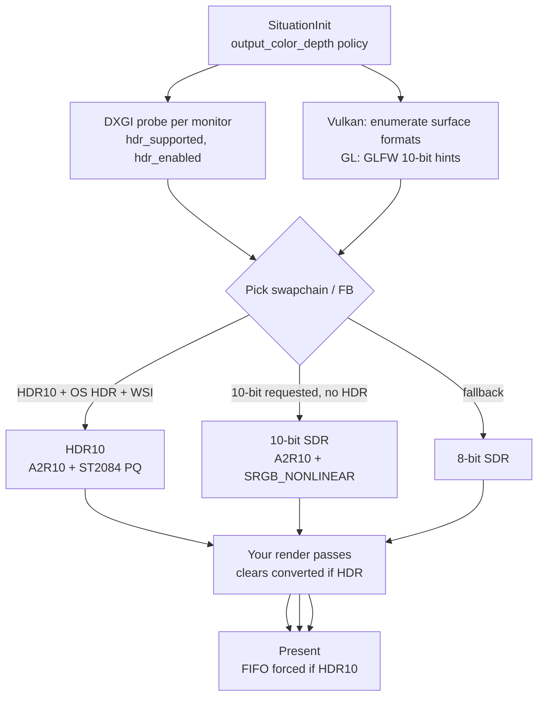

## HD Color Output Module _(10-bit SDR & HDR10)_

**Overview:** **HD color output** is Situation's main-window **bit-depth and color-space policy** — how pixels leave your app on the way to the monitor. The library can target:

- **8-bit SDR** — default; 8 bits per channel, sRGB-ish swapchain (CI, most examples)
- **10-bit SDR** — `A2R10G10B10` + sRGB non-linear WSI; less banding in smooth gradients, **not** HDR
- **HDR10** — same 10-bit container + **ST.2084 PQ** color space + Windows HDR compositor; true extended-luminance path on supported hardware

Configure once at init via `SituationInitInfo.output_color_depth`. Query what actually activated with `SituationGetGraphicsCaps()`.

**Not the same as YPQ grading:** [YPQ Color](ypq_color.md) is a *color manipulation* space on RGB/texture data. HD color output is *where those pixels land* — swapchain format, PQ encoding, and OS compositor. They meet at encode time (clears, custom HDR write paths) — see [Integration with YPQ](#integration-with-ypq-and-pq).

**Canonical verification:** harness module `output_color_depth` (`tests/harness/test_output_color_depth.c`); opt-in HDR with `SIT_TEST_HDR=1`.

**Related:** [Core — `SituationInitInfo`](core.md) · [Window & Display — monitors](window_display.md) · [YPQ Color — PQ helpers](ypq_color.md#10-bit-and-hdr-output-paths) · [`doc/plan/10BIT_COLOR_OUTPUT_PLAN.md`](../plan/10BIT_COLOR_OUTPUT_PLAN.md)

---

### Why use HD color output?

| Goal | Path |
|------|------|
| **Less banding** in smooth gradients (sky, vignettes) | `SIT_OUTPUT_COLOR_10BIT` or `AUTO` → 10-bit SDR when WSI allows |
| **HDR10 on Windows** (PQ, OS HDR compositor) | `SIT_OUTPUT_COLOR_HDR10` or `AUTO` with **Use HDR** on in Windows Settings |
| **Predictable CI / pixel tests** | `SIT_OUTPUT_COLOR_8BIT` (harness default) |
| **Uncapped FPS / toggle VSync freely** | **8-bit** — HDR path forces **FIFO** present on Vulkan |

Most 2D games and numbered examples stay on **8-bit** intentionally (`sit_example.h` sets `SIT_OUTPUT_COLOR_8BIT` so F9 VSync toggle is not overridden by HDR auto-detection).

---

### Definitions — do not conflate these

| Term | Means in Situation | Does **not** mean |
|------|-------------------|-------------------|
| **8-bit SDR** | 8 bpc swapchain / default framebuffer | Automatic wide gamut |
| **10-bit SDR** | `A2R10G10B10` + `SRGB_NONLINEAR` (Vulkan) or ≥10-bit GLFW hints (OpenGL) | HDR, PQ, extra nits |
| **HDR10 active** | `output_hdr_active == 1` — WSI `HDR10_ST2084` + OS HDR on window monitor | "10-bit alone" |
| **`SIT_FEATURE_HDR_OUTPUT`** | Set only when **HDR10** is active | 10-bit SDR |
| **`SIT_FEATURE_10BIT_SDR_OUTPUT`** | Set when 10-bit SDR container active, HDR off | HDR |

---

### Mental model — policy to pixels



**Internal textures and VDs** remain their normal formats (typically 8-bit RGBA). HD color applies to the **main window swapchain / default framebuffer** only — not automatically to [Virtual Display](virtual_display.md) layers unless you design for it.

---

### Policy — `SituationOutputColorDepth`

Set on `SituationInitInfo.output_color_depth`. Zero-init / `SituationInitInfoDefault()` → **`SIT_OUTPUT_COLOR_AUTO`**.

```c
typedef enum SituationOutputColorDepth {
    SIT_OUTPUT_COLOR_AUTO   = 0, /**< Prefer HDR10 when OS+WSI confirm; else 10-bit SDR; else 8-bit */
    SIT_OUTPUT_COLOR_8BIT   = 1, /**< Force 8-bit SDR (harness / examples default) */
    SIT_OUTPUT_COLOR_10BIT  = 2, /**< Request 10-bit SDR only (no PQ / HDR color space) */
    SIT_OUTPUT_COLOR_HDR10  = 3, /**< Request HDR10/PQ; fail-soft to 10-bit SDR then 8-bit */
} SituationOutputColorDepth;
```

| Policy | HDR10 attempted? | 10-bit SDR attempted? | Typical use |
|--------|------------------|----------------------|-------------|
| `AUTO` | Yes **if** OS HDR on **window monitor** | Yes if HDR unavailable | Desktop apps on HDR displays |
| `8BIT` | No | No | Games, CI, VSync experiments |
| `10BIT` | No | Yes | Banding reduction without HDR compositor |
| `HDR10` | Yes (explicit) | Fallback only | HDR showcase / grading tools |

**Fail-soft:** Never fails `SituationInit()` solely for color depth — falls back with `stderr` diagnostics when HDR10 or 10-bit SDR is unavailable.

---

### How selection works (by backend)

#### Vulkan (preferred for HD color on Windows)

At swapchain creation, `_SituationVulkanPickSurfaceFormat()`:

1. If policy wants HDR **and** `wsi_supports_hdr10` **and** DXGI `hdr_enabled` on the **window's monitor** → `A2R10G10B10` (or `A2B10G10R10`) + `VK_COLOR_SPACE_HDR10_ST2084_EXT`
2. Else if policy wants 10-bit **and** `wsi_supports_10bit_sdr` → `A2R10G10B10` + `VK_COLOR_SPACE_SRGB_NONLINEAR_KHR`
3. Else → 8-bit UNORM (existing priority chain)

Requires `VK_EXT_swapchain_colorspace` at instance creation for HDR10 color spaces.

**Present mode:** When `output_hdr_active`, present mode is forced to **`VK_PRESENT_MODE_FIFO_KHR`** (VSync) for Windows HDR compositor compatibility — uncapped IMMEDIATE present is not used on HDR10 swapchains.

**Resize / monitor move:** Swapchain is recreated; format picker re-runs. Display cache refreshes on monitor hot-plug (`SituationRefreshDisplays()`).

#### OpenGL (best-effort 10-bit SDR only)

When policy is `AUTO`, `10BIT`, or `HDR10`, GLFW window hints request **10 bits** per RGB channel before `glfwCreateWindow`. After GLAD load, actual framebuffer depth is queried; 10-bit state activates only if all channels report ≥ 10 bits.

**No HDR10 on OpenGL v1** — no PQ swapchain color space equivalent. `HDR10` policy degrades to 10-bit SDR or 8-bit.

---

### Query runtime state — `SituationGetGraphicsCaps()`

After `SituationInit()`:

```c
SituationGraphicsCaps caps = {0};
SituationGetGraphicsCaps(&caps);

printf("backend=%d bpc=%u active10=%u hdr=%u space=%u\n",
    (int)caps.backend,
    caps.output_bits_per_channel,
    caps.output_color_depth_active,
    caps.output_hdr_active,
    caps.output_color_space);
printf("WSI 10-bit SDR=%u HDR10=%u\n",
    caps.wsi_supports_10bit_sdr,
    caps.wsi_supports_hdr10);
```

| Field | Meaning |
|-------|---------|
| `output_bits_per_channel` | `8` or `10` |
| `output_color_depth_active` | `1` = 10-bit swapchain / FB in use |
| `output_hdr_active` | `1` = HDR10 ST2084 path active |
| `output_color_space` | `SIT_OUTPUT_COLOR_SPACE_SDR_SRGB` or `HDR10_ST2084` |
| `wsi_supports_10bit_sdr` | Vulkan: WSI lists 10-bit + sRGB non-linear |
| `wsi_supports_hdr10` | Vulkan: WSI lists 10-bit + HDR10_ST2084 |

Feature flags (via `SituationGetGraphicsCaps` / feature mask):

| Flag | When true |
|------|-----------|
| `SIT_FEATURE_HDR_OUTPUT` | HDR10 active only |
| `SIT_FEATURE_10BIT_SDR_OUTPUT` | 10-bit SDR, HDR off |

---

### Monitor HDR metadata — `SituationGetDisplays()`

Each `SituationDisplayInfo` includes DXGI fields (Windows; zero/false elsewhere):

```c
typedef struct SituationDisplayInfo {
    /* ... name, modes, glfw handle ... */
    bool     hdr_supported;        /* panel/path can do HDR */
    bool     hdr_enabled;          /* OS "Use HDR" on for this output */
    uint8_t  bits_per_color;       /* 8, 10, 12, 16; 0 if unknown */
    float    max_luminance_nits;   /* DXGI MaxFullFrameLuminance; 0 if unknown */
    bool     dxgi_metadata_valid;
} SituationDisplayInfo;
```

HDR10 swapchain selection uses **`hdr_enabled` on the monitor containing the window**, not merely `hdr_supported`. User must enable **Settings → System → Display → Use HDR** for that monitor.

```c
SituationDisplayInfo* displays = NULL;
int count = 0;
if (SituationGetDisplays(&displays, &count) == SITUATION_SUCCESS) {
    for (int i = 0; i < count; i++) {
        printf("%s: HDR %s/%s, %u bpc, %.0f nits\n",
            displays[i].name,
            displays[i].hdr_enabled ? "ON" : "off",
            displays[i].hdr_supported ? "capable" : "no",
            displays[i].bits_per_color,
            displays[i].max_luminance_nits);
    }
    SituationFreeDisplays(displays, count);
}
```

Place the window on the HDR monitor before init, or move it then recreate swapchain (resize/fullscreen) — see [Window & Display — multi-monitor](window_display.md#multi-monitor-windowing).

---

### Quick start — request HDR10

**Prerequisites (Windows + Vulkan build):**

- HDR-capable monitor with **Use HDR** enabled
- Window on that monitor (fullscreen borderless or large windowed)
- `static-vulkan` build with shader compiler as usual

```c
SituationInitInfo init = SituationInitInfoDefault(1920, 1080, "HDR Demo");
init.output_color_depth = SIT_OUTPUT_COLOR_HDR10;
/* Or AUTO to pick HDR only when OS HDR is on: */
/* init.output_color_depth = SIT_OUTPUT_COLOR_AUTO; */

if (SituationInit(argc, argv, &init) != SITUATION_SUCCESS) {
    return -1;
}

SituationGraphicsCaps caps = {0};
SituationGetGraphicsCaps(&caps);
if (!caps.output_hdr_active) {
    fprintf(stderr, "HDR10 not active — running %u bpc SDR (space=%u)\n",
        caps.output_bits_per_channel, caps.output_color_space);
}
```

**Clears in HDR10:** Pass ordinary sRGB `ColorRGBA` in render pass clear — Situation converts sRGB → linear → **PQ** for the swapchain when `output_hdr_active`.

For debugging clear values: `SituationColorRgbaToHdrPqClear(ColorRGBA srgb)`.

---

### Integration with YPQ and PQ

| Stage | What happens |
|-------|----------------|
| **Normal 2D/3D drawing** | Shaders output values interpreted for current swapchain; standard paths assume SDR unless HDR-aware |
| **YPQ grade shader** | Still grades in linear/YIQ; output must match swapchain encoding for HDR tooling |
| **PQ encode helpers** | `SituationLinearToPq`, `SituationPqToLinear`, `SituationYpqToRgb10PackedHdr` — see [YPQ — 10-bit and HDR paths](ypq_color.md#10-bit-and-hdr-output-paths) |
| **Readback** | `SituationReadFramebuffer` downconverts to RGBA8; **`SituationReadFramebufferHdr`** returns raw A2R10G10B10 when HDR active |
| **Screenshots** | Downconvert to 8-bit BMP for compatibility |

Most apps using only `SituationColorToYPQ` / GPU grade from example 07 **do not** need PQ packers — only enable HD output when you want the **display path** to carry HDR10.

---

### Limitations and trade-offs

| Limitation | Detail |
|------------|--------|
| **OpenGL** | 10-bit SDR best-effort only; **no HDR10** |
| **HDR forces FIFO VSync** | Uncapped FPS / IMMEDIATE present not used on HDR10 Vulkan swapchains |
| **`AUTO` + HDR monitor** | May enable HDR and FIFO even if you wanted torn VSync-off benchmarking — use `8BIT` for that |
| **VD / off-screen targets** | Not auto-upgraded to 10-bit/HDR — main window only |
| **Textures stay 8-bit** | Upload paths unchanged; banding fix is at **output**, not asset storage |
| **Linux / macOS** | DXGI HDR metadata absent; Vulkan HDR10 path depends on WSI — often 8-bit or 10-bit SDR only |
| **Readback / screenshots** | Always 8-bit unless `SituationReadFramebufferHdr` on active HDR |
| **Hot-plug** | Call `SituationRefreshDisplays()`; swapchain may need resize/fullscreen toggle to re-pick format |
| **CI harness** | Defaults `SIT_OUTPUT_COLOR_8BIT`; HDR tests opt-in via `SIT_TEST_HDR=1` |

---

### Testing and diagnostics

**Always-on harness test:** `report_hdr_10bit_display_capability` — prints DXGI + caps summary.

**Opt-in environment variables:**

| Variable | Effect |
|----------|--------|
| `SIT_TEST_10BIT=1` | Run 10-bit SDR probe tests |
| `SIT_TEST_HDR=1` | Run HDR10 caps, format log, PQ ramp readback tests |
| `SIT_TEST_HDR_VISUAL=1` | Visual grading bands (manual inspection) |

```powershell
Set-Location "c:\Users\User\Desktop\hobby\_kiro\situation\build"
$env:SIT_TEST_HDR = "1"
$env:PATH = "dll;C:\msys64\mingw64\bin;$env:PATH"
& ".\sit_test_vulkan.exe" --module output_color_depth
```

Vulkan debug builds log swapchain format lines (`Situation [Vulkan Debug]: swapchain fmt=...`).

---

### Troubleshooting

| Symptom | Likely cause | Fix |
|---------|--------------|-----|
| `output_hdr_active == 0` with `HDR10` policy | OS HDR off | Enable **Use HDR** in Windows Display settings |
| HDR10 off, `stderr` WSI message | Driver lacks HDR10 color space | Update GPU driver; check `wsi_supports_hdr10` |
| HDR on but dark/washed image | Content not PQ-encoded | Use HDR-aware clears/shaders; check `_SituationColorRgbaToClearFloats` path |
| VSync won't disable | HDR active | Expected — FIFO forced; use `8BIT` for VSync-off tests |
| Example F9 VSync "does nothing" | Was on AUTO/HDR | Examples force `SIT_OUTPUT_COLOR_8BIT` — match that for benchmarks |
| 10-bit requested, still 8 bpc | WSI or GL FB lacks 10-bit | Read `stderr` fallback message; check caps |
| Wrong monitor | Window on SDR display | `SituationSetWindowPosition` / `SetWindowMonitor` to HDR panel |
| Banding unchanged | Textures 8-bit, output 8-bit | Confirm `output_color_depth_active`; smooth gradients in **output**, not compressed assets |

Always call `SituationGetGraphicsCaps()` after init — do not assume policy equals reality.

---

### API quick reference

#### Init policy

```c
SituationInitInfo init = SituationInitInfoDefault(w, h, title);
init.output_color_depth = SIT_OUTPUT_COLOR_AUTO; /* or 8BIT, 10BIT, HDR10 */
SituationInit(argc, argv, &init);
```

#### Query

```c
void SituationGetGraphicsCaps(SituationGraphicsCaps* out);
SituationError SituationGetDisplays(SituationDisplayInfo** out, int* count);
void SituationRefreshDisplays(void);
```

#### Readback (HDR)

```c
SituationError SituationReadFramebuffer(const SituationReadPixelsDesc* desc,
    void* dst, size_t dst_size);  /* RGBA8 or RGB10 packed per desc */

SituationError SituationReadFramebufferHdr(const SituationReadPixelsDesc* desc,
    uint32_t* dst, size_t dst_size);  /* requires output_hdr_active */
```

#### PQ / clear helpers

```c
ColorRGBA SituationColorRgbaToHdrPqClear(ColorRGBA srgb);
float SituationLinearToPq(float linear);
float SituationPqToLinear(float pq);
uint32_t SituationYpqToRgb10PackedHdr(ColorYPQf ypq);
```

Full YPQ/HDR science APIs: [YPQ Color Module](ypq_color.md#10-bit-and-hdr-output-paths) · index section "YPQ / HDR color science".

#### Enums

```c
SituationOutputColorDepth   /* SIT_OUTPUT_COLOR_* */
SituationOutputColorSpace   /* SDR_SRGB, HDR10_ST2084 */
```

Implementation plan and phase history: [`doc/plan/10BIT_COLOR_OUTPUT_PLAN.md`](../plan/10BIT_COLOR_OUTPUT_PLAN.md).
