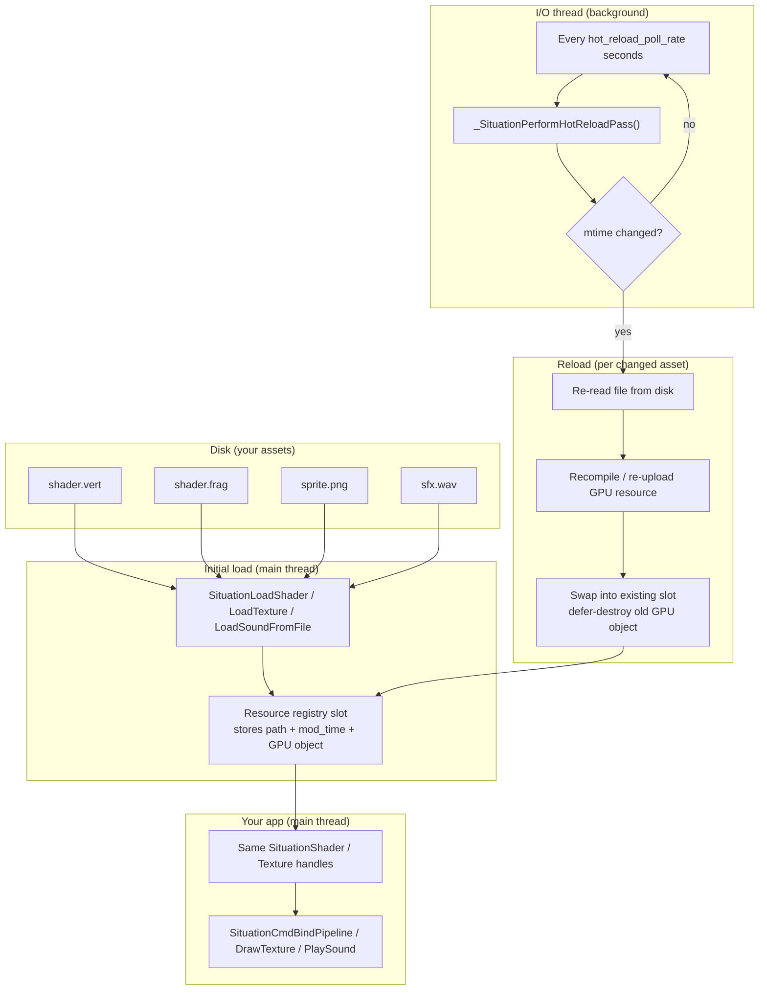
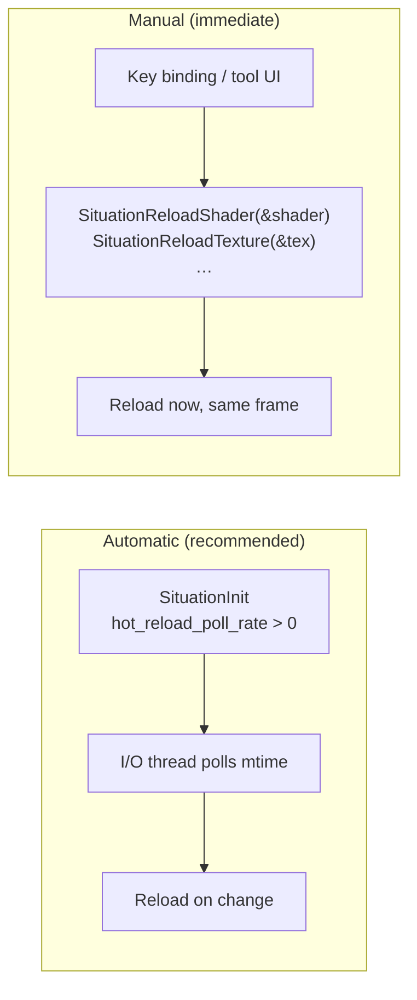
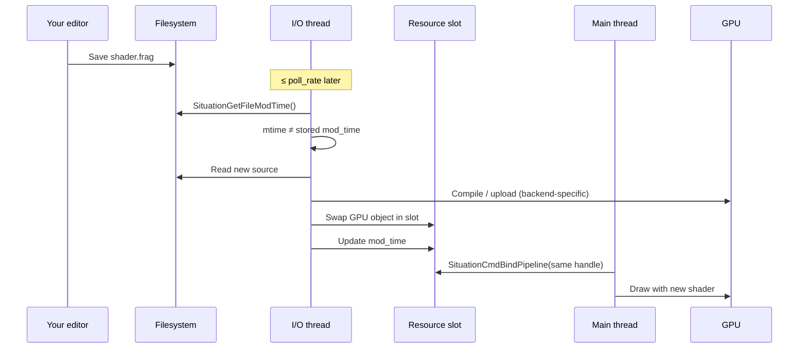
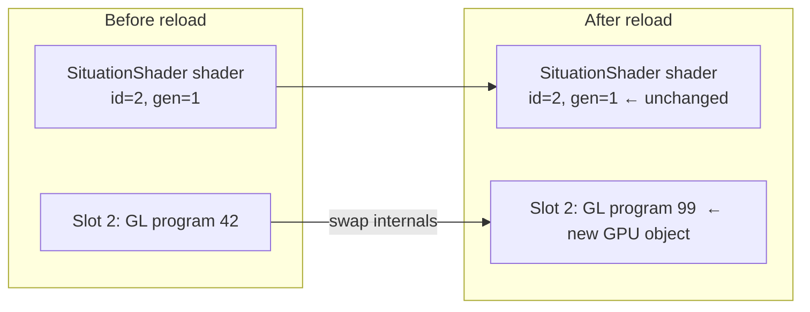

## Hot-Reloading Module

**Overview:** Hot-reload lets you edit assets on disk and see changes in a running app — no quit/rebuild cycle. Situation watches **stored source paths** and **file modification times**. When a file changes, the library rebuilds the GPU resource **in the same registry slot**, so your existing handles (`SituationShader`, `SituationTexture`, …) keep working.

**Primary use case:** shader/texture/audio iteration during development and creative-coding workflows.

**Related:** [Threading — I/O thread & `hot_reload_rate`](threading.md) · [Core — `SituationInitInfo`](core.md) · [Graphics — shader loading](graphics.md) · [3D Drawing — models](drawing_3d.md) · [Compute](compute.md) · [Logging](logging.md)

---

### The problem hot-reload solves

Without hot-reload:

```
  Edit shader.glsl → Save → Kill app → Rebuild → Relaunch → Navigate back to test state
```

With hot-reload:

```
  Edit shader.glsl → Save → (≤ poll interval) → See result in the running window
```

The library owns **path tracking**, **mtime polling**, and **in-place slot swap**. Your game code keeps the same handles and draw calls.

---

### Architecture at a glance



**Key idea:** Handles are **slot indices**, not raw GPU pointers. Reload replaces the GPU object behind the slot; your C variable does not need to change.

---

### Two ways to trigger a reload



| Mode | When to use | API |
|------|-------------|-----|
| **Automatic** | Day-to-day dev — edit & save | `SituationInitInfo.hot_reload_poll_rate` |
| **Manual** | Force refresh (`R` key), editor "Apply", tests | `SituationReload*` functions |

> **Important:** `SituationCheckHotReloads()` is retained for API compatibility but **does not perform work** — polling runs on the **dedicated I/O thread** when `hot_reload_poll_rate > 0`. Do not call it expecting automatic reloads.

---

### What gets watched automatically?

The I/O-thread pass (`_SituationPerformHotReloadPass`) scans **only these** registries:

| Asset | Load function (registers path) | Auto-reload? | Manual reload |
|-------|------------------------------|--------------|---------------|
| **Graphics shader** | `SituationLoadShader`, `SituationLoadShaderFromSpirv` | Yes | `SituationReloadShader` |
| **Texture** | `SituationLoadTexture` | Yes | `SituationReloadTexture` |
| **Loaded sound** | `SituationLoadSoundFromFile` | Yes | — (re-load via file API) |
| **3D model** | `SituationLoadModel`, `LoadModelFromOBJ`, `LoadModelFromSTL` | **No** | `SituationReloadModel` |
| **Compute pipeline** | `SituationCreateComputePipeline` (from file) | **No** | `SituationReloadComputePipeline` |

**Not hot-reloadable** (no source path stored):

| Creation API | Why |
|--------------|-----|
| `SituationLoadShaderFromMemory` | No file path |
| `SituationLoadShaderFromSpirvMemory` | Embedded SPIR-V — paths explicitly unset |
| `SituationCreateTexture` | CPU → GPU upload, no file |
| `SituationCreateMesh` | Procedural geometry |

For models and compute shaders, wire a manual reload (key binding or export hook) — see [workflows below](#workflow-manual-model-reload-blender-game).

---

### Enable hot-reload (required setup)

Hot-reload is **opt-in**. Zero-initialized `SituationInitInfo` sets `hot_reload_poll_rate = 0` (disabled).

```c
SituationInitInfo info = SituationInitInfoDefault(1280, 720, "Dev Build");
info.hot_reload_poll_rate = 0.5;   /* check disk every 0.5 s */
info.disable_io_thread = false;    /* I/O thread must run */

if (SituationInit(argc, argv, &info) != SITUATION_SUCCESS) {
    /* handle error */
}
```

| `hot_reload_poll_rate` | Effect |
|------------------------|--------|
| `0.0` | Disabled — no background polling |
| `0.5` | Typical dev setting — check twice per second |
| `2.0` | Lighter CPU use, slower feedback |

The same rate is stored on the thread pool (`hot_reload_rate`) when `SituationCreateThreadPool` is called internally at init.

**Also required:**

- **Debug build** — automatic polling is compiled out in `NDEBUG` release builds unless you define `SITUATION_FORCE_HOTRELOAD`.
- **I/O thread enabled** — set `disable_io_thread = false` (default when zero-init).

**Production / shipping:**

```c
info.hot_reload_poll_rate = 0.0;
#ifdef NDEBUG
    /* automatic pass already stripped; no SITUATION_FORCE_HOTRELOAD */
#endif
```

---

### Per-frame timeline (automatic path)



On **OpenGL**, shader recompiles from the I/O thread start **async link**; the **main thread** finalizes the pending program during `SituationAcquireFrameCommandBuffer()` (no extra call needed in most apps). On **Vulkan**, reload uses defer-destroy and shader-cache content hashing — unchanged SPIR-V skips GPU work entirely.

---

### Backend behavior

| | OpenGL | Vulkan |
|---|--------|--------|
| **Shader auto-reload** | Async compile/link on I/O thread; swap on next frame begin | In-place pipeline bundle swap; SPIR-V hash no-op if source unchanged |
| **Texture reload** | Defer-destroy old `gl_texture_id` | Defer-destroy image/view/sampler |
| **Stall risk** | Possible brief stall on manual `SituationReload*` | Designed for async-safe defer destroy (no `vkDeviceWaitIdle` per reload) |
| **Failed shader compile** | Pending link discarded; slot keeps old program until next successful reload | Error logged; check `SituationGetLastErrorMsg()` |

---

### Workflow: shader iteration (most common)

**1. Load from files** (not from memory):

```c
static SituationShader g_shader = {0};

void load_assets(void) {
    SituationLoadShader("assets/shaders/scene.vert", "assets/shaders/scene.frag", &g_shader);
}
```

**2. Enable polling at init** (`hot_reload_poll_rate = 0.5`).

**3. Draw as usual** — handle never changes:

```c
SituationCmdBindPipeline(cmd, g_shader);
SituationCmdDrawMesh(cmd, mesh);
```

**4. Edit & save** `scene.frag` in your editor. Within ~one poll interval, console shows:

```
[Situation] Hot-Reloading Shader 2...
```

**5. Optional — force reload on key press:**

```c
if (SituationIsKeyPressed(SIT_KEY_R)) {
    SituationError err = SituationReloadShader(&g_shader);
    if (err != SITUATION_SUCCESS) {
        char* msg = NULL;
        SituationGetLastErrorMsg(&msg);
        SituationLog(SIT_LOG_ERROR, "Shader reload failed: %s", msg ? msg : "?");
        if (msg) free(msg);
    }
}
```

**Shader compile errors:** Read `SituationGetLastErrorMsg()` for GLSL line info. On manual reload failure, the old shader may be invalidated — keep a backup handle or reload from known-good files in tool code.

---

### Workflow: texture iteration

```c
SituationTexture g_albedo = {0};
SituationLoadTexture("assets/textures/albedo.png", true, &g_albedo);
```

Save over `albedo.png` → auto-reload re-uploads GPU data into the same slot. `SituationCmdDrawTexture` and material binds keep working.

**Requirement:** Must use `SituationLoadTexture`, not `SituationCreateTexture` from a procedural `SituationImage`.

---

### Workflow: audio iteration

Sounds loaded with `SituationLoadSoundFromFile` register `source_path`. On change:

1. Playback is **stopped** for that slot
2. Audio data is re-decoded
3. **Volume and pan are preserved**

Useful for tuning WAV/OGG sound effects without restarting the level.

---

### Workflow: manual model reload (Blender → game)

Models are **not** in the automatic pass — call `SituationReloadModel` yourself:

```c
static SituationModel g_hero = {0};

void init(void) {
    SituationLoadModel("assets/models/hero.glb", &g_hero);
}

void update(void) {
    if (SituationIsKeyPressed(SIT_KEY_F5)) {
        SituationReloadModel(&g_hero);
    }
}

void render(SituationCommandBuffer cmd) {
    SituationCmdBindPipeline(cmd, pbr_shader);
    mat4 model;
    glm_mat4_identity(model);
    SituationDrawModel(cmd, g_hero, model);
}
```

Export from Blender → save GLB → press F5. Old meshes/textures are destroyed; `g_hero` handle updates in place with new geometry.

---

### Workflow: compute shader reload

```c
static SituationComputePipeline g_sim = {0};

/* Created from file — path stored internally */
SituationCreateComputePipeline("assets/shaders/particles.comp", SIT_COMPUTE_LAYOUT_DEFAULT, &g_sim);

if (SituationIsKeyPressed(SIT_KEY_F5)) {
    SituationReloadComputePipeline(&g_sim);
}
```

Reuses the layout type from initial creation.

---

### Handle stability — what stays the same



Your struct variables, arrays of materials, and command-buffer recording code **do not need updating** after a successful reload.

---

### Error handling checklist

| Situation | What happens | What you should do |
|-----------|--------------|-------------------|
| Auto reload, compile OK | Slot swapped silently | Nothing |
| Auto reload, compile fail | Error logged; GL keeps old program (async path) | Fix GLSL, save again |
| Manual `ReloadShader` fail | Handle may be zeroed — **invalid** | Check return code; reload from disk or restore backup |
| Texture file missing | Reload fails; old texture may remain | Verify path relative to CWD / base path |
| Model reload fail | Returns error; old model data may be partial | Check console; fix GLTF/OBJ |
| Release `NDEBUG` build | Auto pass is no-op | Use manual reload + `SITUATION_FORCE_HOTRELOAD` if needed |

Always pair failures with [Logging](logging.md) and `SituationGetLastErrorMsg()`.

---

### Troubleshooting

| Symptom | Likely cause | Fix |
|---------|--------------|-----|
| Saves never picked up | `hot_reload_poll_rate = 0` | Set to `0.5` (or similar) in `SituationInitInfo` |
| Still nothing | Release build (`NDEBUG`) | Debug build, or `#define SITUATION_FORCE_HOTRELOAD` |
| Still nothing | `disable_io_thread = true` | Enable I/O thread |
| Called `CheckHotReloads()` — no effect | Function is a no-op | Configure poll rate at init instead |
| Shader loaded from memory | No path stored | Use `SituationLoadShader(path, …)` |
| Model never auto-updates | Not in auto pass | Call `SituationReloadModel` manually |
| Reload stutters (GL) | Sync reload on main thread | Prefer automatic async path; avoid spamming manual reload |
| Handle suddenly invalid | Manual reload after bad GLSL | Validate shaders before reload; handle error return |

---

### API reference

#### Automatic polling (configuration)

Configured via **`SituationInitInfo.hot_reload_poll_rate`** at init — see [Core Module](core.md). Implemented on the I/O thread; see [Threading Module](threading.md).

#### `SituationCheckHotReloads`

```c
SituationError SituationCheckHotReloads(void);
```

**Legacy no-op.** Polling moved to the I/O thread. Calling this each frame is harmless but unnecessary.

---

#### `SituationReloadShader`

Recompiles a graphics shader from its original vertex/fragment paths stored at load time.

```c
SituationError SituationReloadShader(SituationShader* shader);
```

- **Requires:** `SituationLoadShader` or `SituationLoadShaderFromSpirv` (paths tracked).
- **Threading:** Call from **main thread between frames**.
- **On failure:** Handle may be invalidated — check return value.

---

#### `SituationReloadTexture`

Re-reads the image file and recreates GPU texture resources in the same slot.

```c
SituationError SituationReloadTexture(SituationTexture* texture);
```

- **Requires:** Original load via `SituationLoadTexture`.

---

#### `SituationReloadModel`

Re-parses GLTF/OBJ/STL and rebuilds all sub-meshes and embedded textures.

```c
SituationError SituationReloadModel(SituationModel* model);
```

- **Requires:** File-based model load (`SituationLoadModel` / `FromOBJ` / `FromSTL`).
- **Not automatic** — invoke from your update loop or tooling.

---

#### `SituationReloadComputePipeline`

Recompiles compute GLSL from the stored source path.

```c
SituationError SituationReloadComputePipeline(SituationComputePipeline* pipeline);
```

- **Requires:** Pipeline created from file path.
- **Not automatic** — invoke manually.

---

### Quick-start checklist

1. Load assets with **file-based** `SituationLoad*` APIs (not memory variants).
2. Set `init_info.hot_reload_poll_rate = 0.5` and `disable_io_thread = false`.
3. Build **Debug** (or define `SITUATION_FORCE_HOTRELOAD` for Release).
4. Keep using the same handles in your render loop.
5. For **models** and **compute**, add manual `SituationReload*` on a hotkey.
6. On failure, read `SituationGetLastErrorMsg()` — see [Logging](logging.md).
