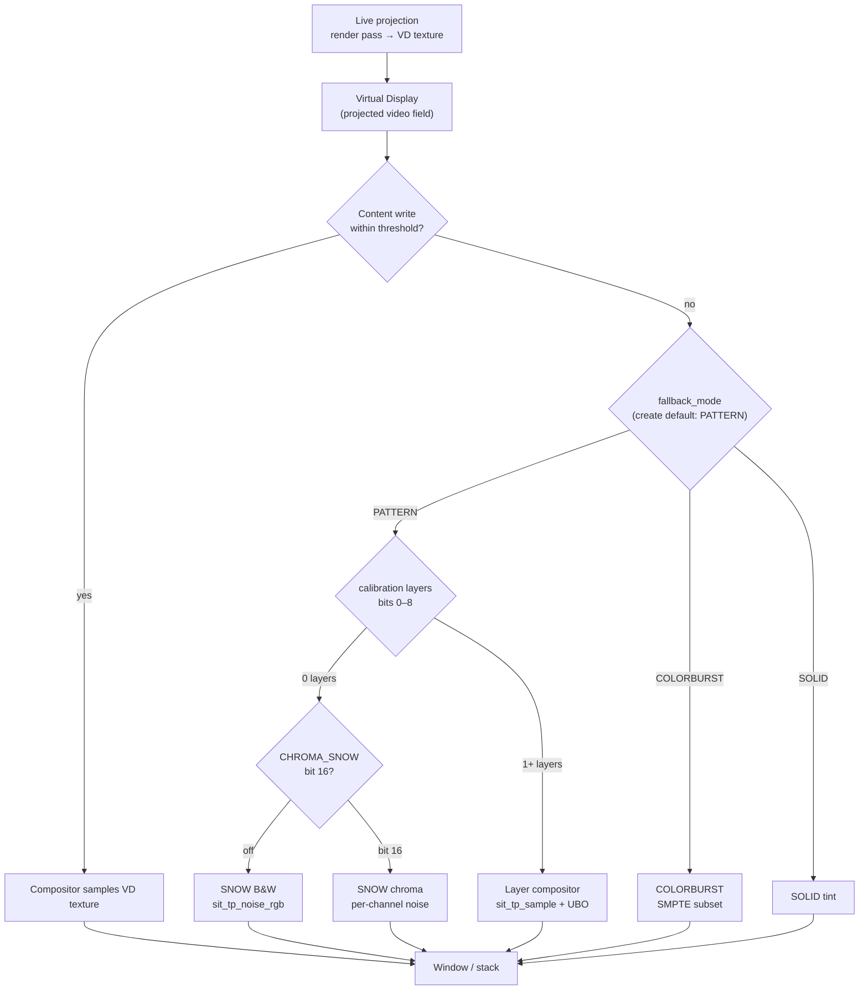

## Test Patterns Module

**Overview:** Test patterns are the **standby image for a Virtual Display** when nothing is being projected into that field. Each VD is a fixed-resolution **projected video plane** — you render *into* it while live; when projection stops (idle), the compositor fills the field with a standby image: **animated snow** by default (`PATTERN`, zero layers), optional calibration layers, legacy **COLORBURST**, or flat **SOLID**.

The pattern math lives in `sit/gpu/test_patterns/*.glslh` — analytic fragment-shader UV functions that replaced hundreds of legacy RGL CPU draw calls. Same headers power the compositor, future custom overrides, harness verification, and optional lab tooling.

**Design principle (from day one):** Patterns are not a global “engine mode.” They are what a **Virtual Display shows when it has no signal** — the broadcast-industry notion of a test card on an unconnected monitor output.

**Related:** [Virtual Display — projected field & idle fallback](virtual_display.md) · [Graphics — shaders & descriptors](graphics.md) · Plan: `doc/plan/RGL_TEST_PATTERN_SHADER_MIGRATION_PLAN.md`

---

### Idle compositor flow (per VD layer)

Every Virtual Display layer is always in exactly one of these states during **composite-out**:

| State | When | What the viewer sees |
|-------|------|----------------------|
| **Live projection** | Content writes within `idle_threshold_seconds` | Sampled VD texture (your game, terminal, compute output, …) |
| **Pattern standby (`PATTERN`)** | Idle + `SITUATION_VD_FALLBACK_PATTERN` | Layer compositor — **`pattern_layers == 0`** → animated **snow**; otherwise any `SIT_VD_STANDBY_LAYER_*` bitmask + `SitVdStandbyConfig` tuning |
| **COLORBURST standby** | Idle + `SITUATION_VD_FALLBACK_COLORBURST` | Lightweight SMPTE subset (plan §5.3; not the full SMPTE layer) |
| **SOLID standby** | Idle + `SITUATION_VD_FALLBACK_SOLID` | Flat `fallback_color` tint |



**No projection → standby image.** At **VD create** the library default is **`PATTERN` with zero layers** (animated snow — “no signal”). Enable calibration layers explicitly when you need a test card. You do not need a separate fullscreen pass on the main window unless you are building a harness, lab, or special-case tool.

---

### Zero layers = snow (default)

When **calibration layers** (bits **0–8**) are all off, `sit_tp_sample()` returns **animated noise** (`sit_tp_noise.glslh`):

| Flag | Bit | Snow |
|------|-----|------|
| *(default)* | — | **B&W** — single hash, `vec3(n)` |
| `SIT_VD_STANDBY_LAYER_CHROMA_SNOW` | **16** | **Chroma** — independent R/G/B hashes (“tasty” analog static) |

The compositor refreshes **`noise_frame_seed`** each upload from the monotonic clock in **milliseconds** (`cfg.snow.noise_frame_seed` / UBO offset 136).

```c
SituationSetVirtualDisplayChromaSnow(vd_id, true);  /* or OR bit 16 into pattern_layers */
SituationSetVirtualDisplayPatternLayers(vd_id, SIT_VD_STANDBY_LAYER_CHROMA_SNOW); /* snow + chroma, no layers 0–8 */
```

Layers **0–8** are **opt-in calibration toggles** — flip them on when you want SMPTE, PLUGE, checkerboard, etc. Flag bit **16** is ignored whenever any calibration layer is active.

---

### What is (and is not) built in today

| Layer | Status |
|-------|--------|
| **VD compositor standby** | ✅ `SOLID`, `COLORBURST`, **`PATTERN`** on **Vulkan and OpenGL** (OpenGL: build-time SPIR-V embed; see updatelog **345** regressions table for initial embed failure) |
| **Shader library** | ✅ `sit/gpu/test_patterns/*.glslh` — nine composable **layers** (bitmask toggles) |
| **VD pattern API** | ✅ `SituationSet/GetVirtualDisplayPatternConfig`, `Set/GetVirtualDisplayPatternLayers` |
| **Per-pattern lab (0–8 toggles)** | ⏳ `shader_lab_test_patterns.c` — keys toggle layer bits |
| **Custom user shader override** | ⏳ Idle → bind your own FS instead of built-in compositor branch |
| **C upload helpers** | ✅ `SituationVdStandby*` in `situation_api_graphics.h`; impl in `situation_impl_vd_standby.h` |
| **Legacy RGL CPU draw** | ❌ Replaced by this library |

The compositor uploads a std140 **`SitTpConfigBlock`** (144 B) when idle in `PATTERN` mode on **Vulkan and OpenGL** — same layout as custom shaders and the harness. OpenGL loads compositor stages from the SPIR-V embed (`compile_vd_compositor_gl.ps1`) and binds the UBO at `SIT_UBO_BINDING_VD_PATTERN`. `COLORBURST` uses a separate lightweight SMPTE subset on both backends (§5.3).

---

### Why the shader library (not C draw loops)

| Old (RGL) | New (VD + `.glslh`) |
|-----------|---------------------|
| Hundreds of `DrawRectangle` / `DrawLine` per pattern | One compositor fragment eval when idle |
| Duplicate SMPTE math in C, RGL, and compositor GLSL | Single `sit_tp_smpte.glslh` source of truth |
| Patterns bolted onto main window | Patterns belong to **projected fields** (VD layers) |

Patterns still matter for **calibration** (PLUGE, multiburst, convergence), but the **integration point** is always the VD compositor pass — not ad-hoc window filling.

---

### Pattern layers (not a menu)

Keys **0–8** are **layer toggles**, not mutually exclusive choices. Each Virtual Display field is **build-your-own**: flip layers on/off to compose a calibration card on that projected plane.

| Key | Bit | Layer | Purpose |
|-----|-----|-------|---------|
| 0 | `SIT_TP_LAYER_SMPTE` | **SMPTE bars** | Full RGL-style color bars + castellation + PLUGE / I / Q region |
| 1 | `SIT_TP_LAYER_CHECKERBOARD` | **Checkerboard** | Tile parity (default 32×32 px) |
| 2 | `SIT_TP_LAYER_CONVERGENCE` | **Convergence** | Horizontal vs vertical stripe moire zones |
| 3 | `SIT_TP_LAYER_GRADIENTS` | **Gradients** | Linear ramps |
| 4 | `SIT_TP_LAYER_GRID` | **Grid overlay** | 32×32 alignment grid blended on top |
| 5 | `SIT_TP_LAYER_PLUGE` | **PLUGE** | Black-level bars (0 IRE uses true black) |
| 6 | `SIT_TP_LAYER_CROSSHATCH` | **Crosshatch** | Center cross + line grid |
| 7 | `SIT_TP_LAYER_MULTIBURST` | **Multiburst** | Six frequency bands |
| 8 | `SIT_TP_LAYER_3D_GRID` *(alias)* | **Cube** | **One** lit 3D cube — pipeline/geometry check (not a grid or scene) |

`SitTestPatternConfig.pattern_layers` is a **bitmask** (`SIT_TEST_PATTERN_LAYER_*`). Shader code tests layers with `sit_tp_layer_on()` (`bitfieldExtract`). Single-bit configs call `sit_tp_preset_layer()` (full RGL wrappers); multiple bits stack via `sit_tp_compose_layers()` in `sit_test_patterns.glslh`.

**Compose order today is fixed** in the shader (not configurable via the bitmask). User-controlled z-order: **§3.5** in [`RGL_TEST_PATTERN_SHADER_MIGRATION_PLAN.md`](../plan/RGL_TEST_PATTERN_SHADER_MIGRATION_PLAN.md#35--layer-stack-user-controlled-compose-order--p9p12).

**Per-layer parameters:** each layer type (0–8) gets its own tunable block inside unified **`SitTestPatternConfig`** — **§3.6** (phases P9–P12). Today only a few knobs are exposed at the top level; most are hardcoded in shaders.

```c
SitTestPatternConfig cfg;
SitTestPatternConfigInitDefaults(&cfg, SIT_TEST_PATTERN_SMPTE_BARS, w, h);
SitTestPatternToggleLayer(&cfg, SIT_TEST_PATTERN_CHECKERBOARD, true); /* checker under SMPTE content */
SitTestPatternToggleLayer(&cfg, SIT_TEST_PATTERN_GRID, true);         /* add grid overlay */
```

Palette defaults: `sit_tp_default_palette()` in `sit_tp_colors.glslh` (RGL-aligned RGB).

---

### API quick reference (C)

**Authoritative spec:** `doc/plan/RGL_TEST_PATTERN_SHADER_MIGRATION_PLAN.md` **§3.4** (layers) + **§3.5** (stack) + **§3.6** (unified struct + per-layer params) — keep this section in sync.

**Types:** `sit/situation_api_types_gpu.h` (`SitVdStandbyConfig`, included via `situation.h`)  
**Helpers:** `situation_api_graphics.h` — `SituationVdStandbyConfigInitDefaults`, `SituationVdStandbyPackStd140`, …
**UBO size:** `SIT_TP_CONFIG_UBO_SIZE` (144 bytes, std140 @ `set=0, binding=0`)

#### Layer index → toggle bit

Use **`SitTestPatternLayer`** for indices and **`SIT_TEST_PATTERN_LAYER_*`** for bitmask OR/toggle. Key **0–8** matches the enum value.

| Key | `SitTestPatternLayer` | C bitmask macro | Value (`1u << n`) |
|-----|------------------------|-----------------|-------------------|
| 0 | `SIT_TEST_PATTERN_SMPTE_BARS` | `SIT_TEST_PATTERN_LAYER_SMPTE` | `0x001` |
| 1 | `SIT_TEST_PATTERN_CHECKERBOARD` | `SIT_TEST_PATTERN_LAYER_CHECKERBOARD` | `0x002` |
| 2 | `SIT_TEST_PATTERN_CONVERGENCE` | `SIT_TEST_PATTERN_LAYER_CONVERGENCE` | `0x004` |
| 3 | `SIT_TEST_PATTERN_GRADIENTS` | `SIT_TEST_PATTERN_LAYER_GRADIENTS` | `0x008` |
| 4 | `SIT_TEST_PATTERN_GRID_ONLY` | `SIT_TEST_PATTERN_LAYER_GRID` | `0x010` |
| 5 | `SIT_TEST_PATTERN_PLUGE` | `SIT_TEST_PATTERN_LAYER_PLUGE` | `0x020` |
| 6 | `SIT_TEST_PATTERN_CROSSHATCH` | `SIT_TEST_PATTERN_LAYER_CROSSHATCH` | `0x040` |
| 7 | `SIT_TEST_PATTERN_MULTIBURST` | `SIT_TEST_PATTERN_LAYER_MULTIBURST` | `0x080` |
| 8 | `SIT_TEST_PATTERN_3D_GRID` | `SIT_TEST_PATTERN_LAYER_3D_GRID` | `0x100` |

*(Layer 8 logical name: **Cube** — one lit 3D reference object via `sit_tp_cube.glslh`; see plan §4.9.)*

#### Standby flags (not calibration layers)

| Flag | C / GLSL macro | Value |
|------|----------------|-------|
| Chroma snow | `SIT_VD_STANDBY_LAYER_CHROMA_SNOW` / `SIT_TP_LAYER_CHROMA_SNOW` | `1u << 16` |

Use `SituationSetVirtualDisplayChromaSnow(vd, true)` or OR the flag into `pattern_layers`. Only applies when bits **0–8** are all clear.

GLSL mirror: same index order for layers 0–8; bitmask names are `SIT_TP_LAYER_*` in `sit_tp_config.glslh`.

#### Config struct (v2.4.374+ — P9 CPU, v2.4.375 layout)

```c
typedef struct SitVdStandbyConfig {
    int32_t pattern_layers;              /* OR of SIT_VD_STANDBY_LAYER_* + CHROMA_SNOW */
    uint8_t layer_stack[9];              /* draw order bottom → top (layer index 0–8) */
    uint8_t layer_stack_count;           /* default 8 — §3.5.1 legacy compose order */
    float width, height;
    SitVdStandbyPalette palette;
    SitVdStandbyLayerParams layer;       /* smpte, checker, convergence, … cube */
    SitVdStandbySnowParams snow;
} SitVdStandbyConfig;
```

Per-layer fields (examples):

| Block | Key fields |
|-------|------------|
| `layer.smpte` | `show_overlay_circle`, `content_margin_x/y`, `overlay_circle_radius` |
| `layer.checker` | `tile_size_x`, `tile_size_y`, `color_a`, `color_b` |
| `layer.convergence` | `stripe_width`, central inset/size, `color_a/b` |
| `layer.cube` | `size` (edge length), `diffuse`, `ambient` |
| `layer.multiburst` | `frequencies[6]`, `num_frequencies` |
| `snow` | `noise_frame_seed` (compositor sets each upload), `chroma` |

GPU upload (P9): **`SituationVdStandbyPackStd140`** flattens `layer.*` + `snow.*` into the existing **144 B** std140 UBO until P10 SSBO.

#### Helpers (all inline in header)

| Function | Use |
|----------|-----|
| `SituationVdStandbyLayerBit(layer)` | `1u << layer` |
| `SituationVdStandbyConfigInitDefaults(cfg, layer_index, w, h)` | Zero + one layer bit + defaults |
| `SituationVdStandbyToggleLayer(cfg, layer, enabled)` | Flip one bit on/off |
| `SituationVdStandbySetLayerOrder(cfg, stack, count)` | Replace compose stack |
| `SituationVdStandbyPackStd140(out, cfg)` | Pack 144-byte std140 flat shim (P9) |
| `SitTestPatternBindConfigResources(shader, false)` | GL: bind `SitTpConfigBlock` |
| `SitTestPatternUploadConfigUbo(ubo, bytes, size)` | `UpdateBuffer` |
| `SitTestPatternDrawFullscreenUbo(cmd, …)` | Upload + bind set 0 + draw |

#### Minimal usage

```c
SitTestPatternConfig cfg;
SitTestPatternConfigInitDefaults(&cfg, SIT_TEST_PATTERN_SMPTE_BARS, 640.f, 480.f);
SitTestPatternToggleLayer(&cfg, SIT_TEST_PATTERN_CHECKERBOARD, true);

uint8_t ubo[SIT_TP_CONFIG_UBO_SIZE];
SitTestPatternPackLegacyStd140(ubo, &cfg);
SitTestPatternDrawFullscreenUbo(cmd, shader, mesh, buf, ubo, sizeof(ubo));
```

**Scope:** the helpers below apply to **custom fullscreen passes** (harness, lab, live VD paint). The **built-in compositor** uses the same `SitTestPatternConfig` fields via the VD API below — you do not pack UBO bytes yourself for idle standby.

#### VD compositor API (`situation_api_graphics.h`)

| Function | Role |
|----------|------|
| `SituationSetVirtualDisplayIdleThreshold(vd, seconds)` | Seconds without a content write before standby |
| `SituationSetVirtualDisplayFallbackMode(vd, mode)` | `SITUATION_VD_FALLBACK_SOLID`, `COLORBURST`, or `PATTERN` |
| `SituationSetVirtualDisplayFallbackColor(vd, color)` | SOLID tint only |
| `SituationSetVirtualDisplayPatternLayers(vd, bitmask)` | Sets `pattern_layers`, switches to `PATTERN` |
| `SituationSetVirtualDisplayChromaSnow(vd, enabled)` | Toggle bit **16** (chroma snow when no layers 0–8) |
| `SituationGetVirtualDisplayChromaSnow(vd)` | Read chroma snow flag |
| `SituationGetVirtualDisplayPatternLayers(vd)` | Read current layer bitmask |
| `SituationSetVirtualDisplayPatternConfig(vd, &cfg)` | Copy full `SitTestPatternConfig`, switch to `PATTERN` |
| `SituationGetVirtualDisplayPatternConfig(vd, &cfg)` | Read standby config (`width`/`height` reflect VD resolution) |

`width` and `height` in stored config are **overwritten from VD resolution** at composite time — set them in `SitTestPatternConfig` for custom draws; for idle standby they track the projected field size automatically.

---

### Using test patterns (canonical VD path)

Configure each projected field once. When your app **stops writing** to that VD, the compositor shows standby automatically.

```c
#include "situation.h"
#include "sit/sit_test_pattern_config.h"

SituationCreateVirtualDisplay(1280, 720, &vd_id);
SituationSetVirtualDisplayIdleThreshold(vd_id, 1.0f);

/* Full standby card — checker + SMPTE layers, custom checker tile size */
SitTestPatternConfig cfg;
SitTestPatternConfigInitDefaults(&cfg, SIT_TEST_PATTERN_SMPTE_BARS, 1280.f, 720.f);
SitTestPatternToggleLayer(&cfg, SIT_TEST_PATTERN_CHECKERBOARD, true);
cfg.layer.checker.tile_size_x = cfg.layer.checker.tile_size_y = 64.f;
SituationSetVirtualDisplayPatternConfig(vd_id, &cfg);

/* Or layers only: */
SituationSetVirtualDisplayPatternLayers(vd_id,
    SIT_TEST_PATTERN_LAYER_PLUGE | SIT_TEST_PATTERN_LAYER_GRID);

/* Phase 1 — project live content into the field */
SituationCmdBeginRenderPass(cmd, &(SituationRenderPassInfo){ .display_id = vd_id, /* … */ });
SituationCmdEndRenderPass(cmd);

/* Phase 2 — compositor stacks VDs; idle VDs show the configured pattern */
SituationRenderVirtualDisplays(cmd);
```

Legacy COLORBURST (SMPTE subset only, no layer toggles):

```c
SituationSetVirtualDisplayFallbackMode(vd_id, SITUATION_VD_FALLBACK_COLORBURST);
```

| API | Role |
|-----|------|
| `SituationSetVirtualDisplayIdleThreshold(vd, seconds)` | How long without a content write before standby |
| `SituationSetVirtualDisplayFallbackMode(vd, mode)` | `SOLID`, `COLORBURST`, or `PATTERN` |
| `SituationSetVirtualDisplayFallbackColor(vd, color)` | SOLID standby tint only |
| `SituationSetVirtualDisplayPatternLayers(vd, bitmask)` | Layer bitmask + `PATTERN` mode |
| `SituationSetVirtualDisplayChromaSnow(vd, enabled)` | Toggle bit **16** (chroma snow when no layers 0–8) |
| `SituationGetVirtualDisplayChromaSnow(vd)` | Read chroma snow flag |
| `SituationGetVirtualDisplayPatternLayers(vd)` | Current layer bitmask |
| `SituationSetVirtualDisplayPatternConfig(vd, &cfg)` | Full tuning + `PATTERN` mode |
| `SituationGetVirtualDisplayPatternConfig(vd, &cfg)` | Read standby config |

**Demo:** **`examples/25_vd_standby`** — full interactive pattern explorer on a live VD (snow, layers 0–8, stack, per-layer params). Build: `build\build_examples.bat static-opengl 25_vd_standby`.

**Compositor shaders:** `vd.frag` / `composite.frag` — **Vulkan and OpenGL** use the same `#include sit_test_patterns.glslh` path. Vulkan compiles at init via shaderc; OpenGL loads precompiled SPIR-V from `sit_vd_compositor_gl_spirv_embed.c` (regenerate with `build/compile_vd_compositor_gl.ps1`). `SitTpConfigBlock` UBO: Vulkan set 2/3; OpenGL binding `SIT_UBO_BINDING_VD_PATTERN` (6).

---

### Custom shader path (optional)

You can still render patterns **into a live VD** or the main window with your own fullscreen shader (`sit_tp_sample` + UBO). That is independent of idle standby — useful for harnesses, labs, or painting a pattern while the compositor samples it as live content.

A future **custom idle override** would replace the built-in compositor branch with your shader when idle; today use `SITUATION_VD_FALLBACK_PATTERN` + `SituationSetVirtualDisplayPatternConfig` for built-in compositor standby.

---

### Secondary path: direct draw (harness & lab only)
For **verification** or prototyping **before** custom override ships, you can render any pattern into a VD or the main framebuffer with a dedicated fullscreen shader — see harness reference below. This is **not** the product integration path; production apps should use VD idle standby (and future custom override).

Include the umbrella header and call `sit_tp_sample()`:


```glsl
#version 450 core
#include "sit/gpu/test_patterns/sit_test_patterns.glslh"
#include "sit/gpu/test_patterns/sit_tp_config_ubo.glslh"

layout(location = 0) out vec4 fragColor;

void main() {
    SitTpConfig cfg = sit_tp_config_from_ubo();
    vec2 uv = gl_FragCoord.xy / vec2(max(cfg.width, 1.0), max(cfg.height, 1.0));
    fragColor = vec4(sit_tp_sample(uv, cfg, sit_tp_default_palette()), 1.0);
}
```

**C side** (same contract on GL and VK):

```c
#include "situation.h"
#include "sit/sit_test_pattern_config.h"

SitTestPatternConfig cfg;
SitTestPatternConfigInitDefaults(&cfg, SIT_TEST_PATTERN_PLUGE, (float)w, (float)h); /* single layer bit */

SituationShader shader = /* load FS above — SPIR-V embed or SituationLoadShaderFromMemory (VK + compiler) */;
SitTestPatternBindConfigResources(shader, false);  /* OpenGL: bind UBO block name; VK: no-op */

SituationBuffer ubo = /* CreateBuffer(SIT_TP_CONFIG_UBO_SIZE, … UNIFORM_BUFFER …) */;
uint8_t bytes[SIT_TP_CONFIG_UBO_SIZE];
SitTestPatternPackConfigStd140(bytes, &cfg);

SituationCommandBuffer cmd = SituationGetMainCommandBuffer();
SitTestPatternDrawFullscreenUbo(cmd, shader, fullscreen_mesh, ubo, bytes, sizeof(bytes));
```

| Helper | File |
|--------|------|
| `SitTestPatternConfigInitDefaults` | Set one layer bit from index 0–8 + RGL-like defaults |
| `SitTestPatternToggleLayer` | Flip a layer bit on/off (build-your-own bitmask) |
| `SitTestPatternPackConfigStd140` | Pack 144-byte std140 blob (`SIT_TP_CONFIG_UBO_*` offsets in header) |
| `SitTestPatternBindConfigResources` | After SPIR-V load on **OpenGL** — binds `SitTpConfigBlock` to point 0 |
| `SitTestPatternDrawFullscreenUbo` | Upload UBO, bind descriptor set 0, clear + draw mesh, `SituationEndFrame()` |

Reference implementation: `tests/harness/test_graphics_patterns.c` and `tests/harness/shaders/harness_test_pattern_{gl,vk}.fs` (identical sources; glslc `--target-env` differs).

**Build harness shaders (optional embed workflow):**

```powershell
Set-Location "path\to\situation"
& ".\build\compile_harness_shaders.ps1"
```

---

### `#include` paths and backends

| Backend | How headers reach the GPU |
|---------|---------------------------|
| **Vulkan** | Compositor: `#include` via shaderc at init. Custom shaders: `SituationLoadShaderFromMemory` |
| **OpenGL** | Compositor: **build-time glslc** → SPIR-V embed (`build/compile_vd_compositor_gl.ps1`) + `GL_ARB_gl_spirv` at init. Same `#include sit_test_patterns.glslh` sources as Vulkan. Custom shaders: glslc embed or `SituationLoadShaderFromMemory`. |

Override Y flip per shader with `#define SIT_TP_FLIP_Y 0` before includes if your UV space differs.

---

### Activation model

| Path | Role |
|------|------|
| **VD idle standby (`PATTERN`)** | **Production** — create default: zero layers = snow; opt-in layers via VD API |
| **VD idle (`COLORBURST` / `SOLID`)** | **Production** — legacy SMPTE subset or flat tint |
| **Direct fullscreen draw** | **Harness / lab / live paint** — pixel readback or custom content |
| **Live projection** | Normal operation — patterns not visible; VD texture is sampled |

There is no global “show pattern on entire app” toggle. Each VD layer owns its own standby independently.

---

### File map

```
sit/gpu/test_patterns/
├── sit_test_patterns.glslh    ← sit_tp_sample(); preset (1 bit) + compose (multi bit)
├── sit_tp_config.glslh        ← SIT_TP_LAYER_* bits, layer indices, sit_tp_layer_on()
├── sit_tp_config_ubo.glslh    ← std140 UBO block + sit_tp_config_from_ubo()
├── sit_tp_colors.glslh
├── sit_tp_primitives.glslh
├── sit_tp_smpte.glslh         ← full + VD subset (SIT_TP_SMPTE_VD_SUBSET)
├── sit_tp_{pluge,convergence,gradients,multiburst,crosshatch,cube}.glslh
sit/sit_test_pattern_config.h  ← C mirror + pack/draw API
sit/sit_test_pattern_config.c
```

---

### Verification

```powershell
& ".\build\build_tests.bat" vulkan
& ".\build\build_tests.bat" opengl
Set-Location build\tests
& ".\sit_test_vulkan.exe" --module graphics --filter pattern --headless
& ".\sit_test_opengl.exe" --module graphics --filter pattern --headless
```

Expected: **Vulkan 13/13**, **OpenGL 12/12** (includes `pattern_cube_lit_faces`, `pattern_zero_layers_noise`, `pattern_chroma_snow`, `pattern_compose_checker_plus_smpte`; Vulkan adds runtime `#include` compile test).

---

### FAQ

**Where should patterns appear in my app?**  
On **Virtual Display layers** when projection stops — not on the root window by default. Create a VD per “monitor” or layer in your stack.

**Can I paint a pattern directly into a live VD instead of idle standby?**  
Yes — render a fullscreen pass in Phase 1 (`display_id = vd_id`) using `sit_tp_sample()`. That is still *inside* the projected field; the compositor then scales/blends it like any other VD content.

**Can I skip VDs and draw to the main window?**  
Possible for tools/tests (`display_id = -1`), but outside the intended model. Main window is the **stacking surface**; VDs are the **video fields**.

**Why three fallback modes?**  
- **`PATTERN`** — layer compositor; **`pattern_layers == 0`** → animated snow (create default); enable `SIT_VD_STANDBY_LAYER_*` bits for calibration cards + `SitVdStandbyConfig` tuning.  
- **`COLORBURST`** — frozen SMPTE subset for backward compatibility (plan §5.3); not the same as enabling only the SMPTE layer in `PATTERN`.  
- **`SOLID`** — flat tint via `SituationSetVirtualDisplayFallbackColor`.

**Legacy RGL?**  
CPU `RGL_DrawTestPattern` is deprecated. See `doc/plan/RGL_TEST_PATTERN_SHADER_MIGRATION_PLAN.md`.
