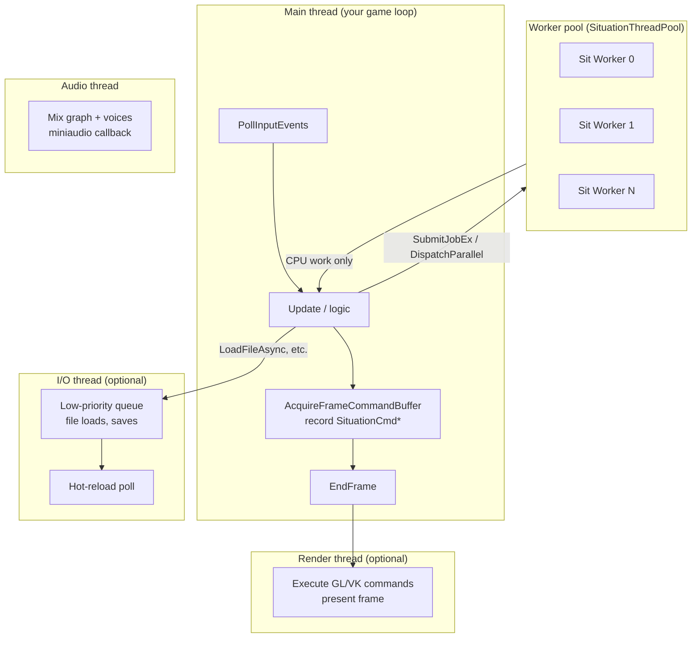
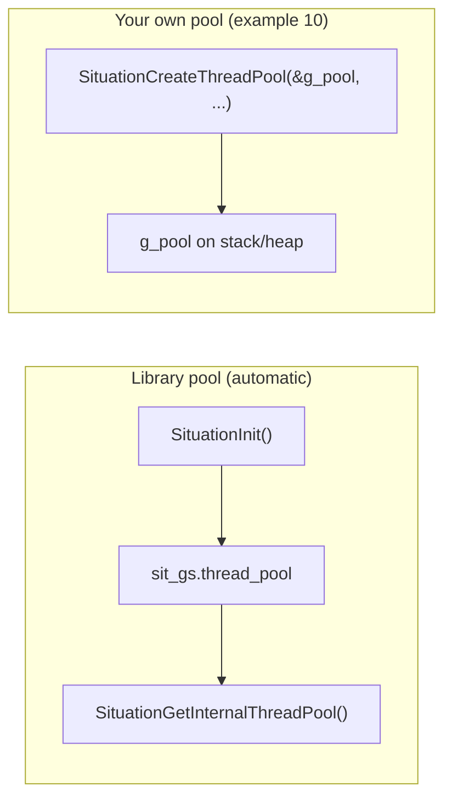
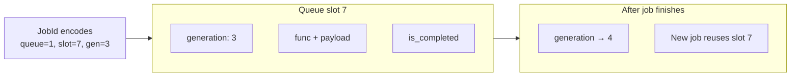
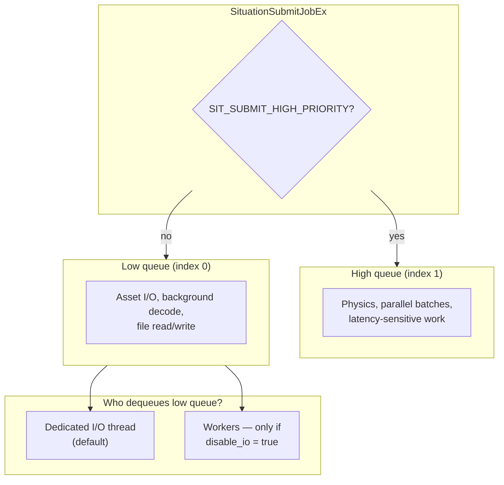
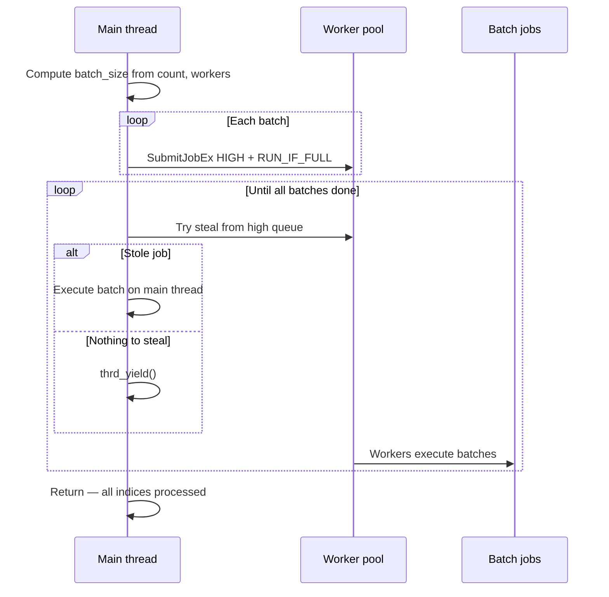

## Threading Module

**Overview:** Situation runs a **multi-threaded kernel** — dedicated threads for rendering, audio, and I/O, plus a **generational task system** for your own parallel work. Submit jobs to dual-priority queues, build small task graphs with dependencies, fork-join loops with `SituationDispatchParallel`, and offload disk I/O without blocking the main thread.

**Requires:** `#define SITUATION_ENABLE_THREADING` at compile time (enabled by default in `build_examples.bat`).

**Canonical example:** `examples/10_thread_pool/` — Game of Life with serial vs parallel toggle, job dependencies, pool snapshot HUD.

**Related:** [Core — lifecycle & init](core.md) · [Hot-reload — I/O thread polling](hot_reload.md) · [Filesystem — async I/O](filesystem.md) · [System introspection — thread snapshots](system_introspection.md) · [Examples 10](examples_faq.md)

---

### The full thread landscape

Situation is not "just a thread pool." At runtime you have **role-specific threads** plus **your worker pool**:



| Thread | Role | You call APIs here? |
|--------|------|---------------------|
| **Main** | Input, game logic, **command recording**, job submit/wait | **Yes — primary thread** |
| **Workers** | User jobs, `DispatchParallel` batches | No — your callbacks run here |
| **I/O** | Low-priority queue + hot-reload polling | No |
| **Render** | GPU execution (when render thread enabled) | No |
| **Audio** | Real-time mix | `PlaySound` safe; graph runs automatically |

> **Rule:** All `SITAPI` calls that touch windowing, rendering commands, or resource creation must run on the **main thread** (the thread that called `SituationInit`). Worker callbacks should do CPU work only — upload results on main before drawing. See [update-before-draw](core.md) in Core.

---

### Two ways to get a thread pool



| Pool | When | Typical use |
|------|------|-------------|
| **Internal** | Created automatically at `SituationInit` when threading enabled | Async library features, `SituationGetInternalThreadPool()` |
| **User-owned** | You call `SituationCreateThreadPool` | Heavy parallel sims, isolated job graphs (example 10) |

Configure the **internal** pool via `SituationInitInfo`:

```c
SituationInitInfo info = SituationInitInfoDefault(1280, 720, "My Game");
info.hot_reload_poll_rate = 0.5;   /* I/O thread hot-reload — see hot_reload.md */
info.disable_io_thread = false;    /* false = spawn dedicated I/O thread */
info.io_queue_capacity = 1024;
info.thread_pool_reserved_threads = 4;  /* cores left for main/render/audio/IO */
SituationInit(argc, argv, &info);
```

---

### Generational job system — mental model

Every submitted job returns a **`SituationJobId`** — not a raw pointer. The ID encodes **queue**, **slot index**, and **generation counter** (ABA-safe).



**Why generations matter:**

- `SituationWaitForJob(id)` is **O(1)** — if slot generation changed, your job already finished.
- Stale handles after completion don't accidentally wait on a *new* job in the same slot.
- No per-job heap allocation for the tracking structure.

---

### Dual-priority queues



Workers **always prefer the high queue**. Low-priority work goes to the **I/O thread** when enabled — so a burst of texture loads does not stall physics or `DispatchParallel` batches.

| Queue | Index | Typical jobs | Drained by |
|-------|-------|--------------|------------|
| **Low** | 0 | `LoadFileAsync`, `SaveFileAsync`, bulk asset decode | I/O thread |
| **High** | 1 | `DispatchParallel` batches, gameplay jobs, re-seed logic | Worker threads (+ main steals) |

**Queue depth:** `SituationGetQueueDepth(pool, SIT_JOB_QUEUE_LOW | HIGH | BOTH)` · `SituationGetIOQueueDepth()` for low queue only.

---

### Submitting jobs

#### `SituationSubmitJobEx` — the real entry point

```c
SituationJobId SituationSubmitJobEx(
    SituationThreadPool* pool,
    void (*func)(void* data, void* ctx),  /* ctx is legacy; often unused */
    const void* data,
    size_t data_size,
    SituationJobFlags flags);
```

Convenience macro (pointer-only, low priority, fail if full):

```c
#define SituationSubmitJob(pool, func, user_ptr) \
    SituationSubmitJobEx(pool, (void(*)(void*,void*))func, user_ptr, 0, SIT_SUBMIT_DEFAULT)
```

#### Small Object Optimization (SOO)

| Payload size | Behavior |
|--------------|----------|
| **≤ 64 bytes** | Copied into the job struct (`storage[]`) — **zero heap alloc** |
| **> 64 bytes** | Copied to heap by default, or pass pointer with `SIT_SUBMIT_POINTER_ONLY` |

Example 10's `SeedCtx` fits in SOO:

```c
typedef struct { uint8_t* buf; int w, h; } SeedCtx;  /* 16 bytes on 64-bit */

SituationJobId j = SituationSubmitJobEx(
    &pool, job_random, &sc, sizeof(sc), SIT_SUBMIT_HIGH_PRIORITY);
```

#### Submission flags

| Flag | Effect |
|------|--------|
| `SIT_SUBMIT_DEFAULT` | Low queue; return `0` if full |
| `SIT_SUBMIT_HIGH_PRIORITY` | High queue — workers pick first |
| `SIT_SUBMIT_BLOCK_IF_FULL` | Spin/yield until a slot opens |
| `SIT_SUBMIT_RUN_IF_FULL` | Run **immediately on calling thread** (returns job id `0`) |
| `SIT_SUBMIT_POINTER_ONLY` | Large payload: store pointer, no copy (you guarantee lifetime) |

**When queue is full and no backpressure flag:** returns `0`, sets `SITUATION_ERROR_THREAD_QUEUE_FULL`.

**I/O thread disabled (`disable_io = true`):** low-priority jobs run **inline** on the submitter and return `0` (already complete).

---

### Fork-join parallelism — `SituationDispatchParallel`

The highest-level parallel API. Splits `count` iterations into batches, submits high-priority jobs, then the **main thread helps** by stealing work until done.



```c
void cell_worker(int idx, void* ud) {
    GolPass* p = (GolPass*)ud;
    /* write p->next[idx] from p->cur[idx] */
}

SituationDispatchParallel(&pool, GW * GH, 32, cell_worker, &pass);
```

| Parameter | Meaning |
|-----------|---------|
| `count` | Number of iterations (`0 .. count-1`) |
| `min_batch_size` | Floor on batch size — tune for load balance (example 10 uses `32`) |
| `func` | `void func(int index, void* user_data)` |

**Constraints:**

- **Main thread only** (`SIT_ASSERT_MAIN_THREAD`).
- Blocks until all batches complete — use for frame-scoped CPU work, not fire-and-forget.
- Uses `SIT_SUBMIT_RUN_IF_FULL` internally to avoid deadlocks when the queue is saturated.

---

### Task graph — dependencies

Chain jobs so B runs only after A finishes:


```c
SituationJobId load = SituationSubmitJobEx(&pool, LoadTex, &td, sizeof(td), SIT_SUBMIT_DEFAULT);
SituationJobId mat  = SituationSubmitJobEx(&pool, BuildMat, &md, sizeof(md), SIT_SUBMIT_DEFAULT);
SituationAddJobDependency(&pool, load, mat);   /* load → mat */

SituationJobId assets[] = { load_tex, load_model, load_audio };
SituationJobId init = SituationSubmitJobEx(&pool, InitScene, &sd, sizeof(sd), SIT_SUBMIT_DEFAULT);
SituationAddJobDependencies(&pool, assets, 3, init);  /* all assets → init */
```

| API | Purpose |
|-----|---------|
| `SituationAddJobDependency(pool, prereq, dependent)` | One edge: prereq must finish before dependent |
| `SituationAddJobDependencies(pool, prereqs[], count, dependent)` | Fan-in: all prereqs → one dependent |
| `SituationDumpTaskGraph(pool, stream, json_mode)` | Debug print / JSON export |

**Limits:**

- **Cycle detection** — max depth 32; returns `SITUATION_ERROR_THREAD_CYCLE`.
- **1:1 continuation** — each job can have **one** direct successor via `AddJobDependency`. For fan-out, use a dispatcher job that submits children.

Example 10 re-seed pattern:

```c
SituationJobId j0 = SituationSubmitJobEx(&pool, job_random,  &sc, sizeof(sc), SIT_SUBMIT_HIGH_PRIORITY);
SituationJobId j1 = SituationSubmitJobEx(&pool, job_gliders, &sc, sizeof(sc), SIT_SUBMIT_HIGH_PRIORITY);
SituationAddJobDependency(&pool, j0, j1);   /* random fill, then stamp gliders */
SituationWaitForAllJobs(&pool);
```

---

### Waiting and synchronization

| API | Behavior | Thread |
|-----|----------|--------|
| `SituationWaitForJob(pool, id)` | Block until job completes (O(1) gen check) | Main only |
| `SituationWaitForAllJobs(pool)` | Block until pool idle (both queues + active count) | Any |
| Job id `0` | Inline / already complete | — |

```c
SituationJobId job = SituationLoadFileTextAsync(&pool, "level.json", OnLoaded, NULL);
/* ... main loop ... */
SituationWaitForJob(&pool, job);   /* before using loaded data on main */
```

Use `SituationWaitForAllJobs` at shutdown or level transitions — example 10 calls it after re-seed.

---

### Async file I/O

These submit to the **low-priority queue** (I/O thread):

| API | Purpose |
|-----|---------|
| `SituationLoadFileAsync` | Binary read → callback with buffer (you free) |
| `SituationLoadFileTextAsync` | Text read → callback |
| `SituationSaveFileAsync` | Binary write (data copied internally) |
| `SituationSaveFileTextAsync` | Text write (copied internally) |
| `SituationLoadSoundFromFileAsync` | Decode audio to RAM on background thread |

```c
void OnConfigLoaded(const char* path, const char* text, bool success, void* user) {
    if (success) {
        ParseConfig(text);
        SituationFreeString((char*)text);
    }
}

SituationLoadFileTextAsync(SituationGetInternalThreadPool(),
                           "config.json", OnConfigLoaded, NULL);
```

> **Callbacks run on worker/I/O threads — not main.** Do not call GPU APIs, `SituationCmd*`, or window functions from callbacks. Set flags / copy data; consume on main next frame.

See [Filesystem Module](filesystem.md) for path helpers and sync counterparts.

---

### Hot-reload on the I/O thread

When `hot_reload_rate > 0`, the I/O thread periodically calls `_SituationPerformHotReloadPass()` — scanning shader/texture/audio paths for mtime changes. This is **separate** from your job queues but shares the I/O thread's time slice.

Full details: **[Hot-Reloading Module](hot_reload.md)**.

---

### NUMA, affinity, and topology

Situation can pin threads and spread workers across NUMA nodes (Windows/Linux):

| API | Purpose |
|-----|---------|
| `SituationRefreshCpuTopology()` | Rebuild CPU cache (called at init) |
| `SituationGetCpuTopology()` | Logical processors, physical cores |
| `SituationRefreshNumaTopology()` / `SituationGetNumaTopology()` | NUMA node layout |
| `SituationSetThreadAffinity(mask)` | Pin **current** thread (bit N = CPU N) |
| `SituationBuildNumaNodeMask(node)` | Affinity mask for one NUMA node |
| `SituationBuildPhysicalCoreMask(core)` | All logical CPUs on one physical core |
| `SituationGetRecommendedWorkerCount(reserved, use_physical)` | Sizing helper |

**Init-time affinity** via `SituationInitInfo`:

```c
info.thread_affinity_main   = 0;           /* 0 = no pin */
info.thread_affinity_render = 1ULL << 2;
info.thread_affinity_audio  = 1ULL << 3;
info.worker_numa_spread     = true;        /* default when threading enabled */
info.io_thread_numa_node    = -1;          /* -1 = no pin */
```

Workers are named `"Sit Worker N"`, I/O thread `"Sit I/O"` — visible in debuggers and Task Manager.

---

### Observability and debugging

| API | Output |
|-----|--------|
| `SituationGetThreadingStatus()` | Capabilities, pool summary, warnings |
| `SituationPrintThreadingStatus(stream)` | Human-readable dump |
| `SituationGetThreadPoolSnapshot(pool, &snap)` | Workers, queue depths, active jobs, per-thread CPU |
| `SituationGetThreadPoolMetrics(pool, &metrics)` | Steal counts, lock time, I/O busy ratio |
| `SituationDumpThreadPoolMetrics` / `Status` / `Report` | File-friendly dumps |
| `SituationResetThreadPoolStats(pool)` | Zero counters |

Example 10 HUD:

```c
SituationThreadPoolSnapshot snap = {0};
SituationGetThreadPoolSnapshot(&g_pool, &snap);
printf("workers=%zu active_jobs=%d\n", snap.worker_count, snap.active_jobs);
```

Combine with [System introspection](system_introspection.md) for OS-level context.

---

### Recommended workflows

#### A — Parallel CPU update (example 10)

```c
/* 1. Create pool (or use internal) */
SituationCreateThreadPool(&pool, 0, 256, 0.0, true);  /* no hot-reload; no IO thread if you only need workers */

/* 2. Each frame: CPU work parallel, then upload on main */
SituationDispatchParallel(&pool, cell_count, 32, gol_cell, &pass);
upload_texture_on_main_thread();

/* 3. Draw — command buffer on main only */
SituationCmdDrawTexture(cmd, tex, ...);
```

#### B — Background level load

```c
static volatile int g_level_ready = 0;

void OnLevelLoaded(const char* path, const char* text, bool success, void* ud) {
    if (success) ParseLevel(text);
    g_level_ready = 1;
    SituationFreeString((char*)text);
}

void StartLoad(void) {
    g_level_ready = 0;
    SituationLoadFileTextAsync(SituationGetInternalThreadPool(),
                               "levels/01.json", OnLevelLoaded, NULL);
}

/* main loop */
if (g_level_ready) { BeginLevel(); g_level_ready = 0; }
```

#### C — Production shutdown

```c
stop_accepting_work = true;
SituationWaitForAllJobs(SituationGetInternalThreadPool());
SituationDestroyThreadPool(&my_pool);   /* if you created your own */
SituationShutdown();
```

---

### Thread safety cheat sheet

| Safe from workers | **Not** safe from workers |
|-------------------|---------------------------|
| Pure CPU math, parsing, compression | `SituationCmd*`, `CreateTexture`, `LoadShader` |
| Writing to your own buffers (if no main reads mid-write) | `SituationPollInputEvents`, window APIs |
| Atomics, lock-free structures you own | `SituationWaitForJob` (main thread only) |
| | Touching GL/Vulkan objects |

**Pattern:** Workers produce → main consumes → GPU upload → draw.

---

### Troubleshooting

| Symptom | Likely cause | Fix |
|---------|--------------|-----|
| Pool creation fails | Threading not compiled in | Define `SITUATION_ENABLE_THREADING` |
| `SubmitJobEx` returns 0 | Queue full, no flags | Use `BLOCK_IF_FULL` or `RUN_IF_FULL` |
| Low jobs never run | I/O thread blocked / disabled | Check `disable_io`; watch `SituationGetIOQueueDepth` |
| Parallel slower than serial | Batch too small / overhead | Raise `min_batch_size`; ensure enough work per cell |
| Crash in async callback | GPU call from worker | Move GPU work to main after `WaitForJob` |
| `AddJobDependency` fails | Cycle, invalid id, or 1:1 collision | Submit deps before jobs start; use fan-in helper |
| `WaitForJob` assert | Called off main thread | Wait on main only |
| Hot-reload never fires | Separate from job system | See [hot_reload.md](hot_reload.md) — needs `hot_reload_poll_rate > 0` |
| Wrong worker count | `num_threads=0` auto sizing | `SituationGetRecommendedWorkerCount` or set explicit count |

---

### API quick reference

#### Pool lifecycle

```c
SituationError SituationCreateThreadPool(SituationThreadPool* pool,
    size_t num_threads,      /* 0 = auto */
    size_t queue_size,       /* per queue; rounded to power of 2 */
    double hot_reload_rate,  /* 0 = disable hot-reload poll */
    bool disable_io);
void SituationDestroyThreadPool(SituationThreadPool* pool);
SituationThreadPool* SituationGetInternalThreadPool(void);
```

#### Jobs

```c
SituationJobId SituationSubmitJobEx(...);
SituationError SituationWaitForJob(SituationThreadPool* pool, SituationJobId id);
void SituationWaitForAllJobs(SituationThreadPool* pool);
void SituationDispatchParallel(SituationThreadPool* pool, int count,
    int min_batch_size, void (*func)(int index, void* ud), void* ud);
SituationError SituationAddJobDependency(...);
SituationError SituationAddJobDependencies(...);
```

#### Async I/O

```c
SituationJobId SituationLoadFileAsync(...);
SituationJobId SituationLoadFileTextAsync(...);
SituationJobId SituationSaveFileAsync(...);
SituationJobId SituationSaveFileTextAsync(...);
SituationJobId SituationLoadSoundFromFileAsync(...);
size_t SituationGetIOQueueDepth(void);
```

#### Observability

```c
SituationThreadingStatus SituationGetThreadingStatus(void);
SituationError SituationGetThreadPoolSnapshot(SituationThreadPool* pool, SituationThreadPoolSnapshot* out);
SituationError SituationGetThreadPoolMetrics(SituationThreadPool* pool, SituationThreadPoolMetrics* out);
void SituationDumpTaskGraph(SituationThreadPool* pool, FILE* out, bool json_mode);
```

#### Types

```c
typedef uint32_t SituationJobId;

typedef enum {
    SIT_SUBMIT_DEFAULT       = 0,
    SIT_SUBMIT_HIGH_PRIORITY = 1 << 0,
    SIT_SUBMIT_BLOCK_IF_FULL = 1 << 1,
    SIT_SUBMIT_RUN_IF_FULL   = 1 << 2,
    SIT_SUBMIT_POINTER_ONLY  = 1 << 3
} SituationJobFlags;
```

Full struct definitions: `sit/situation_api_types_system.h` (requires `SITUATION_ENABLE_THREADING`).
