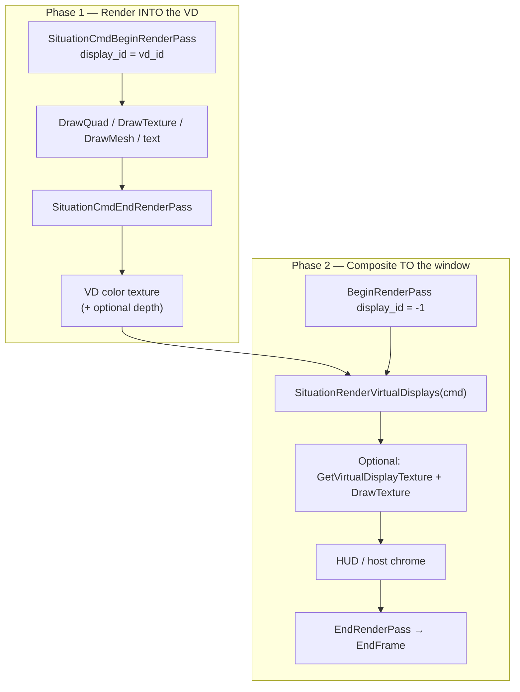
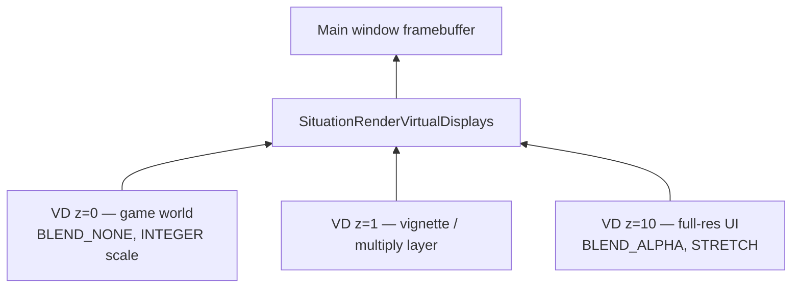
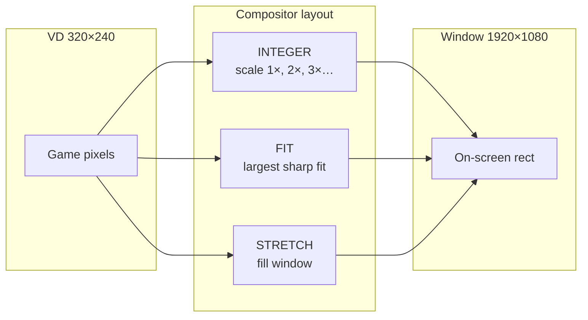
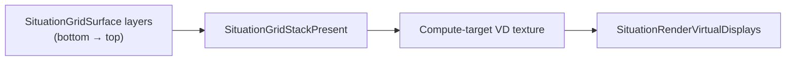
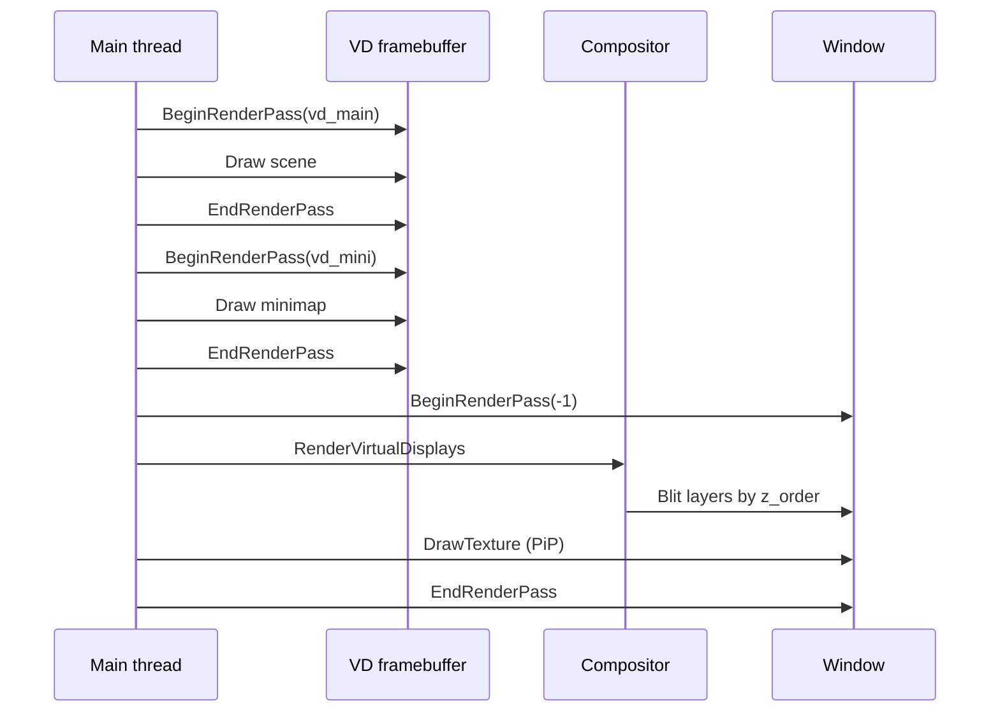

## Virtual Display Module

**Overview:** A **Virtual Display (VD)** is Situation's **projected video field** — a fixed-resolution off-screen target (320×240, 1920×1080, …) that the compositor treats like a monitor feed: you **project content into it** while live; when projection stops, the field shows a **standby image** (flat color or **test pattern**) instead of stale pixels. Multiple VDs stack onto the main window with integer scaling, z-order, opacity, and blend modes.

**Why it exists:** Most engines give you one window framebuffer. Situation models **layers as video planes** — retro game at native low res, HUD at full res, minimap PiP, split-screen, post-FX passes, compute-written surfaces. Test patterns belong to this model: they are what a plane displays when it has **no signal** ([Test patterns](test_patterns.md)).

**Canonical examples:**

| Example | What it teaches |
|---------|-----------------|
| `examples/05_virtual_display_retro/` | 320×240 CRT, integer scale, letterbox, minimap PiP |
| `examples/demon_hunt/` | Full game world rendered into VD at fixed res, composited with `SCALING_FIT` |
| `examples/27_grid_playfield/` | Stacked grid playfield — Kenney tiles, scroll, **`SituationGridStackPresent`** → compute VD |
| `sit/k-term/` | K-Term **grid client** — VT terminal into `SITUATION_VD_FLAG_COMPUTE_TARGET` via `SituationGrid*` + optional `terminal_fx.comp` |

**Related:** [2D Grid](grid.md) · [2D Drawing](drawing_2d.md) · [3D Drawing](drawing_3d.md) · [Compute](compute.md) · [Test patterns — SMPTE / calibration library](test_patterns.md) · [Window & Display — main window host](window_display.md) · [Graphics — VD API detail](graphics.md#virtual-displays) · [situation_command_reference.md](../situation_command_reference.md)

---

### Mental model — projected field, then composite

Each VD is a **video field** with two phases every frame:

| Phase | Name | What happens |
|-------|------|----------------|
| **1** | **Projection in** | Your draw/compute writes the live signal into the VD texture (`display_id = vd_id`) |
| **2** | **Composite out** | `SituationRenderVirtualDisplays` stacks fields onto the window; idle fields show **standby** (default **snow**, or SOLID / COLORBURST / layered PATTERN) |

**No projection** (no content write within `idle_threshold_seconds`) → the compositor does **not** sample stale texels; it generates standby RGB in-shader. See [Test patterns — idle compositor flow](test_patterns.md#idle-compositor-flow-per-vd-layer). **Create default (v2.4.371+):** `PATTERN` + zero layers → **animated snow**. Optional modes: **SOLID**, **COLORBURST** (SMPTE subset), or **PATTERN** with layer bitmask via `SituationSetVirtualDisplayPatternConfig`.



**Coordinates:**

| Space | Origin | Units | Used when |
|-------|--------|-------|-----------|
| **VD space** | Top-left of VD | VD pixels (e.g. 0…319, 0…239) | `display_id >= 0` in render pass |
| **Window space** | Top-left of framebuffer | Physical render pixels | `display_id = -1`, compositor, `DrawTexture` PiP |

Drawing commands inside a VD pass use **VD pixel coordinates** — `(0,0)` is the VD top-left, not the window.

---

### When to use a Virtual Display

| Goal | VD approach |
|------|-------------|
| **Pixel-perfect retro** (320×240 → 4K) | `SITUATION_SCALING_INTEGER` + low-res VD |
| **Fixed game resolution** independent of window | Render game to VD; window can resize freely |
| **Multiple layers** (world + UI + minimap) | Separate VDs or manual `GetVirtualDisplayTexture` |
| **3D world at lower res** | VD with depth attachment; see [3D Drawing](drawing_3d.md) |
| **Compute/post-FX buffer** | `SITUATION_VD_FLAG_COMPUTE_TARGET` |
| **Tile playfield / stacked cell layers** | Compute VD + [2D Grid](grid.md) `SituationGridStackPresent` |
| **Simple fullscreen 2D** | Skip VD — draw directly to `display_id = -1` ([2D Drawing](drawing_2d.md), [Window & Display](window_display.md)) |

---

### Compositor stack (z-order)



`SituationRenderVirtualDisplays`:

1. Collects VDs where `visible == true` and `opacity > 0`
2. **Sorts by `z_order`** (lower drawn first)
3. For each layer: scale (stretch/fit/integer), translate by `offset`, apply `blend_mode`
4. Records composite draws into the **current** main-window render pass

| Property | Effect |
|----------|--------|
| `z_order` | Lower = background. Same z → creation order |
| `offset` | Top-left position in **window pixels** when compositing |
| `opacity` | Global alpha multiplier for the whole layer |
| `visible` | `false` = skip auto-composite (still renderable; use for PiP) |

---

### Quick start — retro CRT (example 05)

**Setup once:**

```c
static int g_vd_main = -1;

SituationCreateVirtualDisplayEx(
    (Vector2){{320, 240}},
    1.0,    /* frame_time_mult — 1.0 = every frame */
    0,      /* z_order — back layer */
    SITUATION_SCALING_INTEGER,
    SITUATION_BLEND_NONE,
    SITUATION_VD_FLAG_NONE,
    &g_vd_main);
```

**Each frame:**

```c
SituationCommandBuffer cmd = SituationGetMainCommandBuffer();

/* Pass A — draw game at 320×240 */
SituationRenderPassInfo rp = {0};
rp.display_id = g_vd_main;
rp.color_attachment.loadOp = SIT_LOAD_OP_CLEAR;
rp.color_attachment.clear.color = (ColorRGBA){8, 6, 20, 255};
rp.depth_attachment.loadOp = SIT_LOAD_OP_CLEAR;
rp.depth_attachment.clear.depth = 1.0f;
SituationCmdBeginRenderPass(cmd, &rp);
draw_main_scene(cmd);   /* quads, text — coords in 0…320 × 0…240 */
SituationCmdEndRenderPass(cmd);

/* Pass B — composite to window */
SituationRenderPassInfo window = SituationRenderPassInfoDefault(-1, (ColorRGBA){0, 0, 0, 255});
SituationCmdBeginRenderPass(cmd, &window);
SituationRenderVirtualDisplays(cmd);   /* integer-scaled CRT + black letterbox */
SituationCmdEndRenderPass(cmd);
SituationEndFrame();
```

Build:

```powershell
& "c:\Users\User\Desktop\hobby\_kiro\situation\build\build_examples.bat" static-opengl 05_virtual_display_retro
```

---

### Creating a Virtual Display

| API | Use when |
|-----|----------|
| `SituationCreateVirtualDisplay` | Standard raster VD (color + depth) |
| `SituationCreateVirtualDisplayEx` | Same + `SituationVDFlags` (e.g. compute target) |
| `SituationCreateVirtualDisplayFromDesc` | Full control: color format, depth mode, attachment defaults |

```c
SituationError SituationCreateVirtualDisplay(
    Vector2 resolution,
    double frame_time_mult,
    int z_order,
    SituationScalingMode scaling_mode,
    SituationBlendMode blend_mode,
    int* out_id);
```

**Parameters:**

| Param | Meaning |
|-------|---------|
| `resolution` | Internal render size in pixels (both > 0) |
| `frame_time_mult` | Independent time scale for this VD's clock (`1.0` = normal; `0.5` = half-speed simulation feel) |
| `z_order` | Compositing sort key |
| `scaling_mode` | How VD maps to window when composited |
| `blend_mode` | How VD blends onto layers below |

**Limits:** Up to **`SITUATION_MAX_VIRTUAL_DISPLAYS` (16)** active VDs.

**Vulkan note:** Built-in VD compositor shaders compile at runtime — define **`SITUATION_ENABLE_SHADER_COMPILER`** and link `shaderc` when using Vulkan.

---

### Rendering into a VD

Set `SituationRenderPassInfo.display_id` to your VD id (≥ 0):

```c
SituationRenderPassInfo rp = {0};
rp.display_id = g_vd_main;
rp.color_attachment.loadOp = SIT_LOAD_OP_CLEAR;
rp.color_attachment.storeOp = SIT_STORE_OP_STORE;
rp.color_attachment.clear.color = (ColorRGBA){0, 0, 0, 255};
rp.depth_attachment.loadOp = SIT_LOAD_OP_CLEAR;   /* 3D / depth-tested 2D */
rp.depth_attachment.clear.depth = 1.0f;

SituationCmdBeginRenderPass(cmd, &rp);
/* SituationCmdDrawQuad, DrawTexture, DrawMesh, DrawTextEx, custom pipeline */
SituationCmdEndRenderPass(cmd);
```

Everything in [2D Drawing](drawing_2d.md) and [3D Drawing](drawing_3d.md) works inside a VD pass — the internal orthographic projection matches **VD resolution**.

**Update-before-draw still applies:** finish CPU/GPU buffer updates before draw commands in the same pass.

---

### Compositing — `SituationRenderVirtualDisplays`

Call **inside a main-window render pass** (`display_id = -1`), after you've finished rendering all VDs for the frame:

```c
SituationCmdBeginRenderPass(cmd, &window_pass);
SituationRenderVirtualDisplays(cmd);
SituationCmdEndRenderPass(cmd);
```

Only **`visible == true`** VDs are composited. Use `SituationConfigureVirtualDisplay` to hide a layer from auto-composite while still rendering into it (PiP pattern).

**Profiling:** `SituationGetLastVDCompositeTimeMS()` returns the last composite pass duration.

---

### Scaling modes (layout only — v2.4.387+)

**Important:** Since v2.4.387, **`SituationScalingMode` controls compositor layout only** (which rectangle in window space the VD occupies). It does **not** set min/mag/mip filter. Use **`SituationSetVirtualDisplaySampler`** for filtering (see [Composite sampler](#composite-sampler--quality-v2487) below).



| Mode | Aspect | Letterbox | Best for |
|------|--------|-----------|----------|
| `SITUATION_SCALING_INTEGER` | Preserved | Often (larger bars) | **Pixel art, CRT, retro** |
| `SITUATION_SCALING_FIT` | Preserved | Minimal | Sharp upscale, demon_hunt |
| `SITUATION_SCALING_STRETCH` | Ignored (fills target) | None | Full-bleed UI layers |

Integer scale formula: `floor(min(windowW/vdW, windowH/vdH))`, centered with black bars.

Change at runtime: `SituationSetVirtualDisplayScalingMode(vd_id, mode)` — **layout only**.

---

### Composite sampler & quality (v2.4.387+)

Filtering when the compositor **samples** the VD texture is controlled separately from scaling layout.

| API | Purpose |
|-----|---------|
| `SituationVirtualDisplaySamplerDescDefault()` | Sensible defaults at create |
| `desc.composite_sampler` on **`SituationCreateVirtualDisplayFromDesc`** | Initial sampler at create |
| `SituationSetVirtualDisplaySampler(vd, &sampler)` | Change min/mag/mip filter, wrap, aniso, LOD clamp (**light rebuild**) |
| `SituationSetVirtualDisplayMaxAnisotropy(vd, value)` | Aniso on composite sampler (1 = off) |
| `SituationSetVirtualDisplayMipLevels(vd, storage_mips, sampler_max_mip)` | Sampler LOD clamp; **storage** mips are **create-time only** (`color_mip_levels` on desc) |
| `SituationSetVirtualDisplayClearColor(vd, color)` | Stored default clear (also via attachment defaults + **`RenderPassInfoInherit`**) |

```c
SituationVirtualDisplaySamplerDesc sampler = SituationVirtualDisplaySamplerDescDefault();
sampler.min_filter = SIT_FILTER_NEAREST;
sampler.mag_filter = SIT_FILTER_NEAREST;
SituationSetVirtualDisplaySampler(g_vd_main, &sampler);
```

**sRGB storage:** set `desc.color_format = SIT_VD_FORMAT_RGBA8_SRGB` at create. OpenGL uses `GL_SRGB8_ALPHA8` + `GL_FRAMEBUFFER_SRGB` during VD passes; compositor samples stored gamma correctly. Main-window HDR10 swapchain is separate — see [HD color output](hd_color_output.md).

**Configure guards:** sampler, aniso, mip, attachment-default, and clear-color configure APIs return **`SITUATION_ERROR_RENDER_PASS_ACTIVE`** if the VD is inside an active render pass.

---

### MSAA attachment quality (v2.4.398)

**Not end-to-end yet** — this section documents the **public types** shipped in Phase 0 prep. **`SituationVirtualDisplayDesc.msaa_samples`** must still be **`1`**; values **`> 1`** return **`NOT_IMPLEMENTED`** until **VD-4b**.

| Item | Status @ v2.4.398 |
|------|-------------------|
| **`SituationMultisampleQuality`** enum + helpers | Shipped — see [core — Graphics caps](core.md#situationmultisamplequality-v244398) |
| VD **`msaa_quality`** storage | Set from **`desc.msaa_samples`** at create |
| **`SituationSetVirtualDisplayMultisampleQuality`** | Planned VD-4b (tier B, heavy rebuild) |
| MSAA FBO + resolve before composite | VD-4b / v2.5 default |

```c
SituationVirtualDisplayDesc desc = {0};
desc.msaa_samples = 1;  /* only value accepted until VD-4b */
/* internally: msaa_quality = SITUATION_MULTISAMPLE_OFF */
```

When VD-4b lands, compositor will always sample **resolved single-sample** color — never multisample views. Pixel-art preset: stay **`OFF`**, NEAREST sampler, integer scaling.

---

### Update mode & memory (v2.4.387+)

| API | Behavior |
|-----|----------|
| `SituationSetVirtualDisplayUpdateMode(vd, SIT_VD_UPDATE_DYNAMIC)` | Default — VD frame clock advances every frame (subject to `frame_time_mult`) |
| `SituationSetVirtualDisplayUpdateMode(vd, SIT_VD_UPDATE_STATIC)` | Freezes VD **`elapsed_time` / frame clock** in `SituationUpdateTimers`; use **`SituationSetVirtualDisplayDirty`** when content must refresh |
| `SituationSetVirtualDisplayMemoryHint(vd, hint)` | Stored hint (`DEFAULT`, `PREFER_SPEED`, `PREFER_QUALITY`); best-effort at VMA create |

`SituationConfigureVirtualDisplay(..., frame_time_mult == 0)` also selects static mode; `> 0` restores dynamic.

---

### Color encoding & readback (v2.4.387+)

Three different paths — do not assume one encoding applies everywhere.

#### 1. Stored in the VD attachment (offscreen texture)

| `color_format` at create | GPU storage | Shader output while rendering **into** the VD |
|--------------------------|-------------|--------------------------------------------------|
| `SIT_VD_FORMAT_RGBA8_UNORM` | Linear 8-bit RGBA bytes | Values written as-is (no automatic gamma encode on GL) |
| `SIT_VD_FORMAT_RGBA8_SRGB` | sRGB-encoded 8-bit RGBA | OpenGL: **`GL_FRAMEBUFFER_SRGB`** converts **linear fragment output → sRGB storage** during the VD pass. Vulkan: `VK_FORMAT_R8G8B8A8_SRGB` storage with compositor sampling decode. |

Clear colors use **`ColorRGBA` 0–255** in API structs. On the main window with HDR10 active, Vulkan VD pass clear may ride the HDR clear helper; OpenGL VD 8-bit passes always use **SDR clear floats** (not PQ-encoded into the FBO).

#### 2. Sampling the VD (`SituationGetVirtualDisplayTexture`)

The texture registry exposes **`format_api`** as `SIT_TEXTURE_FORMAT_RGBA8_UNORM` or `SIT_TEXTURE_FORMAT_RGBA8_SRGB` matching the VD attachment. User shaders should sample accordingly (hardware sRGB decode when format is SRGB).

The **internal compositor** uses **`composite_sampler`** (filter, aniso, mip LOD) — independent of **`scaling_mode`**.

#### 3. Reading pixels back to CPU

| API | What it reads | Bytes you get |
|-----|---------------|---------------|
| **`SituationReadTexture`** / **`ReadTextureAlloc`** on VD texture | Raw attachment texels | **UNORM VD:** stored byte values (linear-ish). **SRGB VD:** sRGB-encoded bytes (not re-linearized by readback). `ReadTextureAlloc` sets `SituationImage.color_encoding = SITUATION_COLOR_SRGB` today — treat bytes as display/export oriented, not a guarantee of linear light. |
| **`SituationLoadImageFromScreen`** / **`ReadFramebuffer`** | **Main window** after **`SituationRenderVirtualDisplays`** (composited result) | **RGBA8** (`GL_UNSIGNED_BYTE` / downconvert from HDR10 swapchain). This is **not** a direct read of an isolated VD attachment. On GL, image is vertically flipped then corrected. |
| **`SituationReadFramebufferHdr`** | Main window swapchain | Raw **A2R10G10B10** when HDR10 path active — see **[HD color output](hd_color_output.md)**. |

**Practical rules:**

- To debug **game pixels inside a VD**, read the **VD texture** (`GetVirtualDisplayTexture` → `ReadTexture`), not the screen.
- To capture **what the user sees** (all layers + letterbox + HUD), use **`LoadImageFromScreen`** after compositing.
- For PNG export of screen captures, RGBA8 bytes are usually fine as-is; do not apply a second gamma pass unless you know your pipeline is linear-encoded.

Main-window HDR10 swapchain policy is **`10BIT_COLOR_OUTPUT_PLAN.md`** — orthogonal to VD attachment format until **VD-6** float/HDR attachments ship.

---

### Blend modes

#### Simple modes (fast path)

| Mode | Effect | Typical use |
|------|--------|-------------|
| `SITUATION_BLEND_NONE` | Opaque overwrite | Main game layer |
| `SITUATION_BLEND_ALPHA` | Standard src-alpha | UI overlays, glass panels |
| `SITUATION_BLEND_ADDITIVE` | Src + dst (brighten) | Glows, sparks, laser trails |
| `SITUATION_BLEND_MULTIPLY` | Src × dst (darken) | Shadows, vignettes |
| `SITUATION_BLEND_SCREEN` | Inverse multiply brighten | Soft highlights |

#### Photoshop-style modes (advanced compositor)

Requires **destination read** (screen copy). Uses a separate compositor shader path:

`OVERLAY`, `SOFT_LIGHT`, `HARD_LIGHT`, `COLOR_DODGE`, `COLOR_BURN`, `DARKEN`, `LIGHTEN`, `DIFFERENCE`, `EXCLUSION`

Use these for stylized full-screen treatment layers (damage flash, film grade). Slightly higher GPU cost on Vulkan (may end/restart render pass for screen copy).

Change at runtime: `SituationConfigureVirtualDisplay(..., blend_mode)`.

---

### Pattern: picture-in-picture (minimap)

Render minimap to a second VD, **hide from auto-composite**, draw manually with alpha:

```c
/* Create minimap VD */
SituationCreateVirtualDisplay(
    (Vector2){{160, 120}}, 1.0, 1,
    SITUATION_SCALING_INTEGER, SITUATION_BLEND_ALPHA, &g_vd_mini);

/* Hide from SituationRenderVirtualDisplays — we place it ourselves */
SituationConfigureVirtualDisplay(
    g_vd_mini, (Vector2){{0, 0}}, 1.0f, 1,
    false, 1.0, SITUATION_BLEND_ALPHA);

/* Each frame: render minimap content into g_vd_mini (pass B) */
/* Then on window pass: */
SituationRenderVirtualDisplays(cmd);   /* main CRT only */

SituationTexture mini_tex = {0};
SituationGetVirtualDisplayTexture(g_vd_mini, &mini_tex);
SitRectangle src = {0, 0, 160, 120};
SitRectangle dst = {pip_x, pip_y, 320, 240};   /* 2× scale in window space */
SituationCmdDrawTexture(cmd, mini_tex, src, dst, (Vector2){{0,0}}, 0.0f,
                        (ColorRGBA){255, 255, 255, 210});
```

Full working code: `examples/05_virtual_display_retro/main.c`.

---

### Pattern: 3D world in a fixed-resolution layer

```c
SituationCreateVirtualDisplay(
    (Vector2){{640, 360}}, 1.0, 0,
    SITUATION_SCALING_FIT, SITUATION_BLEND_ALPHA, &g_world_vd);

SituationRenderPassInfo rp = {0};
rp.display_id = g_world_vd;
rp.color_attachment.loadOp = SIT_LOAD_OP_CLEAR;
rp.depth_attachment.loadOp = SIT_LOAD_OP_CLEAR;
rp.depth_attachment.clear.depth = 1.0f;

SituationCmdBeginRenderPass(cmd, &rp);
draw_sky_and_meshes(cmd);   /* 3D — see drawing_3d.md */
SituationCmdEndRenderPass(cmd);

/* Composite world; draw HUD at full window res on top */
SituationCmdBeginRenderPass(cmd, &window_pass);
SituationRenderVirtualDisplays(cmd);
draw_hud_full_resolution(cmd);
SituationCmdEndRenderPass(cmd);
```

Demon Hunt uses `GAME_RENDER_W × GAME_RENDER_H` with `SITUATION_SCALING_FIT`.

---

### Pattern: split screen (two views)

```c
SituationCreateVirtualDisplay((Vector2){{640, 720}}, 1.0, 0,
    SITUATION_SCALING_FIT, SITUATION_BLEND_NONE, &g_p1);
SituationCreateVirtualDisplay((Vector2){{640, 720}}, 1.0, 0,
    SITUATION_SCALING_FIT, SITUATION_BLEND_NONE, &g_p2);

/* Offset each half — configure after creation */
SituationConfigureVirtualDisplay(g_p1, (Vector2){{0, 0}}, 1.0f, 0, true, 1.0, SITUATION_BLEND_NONE);
SituationConfigureVirtualDisplay(g_p2, (Vector2){{640, 0}}, 1.0f, 0, true, 1.0, SITUATION_BLEND_NONE);

/* Render each player's view into their VD, then one composite call draws both */
```

---

### Pattern: compute-written texture

For GPU compute output (blur, terminal glyph buffer, simulation grid, **2D playfield**):

```c
SituationCreateVirtualDisplayEx(
    (Vector2){{1920, 1080}}, 1.0, 5,
    SITUATION_SCALING_STRETCH, SITUATION_BLEND_ALPHA,
    SITUATION_VD_FLAG_COMPUTE_TARGET, &g_fx_vd);

SituationTexture tex = {0};
SituationGetVirtualDisplayTexture(g_fx_vd, &tex);
/* Bind tex to compute dispatch — imageStore */
/* Or: SituationGridStackPresent(cmd, stack, g_fx_vd) — see 2D Grid guide */
/* Composite like any other VD */
```

Compute targets: **no depth buffer**, texture has **STORAGE** usage. Not render-pass writable — populate via compute then composite.

See [Compute Module](compute.md), **[2D Grid Module](grid.md)**, and `sit/k-term/kt_render_sit.h`.

---

### Pattern: grid playfield present

Stacked cell layers (tiles, scroll, collision) into a compute-target VD — the pattern used by **example 27** and K-Term:



```c
SituationCreateVirtualDisplayEx(
    (Vector2){{640, 360}}, 1.0, 0,
    SITUATION_SCALING_INTEGER, SITUATION_BLEND_NONE,
    SITUATION_VD_FLAG_COMPUTE_TARGET, &g_playfield_vd);

SituationGridStackPresent(cmd, g_stack, g_playfield_vd);
SituationSetVirtualDisplayDirty(g_playfield_vd, true);

/* Window pass */
SituationCmdBeginRenderPass(cmd, &window_pass);
SituationRenderVirtualDisplays(cmd);
SituationCmdEndRenderPass(cmd);
```

**Requirements:** VD must be created with **`SITUATION_VD_FLAG_COMPUTE_TARGET`**. Each dispatch updates the VD content clock (idle fallback). Full API, scroll, and collision: **[2D Grid](grid.md)** · frame contract in **`doc/plan/GRID_RENDER_PLAN.md`** Phase E.

---

### Advanced creation — `SituationCreateVirtualDisplayFromDesc`

Full attachment and format control (VD-1):

```c
SituationVirtualDisplayDesc desc = {0};
desc.resolution = (Vector2){{1280, 720}};
desc.color_format = SIT_VD_FORMAT_RGBA8_UNORM;   /* or SIT_VD_FORMAT_RGBA8_SRGB */
desc.depth_stencil_mode = SIT_VD_DEPTH_NONE;     /* or SIT_VD_DEPTH_D24; D24S8 = NOT_IMPLEMENTED */
desc.composite_sampler = SituationVirtualDisplaySamplerDescDefault();
desc.color_mip_levels = 1;                       /* >1: storage mips + post-draw mipgen */
desc.update_mode = SIT_VD_UPDATE_DYNAMIC;
desc.memory_hint = SIT_VD_MEMORY_DEFAULT;
desc.scaling_mode = SITUATION_SCALING_FIT;
desc.blend_mode = SITUATION_BLEND_ALPHA;
desc.z_order = 0;
desc.visible = true;
desc.frame_time_mult = 1.0;
desc.flags = SITUATION_VD_FLAG_NONE;

/* Optional attachment defaults for inherited load/store/clear */
desc.attachments = /* SituationVirtualDisplayAttachmentDefaults */;

SituationCreateVirtualDisplayFromDesc(&desc, &vd_id);
```

Tier-B storage-only defaults without recreating the VD:

```c
SituationSetVirtualDisplayAttachmentDefaults(vd_id, &defaults);
SituationRenderPassInfo pass = SituationRenderPassInfoInherit(vd_id);  /* tier C helper */
SituationSetVirtualDisplayClearColor(vd_id, (ColorRGBA){40, 80, 120, 255});
```

---

### Idle fallback (compositor safety net)

If a VD receives **no content writes** for `idle_threshold_seconds` (default **1.0 s**), the compositor shows a **shader-generated standby** image instead of sampling stale texels.

| Clock / flag | Meaning |
|--------------|---------|
| `last_update_time_seconds` | VD **frame clock** (animation delta) — updated every VD tick |
| `is_dirty` | Manual hint that offscreen may need redraw — not used alone for idle |
| `last_content_update_time` | **Last pixel write** (draw, copy, or compute dispatch) — drives idle detection |

Negative thresholds passed to `SituationSetVirtualDisplayIdleThreshold` are clamped to **0.0**. A threshold of **0.0** means idle when `seconds_since_update > 0` (any elapsed time after the last write).

| API | Purpose |
|-----|---------|
| *(create default)* | **`PATTERN`**, `pattern_layers = 0` → animated snow when idle |
| `SituationSetVirtualDisplayIdleThreshold(vd, seconds)` | Idle detection window |
| `SituationSetVirtualDisplayFallbackMode(vd, mode)` | `SOLID`, `COLORBURST`, or `PATTERN` — see [Test patterns](test_patterns.md#idle-compositor-flow-per-vd-layer) |
| `SituationSetVirtualDisplayFallbackColor(vd, color)` | Solid idle tint |
| `SituationSetVirtualDisplayPatternConfig(vd, &cfg)` | Full pattern tuning + switches mode to **PATTERN** |
| `SituationSetVirtualDisplayChromaSnow(vd, enabled)` | Toggle bit **16** — RGB snow when no calibration layers (0–8) |
| `SituationGetVirtualDisplayChromaSnow(vd)` | Read chroma snow flag |
| `SituationGetVirtualDisplayUpdateInfo(...)` | Query last content write time/frame and `seconds_since_update` |

Content writes (raster draw pass with draws, `CopyTexture` to compute-target VD, compute **dispatch** with VD storage bound) update `last_content_update_time` automatically. **Clear-only** render passes do not count as writes.

For compute-target VDs (`SITUATION_VD_FLAG_COMPUTE_TARGET`), use `SituationGetVirtualDisplayTexture` + dispatch — see [Compute guide](compute.md).

---

### Runtime configuration

```c
SituationError SituationConfigureVirtualDisplay(
    int display_id,
    Vector2 offset,
    float opacity,
    int z_order,
    bool visible,
    double frame_time_mult,
    SituationBlendMode blend_mode);

SituationVirtualDisplay* vd = SituationGetVirtualDisplay(display_id);
/* Read: resolution, frame_count, elapsed_time, cycle_animation_value, is_dirty, … */

SituationGetVirtualDisplaySize(display_id, &w, &h);
SituationSetVirtualDisplayScalingMode(display_id, SITUATION_SCALING_INTEGER);
SituationSetVirtualDisplayDirty(display_id, true);
bool dirty = SituationIsVirtualDisplayDirty(display_id);
```

`SituationGetVirtualDisplay` returns live state — useful for HUD debug (frame counter, VD timing).

---

### Multi-VD frame checklist

1. **Create** VDs at init (`CreateVirtualDisplay` / `Ex` / `FromDesc`)
2. **For each layer:** `BeginRenderPass(display_id = vd)` → draw → `EndRenderPass`
3. **Window pass:** `BeginRenderPass(display_id = -1)` → `SituationRenderVirtualDisplays`
4. **Optional PiP:** `GetVirtualDisplayTexture` + `DrawTexture` for hidden VDs
5. **Host HUD** at full window resolution (outside VD space)
6. **Destroy** VDs before shutdown: `SituationDestroyVirtualDisplay(&id)`



---

### Troubleshooting

| Symptom | Likely cause | Fix |
|---------|--------------|-----|
| Black window, no game | Forgot `RenderVirtualDisplays` | Call inside window pass after VD renders |
| Blurry pixel art | Wrong composite sampler (linear upscale) | `SituationSetVirtualDisplaySampler` with **NEAREST**; use `SITUATION_SCALING_INTEGER` for layout |
| Blurry pixel art (old docs) | Assumed `STRETCH` implied linear | Since v2.4.387 scaling is layout-only — set sampler explicitly |
| UI wrong size | Drawing UI in VD coords vs window coords | Separate VD at window res, or draw HUD after composite |
| Layer order wrong | z_order inverted | **Lower z = drawn first** (background) |
| Minimap appears twice | `visible=true` on PiP VD | `ConfigureVirtualDisplay(..., visible=false)` |
| `CreateVirtualDisplay` fails on Vulkan | No shader compiler | `#define SITUATION_ENABLE_SHADER_COMPILER` |
| Advanced blend corrupts frame (VK) | Known path-A pass restart | Keep OVERLAY+ layers minimal; test blend mode |
| Coordinates feel offset | Mixing VD and window space | Check which pass is active |
| 3D z-fighting in VD | No depth clear in VD pass | Set `depth_attachment.loadOp = CLEAR` |
| Hit 16 VD limit | `SITUATION_MAX_VIRTUAL_DISPLAYS` | Destroy unused VDs; merge layers |

---

### API quick reference

#### Lifecycle

```c
SituationError SituationCreateVirtualDisplay(Vector2 resolution, double frame_time_mult,
    int z_order, SituationScalingMode scaling, SituationBlendMode blend, int* out_id);
SituationError SituationCreateVirtualDisplayEx(..., SituationVDFlags flags, int* out_id);
SituationError SituationCreateVirtualDisplayFromDesc(const SituationVirtualDisplayDesc* desc, int* out_id);
SituationError SituationDestroyVirtualDisplay(int display_id);
```

#### Render & composite

```c
/* In SituationRenderPassInfo: */
int display_id;   /* -1 = window, >= 0 = VD */

SituationError SituationRenderVirtualDisplays(SituationCommandBuffer cmd);
SituationError SituationGetVirtualDisplayTexture(int display_id, SituationTexture* out);
```

#### Configure

```c
SituationError SituationConfigureVirtualDisplay(int id, Vector2 offset, float opacity,
    int z_order, bool visible, double frame_time_mult, SituationBlendMode blend);
SituationError SituationSetVirtualDisplayScalingMode(int id, SituationScalingMode mode);  /* layout only */
SituationError SituationSetVirtualDisplaySampler(int id, const SituationVirtualDisplaySamplerDesc* sampler);
SituationError SituationSetVirtualDisplayClearColor(int id, ColorRGBA color);
SituationError SituationSetVirtualDisplayMaxAnisotropy(int id, float max_anisotropy);
SituationError SituationSetVirtualDisplayMipLevels(int id, uint32_t color_mip_levels, uint32_t sampler_max_mip_level);
SituationError SituationSetVirtualDisplayUpdateMode(int id, SituationVirtualDisplayUpdateMode mode);
SituationError SituationSetVirtualDisplayMemoryHint(int id, SituationVirtualDisplayMemoryHint hint);
SituationError SituationSetVirtualDisplayAttachmentDefaults(int id, const SituationVirtualDisplayAttachmentDefaults* d);
SituationRenderPassInfo SituationRenderPassInfoInherit(int display_id);
SituationVirtualDisplay* SituationGetVirtualDisplay(int id);
void SituationGetVirtualDisplaySize(int id, int* w, int* h);
```

#### Idle / debug

```c
void SituationSetVirtualDisplayIdleThreshold(int id, double seconds);
void SituationSetVirtualDisplayFallbackMode(int id, SituationVDFallbackMode mode);
void SituationSetVirtualDisplayFallbackColor(int id, ColorRGBA color);
SituationError SituationGetVirtualDisplayUpdateInfo(int id, double* last_time,
    uint64_t* last_frame, uint64_t* frames_since, double* seconds_since);
double SituationGetLastVDCompositeTimeMS(void);
```

#### Enums (full list in `sit/situation_api_types_gpu.h`)

- **Scaling:** `STRETCH`, `FIT`, `INTEGER`
- **Blend:** `ALPHA`, `ADDITIVE`, `MULTIPLY`, `SCREEN`, `NONE`, + Photoshop modes (`OVERLAY` …)
- **Flags:** `SITUATION_VD_FLAG_NONE`, `SITUATION_VD_FLAG_COMPUTE_TARGET`
- **Fallback:** `SITUATION_VD_FALLBACK_SOLID`, `SITUATION_VD_FALLBACK_COLORBURST`

---

### Further reading

- **Example 05 README:** `examples/05_virtual_display_retro/README.md`
- **SDK deep dive:** [situation_sdk.md § 3.6 Virtual Display Compositor](../situation_sdk.md#36-virtual-display-compositor)
- **Full struct/API prose:** [Graphics Module — Virtual Displays](graphics.md#virtual-displays)
