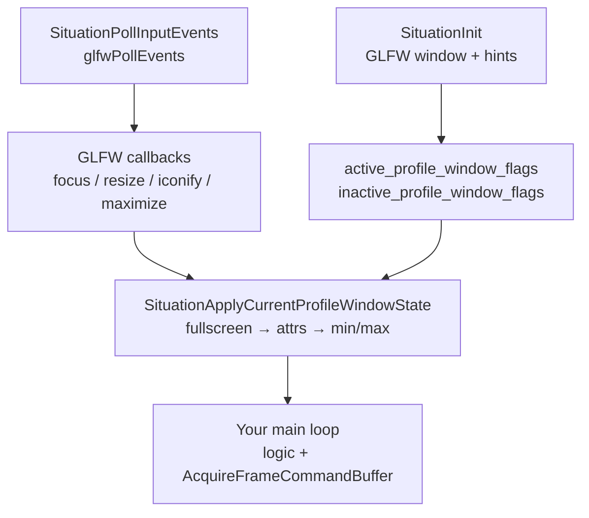
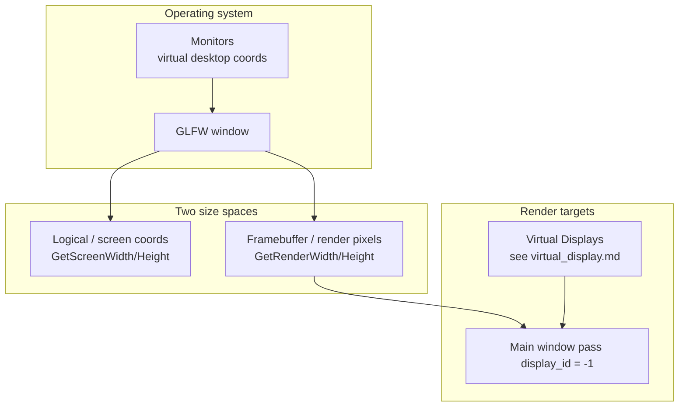
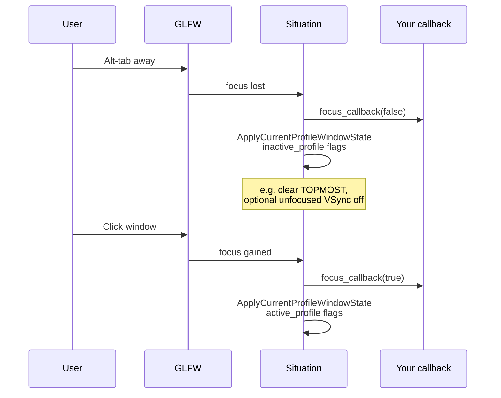
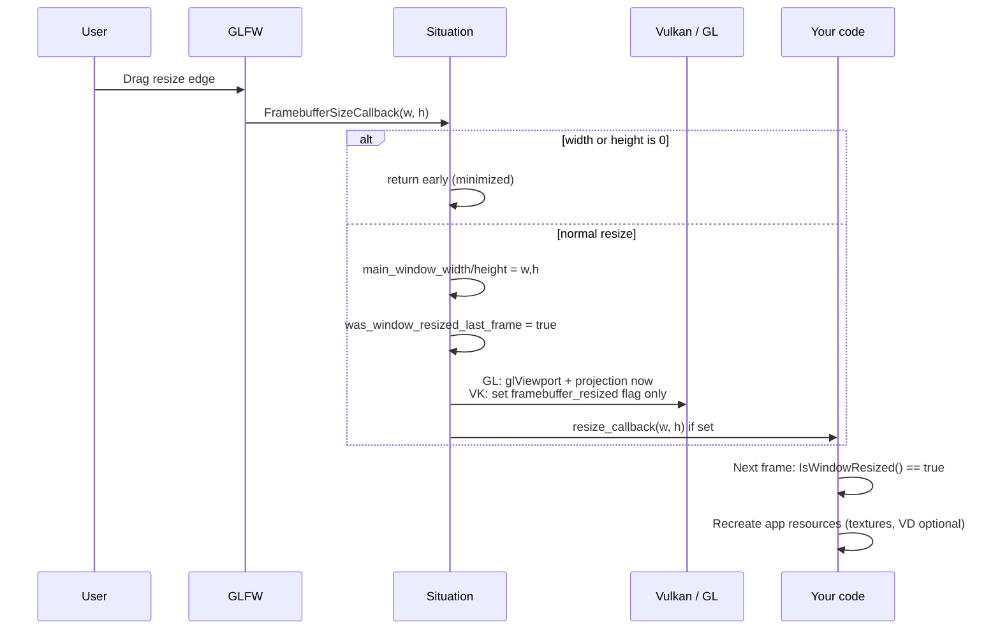
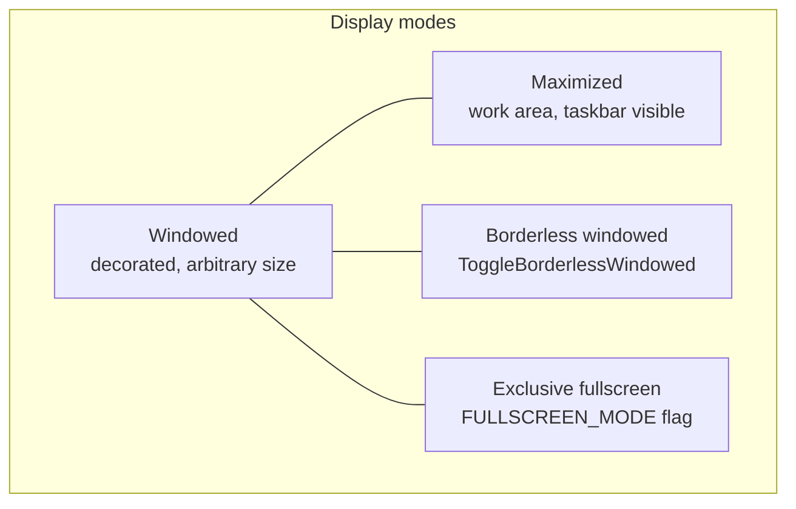
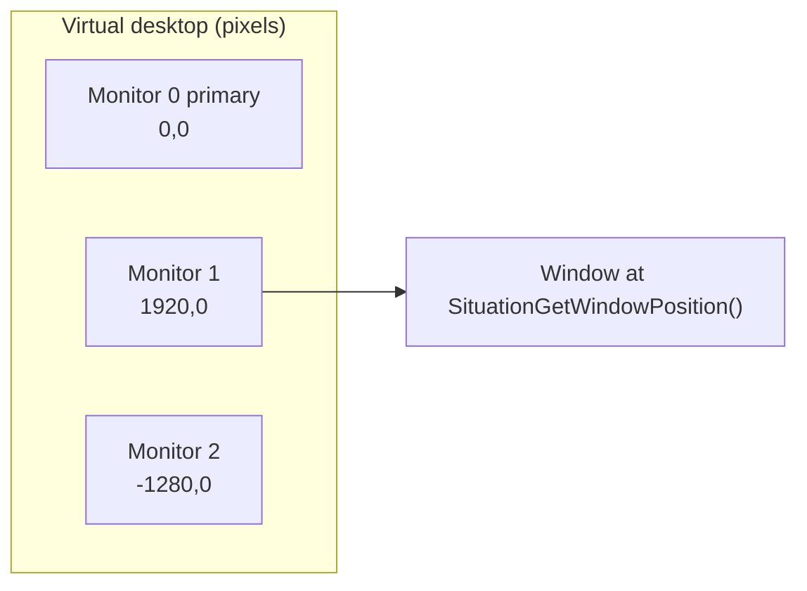

## Window and Display Module

**Overview:** Situation manages one **GLFW-backed OS window** plus **physical monitor enumeration**. The window owns the main swapchain / default framebuffer (`display_id = -1`). Everything here is about that host surface: size, focus, fullscreen, multi-monitor placement, pause, and event callbacks.

**Not Virtual Displays:** Off-screen layers (320×240 game buffer, PiP, post-FX) are **[Virtual Displays](virtual_display.md)** — composited *into* this window. Window size ≠ VD resolution.

**Canonical examples:**

| Example | What it teaches |
|---------|-----------------|
| `examples/01_open_a_window/` | Init, main loop, pause skip, `display_id = -1` |
| `examples/05_virtual_display_retro/` | Window hosts VD compositing — [Virtual Display](virtual_display.md) |
| `examples/shared/sit_example.h` | F11 borderless, F9 VSync, **P pause**, resize-safe HUD |

**Related:** [Core — init & lifecycle](core.md) · [Virtual Display](virtual_display.md) · [Input](input.md) · [Image — icons](image.md) · [Graphics](graphics.md)

---

### How Situation manages the window

Situation does **not** expose a multi-window manager. You get **one** application window created in `SituationInit()`. All window operations go through the platform module (`situation_api_platform.h`) which maps to **GLFW** internally.



**Two layers of state:**

| Layer | What it is | APIs |
|-------|------------|------|
| **Profile flags** | What you *want* when focused vs unfocused | `SituationSetWindowStateProfiles`, `SituationToggleWindowStateFlags` |
| **Actual GLFW state** | What the OS window currently is | `SituationGetCurrentActualWindowStateFlags`, `SituationIsWindow*` queries |

`SituationSetWindowState()` / `SituationClearWindowState()` modify the **current focus profile** and immediately call `SituationApplyCurrentProfileWindowState()`.

**Apply order** (when profiles are applied — focus change, toggle fullscreen, etc.):

1. **Fullscreen ↔ windowed** first (`glfwSetWindowMonitor`) — saves/restores windowed position + backbuffer size
2. **Attributes** — topmost, decorated, resizable
3. **Visibility** — hidden / shown
4. **Minimize / maximize / restore** — skipped while exclusive fullscreen is active
5. **Framebuffer sync** — if size changed, internal resize handler runs (viewport / Vulkan swapchain flag)

---

### Mental model — window, sizes, and virtual displays



| Task | API |
|------|-----|
| UI layout, mouse coords | `SituationGetScreenWidth/Height()` |
| Viewport, aspect ratio, FBO recreate | `SituationGetRenderWidth/Height()` |
| Fixed 320×240 game regardless of window | **[Virtual Display](virtual_display.md)** |
| Draw to the window directly | `display_id = -1` |

`SituationGetWindowScaleDPI()` returns logical→physical ratio (often `2.0` on Retina).

---

### Window state flags — complete reference

All flags are bitmasks in `SituationWindowStateFlags` (`sit/situation_api_types_system.h`). Combine with `|`. Used in `SituationInitInfo.initial_active_window_flags`, `initial_inactive_window_flags`, and profile APIs.

| Flag | Value role | Set at init? | Set at runtime? | GLFW / behavior |
|------|------------|--------------|-----------------|-----------------|
| `SITUATION_FLAG_WINDOW_TOPMOST` | Always on top | Yes (hint) | Yes (`glfwSetWindowAttrib` FLOATING) | Default-on in many builds |
| `SITUATION_FLAG_WINDOW_HIDDEN` | Window not visible | Yes | Yes | `glfwHideWindow` / `ShowWindow` |
| `SITUATION_FLAG_WINDOW_FROZEN` | **App-defined** | Yes | Yes (stored in profile) | No GLFW mapping — use in your logic |
| `SITUATION_FLAG_FULLSCREEN_MODE` | Exclusive fullscreen | Yes | Yes | `glfwSetWindowMonitor` — monitor native mode |
| `SITUATION_FLAG_WINDOW_UNDECORATED` | No title bar / borders | Yes (hint) | Yes | `GLFW_DECORATED` off |
| `SITUATION_FLAG_WINDOW_ALWAYS_RUN` | Keep updating when minimized | Yes | Yes (profile) | **Your loop** must honor; no GLFW auto |
| `SITUATION_FLAG_WINDOW_MINIMIZED` | Iconified | Rare at init | Yes | `glfwIconifyWindow` — triggers auto-pause |
| `SITUATION_FLAG_WINDOW_MAXIMIZED` | Fill work area | Rare at init | Yes | `glfwMaximizeWindow` — taskbar visible |
| `SITUATION_FLAG_WINDOW_UNFOCUSED` | Query-only | **No** | **No** | Reflects focus loss; not settable |
| `SITUATION_FLAG_WINDOW_RESIZABLE` | User can resize | Yes (hint) | Yes | `GLFW_RESIZABLE` |
| `SITUATION_FLAG_BORDERLESS_WINDOWED_MODE` | Profile marker for borderless path | Yes | Via toggle API | Use with `SituationToggleBorderlessWindowed()` |
| `SITUATION_FLAG_MSAA_4X_HINT` | 4× MSAA (main window, GL init hint) | **Init only** | No | `GLFW_SAMPLES` hint; future: fold into **`SituationMultisampleQuality`** (see [core — MSAA](core.md#situationmultisamplequality-v244398)) |
| `SITUATION_FLAG_VSYNC_HINT` | Swap interval 1 | Yes | Yes (profile + `SituationSetVSync`) | `glfwSwapInterval` |

**Mutually exclusive modes:** Applying profiles clears conflicts — turning **fullscreen ON** clears minimized/maximized in the profile; turning **maximize ON** clears fullscreen/minimized; etc. (`SituationToggleWindowStateFlags`).

**Enum aliases:** `SITUATION_WINDOW_STATE_*` mirrors the `SITUATION_FLAG_*` names for typed APIs.

```c
SituationInitInfo init = SituationInitInfoDefault(1280, 720, "My Game");
init.initial_active_window_flags =
    SITUATION_FLAG_WINDOW_RESIZABLE |
    SITUATION_FLAG_VSYNC_HINT;
init.initial_inactive_window_flags =
    SITUATION_FLAG_VSYNC_HINT;  /* e.g. drop TOPMOST when alt-tabbed */

SituationInit(argc, argv, &init);
```

---

### Focus and window profiles

When the user alt-tabs or clicks away, GLFW fires a focus callback. Situation:

1. Updates `current_window_focus_state`
2. Calls your **`SituationSetFocusCallback`** (optional)
3. Calls **`SituationApplyCurrentProfileWindowState()`** — applies **inactive** profile flags

When focus returns, the **active** profile is applied.



**Focus vs pause:** Losing focus does **not** automatically call `SituationPauseApp()` unless your inactive profile or game logic does so. **Minimizing** does auto-pause (see below). Use `SituationHasWindowFocus()` for gameplay decisions (mute audio, show "click to play").

```c
void on_focus(bool gained, void* ud) {
    (void)ud;
    if (!gained) {
        /* optional: SituationSetTargetFPS(30); mute audio */
    } else {
        SituationSetTargetFPS(0);
    }
}
SituationSetFocusCallback(on_focus, NULL);
```

**Bring window forward:** `SituationSetWindowFocused()` — may be blocked by OS focus-steal policies.

---

### Pause — manual, automatic, and pause screens

Situation has an **internal pause flag** separate from window focus:

| API | Effect |
|-----|--------|
| `SituationPauseApp()` | Sets pause flag; **pauses audio device** |
| `SituationResumeApp()` | Clears pause flag; resumes audio |
| `SituationIsAppPaused()` | Query — **you** gate game logic / rendering |

**Critical:** Pause does **not** stop your main loop. You must check `SituationIsAppPaused()` and skip updates and/or rendering.

**Automatic pause:** When the window is **minimized** (iconified), GLFW's iconify callback calls `SituationPauseApp()`. Restoring the window calls `SituationResumeApp()`. This is independent of the **P** hotkey.

**Manual pause:** `SituationPauseApp()` / `SituationResumeApp()` — used by **P** in `sit_example.h` and for in-game pause menus.

```c
/* sit_example.h pattern — toggle on P */
if (SituationIsKeyPressed(SIT_KEY_P)) {
    if (SituationIsAppPaused()) SituationResumeApp();
    else                        SituationPauseApp();
}
```

**Three pause-screen strategies:**

| Strategy | Updates | Renders | Best for |
|----------|---------|---------|----------|
| **A — Skip everything** | Skip | Skip | Example 01, 05 — `continue` before render |
| **B — Freeze frame** | Skip | Last frame unchanged | Don't call `EndFrame` with new content; or skip acquire |
| **C — Pause overlay** | Skip gameplay | Draw "PAUSED" HUD | `sit_example.h` HUD shows `[PAUSED]` token when paused but you still render |

**Strategy A** (simplest — from `01_open_a_window`):

```c
while (!SituationWindowShouldClose()) {
    SituationPollInputEvents();
    SituationUpdateTimers();

    if (SituationIsAppPaused()) {
        continue;  /* no logic, no GPU — audio already paused by library */
    }

    UpdateGame();
    /* ... render ... */
}
```

**Strategy C** (pause menu visible — render but don't simulate):

```c
if (!SituationIsAppPaused()) {
    UpdateGame();
}
/* always render — draw world frozen + overlay if paused */
DrawPauseOverlay(SituationIsAppPaused());
```

**Minimize + `SITUATION_FLAG_WINDOW_ALWAYS_RUN`:** The library still auto-pauses audio on minimize. If you set `ALWAYS_RUN`, **your** loop should keep simulating when minimized (e.g. server tool) — but you'll still need to avoid rendering or handle zero framebuffer size.

---

### Resize — how it works

Resize is driven by GLFW's **framebuffer size** callback (not logical window size). Situation updates internal render dimensions and exposes a one-frame poll flag.



| Backend | Inside resize callback | Your responsibility |
|---------|-------------------------|---------------------|
| **OpenGL** | Viewport + ortho projection updated immediately | App FBOs / custom targets if any |
| **Vulkan** | **`framebuffer_resized` flag only** — no swapchain work in callback | Swapchain recreated inside `AcquireFrameCommandBuffer` / end frame path |

**Rules:**

- `SituationIsWindowResized()` is **true for one frame** after a size change — not a continuous state.
- Callback and poll use **render pixels** (`GetRenderWidth/Height`), not logical size.
- **Minimized window:** framebuffer size can be `0×0` — callback returns early; skip rendering with `SituationIsWindowMinimized()`.
- **Exclusive fullscreen:** render **canvas** may stay at pre-fullscreen backbuffer size while the display stretches — Situation saves windowed size before `glfwSetWindowMonitor`.

```c
/* Polling (after PollInputEvents) */
if (SituationIsWindowResized()) {
    OnResize(SituationGetRenderWidth(), SituationGetRenderHeight());
}

/* Or callback at init */
void on_resize(int w, int h, void* ud) {
    (void)ud;
    RecreateMyRenderTargets(w, h);
}
SituationSetResizeCallback(on_resize, NULL);
```

**Virtual Displays:** VD internal resolution is **independent** of window resize unless you explicitly recreate or reconfigure VDs. The compositor scales VD textures to the current window — see [Virtual Display — scaling](virtual_display.md#scaling-modes).

---

### Fullscreen vs windowed vs borderless vs maximize

Four distinct windowing modes — pick intentionally:



| Mode | API | Monitor ownership | Alt-tab | Render canvas |
|------|-----|-----------------|---------|---------------|
| **Windowed** | Default / clear `FULLSCREEN_MODE` | Window on desktop | Fast | Matches window backbuffer |
| **Maximized** | `SituationMaximizeWindow()` | Work area (not full panel) | Fast | Matches backbuffer |
| **Borderless** | `SituationToggleBorderlessWindowed()` | Sized to **current** monitor rect, undecorated | Fast | Monitor resolution |
| **Exclusive FS** | `SituationToggleFullscreen()` or profile flag | Native video mode via `glfwSetWindowMonitor` | Slower | **Saved windowed backbuffer** stretched to panel |

**Examples hotkey note:** Numbered examples use **F11 → `SituationToggleBorderlessWindowed()`** (fake fullscreen), **not** `SituationToggleFullscreen()` (exclusive). For exclusive fullscreen, call `SituationToggleFullscreen()` yourself or set `SITUATION_FLAG_FULLSCREEN_MODE` in profiles.

**Exclusive fullscreen restore:** Situation saves windowed **position + backbuffer size** before entering fullscreen and restores them when leaving.

**VSync:** `SituationSetVSync(bool)` works at runtime regardless of mode. `SITUATION_FLAG_VSYNC_HINT` in profiles also drives `glfwSwapInterval` when profiles are applied.

---

### Multi-monitor windowing

Monitors sit on a **virtual desktop**. Primary monitor is usually index `0` at `(0,0)`; others have positions that may be **negative** (left/above primary).



**Discovery — quick vs rich:**

```c
/* Quick — cached at init, refreshed on demand */
int n = SituationGetMonitorCount();
for (int i = 0; i < n; i++) {
    vec2 pos;
    glm_vec2_copy(SituationGetMonitorPosition(i), pos);
    printf("%s @ (%.0f,%.0f) %dx%d %dHz\n",
        SituationGetMonitorName(i),
        pos[0], pos[1],
        SituationGetMonitorWidth(i),
        SituationGetMonitorHeight(i),
        SituationGetMonitorRefreshRate(i));
}

/* Rich — full mode list, physical mm size */
SituationDisplayInfo* displays = NULL;
int count = 0;
if (SituationGetDisplays(&displays, &count) == SITUATION_SUCCESS) {
    /* ... iterate modes ... */
    SituationFreeDisplays(displays, count);
}
```

**Which monitor is the window on?** `SituationGetCurrentMonitor()` — used internally when entering exclusive fullscreen without an explicit target.

**HDR / 10-bit output** depends on which monitor hosts the window (`hdr_enabled` from DXGI). See **[HD Color Output](hd_color_output.md)**.

**Move window to another monitor (windowed):**

```c
if (SituationGetMonitorCount() > 1) {
    int target = 1;
    vec2 pos;
    glm_vec2_copy(SituationGetMonitorPosition(target), pos);
    int mw = SituationGetMonitorWidth(target);
    int mh = SituationGetMonitorHeight(target);
    int ww, wh;
    SituationGetWindowSize(&ww, &wh);
    SituationSetWindowPosition((int)pos[0] + (mw - ww) / 2,
                               (int)pos[1] + (mh - wh) / 2);
}
```

**Fullscreen on a specific monitor:**

```c
SituationSetWindowMonitor(1);  /* exclusive FS on monitor 1 at its current mode */
```

Or set display mode explicitly:

```c
SituationDisplayMode mode = { .width = 1920, .height = 1080, .refresh_rate = 144 };
SituationSetDisplayMode(0, &mode, true);  /* monitor 0, fullscreen */
```

**Borderless on current monitor:** `SituationToggleBorderlessWindowed()` uses `_SituationGetWindowGLFWMonitor()` — whichever monitor contains the window center.

**Hot-plug:** Call `SituationRefreshDisplays()` after connect/disconnect, then re-query `SituationGetMonitorCount()` / `SituationGetDisplays()`.

**DPI across monitors:** `SituationGetWindowScaleDPI()` reflects the monitor the window is on; re-query after moving.

---

### Display refresh rate (v2.4.386+)

Integer getters remain for simple HUD text; float getters expose **fractional nominal** panel rates (e.g. **59.94 Hz** on NTSC-style displays).

| API | Returns |
|-----|---------|
| `SituationGetMonitorRefreshRate(id)` | Integer Hz from OS/GLFW (may truncate 59.94 → **59**) |
| `SituationGetMonitorRefreshRateHz(id)` | Fractional nominal Hz when DXGI rational is available |
| `SituationGetDisplayRefreshRate()` | Integer Hz for primary display (legacy HUD) |
| `SituationGetDisplayRefreshRateHz()` | Fractional nominal for primary display |
| `SituationGetMeasuredPresentRateHz()` | Measured present-to-present rate when render timing is available |

**FPS display:** `SituationGetFPS()` uses fractional nominal Hz for refresh-aware rounding (59.94 → **60**). The **M** metrics overlay still uses integer **`Disp:`** lines for readability.

**Frame loop:** present-anchored `SituationGetFrameTime()` and paced queue depth (`paced_frames_in_flight = 2` under VSync) are documented in [architecture.md — Frame Loop Contract](../architecture.md#frame-loop-contract-v2484).

---

### Callbacks — registration and event flow

Register callbacks **after** `SituationInit()`. All are optional — polling APIs always remain available.

| Callback | Signature | When fired |
|----------|-----------|------------|
| `SituationSetResizeCallback` | `void(int w, int h, void* ud)` | Framebuffer size changed (render pixels) |
| `SituationSetFocusCallback` | `void(bool gained, void* ud)` | Focus gained / lost |
| `SituationSetMaximizeCallback` | `void(bool maximized, void* ud)` | OS title-bar maximize / restore |
| `SituationSetFileDropCallback` | see `situation_base_callbacks.h` | Files dropped on window |
| `SituationSetExitCallback` | `void(void* ud)` | Just before shutdown |

**Maximize callback caveat:** Not fired for borderless fullscreen transitions — GLFW may report "maximized" when a borderless window fills the screen; Situation guards internal profile sync when `is_borderless_active`.

**File drop — poll vs push:**

```c
/* Poll (single frame) */
if (SituationIsFileDropped()) {
    int n = 0;
    char** paths = SituationLoadDroppedFiles(&n);
    for (int i = 0; i < n; i++) LoadAsset(paths[i]);
    SituationUnloadDroppedFiles(paths, n);
}

/* Push */
void on_drop(int count, const char** paths, void* ud) {
    (void)ud;
    for (int i = 0; i < count; i++) LoadAsset(paths[i]);
}
SituationSetFileDropCallback(on_drop, NULL);
```

**Typical init block:**

```c
SituationInit(argc, argv, &init);
SituationSetResizeCallback(on_resize, NULL);
SituationSetFocusCallback(on_focus, NULL);
SituationSetMaximizeCallback(on_maximize, NULL);
```

---

### Virtual Displays on the main window

VDs are composited **into** the window pass — window management stays in this module:

1. Create VDs — [Virtual Display Module](virtual_display.md#creating-a-virtual-display)
2. Render scenes into VDs (`display_id >= 0`)
3. Window pass (`display_id = -1`): `SituationRenderVirtualDisplays(cmd)` then optional full-res HUD

The window can resize while a VD stays 320×240 with integer scaling. See **[Virtual Display Module](virtual_display.md)** and example **05**.

---

### Frame loop checklist

```c
while (!SituationWindowShouldClose()) {
    SituationPollInputEvents();   /* required first */
    SituationUpdateTimers();

    if (SituationIsWindowMinimized()) continue;

    if (!SituationIsAppPaused()) {
        UpdateGameLogic();
    }

    if (SituationIsWindowResized())
        OnResize(SituationGetRenderWidth(), SituationGetRenderHeight());

    if (SituationAcquireFrameCommandBuffer() != SITUATION_SUCCESS) continue;

    SituationCommandBuffer cmd = SituationGetMainCommandBuffer();
    /* VD passes, then window pass, EndFrame */
}
```

---

### Window appearance and utilities

| API | Purpose |
|-----|---------|
| `SituationSetWindowTitle` | Dynamic title (FPS, score) |
| `SituationSetWindowIcon` / `SetWindowIcons` | Taskbar icon — [Image](image.md) |
| Win32 shell AppID / PE identity | [Windows app identity](windows_app_identity.md) · [Architecture § Identity](../architecture.md#application-identity-architecture-v24399) |
| `SituationSetWindowOpacity` | Whole-window alpha |
| `SituationSetWindowMinSize` / `SetWindowMaxSize` | Resize clamps (`0` = unset) |
| `SituationShowCursor` / `HideCursor` / `DisableCursor` | Cursor visibility / capture |
| `SituationSetCursor` | Standard cursor shapes |
| `SituationGetClipboardText` / `SetClipboardText` | UTF-8 clipboard |
| `SituationGetGLFWwindow()` | Escape hatch for raw GLFW |

---

### Troubleshooting

| Symptom | Cause | Fix |
|---------|-------|-----|
| Game runs while "paused" | Not checking `SituationIsAppPaused()` | Gate logic + render |
| Pause doesn't stop audio | — | `PauseApp` handles audio; logic is yours |
| Minimize pauses unexpectedly | Auto iconify callback | By design; use `ResumeApp` on restore |
| Black screen after resize (VK) | App FBOs stale | Handle `IsWindowResized` |
| No resize event when minimized | 0×0 framebuffer | Expected — skip render |
| Fullscreen on wrong monitor | Default current monitor | `SituationSetWindowMonitor(i)` first |
| Borderless vs exclusive confusion | F11 uses borderless in examples | Use `ToggleFullscreen` for exclusive |
| Focus profile not applied | Edited profiles at runtime | `SituationApplyCurrentProfileWindowState()` |
| VD stretched on resize | Window vs VD confusion | [VD scaling modes](virtual_display.md#scaling-modes) |
| `GetDisplays` leak | Missing free | `SituationFreeDisplays` |
| Wrong Explorer icon / Task Manager Description | PE layer | [Windows app identity](windows_app_identity.md) |
| Pinned taskbar wrong name/icon | AppUserModelID / shortcut | [Windows app identity](windows_app_identity.md) |

---

### API quick reference

#### Pause

```c
void SituationPauseApp(void);
void SituationResumeApp(void);
bool SituationIsAppPaused(void);
```

#### Size and position

```c
int SituationGetScreenWidth(void);
int SituationGetScreenHeight(void);
int SituationGetRenderWidth(void);
int SituationGetRenderHeight(void);
void SituationGetWindowSize(int* w, int* h);
Vector2 SituationGetWindowPosition(void);
Vector2 SituationGetWindowScaleDPI(void);
void SituationSetWindowSize(int w, int h);
void SituationSetWindowPosition(int x, int y);
void SituationSetWindowMinSize(int w, int h);
void SituationSetWindowMaxSize(int w, int h);
bool SituationIsWindowResized(void);
void SituationSetResizeCallback(void (*cb)(int w, int h, void* ud), void* ud);
```

#### State, focus, and modes

```c
void SituationSetWindowState(uint32_t flags);
void SituationClearWindowState(uint32_t flags);
void SituationSetVSync(bool enable);
void SituationToggleFullscreen(void);
void SituationToggleBorderlessWindowed(void);
void SituationMaximizeWindow(void);
void SituationMinimizeWindow(void);
void SituationRestoreWindow(void);
bool SituationIsWindowState(uint32_t flag);
bool SituationIsWindowFullscreen(void);
bool SituationIsWindowMaximized(void);
bool SituationIsWindowMinimized(void);
bool SituationHasWindowFocus(void);
void SituationSetWindowFocused(void);
SituationError SituationSetWindowStateProfiles(uint32_t active, uint32_t inactive);
SituationError SituationApplyCurrentProfileWindowState(void);
SituationError SituationToggleWindowStateFlags(SituationWindowStateFlags flags);
uint32_t SituationGetCurrentActualWindowStateFlags(void);
void SituationSetFocusCallback(SituationFocusCallback cb, void* ud);
void SituationSetMaximizeCallback(SituationMaximizeCallback cb, void* ud);
```

#### Monitors

```c
int SituationGetMonitorCount(void);
int SituationGetCurrentMonitor(void);
const char* SituationGetMonitorName(int id);
int SituationGetMonitorWidth(int id);
int SituationGetMonitorHeight(int id);
int SituationGetMonitorRefreshRate(int id);
float SituationGetMonitorRefreshRateHz(int id);       /* v2.4.386+ fractional nominal */
float SituationGetDisplayRefreshRateHz(void);         /* primary display */
float SituationGetMeasuredPresentRateHz(void);        /* measured present interval when available */
int SituationGetMonitorPhysicalWidth(int id);
int SituationGetMonitorPhysicalHeight(int id);
Vector2 SituationGetMonitorPosition(int id);
SituationError SituationGetDisplays(SituationDisplayInfo** out, int* count);
void SituationFreeDisplays(SituationDisplayInfo* displays, int count);
void SituationRefreshDisplays(void);
SituationError SituationSetDisplayMode(int id, const SituationDisplayMode* mode, bool fs);
void SituationSetWindowMonitor(int id);
```

#### Clipboard, drop, cursor, misc

```c
SituationError SituationGetClipboardText(const char** out);
SituationError SituationSetClipboardText(const char* text);
bool SituationIsFileDropped(void);
char** SituationLoadDroppedFiles(int* count);
void SituationUnloadDroppedFiles(char** paths, int count);
void SituationSetFileDropCallback(SituationFileDropCallback cb, void* ud);
void SituationShowCursor(void);
void SituationHideCursor(void);
void SituationDisableCursor(void);
void SituationSetCursor(SituationCursor cursor);
void SituationSetWindowTitle(const char* title);
void SituationSetWindowIcon(SituationImage img);
void SituationSetWindowIcons(SituationImage* imgs, int count);
void SituationSetWindowOpacity(float opacity);
GLFWwindow* SituationGetGLFWwindow(void);
```

**Full flag list:** [Window state flags — complete reference](#window-state-flags-complete-reference).

Per-symbol graphics helpers (render lists, histogram): [Graphics Module](graphics.md).
