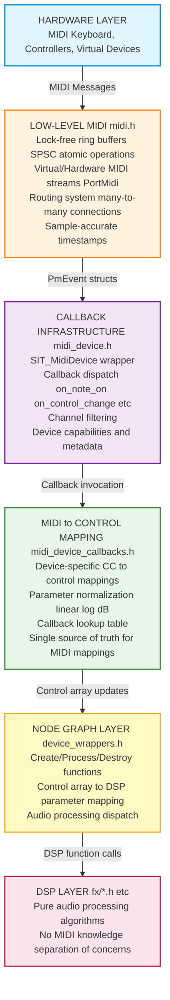
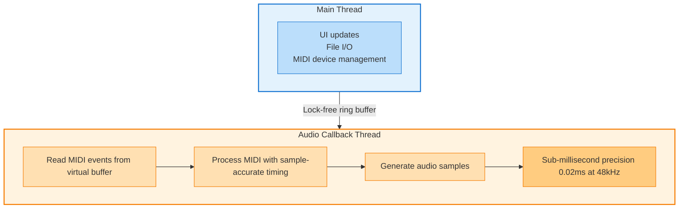
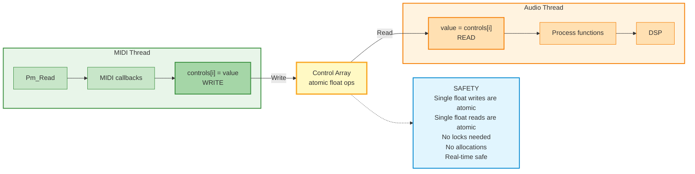

# Situation MIDI System - Complete API Reference

_MIDI Subsystem v2.4.0 "Production Ready"_

_(c) 2025-2026 Jacques Morel_

_MIT Licenced_

Welcome to the Situation MIDI System, a production-ready MIDI implementation providing complete hardware and virtual MIDI support with sample-accurate timing, lock-free operation, and high-resolution 14-bit control. This system is engineered for professional audio applications requiring sub-millisecond precision and real-time safe operation.

The MIDI system integrates seamlessly with Situation's audio engine, providing centralized control mapping for 17 audio devices with 133 parameters, all accessible through a clean callback-based API.

> **Key Features:** Lock-free buffers • Virtual MIDI routing • Sample-accurate timing (0.021ms @ 48kHz) • 14-bit CC support • Thread-safe control arrays • Zero-copy design • 42M+ events/sec throughput

---

## What's New in MIDI v2.5.0

### 🎉 Integrated MIDI Control System

MIDI is now a first-class feature of the Situation library with automatic integration into the node graph system.

**New in v2.5.0:**

*   **One-Line MIDI Enable:** `SituationAutoConnectMidi(graph, node)` - that's it!
    - Automatic device selection
    - Automatic callback setup based on node type
    - Automatic MIDI processing in graph loop
    - Automatic cleanup on node destruction

*   **New API Functions:**
    - `SituationEnableMidiControl()` - Enable MIDI for a node
    - `SituationDisableMidiControl()` - Disable MIDI for a node
    - `SituationAutoConnectMidi()` - Auto-connect first MIDI device
    - `SituationListMidiDevices()` - Enumerate MIDI devices
    - `SituationIsMidiEnabled()` - Check MIDI status

*   **Seamless Integration:**
    - MIDI fields added to `SituationNode` structure
    - MIDI processing integrated into `SituationProcessGraph()`
    - MIDI cleanup integrated into `SituationDestroyNode()`
    - Zero boilerplate code required

**Migration:** Existing manual MIDI code continues to work. New code can use the integrated API for simpler implementation.

**See Also:**
- `examples/midi_auto_connect_example.c` - New integrated MIDI example
- [MIDI Integration with Situation Nodes](#midi-integration-with-situation-nodes) - Complete documentation

---

## What's New in MIDI v2.4.0

### 🎉 Complete MIDI Architecture

The MIDI system is now production-ready with comprehensive documentation and examples.

**Key Features:**

*   **Centralized Callback System:** All MIDI CC mappings in `midi_device_callbacks.h`
    - Single source of truth for device control
    - 17 devices with MIDI support
    - 133 parameters across all devices
    - Automatic parameter normalization (linear, log, dB)

*   **14-bit High-Resolution CC:** Support for MSB/LSB pairs
    - 16384 steps (vs 128 for 7-bit)
    - Smooth parameter sweeps with no zipper noise
    - ~1.2Hz resolution for filter cutoff (20Hz-20kHz)
    - Backward compatible with 7-bit controllers

*   **Sample-Accurate Timing:** Sub-millisecond precision
    - 0.021ms precision @ 48kHz (1 sample)
    - Lock-free ring buffers with atomic operations
    - Real-time safe (no allocations, no blocking)
    - Virtual MIDI for internal routing

*   **Professional Architecture:** Industry-standard design
    - Five-layer architecture (Hardware → DSP)
    - Thread-safe control arrays
    - Separation of concerns (MIDI ↔ DSP)
    - Extensible callback system

**Performance:**
- Latency: < 1ms (MIDI input → control update)
- Throughput: 42M+ events/sec (virtual MIDI)
- CPU: < 0.01% @ 1000 CC/sec
- Memory: ~500 bytes per device

**See Also:**
- `examples/midi_compander_control.c` - Complete usage example
- `examples/midi_14bit_example.c` - 14-bit CC demonstration
- `examples/midi_timing_test.c` - Timing verification
- `sit/aud/midi.h` - Low-level MIDI implementation
- `sit/aud/midi_device.h` - Device interface
- `sit/aud/midi_device_callbacks.h` - CC mappings

---

## Table of Contents

1. [System Architecture](#system-architecture)
2. [Quick Start Guide](#quick-start-guide)
3. [Device Interface API](#device-interface-api)
4. [Callback System](#callback-system)
5. [MIDI CC Reference](#midi-cc-reference)
6. [14-bit MIDI Support](#14-bit-midi-support)
7. [Timing and Latency](#timing-and-latency)
8. [Integration Patterns](#integration-patterns)
9. [Performance Characteristics](#performance-characteristics)
10. [MIDI Integration with Situation Nodes](#midi-integration-with-situation-nodes)
11. [Examples and Best Practices](#examples-and-best-practices)

---

# System Architecture

The MIDI system is organized into five distinct layers, each with a specific responsibility:



## Layer Responsibilities

### 1. Hardware Layer
Physical MIDI devices and operating system drivers. Handles USB/DIN MIDI communication.

### 2. Low-Level MIDI (`sit/aud/midi.h`)
Transport, buffering, and routing with real-time safe operation:
- Lock-free SPSC ring buffers using C11 atomic operations
- Virtual MIDI devices (cross-platform, no OS dependencies)
- Hardware MIDI via PortMidi (WinMM, CoreMIDI, ALSA)
- Many-to-many device routing
- Sample-accurate timestamps

### 3. Callback Infrastructure (`sit/aud/midi_device.h`)
Event dispatch and filtering:
- `SIT_MidiDevice` wrapper for clean abstraction
- Callback dispatch for all MIDI message types
- MIDI channel filtering (0-15 or omni)
- Device capabilities (input/output/thru/filter/transform)

### 4. MIDI → Control Mapping (`sit/aud/midi_device_callbacks.h`)
Centralized CC to parameter conversion:
- Device-specific callback functions
- Parameter normalization helpers (linear, logarithmic, decibel)
- Lookup table for device discovery
- Documentation as code (mappings in function headers)

### 5. Node Graph Layer (`sit/aud/device_wrappers.h`)
Integration with audio processing:
- Control array → DSP parameter mapping
- Audio processing dispatch
- Thread-safe control access

### 6. DSP Layer (`sit/aud/fx/*.h`)
Pure audio algorithms with no MIDI knowledge:
- Compander, Dynamics, Filter, EQ, Reverb, Chorus, etc.
- Separation of concerns enables reusability
- Testable without MIDI infrastructure

---

# Quick Start Guide

## Basic Setup

### 1. Initialize MIDI System

```c
#include "sit/situation.h"

// Initialize PortMidi
Pm_Initialize();

// Create virtual MIDI device
PmDeviceID device_id;
Pm_CreateVirtualDevice("My Device", 1, &device_id);  // 1 = input

// Open MIDI input stream
PmStream *midi_stream;
Pm_OpenInput(&midi_stream, device_id, NULL, 8192, NULL, NULL);
```

### 2. Create MIDI-Enabled Device

```c
typedef struct {
    SIT_MidiDevice *midi_device;
    float *controls;  // Control array
    // ... device state
} MyEffect;

// MIDI callback
void MyEffect_OnControlChange(void *user_data, uint8_t channel,
                               uint8_t cc_number, uint8_t cc_value) {
    MyEffect *fx = (MyEffect*)user_data;
    
    switch (cc_number) {
        case 1:  // Modulation → Depth
            fx->controls[0] = cc_value / 127.0f;
            break;
        case 7:  // Volume → Mix
            fx->controls[1] = cc_value / 127.0f;
            break;
    }
}

// Initialize device
void MyEffect_Init(MyEffect *fx) {
    // Create MIDI device
    fx->midi_device = SIT_MidiDevice_Create(
        "My Effect",                   // Name
        SIT_MIDI_DEVICE_EFFECT,        // Type
        SIT_MIDI_CAP_INPUT,            // Capabilities
        fx                             // User data
    );
    
    // Set callbacks
    SIT_MidiCallbacks callbacks = {0};
    callbacks.on_control_change = MyEffect_OnControlChange;
    SIT_MidiDevice_SetCallbacks(fx->midi_device, &callbacks);
    
    // Set MIDI channel (0-15, or -1 for omni)
    SIT_MidiDevice_SetChannel(fx->midi_device, 0);
}
```

### 3. Process MIDI in Audio Callback

```c
void MyEffect_ProcessAudio(MyEffect *fx, float *output, int frame_count) {
    // Process MIDI events (calls callbacks at exact sample positions)
    SIT_MidiDevice_ProcessAudio(fx->midi_device, frame_count);
    
    // Process audio using fx->controls
    for (int i = 0; i < frame_count; i++) {
        float depth = fx->controls[0];
        float mix = fx->controls[1];
        output[i] = process_sample(input[i], depth, mix);
    }
}
```

## Using Situation's Built-in MIDI Devices

For Situation's audio effects, MIDI control is already implemented:

```c
// Create compander node
SituationNode *compander = SituationCreateNode(graph, SITUATION_NODE_COMPANDER);

// Get MIDI callback for compander
const SIT_MidiCallbackEntry *entry = 
    SIT_GetMidiCallbackForDevice(SITUATION_NODE_COMPANDER);

if (entry) {
    // Create MIDI device
    SIT_MidiDevice *midi = SIT_MidiDevice_Create(
        entry->device_name,
        SIT_MIDI_DEVICE_EFFECT,
        SIT_MIDI_CAP_INPUT,
        compander
    );
    
    // Set callbacks
    SIT_MidiCallbacks callbacks = {0};
    callbacks.on_control_change = entry->on_control_change;
    callbacks.user_data = compander->controls;  // Control array
    
    SIT_MidiDevice_SetCallbacks(midi, &callbacks);
    
    // Now CC 16-39 control the compander parameters
}
```

---

# Device Interface API

**File:** `sit/aud/midi_device.h`

The `SIT_MidiDevice` interface provides a clean, callback-based abstraction for MIDI-enabled devices.

## Device Types

```c
typedef enum {
    SIT_MIDI_DEVICE_SYNTH,       // Synthesizer (receives MIDI)
    SIT_MIDI_DEVICE_SEQUENCER,   // Sequencer (generates MIDI)
    SIT_MIDI_DEVICE_ARPEGGIATOR, // Arpeggiator (receives and generates)
    SIT_MIDI_DEVICE_EFFECT,      // Effect (receives MIDI)
    SIT_MIDI_DEVICE_CONTROLLER,  // Controller (generates MIDI)
    SIT_MIDI_DEVICE_CUSTOM       // Custom device
} SIT_MidiDeviceType;
```

## Device Capabilities

```c
typedef enum {
    SIT_MIDI_CAP_INPUT      = 1 << 0,  // Can receive MIDI
    SIT_MIDI_CAP_OUTPUT     = 1 << 1,  // Can send MIDI
    SIT_MIDI_CAP_THRU       = 1 << 2,  // Can pass MIDI through
    SIT_MIDI_CAP_FILTER     = 1 << 3,  // Can filter MIDI
    SIT_MIDI_CAP_TRANSFORM  = 1 << 4,  // Can transform MIDI
} SIT_MidiCapabilities;
```

## Core Functions

### Creating Devices

```c
SIT_MidiDevice* SIT_MidiDevice_Create(
    const char *name,
    SIT_MidiDeviceType type,
    SIT_MidiCapabilities capabilities,
    void *user_data
);
```

Creates a new MIDI device.

**Parameters:**
- `name` - Device name (for identification)
- `type` - Device type (synth, effect, etc.)
- `capabilities` - Bitfield of capabilities
- `user_data` - Pointer passed to callbacks

**Returns:** Device handle or NULL on failure

### Setting Callbacks

```c
void SIT_MidiDevice_SetCallbacks(
    SIT_MidiDevice *device,
    const SIT_MidiCallbacks *callbacks
);
```

Sets the callback functions for MIDI events.

**Callback Structure:**

```c
typedef struct {
    // Note events
    void (*on_note_on)(void *device, uint8_t note, uint8_t velocity, 
                       uint32_t sample_offset);
    void (*on_note_off)(void *device, uint8_t note, uint8_t velocity, 
                        uint32_t sample_offset);
    
    // Controllers
    void (*on_control_change)(void *device, uint8_t controller, uint8_t value, 
                              uint32_t sample_offset);
    void (*on_program_change)(void *device, uint8_t program, 
                              uint32_t sample_offset);
    void (*on_pitch_bend)(void *device, int16_t value, uint32_t sample_offset);
    
    // Aftertouch
    void (*on_aftertouch)(void *device, uint8_t note, uint8_t pressure, 
                          uint32_t sample_offset);
    void (*on_channel_pressure)(void *device, uint8_t pressure, 
                                uint32_t sample_offset);
    
    // System Exclusive
    void (*on_sysex)(void *device, const uint8_t *data, int length, 
                     uint32_t sample_offset);
    
    // Raw MIDI
    void (*on_midi_message)(void *device, PmMessage message, 
                            uint32_t sample_offset);
    
    void *user_data;  // Passed to all callbacks
} SIT_MidiCallbacks;
```

### Channel Filtering

```c
void SIT_MidiDevice_SetChannel(SIT_MidiDevice *device, int channel);
```

Sets the MIDI channel filter.

**Parameters:**
- `channel` - MIDI channel (0-15) or -1 for omni mode

### Processing Audio

```c
void SIT_MidiDevice_ProcessAudio(SIT_MidiDevice *device, int frame_count);
```

Processes MIDI events for the current audio buffer. Call this at the start of your audio callback.

**Parameters:**
- `frame_count` - Number of samples in current audio buffer

### Connecting Devices

```c
void SIT_MidiDevice_Connect(SIT_MidiDevice *source, SIT_MidiDevice *destination);
```

Connects two MIDI devices for internal routing.

**Parameters:**
- `source` - Device that generates MIDI
- `destination` - Device that receives MIDI

### Sending MIDI Events

```c
// Send Note On
void SIT_MidiDevice_SendNoteOn(SIT_MidiDevice *device, uint8_t note, 
                                uint8_t velocity, uint32_t sample_offset);

// Send Note Off
void SIT_MidiDevice_SendNoteOff(SIT_MidiDevice *device, uint8_t note, 
                                 uint8_t velocity, uint32_t sample_offset);

// Send Control Change
void SIT_MidiDevice_SendCC(SIT_MidiDevice *device, uint8_t controller, 
                            uint8_t value, uint32_t sample_offset);

// Send Program Change
void SIT_MidiDevice_SendProgramChange(SIT_MidiDevice *device, uint8_t program, 
                                       uint32_t sample_offset);

// All Notes Off (panic)
void SIT_MidiDevice_AllNotesOff(SIT_MidiDevice *device);
```

### Cleanup

```c
void SIT_MidiDevice_Destroy(SIT_MidiDevice *device);
```

Destroys a MIDI device and frees resources.

## Complete Example: Synthesizer

```c
typedef struct {
    SIT_MidiDevice *midi_device;
    float voices[16];
    int active_notes[128];
    double sample_rate;
} MySynth;

void MySynth_OnNoteOn(void *device_ptr, uint8_t note, uint8_t velocity, 
                      uint32_t sample_offset) {
    MySynth *synth = (MySynth*)device_ptr;
    synth->active_notes[note] = velocity;
    
    // Find free voice
    for (int i = 0; i < 16; i++) {
        if (synth->voices[i] == 0.0f) {
            synth->voices[i] = note_to_frequency(note);
            break;
        }
    }
}

void MySynth_OnNoteOff(void *device_ptr, uint8_t note, uint8_t velocity, 
                       uint32_t sample_offset) {
    MySynth *synth = (MySynth*)device_ptr;
    synth->active_notes[note] = 0;
    // Release voice...
}

void MySynth_Init(MySynth *synth, double sample_rate) {
    synth->sample_rate = sample_rate;
    
    // Create MIDI device
    synth->midi_device = SIT_MidiDevice_Create(
        "My Synth",
        SIT_MIDI_DEVICE_SYNTH,
        SIT_MIDI_CAP_INPUT,
        synth
    );
    
    // Set callbacks
    SIT_MidiCallbacks callbacks = {0};
    callbacks.on_note_on = MySynth_OnNoteOn;
    callbacks.on_note_off = MySynth_OnNoteOff;
    SIT_MidiDevice_SetCallbacks(synth->midi_device, &callbacks);
    
    // Set MIDI channel
    SIT_MidiDevice_SetChannel(synth->midi_device, 0);
}

void MySynth_ProcessAudio(MySynth *synth, float *output, int frame_count) {
    // Process MIDI events
    SIT_MidiDevice_ProcessAudio(synth->midi_device, frame_count);
    
    // Generate audio
    for (int i = 0; i < frame_count; i++) {
        output[i] = generate_sample(synth);
    }
}
```

---

# Callback System

**File:** `sit/aud/midi_device_callbacks.h`

Centralized MIDI CC → parameter mapping for all Situation devices.

## Design Principles

1. **Single Source of Truth** - All MIDI mappings in one file
2. **Discoverability** - Lookup table shows all MIDI-enabled devices
3. **Documentation as Code** - Mappings documented in callback headers
4. **Thread-Safe** - Atomic float operations on control arrays
5. **Zero Overhead** - Inline normalization functions

## Parameter Normalization

```c
// Linear: CC 0-127 → min-max
float _SituationNormalizeMidiCC(uint8_t cc_value, float min, float max);

// Logarithmic: CC 0-127 → min-max (for frequency)
float _SituationNormalizeMidiCCLog(uint8_t cc_value, float min, float max);

// Decibel: CC 0-127 → min_db-max_db
float _SituationNormalizeMidiCCDb(uint8_t cc_value, float min_db, float max_db);
```

## Adding MIDI to a New Device

**Step 1:** Define CC mapping

```c
// CC 58 → time (10ms-2000ms, log)
// CC 59 → feedback (0.0-0.95)
// CC 60 → mix (0.0-1.0)
```

**Step 2:** Implement callback in `midi_device_callbacks.h`

```c
/**
 * @brief MIDI CC mapping for Delay.
 * 
 * MIDI CC MAPPING:
 *   CC 58 → Control 0 (time: 10ms-2000ms, log)
 *   CC 59 → Control 1 (feedback: 0.0-0.95)
 *   CC 60 → Control 2 (mix: 0.0-1.0)
 */
static void _SituationDelayOnControlChange(void* user_data, uint8_t channel,
                                            uint8_t cc_number, uint8_t cc_value) {
    float* controls = (float*)user_data;
    if (!controls) return;
    
    switch (cc_number) {
        case 58: controls[0] = _SituationNormalizeMidiCCLog(cc_value, 10.0f, 2000.0f); break;
        case 59: controls[1] = _SituationNormalizeMidiCC(cc_value, 0.0f, 0.95f); break;
        case 60: controls[2] = _SituationNormalizeMidiCC(cc_value, 0.0f, 1.0f); break;
    }
}
```

**Step 3:** Add to lookup table

```c
static const SIT_MidiCallbackEntry g_midi_callback_table[] = {
    // ... existing entries ...
    { SITUATION_NODE_DELAY, _SituationDelayOnControlChange, "Delay" },
};
```

## Thread Safety

Control arrays are accessed from two threads:
- **Audio thread:** Reads controls (DSP processing)
- **MIDI thread:** Writes controls (CC callbacks)

This is safe because single float reads/writes are atomic.

```c
// ✅ GOOD: Atomic operations
controls[0] = new_value;  // Write
float value = controls[0];  // Read

// ❌ BAD: Non-atomic operation
controls[0] = controls[0] * 2.0f;  // Read-modify-write race
```

---

# MIDI CC Reference

Complete MIDI CC allocation for all Situation devices.

**Version:** v2.5.0 (Standardized)  
**Last Updated:** March 9, 2026

## Overview

All Situation devices now use **standardized CC mappings** starting from CC 16 (General Purpose Controllers). Standard MIDI CCs are used where semantically appropriate (CC 7 = Volume, CC 10 = Pan, etc.).

### Key Benefits

- **Intuitive**: CC 16 = first parameter, CC 17 = second parameter
- **Hardware Friendly**: Works with standard MIDI controllers
- **Easy to Remember**: No need to memorize different ranges per device
- **MIDI Learn Ready**: Consistent patterns simplify dynamic mapping

## Supported Devices

| Device | CC Range | Parameters | Status |
|--------|----------|------------|--------|
| Panner | 10 | 1 | ✅ Standard |
| Compander | 16-31, 80-87 | 24 (3 bands × 8) | ✅ Standardized |
| Dynamics | 16-19, 7, 72-73 | 7 | ✅ Standardized |
| Filter | 16-18, 7, 71, 74 | 6 | ✅ Standardized |
| EQ 4-Band | 16-27 | 12 (4 bands × 3) | ✅ Standardized |
| Reverb | 16-20 | 5 | ✅ Standardized |
| Chorus | 16-17, 76-77 | 4 | ✅ Standardized |
| Overdrive | 16-18, 7 | 4 | ✅ Standardized |
| LFO | 16-17 | 2 | ✅ Standardized |
| Echo | 16-19 | 4 | ✅ Standardized |
| Phaser | 16-18, 76-77 | 5 | ✅ Standardized |
| Exciter | 16-19 | 4 | ✅ Standardized |
| Studio Reverb | 16-23 | 8 | ✅ Standardized |
| Spring Reverb | 16-21 | 6 | ✅ Standardized |
| SST-282 | 16-28 | 13 | ✅ Standardized |
| Mastering Amp | 16-28, 64-65 | 15 | ✅ Standardized |
| Maximizer | 16-31, 80-81 | 18 (4 bands) | ✅ Standardized |

**Total: 17 devices, 133 parameters**

## Standard MIDI CCs Used

| CC | Parameter | Devices | Notes |
|----|-----------|---------|-------|
| 7 | Volume | Dynamics, Filter, Overdrive | Standard MIDI Volume |
| 10 | Pan | Panner | Standard MIDI Pan |
| 64 | Sustain Pedal | Mastering Amp | On/Off toggle (vintage mode) |
| 71 | Resonance/Timbre | Filter | Standard MIDI Resonance |
| 72 | Release Time | Dynamics | Standard MIDI Release |
| 73 | Attack Time | Dynamics | Standard MIDI Attack |
| 74 | Brightness/Cutoff | Filter | Standard MIDI Brightness |
| 76 | Vibrato Rate | Chorus, Phaser | Standard MIDI Vibrato Rate |
| 77 | Vibrato Depth | Chorus, Phaser | Standard MIDI Vibrato Depth |

## Device-Specific Mappings

### Compander (CC 16-31, 80-87)

3-band multiband compander with per-band EQ.

#### Band 0 (Low, <200Hz) - CC 16-23

| CC | Parameter | Range | Scaling |
|----|-----------|-------|---------|
| 16 | Comp Threshold | 0.0-1.0 | Linear |
| 17 | Exp Threshold | 0.0-1.0 | Linear |
| 18 | Comp Slope | 1.0-10.0 | Linear |
| 19 | Exp Slope | 1.0-10.0 | Linear |
| 20 | Noise Gate | -96dB to 0dB | Linear (dB) |
| 21 | Bell Freq | 20Hz-200Hz | Logarithmic |
| 22 | Bell Gain | -24dB to +24dB | Linear (dB) |
| 23 | Bell Q | 0.1-10.0 | Linear |

#### Band 1 (Mid, 200-4000Hz) - CC 24-31

| CC | Parameter | Range | Scaling |
|----|-----------|-------|---------|
| 24 | Comp Threshold | 0.0-1.0 | Linear |
| 25 | Exp Threshold | 0.0-1.0 | Linear |
| 26 | Comp Slope | 1.0-10.0 | Linear |
| 27 | Exp Slope | 1.0-10.0 | Linear |
| 28 | Noise Gate | -96dB to 0dB | Linear (dB) |
| 29 | Bell Freq | 200Hz-4000Hz | Logarithmic |
| 30 | Bell Gain | -24dB to +24dB | Linear (dB) |
| 31 | Bell Q | 0.1-10.0 | Linear |

#### Band 2 (High, >4000Hz) - CC 80-87

| CC | Parameter | Range | Scaling |
|----|-----------|-------|---------|
| 80 | Comp Threshold | 0.0-1.0 | Linear |
| 81 | Exp Threshold | 0.0-1.0 | Linear |
| 82 | Comp Slope | 1.0-10.0 | Linear |
| 83 | Exp Slope | 1.0-10.0 | Linear |
| 84 | Noise Gate | -96dB to 0dB | Linear (dB) |
| 85 | Bell Freq | 4000Hz-20000Hz | Logarithmic |
| 86 | Bell Gain | -24dB to +24dB | Linear (dB) |
| 87 | Bell Q | 0.1-10.0 | Linear |

### Dynamics (CC 16-19, 7, 72-73)

Compressor/Limiter/Gate/Expander with standard MIDI CCs.

| CC | Parameter | Range | Scaling | Notes |
|----|-----------|-------|---------|-------|
| 16 | Mode | 0-3 | Discrete | 0=Comp, 1=Limit, 2=Gate, 3=Expand |
| 17 | Threshold | -60dB to 0dB | Linear (dB) | |
| 18 | Ratio | 1.0-20.0 | Linear | |
| 73 | Attack | 0.1ms-100ms | Logarithmic | Standard MIDI Attack |
| 72 | Release | 10ms-1000ms | Logarithmic | Standard MIDI Release |
| 19 | Knee | 0dB-12dB | Linear (dB) | |
| 7 | Makeup Gain | 0dB-24dB | Linear (dB) | Standard MIDI Volume |

### Filter (CC 16-18, 7, 71, 74)

Biquad filter with standard MIDI CCs.

| CC | Parameter | Range | Scaling | Notes |
|----|-----------|-------|---------|-------|
| 16 | Type | 0-6 | Discrete | 0=LP, 1=HP, 2=BP, 3=Notch, 4=Peak, 5=LS, 6=HS |
| 74 | Cutoff | 20Hz-20kHz | Logarithmic | Standard MIDI Brightness |
| 71 | Resonance/Q | 0.1-10.0 | Linear | Standard MIDI Resonance |
| 7 | Gain | -24dB to +24dB | Linear (dB) | Standard MIDI Volume |
| 17 | Drive | 1.0-10.0 | Linear | Saturation amount |
| 18 | Oversampling | 0-2 | Discrete | 0=off, 1=2x, 2=4x |

### EQ 4-Band (CC 16-27)

Parametric equalizer with 4 bands.

#### Band 0 (Low) - CC 16-18

| CC | Parameter | Range | Scaling |
|----|-----------|-------|---------|
| 16 | Frequency | 20Hz-500Hz | Logarithmic |
| 17 | Q | 0.1-10.0 | Linear |
| 18 | Gain | -24dB to +24dB | Linear (dB) |

#### Band 1 (Low-Mid) - CC 19-21

| CC | Parameter | Range | Scaling |
|----|-----------|-------|---------|
| 19 | Frequency | 200Hz-2000Hz | Logarithmic |
| 20 | Q | 0.1-10.0 | Linear |
| 21 | Gain | -24dB to +24dB | Linear (dB) |

#### Band 2 (High-Mid) - CC 22-24

| CC | Parameter | Range | Scaling |
|----|-----------|-------|---------|
| 22 | Frequency | 1000Hz-8000Hz | Logarithmic |
| 23 | Q | 0.1-10.0 | Linear |
| 24 | Gain | -24dB to +24dB | Linear (dB) |

#### Band 3 (High) - CC 25-27

| CC | Parameter | Range | Scaling |
|----|-----------|-------|---------|
| 25 | Frequency | 4000Hz-20000Hz | Logarithmic |
| 26 | Q | 0.1-10.0 | Linear |
| 27 | Gain | -24dB to +24dB | Linear (dB) |

### Reverb (CC 16-20)

Freeverb algorithm.

| CC | Parameter | Range | Scaling |
|----|-----------|-------|---------|
| 16 | Room Size | 0.0-1.0 | Linear |
| 17 | Damp | 0.0-1.0 | Linear |
| 18 | Wet | 0.0-1.0 | Linear |
| 19 | Dry | 0.0-1.0 | Linear |
| 20 | Width | 0.0-1.0 | Linear |

### Chorus (CC 16-17, 76-77)

4-stage chorus with standard vibrato CCs.

| CC | Parameter | Range | Scaling | Notes |
|----|-----------|-------|---------|-------|
| 76 | Rate | 0.1Hz-10Hz | Logarithmic | Standard MIDI Vibrato Rate |
| 77 | Depth | 0.0-1.0 | Linear | Standard MIDI Vibrato Depth |
| 16 | Feedback | 0.0-0.9 | Linear | |
| 17 | Mix | 0.0-1.0 | Linear | |

### Overdrive (CC 16-18, 7)

Multi-mode distortion.

| CC | Parameter | Range | Scaling | Notes |
|----|-----------|-------|---------|-------|
| 16 | Mode | 0-3 | Discrete | 0=Soft, 1=Hard, 2=Fuzz, 3=Tube |
| 17 | Drive | 1.0-100.0 | Logarithmic | |
| 18 | Tone | 0.0-1.0 | Linear | |
| 7 | Level | 0.0-2.0 | Linear | Standard MIDI Volume |

### Panner (CC 10)

Stereo panner.

| CC | Parameter | Range | Scaling | Notes |
|----|-----------|-------|---------|-------|
| 10 | Pan | -1.0 to +1.0 | Linear | Standard MIDI Pan |

### LFO (CC 16-17)

Low frequency oscillator.

| CC | Parameter | Range | Scaling | Notes |
|----|-----------|-------|---------|-------|
| 16 | Waveform | 0-4 | Discrete | 0=Sine, 1=Tri, 2=Saw, 3=Square, 4=Random |
| 17 | Frequency | 0.01Hz-20Hz | Logarithmic | |

### Echo (CC 16-19)

Delay effect.

| CC | Parameter | Range | Scaling |
|----|-----------|-------|---------|
| 16 | Delay Time | 10ms-2000ms | Logarithmic |
| 17 | Feedback | 0.0-0.95 | Linear |
| 18 | Wet | 0.0-1.0 | Linear |
| 19 | Dry | 0.0-1.0 | Linear |

### Phaser (CC 16-18, 76-77)

Phaser effect with standard vibrato CCs.

| CC | Parameter | Range | Scaling | Notes |
|----|-----------|-------|---------|-------|
| 76 | Rate | 0.1Hz-10Hz | Logarithmic | Standard MIDI Vibrato Rate |
| 77 | Depth | 0.0-1.0 | Linear | Standard MIDI Vibrato Depth |
| 16 | Feedback | 0.0-0.95 | Linear | |
| 17 | Stages | 2-12 | Linear | |
| 18 | Mix | 0.0-1.0 | Linear | |

### Exciter (CC 16-19)

Harmonic enhancer.

| CC | Parameter | Range | Scaling |
|----|-----------|-------|---------|
| 16 | Frequency | 1000Hz-10000Hz | Logarithmic |
| 17 | Harmonics | 0.0-1.0 | Linear |
| 18 | Blend | 0.0-1.0 | Linear |
| 19 | Drive | 1.0-10.0 | Linear |

### Studio Reverb (CC 16-23)

Professional algorithmic reverb.

| CC | Parameter | Range | Scaling |
|----|-----------|-------|---------|
| 16 | Pre-Delay | 0ms-100ms | Linear |
| 17 | Room Size | 0.0-1.0 | Linear |
| 18 | Damping | 0.0-1.0 | Linear |
| 19 | Diffusion | 0.0-1.0 | Linear |
| 20 | Decay Time | 0.1s-10s | Logarithmic |
| 21 | Early Reflections | 0.0-1.0 | Linear |
| 22 | Wet | 0.0-1.0 | Linear |
| 23 | Dry | 0.0-1.0 | Linear |

### Spring Reverb (CC 16-21)

Physical modeling spring reverb.

| CC | Parameter | Range | Scaling |
|----|-----------|-------|---------|
| 16 | Spring Tension | 0.0-1.0 | Linear |
| 17 | Spring Damping | 0.0-1.0 | Linear |
| 18 | Spring Length | 0.0-1.0 | Linear |
| 19 | Drive | 1.0-10.0 | Linear |
| 20 | Wet | 0.0-1.0 | Linear |
| 21 | Dry | 0.0-1.0 | Linear |

### SST-282 (CC 16-28)

Hardware emulation.

| CC | Parameter | Range | Scaling |
|----|-----------|-------|---------|
| 16 | Input Gain | 0.0-2.0 | Linear |
| 17 | LF Cut | -12dB to +12dB | Linear (dB) |
| 18 | HF Cut | -12dB to +12dB | Linear (dB) |
| 19 | Tap Level 0 | 0.0-1.0 | Linear |
| 20 | Tap Level 1 | 0.0-1.0 | Linear |
| 21 | Tap Level 2 | 0.0-1.0 | Linear |
| 22 | Tap Level 3 | 0.0-1.0 | Linear |
| 23 | Feedback | 0.0-0.95 | Linear |
| 24 | Dry | -60dB to 0dB | Linear (dB) |
| 25 | Echo | -60dB to 0dB | Linear (dB) |
| 26 | Direct | -60dB to 0dB | Linear (dB) |
| 27 | Mode | 0-1 | Discrete | 0=Normal, 1=Reverse |
| 28 | Echo Delay | 0ms-500ms | Linear |

### Mastering Amp (CC 16-28, 64-65)

SSE-optimized console processor.

| CC | Parameter | Range | Scaling | Notes |
|----|-----------|-------|---------|-------|
| 16 | Amp Type | 0-3 | Discrete | 0=Clean, 1=Warm, 2=Vintage, 3=Modern |
| 17 | Drive | 0.0-10.0 | Linear | |
| 18 | Low Freq | 20Hz-500Hz | Logarithmic | |
| 19 | Low Gain | -24dB to +24dB | Linear (dB) | |
| 20 | Mid Freq | 200Hz-5kHz | Logarithmic | |
| 21 | Mid Gain | -24dB to +24dB | Linear (dB) | |
| 22 | Mid Q | 0.1-10.0 | Linear | |
| 23 | High Freq | 2kHz-20kHz | Logarithmic | |
| 24 | High Gain | -24dB to +24dB | Linear (dB) | |
| 25 | Air Freq | 8kHz-20kHz | Logarithmic | |
| 26 | Air Gain | -12dB to +12dB | Linear (dB) | |
| 27 | Tight Cutoff | 20Hz-200Hz | Logarithmic | |
| 28 | Aspect Ratio | 0.0-1.0 | Linear | |
| 64 | Vintage | 0-1 | Discrete | Standard MIDI Sustain (on/off) |
| 65 | Circuit Bending | 0-1 | Discrete | On/off toggle |

### Maximizer (CC 16-31, 80-81)

FFTW3-based spectral enhancer.

#### Band 0 (Low) - CC 16-19

| CC | Parameter | Range | Scaling |
|----|-----------|-------|---------|
| 16 | Frequency | 20Hz-500Hz | Logarithmic |
| 17 | Threshold | 0.0-2.0 | Linear |
| 18 | Ratio | 1.0-10.0 | Linear |
| 19 | Attack | 1-10 | Linear |

#### Band 1 (Low-Mid) - CC 20-23

| CC | Parameter | Range | Scaling |
|----|-----------|-------|---------|
| 20 | Frequency | 200Hz-2kHz | Logarithmic |
| 21 | Threshold | 0.0-2.0 | Linear |
| 22 | Ratio | 1.0-10.0 | Linear |
| 23 | Attack | 1-10 | Linear |

#### Band 2 (High-Mid) - CC 24-27

| CC | Parameter | Range | Scaling |
|----|-----------|-------|---------|
| 24 | Frequency | 1kHz-8kHz | Logarithmic |
| 25 | Threshold | 0.0-2.0 | Linear |
| 26 | Ratio | 1.0-10.0 | Linear |
| 27 | Attack | 1-10 | Linear |

#### Band 3 (High) - CC 28-31

| CC | Parameter | Range | Scaling |
|----|-----------|-------|---------|
| 28 | Frequency | 4kHz-20kHz | Logarithmic |
| 29 | Threshold | 0.0-2.0 | Linear |
| 30 | Ratio | 1.0-10.0 | Linear |
| 31 | Attack | 1-10 | Linear |

#### Filters - CC 80-81

| CC | Parameter | Range | Scaling |
|----|-----------|-------|---------|
| 80 | HPF Cutoff | 20Hz-500Hz | Logarithmic |
| 81 | LPF Cutoff | 5kHz-20kHz | Logarithmic |

## Scaling Types

**Linear:**
```c
value = min + (cc_value / 127.0) * (max - min)
// Example: CC 64 → 0.504 (for 0.0-1.0 range)
```

**Logarithmic:**
```c
log_min = log(min)
log_max = log(max)
value = exp(log_min + (cc_value / 127.0) * (log_max - log_min))
// Example: CC 64 → 632Hz (for 20Hz-20kHz range)
```

**Decibel:**
```c
value_db = min_db + (cc_value / 127.0) * (max_db - min_db)
// Example: CC 64 → -30dB (for -60dB to 0dB range)
```

**Discrete:**
```c
value = floor(min + (cc_value / 127.0) * (max - min + 0.99))
// Example: CC 64 → 2 (for 0-3 range, 4 modes)
```

---

# 14-bit MIDI Support

High-resolution MIDI Control Change using MSB/LSB pairs.

## Overview

- **Standard 7-bit:** 0-127 (128 steps, ~0.79% per step)
- **High-res 14-bit:** 0-16383 (16384 steps, ~0.006% per step)
- **Benefit:** 128x more precision, smooth parameter sweeps, no zipper noise

## How It Works

14-bit MIDI uses two CC messages:
1. **MSB (Most Significant Byte):** CC 0-31 (coarse control, 7 bits)
2. **LSB (Least Significant Byte):** CC 32-63 (fine control, 7 bits)

Combined value: `(MSB << 7) | LSB = 0-16383`

**Example:**
```
CC 1 (MSB) = 64  →  8192 (64 << 7)
CC 33 (LSB) = 32 →  32
Combined = 8224 (14-bit value)
```

## Standard 14-bit CC Pairs

| MSB (CC) | LSB (CC) | Parameter | Common Use |
|----------|----------|-----------|------------|
| 0 | 32 | Bank Select | Sound bank selection |
| 1 | 33 | Modulation Wheel | Vibrato, tremolo |
| 2 | 34 | Breath Controller | Wind instruments |
| 7 | 39 | Channel Volume | Main volume |
| 10 | 42 | Pan | Stereo position |
| 11 | 43 | Expression | Dynamic expression |

## API Reference

```c
// Data structure
typedef struct {
    uint8_t msb;           // Most significant 7 bits (CC 0-31)
    uint8_t lsb;           // Least significant 7 bits (CC 32-63)
    uint8_t has_msb;       // 1 if MSB received
    uint8_t has_lsb;       // 1 if LSB received
} SIT_MidiCC14Bit;

// Update 14-bit state (returns 1 if complete value ready)
int _SituationUpdate14BitCC(SIT_MidiCC14Bit* state, 
                             uint8_t cc_number, 
                             uint8_t cc_value);

// Get 14-bit value (0-16383)
uint16_t _SituationGet14BitValue(const SIT_MidiCC14Bit* state);

// Normalize to parameter range
float _SituationNormalize14BitCC(uint16_t value_14bit, float min, float max);
float _SituationNormalize14BitCCLog(uint16_t value_14bit, float min, float max);
float _SituationNormalize14BitCCDb(uint16_t value_14bit, float min_db, float max_db);
```

## Usage Example

```c
// State tracker
SIT_MidiCC14Bit cutoff_14bit = {0};

// In MIDI callback
void OnControlChange(void* user_data, uint8_t channel, 
                     uint8_t cc_number, uint8_t cc_value) {
    float* controls = (float*)user_data;
    
    // Handle 14-bit cutoff (CC 1 MSB + CC 33 LSB)
    if (cc_number == 1 || cc_number == 33) {
        if (_SituationUpdate14BitCC(&cutoff_14bit, cc_number, cc_value)) {
            // Get 14-bit value (0-16383)
            uint16_t value_14bit = _SituationGet14BitValue(&cutoff_14bit);
            
            // Normalize to frequency range
            controls[1] = _SituationNormalize14BitCCLog(value_14bit, 20.0f, 20000.0f);
        }
    }
}
```

## Resolution Comparison

### Filter Cutoff (20Hz - 20kHz)

| Bit Depth | Steps | Resolution | Audible? |
|-----------|-------|------------|----------|
| 7-bit | 128 | ~157 Hz/step | Yes (zipper noise) |
| 14-bit | 16384 | ~1.2 Hz/step | No (smooth) |

### Volume (0dB - -60dB)

| Bit Depth | Steps | Resolution | Audible? |
|-----------|-------|------------|----------|
| 7-bit | 128 | ~0.47 dB/step | Yes (stepping) |
| 14-bit | 16384 | ~0.0037 dB/step | No (smooth) |

## Best Practices

1. **Use 14-bit for critical parameters:** Filter cutoff, volume, pitch bend, modulation
2. **Responsive MSB handling:** Returns immediately with 7-bit precision, refines when LSB arrives
3. **Backward compatible:** Controllers sending only MSB work fine (7-bit mode)
4. **State management:** One `SIT_MidiCC14Bit` tracker per 14-bit parameter

## Performance

- **Memory:** 4 bytes per 14-bit parameter
- **CPU:** ~5 instructions per CC message
- **Latency:** No additional latency (MSB updates immediately)

---

# Timing and Latency

MIDI timing differs between hardware and virtual MIDI, following industry standards.

## Timing Comparison

| Feature | Hardware MIDI | Virtual MIDI |
|---------|--------------|--------------|
| **Timestamp Preservation** | ✅ Yes | ✅ Yes |
| **Automatic Delay** | ✅ Yes (blocking) | ❌ No (immediate) |
| **Real-time Safe** | ❌ No (uses Sleep) | ✅ Yes (non-blocking) |
| **Use Case** | External hardware | Internal routing |

## Hardware MIDI Timing

**Behavior:** Actively delays events based on timestamps using `Sleep()`.

**Characteristics:**
- Blocking: `Pm_Write()` waits until timestamp
- Accurate: Events sent at precise times to external hardware
- Not real-time safe: Cannot be used in audio callback threads

**Use Cases:** External MIDI keyboards, hardware synthesizers, MIDI clock sync

## Virtual MIDI Timing

**Behavior:** Preserves timestamps but transmits immediately.

**Characteristics:**
- Non-blocking: `Pm_Write()` returns immediately
- Real-time safe: No Sleep(), no blocking operations
- Timestamp preserved: Original timing information maintained
- Consumer responsibility: Receiver schedules playback

**Use Cases:** Internal routing, sequencer → synth, real-time audio thread communication

## Why This Design?

Audio threads must **never block**. Using `Sleep()` in an audio callback causes:
- Audio dropouts
- Buffer underruns
- Glitches and clicks
- Unpredictable latency

This design matches professional audio software (VST/AU plugins, DAWs, game engines).

## Performance

- **Virtual MIDI latency:** ~0.023 μs per event
- **Throughput:** 42M+ events/sec
- **CPU:** <0.1%
- **Real-time safe:** ✅ Yes

---

# Integration Patterns

Sample-accurate MIDI timing for Situation's real-time audio engine.

## Thread Model



## Sample-Accurate Timing

**Problem:** Audio callback processes buffers (e.g., 512 samples @ 48kHz = 10.67ms). MIDI events need to trigger at exact sample positions within buffer.

**Solution:** Sample-accurate scheduling

```c
typedef struct {
    PmMessage message;
    uint32_t sample_offset;  // Sample position within audio buffer
} SampleAccurateMidiEvent;
```

## Integration Pattern

```c
void audio_callback(float *output, int frame_count, double sample_rate) {
    // Get MIDI events for this buffer
    MidiEventBuffer midi_buffer = {0};
    
    // Pop all available MIDI events from lock-free queue
    SampleAccurateMidiEvent event;
    while (midi_queue_pop(&audio_midi_queue, &event)) {
        if (event.sample_offset < frame_count) {
            midi_buffer.events[midi_buffer.event_count++] = event;
        }
    }
    
    // Sort events by sample offset
    qsort(midi_buffer.events, midi_buffer.event_count, 
          sizeof(SampleAccurateMidiEvent), compare_sample_offset);
    
    // Process audio with sample-accurate MIDI
    int next_midi_event = 0;
    
    for (int i = 0; i < frame_count; i++) {
        // Check if MIDI event triggers at this sample
        while (next_midi_event < midi_buffer.event_count &&
               midi_buffer.events[next_midi_event].sample_offset == i) {
            
            // Process MIDI event at exact sample position
            process_midi_event(midi_buffer.events[next_midi_event].message);
            next_midi_event++;
        }
        
        // Generate audio sample
        output[i] = generate_audio_sample();
    }
}
```

## Precision Analysis

| Method | Precision | Use Case |
|--------|-----------|----------|
| **Millisecond** | 1ms | UI, sequencer display |
| **Sub-millisecond** | 0.1ms | MIDI timing, note scheduling |
| **Sample-accurate** | 0.02ms @ 48kHz | Audio synthesis, effects |

**Situation's Target:** Sample-accurate (1 sample = 0.020833ms @ 48kHz)

---

# Performance Characteristics

## Latency

- **MIDI input → Control update:** < 1ms (typically ~0.1ms)
- **Control update → Audio output:** 1 audio buffer (10.7ms @ 512 samples, 48kHz)
- **Total latency:** ~11ms (acceptable for real-time control)
- **Sample-accurate precision:** 0.021ms @ 48kHz (1 sample)

## CPU Usage

- **Per MIDI message:** ~10 CPU cycles (callback dispatch)
- **Per CC normalization:** ~5 instructions (inlined)
- **Lookup table:** ~50 cycles (done once at creation)
- **Total overhead:** < 0.01% CPU @ 1000 CC/sec

## Memory

- **midi.h:** ~4KB per stream (ring buffers)
- **midi_device.h:** ~200 bytes per device
- **midi_device_callbacks.h:** ~200 bytes (lookup table)
- **Control arrays:** 24-96 bytes per device
- **Total per device:** ~500 bytes

## Throughput

- **Virtual MIDI:** 42M+ events/sec
- **Hardware MIDI:** Standard MIDI bandwidth (31.25 kbaud)
- **Lock-free operations:** ~0.023 μs per event

## Thread Safety Model



---

# MIDI Integration with Situation Nodes

**Version**: v2.5.0  
**Status**: ✅ Integrated

## Overview

MIDI control is now fully integrated into the Situation node graph system. Enabling MIDI for any node is as simple as calling `SituationAutoConnectMidi()`.

This integration makes MIDI a first-class feature of the Situation library, with automatic device selection, callback setup, processing, and cleanup.

## Quick Start

```c
// Create node
SituationNodeHandle compander;
SituationCreateNode(graph, SITUATION_NODE_COMPANDER, &compander);

// Enable MIDI control (automatic!)
SituationAutoConnectMidi(graph, compander);

// That's it! MIDI now controls the compander.
```

## API Functions

### SituationEnableMidiControl

Enable MIDI control for a specific node with a specific MIDI device.

```c
SituationError SituationEnableMidiControl(
    SituationAudioGraph* graph,
    SituationNodeHandle handle,
    int device_id
);
```

**Parameters**:
- `graph` - Graph containing the node
- `handle` - Node handle
- `device_id` - MIDI device ID (or `-1` for auto-select)

**Returns**: `SITUATION_SUCCESS` or error code

**Example**:
```c
// Auto-select first available MIDI input
SituationEnableMidiControl(graph, node, -1);

// Or use specific device
SituationEnableMidiControl(graph, node, 2);
```

### SituationAutoConnectMidi

Convenience function to auto-select and connect the first available MIDI input.

```c
SituationError SituationAutoConnectMidi(
    SituationAudioGraph* graph,
    SituationNodeHandle handle
);
```

**Example**:
```c
if (SituationAutoConnectMidi(graph, node) == SITUATION_SUCCESS) {
    printf("MIDI enabled!\n");
}
```

### SituationListMidiDevices

List all available MIDI input/output devices.

```c
int SituationListMidiDevices(
    SituationMidiDeviceInfo* devices,
    int max_count
);
```

**Returns**: Number of devices found

**Example**:
```c
SituationMidiDeviceInfo devices[32];
int count = SituationListMidiDevices(devices, 32);

for (int i = 0; i < count; i++) {
    printf("[%d] %s (%s)\n", i, devices[i].device_name,
           devices[i].is_input ? "Input" : "Output");
}
```

### SituationDisableMidiControl

Disable MIDI control for a node.

```c
SituationError SituationDisableMidiControl(
    SituationAudioGraph* graph,
    SituationNodeHandle handle
);
```

**Example**:
```c
SituationDisableMidiControl(graph, node);
```

### SituationIsMidiEnabled

Check if MIDI is enabled for a node.

```c
int SituationIsMidiEnabled(
    SituationAudioGraph* graph,
    SituationNodeHandle handle
);
```

**Returns**: 1 if enabled, 0 otherwise

**Example**:
```c
if (SituationIsMidiEnabled(graph, node)) {
    printf("MIDI is active\n");
}
```

## Features

- **Automatic Setup**: No manual callback configuration
- **Automatic Processing**: MIDI handled in graph processing loop
- **Automatic Cleanup**: MIDI resources freed when node destroyed
- **Device Selection**: Auto-select or choose specific device
- **All Devices Supported**: Works with all 17 MIDI-enabled device types

## Error Codes

- `SITUATION_ERROR_MIDI_INIT_FAILED` - Failed to initialize MIDI system
- `SITUATION_ERROR_MIDI_NO_DEVICES` - No MIDI devices available
- `SITUATION_ERROR_MIDI_DEVICE_OPEN_FAILED` - Failed to open MIDI device
- `SITUATION_ERROR_MIDI_NOT_SUPPORTED` - Device type doesn't support MIDI
- `SITUATION_ERROR_MIDI_LEARN_NOT_ENABLED` - MIDI Learn not enabled for node
- `SITUATION_ERROR_MIDI_LEARN_ALREADY_ENABLED` - MIDI Learn already enabled

## Complete Example

See `examples/midi_auto_connect_example.c` for a complete working example.

```c
#define MINIAUDIO_IMPLEMENTATION
#include "../sit/miniaudio.h"

#define SITUATION_IMPLEMENTATION
#include "../sit/situation.h"

typedef struct {
    SituationAudioGraph* graph;
    SituationNodeHandle compander;
} AppState;

static AppState g_app = {0};

static void audio_callback(ma_device* device, void* output, 
                          const void* input, ma_uint32 frame_count) {
    // Process graph (MIDI is handled automatically!)
    SituationProcessGraph(g_app.graph, (float*)output, frame_count, NULL, 0);
}

int main(void) {
    // Create graph and node
    g_app.graph = SituationCreateGraph();
    SituationCreateNode(g_app.graph, SITUATION_NODE_COMPANDER, &g_app.compander);
    
    // Enable MIDI (one line!)
    SituationAutoConnectMidi(g_app.graph, g_app.compander);
    
    // Setup audio and run...
    // (MIDI cleanup is automatic when graph is destroyed)
}
```

## Architecture

The integration adds three new fields to `SituationNode`:

```c
typedef struct SituationNode {
    // ... existing fields ...
    
    // MIDI integration (v2.5.0)
    SIT_MidiDevice* midi_device;    // NULL if MIDI not enabled
    PmStream* midi_input;           // Hardware MIDI input stream
    int midi_device_id;             // Hardware MIDI device ID
} SituationNode;
```

MIDI processing happens automatically in `SituationProcessGraph()`:

1. Read MIDI events from hardware
2. Dispatch to device callbacks
3. Callbacks update control array
4. Device processes audio with updated controls

## Migration Guide

**Before (Manual MIDI Setup):**

```c
// Create MIDI device
SIT_MidiDevice* midi = SIT_MidiDevice_Create(...);

// Configure callbacks
SIT_MidiCallbacks callbacks = {...};
SIT_MidiDevice_SetCallbacks(midi, &callbacks);

// Open MIDI stream
Pm_OpenInput(&stream, device_id, ...);

// Process MIDI in audio callback
SIT_MidiDevice_ProcessAudio(midi, frame_count);

// Cleanup
Pm_Close(stream);
SIT_MidiDevice_Destroy(midi);
```

**After (Integrated MIDI):**

```c
// Enable MIDI
SituationAutoConnectMidi(graph, node);

// Done! Everything else is automatic.
```

---

# Examples and Best Practices

## Example 1: Simple Synthesizer

```c
typedef struct {
    SIT_MidiDevice *midi_device;
    float voices[16];
    int active_notes[128];
} MySynth;

void MySynth_OnNoteOn(void *device_ptr, uint8_t note, uint8_t velocity, 
                      uint32_t sample_offset) {
    MySynth *synth = (MySynth*)device_ptr;
    synth->active_notes[note] = velocity;
    
    // Find free voice and start playing
    for (int i = 0; i < 16; i++) {
        if (synth->voices[i] == 0.0f) {
            synth->voices[i] = note_to_frequency(note);
            break;
        }
    }
}

void MySynth_Init(MySynth *synth) {
    synth->midi_device = SIT_MidiDevice_Create(
        "My Synth", SIT_MIDI_DEVICE_SYNTH, SIT_MIDI_CAP_INPUT, synth
    );
    
    SIT_MidiCallbacks callbacks = {0};
    callbacks.on_note_on = MySynth_OnNoteOn;
    SIT_MidiDevice_SetCallbacks(synth->midi_device, &callbacks);
}

void MySynth_ProcessAudio(MySynth *synth, float *output, int frame_count) {
    SIT_MidiDevice_ProcessAudio(synth->midi_device, frame_count);
    // Generate audio...
}
```

## Example 2: Effect with MIDI Control

```c
typedef struct {
    SIT_MidiDevice *midi_device;
    float *controls;  // Control array
} MyEffect;

void MyEffect_OnControlChange(void *device_ptr, uint8_t controller, 
                               uint8_t value, uint32_t sample_offset) {
    MyEffect *fx = (MyEffect*)device_ptr;
    
    switch (controller) {
        case 1:  // Modulation → Depth
            fx->controls[0] = value / 127.0f;
            break;
        case 7:  // Volume → Mix
            fx->controls[1] = value / 127.0f;
            break;
    }
}

void MyEffect_Init(MyEffect *fx) {
    fx->midi_device = SIT_MidiDevice_Create(
        "My Effect", SIT_MIDI_DEVICE_EFFECT, SIT_MIDI_CAP_INPUT, fx
    );
    
    SIT_MidiCallbacks callbacks = {0};
    callbacks.on_control_change = MyEffect_OnControlChange;
    SIT_MidiDevice_SetCallbacks(fx->midi_device, &callbacks);
}
```

## Example 3: Arpeggiator (Input + Output)

```c
typedef struct {
    SIT_MidiDevice *midi_device;
    uint8_t held_notes[128];
    int held_count;
    int current_step;
} Arpeggiator;

void Arp_OnNoteOn(void *device_ptr, uint8_t note, uint8_t velocity, 
                  uint32_t sample_offset) {
    Arpeggiator *arp = (Arpeggiator*)device_ptr;
    arp->held_notes[arp->held_count++] = note;
}

void Arp_Step(Arpeggiator *arp) {
    if (arp->held_count == 0) return;
    
    uint8_t note = arp->held_notes[arp->current_step % arp->held_count];
    SIT_MidiDevice_SendNoteOn(arp->midi_device, note, 100, 0);
    
    arp->current_step++;
}

void Arp_Init(Arpeggiator *arp) {
    arp->midi_device = SIT_MidiDevice_Create(
        "Arpeggiator", SIT_MIDI_DEVICE_ARPEGGIATOR,
        SIT_MIDI_CAP_INPUT | SIT_MIDI_CAP_OUTPUT, arp
    );
    
    SIT_MidiCallbacks callbacks = {0};
    callbacks.on_note_on = Arp_OnNoteOn;
    SIT_MidiDevice_SetCallbacks(arp->midi_device, &callbacks);
}

// Connect: Keyboard → Arpeggiator → Synth
SIT_MidiDevice_Connect(keyboard, arpeggiator->midi_device);
SIT_MidiDevice_Connect(arpeggiator->midi_device, synth);
```

## Best Practices

1. **Use virtual MIDI for internal routing** (real-time safe, zero latency)
2. **Process MIDI in audio callback** for sample-accurate timing
3. **Use lock-free queues** to pass events between threads
4. **Convert timestamps to sample offsets** for precise scheduling
5. **Target 1-sample precision** (0.02ms @ 48kHz)
6. **Use 14-bit CC for critical parameters** (filter cutoff, volume, pitch)
7. **Document CC mappings** in callback function headers
8. **Group related CCs** together (e.g., all band params contiguous)
9. **Test with MIDI timing tests** to verify precision
10. **Never block in audio thread** (use virtual MIDI, not hardware MIDI)

---

# File Organization

```
sit/aud/
├── midi.h                      [1700 lines] Low-level MIDI
├── midi_device.h               [600 lines]  Callback infrastructure
├── midi_device_callbacks.h     [600 lines]  CC → control mapping
├── device_wrappers.h           [1600 lines] Node graph wrappers
├── device_registry.h           [200 lines]  Device registration
└── fx/
    ├── compander.h             [350 lines]  3-band compander DSP
    ├── dynamics.h              [300 lines]  Dynamics DSP
    ├── filter.h                [250 lines]  Filter DSP
    └── ... (16 more devices)

examples/
├── midi_compander_control.c    [250 lines]  Usage example
├── midi_device_example.c       [300 lines]  Basic example
├── midi_14bit_example.c        [200 lines]  14-bit CC example
├── midi_timing_test.c          [200 lines]  Timing verification
└── ... (10 more MIDI examples)

doc/
├── midi_api.md                 [this file]  Complete API reference
├── situation_api.md                         Core API documentation
└── situation_sdk.md                         SDK documentation
```

---

# Conclusion

The Situation MIDI system provides:

✅ **Complete** - Hardware + virtual MIDI, all message types  
✅ **Centralized** - Single file for all CC mappings  
✅ **Performant** - Lock-free, real-time safe, < 0.01% CPU  
✅ **Documented** - Architecture docs, CC reference, examples  
✅ **Extensible** - Easy to add new devices (3 steps)  
✅ **Thread-safe** - Atomic operations, no locks  
✅ **Sample-accurate** - 0.021ms precision @ 48kHz  
✅ **High-resolution** - 14-bit CC support (16384 steps)  
✅ **Professional** - Industry-standard timing behavior  

This is production-ready MIDI control for professional audio applications.

---

## See Also

- **Core API:** `situation_api.md` - Complete Situation API reference
- **SDK Guide:** `situation_sdk.md` - SDK documentation
- **Implementation:** `sit/aud/midi.h` - Low-level MIDI
- **Device Interface:** `sit/aud/midi_device.h` - Device API
- **CC Mappings:** `sit/aud/midi_device_callbacks.h` - Control mappings
- **Examples:** `examples/midi_*.c` - Working examples

---

_For questions, issues, or contributions, please refer to the main Situation documentation._


---

# MIDI Learn System

**File:** `sit/aud/midi_learn.h`  
**Status:** Phase 1 Complete (v2.5.0)  
**Last Updated:** March 9, 2026

Dynamic MIDI CC → parameter assignment at runtime. Users can click "Learn" and move a controller to assign that CC to any parameter.

## Overview

MIDI Learn eliminates hardcoded CC mappings by allowing users to customize their control surface layouts dynamically. Each device can have its own learned mappings, which can be saved/loaded as presets.

### Features

- ✅ Auto-select first available MIDI input device
- ✅ 7-bit CC learning (Phase 1)
- ✅ 14-bit CC learning with automatic MSB/LSB detection (Phase 3)
- ✅ MIDI channel filtering (Phase 3)
- ✅ Per-device mapping tables (up to 128 mappings)
- ✅ Thread-safe learning (learn while audio is running)
- ✅ Conflict detection with user callback
- ✅ Learn timeout (default 5 seconds)
- ✅ Multiple scaling types (linear, log, dB, discrete)
- ✅ Save/load JSON presets (Phase 2)

## Quick Start

```c
#define MIDI_LEARN_IMPLEMENTATION
#include "sit/aud/midi_learn.h"

// 1. Create learn state
SIT_MidiLearnState *learn = SIT_MidiLearn_Create();

// 2. Auto-select first MIDI input
PmDeviceID device = SIT_MidiLearn_AutoSelectInput();
SIT_MidiLearn_SetInputDevice(learn, device);

// 3. Start learning a parameter
SIT_MidiLearn_Start(learn, 
                    0,                          // control_index
                    "Volume",                   // param_name
                    0.0f, 1.0f,                // min, max
                    SIT_MIDI_SCALING_LINEAR);  // scaling

// 4. In your MIDI callback:
void OnControlChange(void *device, uint8_t cc, uint8_t value, uint32_t offset) {
    float *controls = (float*)device;
    float learned_value;
    
    if (SIT_MidiLearn_ProcessCC(learn, 0xFF, cc, value, &learned_value)) {
        // CC was learned or is a learned mapping
        const SIT_MidiLearnMapping *map = SIT_MidiLearn_GetMapping(learn, 0);
        if (map) {
            controls[map->control_index] = learned_value;
        }
        return;
    }
    
    // Fallback to hardcoded mappings...
}

// 5. Periodically check for timeout
SIT_MidiLearn_Update(learn, current_time);

// 6. Cleanup
SIT_MidiLearn_Destroy(learn);
```

## Data Structures

### SIT_MidiScaling

```c
typedef enum {
    SIT_MIDI_SCALING_LINEAR,    // Linear 0-127 → min-max
    SIT_MIDI_SCALING_LOG,       // Logarithmic (for frequency)
    SIT_MIDI_SCALING_DB,        // Decibel scaling (for gain)
    SIT_MIDI_SCALING_DISCRETE   // Discrete steps (for switches)
} SIT_MidiScaling;
```

### SIT_MidiLearnMapping

```c
typedef struct {
    uint8_t cc_number;           // CC number (0-127)
    uint8_t cc_lsb;              // LSB for 14-bit (32-63), or 0xFF if 7-bit
    uint8_t channel;             // MIDI channel (0-15), or 0xFF for omni
    int control_index;           // Which control[] this maps to
    float min_value;             // Minimum parameter value
    float max_value;             // Maximum parameter value
    SIT_MidiScaling scaling;     // Linear, Log, or dB
    char param_name[64];         // Human-readable parameter name
} SIT_MidiLearnMapping;
```

### SIT_MidiLearnDeviceInfo

```c
typedef struct {
    PmDeviceID device_id;        // Device ID for SIT_MidiLearn_SetInputDevice
    char device_name[128];       // Human-readable device name
    int is_input;                // 1 if input device, 0 otherwise
    int is_output;               // 1 if output device, 0 otherwise
} SIT_MidiLearnDeviceInfo;
```

## API Reference

### Core Functions

#### SIT_MidiLearn_Create

```c
SIT_MidiLearnState* SIT_MidiLearn_Create(void);
```

Creates a new MIDI Learn state.

**Returns:** Pointer to learn state, or NULL on failure

---

#### SIT_MidiLearn_Destroy

```c
void SIT_MidiLearn_Destroy(SIT_MidiLearnState *state);
```

Destroys a MIDI Learn state and frees resources.

---

#### SIT_MidiLearn_AutoSelectInput

```c
PmDeviceID SIT_MidiLearn_AutoSelectInput(void);
```

Auto-selects the first available MIDI input device.

**Returns:** Device ID, or PM_NO_DEVICE if none found

**Example:**
```c
PmDeviceID device = SIT_MidiLearn_AutoSelectInput();
if (device != PM_NO_DEVICE) {
    SIT_MidiLearn_SetInputDevice(learn, device);
    printf("Learning from: %s\n", Pm_GetDeviceInfo(device)->name);
}
```

---

#### SIT_MidiLearn_ListInputDevices

```c
int SIT_MidiLearn_ListInputDevices(SIT_MidiLearnDeviceInfo* devices, int max_count);
```

Lists all available MIDI input devices.

**Parameters:**
- `devices` - Array to fill with device info
- `max_count` - Maximum number of devices to return

**Returns:** Number of devices found

**Example:**
```c
SIT_MidiLearnDeviceInfo devices[32];
int count = SIT_MidiLearn_ListInputDevices(devices, 32);

printf("Available MIDI Devices:\n");
for (int i = 0; i < count; i++) {
    printf("  [%d] %s\n", i, devices[i].device_name);
}
```

---

#### SIT_MidiLearn_SetInputDevice

```c
int SIT_MidiLearn_SetInputDevice(SIT_MidiLearnState *state, PmDeviceID device_id);
```

Sets the MIDI input device for learning.

**Parameters:**
- `state` - Learn state
- `device_id` - Device ID from SIT_MidiLearn_AutoSelectInput or SIT_MidiLearn_ListInputDevices

**Returns:** 1 on success, 0 on failure

---

### Learning Functions

#### SIT_MidiLearn_Start

```c
void SIT_MidiLearn_Start(SIT_MidiLearnState *state, 
                          int control_index,
                          const char *param_name,
                          float min_value,
                          float max_value,
                          SIT_MidiScaling scaling);
```

Starts learning a parameter. The next CC received will be mapped to this parameter.

**Parameters:**
- `state` - Learn state
- `control_index` - Which control[] index to learn
- `param_name` - Human-readable parameter name
- `min_value` - Minimum parameter value
- `max_value` - Maximum parameter value
- `scaling` - Scaling type (linear, log, dB, discrete)

**Example:**
```c
// Learn filter cutoff (20Hz - 20kHz, logarithmic)
SIT_MidiLearn_Start(learn, 2, "Filter Cutoff", 20.0f, 20000.0f, SIT_MIDI_SCALING_LOG);
```

---

#### SIT_MidiLearn_Cancel

```c
void SIT_MidiLearn_Cancel(SIT_MidiLearnState *state);
```

Cancels the current learning operation.

---

#### SIT_MidiLearn_SetChannelFilter

```c
void SIT_MidiLearn_SetChannelFilter(SIT_MidiLearnState *state, uint8_t channel);
```

Sets MIDI channel filter for learning.

**Parameters:**
- `state` - Learn state
- `channel` - MIDI channel (0-15), or 0xFF for omni (all channels)

**Notes:**
- Call this before `SIT_MidiLearn_Start()` to filter by channel
- Default is 0xFF (omni - responds to all channels)
- Learned mappings will only respond to the filtered channel

**Example:**
```c
// Learn only from MIDI channel 0
SIT_MidiLearn_SetChannelFilter(learn, 0);
SIT_MidiLearn_Start(learn, 0, "Volume", 0.0f, 1.0f, SIT_MIDI_SCALING_LINEAR);

// Reset to omni (all channels)
SIT_MidiLearn_SetChannelFilter(learn, 0xFF);
```

---

#### SIT_MidiLearn_ProcessCC

```c
int SIT_MidiLearn_ProcessCC(SIT_MidiLearnState *state,
                             uint8_t channel,
                             uint8_t cc_number,
                             uint8_t cc_value,
                             float *output_value);
```

Processes incoming MIDI CC. Call this from your `on_control_change` callback.

**Parameters:**
- `state` - Learn state
- `channel` - MIDI channel (0-15, or 0xFF for omni)
- `cc_number` - CC number (0-127)
- `cc_value` - CC value (0-127)
- `output_value` - Pointer to receive normalized output value

**Returns:** 
- 1 if learned (capture this CC) or is a learned mapping
- 0 if not learned (normal processing)

**Example:**
```c
void MyDevice_OnControlChange(void *device, uint8_t cc, uint8_t value, uint32_t offset) {
    float *controls = (float*)device;
    float learned_value;
    
    // Check MIDI Learn first
    if (SIT_MidiLearn_ProcessCC(learn_state, 0xFF, cc, value, &learned_value)) {
        // Find which control this maps to
        for (int i = 0; i < num_controls; i++) {
            const SIT_MidiLearnMapping *map = SIT_MidiLearn_GetMapping(learn_state, i);
            if (map && map->cc_number == cc) {
                controls[i] = learned_value;
                return;
            }
        }
    }
    
    // Fallback to hardcoded mappings
    // ...
}
```

---

#### SIT_MidiLearn_Update

```c
void SIT_MidiLearn_Update(SIT_MidiLearnState *state, double current_time);
```

Checks for learn timeout. Call this periodically (e.g., in main loop).

**Parameters:**
- `state` - Learn state
- `current_time` - Current time in seconds

**Example:**
```c
// In main loop
while (running) {
    SIT_MidiLearn_Update(learn, Pm_Time() / 1000.0);
    // ...
}
```

---

### Mapping Management

#### SIT_MidiLearn_GetMapping

```c
const SIT_MidiLearnMapping* SIT_MidiLearn_GetMapping(SIT_MidiLearnState *state, 
                                                       int control_index);
```

Gets a mapping by control index.

**Returns:** Pointer to mapping, or NULL if not found

---

#### SIT_MidiLearn_ClearMapping

```c
void SIT_MidiLearn_ClearMapping(SIT_MidiLearnState *state, int control_index);
```

Clears a specific mapping.

---

#### SIT_MidiLearn_ClearAll

```c
void SIT_MidiLearn_ClearAll(SIT_MidiLearnState *state);
```

Clears all mappings.

---

### Callbacks

#### SIT_MidiLearn_SetLearnCompleteCallback

```c
void SIT_MidiLearn_SetLearnCompleteCallback(
    SIT_MidiLearnState *state,
    void (*callback)(void*, const SIT_MidiLearnMapping*),
    void *user_data);
```

Sets a callback to be called when learning completes.

**Example:**
```c
void OnLearnComplete(void *user_data, const SIT_MidiLearnMapping *mapping) {
    printf("Learned: CC %d → %s\n", mapping->cc_number, mapping->param_name);
}

SIT_MidiLearn_SetLearnCompleteCallback(learn, OnLearnComplete, NULL);
```

---

#### SIT_MidiLearn_SetConflictCallback

```c
void SIT_MidiLearn_SetConflictCallback(
    SIT_MidiLearnState *state,
    int (*callback)(void*, int, int),
    void *user_data);
```

Sets a callback to handle CC conflicts (when a CC is already mapped).

**Parameters:**
- `callback` - Callback function (return 1 to overwrite, 0 to cancel)
- `user_data` - User data to pass to callback

**Example:**
```c
int OnConflict(void *user_data, int cc_number, int existing_control) {
    printf("CC %d is already mapped to control %d. Overwrite? (y/n): ", 
           cc_number, existing_control);
    char response;
    scanf(" %c", &response);
    return (response == 'y');
}

SIT_MidiLearn_SetConflictCallback(learn, OnConflict, NULL);
```

---

### Preset Management

#### SIT_MidiLearn_SavePreset

```c
int SIT_MidiLearn_SavePreset(SIT_MidiLearnState *state, const char *filename);
```

Saves all learned mappings to a JSON preset file.

**Parameters:**
- `state` - Learn state
- `filename` - Path to output JSON file

**Returns:** 1 on success, 0 on failure

**Example:**
```c
if (SIT_MidiLearn_SavePreset(learn, "my_preset.json")) {
    printf("Preset saved successfully!\n");
}
```

**JSON Format:**
```json
{
  "version": "1.0",
  "mapping_count": 2,
  "mappings": [
    {
      "cc_number": 7,
      "cc_lsb": 255,
      "channel": 255,
      "control_index": 0,
      "param_name": "Volume",
      "min_value": 0.0,
      "max_value": 1.0,
      "scaling": "linear"
    },
    {
      "cc_number": 74,
      "cc_lsb": 255,
      "channel": 255,
      "control_index": 2,
      "param_name": "Filter Cutoff",
      "min_value": 20.0,
      "max_value": 20000.0,
      "scaling": "log"
    }
  ]
}
```

---

#### SIT_MidiLearn_LoadPreset

```c
int SIT_MidiLearn_LoadPreset(SIT_MidiLearnState *state, const char *filename);
```

Loads learned mappings from a JSON preset file.

**Parameters:**
- `state` - Learn state
- `filename` - Path to input JSON file

**Returns:** 1 on success, 0 on failure

**Notes:**
- Clears existing mappings before loading
- Validates JSON format and version
- Skips invalid mappings

**Example:**
```c
if (SIT_MidiLearn_LoadPreset(learn, "my_preset.json")) {
    printf("Preset loaded: %d mappings\n", learn->mapping_count);
}
```

---

## Integration with Node Graph

To integrate MIDI Learn with the Situation node graph system:

```c
// 1. Add learn_state to SIT_MidiDevice (already done in midi_device.h)
typedef struct SIT_MidiDevice {
    // ... existing fields ...
    SIT_MidiLearnState *learn_state;  // NULL if not enabled
} SIT_MidiDevice;

// 2. Create learn state when enabling MIDI
SituationError SituationEnableMidiControl(
    SituationAudioGraph* graph,
    SituationNodeHandle handle,
    int device_id) {
    // ... existing code ...
    
    // Create MIDI Learn state
    node->midi_device->learn_state = SIT_MidiLearn_Create();
    if (node->midi_device->learn_state) {
        // Auto-select or use specified device
        PmDeviceID learn_device = (device_id == -1) ? 
            SIT_MidiLearn_AutoSelectInput() : device_id;
        SIT_MidiLearn_SetInputDevice(node->midi_device->learn_state, learn_device);
    }
    
    return SITUATION_SUCCESS;
}

// 3. Destroy learn state when disabling MIDI
SituationError SituationDisableMidiControl(
    SituationAudioGraph* graph,
    SituationNodeHandle handle) {
    // ... existing code ...
    
    if (node->midi_device && node->midi_device->learn_state) {
        SIT_MidiLearn_Destroy(node->midi_device->learn_state);
        node->midi_device->learn_state = NULL;
    }
    
    return SITUATION_SUCCESS;
}
```

## Workflow Examples

### Example 1: Basic Learning

```c
// User clicks "Learn" button for Volume parameter
SIT_MidiLearn_Start(learn, 0, "Volume", 0.0f, 1.0f, SIT_MIDI_SCALING_LINEAR);

// User moves CC 7 on their controller
// on_control_change is called, SIT_MidiLearn_ProcessCC captures it
// Mapping created: CC 7 → control[0]

// Now CC 7 controls Volume
```

### Example 2: Device Selection UI

```c
// List all MIDI devices
SIT_MidiLearnDeviceInfo devices[32];
int count = SIT_MidiLearn_ListInputDevices(devices, 32);

printf("Select MIDI Device:\n");
for (int i = 0; i < count; i++) {
    if (devices[i].is_input) {
        printf("  [%d] %s\n", i, devices[i].device_name);
    }
}

int choice;
scanf("%d", &choice);
SIT_MidiLearn_SetInputDevice(learn, devices[choice].device_id);
```

### Example 3: Logarithmic Scaling

```c
// Learn filter cutoff with logarithmic scaling
SIT_MidiLearn_Start(learn, 2, "Filter Cutoff", 20.0f, 20000.0f, SIT_MIDI_SCALING_LOG);

// CC value 0   → 20 Hz
// CC value 64  → ~632 Hz (geometric mean)
// CC value 127 → 20000 Hz
```

### Example 4: Save/Load Presets

```c
// Learn some mappings
SIT_MidiLearn_Start(learn, 0, "Volume", 0.0f, 1.0f, SIT_MIDI_SCALING_LINEAR);
// User moves CC 7...

SIT_MidiLearn_Start(learn, 2, "Filter Cutoff", 20.0f, 20000.0f, SIT_MIDI_SCALING_LOG);
// User moves CC 74...

// Save preset
if (SIT_MidiLearn_SavePreset(learn, "my_synth.json")) {
    printf("Preset saved!\n");
}

// Later... clear and reload
SIT_MidiLearn_ClearAll(learn);

if (SIT_MidiLearn_LoadPreset(learn, "my_synth.json")) {
    printf("Preset loaded: %d mappings\n", learn->mapping_count);
    // All mappings are restored and ready to use
}
```

### Example 5: 14-bit CC Learning

```c
// Learn a high-resolution parameter
SIT_MidiLearn_Start(learn, 0, "Filter Cutoff", 20.0f, 20000.0f, SIT_MIDI_SCALING_LOG);

// User moves a 14-bit controller (e.g., mod wheel)
// System receives CC 1 (MSB) = 64
// Within 100ms, system receives CC 33 (LSB) = 32
// System automatically detects this is a 14-bit pair!

// Mapping created: CC 1+33 (14-bit) → control[0]
// Resolution: 16384 steps instead of 128

// Check if 14-bit was detected
const SIT_MidiLearnMapping *map = SIT_MidiLearn_GetMapping(learn, 0);
if (map->cc_lsb != 0xFF) {
    printf("14-bit mapping: CC %d+%d (16384 steps)\n", 
           map->cc_number, map->cc_lsb);
} else {
    printf("7-bit mapping: CC %d (128 steps)\n", map->cc_number);
}
```

### Example 6: Channel Filtering

```c
// Learn only from MIDI channel 0 (useful for multi-device setups)
SIT_MidiLearn_SetChannelFilter(learn, 0);

SIT_MidiLearn_Start(learn, 0, "Volume", 0.0f, 1.0f, SIT_MIDI_SCALING_LINEAR);
// Only CCs from channel 0 will be learned
// CCs from other channels are ignored

// Reset to omni (all channels)
SIT_MidiLearn_SetChannelFilter(learn, 0xFF);
```

## Performance

- **Memory:** ~16KB per device (128 mappings × 128 bytes)
- **CPU:** < 0.01% overhead when not learning
- **Latency:** < 1ms from CC to parameter update
- **Thread Safety:** Learn state can be modified from UI thread while audio thread reads mappings
- **Preset I/O:** < 1ms for typical presets (< 20 mappings)
- **14-bit Detection:** 100ms window for MSB/LSB pairing

## Roadmap

### Phase 3: Advanced Features (Complete ✅)
- 14-bit CC learning with automatic MSB/LSB detection
- MIDI channel filtering
- High-resolution parameter control (16384 steps)

### Phase 4: Hardware Profiles (Future)
- Pre-made mappings for popular controllers
- Auto-detection via MIDI identity
- Profile sharing/import
- Relative CC mode (endless encoders)

### Phase 5: Advanced UI (Future)
- Visual mapping editor
- CC activity monitor
- Conflict resolver
- Mapping templates

## Best Practices

1. **Always check for NULL:** MIDI Learn state may be NULL if not enabled
2. **Call ProcessCC first:** Check learned mappings before hardcoded ones
3. **Use appropriate scaling:** Log for frequency, dB for gain, linear for most others
4. **Set timeout:** Default 5 seconds prevents stuck learn mode
5. **Handle conflicts:** Provide clear UI feedback when CCs conflict
6. **Save presets:** Allow users to save/load their custom mappings (Phase 2)

## Troubleshooting

**Q: Learning doesn't capture any CCs**
- Check that MIDI device is connected and selected
- Verify `SIT_MidiLearn_ProcessCC` is called in your callback
- Ensure learn mode is active (`state->learning == 1`)

**Q: Learned mappings don't work**
- Verify `SIT_MidiLearn_ProcessCC` returns 1 for learned CCs
- Check that you're applying the `output_value` to the correct control
- Ensure mapping exists with `SIT_MidiLearn_GetMapping`

**Q: Learn mode times out immediately**
- Check that `SIT_MidiLearn_Update` is called with correct time
- Verify timeout value (default 5.0 seconds)
- Ensure time source is monotonic

---
