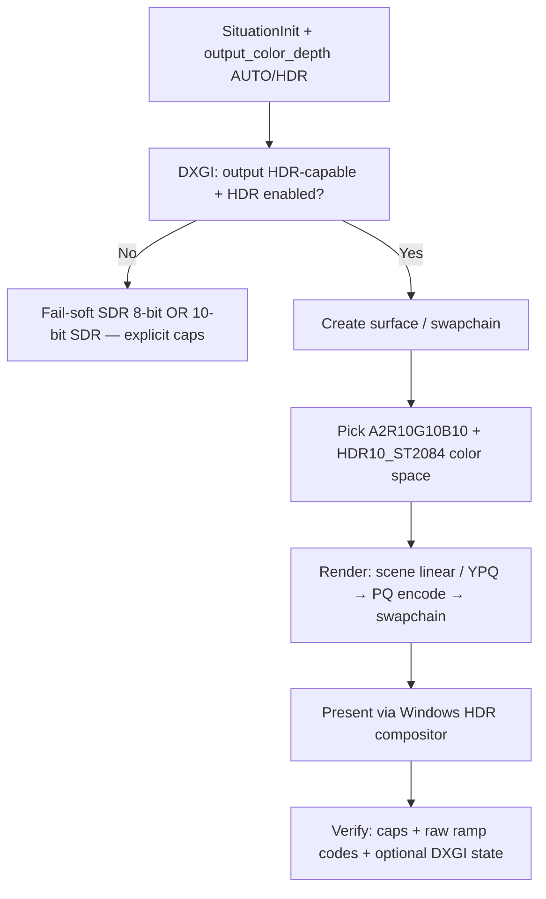
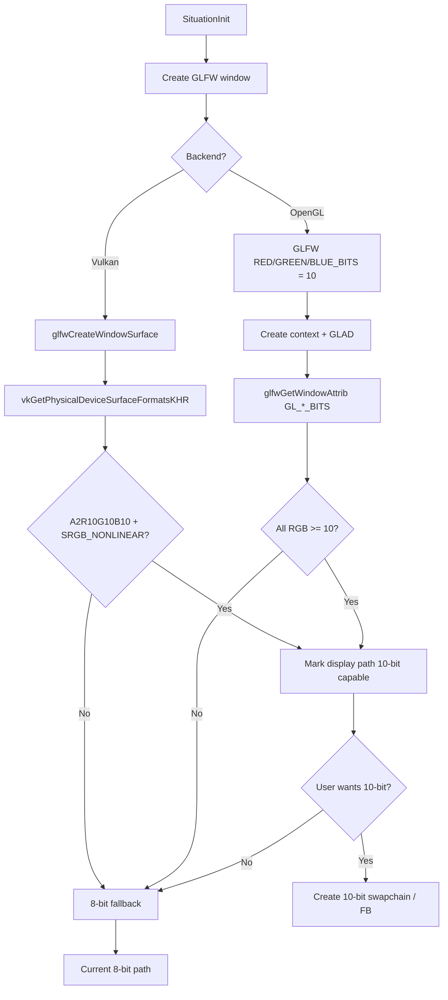

# HDR / 10-bit Display Output Plan

**Date**: 2026-06-16 (rev. 2026-06-17 — HDR is the product goal)  
**Status**: **Foundation done (v2.4.294–298)**; **HDR rendering not done — Phases 5–8 required**  
**Priority**: **HIGH**  
**Scope**: Vulkan 1.4 primary (Windows HDR compositor path); OpenGL secondary / best-effort  
**North star**: Situation **renders HDR** (HDR10 / PQ on a BT.2020-capable swapchain), not merely a 10-bit SDR framebuffer in a standard Windows window.

**Primary files**: `sit/situation_api.h`, `sit/situation_impl_ctrl.h`, `sit/situation_impl_renderer.h`, `sit/situation_impl_image.h`, `sit/situation_impl_wdm.h`, `sit/situation_impl_io.h` (DXGI), `tests/harness/test_output_color_depth.c`

---

## Executive summary

Phases 0–4 delivered **infrastructure only**:

- Policy API (`SituationOutputColorDepth`), caps, honest gating of `SIT_FEATURE_HDR_OUTPUT` on *active bit depth*
- Vulkan **10-bit SDR** swapchain: `A2R10G10B10_UNORM_PACK32` + `VK_COLOR_SPACE_SRGB_NONLINEAR_KHR`
- Readback downconvert, YPQ→RGB10 helpers, harness probes

That is **not HDR**. It does not use PQ (ST.2084), BT.2020 output color space, Windows HDR compositor participation, or verifiable extended luminance on the display path.

**This plan is incomplete until Phases 5–8 land.** `SIT_FEATURE_HDR_OUTPUT` must not be treated as “mission accomplished” until HDR swapchain + PQ output + automated proof pass on HDR-capable hardware.

---

## Definitions (non-negotiable)

| Term | Means in this plan | Does **not** mean |
|------|-------------------|-------------------|
| **10-bit SDR** | `A2R10G10B10` + sRGB non-linear WSI color space; reduces banding in SDR headroom | HDR, wide gamut, PQ |
| **HDR output** | Swapchain uses **HDR color space** (e.g. `VK_COLOR_SPACE_HDR10_ST2084_EXT`) + **PQ-encoded** pixel values; Windows output is in **HDR mode** | “10 bits per channel in sRGB” |
| **HDR active** | All of: WSI picked HDR format+colorSpace, `output_hdr_active==1`, DXGI/output reports HDR on target monitor, feature flag true | Window visible, gradient demo, `active=0` pass |
| **Proof** | Automated tests that **fail** when HDR is not active; raw swapchain readback shows ≥ N distinct PQ codes in a synthetic ramp | Subjective window glance, 8-bit screenshot downconvert |

---

## What exists today (foundation — insufficient)

| Area | Today | HDR gap |
|------|-------|---------|
| Vulkan swapchain | `A2R10G10B10` + `SRGB_NONLINEAR` when WSI allows | No `HDR10_ST2084` / `EXT_swapchain_colorspace` |
| Windows compositor | Standard SDR window | No DXGI HDR output query; no “Use HDR” path integration |
| Feature flag | `SIT_FEATURE_HDR_OUTPUT` ↔ 10-bit SDR active | Misleading name; not HDR |
| YPQ / color | RGB10 packers, YPQ grade shaders | No PQ (ST.2084) encode to swapchain |
| Readback | Always downconverts to RGBA8 | No raw PQ/A2R10 readback for verification |
| Visual test | Windowed ramps; passes with `active=0` | Not an HDR acceptance test |
| OpenGL | 10-bit FB hints | No Windows HDR swapchain equivalent |

---

## Target architecture



### Vulkan format priority (HDR path)

1. `VK_FORMAT_A2R10G10B10_UNORM_PACK32` + `VK_COLOR_SPACE_HDR10_ST2084_EXT` (requires `VK_EXT_swapchain_colorspace`)
2. Fallback candidates per driver enumeration (e.g. `DISPLAY_P3` extended spaces) — logged, not silent
3. **Do not** claim HDR when only `SRGB_NONLINEAR` + 10-bit is available → report **10-bit SDR** separately

### Windows requirements (test matrix)

- Monitor supports HDR (DXGI `ColorSpace` / `BitsPerColor`)
- **Settings → System → Display → HDR = On** for that monitor
- App window on that monitor (fullscreen borderless or sufficiently large exclusive path — document minimum)
- Vulkan build with swapchain colorspace extension enabled

---

## API changes (Phase 5–6)

### Extend policy

```c
typedef enum SituationOutputColorDepth {
    SIT_OUTPUT_COLOR_AUTO   = 0,  /* prefer HDR when OS+WSI confirm; else 10-bit SDR; else 8-bit */
    SIT_OUTPUT_COLOR_8BIT   = 1,  /* force 8-bit SDR (CI default) */
    SIT_OUTPUT_COLOR_10BIT  = 2,  /* force 10-bit SDR (no PQ) */
    SIT_OUTPUT_COLOR_HDR10  = 3,  /* require HDR10/PQ path; fail-soft to 10-bit SDR then 8-bit */
} SituationOutputColorDepth;
```

### Extend caps (`SituationGraphicsCaps`)

```c
uint8_t  output_bits_per_channel;   /* 8 or 10 */
uint8_t  output_color_depth_active; /* 1 = 10-bit swapchain (SDR or HDR container) */
uint8_t  output_hdr_active;         /* 1 = HDR color space + PQ output path active */
uint8_t  output_color_space;        /* enum: SDR_SRGB, HDR10_ST2084, ... */
float    output_max_nits;           /* from DXGI/OS when available, else 0 */
```

### Feature flag (after Phase 8)

`SIT_FEATURE_HDR_OUTPUT` **true only when `output_hdr_active==1`**, not for 10-bit SDR alone.  
Add `SIT_FEATURE_10BIT_SDR_OUTPUT` or document 10-bit via caps only — avoid overloading “HDR”.

### Display query

```c
/* SituationDisplayInfo — populate from DXGI where available */
bool     hdr_supported;      /* panel + OS path can do HDR */
bool     hdr_enabled;        /* user HDR toggle on for this output */
uint16_t bits_per_color;     /* DXGI BitsPerColor */
float    max_luminance_nits; /* optional */
```

---

## Phase checklist

| Phase | Name | Status |
|-------|------|--------|
| **0** | API plumbing + RGB10 / YPQ helpers | **Done (v2.4.294)** |
| **1** | Vulkan 10-bit **SDR** swapchain | **Done (v2.4.295)** — substrate only |
| **2** | Readback & screenshots (8-bit downconvert) | **Done (v2.4.296)** |
| **3** | OpenGL 10-bit SDR best-effort | **Done (v2.4.297)** |
| **4** | Harness: 8-bit CI + opt-in 10-bit SDR probes | **Done (v2.4.298)** — **not HDR proof** |
| **5** | **DXGI HDR detection + display metadata** | **Partial (v2.4.299)** — probe + harness report |
| **6** | **Vulkan HDR10 swapchain (colorspace ext)** | **Required — open** |
| **7** | **PQ output pipeline (YPQ → ST.2084 → swapchain)** | **Required — open** |
| **8** | **HDR verification tests (fail without HDR)** | **Required — open** |

Phases 0–4 remain valid groundwork. **Plan success = Phases 5–8 complete.**

---

## Detection strategy (Phases 0–4 — 10-bit SDR foundation)



### Signal ranking (foundation)

| Signal | Source | Trust | Notes |
|--------|--------|-------|-------|
| **1. WSI surface formats** | `vkGetPhysicalDeviceSurfaceFormatsKHR` | **Primary (Vulkan)** | In `_SituationVulkanQuerySwapchainSupport()` |
| **2. GL framebuffer bits** | `glfwGetWindowAttrib(GLFW_RED/GREEN/BLUE_BITS)` | **Primary (OpenGL)** | After 10-bit GLFW hints |
| **3. Monitor desktop depth** | `SituationDisplayMode.color_depth` | **Hint only** | Do not gate on this alone |
| **4. DXGI `BitsPerColor`** | `IDXGIOutput6::GetDesc1` | **Phase 5** | Required for HDR gating |

---

## Proposed API (Phases 0–4 — implemented)

### Init policy (`SituationInitInfo`)

```c
typedef enum SituationOutputColorDepth {
    SIT_OUTPUT_COLOR_AUTO = 0,   /* prefer 10-bit when backend confirms support */
    SIT_OUTPUT_COLOR_8BIT = 1,   /* force 8-bit (current behavior; CI default) */
    SIT_OUTPUT_COLOR_10BIT = 2,  /* request 10-bit; fail-soft to 8-bit */
} SituationOutputColorDepth;

/* In SituationInitInfo: */
SituationOutputColorDepth output_color_depth;  /* default: SIT_OUTPUT_COLOR_AUTO */
```

### Runtime caps (`SituationGraphicsCaps`) — as shipped in v2.4.294

```c
uint8_t output_bits_per_channel;     /* 8 or 10 after init */
uint8_t output_color_depth_active;   /* 1 if 10-bit swapchain/FB is in use */
```

### Feature flag (Phases 0–4 — interim semantics)

`SIT_FEATURE_HDR_OUTPUT` gated on **10-bit SDR active** (v2.4.294–298). **Phase 8** retargets this to true HDR only; see API changes below.

---

## Confidence assessment (Phases 0–4 — foundation)

| Goal | Confidence | Reasoning |
|------|:----------:|-----------|
| Vulkan 10-bit swapchain on capable monitor | **HIGH** | `A2R10G10B10_UNORM_PACK32` + `SRGB_NONLINEAR`; dynamic `swapchain_image_format` |
| Fail-soft to 8-bit when unsupported | **HIGH** | WSI format enumeration is authoritative |
| Existing tests unaffected (8-bit default) | **HIGH** | Harness sets 8-bit policy unless opt-in |
| Screenshots from 10-bit swapchain | **HIGH** | 10→8 bit shift in readback paths |
| Correct feature flag vs active bit depth | **HIGH** | `_SituationSetOutputColorDepthState()` |
| 10-bit YPQ→RGB conversion functions | **HIGH** | Math at double precision; ×1023 quantize |
| OpenGL achieving 10-bit framebuffer | **MEDIUM** | GLFW hints advisory; WGL often ignores on Windows |
| Monitor hot-swap without crash | **MEDIUM** | Swapchain recreate on surface change |
| Compositor actually presenting 10-bit SDR | **LOW-MEDIUM** | DWM may dither; detect and report only |

---

## Phase 0 — API plumbing + honest feature flag

**Goal:** Expose policy and active bit depth; stop lying about `SIT_FEATURE_HDR_OUTPUT`. Provide 10-bit YPQ→RGB conversion so user code can produce 10-bit color values to match the output path.  
**Confidence:** HIGH — purely additive API work with no platform-dependent behavior.

**Files:** `situation_api.h`, `situation_base_types.h`, `situation_impl_decl.h`, `situation_impl_ctrl.h`, `situation_impl_renderer.h`, `situation_impl_color.h`

**Tasks:**

- [x] Add `SituationOutputColorDepth` enum to `situation_api.h`
- [x] Add `output_color_depth` field to `SituationInitInfo` (default `AUTO`)
- [x] Add `output_bits_per_channel` and `output_color_depth_active` to internal render state (`situation_impl_decl.h`)
- [x] Extend `SituationGetGraphicsCaps()` return struct with active bit depth fields
- [x] Remove unconditional `SIT_FEATURE_HDR_OUTPUT` on OpenGL init (~4512)
- [x] Gate `SIT_FEATURE_HDR_OUTPUT` on confirmed 10-bit active state (`_SituationSetOutputColorDepthState`)
- [x] Verify: `SituationIsFeatureSupported(SIT_FEATURE_HDR_OUTPUT)` returns false on default 8-bit path

**10-bit YPQ conversion functions:**

- [x] Add `ColorRGBA10` type to `situation_base_types.h`:

   ```c
   typedef struct ColorRGBA10 {
       uint16_t r;  /* 0–1023 */
       uint16_t g;  /* 0–1023 */
       uint16_t b;  /* 0–1023 */
       uint16_t a;  /* 0–1023 (or 0–3 if matching A2R10G10B10 packing) */
   } ColorRGBA10;
   ```

- [x] Add `_SitYpqUnitTo10Bit()` internal helper in `situation_impl_color.h` (multiplies by 1023, rounds)
- [x] Add `SituationYpqToRgba10(ColorYPQf ypq)` → `ColorRGBA10` (public SITAPI)
- [x] Add `SituationYpqToRgb10Packed(ColorYPQf ypq)` → `uint32_t` (A2R10G10B10 packed layout)
- [x] Add `SituationRgbToYpqFrom10(ColorRGBA10 color)` → `ColorYPQf`
- [x] Add `SituationRgb10FromRgba(ColorRGBA color)` → `ColorRGBA10`
- [x] Add `SituationRgbaFromRgb10(ColorRGBA10 color)` → `ColorRGBA`

**Also landed (Phase 1 prep):** `sit_render.vk.surface_supports_10bit_sdr`; `sit_gs.output_color_depth_policy`; `doc/UPDATELOG.md` v2.4.294.

**Status:** Done (v2.4.294)

---

## Phase 1 — Vulkan 10-bit swapchain

**Goal:** Select `A2R10G10B10` + `SRGB_NONLINEAR` when supported and requested.  
**Confidence:** HIGH — WSI format enumeration is reliable; renderer already uses dynamic format.

**Files:** `situation_impl_renderer.h` (primary)

**Tasks:**

- [x] Extract format picker into `_SituationVulkanPickSurfaceFormat()`
- [x] Priority logic: prefer `A2R10G10B10_UNORM_PACK32` + `SRGB_NONLINEAR` when 10-bit requested + available; fallback to 8-bit UNORM
- [x] Add `_SituationVulkanSurfaceSupports10BitSdr()`; cache in `sit_render.vk.surface_supports_10bit_sdr`
- [x] On monitor move / surface recreate / fullscreen: re-query formats, re-pick, recreate swapchain + render pass + framebuffers
- [x] Audit pipeline cache keys include swapchain format (VD passes stay `R8G8B8A8_UNORM`)
- [x] Log active format in debug output

**Also:** harness `sit_test_window_init_info` sets `SIT_OUTPUT_COLOR_8BIT` (CI safety).

**Status:** Done (v2.4.295)

---

## Phase 2 — Readback & screenshots

**Goal:** Screenshots and `SituationLoadImageFromScreen` work when swapchain is 10-bit.  
**Confidence:** HIGH — `A2R10G10B10` is packed 32-bit; downscaling to 8-bit is trivial bit shifts.

**Files:** `situation_impl_renderer.h`, `situation_impl_image.h`

**Tasks:**

- [x] Extend `_SituationVulkanCopyMappedColorToRGBA` for `VK_FORMAT_A2R10G10B10_UNORM_PACK32`
- [x] Verify buffer sizing stays `width * height * 4` (32 bpp)
- [x] Document policy (v1): always downconvert to RGBA8 in public API
- [x] OpenGL path: `GL_UNSIGNED_BYTE` readback documented
- [x] Test: `rgb10_packed_readback` CPU test in harness

**Also:** `SituationRgbaFromRgb10Packed`; `SituationReadFramebuffer` Vulkan row conversion.

**Status:** Done (v2.4.296)

---

## Phase 3 — OpenGL best-effort

**Goal:** Request 10-bit default framebuffer where drivers allow it.  
**Confidence:** MEDIUM — GLFW hints are advisory; NVIDIA on Windows often ignores.

**Files:** `situation_impl_ctrl.h`, `situation_impl_renderer.h`

**Tasks:**

- [x] In `_SituationInitWindow()` when policy ≠ `8BIT`, set GLFW `RED/GREEN/BLUE_BITS = 10`
- [x] After GLAD load: query via `glfwGetWindowAttrib(GLFW_*_BITS)`
- [x] Enable 10-bit state only if all RGB channels report ≥ 10 bits
- [x] If verification fails: log diagnostic, remain 8-bit (no user-facing error)
- [x] Document: Windows WGL often stays 8-bit; recommend Vulkan for reliable 10-bit

**Status:** Done (v2.4.297)

---

## Phase 4 — Tests & validation (10-bit SDR foundation)

**Goal:** Regression-safe CI; opt-in 10-bit verification on capable hardware.  
**Confidence:** HIGH for CI safety. MEDIUM for 10-bit verification (requires real hardware).

**Files:** `tests/harness/test_graphics.c`, `tests/harness/test_output_color_depth.c`, `tests/harness/test_core.c`

**Tasks:**

- [x] Default harness init uses `SIT_OUTPUT_COLOR_8BIT` — existing pixel asserts unchanged
- [x] Capability query test: log `SituationGetGraphicsCaps().output_bits_per_channel` (`get_graphics_caps`, `output_color_depth_ci_default`)
- [x] Opt-in 10-bit test gated on `SIT_TEST_10BIT=1` (`output_color_depth` module)
- [x] Monitor hot-swap stress test (`monitor_hot_swap_recreate`, skip when < 2 monitors)
- [x] Visual validation: grading bands (`visual_10bit_grading_bands` + procedure below) — **10-bit SDR banding demo, not HDR proof**
- [x] Verify feature flag reflects active bit depth (`sit_test_assert_output_color_depth_consistent`)
- [x] YPQ round-trip numerical test (`ypq_to_rgba10_roundtrip` in `test_core.c`)

**Manual visual validation (10-bit SDR banding check):**

```powershell
$env:SIT_TEST_10BIT = "1"
$env:SIT_TEST_10BIT_VISUAL = "1"
& ".\build\tests\sit_test_vulkan.exe" --module output_color_depth --filter visual_10bit_grading_bands
```

Top→bottom bands: **B&W**, **R**, **G**, **B** (1024 steps per row, 1024×768 framebuffer forced). Compare against `SIT_OUTPUT_COLOR_8BIT` to judge banding reduction. **Does not prove HDR** — see Phase 8.

**Status:** Done (v2.4.298)

---

## Foundation success criteria (Phases 0–4 — done)

| Criterion | Confidence | Verifiable? | Status |
|-----------|:----------:|:-----------:|--------|
| Vulkan: 10-bit swapchain when `AUTO` or `10BIT` | HIGH | Yes — format logged, caps | **Done (v2.4.295)** |
| `output_bits_per_channel == 10` when active | HIGH | Yes — API query | **Done (v2.4.298)** |
| Feature flag matches 10-bit active state (interim) | HIGH | Yes — harness | **Done (v2.4.298)** |
| `SituationYpqToRgba10` / `SituationYpqToRgb10Packed` correct | HIGH | Yes — round-trip test | **Done (v2.4.298)** |
| All harness tests pass with default 8-bit policy | HIGH | Yes — CI | **Done (v2.4.298)** |
| Screenshots valid RGBA8 downconverted from 10-bit | HIGH | Yes — byte compare | **Done (v2.4.296/298)** |
| Monitor migration recreates swapchain without crash | MEDIUM | Multi-monitor hardware | **Done (v2.4.298)** |
| Visual banding reduction on 10-bit display | MEDIUM | Manual / subjective | **Documented** |
| OpenGL 10-bit on capable drivers | LOW-MEDIUM | Hardware-dependent | **Done (v2.4.297)** |

---

## Phase 5 — DXGI HDR detection (Windows)

**Goal:** Know before swapchain creation whether the **target output** can and will present HDR.

**Files:** `situation_impl_io.h`, `situation_impl_wdm.h`, `situation_impl_decl.h`, `situation_api.h`

**Tasks:**

- [x] Query `IDXGIOutput6::GetDesc1` per adapter/output: `BitsPerColor`, color space, `MaxFullFrameLuminance`
- [x] Map GLFW monitor → DXGI output (HMONITOR + Win32 `\\.\DISPLAYn` name fallback)
- [x] Expose `hdr_supported`, `hdr_enabled`, `bits_per_color`, `max_luminance_nits`, `dxgi_color_space` on `SituationDisplayInfo`
- [x] Harness report test: `report_hdr_10bit_display_capability` (+ `SituationGraphicsCaps.wsi_supports_10bit_sdr`)
- [x] Gate `SIT_OUTPUT_COLOR_HDR10` / `AUTO` HDR branch on **both** WSI HDR format **and** DXGI HDR enabled (Phase 6)
- [x] Log actionable diagnostic when HDR requested but OS HDR is off (Phase 6)
- [x] Refresh on `glfwSetMonitorCallback` / window monitor change

**Status:** Done (v2.4.300) — DXGI `GetDesc1` per monitor (HMONITOR match), harness `report_hdr_10bit_display_capability`, monitor hot-plug cache refresh. Phase 6 gates HDR swapchain on these fields.

---

## Phase 6 — Vulkan HDR10 swapchain

**Goal:** Create swapchain with **HDR color space**, not sRGB non-linear.

**Files:** `situation_impl_renderer.h` (primary)

**Tasks:**

- [x] Enable `VK_EXT_swapchain_colorspace` at instance; enumerate via `vkGetPhysicalDeviceSurfaceFormatsKHR`
- [x] Extend `_SituationVulkanPickSurfaceFormat()`:
  - HDR picker prefers `A2R10G10B10` + `VK_COLOR_SPACE_HDR10_ST2084_EXT`
  - Separate flags: `surface_supports_10bit_sdr`, `surface_supports_hdr10`
- [x] `SIT_OUTPUT_COLOR_HDR10` policy + AUTO when OS HDR on window monitor
- [x] Store active swapchain color space in caps; split `SIT_FEATURE_HDR_OUTPUT` vs `SIT_FEATURE_10BIT_SDR_OUTPUT`
- [x] Early display cache before swapchain (DXGI gating)
- [x] Recreate render pass / framebuffers audit on HDR format change (same hooks as resize — `_SituationVulkanRecreateSwapchain` rebuilds pass + FB from active format)
- [x] Present mode audit for HDR: force `VK_PRESENT_MODE_FIFO_KHR` when `output_hdr_active` (Windows compositor HDR path; logged in swapchain create)
- [x] Fullscreen / borderless policy: windowed/borderless on HDR monitor with OS HDR on uses compositor HDR path; exclusive fullscreen not required; `SIT_OUTPUT_COLOR_HDR10` + DXGI `hdr_enabled` gate swapchain (documented below)

**Status:** Done (v2.4.302) — HDR10 swapchain selection, FIFO present mode, recreate path, caps/features split, stderr diagnostics.

**Compositor / window policy (Windows):**

- App does **not** need exclusive fullscreen for HDR10 swapchain; borderless or windowed on the HDR monitor is sufficient when **Settings → System → Display → HDR** is on for that output.
- Swapchain HDR10 is gated on **DXGI `hdr_enabled` for the GLFW window monitor**, not merely `hdr_supported`.
- On monitor hot-plug or window migration, display cache refresh + existing swapchain recreate path re-picks format.

**Acceptance:** With HDR on and `SIT_OUTPUT_COLOR_HDR10`, debug log contains `HDR10_ST2084` and `output_hdr_active==1`. No silent fallback without log when HDR was explicitly requested.

---

## Phase 7 — PQ output pipeline

**Goal:** Fragment output and clear colors written in **PQ (ST.2084)** space matching the HDR swapchain.

**Files:** `situation_impl_color.h`, `situation_impl_renderer.h`, internal composite / grade shaders, public API docs

**Tasks:**

- [x] Add `SituationLinearToPq()` / `SituationPqToLinear()` (ST.2084; match BT.2100 reference implementation)
- [x] Add `SituationYpqToRgb10PackedHdr(ColorYPQf)` — scene-referred YPQ → linear RGB → PQ → A2R10G10B10
- [x] Define **rendering working space**: internal linear or YPQ FP32 → **single PQ encode at swapchain boundary** (see below)
- [x] Update default clear / `ColorRGBA` path: when HDR active, `_SituationColorRgbaToClearFloats` converts sRGB 0–255 → linear → PQ for render-pass clear; public `SituationColorRgbaToHdrPqClear` for debugging
- [ ] Optional: FP16 offscreen + tonemap to PQ for grading headroom (recommended for YPQ grade chain)
- [x] OpenGL: **unsupported for HDR on Windows v1** — use Vulkan for HDR10 output; OpenGL remains 8-bit / 10-bit SDR only

**Status:** Done (v2.4.302) — ST.2084 PQ math, HDR packed output helpers, Vulkan clear PQ path, harness unit tests.

**Working space (v1):**

- Scene and grade chains continue in **linear or YPQ FP32** internally.
- **PQ encode happens once** at the swapchain boundary: fragment output / clear colors written as PQ when `output_hdr_active`.
- Apps targeting HDR should use `SituationYpqToRgb10PackedHdr` (or PQ helpers) for final pixels; sRGB `ColorRGBA` clears are converted automatically when HDR swapchain is active.

**Acceptance:** Solid PQ 0.5 reference patch produces expected packed code in unit test; fullscreen HDR gradient shows monotonic PQ codes in raw readback (Phase 8).

---

## Phase 8 — HDR verification (no pipe dreams)

**Goal:** Tests that **fail** if HDR is not actually active. Visual demo is supplementary.

**Files:** `tests/harness/test_output_color_depth.c`, `sit_test_output_color_depth.h`, plan doc

**Tasks:**

- [x] Rename / split flags: `SIT_TEST_HDR=1` (required for HDR tests), `SIT_TEST_10BIT` for SDR 10-bit only, `SIT_TEST_HDR_VISUAL=1` for on-screen HDR demo
- [x] `hdr_caps_and_feature`: assert `output_hdr_active`, `output_color_space == HDR10`, `SIT_FEATURE_HDR_OUTPUT`
- [x] `hdr_swapchain_format_logged`: caps assert + documents init stderr `HDR10 swapchain active` line
- [x] `hdr_raw_ramp_readback`: render PQ ramp; `SituationReadFramebufferHdr`; assert ≥ 512 distinct R10 codes
- [x] `visual_hdr_grading_bands`: **skip/fail unless `output_hdr_active`**; PQ four-band ramp; 5s hold; requires `SIT_TEST_HDR` + `SIT_TEST_HDR_VISUAL`
- [x] CI: all HDR tests **skipped** by default; 8-bit SDR CI unchanged
- [x] Manual checklist: OS HDR on, monitor in HDR mode (Settings), compare banding vs SDR capture

**Status:** Done (v2.4.303) — opt-in HDR harness suite + raw readback API; plan closure on reference HDR hardware.

**Acceptance criteria (plan complete):**

| Criterion | Verifiable |
|-----------|:----------:|
| HDR swapchain color space active | API + log |
| `SIT_FEATURE_HDR_OUTPUT` ↔ `output_hdr_active` only | Harness |
| Raw ramp ≥ N distinct PQ codes | Automated on HDR hardware |
| Fail-soft when OS HDR off | Automated |
| Visual test cannot pass with `active=0` | Harness |

---

## Confidence assessment (HDR work)

| Goal | Confidence | Notes |
|------|:----------:|-------|
| DXGI output HDR metadata | **HIGH** | Win10+ API; codebase already uses DXGI for VRAM |
| Vulkan HDR10 swapchain (NVIDIA/AMD recent) | **MEDIUM–HIGH** | Extension common; per-driver format lists vary |
| Windows compositor accepts app HDR | **MEDIUM** | Requires user HDR on + correct window placement |
| PQ encode correctness | **HIGH** | Pure math + unit tests |
| OpenGL HDR on Windows | **LOW** | Out of v1 critical path |
| Automated proof without external scope | **MEDIUM** | Raw readback + distinct code count is sufficient for software proof |
| Panel photometry | **LOW** | Out of scope; software proof only |

---

## Risks & mitigations

| Risk | Mitigation |
|------|------------|
| User OS HDR off | DXGI detect; clear log; fail-soft; test skip message |
| WSI lists HDR format but compositor still SDR | Raw readback distinct-code test; DXGI `hdr_enabled` |
| `SIT_FEATURE_HDR_OUTPUT` confused with 10-bit SDR | Split caps + rename semantics in Phase 8 |
| Harness visual test false confidence | Fail unless `output_hdr_active` |
| Monitor migration drops HDR | Re-probe DXGI + WSI on surface recreate (extend Phase 4 test) |
| CI breaks | Default `SIT_OUTPUT_COLOR_8BIT`; HDR tests opt-in only |

---

## Recommended execution order

**Completed:**

1. Phase 0 — API + honest bit-depth flag  
2. Phase 1 — Vulkan 10-bit SDR swapchain  
3. Phase 2 — Readback  
4. Phase 4 — Tests (8-bit default CI)  
5. Phase 3 — OpenGL best-effort  

**Remaining (HDR — required for plan closure):**

6. ~~Phase 5 — DXGI HDR detection~~  
7. ~~Phase 6 — Vulkan HDR10 swapchain~~  
8. ~~Phase 7 — PQ output pipeline~~  
9. ~~Phase 8 — HDR verification tests~~  

**Plan closed** (v2.4.303) when Phase 8 harness passes with `SIT_TEST_HDR=1` on HDR hardware.

---

## Success criteria (plan closure — Phases 5–8)

The plan is **closed** when all are true on reference HDR hardware (e.g. Win11 + HDR monitor + HDR on):

1. `SituationInit` with `SIT_OUTPUT_COLOR_AUTO` or `SIT_OUTPUT_COLOR_HDR10` activates **HDR swapchain** (`output_hdr_active==1`).
2. Synthetic PQ ramp readback shows **hundreds of distinct codes** (raw, not RGBA8 downconvert).
3. `SIT_FEATURE_HDR_OUTPUT` is true **iff** HDR active (not for 10-bit SDR alone).
4. HDR harness suite passes with `SIT_TEST_HDR=1`; **skipped** in default CI.
5. Documentation states OpenGL HDR is unsupported on Windows v1 and points to Vulkan build.

Until then, the project has **HDR foundation, not HDR rendering**.
