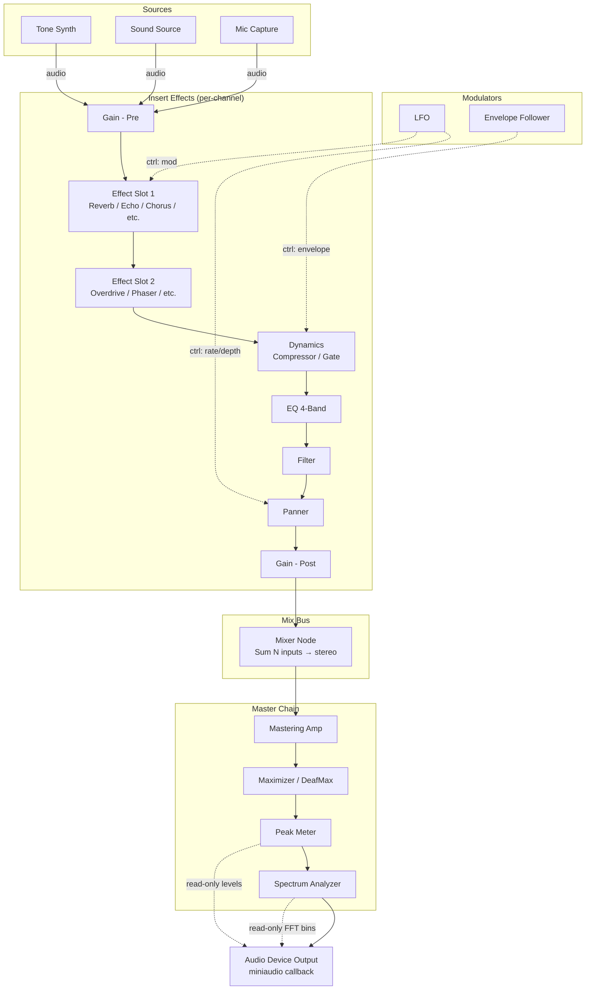

# Audio Node System Completion Plan

**Date**: 2026-05-07  
**Last aligned with implementation discussion**: 2026-05-10 (Policy B + master meter + graph/decoder contracts)  
**Scope**: Complete the remaining audio node system gaps — missing device types, unconnected wrappers, unexported functions — and align the node graph with the target signal path architecture.  
**Risk Level**: Medium — modifies library internals, requires DLL rebuild.  
**Prerequisite**: Current state is functional for 20/26 node types. No regressions allowed.

**Version gate**: **`SITUATION_VERSION_MINOR` → 5** / marketing **v2.5** is **not** tied to finishing this plan alone — see **`doc/plan/LIBRARY_BUGFIX_PLAN.md`** (*Version milestones — v2.5 is not “next patch”*). **v2.5 means the library meets the full shipping bar**, not “node graph exists.”

**Related**: **`doc/plan/PHASE_H_DETAILED_PLAN.md`** (mixer removal sequence). Original Phase H Step 2 assumed the graph replaced *all* non-tone mixing and **`goto tone_mixing`** skipped **`active_voices`** — see **§ Canonical miniaudio callback pipeline** below for the corrected contract.

---

## Canonical miniaudio callback pipeline (library contract)

This section records **how the hardware path should behave** after Phase H + integration fixes. Use it when changing `sit_miniaudio_data_callback` or adding nodes/meters.

### Ordered stages (`sit_miniaudio_data_callback`)

1. **`audio_ready`** — If false, fill output with silence and return (init/teardown race guard).
2. **Optional**: pin the **miniaudio playback thread** (`SituationSetThreadAffinity`) once — performance hint only, not a synchronization primitive.
3. **Clear** `pOut`.
4. **Voice snapshot** — Briefly lock **`audio_queue_mutex`**, copy **`active_voices`** into **`snapshot_buffer`** (same mutex as play/stop/queue edits).
5. **Policy B (default graph)** — If **`active_graph == default_graph`** and the graph Sound Source pointer is valid and scratch buffers exist: decode/mix **`snapshot_buffer`** into **`audio_callback_converter_temp_buffer`**, **`sound_source_feed_interleaved_frames`** into that node’s **`SituationSoundSource`**. If there are no voices, **`sound_source_stop`** that source. **Streaming `ma_decoder_*` runs under `audio_queue_mutex`** (same lock as **`SituationPlayLoadedSound`** seek-to-zero).
6. **`SituationProcessGraph`** — If **`active_graph != NULL`**, render into **`pOut`** (mixer sums tone synth + fed Sound Source + any other patched nodes).
7. **Latent voice mix** — **`+=` into `pOut`** only when **`_SituationShouldMixLatentVoices`** is true (no graph / empty / no mixer / **or** **`default_graph`** without voice-source pointer fallback). **Skipped** when **`active_graph`** is a **non-default** graph that **contains a mixer** (until voices are patched in-graph). **Skipped** for normal **`default_graph`** when Policy B voice-source pointer is set (avoids double-sum).
8. **Tone pool** (`tone_mixing`) — **`SituationPlayTone` / `SituationPlayToneEx`** mix here (**fire-and-forget** path). Distinct from the graph’s **`SITUATION_NODE_TONE_SYNTH`** unless bridged.
9. **Master bus meter + monitor** — Compute peak/RMS over **`pOut`** for the block; store **`audio_meter_peak` / `audio_meter_rms`** atomics (**`SituationGetMasterOutputMeter`** from main/UI). Then invoke **`SituationSetAudioOutputMonitor`** if registered (runs on audio thread; avoid blocking APIs inside the callback).

### Phase H integration gap (what went wrong on paper)

| Document | Claim | Reality |
|----------|--------|--------|
| Phase H Step 2 (`PHASE_H_DETAILED_PLAN.md`) | Graph path **`goto tone_mixing`** skips legacy mix — “graph handles everything” | **`active_voices`** (loaded/streamed sounds) were **not** wired into the graph Sound Source; they were **dropped** whenever `active_graph` was set. |
| UPDATELOG v2.4.36 | “Legacy sound mixing still runs when no graph” | **`SituationInit`** enables **`default_graph`** → **`active_graph`** is usually **non-NULL**, so that fallback rarely applies. |

**Product policy (shipped for zero-config):**

- **Policy B** (**v2.4.48+**): **`default_graph`** primes **`SITUATION_NODE_SOUND_SOURCE`** from **`active_voices`** before **`SituationProcessGraph`** so the **mixer** is the real sum point for loaded sounds + tone synth.
- **Policy A (fallback)** remains for graphs **without** a mixer, **empty** graphs, **no active graph**, **user graph without mixer**, or **`default_graph`** when the Sound Source **`device_data`** pointer is missing — additive latent mix after the graph.

Document **A vs B** in **`situation_api.md`** when convenient; runtime behavior is as above.

### Lifecycle / shutdown

After **`audio_ready`** is cleared and the device is **stopped/uninit**, tear down **`default_graph`** with **`SituationDestroyGraph`**, clear **`active_graph`** if it pointed at **`default_graph`**. Avoid freeing graph memory while the audio thread can still run **`SituationProcessGraph`**.

### Graph topology mutation (contract)

**Goal**: **`SituationProcessGraph`** must not walk freed/changed topology mid-sort.

**Rules (library contract — enforce in app/editor code today):**

1. Call **`SituationCreateNode`**, **`SituationDestroyNode`**, **`SituationCreatePatch`**, **`SituationRemovePatch`**, and **`SituationTopologicalSort`** only from the **main / control thread**, never from inside a device **`process`** callback invoked by **`SituationProcessGraph`** (no re-entrant graph edits from the audio thread).
2. Prefer applying topology changes **between** audio blocks or while the playback device is **stopped**, especially when editing **`active_graph`**.
3. After structural edits, **`SituationTopologicalSort(active_graph)`** must run **before** the callback relies on **`sorted_nodes`** (until then **`SituationProcessGraph`** outputs silence when **`needs_resort`** / empty sort).
4. **Future**: optional queued edit ring or RW-lock — not required for correctness if callers follow (1)–(3).

### Streaming decoder (`ma_decoder`)

- Main-thread **seek** for **`SituationPlayLoadedSound`** (restart) runs **inside `audio_queue_mutex`** together with queue updates.
- Audio-thread **`ma_decoder_read_pcm_frames`** / loop **seek** runs **under the same `audio_queue_mutex`** so seeks and reads do not interleave on the same **`SituationSound`** (recursive mutex allows nested lock from the same thread only — do not call blocking APIs that acquire this mutex from inside **`SituationSetAudioOutputMonitor`**).
- **`SituationUnloadSound`**: **`SituationStopLoadedSound`** then **`_SituationWaitUntilVoiceSnapshotIdle`** before **`ma_decoder_uninit`**.

### Thread safety — snapshot unload

- **`is_processing_snapshot`** (**v2.4.47**): set during **`snapshot_buffer`** decode/mix; **`SituationUnloadSound`** spins until clear before freeing **streaming** state.

### Master bus metering (**v2.4.49**)

- **`SituationGetMasterOutputMeter`** reads **`audio_meter_peak` / `audio_meter_rms`** (relaxed atomics) updated once per callback after tones — suitable for **VU / LED** without touching **`SituationSetAudioOutputMonitor`** (per-buffer callback remains optional for FFT/scopes).

### Harness / platform

- **`sit_test.exe --module audio`** (**v2.4.50–51**): harness **`stderr`** critical section (**v2.4.50**); **MIDI** **`SituationDestroyGraph`** slot sweep + **`SIT_TEST_OPEN_MIDI_HARDWARE`** gate + **`DisableMidiControl`** when hardware MIDI opens (**v2.4.51**). Prefer **`sit_test.exe … >NUL`** only if stderr hang observed (**`2>NUL`** can interact badly with some runners).
- Full **`sit_test.exe`** without **`--module`** / **Bug 6** (exclusive **`ma_device`** / **`SituationInit`** re-init): still tracked in **`LIBRARY_BUGFIX_PLAN.md`** — orthogonal stress path.

### Checklist — pipeline “complete” for your next milestone

- [x] **Policy B** for **`default_graph`** (**v2.4.48**) + **`_SituationShouldMixLatentVoices`** fallback.
- [x] Reflect Policy B / graph-edit rules in **`situation_api.md`** / examples (docs-only) (**v2.4.49–50**).
- [x] **`is_processing_snapshot`** for unload (**v2.4.47**); streaming **`ma_decoder_*`** vs seek serialized via **`audio_queue_mutex`**.
- [x] **Meter tap** — **`SituationGetMasterOutputMeter`** (**v2.4.49**); optional **`SituationSetAudioOutputMonitor`** now invoked after final mix.
- [x] **`--module audio`** sequential harness stable (**v2.4.50**).
- [ ] **Bug 6** — full sequential **`sit_test.exe`** / exclusive re-init lifecycle — **`LIBRARY_BUGFIX_PLAN.md`**.

---

## Audio Signal Path (Target Architecture)



### Signal Flow Notes

1. **Sources** generate audio (no inputs). Tone Synth is polyphonic, Sound Source plays samples, Mic Capture streams from hardware.
2. **Insert chain** is per-channel — each source can have its own effect stack before hitting the mixer. Effects are optional; patches skip unused slots.
3. **Mixer** sums N stereo inputs to one stereo output. This is the bus summing point. Multiple mixers can create sub-buses (drums bus, vocal bus, etc.).
4. **Master chain** applies final processing: mastering amp (SSE-optimized), maximizer (spectral enhancement), then metering.
5. **Modulators** output control signals (not audio). LFO and Envelope Follower connect to control ports on any node, modulating parameters at audio rate.
6. **Analyzers** (Peak Meter, Spectrum Analyzer) are tap nodes — they read audio but pass it through unmodified. Their state is polled from the main thread for UI display.
7. **Output** is the miniaudio device callback. `SituationProcessGraph()` is called from the audio thread, writes into the callback buffer.

### Processing Order (Topological)

```
Sources → Modulators → Insert FX (in chain order) → Mixer → Master → Analyzers → Output
```

Kahn's algorithm in `SituationTopologicalSort()` computes this automatically from patch connections. Control patches don't affect ordering.

---

## Mixer Architecture Decision

**Decision**: The node graph is the single audio mixing path. The miniaudio-based `SituationAudioMixer` is deprecated.

### Why

The existing `SituationAudioMixer` (Phase 1/2) uses miniaudio's `ma_node_graph` with `ma_splitter_node` for routing. It provides a fixed track/bus topology — 16 tracks, 8 aux buses, master bus. It cannot do:
- Arbitrary routing (node A → node C, skipping B)
- Per-channel insert chains with different effect stacks
- Modulation (LFO → panner, envelope follower → dynamics)
- Sub-bus hierarchies (drums bus → master, vocals bus → master)
- Analyzers tapped into the signal path
- Any topology that isn't "tracks → aux → master"

The node graph (`SituationAudioGraph` + `SituationProcessGraph`) can do all of the above. And miniaudio's mixing is scalar C loops — no SIMD advantage over our own `_SituationSumBuffers`.

### Deprecation Plan

The miniaudio mixer removal is handled in **Phase H** of this plan. The sequence is:

1. **Phases E0–G**: Complete the node graph, validate it works end-to-end
2. **Phase H**: Remove the miniaudio mixer, rewire the audio callback to use `SituationProcessGraph()`
3. **Version bump**: Minor version increment (breaking API change)

miniaudio itself stays — it's still the audio device backend (opening hardware, running the callback, sample rate conversion). We're only dropping its `ma_node_graph` routing layer.

### The One Mixer: `SITUATION_NODE_MIXER`

- **Created by**: User calls `SituationCreateNode(graph, SITUATION_NODE_MIXER, &handle)`
- **NOT auto-created** during `SituationInit()` — user builds their own graph topology
- **Architecture**: A node in the `SituationAudioGraph` that sums N input ports to stereo output
- **Role**: Bus summing point in the signal path (see Mermaid diagram above)
- **Audio callback integration**: `SituationProcessGraph()` is called from the miniaudio device callback, processes all nodes including the mixer node, writes final output to the hardware buffer

---

## Current State Summary

| Component | Status |
|-----------|--------|
| Node type enum (26 types) | ✅ Complete |
| Registry metadata (20/26 registered) | ⚠️ Missing 6 |
| Device wrappers (21 in function table) | ⚠️ Missing 5 |
| Node creation (registry-driven) | ✅ Works for registered types |
| Device-specific init (create_func) | ❌ Not connected in `SituationCreateNode` |
| `SituationCreateNodeWithDevice` helper | ✅ Exists, calls create_func correctly |
| `SituationProcessGraph` | ✅ Fully implemented (topo sort, gather inputs, call process, sum to master) |
| SituationRemovePatch | ✅ Implemented, ❌ Not exported in API |
| SituationInsertEffect / RemoveEffect | ✅ Implemented, ✅ Exported |

---

## Gap Analysis

### Missing Device Registrations (6 types)

| Node Type | Wrapper Exists? | DSP Implementation? | Registration? |
|-----------|----------------|---------------------|---------------|
| GAIN | ❌ No | Trivial (multiply) | ❌ No |
| MIXER | ❌ No | Trivial (sum inputs) | ❌ No |
| ENVELOPE_FOLLOWER | ❌ No | ❌ No file | ❌ No |
| SPECTRUM_ANALYZER | ❌ No | ❌ No file | ❌ No |
| PEAK_METER | ❌ No | ❌ No file | ❌ No |
| LFO | ✅ Yes (fx/lfo.h + wrapper) | ✅ Yes | ❌ No (not in registry) |

### The Critical Blocker: `device_data` Never Initialized

`SituationCreateNode()` in `node_graph_impl.h` has a commented-out TODO:

```c
// TODO Phase 4: Call device-specific create function
// if (metadata.create_func) {
//     node->device_data = metadata.create_func(&metadata);
// }
```

This means nodes created via `SituationCreateNode()` have `device_data = NULL`. When `SituationProcessGraph()` calls `funcs->process(node->device_data, ...)`, the process function receives NULL and either no-ops or crashes.

**Note**: `SituationCreateNodeWithDevice()` in `node_graph_process.h` already solves this — it calls `create_func` correctly. But `SituationCreateNode()` (the public API) does not. The fix is to wire the function table lookup into `SituationCreateNode` directly so all callers get working nodes.

### Unexported API Function

`SituationRemovePatch()` is implemented in `node_graph_impl.h` but NOT declared in `situation_api.h`. It needs to be exported for the test harness and for user code.

---

## Implementation Phases

### Phase E0 — Connect create_func in SituationCreateNode (THE CRITICAL FIX)

**Effort**: 15 minutes  
**Risk**: Low (additive change, no behavior change for existing callers)  
**Priority**: CRITICAL — without this, all 21 existing wrappers are dead code  
**Files**: `sit/aud/node_graph_impl.h`

The graph processor (`SituationProcessGraph`) already works correctly — it finds device functions, gathers inputs, calls process, sums outputs. The only gap is that `SituationCreateNode` never initializes `device_data`.

- [ ] Uncomment the Phase 4 TODO in `SituationCreateNode`:
  ```c
  const SituationDeviceFunctions* funcs = _SituationFindDeviceFunctions(
      type, g_device_function_table, g_device_function_table_count);
  if (funcs && funcs->create) {
      node->device_data = funcs->create(metadata);
  }
  ```
- [ ] Uncomment the destroy TODO in `SituationDestroyNode` / `SituationDestroyGraph`:
  ```c
  const SituationDeviceFunctions* funcs = _SituationFindDeviceFunctions(
      node->type, g_device_function_table, g_device_function_table_count);
  if (funcs && funcs->destroy && node->device_data) {
      funcs->destroy(node->device_data);
      node->device_data = NULL;
  }
  ```
- [ ] Verify: create a Tone Synth node → process graph → confirm audio output is non-zero

---

### Phase A — Register LFO (Already Implemented, Just Missing Registration)

**Effort**: 15 minutes  
**Risk**: None  
**Files**: `sit/aud/registry_init.h`

The LFO already has:
- DSP implementation in `sit/aud/fx/lfo.h`
- Wrapper functions in `device_wrappers.h` (create/process/destroy)
- Entry in `g_device_function_table`

Just needs a `_SituationRegisterLFO()` function and a call from `SituationInitDeviceRegistry()`.

- [ ] Write `_SituationRegisterLFO()` with metadata (category=MODULATOR, controls: rate, depth, waveform, phase)
- [ ] Add call to `SituationInitDeviceRegistry()` under a new "Modulators" section
- [ ] Verify test harness `registry_all_builtin_registered` still passes

---

### Phase B — Implement & Register Simple Utilities (Gain, Mixer Node)

**Effort**: 1–2 hours  
**Risk**: Low  
**Files**: `sit/aud/fx/gain.h` (new), `sit/aud/fx/mixer_node.h` (new), `sit/aud/device_wrappers.h`, `sit/aud/registry_init.h`

#### B1 — Gain Node

The Gain node appears twice in the signal path (pre-insert and post-insert). It's the simplest possible effect: multiply input by a gain factor.

```c
typedef struct {
    float current_gain;   // Smoothed gain (for click-free changes)
    float target_gain;    // Target gain from control_values
} SituationGainState;
```

- [ ] Create `sit/aud/fx/gain.h` — minimal DSP (apply gain to stereo buffer with smoothing)
- [ ] Add wrapper to `device_wrappers.h` (create/process/destroy)
- [ ] Add to `g_device_function_table`
- [ ] Write `_SituationRegisterGain()` — category=UTILITY, 2 audio in, 2 audio out, 1 control (gain: 0.0–4.0, default 1.0)
- [ ] Add call to `SituationInitDeviceRegistry()`

#### B2 — Mixer Node (Bus Summing)

The Mixer node is the bus summing point in the signal path. It sums N stereo inputs to 1 stereo output. This is architecturally critical — it's how channels converge before the master chain.

**Design**: Variable input count. The node is registered with `num_audio_ins = 16` (max channels that can feed into it). Unused inputs are simply zero. The mixer sums all non-zero inputs and optionally applies a master gain.

```c
typedef struct {
    float master_gain;    // Overall bus level (default 1.0)
    int active_inputs;    // Count of non-silent inputs (for normalization if desired)
} SituationMixerNodeState;
```

- [ ] Create `sit/aud/fx/mixer_node.h` — sum all input port buffers to stereo output, apply master gain
- [ ] Add wrapper to `device_wrappers.h`
- [ ] Add to `g_device_function_table`
- [ ] Write `_SituationRegisterMixer()` — category=UTILITY, num_audio_ins=16, num_audio_outs=2, 1 control (master_gain: 0.0–4.0, default 1.0)
- [ ] Add call to `SituationInitDeviceRegistry()`

**Note**: This is the node graph mixer node (`SITUATION_NODE_MIXER`), not the legacy `SituationAudioMixer`. See "Mixer Initialization — Two Systems" above.

---

### Phase C — Implement & Register Envelope Follower

**Effort**: 1–2 hours  
**Risk**: Low  
**Files**: `sit/aud/fx/envelope_follower.h` (new), `sit/aud/device_wrappers.h`, `sit/aud/registry_init.h`

The Envelope Follower is a modulator — it reads audio input and outputs a control signal representing the amplitude envelope. In the signal path, it connects to the Dynamics node's control input to enable sidechain-style behavior.

Classic algorithm: rectify input → smooth with attack/release → output control signal.

```c
typedef struct {
    float envelope;       // Current envelope value (0.0–1.0)
    float attack_coeff;   // Smoothing coefficient for rising signal
    float release_coeff;  // Smoothing coefficient for falling signal
} SituationEnvelopeFollowerState;
```

Controls:
- attack (0.001–0.5s, default 0.01s)
- release (0.01–2.0s, default 0.1s)
- sensitivity (0.1–10.0, default 1.0)

- [ ] Create `sit/aud/fx/envelope_follower.h` — DSP implementation
- [ ] Add wrapper to `device_wrappers.h`
- [ ] Add to `g_device_function_table`
- [ ] Write `_SituationRegisterEnvelopeFollower()` — category=MODULATOR, 2 audio in (stereo tap), 0 audio out, 1 ctrl out (envelope value)
- [ ] Add call to `SituationInitDeviceRegistry()`

---

### Phase D — Implement & Register Analyzers (Peak Meter, Spectrum Analyzer)

**Effort**: 2–3 hours  
**Risk**: Low  
**Files**: `sit/aud/fx/peak_meter.h` (new), `sit/aud/fx/spectrum_analyzer.h` (new), `sit/aud/device_wrappers.h`, `sit/aud/registry_init.h`

Analyzers are **tap nodes** — they sit in the signal path, read audio, pass it through unmodified, and accumulate state that can be polled from the main thread. In the target architecture they sit after the Maximizer in the master chain.

#### D1 — Peak Meter

Tracks peak and RMS levels per channel with ballistic decay.

```c
typedef struct {
    float peak_l, peak_r;     // Current peak (decays over time)
    float rms_l, rms_r;       // RMS level (windowed)
    float decay_rate;         // Peak decay rate per sample
    float rms_window[128];    // Circular buffer for RMS calculation
    int rms_pos;              // Write position in RMS window
} SituationPeakMeterState;
```

**Important**: Audio passes through unmodified. The meter only reads.

- [ ] Create `sit/aud/fx/peak_meter.h` — track peaks with ballistic decay, compute RMS, pass audio through
- [ ] Add wrapper to `device_wrappers.h`
- [ ] Add to `g_device_function_table`
- [ ] Write `_SituationRegisterPeakMeter()` — category=ANALYZER, 2 audio in, 2 audio out (passthrough), 0 controls
- [ ] Add call to `SituationInitDeviceRegistry()`
- [ ] Add API function to read meter state: `SituationGetPeakMeterLevels(graph, handle, float* peak_l, float* peak_r, float* rms_l, float* rms_r)`

#### D2 — Spectrum Analyzer

FFT-based frequency spectrum for display. Accumulates samples, computes magnitude spectrum when a full window is ready.

```c
typedef struct {
    float* fft_buffer;        // Windowed input buffer
    float* magnitude;         // Output magnitude bins
    int fft_size;             // 512 or 1024
    int write_pos;            // Circular buffer position
    bool ready;               // New frame available for reading
} SituationSpectrumAnalyzerState;
```

**Important**: Audio passes through unmodified. Use a simple radix-2 DFT (no dependency on maximizer internals).

- [ ] Create `sit/aud/fx/spectrum_analyzer.h` — accumulate samples, compute magnitude spectrum, pass audio through
- [ ] Implement simple radix-2 FFT (or reuse the internal FFT utility if one exists)
- [ ] Add wrapper to `device_wrappers.h`
- [ ] Add to `g_device_function_table`
- [ ] Write `_SituationRegisterSpectrumAnalyzer()` — category=ANALYZER, 2 audio in, 2 audio out (passthrough), 1 control (fft_size: 256/512/1024)
- [ ] Add call to `SituationInitDeviceRegistry()`
- [ ] Add API function to read spectrum: `SituationGetSpectrumData(graph, handle, float* magnitudes, int* num_bins)`

---

### Phase F — Export SituationRemovePatch

**Effort**: 15 minutes  
**Risk**: None  
**Files**: `sit/situation_api.h`

- [ ] Add declaration to `situation_api.h` near `SituationCreatePatch`:
  ```c
  SITAPI SituationError SituationRemovePatch(SituationAudioGraph* graph, SituationNodeHandle src, int src_port, SituationNodeHandle dst, int dst_port, bool is_control);
  ```
- [ ] Verify it links correctly (already implemented in `node_graph_impl.h`)

---

### Phase G — Rebuild DLL & Validate Full Signal Path

**Effort**: 1 hour  
**Risk**: Low  
**Files**: Build system + test harness

- [ ] `build_situation.bat opengl` — rebuild DLL with all changes
- [ ] `build_situation.bat vulkan` — rebuild Vulkan DLL
- [ ] `build_tests.bat` — rebuild test harness
- [ ] Run `sit_test --module audio --filter registry` — verify all 26 types registered
- [ ] Implement Phase 22 tests (already planned in TEST_HARNESS_PLAN.md)
- [ ] **Integration test**: Build the canonical signal path from the Mermaid diagram:
  ```
  Tone Synth → Gain(pre) → Reverb → Gain(post) → Mixer → Mastering Amp → Peak Meter → Output
  ```
  Verify non-zero audio reaches the output buffer.
- [ ] Run full test suite — verify no regressions

---

### Phase H — Remove miniaudio Mixer (Deprecation)

**Effort**: 3–4 hours  
**Risk**: Medium — breaking API change, removes exported functions  
**Priority**: Do AFTER Phase G passes (node graph must be fully working first)  
**Status**: API removed (see **`UPDATELOG.md`** v2.4.36+); **pipeline integration** ongoing — see **§ Canonical miniaudio callback pipeline** for **`active_voices`** / **`default_graph`** / conditional mix rules.  
**Files**: `sit/situation_api.h`, `sit/situation_impl_audio.h`, `sit/situation_impl_decl.h`

The miniaudio-based `SituationAudioMixer` is replaced by the node graph. miniaudio stays as the audio device backend (opening hardware, running the callback, sample rate conversion, channel mapping). We're removing its `ma_node_graph` routing layer.

#### What Gets Removed

**API functions** (from `situation_api.h`):
- `SituationCreateMixer` / `SituationDestroyMixer`
- `SituationAddTrack` / `SituationRemoveTrack` / `SituationSetTrackName`
- `SituationRouteSoundToTrack`
- `SituationSetTrackVolume` / `SituationSetTrackPan` / `SituationSetTrackMute` / `SituationSetTrackSolo`
- `SituationGetAuxBus` / `SituationSetTrackSend` / `SituationSetTrackOutput`
- `SituationSetTrackEQ` / `SituationSetTrackDynamics` / `SituationSetTrackSideChain`
- `SituationSetMasterVolume` / `SituationGetMasterVolume` (mixer-specific versions)
- `SituationSaveMixerSession` / `SituationLoadMixerSession`
- `SituationInsertEffect` / `SituationRemoveEffect` (bus-based)
- `SituationGetTrackMeter`
- `SituationGetMixerGraph`
- `SituationBindMixerToDevice` / `SituationBindCaptureDevice`

**Structs** (from `situation_impl_decl.h` / `situation_impl_audio.h`):
- `struct SituationAudioMixer`
- `struct SituationAudioTrack`
- `struct SituationAudioBus`
- Related defines: `SIT_MAX_TRACKS`, `SIT_MAX_AUX_BUSES`

**Implementation** (from `situation_impl_audio.h`):
- All `SituationCreateMixer` / track / bus implementation code (~800 lines)
- The `active_mixer` check in the audio callback
- `ma_node_graph` / `ma_splitter_node` usage for routing

#### What Stays

- **miniaudio device** — `ma_device`, `ma_context`, device enumeration, sample rate, master volume
- **Audio callback** — still uses miniaudio's callback, but now calls `SituationProcessGraph()` instead of `ma_node_graph_read_pcm_frames()`
- **Sound loading/playback** — `SituationLoadSound`, `SituationPlaySound`, etc. (these feed into Sound Source nodes)
- **`SituationGetAudioMasterVolume` / `SituationSetAudioMasterVolume`** — these use `ma_device_get/set_master_volume` directly, not the mixer
- **Tone synthesis** — the existing tone pool (feeds into Tone Synth nodes)
- **Capture** — mic capture via miniaudio device (feeds into Mic Capture nodes)

#### Audio Callback Rewiring

The **removed** miniaudio **`ma_node_graph`** mixer path is replaced by **`SituationProcessGraph`**. The **legacy voice snapshot** path (**`active_voices`**) is **not** the same as the removed **`SituationAudioMixer`** API — it must remain until loaded sounds are fully routed into the graph (see **§ Canonical miniaudio callback pipeline**).

**Current shape** (conceptual):

```c
if (!audio_ready) { silence; return; }
memset(pOut, ...);
if (sit_audio.active_graph)
    SituationProcessGraph(sit_audio.active_graph, pOut, ...);
if (_SituationShouldMixLatentVoices(...)) {
    // snapshot active_voices under mutex, decode/mix += into pOut
}
// tone_mixing: SituationPlayTone* → += into pOut
```

**Important**: **`SituationPlayTone`** uses the **tone pool** stage, not necessarily the graph’s Tone Synth node. **`SituationPlayLoadedSound`** uses **`active_voices`** unless policy **B** bridges samples into **`SITUATION_NODE_SOUND_SOURCE`**.

#### Default Graph (Auto-Created)

To make the node graph the primary path without breaking simple use cases, `SituationInit()` auto-creates a minimal default graph:

```
[Sound Source] ──→ [Mixer] ──→ Output (unpatched output → hardware)
[Tone Synth]  ──→ [Mixer] ──↗
```

- The default graph is stored in `sit_audio.default_graph` and set as `active_graph`.
- **`SituationPlayTone`*** — today uses the **tone pool** and **`tone_mixing`** in the callback (see **§ Canonical miniaudio callback pipeline**). It does **not** automatically drive the graph’s **`SITUATION_NODE_TONE_SYNTH`** unless bridged.
- **`SituationPlayLoadedSound`** — today mixes via **`active_voices`** when **`_SituationShouldMixLatentVoices`** is true (includes **`default_graph`**). The graph **Sound Source** node is **not** automatically fed from loaded sounds until explicitly wired (**policy B** above).
- Users can replace the graph with **`SituationSetActiveGraph(their_custom_graph)`** for full control.

#### Master Chain Is NOT Auto-Created

The master chain (Mastering Amp → Maximizer/DeafMax → Peak Meter → Spectrum Analyzer) from the Mermaid diagram is **user-opt-in**. It is not part of the default graph because:

- **Mastering Amp** and **Maximizer** are heavy DSP (FFT, multiband, SSE paths) — unnecessary overhead for simple sound playback
- **Peak Meter** and **Spectrum Analyzer** allocate per-sample tracking state that's useless if nobody reads the values
- A game playing explosion sounds doesn't need a mastering chain burning CPU

The default graph is intentionally minimal: sources → mixer → hardware. Clean, cheap, zero-config.

**To enable the master chain**, the user creates nodes and patches them between the mixer output and hardware:

```c
// User builds their own graph (or modifies the default one)
SituationNodeHandle master_amp, maximizer, meter;
SituationCreateNode(graph, SITUATION_NODE_MASTERING_AMP, &master_amp);
SituationCreateNode(graph, SITUATION_NODE_DEAFMAX, &maximizer);
SituationCreateNode(graph, SITUATION_NODE_PEAK_METER, &meter);

// Patch: Mixer → Mastering Amp → Maximizer → Peak Meter → (output)
SituationCreatePatch(graph, mixer,      0, master_amp, 0, false);
SituationCreatePatch(graph, master_amp, 0, maximizer,  0, false);
SituationCreatePatch(graph, maximizer,  0, meter,      0, false);
// meter's output is unpatched → SituationProcessGraph sums it to hardware buffer
```

A convenience function could be added later (`SituationEnableMasterChain(graph, mixer_handle)`) but that's sugar — not required for this plan.

#### Steps

- [ ] Wire `SituationProcessGraph` into the audio callback (replace `ma_node_graph_read_pcm_frames`)
- [ ] Keep the tone pool + direct sound fallback path (runs if `active_graph == NULL` or alongside graph)
- [ ] Add `sit_audio.active_graph` field + `SituationSetActiveGraph(SituationAudioGraph* graph)` API
- [ ] Create default graph during `SituationInit()`:
  - Allocate graph with `SituationCreateGraph()`
  - Create Sound Source node + Tone Synth node + Mixer node
  - Patch: Sound Source → Mixer, Tone Synth → Mixer
  - Set as `sit_audio.active_graph`
- [ ] Route `SituationPlayTone()` through the default graph's Tone Synth node
- [ ] Route `SituationPlaySound()` through the default graph's Sound Source node
- [ ] Remove all `SituationAudioMixer` / Track / Bus API declarations from `situation_api.h`
- [ ] Remove struct definitions from `situation_impl_decl.h`
- [ ] Remove implementation from `situation_impl_audio.h` (~800 lines)
- [ ] Remove `active_mixer` field and its mutex usage
- [ ] Remove `ma_node_graph` / `ma_splitter_node` includes (keep `ma_device`, `ma_context`)
- [ ] Update any examples that used the mixer API to use the node graph instead
- [ ] Rebuild DLL, run full test suite
- [ ] Verify `SituationPlayTone(440, ...)` works without any user graph setup
- [ ] Version bump (minor version — breaking change)

---

## Implementation Order & Dependencies

```
Phase E0 (connect create_func)     ─── no deps, CRITICAL ─────────┐
Phase A (LFO registration)          ─── no deps ───────────────────┤
Phase B (Gain + Mixer node)         ─── no deps ───────────────────┤
Phase C (Envelope Follower)         ─── no deps ───────────────────┤
Phase D (Analyzers)                 ─── no deps ───────────────────┤
Phase F (Export RemovePatch)        ─── no deps ───────────────────┤
                                                                    ▼
                                                              Phase G (Rebuild + Validate Signal Path)
                                                                    │
                                                                    ▼
                                                              Phase H (Remove miniaudio mixer)
```

All phases A–F are independent of each other (can be done in any order or parallel).  
Phase G validates the complete signal path — must pass before touching the old mixer.  
Phase H removes the miniaudio mixer and rewires the audio callback to use the node graph exclusively.

**Recommended execution order** (by impact):
1. **E0** — unlocks all 21 existing wrappers immediately
2. **B** — Gain + Mixer are architecturally critical (signal path requires them)
3. **A** — LFO registration (trivial, enables modulation testing)
4. **F** — Export RemovePatch (trivial, unblocks test harness)
5. **C** — Envelope Follower (enables sidechain modulation)
6. **D** — Analyzers (enables metering UI)
7. **G** — Final validation (must pass before H)
8. **H** — Remove miniaudio mixer, rewire audio callback

---

## Estimated Total Effort

| Phase | Effort | Priority |
|-------|--------|----------|
| E0 — Connect create_func | 15 min | **Critical** |
| A — LFO registration | 15 min | High |
| B — Gain + Mixer node | 1–2 hours | **Critical** |
| C — Envelope Follower | 1–2 hours | Medium |
| D — Analyzers | 2–3 hours | Medium |
| F — Export RemovePatch | 15 min | High |
| G — Rebuild & validate | 1 hour | High |
| H — Remove miniaudio mixer | 3–4 hours | High (after G) |

**Total**: ~9–13 hours

---

## What This Unlocks

1. **All 26 node types** instantiable via `SituationCreateNode` with live DSP
2. **Live audio processing** through the node graph (currently nodes are "dead" — `device_data` is NULL)
3. **The full signal path** from the Mermaid diagram is buildable by users
4. **Test harness Phase 22** unblocked (all tests can pass)
5. **Modulation** — LFO and Envelope Follower can drive effect parameters via control patches
6. **Metering** — Peak Meter and Spectrum Analyzer provide visual feedback data
7. **Patch disconnect** — `SituationRemovePatch` available to user code
8. **Bus architecture** — Mixer node enables sub-buses (drums, vocals, etc.) converging to master

---

## What This Does NOT Cover

- Sample bank integration (separate spec: `.kiro/specs/sample-bank-integration/`)
- Polysonix VM integration
- Multi-channel (surround) support
- Plugin hosting (VST/AU)
- Real-time thread safety for graph modification (currently main-thread only)
- Lock-free handoff between main thread topology changes and audio thread processing

---

## User-Facing Usage Examples

### Example 1: Zero Setup (Default Graph — Just Works)

```c
#include "situation.h"

int main(void) {
    SituationInit(NULL);  // Default graph auto-created internally

    // Play a tone — routes through default Tone Synth → Mixer → Output
    SituationPlayTone(440.0f, 0.5f, 1.0f);  // 440 Hz, 0.5 volume, 1 second

    // Play a sound — routes through default Sound Source → Mixer → Output
    SituationSound* snd = SituationLoadSound("explosion.wav", SITUATION_AUDIO_LOAD_FULL);
    SituationPlaySound(snd);

    // Main loop...
    while (!SituationShouldClose()) {
        SituationPollInputEvents();
        SituationUpdateTimers();
    }

    SituationShutdown();
    return 0;
}
```

No graph setup needed. `SituationInit()` creates a minimal default graph behind the scenes.

---

### Example 2: Custom Graph with Effects Chain

```c
#include "situation.h"

int main(void) {
    SituationInit(NULL);
    SituationInitDeviceRegistry();  // Register all built-in devices

    // Create a custom audio graph
    SituationAudioGraph* graph = SituationCreateGraph();

    // Create nodes
    SituationNodeHandle synth, gain_pre, reverb, gain_post, mixer, meter;
    SituationCreateNode(graph, SITUATION_NODE_TONE_SYNTH, &synth);
    SituationCreateNode(graph, SITUATION_NODE_GAIN, &gain_pre);
    SituationCreateNode(graph, SITUATION_NODE_REVERB, &reverb);
    SituationCreateNode(graph, SITUATION_NODE_GAIN, &gain_post);
    SituationCreateNode(graph, SITUATION_NODE_MIXER, &mixer);
    SituationCreateNode(graph, SITUATION_NODE_PEAK_METER, &meter);

    // Patch the signal chain: Synth → Gain → Reverb → Gain → Mixer → Meter → (output)
    SituationCreatePatch(graph, synth,     0, gain_pre,  0, false);  // audio
    SituationCreatePatch(graph, gain_pre,  0, reverb,    0, false);
    SituationCreatePatch(graph, reverb,    0, gain_post, 0, false);
    SituationCreatePatch(graph, gain_post, 0, mixer,     0, false);
    SituationCreatePatch(graph, mixer,     0, meter,     0, false);

    // Set controls
    SituationSetControl(graph, gain_pre, 0, 0.8f);   // Pre-gain at 0.8
    SituationSetControl(graph, reverb, 0, 0.6f);     // Room size 0.6
    SituationSetControl(graph, reverb, 2, 0.4f);     // Wet level 0.4
    SituationSetControl(graph, gain_post, 0, 1.2f);  // Post-gain slight boost

    // Activate — replaces the default graph
    SituationSetActiveGraph(graph);

    // Set synth frequency via control
    SituationSetControl(graph, synth, 0, 440.0f);  // A4

    // Main loop
    while (!SituationShouldClose()) {
        SituationPollInputEvents();
        SituationUpdateTimers();

        // Read peak meter for UI
        float peak_l, peak_r, rms_l, rms_r;
        SituationGetPeakMeterLevels(graph, meter, &peak_l, &peak_r, &rms_l, &rms_r);
        // ... draw meter bars ...
    }

    SituationDestroyGraph(graph);  // Cleans up all nodes
    SituationShutdown();
    return 0;
}
```

---

### Example 3: Multiple Sources with Sub-Buses

```c
    // Drums bus: kick + snare → drum mixer → master mixer
    SituationNodeHandle kick, snare, drum_mix, master_mix;
    SituationCreateNode(graph, SITUATION_NODE_SOUND_SOURCE, &kick);
    SituationCreateNode(graph, SITUATION_NODE_SOUND_SOURCE, &snare);
    SituationCreateNode(graph, SITUATION_NODE_MIXER, &drum_mix);
    SituationCreateNode(graph, SITUATION_NODE_MIXER, &master_mix);

    // Patch drums into drum bus
    SituationCreatePatch(graph, kick,  0, drum_mix, 0, false);  // kick → drum mixer input 0
    SituationCreatePatch(graph, snare, 0, drum_mix, 1, false);  // snare → drum mixer input 1

    // Drum bus → master
    SituationCreatePatch(graph, drum_mix, 0, master_mix, 0, false);

    // Vocals on a separate path → master
    SituationNodeHandle vocal;
    SituationCreateNode(graph, SITUATION_NODE_SOUND_SOURCE, &vocal);
    SituationCreatePatch(graph, vocal, 0, master_mix, 1, false);  // vocal → master input 1

    // Master mixer output is unpatched → goes to hardware automatically
```

---

### Example 4: LFO Modulating Panner (Control Patch)

```c
    SituationNodeHandle lfo, panner;
    SituationCreateNode(graph, SITUATION_NODE_LFO, &lfo);
    SituationCreateNode(graph, SITUATION_NODE_PANNER, &panner);

    // LFO control output → Panner control input (modulates pan position)
    SituationCreatePatch(graph, lfo, 0, panner, 0, true);  // true = control patch

    // Set LFO rate
    SituationSetControl(graph, lfo, 0, 2.0f);   // 2 Hz
    SituationSetControl(graph, lfo, 1, 0.8f);   // depth 0.8 (±0.8 pan swing)
```

---

**Author**: Kiro  
**Status**: Plan written. Ready for implementation.
