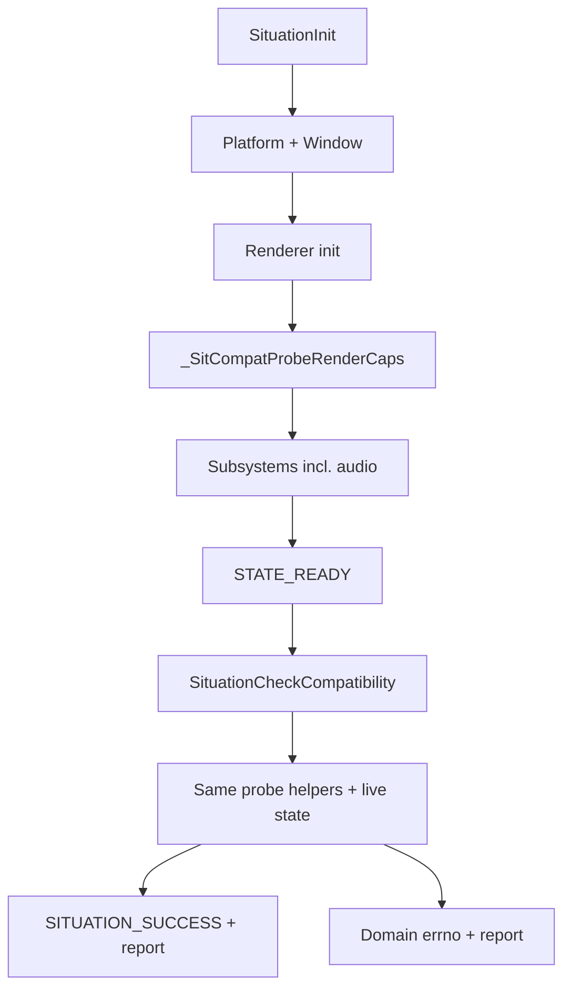

# System Compatibility Check API Plan

**Date:** 2026-06-24  
**Status:** PROPOSED — implementation pending maintainer sign-off  
**Target version:** TBD (suggest **v2.5.x** — new public API + errno entries)  
**Priority:** HIGH — games/apps need a single post-init gate before heavy asset load  
**Risk:** LOW–MEDIUM — mostly read-only probes; refactor init validators into shared helpers  

**Primary files (today):**

| File | Role |
|------|------|
| `sit/situation_api_platform.h` | Lifecycle / system queries — natural home for public API |
| `sit/situation_api_types_system.h` | `SituationCompatCheckFlags`, `SituationCompatOptions` |
| `sit/situation_base_errno.h` | New compatibility errno entries (-15…-19 gap) |
| `sit/situation_impl_ctrl.h` | Public API body, orchestration |
| `sit/situation_impl_renderer.h` | Graphics API + GPU feature probes (extract helpers) |
| `sit/situation_impl_audio.h` | Audio subsystem probes |
| `sit/situation_impl_io.h` | CPU / memory / OS probes |
| `sit/situation_impl_wdm.h` | Platform / display / GLFW state |
| `tests/harness/test_advanced.c` | Integration harness slice |

**Related plans:**

| Plan | Relationship |
|------|----------------|
| [`doc/done/CORE_RENDERER_SPLIT_PLAN.md`](../done/CORE_RENDERER_SPLIT_PLAN.md) | Init already splits ctrl vs renderer; compat orchestrator lives in ctrl |
| [`RENDERER_MODULARIZATION_PLAN.md`](../done/RENDERER_MODULARIZATION_PLAN.md) | Optional `situation_impl_compat.h` slice after renderer split |
| [`renderer_bolster_plan.md`](renderer_bolster_plan.md) | Feature flags (`SIT_FEATURE_*`) feed GPU feature gate |

**Constraint:** Post-init only (`SituationIsInitialized()` must be true). No pre-init probe in v1 (see §Deferred).

---

## Purpose

`SituationInit()` already rejects hard failures (missing GL extension, Vulkan swapchain failure, audio context failure, etc.), but callers lack a **single, explicit, re-runnable compatibility API** that:

1. Confirms the **running instance** still meets baseline or app-specific requirements.
2. Checks **optional GPU features** (bindless, HDR10, compute, etc.) beyond init minimums.
3. Returns a **specific `SituationError` errno** plus a **caller-freed detail string**.
4. Is driven by a **bitfield** so games can request only the domains they care about.

This is not a second init path — it **reuses init-time validation logic** extracted into shared probe helpers and runs them against live subsystem state.

---

## Design principles

- **One public call** — `SituationCheckCompatibility()`.
- **Post-init only** — returns `SITUATION_ERROR_NOT_INITIALIZED` if called early.
- **Bitfield-driven** — `SituationCompatCheckFlags` selects domains; `0` is invalid (use `SIT_COMPAT_BASELINE` minimum).
- **Specific errno on failure** — map each failure to the **best existing domain errno** when one exists; add **new core codes** only for cross-cutting floors (RAM/VRAM/CPU) where no precise code exists today.
- **Rich string report** — `out_reason` is always allocated on success *and* failure (caller frees via `SituationFreeString()`); lists pass/fail per requested flag.
- **Non-destructive** — probes must not tear down subsystems, change window mode, or block the render thread for long periods.
- **Idempotent** — safe to call every frame or on a settings screen; cache nothing that goes stale without a re-call.
- **Backend-neutral public API** — no `GL*` / `Vk*` in signatures.

---

## Proposed public API

### Types (`situation_api_types_system.h`)

```c
/** Domains selectable for SituationCheckCompatibility(). Combine with bitwise OR. */
typedef enum SituationCompatCheckFlags {
    SIT_COMPAT_NONE              = 0,

    SIT_COMPAT_OS                = 1u << 0,  /* Supported OS + version floor */
    SIT_COMPAT_CPU               = 1u << 1,  /* Logical CPUs, arch, optional min clock */
    SIT_COMPAT_MEMORY            = 1u << 2,  /* Physical RAM floor */
    SIT_COMPAT_GPU_HARDWARE      = 1u << 3,  /* GPU present, driver sane, VRAM floor */
    SIT_COMPAT_GRAPHICS_API      = 1u << 4,  /* Active backend: GL 4.6+ / VK 1.4+ runtime, required extensions */
    SIT_COMPAT_AUDIO             = 1u << 5,  /* MiniAudio context + default playback path */
    SIT_COMPAT_THREADING         = 1u << 6,  /* C11 threads / pool / render-thread contract */
    SIT_COMPAT_PLATFORM          = 1u << 7,  /* GLFW window valid, Win32 COM/DXGI if applicable */
    SIT_COMPAT_SUBSYSTEMS        = 1u << 8,  /* Init-state: renderer device, audio ctx, timers alive */

    /** Library minimum — what Situation needs to function on this build. */
    SIT_COMPAT_BASELINE          = (SIT_COMPAT_OS | SIT_COMPAT_CPU | SIT_COMPAT_MEMORY
                                  | SIT_COMPAT_GPU_HARDWARE | SIT_COMPAT_GRAPHICS_API
                                  | SIT_COMPAT_AUDIO | SIT_COMPAT_THREADING
                                  | SIT_COMPAT_PLATFORM | SIT_COMPAT_SUBSYSTEMS),

    /** All defined flags (forward-compatible: unknown high bits ignored on old DLLs). */
    SIT_COMPAT_ALL               = 0xFFFFFFFFu
} SituationCompatCheckFlags;

typedef struct SituationCompatOptions {
    uint32_t check_flags;              /* SituationCompatCheckFlags bitmask */
    uint64_t required_gpu_features;    /* SituationRenderFeature mask; 0 = do not gate optional features */
    uint64_t min_vram_bytes;           /* 0 = use library default (see §Thresholds) */
    uint64_t min_ram_bytes;            /* 0 = use library default */
    uint32_t min_cpu_threads;          /* 0 = use library default (2) */
    uint32_t reserved0;                /* Must be 0 (forward compat) */
    uint64_t reserved1;                /* Must be 0 */
} SituationCompatOptions;

static inline SituationCompatOptions SituationCompatOptionsDefault(uint32_t flags) {
    SituationCompatOptions o = {0};
    o.check_flags = flags;
    return o;
}
```

### Function (`situation_api_platform.h`)

```c
/**
 * Verify that this machine and the initialized Situation instance meet compatibility requirements.
 *
 * @param options   Probe configuration (flags + optional floors / required GPU features).
 *                  NULL → equivalent to SituationCompatOptionsDefault(SIT_COMPAT_BASELINE).
 * @param out_reason [Caller frees via SituationFreeString]
 *                  Human-readable report: per-flag PASS/FAIL lines + primary failure detail.
 *
 * @return SITUATION_SUCCESS if every requested check passes.
 * @return SITUATION_ERROR_NOT_INITIALIZED if SituationInit() has not completed successfully.
 * @return SITUATION_ERROR_INVALID_PARAM if options are NULL with invalid flags, or out_reason is NULL.
 * @return Domain-specific errno for the primary failure (see §Errno mapping).
 *
 * @note Main thread only. Does not modify GPU/window/audio state.
 * @note On failure, also sets the global last-error message (SituationGetLastErrorMsg) to the primary failure line.
 */
SITAPI SituationError SituationCheckCompatibility(
    const SituationCompatOptions* options,
    char** out_reason);
```

---

## Semantics

### Call contract

| Condition | Behaviour |
|-----------|-----------|
| `!SituationIsInitialized()` | `SITUATION_ERROR_NOT_INITIALIZED`, no report |
| `out_reason == NULL` | `SITUATION_ERROR_INVALID_PARAM` |
| `options == NULL` | Run `SIT_COMPAT_BASELINE` with default floors |
| `check_flags == 0` | `SITUATION_ERROR_INVALID_PARAM` ("no checks requested") |
| Unknown high bits in `check_flags` | Ignored (forward compat) |
| All requested checks pass | `SITUATION_SUCCESS`, report lists PASS lines |
| One or more checks fail | **Primary** failing domain's errno (see below), report lists **all** FAIL lines |

### Primary errno selection (when multiple flags fail)

Evaluate checks in **fixed order** (table below). Return the errno of the **first failing** check. The full report still documents every failure.

| Order | Flag | Primary errno (examples) |
|-------|------|--------------------------|
| 1 | `SIT_COMPAT_OS` | `SITUATION_ERROR_NOT_IMPLEMENTED` (unsupported OS) or new `SITUATION_ERROR_COMPAT_OS_UNSUPPORTED` |
| 2 | `SIT_COMPAT_PLATFORM` | `SITUATION_ERROR_GLFW_FAILED`, `SITUATION_ERROR_COM_FAILED`, `SITUATION_ERROR_WINDOW_CREATION_FAILED` |
| 3 | `SIT_COMPAT_SUBSYSTEMS` | `SITUATION_ERROR_INIT_FAILED`, `SITUATION_ERROR_SHUTDOWN_INCOMPLETE` (if torn down) |
| 4 | `SIT_COMPAT_CPU` | new `SITUATION_ERROR_COMPAT_CPU_INSUFFICIENT` |
| 5 | `SIT_COMPAT_MEMORY` | new `SITUATION_ERROR_COMPAT_MEMORY_INSUFFICIENT` |
| 6 | `SIT_COMPAT_GPU_HARDWARE` | `SITUATION_ERROR_DEVICE_QUERY`, new `SITUATION_ERROR_COMPAT_VRAM_INSUFFICIENT` |
| 7 | `SIT_COMPAT_GRAPHICS_API` | `SITUATION_ERROR_OPENGL_UNSUPPORTED_VERSION`, `SITUATION_ERROR_OPENGL_UNSUPPORTED`, `SITUATION_ERROR_VULKAN_UNSUPPORTED` |
| 8 | `SIT_COMPAT_AUDIO` | `SITUATION_ERROR_AUDIO_BACKEND_INIT_FAILED`, `SITUATION_ERROR_AUDIO_DEVICE_INIT_FAILED` |
| 9 | `SIT_COMPAT_THREADING` | `SITUATION_ERROR_THREAD_NOT_AVAILABLE`, `SITUATION_ERROR_THREAD_CREATION_FAILED` |
| 10 | `required_gpu_features` mask | `SITUATION_ERROR_NOT_IMPLEMENTED` or new `SITUATION_ERROR_COMPAT_GPU_FEATURE_MISSING` |

### Report string format (stable, parse-friendly)

```
Situation compatibility: FAIL (primary: OpenGL version 4.3 < required 4.6)
  [PASS] OS: Windows 11 10.0.22631
  [PASS] PLATFORM: GLFW window valid
  [PASS] SUBSYSTEMS: renderer+audio alive
  [PASS] CPU: 16 threads (min 2)
  [PASS] MEMORY: 32768 MiB available (min 4096 MiB)
  [FAIL] GRAPHICS_API: GL 4.3.0 — requires 4.6+ and GL_ARB_direct_state_access
  [PASS] AUDIO: WASAPI playback context
  [PASS] THREADING: render thread active
```

On success, `primary:` line is omitted or reads `OK`.

---

## Per-domain check specification

### `SIT_COMPAT_OS`

**Goal:** OS is in the supported matrix for this DLL build.

| Platform | Pass criteria (initial) |
|----------|-------------------------|
| Windows | Windows 10 build ≥ 19041 (or project floor TBD at sign-off) |
| Linux | glibc ≥ 2.31, X11 or Wayland via GLFW |
| macOS | 11.0+ (MoltenVK path when VK build) |

**Implementation:** `SituationGetOSInfo()` + version parse helpers in `situation_impl_io.h`.  
**Reuse:** None from init (platform init is earlier); mirror `_SituationInitPlatform` guards.

---

### `SIT_COMPAT_PLATFORM`

**Goal:** Windowing stack healthy after init.

| Probe | Source |
|-------|--------|
| `sit_gs.sit_glfw_window != NULL` | decl |
| GLFW error callback clear / `glfwGetError` | wdm |
| Win32: `sit_gs.is_com_initialized` when DXGI queries used | ctrl/io |
| Display enumeration: `SituationGetDisplayCount() > 0` or headless exception flag (future) | wdm |

**Reuse:** Partial — same invariants `SituationInit` assumes after step 2b.

---

### `SIT_COMPAT_SUBSYSTEMS`

**Goal:** Critical subsystems initialized and not mid-shutdown.

| Probe | Pass |
|-------|------|
| `SituationGetInitState() == SITUATION_STATE_READY` | ctrl |
| Renderer backend device/context non-null | renderer decl |
| `sit_audio.is_miniaudio_context_initialized` | audio |
| Timer system `sit_gs.timer_system_instance` valid | ctrl |

**Reuse:** Mirrors post-init invariants checked implicitly today.

---

### `SIT_COMPAT_CPU`

**Goal:** Enough CPU for main + render + audio + IO reservation.

| Probe | Default floor |
|-------|---------------|
| `SituationGetCPUInfo().thread_count` | ≥ `min_cpu_threads` (default **2**) |
| Optional: physical core count via topology | warn-only in v1 |

**Implementation:** `SituationGetCPUInfo()`, `SituationRefreshCpuTopology()` data if already cached at init.

---

### `SIT_COMPAT_MEMORY`

**Goal:** Physical RAM sufficient for staging buffers + audio + baseline assets.

| Probe | Default floor |
|-------|---------------|
| `SituationGetMemoryInfo().available_bytes` | ≥ `min_ram_bytes` (default **4 GiB**) |

**Note:** Use **available**, not total — VMs and background apps matter.

---

### `SIT_COMPAT_GPU_HARDWARE`

**Goal:** Discrete/integrated GPU visible with adequate VRAM for backend.

| Probe | GL | VK |
|-------|----|----|
| Device name non-empty | `SituationGetGPUInfo()` / `glGetString(GL_RENDERER)` | `VkPhysicalDeviceProperties` |
| Dedicated VRAM | DXGI on Win32 | `VkPhysicalDeviceMemoryProperties` heap 1 |
| VRAM floor | `min_vram_bytes` default **1 GiB** (sign-off) | same |

**Errno:** `SITUATION_ERROR_DEVICE_QUERY` if name/VRAM unreadable; `SITUATION_ERROR_COMPAT_VRAM_INSUFFICIENT` if below floor.

---

### `SIT_COMPAT_GRAPHICS_API`

**Goal:** Active backend meets Situation **library minimum** (not app optional features).

**Extract shared helpers from init** (single source of truth):

| Helper (new, internal) | Current source | Checks |
|------------------------|----------------|--------|
| `_SitCompatProbeGLBaseline(char* detail, size_t n)` | `_SituationInitOpenGL` ~4370+ | GL ≥ 4.6, `GL_ARB_direct_state_access`, core profile |
| `_SitCompatProbeVKBaseline(char* detail, size_t n)` | `_SituationInitVulkan` extension lists | Instance/device extensions, swapchain surfaces, API version ≥ 1.4 packed |
| `_SitCompatProbeRenderCaps(void)` | `_SituationValidateRenderCaps` | VK semaphore create/destroy smoke |

**Post-init behaviour:** Read cached glad/VK state + live `SituationGetGraphicsCaps()`; run lightweight smoke (semaphore test) only when `SIT_COMPAT_GRAPHICS_API` requested — not every frame by default in apps.

**Existing errno reuse:**

- `SITUATION_ERROR_OPENGL_UNSUPPORTED_VERSION` — GL too old  
- `SITUATION_ERROR_OPENGL_UNSUPPORTED` — missing DSA / critical extension  
- `SITUATION_ERROR_VULKAN_UNSUPPORTED` — missing device extension / layer  
- `SITUATION_ERROR_VULKAN_SYNC_OBJECT_FAILED` — semaphore probe fails  

---

### `SIT_COMPAT_AUDIO`

**Goal:** Audio path usable for playback (matches what `_SituationInitSubsystems` established).

| Probe | Pass |
|-------|------|
| `sit_audio.is_miniaudio_context_initialized` | true |
| Optional active probe | `ma_context_get_devices` playback count ≥ 1 |
| If `SITUATION_INIT_AUDIO_CAPTURE_MAIN_THREAD` was set at init | capture device enumeration ≥ 1 (warn vs fail — **fail** in v1 if capture was requested) |

**Reuse:** Extract `_SitCompatProbeAudioBaseline()` from `_SituationInitSubsystems` ma_context path.

**Errno:** `SITUATION_ERROR_AUDIO_BACKEND_INIT_FAILED`, `SITUATION_ERROR_AUDIO_DEVICE_INIT_FAILED`, `SITUATION_ERROR_AUDIO_CAPTURE_NOT_AVAILABLE`.

---

### `SIT_COMPAT_THREADING`

**Goal:** Threading contract matches build flags.

| Build | Probe |
|-------|-------|
| `SITUATION_ENABLE_RENDER_THREAD` | render thread running if `init_info.render_thread_count > 0` or default policy |
| `SITUATION_ENABLE_THREADING` | pool mutexes initialized |
| All | `thrd_current` main thread ID recorded |

**Errno:** `SITUATION_ERROR_THREAD_NOT_AVAILABLE`, `SITUATION_ERROR_THREAD_CREATION_FAILED`.

---

### `required_gpu_features` (optional gate)

When `options->required_gpu_features != 0`, after baseline graphics checks:

```c
for each bit in required_gpu_features:
    if (!SituationIsFeatureSupported(bit))
        fail with SITUATION_ERROR_COMPAT_GPU_FEATURE_MISSING
```

Report lists missing feature names (map `SIT_FEATURE_*` → string table).

**Distinct from `SIT_COMPAT_GRAPHICS_API`:** baseline proves Situation can run; feature mask proves **your game** can run (bindless, HDR10, etc.).

---

## Default thresholds (sign-off TBD)

| Field | Proposed default | Rationale |
|-------|------------------|-----------|
| `min_cpu_threads` | 2 | main + render minimum |
| `min_ram_bytes` | 4 GiB | staging + OS headroom |
| `min_vram_bytes` | 1 GiB | textures + swapchain + VD |
| GL version | 4.6 | matches `SituationGraphicsCaps.api_version_packed` |
| VK version | 1.4 | matches packed target |

Document finals in `situation_sdk.md` when shipped.

---

## New errno entries (`situation_base_errno.h`)

Use gap **-15…-19** in `SITUATION_ERRORS_CORE`:

```c
X(SITUATION_ERROR_COMPAT_OS_UNSUPPORTED,       -15, "Operating system or version below supported floor")
X(SITUATION_ERROR_COMPAT_CPU_INSUFFICIENT,     -16, "CPU thread count or topology below minimum")
X(SITUATION_ERROR_COMPAT_MEMORY_INSUFFICIENT,  -17, "Available system RAM below minimum")
X(SITUATION_ERROR_COMPAT_VRAM_INSUFFICIENT,    -18, "GPU dedicated VRAM below minimum")
X(SITUATION_ERROR_COMPAT_GPU_FEATURE_MISSING,  -19, "Required SituationRenderFeature not supported on this GPU")
```

**Prefer existing domain errno** when the failure already maps cleanly (e.g. GL version → `SITUATION_ERROR_OPENGL_UNSUPPORTED_VERSION`). New codes are for floors and feature gates without a precise existing code.

Run `scripts/audit_errno.ps1` after adding entries.

---

## Implementation layout

### Phase 0 — API sign-off

- [ ] Maintainer confirms: post-init only, primary errno ordering, default floors.
- [ ] Confirm `SituationCompatOptions` reserved fields for future (`min_gl_version`, per-app VK extensions).

### Phase 1 — Extract probe helpers (no public API yet)

- [ ] `_SitCompatProbeGLBaseline` ← refactor from `_SituationInitOpenGL` validation block  
- [ ] `_SitCompatProbeVKBaseline` ← refactor from Vulkan instance/device extension validation  
- [ ] `_SitCompatProbeRenderCaps` ← rename/generalize `_SituationValidateRenderCaps`  
- [ ] `_SitCompatProbeAudioBaseline` ← from `_SituationInitSubsystems` audio block  
- [ ] `_SitCompatProbeOS` / `_SitCompatProbePlatform` / `_SitCompatProbeCPU` / `_SitCompatProbeMemory` / `_SitCompatProbeGPUHardware` / `_SitCompatProbeThreading`  
- [ ] Init paths call the same helpers (init failure = compat failure at boot)  
- [ ] Forward decls in `situation_impl_forward.h` or new `situation_impl_compat.h`  

**Files:** optional new `sit/situation_impl_compat.h` (~800 lines) included from `situation_impl.h` before `situation_impl_ctrl.h`.

### Phase 2 — Public API

- [ ] Types in `situation_api_types_system.h`  
- [ ] `SITAPI` declaration in `situation_api_platform.h`  
- [ ] `SituationCheckCompatibility` body in `situation_impl_ctrl.h` (or `situation_impl_compat.h`)  
- [ ] Report builder `_SitCompatFormatReport(...)`  
- [ ] Trace hook `SIT_TRACE_SituationCheckCompatibility` in `situation_base_trace.h`  
- [ ] `SituationErrorToString` automatically picks up new errno via X-macro  

### Phase 3 — Tests

- [ ] Harness: `test_compat_baseline_pass` — after init, `SIT_COMPAT_BASELINE` → SUCCESS on CI GPU  
- [ ] Harness: `test_compat_invalid_flags` — zero flags → `INVALID_PARAM`  
- [ ] Harness: `test_compat_not_initialized` — call before init  
- [ ] Harness: `test_compat_feature_gate` — require `SIT_FEATURE_BINDLESS_TEXTURES` on known-capable GPU; skip tag on weak IGP  
- [ ] Mock floor: `min_ram_bytes` impossibly high → `COMPAT_MEMORY_INSUFFICIENT`  

### Phase 4 — Documentation

- [ ] `doc/situation_sdk.md` — API section + example snippet  
- [ ] `doc/UPDATELOG.md` / `doc/whatsnew.md`  
- [ ] Cross-link from `renderer_bolster_plan.md` (feature gating)  

---

## Example usage

```c
SituationInitInfo info = SituationInitInfoDefault(1280, 720, "My Game");
if (SituationInit(argc, argv, &info) != SITUATION_SUCCESS) { /* handle */ }

SituationCompatOptions opts = SituationCompatOptionsDefault(SIT_COMPAT_BASELINE);
opts.required_gpu_features = SIT_FEATURE_COMPUTE_SHADER | SIT_FEATURE_BINDLESS_TEXTURES;
opts.min_vram_bytes = 2ull * 1024 * 1024 * 1024;

char* report = NULL;
SituationError err = SituationCheckCompatibility(&opts, &report);
if (err != SITUATION_SUCCESS) {
    fprintf(stderr, "Incompatible (%d): %s\n", (int)err, report ? report : SituationErrorToString(err));
    SituationFreeString(report);
    /* show UI or exit */
}
SituationFreeString(report);
```

---

## Relationship to `SituationInit`



After Phase 1, **init and compat share probe helpers** — no duplicated version/extension tables.

---

## Non-goals (v1)

- [ ] Pre-init compatibility probe (`SituationCheckCompatibility` before `SituationInit`) — deferred §Future.
- [ ] Automatic compat check inside `SituationInit` — init keeps its hard gates; compat is opt-in.
- [ ] Per-monitor / VR / multi-GPU selection policy.
- [ ] Downloading drivers or changing OS settings.
- [ ] Replacing `SituationIsFeatureSupported` — compat **calls** it for feature masks.

---

## Deferred / future

| Item | Notes |
|------|-------|
| **Pre-init probe** | `SituationProbeCompatibility(flags)` without window — needs headless EGL/VK/MA context; separate API |
| **`SituationCompatResult` struct** | Per-flag `SituationError` array for machine parsing without string scrape |
| **Headless / CI mode** | `SIT_COMPAT_PLATFORM` relaxations when `SITUATION_HEADLESS` defined |
| **Cached compat snapshot** | `SituationGetLastCompatReport()` if apps poll rarely |

---

## Success criteria

- [ ] Single `SituationCheckCompatibility()` call after init.  
- [ ] Bitfield selects OS, CPU, memory, GPU hardware, graphics API, audio, threading, platform, subsystems.  
- [ ] Returns `SITUATION_SUCCESS` (0) or specific `SituationError`.  
- [ ] Allocates human-readable `out_reason` (caller frees).  
- [ ] Init validation logic deduplicated into shared probes.  
- [ ] GL + VK harness tests green.  

---

## Revision history

| Date | Change |
|------|--------|
| 2026-06-24 | Initial plan |