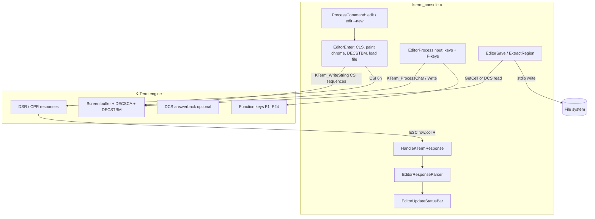

# Console Embedded Text Editor — Design Plan

**Status:** proposed (not started)  
**Scope:** Design and implement a full-screen text editor embedded in **KaOS Terminal** (`examples/kterm_console.c`), driven entirely by **K-Term terminal buffer commands** and **answerback / response parsing**. No separate GUI widget layer.  
**Host:** `examples/kterm_console.c` (canonical console — see [CONSOLE_MERGE_DEPRECATION_PLAN.md](CONSOLE_MERGE_DEPRECATION_PLAN.md))  
**Engine:** `sit/k-term/` (buffer, DECSCA, DECSTBM, DSR/CPR, function keys, response sink)  
**Related plans:** [KTERM_CONSOLE_GOALS_PLAN.md](KTERM_CONSOLE_GOALS_PLAN.md), [KTERM_CONSOLE_RENDERING_BUGFIX_PLAN.md](KTERM_CONSOLE_RENDERING_BUGFIX_PLAN.md)

---

## How to use this file

- [ ] Read **§ Design principles**, **§ Screen layout**, and **§ Terminal command reference** before writing code.
- [ ] Implement phases in order; do not wire F-key actions until answerback parser is solid.
- [ ] Log shipped work in `sit/k-term/doc/updatelog.md` (K-Term product), not Situation `UPDATELOG.md`.

---

## Executive summary

Build a **buffer-native editor** inside the existing K-Term console. The user invokes `edit <file>` (existing) or `edit --new <file>` (new). The editor:

1. **Clears** the visible terminal page.
2. **Protects** the top status row and bottom function-key row (`DECSCA`).
3. **Confines scrolling** to the middle edit region (`DECSTBM`).
4. **Loads** the full file into the editable buffer area.
5. **Places** the cursor at the top-left of the edit region (row 2, column 1, 1-based).
6. **Updates** the status bar (chars, lines, cursor line/col, filename) as the user edits.
7. **Maps** F-keys on the bottom row to Save, Undo-to-last-save, Find, Replace, Copy, Paste, Exit.

The hard part is not drawing rows — K-Term already supports protected cells, scroll margins, CSI paint, and function keys. The hard part is **answerback expertise**: when the host needs cursor position, buffer snapshots, or confirmation from the terminal, it must **tokenize response streams correctly** and never corrupt partial escape sequences.

---

## Design principles

### 1. Buffer-first, not widget-first

| Do | Don't |
|----|-------|
| Send CSI/DEC sequences via `KTerm_WriteString` | Build a separate ImGui/SDL text field |
| Edit in the live screen buffer | Maintain a shadow UI that only mirrors buffer |
| Use `DECSCA` + `DECSTBM` for chrome vs edit area | Redraw chrome every keystroke by clearing screen |
| Use F-keys (`KTerm_DefineFunctionKey` or raw `KTERM_KEY_Fn`) for commands | Require typed `:w` commands for v1 |

### 2. Answerback-first queries

When the host needs state from K-Term, prefer **terminal responses** over direct struct poking:

| Need | Mechanism | Response shape |
|------|-----------|----------------|
| Cursor position | `CSI 6 n` (DSR CPR) | `ESC [ row ; col R` |
| Device ready | `CSI 5 n` | `ESC [ 0 n` |
| Custom bulk read (save) | **New:** `DCS $ q editor;read;… ST` (see § Answerback protocol) | `DCS … ST` answerback payload |
| Rect checksum (optional verify) | `CSI … * y` (DECRQCRA) | checksum report |

Direct `KTerm_GetCell()` may be used **internally** during save as a fallback, but the **console response parser** must be the primary integration path so shell mode, multi-session routing, and future remote hosts behave the same.

### 3. Tokenize before you trust

`HandleKTermResponse` today parses CPR opportunistically for the prompt. The editor needs a **formal response lexer**:

- Consume **exact byte counts** per recognized sequence.
- Support **multiple responses in one sink callback** (CPR + DA + mouse in one chunk).
- Never treat `ESC [` as CPR unless final byte is in `@–~` range and params parse.
- Use a **pending-query registry**: each outbound query gets an ID; parser routes responses to the right waiter.
- Reuse K-Term's re-entrant tokenizer philosophy (`KTermLexer`, `KTerm_Strtok` in gateway) — **do not use `strtok`** on response buffers.

---

## Screen layout

Terminal dimensions: `term->cols` × `term->rows` (dynamic on resize).

```
┌──────────────────────────────────────────────────────────────────┐
│ ROW 1  [STATUS — PROTECTED, INVERSE/COLOR]                       │
│ Chars: 1234  Lines: 42  Cursor: 3:15  File: notes.txt            │
├──────────────────────────────────────────────────────────────────┤
│ ROW 2                                                            │
│ ROW 3         EDIT REGION (unprotected, scrollable)              │
│  ...          DECSTBM top=2 bottom=rows-1                        │
│ ROW rows-1                                                       │
├──────────────────────────────────────────────────────────────────┤
│ ROW rows [FN BAR — PROTECTED]                                    │
│ F1 Save  F2 Undo  F3 Find  F4 Replace  F5 Copy  F6 Paste  F8 Exit│
└──────────────────────────────────────────────────────────────────┘
```

### Row roles

| Row(s) | Role | Protection | Scroll |
|--------|------|------------|--------|
| 1 | Status bar | `DECSCA 1` (protected) | Never scrolls |
| 2 … rows−1 | Document buffer | `DECSCA 0` (editable) | `DECSTBM 2 ; rows−1` |
| rows | Function key bar | `DECSCA 1` (protected) | Never scrolls |

**Cursor home on entry:** row 2, column 1 (1-based). With `DECOM` (origin mode), CPR reports relative to scroll region — account for this in status display (show **document** line/col, not DECOM-relative unless DECOM is off).

---

## Terminal command reference (screen space & buffer manipulation)

This section is the **implementation cheat sheet**. All sequences are sent via `KTerm_WriteString()` unless noted. `ESC` = `\x1B`. Row/col are **1-based** unless marked 0-based.

Notation: `{rows}` = `term->rows`, `{cols}` = `term->cols`, `{edit_top}` = 2, `{edit_bot}` = `{rows} - 1`.

### Quick map — editor lifecycle

| Phase | Commands |
|-------|----------|
| Enter | `ED` (clear) → paint chrome → `DECSCA 1` + write status/fn rows → `DECSTBM` → `DECOM` on → load text → `CUP` home → `DSR CPR` |
| Edit | printable chars, `CUF/CUB/CUU/CUD`, `IL/DL`, `EL`, `SU/SD` (all confined by margins + protection) |
| Status refresh | `CUP` row 1 → `DECSCA 0` → `EL` → rewrite → `DECSCA 1` |
| Save/readback | `DCS $ q editor;read;… ST` (Phase 5) or host `KTerm_GetCell()` fallback |
| Exit | `DECSTBM` reset → `DECOM` off → `ED` → restore prompt → `DSR CPR` |

### 1. Clear screen & erase

| Purpose | Sequence | Name | Notes |
|---------|----------|------|-------|
| Clear visible page | `\x1B[2J` | ED (erase display) | Entire screen buffer visible area |
| Clear + home | `\x1B[2J\x1B[H` | ED + CUP | Same as above + cursor (1,1) |
| API equivalent | `KTerm_ClearScreen(term, false)` | — | Preferred on enter; `true` wipes scrollback too |
| Erase to EOL | `\x1B[K` | EL | Status bar partial refresh |
| Erase whole line | `\x1B[2K` | EL Ps=2 | Rewrite status/fn row in place |
| Erase below cursor | `\x1B[J` | ED Ps=0 | Rare; avoid on protected rows |

### 2. Cursor positioning (CUP / HVP)

| Purpose | Sequence | Name | Example |
|---------|----------|------|---------|
| Absolute move | `\x1B[{row};{col}H` | CUP | `\x1B[1;1H` = top-left |
| Status bar | `\x1B[1;1H` | CUP | Before painting row 1 |
| Fn bar | `\x1B[{rows};1H` | CUP | Before painting bottom row |
| Edit home | `\x1B[2;1H` | CUP | Without DECOM |
| Edit home (DECOM) | `\x1B[H` | CUP | With DECOM + DECSTBM active → row 2 col 1 |
| Cursor forward | `\x1B[{n}C` | CUF | |
| Cursor back | `\x1B[{n}D` | CUB | |
| Cursor down | `\x1B[{n}B` | CUD | |
| Cursor up | `\x1B[{n}A` | CUU | |
| Save/restore cursor | `\x1B7` / `\x1B8` | DECSC / DECRC | Optional around status bar rewrite |

### 3. Scroll region (DECSTBM) — confines edit space

| Purpose | Sequence | Name | Notes |
|---------|----------|------|-------|
| Set edit margins | `\x1B[{edit_top};{edit_bot}r` | DECSTBM | Example 24 rows: `\x1B[2;23r` |
| Reset full screen | `\x1B[r` | DECSTBM reset | **Required on exit** |
| Effect | — | — | `RI/IND`, `IL/DL`, newline scroll only between top/bottom |
| Rows 1 and `{rows}` | — | — | Outside region; do not scroll |

**Order matters:** paint chrome rows **before** or **after** DECSTBM depending on whether you want margins to include them — **exclude them**: set DECSTBM to `{edit_top};{edit_bot}` after painting rows 1 and `{rows}`.

### 4. Character protection (DECSCA) — lock chrome rows

K-Term `DECSCA` is **not** rectangular — it sets the **attribute applied to the next characters written**:

| Purpose | Sequence | Name | Notes |
|---------|----------|------|-------|
| Next writes protected | `\x1B[1"q` | DECSCA 1 | Cells get `KTERM_ATTR_PROTECTED` |
| Next writes editable | `\x1B[2"q` | DECSCA 0/2 | Default for document body |
| Also accepted | `\x1B[0"q` | DECSCA 0 | Unprotected |

**Correct pattern to protect status row:**

```
CUP 1;1
DECSCA 1          // \x1B[1"q
SGR + write text  // entire row inherits PROTECTED
DECSCA 2          // \x1B[2"q  — reset before edit region
```

Repeat for fn bar at row `{rows}`. Protected cells resist `ICH`, `DCH`, `IL`, `DL`, and scroll displacement (K-Term hardened).

**Status bar rewrite:** move to row 1 → `DECSCA 2` → `EL 2K` → rewrite text → `DECSCA 1` on that row again.

Optional: Gateway `SET;CURSOR;SKIP_PROTECT=1` so arrow/tab skip protected cells (forms mode).

### 5. Origin mode (DECOM) — edit-relative coordinates

| Purpose | Sequence | Name | Notes |
|---------|----------|------|-------|
| Enable | `\x1B[?6h` | DECSET 6 | `(0,0)` = top-left of **scroll region** |
| Disable | `\x1B[?6l` | DECRESET 6 | **Required on exit** |
| CPR with DECOM | `\x1B[6n` | DSR CPR | Response row/col are **relative to scroll region** |
| Document coords | — | — | Add `{edit_top - 1}` to CPR row for status display |

Enable DECOM **after** DECSTBM so `\x1B[H` lands at edit home.

### 6. Insert / delete / scroll (line editing)

All respect `DECSTBM` margins and skip/block on `DECSCA` protected cells.

| Purpose | Sequence | Name | Use in editor |
|---------|----------|------|---------------|
| Insert line(s) | `\x1B[{n}L` | IL | Enter at bottom of region pushes lines down |
| Delete line(s) | `\x1B[{n}M` | DL | Delete row merge |
| Insert chars | `\x1B[{n}@` | ICH | Insert mode |
| Delete chars | `\x1B[{n}P` | DCH | Backspace/delete |
| Scroll up | `\x1B[{n}S` | SU | PgUp effect in region |
| Scroll down | `\x1B[{n}T` | SD | PgDn effect in region |
| Reverse index | `\x1B M` | RI | SS3 — scroll up one at top margin |
| Forward index | `\x1B D` | IND | Line feed + scroll |

### 7. Attributes & modes (paint chrome)

| Purpose | Sequence | Name | Example |
|---------|----------|------|---------|
| Bold | `\x1B[1m` | SGR | Status bar |
| Cyan fg | `\x1B[36m` | SGR | Status bar |
| Inverse | `\x1B[7m` | SGR | Fn bar highlight |
| Reset attrs | `\x1B[0m` | SGR | After chrome paint |
| Combined | `\x1B[1;36;7m` | SGR | Bold cyan inverse |
| Find highlight | `\x1B[43m` | SGR bg yellow | Match highlight (restore after) |
| Insert mode on | `\x1B[4h` | SM | Optional |
| Insert mode off | `\x1B[4l` | RM | Default replace mode |
| Autowrap on | `\x1B[?7h` | DECSET 7 | Soft wrap at `{cols}` |
| Autowrap off | `\x1B[?7l` | DECRESET 7 | Horizontal scroll feel |

### 8. Queries & answerbacks (host ← terminal)

| Need | Host sends | Terminal responds | Parse as |
|------|------------|-------------------|----------|
| Cursor position | `\x1B[6n` | `\x1B[{row};{col}R` | CPR — tokenize `row`, `col` between `[` and `R` |
| Terminal OK | `\x1B[5n` | `\x1B[0n` | DSR |
| Active screen size | `\x1B[?30n` | `\x1B[?30;{id};{max};{cols};{rows}n` | K-Term extension |
| Rect checksum | `\x1B[{t};{l};{b};{r}*y` | DECRQCRA report | Verify only |
| Bulk read (Phase 5) | `\x1BP$qeditor;read;{t};{l};{b};{r}\x1B\\` | `\x1B P 1 $ r … \x1B\\` | DCS ST-terminated |
| Line read (Phase 5) | `\x1BP$qeditor;line;{n}\x1B\\` | `\x1B P 1 $ r … \x1B\\` | DCS ST-terminated |
| ENQ answerback | `\x05` | configured `answerback_buffer` | Legacy — not primary for editor |

**CPR + DECOM:** if origin mode on, `{row}` in `\x1B[{row};{col}R` is scroll-relative; convert to absolute: `abs_row = row + edit_top - 1`.

### 9. K-Term API shortcuts (when sequences are awkward)

| API | Replaces / complements |
|-----|------------------------|
| `KTerm_ClearScreen(term, false)` | `\x1B[2J` |
| `KTerm_WriteString(term, seq)` | Any CSI/DCS burst |
| `KTerm_WriteChar(term, c)` | Document typing |
| `KTerm_GetCell(term, x, y)` | Save fallback — **0-based** x,y |
| `KTerm_DefineFunctionKey(term, n, seq)` | F-key → unique host sequence |
| `KTerm_SetOutputSink(term, cb, ctx)` | Receive answerbacks (`HandleKTermResponse`) |

### 10. Gateway commands (optional fast path)

Requires gateway enabled. Useful for bulk chrome paint or masked fills; not required for v1.

| Command | Purpose |
|---------|---------|
| `DCS GATE EXT;grid;fill;… ST` | Fill rectangle with char + attrs |
| `DCS GATE EXT;grid;banner;… ST` | Draw labeled banner row quickly |
| `DCS GATE SET;CURSOR;SKIP_PROTECT=1 ST` | Skip protected cells on cursor move |
| `DCS GATE SET;GRID;… ST` | Overlay grid (debug) |

Design mode: gateway grid ops can overwrite protected cells — use only for chrome setup, then `DECSCA 1` writes.

### 11. Suggested enter/exit scripts (copy-paste templates)

**Enter** (substitute `{rows}`, `{cols}`, `{edit_bot}`):

```
\x1B[2J                          // clear
\x1B[1;1H\x1B[1;36;7m             // status: home + bold cyan inverse
\x1B[1"q …status text… \x1B[0m   // protected status row
\x1B[{rows};1H\x1B[7m             // fn bar: home + inverse
\x1B[1"q …F1 Save… \x1B[0m        // protected fn row
\x1B[2"q                          // unprotected for document
\x1B[2;{edit_bot}r               // DECSTBM
\x1B[?6h                          // DECOM
\x1B[?7h                          // autowrap
… KTerm_WriteString file body …
\x1B[2;1H                          // or \x1B[H with DECOM
\x1B[6n                           // query cursor
```

**Exit:**

```
\x1B[r                            // DECSTBM reset
\x1B[?6l                          // DECOM off
\x1B[2J                           // clear editor view
… restore KaOS prompt …
\x1B[6n                           // CPR for prompt position
```

### 12. Sequences to avoid / common mistakes

| Mistake | Correct approach |
|---------|------------------|
| Using `\x1B[1;{cols};1;1$r` for protection | That is **not** DECSCA — use `\x1B[1"q` before writing the row |
| `DECSTBM` before painting chrome | Chrome rows end up inside scroll region |
| CPR row used directly in status with DECOM | Add scroll-region offset |
| `CSI 2J` on every keystroke | Rewrite row 1 only (`EL 2K` + CUP) |
| Typing into row 1 without DECSCA | User can corrupt status bar if row unprotected |

---

## Entry modes

| Command | Behavior |
|---------|----------|
| `edit <path>` | Open existing file; error if missing (or offer empty — pick one, see Open questions) |
| `edit --new <path>` | Create/truncate-on-save new file; start with empty edit region |
| `edit` (no args) | **Defer v1** or open `[No Name]` scratch buffer |

### Editor session struct (host-side)

Add to `kterm_console.c` (or `examples/console_editor.h` if extracted later):

```c
typedef struct {
    bool active;
    bool dirty;
    bool new_file;
    char filepath[512];
    char last_saved_snapshot_hash[64]; /* or full snapshot buffer for Undo */
    int edit_top_row;      /* 2 */
    int edit_bottom_row;   /* term->rows - 1 */
    int char_count;
    int line_count;
    int cursor_row;        /* document coords */
    int cursor_col;
    EditorQueryState query; /* answerback waiter */
} ConsoleEditor;
```

---

## Startup sequence (buffer commands)

Executed by `EditorEnter(KTerm* term, const char* path, bool is_new)`:

- [ ] **E.1** Set `console.editor.active = true`; disable normal CLI prompt/input.
- [ ] **E.2** Clear visible page: `KTerm_ClearScreen(term, false)` or `CSI 2 J` + `CSI H` (home).
- [ ] **E.3** Paint **status bar** (row 1):
  - Move: `CSI 1 ; 1 H`
  - SGR: bold + color (e.g. `CSI 1 ; 36 m` cyan) + inverse optional
  - Text: formatted stats + filename (truncate middle if too long)
  - Protect row: `CSI 1 " q` (`\x1B[1"q`) **before** writing status text (see § Terminal command reference)
- [ ] **E.4** Paint **function bar** (row `term->rows`):
  - Labels: `F1 Save  F2 Undo  F3 Find  F4 Replace  F5 Copy  F6 Paste  F8 Exit`
  - Protect row: `DECSCA 1`
- [ ] **E.5** Set scroll region: `CSI 2 ; {rows-1} r` (`DECSTBM`).
- [ ] **E.6** Enable origin mode if desired: `CSI ? 6 h` (`DECOM`) so home is edit region top-left.
- [ ] **E.7** Load file content into edit region:
  - Read file from disk (host OS — only I/O outside buffer).
  - Write via `KTerm_WriteString` with `\r\n` or `\n` normalized to terminal newlines.
  - If content exceeds visible rows, only first page visible; scrollback/history for full doc — see § Large files.
- [ ] **E.8** Place cursor: `CSI 2 ; 1 H` (or `CSI H` with DECOM).
- [ ] **E.9** Request CPR (`CSI 6 n`); parse in answerback handler; confirm `cursor_row/col` for status bar.
- [ ] **E.10** Switch input routing to `EditorProcessInput` instead of CLI line editor.

### DECSCA strategy (protected chrome)

K-Term implements hardened `DECSCA` (protected cells block ICH/DCH/scroll overwrite). Two viable approaches:

| Approach | Pros | Cons |
|----------|------|------|
| **A. Row paint + DECSCA 1 on each cell in rows 1 and rows** | Pure VT; works without gateway | More sequences on resize |
| **B. Gateway `EXT;grid` banner for chrome, then DECSCA** | Fast bulk paint | Requires gateway enabled |

**Recommendation:** Approach A for v1 (simpler, fewer moving parts). On resize, re-run full `EditorRelayout()`.

---

## Input model

While `editor.active`:

| Input | Action |
|-------|--------|
| Printable keys | Insert/replace in buffer (K-Term normal char path) |
| Enter | New line in edit region |
| Backspace / Delete | Local editing (respect protected skip — cursor must not enter rows 1 or rows) |
| Arrow keys | Move cursor; clamp to edit region |
| PgUp/PgDn | Scroll edit region within `DECSTBM` |
| F1 | Save |
| F2 | Undo → reload **last saved** snapshot (not arbitrary undo stack v1) |
| F3 | Find |
| F4 | Replace |
| F5 | Copy (selection TBD — see Phase 2) |
| F6 | Paste (from internal clip buffer) |
| F8 | Exit (prompt if dirty) |

**Cursor confinement:** After each move, if CPR shows row 1 or row `term->rows`, clamp back into edit region. Optionally enable gateway `SET;CURSOR;SKIP_PROTECT=1` if exposed to host.

**Function keys:** Either intercept `KTERM_KEY_F1`…`F8` in `EditorProcessInput`, or pre-define with `KTerm_DefineFunctionKey` to emit unique sequences the host recognizes.

---

## Status bar updates

Recompute on: keystroke, cursor move, save, load, resize.

| Field | Source |
|-------|--------|
| Char count | Count non-NUL cells in edit rectangle (or maintain incrementally) |
| Line count | Count `\n` in edit region + 1 |
| Cursor line/col | CPR after move **or** track from key handler |
| Filename | `editor.filepath` basename |

Refresh method: rewrite row 1 only (protected row — use DECSCA 0 temporarily on row 1, rewrite, re-protect, or use gateway design-mode overwrite).

- [ ] **S.1** Implement `EditorUpdateStatusBar()` — minimal flicker (single row rewrite).
- [ ] **S.2** Throttle CPR queries (don't DSR on every arrow; track locally, CPR only on entry/exit/resize).

---

## Answerback protocol

### Problem

Save, undo, and find need **document text**. CPR alone is insufficient. Options:

| Option | Verdict |
|--------|---------|
| Host reads `KTerm_GetCell(x,y)` in nested loops | Works but bypasses answerback discipline |
| `DECRQCRA` checksum only | Verify, not extract |
| **Custom DCS query** `DCS $ q editor;… ST` | **Recommended** — fits K-Term DCS answerback pattern |

### Proposed: Editor DCS queries

Extend K-Term (small patch) or use existing DECRQSS-style handler:

**Read rectangle (for save):**

```
Host →  DCS $ q editor;read;{top};{left};{bottom};{right} ST
Term →  DCS 1 $ r editor;{top};{left};{rows};{cols};{payload_b64_or_escaped} ST
```

**Read line (for find):**

```
Host →  DCS $ q editor;line;{line_num} ST
Term →  DCS 1 $ r editor;line;{line_num};{text} ST
```

If K-Term extension is deferred, **v1 fallback:** host-side `KTerm_GetCell` loop in `EditorExtractRegion()`, but **still route CPR/mode queries through the answerback parser**.

### Response parser architecture

New module: `examples/console_editor_response.c` (or static functions in kterm_console.c)

```
EditorResponseParser
├── pending_query: enum { NONE, AWAIT_CPR, AWAIT_EDITOR_READ, AWAIT_DSR_OK }
├── ring or linear buffer for partial ESC sequences
├── consume(response_data, length) → bytes_consumed
├── on_cpr(row, col) → update editor cursor / complete waiter
├── on_editor_read(payload) → fill save buffer
└── on_timeout() → error + unblock UI
```

- [ ] **A.1** Implement `ResponseScanner` — incremental CSI/DCS/ST parser (no full-string assumptions).
- [ ] **A.2** Implement `EditorQueryCPR()` async: send `ESC [ 6 n`, set `pending_query = AWAIT_CPR`.
- [ ] **A.3** Wire into `HandleKTermResponse` — if `editor.active`, delegate to `EditorResponseParser` **before** CLI prompt logic.
- [ ] **A.4** Add unit tests with canned response chunks (split mid-sequence, multiple CPRs in one write).

### Tokenization rules (mandatory)

- [ ] **T.1** Params are decimal digits separated by `;`; empty param = default per VT spec.
- [ ] **T.2** Final byte determines sequence type (`R` = CPR, `n` = DSR, etc.).
- [ ] **T.3** DCS payloads: track `DCS` … `ST` (`ESC \` or `BEL`) with state machine; `$ q` third parameter is semicolon-delimited — tokenize with `KTermLexer`-style API, not `sscanf` on whole buffer.
- [ ] **T.4** Unknown sequences: skip using ECMA-48 length rules (already partially in `HandleKTermResponse`); do not advance editor state.
- [ ] **T.5** Never parse UTF-8 continuation bytes as ESC.

---

## F-key actions (v1 scope)

| Key | Action | Implementation notes |
|-----|--------|----------------------|
| **F1 Save** | Write edit region to `editor.filepath` | Extract buffer → normalize line endings → `fopen`/`WriteFile`; clear dirty; snapshot for undo |
| **F2 Undo** | Restore last-saved snapshot | Reload snapshot into edit region (clear + rewrite + cursor home) |
| **F3 Find** | Prompt for needle (mini prompt row or overlay) | Linear search forward from cursor; highlight match (SGR) |
| **F4 Replace** | Find + replace one/all | Build on F3 |
| **F5 Copy** | Copy selection to clip buffer | **Phase 2** if no selection model in v1: copy current line |
| **F6 Paste** | Insert clip buffer at cursor | Host inserts via `KTerm_WriteString` |
| **F8 Exit** | Leave editor | If dirty, confirm; restore normal CLI; `DECSTBM` reset `CSI r`; unprotect; show prompt |

- [ ] **F.1** Implement F1 save path + dirty tracking.
- [ ] **F.2** Implement F2 undo-to-last-save (full snapshot, not diff undo).
- [ ] **F.3** Implement F3 find (case-sensitive literal first).
- [ ] **F.4** Implement F4 replace (single + optional all).
- [ ] **F.5** Implement F5/F6 minimal clip (line-based fallback).
- [ ] **F.6** Implement F8 exit + restore console state.

---

## Exit and cleanup

`EditorExit(KTerm* term, bool force)`:

- [ ] Reset scroll margins: `CSI r` (full screen).
- [ ] Clear origin mode: `CSI ? 6 l`.
- [ ] Clear protection on chrome rows if needed.
- [ ] `KTerm_ClearScreen(term, false)` or preserve scrollback — **decision:** clear for clean return to prompt.
- [ ] Restore `HandleKTermResponse` CLI prompt path.
- [ ] Repaint `KaOS>` prompt via existing `DisplayPrompt()` + DSR cycle.

---

## Resize handling

When `SituationIsWindowResized()` → `KTerm_Resize`:

- [ ] **R.1** Recompute `edit_bottom_row = term->rows - 1`.
- [ ] **R.2** Re-run `EditorRelayout()`: repaint status + fn bar, reapply `DECSTBM`, re-protect chrome.
- [ ] **R.3** Clamp cursor into new edit bounds.
- [ ] **R.4** Reflow or truncate status filename display.

---

## Large files

v1 constraint: **load entire file into terminal buffer** (user requirement). Risks:

| Risk | Mitigation |
|------|------------|
| File rows > edit region height | Use scroll region + terminal scrollback; document line 1 may scroll off |
| File rows > K-Term row limit | Cap or error with message on status bar |
| Memory | `MAX_COMMAND_BUFFER` is 256 KiB for commands; screen is `rows × cols` cells — separate from file read buffer on host |

- [ ] **L.1** Define max file size for v1 (e.g. 1–4 MiB) with clear error.
- [ ] **L.2** Stream load: read file host-side, write row-by-row with `\n` → wrap policy (soft wrap vs horizontal scroll — **default:** wrap at `cols`).

---

## Phase plan

### Phase 0 — Baseline & spike

- [ ] **0.1** Document current `HandleKTermResponse` behavior with editor inactive vs active.
- [ ] **0.2** Spike: manual `DECSTBM` + `DECSCA` from a test command (`edit_test`) — verify protected rows resist typing.
- [ ] **0.3** Spike: CPR round-trip while not in shell mode — measure latency.
- [ ] **0.4** Gate: spikes prove chrome protection and CPR parsing work on Windows OpenGL build.

### Phase 1 — Editor shell (chrome + entry/exit)

- [ ] **1.1** Add `ConsoleEditor` state + `edit` / `edit --new` commands in `ProcessCommand`.
- [ ] **1.2** Implement `EditorEnter` startup sequence (§ Startup sequence).
- [ ] **1.3** Route input to `EditorProcessInput`; bypass CLI history/tab completion while active.
- [ ] **1.4** Implement `EditorExit` cleanup.
- [ ] **1.5** Implement `EditorRelayout` on resize.
- [ ] **1.6** Gate: enter empty editor, type in middle rows, cannot mutate rows 1 or bottom, F8 returns to prompt.

### Phase 2 — Answerback parser

- [ ] **2.1** Extract `ResponseScanner` from ad-hoc CPR logic in `HandleKTermResponse`.
- [ ] **2.2** Implement pending-query state machine.
- [ ] **2.3** Add tests: split ESC sequences, multiple reports per callback, garbage prefix bytes.
- [ ] **2.4** Integrate editor delegation in `HandleKTermResponse`.
- [ ] **2.5** Gate: automated tests pass; manual CPR during edit updates status bar.

### Phase 3 — Load/save + undo

- [ ] **3.1** Load existing file into edit region on `edit <path>`.
- [ ] **3.2** Implement buffer extract (GetCell fallback or DCS read extension).
- [ ] **3.3** F1 save + dirty flag + last-saved snapshot.
- [ ] **3.4** F2 undo-to-last-save.
- [ ] **3.5** Gate: edit file, modify, F1, exit, reopen — contents match; F2 restores last save.

### Phase 4 — Find/replace + clip + polish

- [ ] **4.1** F3 find / F4 replace.
- [ ] **4.2** F5/F6 copy/paste (line-based minimum).
- [ ] **4.3** Status bar live char/line counts.
- [ ] **4.4** Tab completion: `edit` command + path args.
- [ ] **4.5** Help page entry for editor + F-key legend.
- [ ] **4.6** Gate: full manual test checklist (§ Verification).

### Phase 5 — K-Term DCS extension (optional, recommended)

- [ ] **5.1** Add `editor` query handler to DECRQSS / DCS `$ q` dispatch in `kterm_impl.h`.
- [ ] **5.2** Implement `editor;read` and `editor;line` responses via `KTerm_QueueSessionResponse`.
- [ ] **5.3** Switch save path from GetCell loops to answerback read.
- [ ] **5.4** Harness tests in `sit/k-term/tests/`.

---

## Verification checklist (final)

- [ ] **V1** `edit existing.txt` loads file; cursor at row 2 col 1.
- [ ] **V2** `edit --new new.txt` starts empty; F1 creates file on disk.
- [ ] **V3** Top row shows chars, lines, cursor line/col, filename (updates on edit).
- [ ] **V4** Bottom row shows F-key labels; F1–F6 and F8 work.
- [ ] **V5** Row 1 and bottom row are protected — typing does not corrupt chrome.
- [ ] **V6** Scroll confined to edit region; status/fn bars fixed.
- [ ] **V7** F2 undo restores last **saved** state, not last keystroke.
- [ ] **V8** F8 exit returns to normal KaOS prompt; CLI works.
- [ ] **V9** Resize repaints chrome and preserves document (best effort).
- [ ] **V10** Answerback parser handles chunked responses without desync.
- [ ] **V11** Shell mode and editor mode are mutually exclusive.

---

## Open questions

- [ ] **`edit <missing>`:** error out, or create empty buffer like `--new`?
- [ ] **Line endings on save:** CRLF on Windows, LF on POSIX, or preserve detected style?
- [ ] **Selection model for copy:** block selection in v2, or ship line-based F5 in v1?
- [ ] **DCS extension vs GetCell for v1 save:** ship GetCell fallback first, DCS in Phase 5?
- [ ] **Max file size** for whole-buffer load?
- [ ] **Extract `console_editor.c/h`** from kterm_console.c when LOC > ~400?

---

## Architecture diagram



---

## Summary

The console editor is a **full-screen K-Term buffer application** with two protected chrome rows and a scrollable edit region between them. Success depends on **disciplined answerback parsing** in the host — tokenize incremental response bytes, track pending queries, and only then implement Save/Find/Undo on top. v1 ships with GetCell-based save if needed; v1.5 adds proper DCS editor readback in K-Term for a pure answerback extraction path.

**Simple, as specified:** cls → protect top/bottom → cursor top-left under status row → file in buffer → F-keys for operations.
