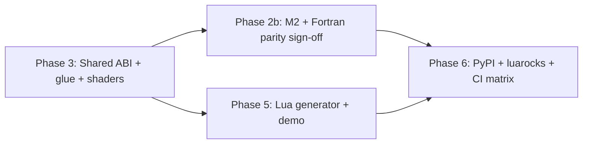

# Situation Language Bindings Plan — Seven Languages

**Status:** Phase 1 ✅ · Phase 2 ✅ · Phase 3 ⏳ shared infra · Phase 4 ✅ Python · **Phase 5 ✅ Lua (v1 shipped)**
**Last reviewed:** 2026-06-24
**Goal:** Maintain production parity across Odin / Zig / Rust / Fortran / Modula-2 / Python, then add **Lua** as the **seventh** supported language — all driven by the same `situation_api.h` generator pipeline and validated by the canonical `hello_situation` demo.

**Canonical build reference:** [`doc/COMPILATION_GUIDE.md`](../COMPILATION_GUIDE.md) — user-facing build docs live there; this file is the implementation plan only.

**Related:** `doc/done/LANGUAGE_BINDINGS_EXPANSION_PLAN.md` (Odin / Zig / Rust — complete), `tools/binding_common.py`, `tools/situation_api_parser.py`

---

## Supported languages (target matrix)

| # | Language | Generator | Wrapper path | `hello_situation` | DLL backends | Static backends |
|---|----------|-----------|--------------|-------------------|:------------:|:-------------:|
| 1 | **C** | — (native) | `examples/` | ✅ | ✅ | ✅ |
| 2 | **Odin** | `generate_odin_bindings.py` | `wrappers/Odin/` | ✅ | ✅ | ❌ |
| 3 | **Zig** | `generate_zig_bindings.py` | `wrappers/Zig/` | ✅ | ✅ | ✅ |
| 4 | **Rust** | `generate_rust_bindings.py` | `wrappers/Rust/` | ✅ | ✅ | ✅ |
| 5 | **Fortran** | `generate_fortran_bindings.py` | `wrappers/Fortran/` | ✅ build | ✅ | ✅ |
| 6 | **Modula-2** | `generate_modula2_bindings.py` | `wrappers/Modula2/` | ✅ build + run | ✅ | ✅ |
| 7 | **Python** | `generate_python_bindings.py` | `wrappers/Python/` | ✅ | ✅ | ❌ *(out of scope v1)* |
| 8 | **Lua** | `generate_lua_bindings.py` | `wrappers/lua/` | ✅ | ✅ *(v1)* | ❌ *(out of scope v1)* |

Python is language **#6** and Lua **#7** in the generated-wrapper family (C is the native reference, not a generated wrapper).

**Scaffold dirs:** `wrappers/lua/`, `build/examples/lua/` *(bindings — Phase 5)* · `_languages/lua/` ✅ **LuaJIT bundled** (`populate_toolchain.bat`).

---

## Architecture (all seven wrappers)

```
sit/situation_api.h
        │
        ▼
tools/situation_api_parser.py   ← ~578 API entries, ~574 auto-exportable
tools/binding_common.py         ← shared signatures, MANUAL_FUNCTIONS, type maps
        │
        ├── generate_odin_bindings.py     → wrappers/Odin/       ✅
        ├── generate_zig_bindings.py      → wrappers/Zig/        ✅
        ├── generate_rust_bindings.py     → wrappers/Rust/       ✅
        ├── generate_fortran_bindings.py  → wrappers/Fortran/    ✅
        ├── generate_modula2_bindings.py  → wrappers/Modula2/    ✅
        ├── generate_python_bindings.py   → wrappers/Python/     ✅
        └── generate_lua_bindings.py      → wrappers/lua/        ⏳ Phase 5
```

Each generator emits the same logical module split:

| Module | Role |
|--------|------|
| `*_types` | Curated ABI-critical structs + opaque handle stubs |
| `*_foreign` / `*_ffi` | Raw C function declarations |
| `*_callbacks` | Function-pointer typedefs (18 in `situation_base_callbacks.h`) |
| `*_constants` | `SIT_KEY_*` and related `#define`s |
| `*_helpers` | Macro replacements (`situationBeginFrame`, `situationSuccess`, …) |
| `API_INDEX.md` | Per-symbol index |
| `MANUAL_BINDINGS.md` | Variadic / hand-wrap symbols (4 today) |

Shared build helpers: `scripts/wrapper_link_config.bat`, `wrapper_paths.bat`, `wrapper_mingw_setup.bat`, `wrapper_link_dll.bat`, `wrapper_gcc_link_static.bat`, plus per-language `wrapper_compile_*.bat`.

---

## Canonical example: `hello_situation`

Every wrapper language ports the **same** demo (~400–460 lines) — not a minimal init/shutdown stub.

| Layer | Behaviour |
|-------|-----------|
| Graphics | Raymarched iridescent torus + animated raster-bar backdrop |
| Shaders | Separate Vulkan (push constants) and OpenGL (uniforms by **name**); backend via `SituationGetGraphicsBackend` |
| Audio | `ToneSynth → Echo → Reverb` node graph |
| MIDI | Virtual MIDI loopback, pentatonic auto-notes every 4 s, Space triggers note |
| Input | V (VSync), F (borderless), +/- (reverb), ]/[ (delay), P/O (delay FB), ESC |
| HUD | Title + FPS/VSync/Audio + FX % via `SituationCmdDrawTextEx` |
| Cleanup | Shader unload, MIDI teardown, graph destroy, shutdown |

Reference implementations: `wrappers/{Rust,Zig,Odin,Fortran,Modula2,Python,lua}/examples/hello_situation*`

### Demo porting rules (learned 2026-06-23)

These apply to **all** wrapper languages, including Python and Lua:

1. **`SituationInitInfo`** — never hand-fill field-by-field in demos. Use `SituationInitInfoDefault()` semantics (width, height, title, `output_color_depth = AUTO`, zero everything else). Modula-2 uses `wrappers/Modula2/glue/situation_m2_glue.c`; Python should use a shared C helper or a verified `ctypes.Structure` from the ABI probe (Phase 3).
2. **`render_thread_count`** — leave at **0** in hello demos (matches Rust default). Non-zero enables render-thread GL handover; only opt in when the demo is written for it.
3. **OpenGL uniforms** — use `SituationSetShaderUniform(shader, "uTime", …)` by name, not `SituationSetShaderUniformLocation` from the main thread when render thread may be active.
4. **Vulkan** — push-constant struct must match SPIR-V layout (16-byte `ShaderPc`: `float time; float pad; vec2 res`).
5. **Focus / resize** — Fortran demo includes cache-busting shader reload after swapchain recreate; all ports should copy that pattern once shared infra lands.

---

## Progress summary

| Phase | Scope | Status |
|-------|-------|--------|
| **1 — Fortran** | Generator, bindings, build scripts, four backends | ✅ **Done** (2026-06-22) |
| **2 — Modula-2** | Generator, bindings, `gm2` bundle, `hello_situation` | ✅ **Build + run** (2026-06-23); runtime parity sign-off pending |
| **3 — Shared infra** | ABI probe, `binding_common` dedup, `SituationInitInfo` fix all langs, shared GLSL | ⏳ **Next** — blocks Lua + stabilizes Fortran/M2/Python |
| **4 — Python** | Generator, `ctypes` package, `hello_situation.py`, DLL loaders | ✅ **Done** (v2.4.342) |
| **5 — Lua** | Generator, LuaJIT FFI package, `hello_situation.lua`, bundled toolchain | ✅ **Done** (2026-06-26) |
| **6 — Polish** | PyPI package, optional idiomatic layers, CI matrix (all 7 langs) | ⏳ Future |

### Verification log

| Check | Result |
|-------|--------|
| `python tools/generate_fortran_bindings.py` | ✅ ~575 `bind(C)` procedures |
| `python tools/generate_modula2_bindings.py` | ✅ ~575 `EXTERN` / `FOR "C"` procedures |
| Fortran — all four backends build | ✅ |
| Modula-2 — `gm2` bundled in `_languages/gm2/` | ✅ |
| Modula-2 — `build\build_modula2_example.bat opengl` | ✅ |
| Modula-2 — runtime (torus, audio, FPS) after ABI glue fix | ✅ (2026-06-23) |
| Core library coherence (Fortran + Demon Hunt Vulkan) | ✅ user verified |
| Fortran `SituationInitInfo` vs C `sizeof`/`offsetof` | ⚠️ **Drift** — missing `output_color_depth`, render-thread fields, `main_thread_name` |
| Rust `SituationInitInfo` vs C | ⚠️ **Same drift** — masked when fields are zero |
| `python tools/generate_python_bindings.py` | ✅ ~594 ctypes exports |
| Python — `hello_situation` DLL build + run | ✅ |
| Lua bindings | ⏳ not started |

---

## Phase 1 — Fortran ✅

### Toolchain

MSYS2: `pacman -S mingw-w64-x86_64-gcc-fortran` → `gfortran` + `libgfortran`, same MinGW-w64 ABI as Situation DLL/`.a`.

### Deliverables (complete)

- `tools/generate_fortran_bindings.py`
- `wrappers/Fortran/src/{situation_types,situation_foreign,situation_callbacks,situation_constants,situation_helpers,situation}.f90`
- `wrappers/Fortran/examples/hello_situation/{main.f90,demo_helpers.f90}`
- `build/build_fortran_example.bat` + `scripts/wrapper_compile_fortran.bat`
- All four backends verified (DLL + static; static-vulkan via `g++` + `-lgfortran`)

### Remaining Fortran work

- [ ] Fix `SituationInitInfo` layout in generator (Phase 3 ABI table)
- [ ] Add `SituationInitInfoDefault` helper usage in `demo_helpers.f90` (Fortran can `bind(C)` to a small C wrapper in `wrappers/Fortran/glue/` or call inline helper once exported from DLL — prefer shared glue)
- [ ] Formal runtime parity checklist vs Rust (visual, audio, input, focus loss, VSync toggle)

---

## Phase 2 — Modula-2 🔄

### Toolchain ✅ resolved

`gm2` bundled at `_languages/gm2/bin/gm2.exe` (GCC 15.1, `--enable-languages=c,m2`). Build scripts resolve bundled → PATH → `C:\msys64\mingw64\bin\gm2.exe`.

### Deliverables (complete)

- `tools/generate_modula2_bindings.py`
- `wrappers/Modula2/src/{SituationTypes,SituationForeign,SituationCallbacks,SituationConstants,SituationHelpers,SituationGlue}.def`
- `wrappers/Modula2/glue/situation_m2_glue.{c,h}` — ABI-safe `SituationM2InitInfoWindow`
- `wrappers/Modula2/examples/hello_situation/Main.mod`
- `build/build_modula2_example.bat` + `scripts/wrapper_compile_modula2.bat` (compiles glue `.c` via MinGW `gcc`)

### Modula-2-specific notes

- Foreign linkage: `DEFINITION MODULE FOR "C"` (not `<* EXTERN *>` pragmas)
- Dynamic strings: fixed `ARRAY [0..N] OF CHAR` + `CopyCStr` helpers
- Padding: explicit `_pad_*` byte arrays in `SituationInitInfo` RECORD for MSVC x64 alignment
- Link: `gm2 -c` → `.o` + glue `.o` → `g++` + `-lgm2 -lstdc++` + Situation import lib

### Remaining Modula-2 work

- [ ] Runtime parity sign-off (same checklist as Fortran)
- [ ] Document glue pattern in `wrappers/Modula2/README.md` (init ABI)
- [ ] Verify all four backends on CI/contributor machine matrix
- [ ] Fold `SituationInitInfo` metadata into Phase 3 single source (reduce hand-maintained padding)

---

## Phase 3 — Shared infrastructure (prerequisite for Lua)

**Priority: P0** — Lua and long-term maintenance depend on this.

### 3a — ABI canonical struct metadata

Move curated struct layouts from five copy-pasted `render_manual_types()` blocks into `binding_common.py`:

```python
# binding_common.py (planned)
MANUAL_STRUCTS: dict[str, list[FieldSpec]]  # name, c_type, padding, ifdefs
```

Emit per-language from one table. Include at minimum:

- `SituationInitInfo` (full v2.4.336 layout, `SITUATION_ENABLE_RENDER_THREAD` fields)
- `ColorRGBA`, `Vector2`–`Vector4`, generational handles (`SituationShader`, `SituationMesh`, …)

### 3b — ABI probe (CI gate)

Small C program (already sketched as `build/_offsetof_test.c`):

- Compile with same flags as Situation DLL (`SITUATION_USE_OPENGL|VULKAN`, `SITUATION_ENABLE_RENDER_THREAD`)
- Print `sizeof` / `offsetof` for ABI-critical types
- Python script `tools/verify_abi_layouts.py` compares probe output to each generator’s emitted layout metadata
- Run from `tools/run_all.bat` after binding regeneration

### 3c — Shared C glue (optional, recommended)

`wrappers/shared/situation_wrapper_glue.c`:

- `SituationWrapperInitInfoWindow(SituationInitInfo* out, int w, int h, const char* title)` — wraps `SituationInitInfoDefault`
- Linked by Fortran / Modula-2 / Python / Lua demos (one implementation, not four copies)
- Modula-2’s `situation_m2_glue.c` becomes a thin include/wrapper around shared glue

### 3d — Shared demo assets

- `wrappers/shared/hello_situation_shaders.inc` — four GLSL strings (vk vert/frag, gl vert/frag)
- Included/emitted by all seven demos so shader source cannot drift

### 3e — Generator deduplication

- Per-language generators shrink to: `c_type_to_<lang>()`, syntax emitters, module wrapping
- Target: remove ~600 lines × 5 duplication across `render_manual_types` / `render_enums` / `render_opaque_stubs`

### Phase 3 checklist

- [ ] `MANUAL_STRUCTS` in `binding_common.py`
- [ ] Regenerate all six existing bindings from shared metadata
- [ ] `tools/verify_abi_layouts.py` + CI hook
- [ ] Shared glue library (or document DLL export of init helper if added to core in a future release — **do not change `sit/` without explicit approval**)
- [ ] `wrappers/shared/hello_situation_shaders.inc`
- [ ] Fix `SituationInitInfo` in Rust + Fortran generators (currently stale)

---

## Phase 4 — Python ✅

Shipped v2.4.342. Reference: `wrappers/Python/`, `build/build_python_example.bat`, `tools/generate_python_bindings.py`.

### Deliverables (complete)

- `tools/generate_python_bindings.py`
- `wrappers/Python/situation/{types,foreign,constants,callbacks,helpers,manual,_dll}.py`
- `wrappers/Python/examples/hello_situation.py`
- `build/build_python_example.bat` + `scripts/wrapper_compile_python.bat` + `scripts/wrapper_link_python.bat`
- `scripts/wrapper_paths.bat` python row
- `tools/run_all.bat` integration

### Remaining Python work (Phase 6 polish)

- [ ] PyPI packaging (`pyproject.toml`, DLL-not-included policy)
- [ ] Optional `situation.safe` idiomatic layer
- [ ] ABI probe sign-off once Phase 3 lands

---

## Phase 4 reference — Python design (archived)

### Why Python

- Largest audience for creative coding, tools, and education
- Ideal for scripting Situation-powered experiments without a compile step
- Same DLL architecture as other wrappers — generator fits existing pipeline
- Natural fit for tooling (shader hot-reload scripts, MIDI learn UIs, test harness glue)

### Design principles

| Principle | Choice |
|-----------|--------|
| **FFI layer** | **`ctypes`** (stdlib) — zero pip dependency for basic usage |
| **DLL loading** | `ctypes.CDLL` / `WinDLL` for `situation_opengl.dll` / `situation_vulkan.dll` beside script or on `PATH` |
| **Static linking** | Out of scope v1 (Python + `.a` is awkward on Windows; DLL is the canonical Python path) |
| **Struct layout** | Generated `ctypes.Structure` subclasses from Phase 3 ABI table — **never hand-written** |
| **Init** | `SituationWrapperInitInfoWindow` from shared glue, or `create_string_buffer` + verified Structure |
| **Errors** | `SituationError` as `c_int`; helper `check(err) -> None` raises `SituationError` exception class |
| **Callbacks** | Generated `ctypes.CFUNCTYPE` aliases in `callbacks.py`; document GIL / main-thread rules |
| **Threading** | Document: call Situation from main thread only; audio callbacks may need `SituationSetLogCallback` patterns |
| **Packaging v1** | In-repo `wrappers/Python/` only; `pyproject.toml` / PyPI in Phase 6 |

### Output structure

```
wrappers/Python/
├── situation/                      # import package (generated + thin hand code)
│   ├── __init__.py                 # re-exports, load_dll(backend)
│   ├── _dll.py                     # CDLL loader, path discovery
│   ├── types.py                    # ctypes.Structure / handles (generated)
│   ├── constants.py                # SIT_KEY_*, errno (generated)
│   ├── foreign.py                  # ctypes function bindings (generated)
│   ├── callbacks.py                # CFUNCTYPE definitions (generated)
│   ├── helpers.py                  # begin_frame(), ok(), c_string helpers
│   └── manual.py                   # variadic log wrappers (hand)
├── examples/
│   └── hello_situation.py          # full demo port
├── glue/                           # optional: links shared wrapper glue
├── API_INDEX.md                    # generated
├── MANUAL_BINDINGS.md              # generated
├── pyproject.toml                  # Phase 6
└── README.md
```

### Generator: `tools/generate_python_bindings.py`

Mirror `generate_zig_bindings.py` structure. Key mappings:

| C | Python (`ctypes`) |
|---|---------------------|
| `void` | `None` return |
| `bool` | `c_bool` |
| `int` / `int32_t` | `c_int` |
| `uint32_t` | `c_uint` |
| `uint64_t` | `c_uint64` |
| `float` | `c_float` |
| `double` | `c_double` |
| `char*` | `c_char_p` or `create_string_buffer` |
| `void*` | `c_void_p` |
| `SituationError` | `c_int` |
| structs | `Structure` subclasses with `_fields_` |
| function pointers | `CFUNCTYPE` in `callbacks.py` |

Emit `foreign.py` with `dll.SituationInit.argtypes` / `restype` for every function (ctypes requires explicit types for correctness).

### Build / run

No compile step for pure Python v1:

```bat
build\build_situation.bat opengl
python tools\generate_python_bindings.py
build\build_python_example.bat opengl hello_situation
```

`build/build_python_example.bat`:

1. Ensure DLL exists + copy to `build/examples/python/`
2. Optionally verify `python --version` ≥ 3.10
3. Run `python wrappers/Python/examples/hello_situation.py` (or copy to output dir)

Add to `tools/run_all.bat` after Modula-2 generator.

### Python `hello_situation` port notes

- **Window title / HUD**: `create_string_buffer(128)` or `bytes` literals with `\0`
- **Shader sources**: read from `wrappers/shared/hello_situation_shaders.inc` or embed via generator
- **Main loop**: `while not dll.SituationWindowShouldClose():` + `helpers.begin_frame()`
- **GLSL backend branch**: `if backend == SIT_GRAPHICS_BACKEND_VULKAN: ... else: SituationSetShaderUniform(..., b"uTime", ...)`
- **RNG**: same LCG seed 1337 as Rust demo
- **Cleanup**: `try` / `finally` mirroring Rust `CleanupGuard`

### Python manual bindings

Same four symbols as all languages:

| Function | Python approach |
|----------|-----------------|
| `SituationLog` | `manual.py` — wrap with `%` formatting, call narrow C export or skip |
| `SituationLogWarning` | same |
| `SituationImageDrawTextFormatted` | `manual.py` — `format` → buffer → `SituationImageDrawText` |
| `SituationSetLogCallback` | `manual.py` — store CFUNCTYPE ref to prevent GC |

### Phase 4 checklist

- [x] `tools/generate_python_bindings.py`
- [x] `wrappers/Python/situation/{types,foreign,constants,callbacks,helpers}.py`
- [x] `wrappers/Python/examples/hello_situation.py`
- [x] `build/build_python_example.bat` + `scripts/wrapper_paths.bat` python row
- [x] `situation._dll.load("opengl" | "vulkan")` path logic
- [x] Extend `tools/run_all.bat`
- [ ] Runtime parity vs Rust (formal sign-off)
- [x] README: main-thread rule, DLL placement, `pip` not required for local dev

---

## Phase 5 — Lua ⏳

### Why Lua

- Natural fit for Situation’s creative-coding and game-tooling audience (script hot-reload, rapid iteration)
- Same DLL architecture as Python / Odin / Zig — generator slots into the existing pipeline
- **LuaJIT FFI** is the closest analog to Python **ctypes**: stdlib-style C interop without generating a compiled C extension for every API symbol
- Pairs well with embedded / tooling workflows (MIDI learn UIs, shader experiments, demo variants)

### Design principles

| Principle | Choice |
|-----------|--------|
| **Runtime** | **LuaJIT 2.1** (bundled under `_languages/lua/`) — not PUC-Rio Lua 5.4 for v1 |
| **FFI layer** | **`ffi.cdef` + `ffi.load`** — generated declarations, hand `load_dll(backend)` |
| **DLL loading** | `ffi.load("situation_opengl")` / `ffi.load("situation_vulkan")` beside script or on `PATH` |
| **Static linking** | Out of scope v1 (embed-Lua + `.a` host is Phase 6 optional) |
| **Struct layout** | Generated `ffi.cdef` blocks from Phase 3 ABI table — **never hand-written** |
| **Init** | `SituationWrapperInitInfoWindow` from `wrappers/shared/situation_wrapper_glue.c` (Phase 3c) |
| **Errors** | `SituationError` as `ffi.typeof("int")`; helper `situation.check(err)` raises Lua error |
| **Callbacks** | Generated `ffi.typeof("void(*)(...)")` aliases; store refs in registry table to prevent GC |
| **Threading** | Document: call Situation from main thread only (same rule as Python) |
| **Packaging v1** | In-repo `wrappers/lua/` only; luarocks / rockspec in Phase 6 |

### Toolchain (bundle like Rust / Odin / gm2)

```
_languages/lua/
├── README.md                       # version pin, license, how to refresh bundle
└── luajit/
    ├── bin/
    │   ├── luajit.exe              # Windows x64 (primary)
    │   └── lua51.dll               # if required by this build
    └── ...
```

**Resolution order** in `build/build_lua_example.bat`:

1. `_languages/lua/luajit/bin/luajit.exe` (bundled)
2. `luajit.exe` on `PATH`
3. MSYS2: `C:\msys64\mingw64\bin\luajit.exe` (`pacman -S mingw-w64-x86_64-luajit`)

Bindings are `.lua` sources compiled to **embedded bytecode** at build time (`tools/gen_lua_embed.py`). The shipped demo is a **single self-contained `.exe`** — not a staged `luajit.exe` tree.

### Output structure

```
wrappers/lua/
├── situation/                      # require("situation") package (generated + thin hand code)
│   ├── init.lua                    # package loader, package.path, re-exports
│   ├── dll.lua                     # ffi.load path discovery (hand)
│   ├── ffi_cdef.lua                # ffi.cdef[[ ... ]] structs + extern decls (generated)
│   ├── types.lua                   # opaque handle aliases, struct helpers (generated)
│   ├── constants.lua               # SIT_KEY_*, errno tables (generated)
│   ├── foreign.lua                 # thin wrappers: lib.SituationInit(...) (generated)
│   ├── callbacks.lua               # ffi.typeof callback typedefs (generated)
│   ├── helpers.lua                 # begin_frame(), ok(), c_string helpers (generated + hand)
│   └── manual.lua                  # variadic log wrappers (hand)
├── launcher/
│   ├── sit_lua_host.c              # extract DLLs, init runtime, run embedded bytecode
│   ├── sit_lua_runtime.c/h         # dynamic lua51.dll load (LoadLibrary)
│   └── sit_lua_draw_shim.c/h       # safe DrawTextEx (font by pointer)
├── examples/
│   └── hello_situation.lua         # full demo port (~400–460 lines)
├── API_INDEX.md                    # generated
├── MANUAL_BINDINGS.md              # generated
└── README.md
```

**Build output** (self-contained embedded exe):

```
build/examples/lua/
└── hello_situation.exe             # embeds bytecode + situation_*.dll + lua51.dll
```

At runtime DLLs extract to `%TEMP%\situation_lua_<pid>\`. Dev mode: `build/run_lua_dev.bat` runs staged sources with external `build/dll/situation_opengl.dll`.

### Generator: `tools/generate_lua_bindings.py`

Mirror `generate_python_bindings.py` structure. Key mappings:

| C | Lua (LuaJIT FFI) |
|---|------------------|
| `void` | no return |
| `bool` | `bool` in cdef |
| `int` / `int32_t` | `int32_t` |
| `uint32_t` | `uint32_t` |
| `uint64_t` | `uint64_t` |
| `float` | `float` |
| `double` | `double` |
| `char*` | `const char*` + `ffi.string()` at call sites |
| `void*` | `void*` |
| `SituationError` | `int` |
| structs | `typedef struct { ... } Name;` inside `ffi.cdef` |
| function pointers | `typedef void(*Name)(...);` in `callbacks.lua` |
| enums | Lua number constants in `constants.lua` (LuaJIT has no native enum) |

Emit `foreign.lua` as one function per export:

```lua
function M.SituationInit(info)
    return lib.SituationInit(info)
end
```

Keep raw `lib.*` access internal; demos use `require("situation")` helpers.

### Build / run

```bat
build\build_situation.bat opengl
python tools\generate_lua_bindings.py
build\build_lua_example.bat opengl hello_situation
```

`build/build_lua_example.bat` (thin launcher):

1. `call scripts\wrapper_link_config.bat %BACKEND%`
2. `call scripts\wrapper_paths.bat lua %EXAMPLE% %BACKEND%` → `build\examples\lua\`
3. `call scripts\wrapper_compile_lua.bat` — stage sources; `gen_lua_embed.py` (bytecode) + `gen_lua_dll_embed.py` (Situation + lua51 DLL blobs)
4. `call scripts\wrapper_link_lua.bat` — link embedded host (`sit_lua_host.c`, runtime, draw shim) → single `.exe`
5. Run: `%OUT_DIR%\%EXAMPLE%.exe` (unless `--no-run`)

Add to `tools/run_all.bat` after Python generator.

### Shared scripts to add

| Script | Role |
|--------|------|
| `scripts/wrapper_paths.bat` | Add `lua` row → `build\examples\lua`, `build\obj\lua\` |
| `scripts/wrapper_compile_lua.bat` | Stage sources; run `gen_lua_embed.py` + `gen_lua_dll_embed.py` |
| `scripts/wrapper_link_lua.bat` | Link embedded host → `build\examples\lua\<example>.exe` only |
| `tools/gen_lua_embed.py` | Embedded Lua bytecode C source |
| `tools/gen_lua_dll_embed.py` | Embedded Situation + lua51 DLL C source |

### Lua `hello_situation` port notes

- **Window title / HUD**: `ffi.new("char[?]", n)` + `ffi.copy`, or string literals passed where API expects `const char*`
- **Shader sources**: read from `wrappers/shared/hello_situation_shaders.inc` (Phase 3d) or embed via generator as Lua long strings
- **Main loop**: `while not situation.SituationWindowShouldClose() do situation.begin_frame() ... end`
- **GLSL backend branch**: `if backend == SIT_GRAPHICS_BACKEND_VULKAN then ... else situation.SituationSetShaderUniform(..., "uTime", ...) end`
- **RNG**: same LCG seed 1337 as Rust demo
- **Cleanup**: `pcall` + `finally` pattern (explicit teardown function called on error or normal exit)
- **package.path**: `init.lua` prepends `script_dir.."/situation/?.lua"` so demo runs from `build/examples/lua/` without install step

### Lua manual bindings

Same four symbols as all languages:

| Function | Lua approach |
|----------|--------------|
| `SituationLog` | `manual.lua` — `string.format` → `SituationLogNarrow` or skip |
| `SituationLogWarning` | same |
| `SituationImageDrawTextFormatted` | `manual.lua` — format → buffer → `SituationImageDrawText` |
| `SituationSetLogCallback` | `manual.lua` — store callback in `situation._callback_refs` registry |

### Phase 5 checklist

- [x] Bundle LuaJIT under `_languages/lua/luajit/` (+ `README.md`, `VERSION`, `populate_toolchain.bat`)
- [x] `tools/generate_lua_bindings.py`
- [x] `wrappers/lua/situation/{ffi_cdef,types,foreign,constants,callbacks,helpers,manual,dll,init}.lua`
- [x] `wrappers/lua/examples/hello_situation.lua`
- [x] `build/build_lua_example.bat`
- [x] `scripts/wrapper_compile_lua.bat` + `scripts/wrapper_link_lua.bat`
- [x] `scripts/wrapper_paths.bat` lua row
- [x] `situation.dll.load("opengl" | "vulkan")` path logic in `dll.lua`
- [x] Extend `tools/run_all.bat`, `wrappers/lua/README.md`
- [ ] Runtime parity vs Rust (formal sign-off)
- [x] README: main-thread rule, embedded exe model, draw shim, dev mode (`run_lua_dev.bat`)
- [x] `doc/COMPILATION_GUIDE.md` Lua section (+ `tools/README.md`, `build/README.md`, `scripts/README.md`)

---

## Phase 6 — Polish (post-Lua ship)

- [ ] Optional **idiomatic layer**: `situation.safe` with context managers (`with situation.window(...):`)
- [ ] **PyPI** package `situation-engine` or `pysituation` (DLL not included — document separate download)
- [ ] **numpy** optional integration for `SituationCmdDrawMesh` vertex uploads
- [ ] CI matrix: regenerate bindings + ABI probe + build all seven `hello_situation` variants
- [ ] Optional **Lua embed host**: small C `main` linking `situation_*.a` + `luaL_openlibs` (static backend path)
- [ ] luarocks rockspec `situation` (DLL not included — document separate download)
- [ ] Safe-layer / `Result` ergonomics for Rust & Zig (deferred from original expansion plan)

---

## Manual bindings (all languages)

Never auto-exported — see `wrappers/*/MANUAL_BINDINGS.md`:

| Function | Reason |
|----------|--------|
| `SituationLog` | variadic |
| `SituationLogWarning` | variadic |
| `SituationImageDrawTextFormatted` | variadic |
| `SituationSetLogCallback` | nested proc type |

---

## Success criteria (seven wrapper languages)

| # | Criterion | Odin | Zig | Rust | Fortran | Modula-2 | Python | Lua |
|---|-----------|:----:|:--:|:----:|:-------:|:--------:|:------:|:---:|
| 1 | Generator regen < 5 s | ✅ | ✅ | ✅ | ✅ | ✅ | ✅ | ⏳ |
| 2 | `hello_situation` builds/runs (`opengl` DLL) | ✅ | ✅ | ✅ | ✅ | ✅ | ✅ | ⏳ |
| 3 | Visual + audio + input parity vs Rust | ✅ | ✅ | ✅ | ⏳ | ⏳ | ⏳ | ⏳ |
| 4 | Documented in `COMPILATION_GUIDE.md` | ✅ | ✅ | ✅ | ✅ | ✅ | ✅ | ⏳ |
| 5 | ABI probe passes for `SituationInitInfo` | ⏳ | ⏳ | ⏳ | ⏳ | ⏳ | ⏳ | ⏳ |

---

## Recommended execution order



1. **Phase 3a–3b** — ABI metadata + probe (unblocks Lua, fixes known struct drift)
2. **Phase 3c–3d** — shared glue + shader include (reduces demo maintenance)
3. **Phase 2b** — sign off Fortran + Modula-2 runtime parity using fixed structs
4. **Phase 5** — Lua generator + `hello_situation.lua` + `build_lua_example.bat` + LuaJIT bundle
5. **Phase 3e + 6** — generator dedup, PyPI, luarocks, full CI

---

## How to use this file

1. Execute **Phase 3 before Phase 5** — Lua must not copy another language’s stale struct layout.
2. When a phase ships, update [`doc/COMPILATION_GUIDE.md`](../COMPILATION_GUIDE.md) (scripts, matrix, dependencies, tree). Log in `doc/UPDATELOG.md`.
3. Do **not** duplicate build instructions here — the compilation guide is the single user-facing reference.
4. Do **not** modify `sit/` core unless explicitly approved — wrapper glue lives under `wrappers/shared/` or `wrappers/<lang>/glue/`.

---

## Open questions (for team decision)

| # | Question | Options |
|---|----------|---------|
| 1 | Export `SituationInitInfoDefault` from DLL vs wrapper-only glue? | Glue only (current) · Add `SITAPI` export in core (ABI stable) |
| 2 | Python package name on PyPI | `situation` · `pysituation` · `situation-engine` |
| 3 | Minimum Python version | 3.10 · 3.11 · 3.12 |
| 4 | Python safe/idiomatic layer in v1 or Phase 6? | ctypes-only v1 (done) · thin `safe.py` in Phase 6 |
| 5 | Lua runtime for v1 | **LuaJIT 2.1 bundled** (recommended) · PUC-Rio 5.4 + C extension (heavier) |
| 6 | Lua package distribution | In-repo only v1 · luarocks rockspec in Phase 6 |
| 7 | Rename this plan file to `LANGUAGE_BINDINGS_PLAN.md`? | Yes · keep `EXTRA_BINDINGS_PLAN.md` as alias |