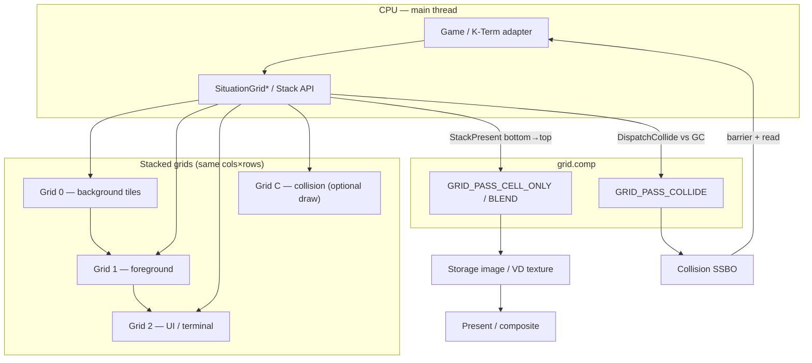

# Grid Render Plan — K-Term Extract → Situation 2D Console Framework

| Field | Value |
|-------|--------|
| **Status** | 🟡 **IN PROGRESS** — Phase 0 ✅; Phase A 🟡 (GL G1 green); Phase B 🟡 (GL harness green) |
| **Goal** | First-class **2D grid renderer** in Situation: playfields, sprites, palettes, scroll — **16-bit-console-grade** flexibility — with **GPU collision feedback**, extracted from K-Term’s proven compute path and grown into the canonical subsystem |
| **Strategy** | **Preserve K-Term’s model first** → adapter onto Situation grid → bolster Situation → **K-Term becomes a client** → eventual takeover |
| **Rename** | Subsystem is **`grid`**, not `text`. Public API: `SituationGrid*`. Shader: `grid.comp`. Layout: `SIT_COMPUTE_LAYOUT_GRID`. Legacy text APIs stay for sparse HUD until explicitly deprecated |
| **Primary files (eventual)** | `sit/situation_api_grid.h` (public), `sit/situation_impl_grid.h` (single impl TU), `sit/situation_impl_forward.h` (internal forwards), `sit/gpu/grid_preamble.glslh`, `sit/gpu/grid.comp`, `tests/harness/test_grid.c`, `examples/27_grid_playfield/`, `examples/other/platformer_plumber.c` (Phase H), `.kiro/specs/situation-grid/` |
| **Extraction source** | `sit/k-term/shaders/terminal.comp`, `sit/k-term/kt_composite_sit.h` (`GPUCell`, upload path), `KTerm_InitCompute` / `kt_render_sit.h` |
| **Pairs with** | [`plan_handles_ssbo.md`](plan_handles_ssbo.md), [`virtual_display.md`](../guide/virtual_display.md), [`compute.md`](../guide/compute.md), [`VOXEL_RENDER_PLAN.md`](VOXEL_RENDER_PLAN.md) (orthogonal 3D), [`KTERM_CONSOLE_GOALS_PLAN.md`](KTERM_CONSOLE_GOALS_PLAN.md), [`DIGESTIBLE_EXAMPLES_PLAN.md`](DIGESTIBLE_EXAMPLES_PLAN.md) |
| **Explicit non-goal** | VT parser / ConPTY / gateway in core; replacing `SituationCmdDrawText*` in Phase A–C; SNES Mode 7–style affine BG in v1; macOS GL parity if VK-first slips |

---

## Executive summary

Situation already has **grid-font semantics** (`display_cell_width/height`, `_SituationFontIsGridAtlas`, quad batching) but no **cell surface**, no **stacked playfield**, and no **collision channel**. K-Term has a working single-grid path — dense `GPUCell` SSBO (`code`+`fg`+`bg`), per-pixel `terminal.comp`, dirty upload, VD compute-target present — but it is **terminal-shaped** (VT flags, sixel, CRT, selection cursor) and **coupled into core** via `SIT_COMPUTE_LAYOUT_TERMINAL`.

This plan **steals our own renderer**: lift the compute grid path into **`situation_impl_grid.h`** + **`sit/gpu/grid.comp`**, keep each grid **simple** (`code` + `fg` + `bg` per cell — K-Term’s core model), build **depth via stacked grids** (not multi-layer SSBOs inside one surface), and wire **collision** against dedicated grid layers. K-Term keeps `EnhancedTermChar` + VT unchanged; it **adapts** `EnhancedTermChar → SitGridCell` until the adapter is thin enough to delete the duplicate GPU path.

**North star:** a developer composes **flexible resources** like console hardware — background tilemap grid, foreground grid, UI grid, collision grid, sprite list — each with the same tile record, independent scroll/zoom, composited bottom-to-top. **Palette tables** (256-entry, 8-bit indices) are shared **table bindings** on those resources — mandatory for serious 2D color work (Phase J). Collision tests a mover against the collision grid without entangling draw logic.

**Foundation (what is alive):** K-Term’s migrated compute grid — `GPUCell` / `SitGridCell`, `grid.comp`, `SituationGrid*`, example 27, harness `test_grid.c`. That is the system we extend.

**Archaeology (what is dead):** **`grid2.h`** and friends were a prior pure-C canvas engine. They are **not** linked, **not** a port target, **not** a behavior spec. Keep the old header only as **design notes** when rebuilding **flexible resources** (layer objects, table slots, scroll/scale on resources, bulk fill). **Harness + K-Term green = law** — not grid2 CPU output. **Phase G** is where that resource flexibility lands in Situation.

---

## Foundation vs archaeology (two worlds, not three)

Do not treat this as “grid2 vs K-Term vs Situation.” There are **two runtime worlds**:

```text
┌─────────────────────────────────────────────────────────────────┐
│  SITUATION GRID (canonical)                                     │
│  SitGridCell · grid.comp · stack · palettes · sprites           │
│  example 27 · platformer · any game client                      │
└───────────────────────────────▲─────────────────────────────────┘
                                │ pack + present (one surface)
┌───────────────────────────────┴─────────────────────────────────┐
│  K-TERM (first client)                                          │
│  EnhancedTermChar · VT parser · color_palette[256] on CPU       │
│  kt_grid_sit.h → SituationGrid*  (not a second renderer)        │
└─────────────────────────────────────────────────────────────────┘

        grid2.h  ──►  dead notebook (ideas only, optional bit-layout crib)
                      never compiled · never authoritative
```

| | **Situation Grid** | **K-Term** | **grid2 (dead)** |
|--|-------------------|------------|------------------|
| Status | **Build here** | **Client** — VT product | **Archive** — prior design |
| Cell type | `SitGridCell` (+ ext) | `EnhancedTermChar` → pack | `EX_cell` (historical name) |
| GPU | `grid.comp` | Uses Situation grid when `KTERM_USE_SIT_GRID=1` | N/A (was CPU) |
| Authority | Harness, `grid.comp`, public API | Terminal semantics only | None — crib sheet only |

**Red lines:** No grid2 API surface in Situation. No “port `render_cell` until it matches grid2.” Phase I/J/K **design forward** from K-Term’s cell core; consult grid2 **only** when choosing bit names or remembering a feature the old system had.

---

## Why this is touchy (and how we avoid breakage)

| Risk | Mitigation |
|------|------------|
| K-Term regression (`kterm_console`, 40+ grid tests) | Phase 0 freeze + adapter-only migration; harness `kterm_console` stays green every phase |
| `test_text_rendering` / retro builders | **No changes** to `SituationCmdDrawText*` path in Phases A–D |
| `SIT_COMPUTE_LAYOUT_TERMINAL` wrapper ripple (7 bindings) | **Alias** `SIT_COMPUTE_LAYOUT_GRID = TERMINAL` until Phase F rename window |
| Terminal shader bloat (CRT, sixel, voice) in core | Extract **minimal `grid.comp`**; **preserve** K-Term `terminal.comp` unchanged; K-Term keeps `terminal_effects.comp` or optional FX post-pass |
| Visual parity during extract | **No golden PNG snapshots.** Keep **`KTERM_USE_SIT_GRID`** toggle (`terminal.comp` ↔ `grid.comp`); bridge behavior via harness + side-by-side runs until outputs match |
| Collision readback latency | Document as **post-dispatch poll**; optional async ring (Phase E+) |
| **grid2 confusion** | Treat **`grid2.h` as dead archaeology only** — never a runtime fork or golden spec; extend **K-Term’s Situation grid path**; harness is law |

---

## Phase overview

```text
┌─────────────────────────────────────────────────────────────────────────┐
│ Phase 0 — Contract freeze & inventory                                   │
│   Document K-Term GPUCell upload + terminal.comp inputs; no code moves  │
└───────────────────────────────┬─────────────────────────────────────────┘
                                ↓
┌─────────────────────────────────────────────────────────────────────────┐
│ Phase A — Extract compute grid core (K-Term unchanged externally)       │
│   sit/gpu/grid_preamble.glslh + grid.comp; SIT_COMPUTE_LAYOUT_GRID      │
│   sit/situation_impl_grid.h + situation_api_grid.h                      │
│   K-Term: kt_grid_sit.h calls SituationGrid* internally                 │
└───────────────────────────────┬─────────────────────────────────────────┘
                                ↓
┌─────────────────────────────────────────────────────────────────────────┐
│ Phase B — SitGridSurface API (cell layer only)                          │
│   Create / SetCell / Upload / Dispatch / Present(VD or screen)          │
│   Harness: test_grid.c — cell upload + VD present; optional kterm dual-path │
└───────────────────────────────┬─────────────────────────────────────────┘
                                ↓
┌─────────────────────────────────────────────────────────────────────────┐
│ Phase C — Grid stacking (layers)                                        │
│   Stack multiple SituationGridSurface bottom→top; scroll per grid       │
│   GRID_PASS_BLEND composite; example 27: BG + FG grids on VD           │
└───────────────────────────────┬─────────────────────────────────────────┘
                                ↓
┌─────────────────────────────────────────────────────────────────────────┐
│ Phase D — Actors on stacked grids (interim)                             │
│   Moving entities via dedicated actor grid until G.3 sprites land        │
└───────────────────────────────┬─────────────────────────────────────────┘
                                ↓
┌─────────────────────────────────────────────────────────────────────────┐
│ Phase E — GPU collision feedback                                        │
│   Collision grid layer + mover tests → SSBO → CPU read API              │
└───────────────────────────────┬─────────────────────────────────────────┘
                                ↓
┌─────────────────────────────────────────────────────────────────────────┐
│ Phase F — K-Term takeover & dedup                                       │
│   Grid path default; terminal.comp preserved + toggle for before/after  │
│   Deprecate SIT_COMPUTE_LAYOUT_TERMINAL name (compat alias retained)    │
└───────────────────────────────┬─────────────────────────────────────────┘
                                ↓
┌─────────────────────────────────────────────────────────────────────────┐
│ Phase G — Retro hardware effects (flexible resources)                   │
│   Grid2 inheritance: scroll/zoom/sprites as composable resource types    │
└───────────────────────────────┬─────────────────────────────────────────┘
                                ↓
┌─────────────────────────────────────────────────────────────────────────┐
│ Phase H — platformer_plumber grid conversion                            │
│   Migrate examples/other/platformer_plumber.c: stacked grids + GPU collide  │
│   Full game loop on SituationGrid*; audio/HUD patterns preserved        │
└───────────────────────────────┬─────────────────────────────────────────┘
                                ↓
┌─────────────────────────────────────────────────────────────────────────┐
│ Phase I — Extended tile setup (tile_state + SitGridCellExt)             │
│   Rebuild rich per-tile features on SitGridCell; K-Term stays minimal   │
└───────────────────────────────┬─────────────────────────────────────────┘
                                ↓
┌─────────────────────────────────────────────────────────────────────────┐
│ Phase J — Palette system (mandatory 2D color infrastructure)            │
│   Shared SitGridPalette: terminal 256 + canvas/playfield indices/cycles │
└───────────────────────────────┬─────────────────────────────────────────┘
                                ↓
┌─────────────────────────────────────────────────────────────────────────┐
│ Phase K — *(detailed sprite checklist → Phase G.3)*                     │
└─────────────────────────────────────────────────────────────────────────┘
```

**Recommended order:** complete **Phase A + B** before stack API freeze. **Phase G** delivers **flexible grid resources** — composable dense grids + sparse sprites with scroll/zoom; **grid2’s structural lesson**, not its code. **Phase J (palettes)** and **I.10 (asset tables)** attach **table bindings** to those same resources. **Phase D** actor grid is an interim dense placement hack until **G.3**. **Phase H** can start on direct RGBA + actor grid; migrate entities to sprite resources when **G8** is green.

### Phase status tracker

| Phase | Name | Status | Tasks |
|-------|------|--------|-------|
| **0** | Contract freeze & inventory | ✅ Complete | 0.1–0.4 (15 checkboxes) |
| **A** | Extract compute grid core | 🟡 In progress | GL G1 green; shader load from `sit/gpu/`; VK + trace/SPIR-V embed remain |
| **B** | SitGridSurface public API | 🟡 In progress | B.1 core impl ✅ GL; `--module grid` 2/2 GL; VK + readback parity open |
| **C** | Grid stacking (layers) | 🟡 In progress | C.1–C.2 + C.4 GL green; example 27 + VK pending |
| **D** | Actors on stacked grids | 🟡 In progress | D.1–D.3 GL green; VK pending |
| **E** | GPU collision feedback | 🟡 In progress | E v1 CPU probe GL green; GPU GRID_PASS_COLLIDE (E.2) + VK pending |
| **F** | K-Term takeover & dedup | ✅ Complete | F.1–F.4 done; `--module grid` 9/9 GL |
| **G** | Retro hardware effects | ⬜ Not started | Flexible resources: G.0 model, scroll, zoom, sprites |
| **H** | platformer_plumber conversion | ⬜ Not started | H.1–H.6 (22 checkboxes) |
| **I** | Extended tile setup | ⬜ Not started | I.0–I.13 (tile_state + ext; **not** a grid2 port) |
| **J** | Palette system | ⬜ Not started — **mandatory** | J.0–J.4 (shared `SitGridPalette`; terminal + grid) |
| **K** | Sprite system *(checklist under G.3)* | ⬜ Not started | See **G.3** — sparse instances; **not** on canvas |

---

## Locked design decisions (review 2026-06-29, rev 2 — stacked grids)

| Topic | Decision |
|-------|----------|
| **Subsystem name** | `grid` everywhere new. `SituationGridCreate`, not `SituationTextGridCreate` |
| **Living foundation** | **K-Term’s migrated grid** → **`SituationGrid*`** + **`grid.comp`** + **`SitGridCell`**. All new 2D grid work extends this. K-Term = **client** (packs `EnhancedTermChar` → `SitGridCell`), not a parallel engine |
| **grid2 (dead)** | Prior pure-C canvas engine (`grid2.h`) — **archaeology only**. Not compiled, not ported, not golden spec. **Inherit the resource model** (`EX_canvas` layer objects, table slots, per-resource scroll/scale) — not its API or CPU renderer. **Harness + K-Term parity = law** |
| **Flexible resources (Phase G)** | **grid2’s real lesson:** a playfield is **composable resources**, not fixed hardware planes. **`SituationGridSurface`** = dense cell resource (cols×rows SSBO + transform). **`SituationSpriteList`** = sparse instance resource (same tile record, free placement). Scroll and zoom are **per-resource parameters**. Palette (**J**) and asset (**I.10**) tables attach to the same resource slots grid2’s `palette_id[]` / `asset_id[]` described — Phase G lands motion + sprite resources; I/J land table indirection |
| **Grid surface (`EX_canvas` name)** | Historical **`EX_canvas`** ≈ **`SituationGridSurface`** — one dense cell matrix layer. **`SituationGridStack`** = multiple layers → VD. Per-tile flags → **`SitGridCell.tile_state`** (not the surface object) |
| **Two `state` words (historical)** | Old design had grid-wide vs per-tile `state`. Situation: grid-level → **`SitGridSurfaceConfig`** (I.11); per-tile → **`SitGridCell.tile_state`** (I.0) |
| **Canvas vs sprite (two resources)** | **Grid resource** = dense **`SituationGridSurface`** layers (`EX_canvas` without embedded cursors). **Sprite resource** = sparse **`SituationSpriteList`** — same **`SitGridCell` tile setup**, different placement. Share tile record, tables (palette J, asset I.10), and VD composite — **peer resources**, not one API object |
| **No cursors on canvas** | Legacy **`EX_canvas.mousecursor` / `keycursor`** are **not** ported onto grid surfaces. **K-Term mouse + keyboard cursors** → **sprite instances** (Phase **K**) once the sprite system exists. Terminal **text grid** stays a normal canvas layer |
| **Grid vs sprite deployment** | **Grid:** `(col, row)` slot in SSBO. **Sprite:** `(x, y)` (+ optional sub-cell offset) in **sprite SSBO** — Phase **D** actor grid is an **interim** dense stamp until **K** |
| **One grid = one cell shape** | Each **`SituationGridSurface`** is a uniform 2D array of **tile setups** (`code` + `fg` + `bg` minimum — **K-Term `GPUCell` core**). One slot = one drawable tile. No internal BG0–BG3 planes inside one surface |
| **Terminal bridge extras** | `flags`, `attr0`, `attr1`, `version` on `SitGridCell` stay for **K-Term parity** and terminal rendering (underline/strike/SGR). Non-terminal grids typically set `flags=0`; attrs unused |
| **Tile state (Phase I)** | **`uint64_t tile_state` on `SitGridCell`** — per-tile feature bits + **`SitGridTileState*`** accessors. Optional **`SitGridCellExt`**. Replaces draft name `canvas` |
| **Tile / API naming** | Infrastructure types describe **GPU/tile mechanics**, not app purpose — e.g. **`SitGridCellExt`**, not `*Game*`; per-tile presets **`SIT_GRID_TILE_PRESET_*`**; grid-wide presets **`SIT_GRID_SURFACE_PRESET_*`**. **Never** `*Canvas*` on per-tile APIs (avoids `EX_canvas` / FBO confusion) |
| **Color bootstrap (today)** | **`fg` / `bg` direct RGBA8** per cell — **interim** path for Phases B/C/H while grid extract lands. Not the long-term 2D color model |
| **Palette system (Phase J — mandatory)** | **`SitGridPalette`** — up to **256** `RGBA8` entries per table, **`uint8_t`** indices on cells/surface defaults. **Required** for terminal color themes, OSC palette reprogramming, canvas **`default_color*_id`**, color cycles, and “play with colors” without rewriting every cell. K-Term’s existing **`term->color_palette[256]`** becomes the **first palette instance**, uploaded to GPU binding **6** |
| **Palette indices** | Legacy `uint16_t` color ids → Situation **`uint8_t`**. **`0xFF`** = direct RGBA in `fg`/`bg` (escape hatch for one-offs). Default production path = **palette indices** |
| **Palette consumers** | **Terminal grid** (ANSI 16/256, OSC 4/104, sixel palette), **canvas/playfield grids** (`EX_canvas.palette_id[]`, per-cell `*_color_id`), **lines layer** (`ln_color_id`), **color cycles** + **`SEQ_COLOR`** |
| **Asset / tileset id (Phase I.10)** | **`SitGridCellExt.asset_id` stays `uint16_t`** — tilesets vary in cell geometry (8×8, 8×16, 12×12, …) and grids may bind **many** atlases; 256 slots is too tight. Separate from palette color indices |
| **Layers = stacked grids** | **Compositing depth** comes from stacking multiple `SituationGridSurface` instances bottom→top (like hardware BG planes), not from multi-layer SSBOs in one grid. Each stacked grid can have its own scroll offset, font/tile atlas, palette table, and **role** (visual, collision-only, UI) |
| **Stack topology (v1)** | All grids in one stack share **`cols × rows`** and **`cell_w × cell_h`** (same pixel footprint). Max stack depth TBD (target **4–8** visual layers + optional collision grid). Order = explicit z-index at stack build time |
| **File layout** | **No `sit/grid/` folder.** Public API + types → `sit/situation_api_grid.h` (included from `situation_api.h`). All implementation → **one file** `sit/situation_impl_grid.h` (included from `situation_impl.h`, same pattern as `situation_impl_vd.h`). Cross-module static forwards → `sit/situation_impl_forward.h`. Compute shader + GL/VK preamble headers → `sit/gpu/` only |
| **Shader home** | **`sit/gpu/grid_preamble.glslh`** (Siamese GL/VK bindings) + **`sit/gpu/grid.comp`** (kernel body). **No embedded GLSL in C** — `situation_impl_grid.h` loads both via `_SituationLoadCoreShaderFile`, prepends `#define VULKAN_BACKEND` on VK, then `SituationCreateComputePipelineFromMemory` |
| **Public cell field** | **`SitGridCell.code`** — atlas symbol index or code unit (`0` = empty). Legacy **`value`** maps here for GPU upload; optional **`SitGridCellExt.value`** when seq resolves on CPU (palette resolve → Phase **J**) |
| **Compute layout** | `SIT_COMPUTE_LAYOUT_GRID` — cell SSBO (+ optional cell-ext SSBO; **palette SSBO binding 6 in Phase J only**), storage image, atlas sampler, overlay sampler. `SIT_COMPUTE_LAYOUT_TERMINAL` remains **numeric alias** |
| **Compositing (stack)** | **`SituationGridStack`**: canvas layers bottom→top **`GRID_PASS_BLEND`**. **Sprites** composite **after** grid stack (or interleaved by global z — lock in **K**). Transparent cells/sprites pass through |
| **Scroll** | **Per stacked grid** — `SituationGridSetScroll`. Per-cell **`scroll_speed`** + canvas autoscroll bits additive (Phase I.4c / I.10) |
| **Atlas** | Default: one **`SituationFont`** per grid via `SituationGridSetFont`. Per-cell **`asset_id`** (`uint16_t`, Phase **I.10**) → grid **asset table** (atlas + per-tileset cell geometry) |
| **Collision grid** | Dedicated stacked grid (often not drawn, or debug-drawn). Solidity convention: cell is solid when **`code != 0`** and **`bg.a > 0`** (exact rule locked in Phase E; optional `SIT_GRID_ROLE_COLLISION` on surface). **Advanced** inter-grid / sprite AABB collision builds on this — v1 = mover vs collision grid cells |
| **VD output (primary)** | `SituationGridPresent` / **`SituationGridStackPresent`** → compute-target VD texture. VD **must** have `SITUATION_VD_FLAG_COMPUTE_TARGET`. Example 27 = stacked grids → VD → composite to main |
| **Collision output** | **`SitGridCollisionBuffer`** SSBO — same `grid.comp` family, `GRID_PASS_COLLIDE`; not a second pipeline layout |
| **CPU collision API** | Low-level: `SituationGridDispatchCollide` + barrier + `SituationGridReadCollisions`. Ergonomic helper wraps dispatch+read for one probe. Collision source = **collision grid layer** in the stack, not tile flags inside a multi-layer surface |
| **K-Term bridge** | **Preserve** `terminal.comp`. K-Term owns **one** stacked grid (the terminal pane). **`KTERM_USE_SIT_GRID`** toggles legacy vs `grid.comp` + `SituationGrid*` |
| **Parity validation** | **No golden PNG snapshots.** Harness + side-by-side runs on both toggle states |
| **K-Term** | `EnhancedTermChar` stays. Adapter packs to `SitGridCell` (`code`, `fg`, `bg`, + terminal attrs) |
| **Text API** | `SituationCmdDrawText*` remains sparse-overlay path; fullscreen cell work → stacked `SituationGrid*` |
| **platformer_plumber (Phase H)** | World = stacked grids (tile BG, entity layer, collision grid) + VD; HUD/title stay on `SituationCmdDrawText*` |
| **Explicit deferral** | ~~`SitGridTileCell`~~, ~~BG0–BG3 inside one surface~~, ~~`EX_canvas` cursors~~ — replaced by stacked **canvas** grids + **G.3 sprites**. Palettes (**J**) are core infrastructure. ~~Per-scanline scroll~~, ~~SNES window masks~~, ~~stack depth presets~~ — not Phase G |

### Naming conventions (Situation way — powers of old system, not its vocabulary)

**Rule:** Public names follow existing Situation patterns (`SituationFont`, `SituationVirtualDisplay`). Archive names (`EX_cell`, `EX_canvas`, `CVFE_*`, `CFLD_*`) appear **only in plan footnotes**, never in headers.

| Kind | Pattern | Examples | Notes |
|------|---------|----------|-------|
| **Opaque handle** | `SituationGrid*` / `SituationSprite*` | `SituationGridSurface`, `SituationGridStack`, `SituationSpriteList` | Same as `SituationCommandBuffer`, `SituationFont` |
| **API function** | `SituationGridVerb` | `SituationGridCreate`, `SituationGridStackPresent`, `SituationGridFillCells` | `SITAPI` + `SituationError` return |
| **POD struct / enum / event** | `SitGrid*` | `SitGridCell`, `SitGridCellExt`, `SitGridPassMode`, `SitGridCollisionEvent`, `SitGridPalette` | Short prefix for data you pass by value |
| **Surface config blob** | `SitGridSurfaceConfig` | Grid-wide defaults (Phase I.11) | Lives on `SituationGridSurface`, not per cell |
| **Constants / bit flags** | `SIT_GRID_*` | `SIT_GRID_CELL`, `SIT_GRID_PASS_BLEND`, `SIT_GRID_TILE_FLIP_H` | ALL_CAPS macros |
| **Per-tile feature word** | field **`tile_state`** + **`SIT_GRID_TILE_*`** | `SitGridTileStateSetFlipH(&cell, true)` | **Not** `canvas`, **not** `CVFE_*` in public API |
| **Bulk field masks** | **`SIT_GRID_CELL_FIELD_*`** | `SIT_GRID_CELL_FIELD_VISUALS` | Archive had `CFLD_*` — Situation names only |
| **Inline accessors** | `SitGridTileState*` / `SitGridCell*` helpers | in `situation_api_grid_tile.inl.h` | Optional include; no `cell_state_*` grid2 names |
| **Shader / internal** | `grid.comp`, `_SituationGridGPUCell` | 24 B GPU prefix = K-Term `GPUCell` | Impl detail in `situation_impl_grid.h` |
| **K-Term bridge** | `KTerm_*` / `SIT_GRID_ATTR_*` on `flags` | `KTerm_PackSitGridCell`, terminal SGR bits | Terminal attrs stay on **`SitGridCell.flags`** — not duplicated in `tile_state` |
| **User-facing doc word** | **grid layer** / **surface** | “BG grid”, “FG layer”, “stack” | Say **grid layer**, not “canvas”, in guides — reduces `EX_canvas` / FBO confusion |

**Field vocabulary (old power → Situation name):**

| Old idea (archive) | Situation name |
|--------------------|----------------|
| `EX_canvas` (layer) | `SituationGridSurface` |
| `EX_canvasgroup` / stack | `SituationGridStack` |
| `EX_cell` (one tile) | `SitGridCell` + optional `SitGridCellExt` |
| `EX_cell.state` | `SitGridCell.tile_state` |
| `EX_canvas.state` | `SitGridSurfaceConfig.state` (or push constants) |
| `value` (symbol/seq) | `SitGridCell.code` (GPU); `SitGridCellExt.value` when CPU seq needs it |
| sparse sprite | `SituationSpriteInstance` in `SituationSpriteList` |
| `plot_cell` / `render_cell` | `SituationGridSetCell` + `SituationGridDispatch` — no verb port |

**Banned in public headers:** `EX_*`, `CVFE_*`, `CFLD_*`, `Canvas` as a type name, `*Game*`, `SitGridTileCell` (deferred multi-plane idea).

---

## 16-bit console capability target

Not emulation — **capability parity** for indie/game-tool use:

| Capability | NES-ish | SNES-ish | Genesis-ish | **SitGrid v1** | **Stretch (G)** |
|------------|---------|----------|-------------|----------------|-----------------|
| Tile map size | 32×30 | 32×32 per BG | 64×32 plane | Configurable `cols×rows` **per stacked grid** | — |
| Scroll layers | 2 nametables | 4 BG (mode 1) | 2 planes | **N stacked grids** (each scrolls independently) | H/V scroll polish + wrap (G.1) |
| Tile size | 8×8 | 8×8 / 16×16 | 8×8 | **8×8 default** per grid (`cell_w/h`) | Zoom on present (G.2) |
| Palettes | 4 colors / tile | 16 colors / tile | 16 colors | **Direct RGBA bootstrap** (B/C) → **`SitGridPalette` mandatory (J)** | — *(palette swap = Phase J)* |
| Sprites | 64 × 8×8 | 128, varied size | 80, up to 64×64 | **Phase D** actor grid interim → **G.3** sparse list | Configurable instance limits |
| Priority | sprite behind/in front | layer + tile priority | sprite priority bit | **Grid stack order** + **sprite z** (G.3) | — *(window/clip = renderer plane above grid)* |
| Collision | CPU tile tests | CPU | CPU | **Dedicated collision grid** in stack → GPU SSBO readback | Per-cell attr nibble |
| Char overlay | — | — | — | **Top stacked grid** (terminal / HUD) | — |

---

## Architecture (target)



### `grid.comp` pass modes (single file)

| `pc.pass_mode` | Work distribution | Output |
|----------------|-------------------|--------|
| `GRID_PASS_CELL_ONLY` | 1 invocation / output pixel | Render **one grid** into cleared target — K-Term parity / single-layer |
| `GRID_PASS_BLEND` | 1 invocation / output pixel | Render **one grid** onto **existing** target; transparent cells pass through |
| `GRID_PASS_COLLIDE` | 1 workgroup / probe (or per-mover) | Test mover AABB/cells vs **collision grid** SSBO; write `SitGridCollisionEvent` |

Phase A ships **`GRID_PASS_CELL_ONLY`**. Phase C adds **`GRID_PASS_BLEND`** for stack composite. Phase E adds **`GRID_PASS_COLLIDE`**.

### Stack compositing order (canonical)

Per-frame stack resolve (bottom → top):

```text
grid[0] → grid[1] → … → grid[N-1]
 ↑ bottom                              top ↑
```

| Scope | Rule |
|-------|------|
| **Between grids** | Explicit **stack index** at `SituationGridStack` build time. Lower index = farther back. No hidden priority inside one grid |
| **Within one grid** | Each cell is **`code` + `fg` + `bg`**. Transparent when `code == 0` and `bg.a == 0` (same as K-Term empty cell pass-through) |
| **Scroll** | Applied **per grid** before dispatch (`scroll_x`, `scroll_y` on surface). Wrap mode TBD (Phase C) |
| **Collision grid** | Usually last in stack logically but **not blended** to screen — used as SSBO input for collide pass. May share topology with visual grids |
| **K-Term** | Single grid in the stack (terminal pane); no multi-grid until game/playfield stacks land |

Stacking replaces the earlier **BG0→BG3 inside one SSBO** design — simpler CPU ownership, clearer collision boundaries.

### Collision event (v1)

```c
typedef struct SitGridCollisionEvent {
    uint32_t probe_id;      /* mover / actor id */
    uint32_t other_id;      /* packed grid index + cell (grid<<24 | ty<<12 | tx) */
    uint32_t kind;          /* SIT_GRID_HIT_CELL | SIT_GRID_HIT_GRID (advanced) */
    uint32_t normal_flags;  /* bitmask: top/bottom/left/right */
    float    touch_x, touch_y; /* grid-space contact (optional) */
} SitGridCollisionEvent;
```

Cap events per frame (e.g. 256); overflow sets `SitGridCollisionHeader.overflow`.

---

## Phase 0 — Contract freeze & inventory

**Objective:** Freeze K-Term GPU contracts and write Situation grid requirements — **no implementation code**.

**Exit criteria (all required):**

- [x] `.kiro/specs/situation-grid/requirements.md` written and reviewed
- [x] Dual-path bridge strategy documented (§0.2 — no PNG baselines)
- [x] All **open questions** (§Open questions) resolved and recorded in requirements
- [x] Phase status tracker above updated to ✅ for Phase 0

### 0.1 — K-Term GPU contract documentation

- [x] **0.1.1** Document `GPUCell` ↔ `EnhancedTermChar` pack rules in `.kiro/specs/situation-grid/requirements.md` (source: `kt_composite_sit.h`, `KTerm_UpdatePaneRow`)
- [x] **0.1.2** Document `terminal.comp` push constants + descriptor/bindings (VK buffer references vs GL bound resources)
- [x] **0.1.3** Document dirty-row upload path (`row_dirty`, SSBO size, `KTerm_InitCompute` buffer lifecycle)
- [x] **0.1.4** List K-Term-only shader features **excluded** from `grid.comp` v1: CRT, scanline, glow, noise, sixel overlay, `vector.comp`, mouse selection, cursor blink (**K-Term cursors** → **Phase K sprites**, not canvas cells)

### 0.2 — Dual-path bridge & VD format

- [x] **0.2.1** Document **dual-path bridge** in requirements: preserve `terminal.comp`; `KTERM_USE_SIT_GRID` toggles legacy vs grid path; parity proven by harness + side-by-side runs — **explicitly no golden PNG / snapshot assets**
- [x] **0.2.2** Confirm VD compute-target format path (UNORM storage) per texture-format-flexibility spec — note in requirements
- [x] **0.2.3** Record K-Term VD present flow (`kt_composite_sit.h` → `SituationGetVirtualDisplayTexture` → dispatch) as migration template
- [x] **0.2.4** Document how to build/run both paths (e.g. `kterm_console` with `KTERM_USE_SIT_GRID=0` vs `=1`) for before/after comparison

### 0.3 — Resolve open questions (lock before Phase A)

- [x] **0.3.1** **Layers** — **stacked grids** (not internal multi-layer SSBO). All grids in one stack share `cols×rows` + cell pixel size in v1 *(rev 2 — 2026-06-29)*
- [x] **0.3.2** **Collision fidelity v1** — AABB vs per-pixel mask (decision recorded)
- [x] **0.3.3** **Bindless vs bound** — stay on K-Term bound/ buffer-reference model until `plan_handles_ssbo.md` D0 passes (decision recorded)
- [x] **0.3.4** **Integer scale** — default `SITUATION_SCALING_INTEGER` on grid VD (decision recorded)
- [x] **0.3.5** **Threading** — grid upload on main thread only, same command-buffer contract as compute module (decision recorded)

### 0.4 — Spec scaffold

- [x] **0.4.1** Create `.kiro/specs/situation-grid/` directory
- [x] **0.4.2** Add stub `.kiro/specs/situation-grid/design.md` (filled in Phase G)

---

## Phase A — Extract compute grid core

**Objective:** Lift cell compute path from K-Term into `sit/gpu/grid.comp`; K-Term uses adapter — **no external K-Term API break**.

**Exit criteria (all required):**

- [x] `KTERM_USE_SIT_GRID=1` path renders via `grid.comp`; `=0` path still uses preserved `terminal.comp`
- [ ] `kterm_console` green GL + VK with **both** toggle values (see **G1**) — **GL ✅ both toggles; VK pending**
- [ ] Regression **G1** passed (see §Harness & regression gates) — **GL partial ✅**
- [ ] Phase status tracker updated to ✅ for Phase A

### A.1 — Shader extract

- [x] **A.1.1** Create `sit/gpu/grid.comp` — **copy** cell composite kernel from `terminal.comp` (~lines 62–220); strip terminal FX; **leave K-Term `terminal.comp` untouched**
- [x] **A.1.2** Add `GRID_PASS_CELL_ONLY` pass mode + stack compositing header comment (stack scaffold; cell-only active)
- [x] **A.1.3** Add VK + GL preambles in `sit/gpu/grid_preamble.glslh`; **`situation_impl_grid.h` loads preamble + body from disk** (no embedded GLSL strings; same `_SituationLoadCoreShaderFile` path as other `sit/gpu/*` assets)
- [ ] **A.1.4** SPIR-V embed via existing shader build scripts; verify GL + VK compile in harness `compute` module *(deferred — K-Term loads `grid.comp` at runtime via `KTerm_LoadBundledFileData`; harness `compute` module green on GL)*

### A.2 — Core types & layout

- [x] **A.2.1** Add public grid types to `sit/situation_api_grid.h` — `SitGridCell` (`code`, `fg`, `bg`, `flags`, `attr0`, `attr1`, `version`; 24 B GPU prefix = `GPUCell`), opaque `SituationGridSurface` handle; `SIT_GRID_ATTR_*` + `SIT_GRID_COLOR_*` helpers
- [x] **A.2.2** Add `SIT_COMPUTE_LAYOUT_GRID` to `situation_api_types_gpu.h`
- [x] **A.2.3** `#define SIT_COMPUTE_LAYOUT_TERMINAL SIT_COMPUTE_LAYOUT_GRID` (compat alias)
- [x] **A.2.4** Wire Vulkan pipeline layout for `SIT_COMPUTE_LAYOUT_GRID` in `situation_impl_renderer_lc.h` (same 4-set shape as terminal)
- [ ] **A.2.5** Add trace symbols in `situation_base_trace.h` for grid dispatch entry points
- [x] **A.2.6** Stub `sit/situation_impl_grid.h` + `#include` from `situation_impl.h` (after VD, before ctrl); add any cross-module forwards to `situation_impl_forward.h`

### A.3 — K-Term adapter (preserve model)

- [x] **A.3.1** Create `sit/k-term/kt_grid_sit.h` — thin client: pack `EnhancedTermChar` → `SitGridCell`, call `SituationGrid*` (no game concepts in K-Term)
- [x] **A.3.2** Implement `EnhancedTermChar` → `SitGridCell` mapping (delegate to documented 0.1.1 rules)
- [x] **A.3.3** Add `KTERM_USE_SIT_GRID` compile flag — **both values must build and run** (`kterm_console`, `examples/console/`)
- [x] **A.3.4** Wire `KTerm_InitCompute` → load `grid.comp` + `SituationGrid*` when `KTERM_USE_SIT_GRID=1`; **unchanged** `terminal.comp` path when `=0`
- [ ] **A.3.5** Keep `GPUCell` typedef in K-Term as alias to `SitGridCell` for transitional source compat *(deferred — conflicts with existing `GPUCell` struct in `kt_composite_sit.h`; pack via `KTerm_PackSitGridCell` instead)*

### A.4 — Regression

- [x] **A.4.1** Run full `sit_test` GL + VK — `kterm_console`, `text_rendering`, `compute` pass count ≥ baseline *(GL: 636 passed, 0 failed, 10 skipped — 2026-06-29)*
- [x] **A.4.2** Run `kterm_console` with `KTERM_USE_SIT_GRID=0` and `=1` — both green; document any known visual deltas in requirements until bridged *(GL harness `capture_screenshot_exit` green both toggles)*

---

## Phase B — SitGridSurface public API

**Objective:** First-party `SituationGrid*` API for cell layer — create, upload, dispatch, **VD present** — without requiring K-Term.

**Exit criteria (all required):**

- [x] Harness module `grid` green OpenGL (`cell_checkerboard`, `vd_present` — present/dispatch path; pixel readback deferred)
- [ ] Harness module `grid` green Vulkan
- [x] `SituationGridPresent` targets compute-target VD end-to-end in harness (GL)
- [ ] Regression **G2** passed (GL + VK)
- [ ] Phase status tracker updated to ✅ for Phase B

### Proposed API surface (`sit/situation_api_grid.h`)

Implemented in header — stack/collision return @c SITUATION_ERROR_NOT_IMPLEMENTED until Phase C/E.

```c
#define SIT_GRID_CELL(c, f, b)  /* code + fg + bg — core cell */

SituationGridSurface SituationGridCreate(...);
SituationGridSetCell / UploadCells;
SituationGridSetFont / SetScaleMode / SetScroll / SetRole;

SituationGridDispatch(..., SIT_GRID_PASS_CELL_ONLY | SIT_GRID_PASS_BLEND);
SituationGridPresent(...);

SituationGridStackCreate / StackAddGrid / StackPresent;   /* Phase C */
SituationGridDispatchCollide / ReadCollisions / TestCollision;  /* Phase E */
```

### B.1 — Implementation (`situation_impl_grid.h`)

All grid logic lives in **one** implementation header — no `sit/grid/` subtree. Public declarations stay in `situation_api_grid.h`.

- [x] **B.1.1** Flesh out `sit/situation_api_grid.h` — `code`+`fg`+`bg` model, `SIT_GRID_CELL`, stack + collision API declarations (stubs), `SIT_GRID_PASS_BLEND`
- [x] **B.1.6b** `SituationGridSetScroll` / `SituationGridSetRole` — store per-grid state (shader use Phase C)
- [x] **B.1.2** Implement surface alloc, SSBO cell buffer, dirty row tracking in `sit/situation_impl_grid.h`
- [x] **B.1.3** Implement `SituationGridCreate` / `SituationGridDestroy`
- [x] **B.1.4** Implement `SituationGridSetCell` / `SituationGridUploadCells` — pack `SitGridCell.code` → `GPUCell.char_code`
- [x] **B.1.5** Implement `SituationGridSetFont` — bind bitmap atlas for cell layer
- [x] **B.1.6** Implement `SituationGridSetScaleMode` — integer scale default
- [x] **B.1.7** Implement `SituationGridDispatch` — `SIT_COMPUTE_LAYOUT_GRID`, push constants via `KTerm_CmdSetTerminalConstants` (GL) / push constant block (VK), `GRID_PASS_CELL_ONLY`
- [x] **B.1.8** Implement `SituationGridPresent` — resolve VD texture via `SituationGetVirtualDisplayTexture`; validate `SITUATION_VD_FLAG_COMPUTE_TARGET`; dispatch into storage image
- [x] **B.1.9** Confirm `situation_impl.h` include order (grid after VD; forwards in `situation_impl_forward.h` if renderer calls grid before include)
- [ ] **B.1.10** Regenerate `situation_base_trace.h` if new trace sites added

### B.2 — Harness (`tests/harness/test_grid.c`)

- [ ] **B.2.1** Add `grid_cell_checkerboard` — fill cells, dispatch, readback luma check *(partial @ v2.4.404: present path green GL; readback contrast deferred — GL push-constant delivery)*
- [x] **B.2.2** Add `grid_vd_present` — create compute-target VD, `SituationGridPresent`, composite VD *(present success asserted; full composite readback optional)*
- [x] **B.2.3** Add `grid_kterm_parity` — shared `SitGridCell` fixture uploaded on grid path; compare readback pixels or buffer hash vs legacy path on same cells (no PNG file)
- [x] **B.2.4** Register module `grid` in `sit_test_registry.c` after `text_rendering`
- [x] **B.2.5** Wire `build/build_tests.bat` — no new flags required if grid in default DLL

### B.3 — Wrappers & docs (minimal)

- [ ] **B.3.1** Add `SIT_COMPUTE_LAYOUT_GRID` to C/Lua/Python/Rust/Zig/Odin/Nim/JS wrapper constant tables (alias `TERMINAL` value)
- [x] **B.3.2** Stub `doc/guide/grid.md` — Phase B/C workflows (single grid + stack); Phase E+ TBD

### B.4 — Regression

- [x] **B.4.1** Run `--module grid` OpenGL green *(2/2 @ v2.4.404)*
- [ ] **B.4.1b** Run `--module grid` Vulkan green
- [ ] **B.4.2** Full `sit_test` regression — pass count ≥ baseline

---

## Phase C — Grid stacking (layers)

**Objective:** Multiple `SituationGridSurface` instances composited bottom→top — **layers are stacked grids**, not internal tile planes. VD-first example 27.

**Exit criteria (all required):**

- [x] `GRID_PASS_BLEND` active in `grid.comp` (blend one grid onto existing target)
- [x] `SituationGridStack` API — create, add grid with z-order, set scroll per grid, present stack to VD
- [x] Example `27_grid_playfield` runs GL + VK — two scrolling grids (BG + FG) on VD
- [x] Stack compositing order documented in `doc/guide/grid.md`
- [ ] Phase status tracker updated to ✅ for Phase C

### C.1 — Types & API

- [x] **C.1.1** Add `SituationGridStack` (opaque handle) + `SituationGridStackCreate` / `Destroy`
- [x] **C.1.2** `SituationGridStackAddGrid(stack, grid, z_order)` — all grids must match `cols×rows` and `cell_w×cell_h`
- [x] **C.1.3** `SituationGridSetScroll(grid, scroll_x, scroll_y)` — per-grid scroll (8.8 fixed in `sel_start`/`sel_end`)
- [x] **C.1.4** `SituationGridStackPresent(cmd, stack, vd_id)` — dispatch each grid bottom→top (`CELL_ONLY` then `BLEND`)
- [x] **C.1.5** Optional `SituationGridSetRole(grid, flags)` — `SIT_GRID_ROLE_VISUAL`, `SIT_GRID_ROLE_COLLISION`, `SIT_GRID_ROLE_UI` (collision grid skipped during blend)

### C.2 — Shader (`grid.comp`)

- [x] **C.2.1** Implement `GRID_PASS_BLEND` — sample existing `output_image`, render one grid with scroll wrap, alpha-composite
- [x] **C.2.2** Transparent cell pass-through (`code == 0` && `bg.a == 0`) leaves destination pixel unchanged
- [x] **C.2.3** Scroll offset in push constants (per dispatch, per grid — 8.8 fixed in `sel_start`/`sel_end`)

### C.3 — Example 27 (`examples/27_grid_playfield/`)

- [x] **C.3.1** Create example — two stacked grids: scrolling tile BG + static FG label grid
- [x] **C.3.2** Compute-target VD sized to grid pixel dimensions
- [x] **C.3.3** Each grid uses `code`+`fg`+`bg` cells; tile IDs in `code`, colors in fg/bg
- [x] **C.3.4** `SituationGridStackPresent` → composite VD to main window (integer scale)
- [x] **C.3.5** Register in `build/build_examples.bat` (short name `grid_playfield`)

### C.4 — Harness

- [x] **C.4.1** Add `grid_stack_two_layer` — two grids, green over red + transparent pass-through readback
- [x] **C.4.2** Add `grid_stack_scroll` — scroll offset on bottom grid changes readback
- [x] **C.4.3** Add `grid_stack_skip_collision` — collision role grid skipped during blend

### C.5 — Regression

- [x] **C.5.1** Example 27 runs static-opengl + static-vulkan
- [x] **C.5.2** `--module grid` extended tests green GL (7/7 @ v2.4.406); VK pending

---

## Phase D — Actors on stacked grids (interim)

**Objective:** Moving entities as **cells on a dedicated stacked grid** — a **bridge** until **G.3** sprite system lands. CPU clears + repaints actor cells each frame; same **`SitGridCell` tile setup**, dense storage.

**Note:** This is **not** the long-term sprite model. **G.3** replaces actor-grid stamping with **sparse sprite instances** for entities, cursors, and free-moving tiles.

**Exit criteria (all required):**

- [x] Example 27 shows moving entity (multi-cell or single-cell) on actor grid layer
- [ ] Actor grid scrolls independently if needed (deferred — entity motion via blit position only)
- [ ] Phase status tracker updated to ✅ for Phase D

**Migration:** When **G.3** is green, example 27 / platformer entities should move from actor-grid stamp to **`SituationSpriteList`** without changing tile data shape.

### D.1 — Types & API

- [x] **D.1.1** Document actor-grid pattern in `doc/guide/grid.md` — one stacked grid for entities; CPU clears + repaints cells each frame
- [x] **D.1.2** Optional helper `SituationGridClear(grid, cell)` bulk clear for actor layer
- [x] **D.1.3** Optional `SituationGridBlitCells` — stamp a rectangle of cells (entity sprite as cell block)

### D.2 — Example & harness

- [x] **D.2.1** Extend example 27 — actor grid layer with one moving cell block
- [x] **D.2.2** Add `grid_actor_over_tiles` harness — actor grid cell draws over BG grid in stack

### D.3 — Regression

- [x] **D.3.1** Harness green GL (7/7); example 27 builds GL + VK
- [ ] **D.3.2** `kterm_console` still green (single-grid terminal path untouched)

---

## Phase E — GPU collision feedback

**Objective:** **Collision grid** in the stack — cells mark solidity; collide pass reads mover vs collision grid → SSBO → CPU.

**Exit criteria (all required):**

- [x] `SituationGridTestCollision` (or equivalent) works in example 27 bounce loop
- [ ] Regression **G3** passed (VK pending)
- [ ] Phase status tracker updated to ✅ for Phase E (E.2 GPU pass open)

**Note:** Advanced collision (multi-grid, continuous motion, sprite masks) builds on this — v1 keeps the collision source as **one dedicated grid layer**. **v2.4.407** ships **CPU resolve** against collision grid `cpu_cells`; GPU `GRID_PASS_COLLIDE` is E.2.

### E.1 — Types & buffers

- [x] **E.1.1** Add `SitGridCollisionEvent`, `SitGridCollisionHeader` to `situation_api_grid.h`
- [x] **E.1.2** Collision output on stack (cap 64 events/frame; `overflow` flag) — CPU mirror; GPU SSBO deferred E.2
- [x] **E.1.3** Solidity rule: collision grid cell solid when `code != 0 && bg.a > 0` (document; tune in harness)

### E.2 — Shader (`grid.comp`)

- [ ] **E.2.1** Implement `GRID_PASS_COLLIDE` — probe AABB vs collision grid cells (scroll-aware)
- [ ] **E.2.2** Write `SitGridCollisionEvent` + `normal_flags`
- [ ] **E.2.3** (Advanced) Cross-grid probes, per-pixel masks — defer post-v1

### E.3 — API

- [x] **E.3.1** `SituationGridSetCollisionProbe` + `SituationGridDispatchCollide(cmd, stack, probe_id)` (CPU v1)
- [x] **E.3.2** `SituationGridReadCollisions(stack, out, max, out_count)`
- [x] **E.3.3** Ergonomic `SituationGridTestCollision(cmd, stack, probe, out, max, out_count)` — wraps dispatch+read

### E.4 — Example, harness & frame contract

- [x] **E.4.1** Example 27 — entity bounces off collision grid wall cells
- [x] **E.4.2** Harness: wall cells in collision grid + moving probe → hit + `normal_flags`
- [x] **E.4.3** Frame contract in `doc/guide/grid.md`: simulate → probe → collide → integrate → `StackPresent`

### E.5 — Regression

- [x] **E.5.1** `--module grid` collision tests green GL (8/8 @ v2.4.407); VK pending
- [x] **E.5.2** Example 27 playable — entity respects collision grid

---

## Phase F — K-Term takeover & dedup

**Objective:** K-Term drops duplicate buffer/compute **ownership** on the grid path; terminal FX split; Situation grid is canonical — **legacy `terminal.comp` stays in tree and switchable**.

**Exit criteria (all required):**

- [x] Grid path is default for shipping K-Term builds (`KTERM_USE_SIT_GRID=1`)
- [x] Legacy path (`KTERM_USE_SIT_GRID=0` → `terminal.comp`) still builds and runs for before/after comparison
- [x] Regression **G4** passed (both toggles — `kterm_console` harness + `--module grid` GL)
- [x] Phase status tracker updated to ✅ for Phase F

### F.1 — Shader & FX split

- [x] **F.1.1** Move terminal FX (CRT, scanline, glow, noise) to `sit/k-term/shaders/terminal_fx.comp` **or** optional grid `fx_flags` post-pass
- [x] **F.1.2** Keep sixel/vector on K-Term side until explicitly composited via grid overlay sampler (set 3)
- [x] **F.1.3** Redirect `KTERM_TERMINAL_SHADER_PATH` default to Situation `grid.comp` path *(via `KTerm_GridShaderPath()` in `KTerm_InitCompute` when `KTERM_USE_SIT_GRID=1`)*

### F.2 — K-Term dedup

- [x] **F.2.1** Remove duplicate SSBO/buffer create from `KTerm_InitCompute` — `SituationGridCreate` when `KTERM_USE_SIT_GRID=1` (legacy `#else` retained)
- [x] **F.2.2** Slim `kt_composite_sit.h` → `SituationGridUploadCells` + `SituationGridDispatchPushConstants` when `KTERM_USE_SIT_GRID=1`
- [x] **F.2.3** Keep **`KTERM_USE_SIT_GRID` toggle permanently** (default **on** for release); `=0` loads preserved `terminal.comp` — do **not** remove the switch in this plan
- [x] **F.2.4** Document in K-Term README: `terminal.comp` = legacy reference baseline; `grid.comp` = Situation grid client path

### F.3 — Docs & wrappers

- [x] **F.3.1** Update `doc/guide/compute.md` — canonical grid example = `SituationGrid*`; K-Term listed as client
- [x] **F.3.2** Update `doc/guide/virtual_display.md` — grid present pattern cross-link
- [x] **F.3.3** Wrappers: document `SIT_COMPUTE_LAYOUT_GRID`; deprecate `TERMINAL` name in comments (keep enum value)
- [x] **F.3.4** Update `doc/introduction.md` — grid subsystem one-liner under GPU modules
- [x] **F.3.5** `sit/k-term/doc/updatelog.md` entry (not Situation `UPDATELOG.md`)

### F.4 — Regression

- [x] **F.4.1** `kterm_console` harness green — **both** `KTERM_USE_SIT_GRID=0` and `=1`; `--module grid` 9/9 GL *(kterm focused `advanced_grid` module: separate stub harness, not in `sit_test`)*
- [x] **F.4.2** Side-by-side spot-check (manual or harness): fixed cell matrix matches between legacy and grid paths on bridged features — `grid_kterm_parity` in `test_grid.c`
- [x] **F.4.3** Full `sit_test` GL + VK ≥ baseline *(GL ✅ 643 passed @ v2.4.413 vs 636 baseline; +1 parity test; 2 flaky unrelated failures; VK grid module pending)*

---

## Phase G — Retro hardware effects (flexible grid resources)

**Objective:** Rebuild **grid2’s real strength** in Situation: **very flexible resources** — layers and sprites you can scroll, zoom, rebind, and composite without rewriting cell data every frame. Retro “hardware effects” (parallax scroll, zoom, OAM-style sprites) are **what those resources do**, not a separate feature checklist.

**What we inherit from grid2 (mindset, not a port):**

| grid2 idea | Situation resource |
|------------|-------------------|
| `EX_canvas` — named layer with dense `cell[]`, defaults, table slots | **`SituationGridSurface`** (+ **`SitGridSurfaceConfig`** in I.11 for grid-wide fields) |
| `offset`, `scale`, `scroll_speed` on the layer | **G.1 scroll**, **G.2 zoom** — per-grid transform on present |
| `palette_id[]`, `asset_id[]` on the layer | **Phase J** / **I.10** — same *slot*, table bound to resource |
| Sparse movers / cursors (not in `cell[]`) | **`SituationSpriteList`** (**G.3**) — same **`SitGridCell`** tile setup |
| One tile record, many placements | Shared tile resolve in **`grid.comp`** regardless of dense vs sparse resource |

**Not a grid2 port.** We do not revive `EX_canvas` names, CPU `render_cell`, or grid2 output. We **carry forward composable resources** on the living K-Term / `SituationGrid*` / `grid.comp` foundation.

**Explicit non-goals for Phase G:**

| Deferred elsewhere | Why |
|--------------------|-----|
| Per-scanline H-scroll table (Genesis-style) | Not the resource model — whole-grid scroll on the layer resource |
| Window / clip rects per layer (SNES-style) | Handled on a **higher compositing plane** in the renderer, not inside `grid.comp` |
| Palette animate / swap at frame boundary | **Palette resource** does not exist yet — Phase **J** |
| Engine-managed stack depth / grid count presets | Apps compose stacks; Situation exposes **resource types**, not scene graphs |

**Exit criteria (all required):**

- [ ] **Resource model** documented — grid resource vs sprite resource vs future palette/asset tables (**G.0**)
- [ ] Per-grid **H-scroll** and **V-scroll** validated on the grid resource (wrap/clamp policy; example 27 + harness)
- [ ] **Zoom in / zoom out** on grid → VD present (`SituationGridSetScaleMode` + composite)
- [ ] **Sprite resource** green — sparse instances over stacked canvas without actor-grid stamp (**G.3**)
- [ ] `doc/guide/grid.md` complete (resources, scroll, zoom, sprites, stack workflows)
- [ ] `.kiro/specs/situation-grid/design.md` frozen
- [ ] Phase status tracker updated to ✅ for Phase G

### G.0 — Flexible resource model

**Objective:** Lock the **composable resource** contract before adding motion and sprites — what grid2 got right structurally.

- [ ] **G.0.1** Document **three resource tiers**: (1) **placement** — dense grid SSBO or sparse sprite SSBO; (2) **tile record** — `SitGridCell` (+ ext in I); (3) **tables** — atlas/font now, palette (**J**) and multi-atlas (**I.10**) later — bound per resource, swappable without cell rewrite
- [ ] **G.0.2** Map grid2 `EX_canvas` fields → Situation resource slots (see Phase I crib table); mark **G** vs **I** vs **J** ownership
- [ ] **G.0.3** API principle: **create resource → set transform → bind tables → upload cells/instances → present** — no hidden global layer state
- [ ] **G.0.4** `.kiro/specs/situation-grid/design.md` § resources — grid resource, sprite resource, future palette/asset bindings

### G.1 — Grid resource: scroll (horizontal / vertical)

**Today:** `SituationGridSetScroll` + 8.8 fixed-point in push constants (Phase C). Phase G treats scroll as a **first-class transform on the grid resource**.

- [ ] **G.1.1** Document H-scroll — `scroll_x` in cell units; interaction with `GRID_PASS_BLEND` when multiple grid resources stack
- [ ] **G.1.2** Document V-scroll — same API; wrap vs clamp vs transparent edge (pick one default + escape hatch)
- [ ] **G.1.3** Example 27: parallax — two grid resources, independent scroll (reference composition)
- [ ] **G.1.4** Harness: extend `grid_stack_scroll` or add `grid_scroll_hv` — H-only and V-only readback sanity

### G.2 — Grid resource: zoom / scale

**Today:** `SituationGridSetScaleMode` on surface; VD integer scale at composite. Zoom is how a **grid resource** maps cell space → pixel footprint on the VD.

- [ ] **G.2.1** Integer zoom (2×, 3×, …) on compute VD present — footprint matches `cell_w × cols × scale`
- [ ] **G.2.2** Zoom out / fractional scale stretch (optional — or defer grid-level `scale` to I.11 surface config)
- [ ] **G.2.3** Harness: `grid_zoom_present` — zoomed grid resource VD size vs readback at corners

### G.3 — Sprite resource (sparse tile instances)

**Objective:** Second **placement resource** — same tile record and future table bindings as canvas grids, **sparse** `(x, y)` placement (grid2 cursors/movers belonged here, not in `cell[]`).

| | **Grid resource** | **Sprite resource (G.3)** |
|--|-------------------|---------------------------|
| Storage | Dense `cols × rows` SSBO | Sparse instance SSBO (count + array) |
| Placement | Integer `(col, row)` | Pixel/sub-cell `(x, y)` + optional `z` |
| API | `SituationGrid*` / stack | `SituationSpriteList*` (name TBD) |
| Compositing | `GRID_PASS_BLEND` stack | **`GRID_PASS_SPRITE`** after/between grid resources |
| Tables | Font/atlas now; palette J; assets I.10 | **Same tables** — one tile resolve path |
| Legacy cursors | **Not on canvas** | K-Term mouse + key cursor → sprite instances |

- [ ] **G.3.1** Contract: `SituationSpriteInstance`, `SituationSpriteList`, binding **7** (lock in preamble)
- [ ] **G.3.2** GPU: `GRID_PASS_SPRITE` — same per-tile resolve as grid cells; default z **above** stacked grids
- [ ] **G.3.3** Public API: create / set instance / upload / dispatch; `SituationGridStackPresentEx` (stack + sprite resource → VD)
- [ ] **G.3.4** K-Term bridge: mouse + keyboard cursors as sprite resources (terminal text grid unchanged)
- [ ] **G.3.5** Example 27 + harness: moving sprite over tiles; sub-cell offset; `kterm_sprite_cursors`
- [ ] **G.3.6** Regression: example 27 + `kterm_console` green GL + VK with sprite cursors

**Migration:** Phase **D** actor grid = interim **dense** placement hack until **G.3** sprite resource is green.

### G.4 — Documentation & spec

- [ ] **G.4.1** Complete `doc/guide/grid.md` — **flexible resources**, scroll, zoom, stack compositing, sprites vs grids, VD workflow, frame contract
- [ ] **G.4.2** Finalize `.kiro/specs/situation-grid/design.md` — resource model, shader passes, grid2 migration notes (vocabulary only)
- [x] **G.4.3** Add grid section to `doc/situation_sdk.md` §3.6.7 workflow summary
- [ ] **G.4.4** Add `doc/whatsnew.md` entry when public API ships (Situation library release)

### G.5 — Harness (resources in motion)

- [ ] **G.5.1** Scroll harness coverage (G.1.4)
- [ ] **G.5.2** Zoom harness (G.2.3)
- [ ] **G.5.3** Sprite harness (`grid_sprite_over_tiles`, `kterm_sprite_cursors` — G.3.5)

---

## Phase H — platformer_plumber grid conversion

**Objective:** Convert `examples/other/platformer_plumber.c` from quad + CPU AABB rendering to a **`SituationGridStack`** — BG grid, actor grid, collision grid — while preserving gameplay feel, BGM, and title/HUD UX.

**Prerequisite:** Phases **C**, **D**, and **E** complete (stack composite, actor grid, collision read API).

**Source today (baseline):**

| Aspect | Current (`platformer_plumber.c`) | Target (stacked grids) |
|--------|----------------------------------|------------------------|
| World draw | `SituationCmdDrawQuad` rects | Stacked grids → `SituationGridStackPresent` |
| Camera | `cam_x` / `cam_y` on draw | Per-grid `SituationGridSetScroll` + integer-scaled VD |
| Platforms | 13 `Rect` platforms, CPU overlap | **Collision grid** cells; GPU collide for player |
| Player / enemies / coins | Colored rects | **Actor grid** — repaint cells each frame |
| HUD / title | `SituationCmdDrawTextEx` (keep) | Unchanged |
| Audio | Procedural BGM + SFX | **No change** |

**Exit criteria (all required):**

- [ ] `platformer_plumber` builds GL + VK — same target name
- [ ] Full play loop playable: title → run/jump/stomp/coins → win/death/game over
- [ ] World rendering uses **`SituationGridStackPresent`**; no world quads in play phase
- [ ] Player platform collision uses **collision grid** + GPU read API
- [ ] Regression **G5** passed
- [ ] Phase status tracker updated to ✅ for Phase H

### H.1 — Baseline capture & assets

- [ ] **H.1.1** Record baseline gameplay notes before conversion
- [ ] **H.1.2** Choose cell size (8×8 default) and VD dimensions
- [ ] **H.1.3** Tile codes + direct RGBA `fg`/`bg` for sky, hills, bricks, entities (match quad colors; palette mode deferred to Phase J)
- [ ] **H.1.4** Encode solidity in **collision grid** cells (not separate tile flags struct)

### H.2 — Level encoding & stacked grids

- [ ] **H.2.1** **BG grid** — static hills + sky tiles; scroll with `cam_x`
- [ ] **H.2.2** **Collision grid** — platform solidity from `g_plat[]`
- [ ] **H.2.3** Parallax clouds → second BG grid with slower scroll (stack index 1)
- [ ] **H.2.4** Compute-target VD + integer scale
- [ ] **H.2.5** Remove play-phase world quad draws

### H.3 — Actors & camera

- [ ] **H.3.1** **Actor grid** — player as multi-cell stamp from `g_px`/`g_py`
- [ ] **H.3.2** Enemies + coins on actor grid; clear/repaint each frame
- [ ] **H.3.3** Flag pole — static cells on BG or actor grid

### H.4 — Collision & gameplay wiring

- [ ] **H.4.1** Replace axis solvers with collision grid feedback where fidelity allows
- [ ] **H.4.2** `SituationGridTestCollision` for player vs collision grid
- [ ] **H.4.3** Hybrid CPU rules for stomp/hurt (document in example header)
- [ ] **H.4.4** Coin pickup + win — behavior matches baseline
- [ ] **H.4.5** Death pit + patrol logic — coordinate space update if needed

### H.5 — Screens, HUD, polish

- [ ] **H.5.1** Title / game over / win / death overlays — keep `SituationCmdDrawTextEx` + optional dim quad pass (not grid cell layer unless cleaner)
- [ ] **H.5.2** HUD (`draw_hud`) unchanged on quad/text path
- [ ] **H.5.3** Window title updates + BGM modes — no regression
- [ ] **H.5.4** Update file header comment to describe grid + VD workflow and link `doc/guide/grid.md`

### H.6 — Build, docs & regression

- [ ] **H.6.1** Verify `build\build_examples.bat static-opengl platformer_plumber` and static-vulkan
- [ ] **H.6.2** Cross-link Phase H in [`DIGESTIBLE_EXAMPLES_PLAN.md`](DIGESTIBLE_EXAMPLES_PLAN.md) — grid-backed platformer supersedes “defer Tier 6” note
- [ ] **H.6.3** Add **“Full game: platformer_plumber”** subsection to `doc/guide/grid.md` (frame contract: sim → upload → present → collide → integrate)
- [ ] **H.6.4** Manual playtest checklist: coyote jump, side collision skip on platforms, stomp vs hurt, lives/death sequence, win flag

---

## Phase I — Extended tile setup (tile_state + SitGridCellExt)

**Objective:** **Rebuild** rich per-tile rendering on top of K-Term’s **`SitGridCell` core** — one unified tile record for **canvas grids** and **sprites** (same fields; different placement). Add **`tile_state`** (`uint64_t` feature bits) plus optional **`SitGridCellExt`**. **Palette indirection is Phase J.** K-Term keeps a **minimal** tile setup (terminal attrs on `flags` only); games/playfields use the full ext path.

**Not a grid2 port.** Old `EX_cell` / `EX_canvas` names appear below only as **historical vocabulary** when reading archived headers. Situation defines the layout; **harness + `grid.comp`** validate behavior.

**Prerequisite:** Phase **F** complete (grid vs `terminal.comp` split stable). Phases **B + C** minimum for harness/VD. May overlap Phase **G** doc work; land **before** relying on extended tiles in Phase **H** polish (optional brick edges, shadows).

### Historical `EX_canvas` — what example 27 approximates

Legacy **`EX_canvas`** (grid2, dead) described a **layer object**: grid-wide defaults, resource tables, dense **`cell[]`**. One layer ≈ one **`SituationGridSurface`** today; example 27 uses **two** in a **stack** → compute VD.

```c
typedef struct canvas_s {
    char        name[NAMELENGTH_MAX + 1];
    uint64_t    state;                      /* grid-wide flags (NOT the same as EX_cell.state) */
    uint16_t    asset_id[CANVAS_MAX_ASSETS];
    uint16_t    default_asset_id;
    Vector2     size;                       /* cols × rows in cells */
    Vector2     default_tilesize;           /* cell_w × cell_h in pixels */
    uint16_t    palette_id[CANVAS_MAX_PALETTES];
    uint16_t    default_palette_id;
    uint16_t    default_colorfg_id, default_colorbg_id, default_colorln_id;
    Vector2     offset, displace[4], scale, scale_speed, scroll_speed;
    float       angle, fg_brightness, bg_brightness;
    uint8_t     alpha;
    Vector2     shadow, shadow_displace[4];
    Color       color_mask, shadow_mask;
    EX_cell     mask;                       /* replication stamp */
    uint32_t    cell_count;
    EX_cell     *mousecursor, *keycursor;   /* legacy — NOT ported to SituationGridSurface; see Phase K */
    EX_cell     *cell;                      /* dense cell array */
    uint8_t     blink_temp_ref[8];
} EX_canvas;
```

**`EX_canvas` → Situation (implemented vs planned):**

| Legacy `EX_canvas` | Situation today (Phase B/C) | Planned |
|--------------------|----------------------------|---------|
| `name` | — (debug label deferred) | optional `SituationGridSetName` |
| **`state`** (grid-wide) | — | **`SitGridSurfaceState`** or push-constant block (Phase **I.11**) |
| `size` | `cols`, `rows` on `SituationGridSurface` | ✅ |
| `default_tilesize` | `cell_w`, `cell_h` | ✅ (one size per grid v1; per-asset sizes via **asset table** I.10) |
| `cell[]` / `cell_count` | `cpu_cells[]`, upload to SSBO | ✅ |
| `default_asset_id`, `asset_id[]` | single `SituationGridSetFont` | **asset table** `uint16_t` (I.10) |
| `default_palette_id`, `palette_id[]` | — | Phase **J** (`uint8_t` table indices) |
| `default_colorfg/bg/ln_id` | — | grid defaults → new cells (J) |
| `scroll_speed` | `SituationGridSetScroll` (position on grid resource) | scroll velocity + integrate (I.4c / I.11) |
| `offset`, `scale`, `angle`, `displace[]`, `shadow*` | **G.2 zoom** (scale on present); scroll via **G.1** | full grid-level transform in push constants (I.11) |
| `fg/bg_brightness`, `alpha`, `color_mask`, `shadow_mask` | — | grid-level composite modifiers (I.11) |
| `mousecursor`, `keycursor` | **Not on canvas** — legacy only | **G.3** sprite resource (K-Term mouse + key cursor) |
| `mask` | — | editor replication (defer) |
| `blink_temp_ref[8]` | partial via K-Term push `time` / blink | canvas blink rate table → push constants (I.5b / I.11) |
| *(output bitmap)* | **`SituationCreateVirtualDisplayEx(..., COMPUTE_TARGET)`** | ✅ example 27 + harness |

**Example 27 without a `Canvas` type:**

```text
EX_canvas "bg"  →  g_bg_grid   (SituationGridCreate 20×15 @ 64px, Kenney font, scroll)
EX_canvas "fg"  →  g_fg_grid   (labels on top)
(compositor)    →  g_stack     (SituationGridStackPresent)
(framebuffer)   →  g_vd_id     (1280×960 compute-target VD)
```

No `EX_canvas.state`, palette tables, or grid-level transforms — only the **structural** subset (size, cells, one atlas, scroll, stack, VD).

### Unified tile setup (grid slot or sprite instance)

Situation’s tile record = **`SitGridCell`** (+ **`tile_state`** + optional **`SitGridCellExt`**). Same shape whether placed on a **dense grid** or in a **sprite list**:

```text
SitGridCell (+ tile_state + optional SitGridCellExt)  =  one tile setup
        │
        ├── Canvas subsystem   SituationGridSurface[col,row]   dense SSBO   (Phases B–I)
        └── Sprite subsystem   SituationSpriteList[i]            sparse SSBO  (Phase K)
```

**Phase D** actor grid = interim dense stamp. **Phase K** = sparse sprites. K-Term terminal uses **core `SitGridCell` only** unless/until it opts into ext fields.

Historical per-cell record (grid2 archive — **not** a target struct):

```c
typedef struct cell_s {
    uint64_t    state;              /* CVFE bitfield — all canvas flags */
    uint16_t    value;              /* cell value / tile index (not a palette id) */
    uint8_t     lines;              /* lines feature byte */
    uint16_t    asset_id;           /* per-cell tileset / atlas descriptor (keep uint16 — mixed tile sizes) */
    uint16_t    cycle_id;           /* value animation sequence — legacy uint16; Situation → uint8 */
    uint16_t    palette_id;         /* palette table — legacy uint16; Situation → uint8 (Phase J) */
    uint16_t    colorfg_id, colorfg_cycle_id;   /* palette color indices — Situation → uint8 (Phase J) */
    uint16_t    colorbg_id, colorbg_cycle_id;
    uint16_t    colorln_id,  colorln_cycle_id;
    Vector2     offset, skew, scale, scale_speed, scroll_speed;
    float       angle;
    float       fg_brightness, bg_brightness;
    uint8_t     alpha;
    Color       color_mask, shadow_mask;
} EX_cell;
```

Situation uses a **split tile-setup model** (K-Term minimal path vs full canvas tile):

| Tier | Struct / storage | Role |
|------|------------------|------|
| **Core** | `SitGridCell` — `code`, `fg`, `bg`, `flags`, `attr0`, `attr1`, `version` | Minimal tile setup (K-Term terminal, simple tiles) |
| **Tile state** | `SitGridCell.tile_state` (`uint64_t`) | Per-tile render/feature flags |
| **Extended** | `SitGridCellExt` — second SSBO row per grid slot | Transform, asset, palette slots, masks |

**Field mapping (historical `EX_cell` → Situation design):**

| Legacy field | Situation target | Phase | Notes |
|--------------|------------------|-------|-------|
| `state` | `SitGridCell.tile_state` | **I.0** | Same bit layout as CVFE; `SitGridTileState*` accessors |
| `value` | `SitGridCell.code` and/or `SitGridCellExt.value` | **I.0 / I.10** | **`code`** = atlas index on GPU; **`value`** = source before value-seq (Phase I.6 / J.2) |
| `lines` | tile_state lines pack + `SitGridCellExt.lines` | **I.0 / I.10** | Legacy kept both **`state`** line bits and **`lines`** byte — **I.0.8** documents sync (mirror on set, or one authoritative) |
| `asset_id` | Per-grid `SituationGridSetFont` default; `SitGridCellExt.asset_id` (`uint16_t`) | **B / I.10** | Index into grid **asset table** — atlas + tile stride (8×8, 8×16, 12×12, …); up to **65535** descriptors |
| `cycle_id` | `SitGridCellExt.cycle_id` (`uint8_t`) + `SIT_GRID_TILE_SEQ_VALUE` | **I.6 / I.10** | **Value** / tile animation cycle index (not color cycle — that is **J**) |
| `palette_id` | `SitGridCellExt.palette_id` (`uint8_t`) | **J** | Selects grid palette table — **no resolver until Phase J** |
| `colorfg_id` / `colorbg_id` / `colorln_id` | `SitGridCellExt.fg_color_id`, `bg_color_id`, `ln_color_id` (`uint8_t`) | **J** | Index **into** palette table (not RGBA). Until J: leave `0xFF`, use direct `fg`/`bg` |
| `colorfg_cycle_id` / `colorbg_cycle_id` / `colorln_cycle_id` | `SitGridCellExt.*_color_cycle_id` (`uint8_t`) | **J** | Color cycle table index per layer |
| `offset` | `SitGridCellExt.offset_x/y` | **I.10** | Pixel displacement from cell top-left (sub-cell positioning) |
| `skew` | `SitGridCellExt.skew_x/y` + `SIT_GRID_TILE_SKEW` enable | **I.4b / I.10** | Enable bit in **tile_state**; magnitudes in extended struct |
| `scale` | `SitGridCellExt.scale_x/y` + `SIT_GRID_TILE_SCALE_*` + width/height mul | **I.4 / I.10** | Float scale + 3-bit mul fields; enable bits in **tile_state** |
| `scale_speed` | `SitGridCellExt.scale_speed_x/y` | **I.10** | CPU or GPU tick advances **`scale`** each frame |
| `scroll_speed` | `SitGridCellExt.scroll_speed_x/y` + `SIT_GRID_TILE_AUTOSCR_*` | **I.4c / I.10** | Per-cell UV motion; additive to `SituationGridSetScroll` |
| `angle` | `SitGridCellExt.angle` (degrees) + `SIT_GRID_TILE_ROTATION` | **I.4b / I.10** | Free rotation (legacy float), not only 90° steps |
| `fg_brightness` / `bg_brightness` | `SitGridCellExt.fg_brightness`, `bg_brightness` | **I.10** | Preserve legacy rule: **0…1 divides**, **1…255 multiplies** |
| `alpha` | `SitGridCellExt.alpha` × `fg`/`bg`.a | **I.10** | Global cell alpha multiplier on composite |
| `color_mask` | `SitGridCellExt.color_mask` (`SIT_GRID_COLOR_RGBA8`) | **I.3 / I.10** | RGBA multiply; complements `SIT_GRID_TILE_CH_*` enable bits |
| `shadow_mask` | `SitGridCellExt.shadow_mask` + `SIT_GRID_TILE_SHADOW` | **I.3 / I.10** | Shadow pass tint; enable bit in **tile_state** |

**GPU upload (locked for Phase I):**

```text
Binding 0 — core cell SSBO:  SitGridCell prefix (24 B GPUCell) + canvas (8 B) → 32 B/ cell minimum
Binding 5 — cell ext SSBO:    SitGridCellExt (optional; same cols×rows indexing)
Binding 6 — palette SSBO:     Phase J only — palette tables + color cycles
```

**Legacy `uint16_t` color fields:** the old struct widened palette-related IDs to 16 bits. That does **not** imply 65536-color palettes. Situation standardizes **`uint8_t`** for palette/color/cycle **indices** only. **`asset_id`** intentionally remains **`uint16_t`** (many tileset atlases with heterogeneous cell geometry). Tile **`value`** also stays **`uint16_t`** for large symbol indices within an atlas.

K-Term path uploads **binding 0 only** (terminal attrs in `flags`; **`canvas = 0`**). Canvas grids enable **`SIT_GRID_LAYOUT_CELL_EXT`** on the surface to allocate/upload binding 5.

**Target extended struct (public, Phase I.10):**

```c
typedef struct SitGridCellExt {
    uint16_t value;              /* source tile/value before seq; GPU upload often → SitGridCell.code */
    uint16_t asset_id;           /* tileset/atlas descriptor — uint16 (mixed 8×8, 8×16, 12×12, …) */
    uint8_t  lines;
    uint8_t  alpha;
    uint8_t  cycle_id;           /* value/tile cycle index (SEQ_VALUE tables) */
    uint8_t  palette_id;         /* Phase J — 0xFF = direct RGBA in fg/bg */
    uint8_t  fg_color_id;
    uint8_t  fg_color_cycle_id;
    uint8_t  bg_color_id;
    uint8_t  bg_color_cycle_id;
    uint8_t  ln_color_id;
    uint8_t  ln_color_cycle_id;
    uint8_t  _pad[1];            /* std430 alignment */
    float    offset_x, offset_y;
    float    skew_x, skew_y;
    float    scale_x, scale_y;
    float    scale_speed_x, scale_speed_y;
    float    scroll_speed_x, scroll_speed_y;
    float    angle;
    float    fg_brightness;
    float    bg_brightness;
    uint32_t color_mask;         /* SIT_GRID_COLOR_RGBA8 */
    uint32_t shadow_mask;
} SitGridCellExt;
```

**Color path until Phase J:** set `palette_id` and all `*_color_id` fields to **`0xFF`**; write final colors into **`SitGridCell.fg` / `.bg`** (same as today). Phase J adds indirection without changing core cell size.

**Legacy reference (internal map only — not public names):**

| Legacy CVFE cluster | Situation target (Phase I) |
|---------------------|---------------------------|
| `CVFE_FOREGROUND` | `SIT_GRID_TILE_FG` — draw glyph/atlas layer (off = bg-only / empty symbol pass) |
| `CVFE_BACKGROUND` | `SIT_GRID_TILE_BG` — draw cell background fill |
| `CVFE_SHADOW` | `SIT_GRID_TILE_SHADOW` |
| `CVFE_PROTECTED` | `SIT_GRID_TILE_PROTECTED` — compositing / editor lock (**not** terminal `SIT_GRID_ATTR_PROTECTED` / DECSCA on `flags`) |
| `CVFE_RED` / `GREEN` / `BLUE` / `ALPHA` | `SIT_GRID_TILE_CH_R/G/B/A` — per-channel enable on fg/bg composite |
| `CVFE_FLIPH` / `FLIPV` | `SIT_GRID_TILE_FLIP_H` / `FLIP_V` |
| `CVFE_SCALE_X` / `SCALE_Y` | `SIT_GRID_TILE_SCALE_X` / `SCALE_Y` — non-uniform atlas/cell scale (distinct from WIDTH/HEIGHT mul fields) |
| `CVFE_WRAP_X` / `WRAP_Y` | `SIT_GRID_TILE_WRAP_X` / `WRAP_Y` — per-cell UV/wrap vs grid scroll |
| `CVFE_SKEW` | `SIT_GRID_TILE_SKEW` |
| `CVFE_ROTATION` | `SIT_GRID_TILE_ROTATION` |
| `CVFE_AUTOSCRX` / `AUTOSCRY` | `SIT_GRID_TILE_AUTOSCR_X` / `Y` — per-cell autoscroll override (grid `SetScroll` remains default) |
| `CVFE_VALUESEQ` / `COLORSEQ` / `LINESSEQ` | `SIT_GRID_TILE_SEQ_VALUE` / `SEQ_COLOR` / `SEQ_LINES` |
| `CVFE_LINE_*` (top/bot/left/right/hor/ver/diag) | `SIT_GRID_TILE_LINE_*` — **inter-cell edge lines** (distinct from SGR `FRAMED` / `GRID` inside one cell) |
| `CVFE_FG/BG/LN` + `*BLEND_*` (3-bit pickers) | `SIT_GRID_TILE_*_BLEND_*` — corner/edge gradient interpolation for fg, bg, lines |
| `CVFE_*BLINK*` (per-layer 3-bit speed) | `SIT_GRID_TILE_*_BLINK_*` or defer to grid-level tick; do **not** collide with `SIT_GRID_ATTR_BLINK*` |
| `CVFE_FLIPH/V`, `WIDTH/HEIGHT_MUL` | `SIT_GRID_TILE_FLIP_*`, `SIT_GRID_TILE_SIZE_MUL_*` (3-bit mul fields — separate from SCALE_X/Y enable bits) |
| `CVFE_DEFAULT1`…`DEFAULT4` | `SIT_GRID_TILE_PRESET_*` (plain, scrolltext, default canvas, terminal-style) |

**Required inline accessor API (legacy `cell_state_*` parity):**

Phase I ships a **header-only accessor layer** (same ergonomics as the old pure-C helpers). Naming: **`SitGridTileStateIs*`** / **`SitGridTileStateSet*`** on `uint64_t tile_state`, plus thin **`SitGridCell`** wrappers that read/write `cell->tile_state`. Use project bit helpers (`SIT_BIT_TEST` / `SIT_BIT_ON` / `SIT_BIT_OFF` or equivalent in `situation_base_types.h`).

| Legacy helper | Situation accessor (planned) | Bit / notes |
|---------------|------------------------------|-------------|
| `cell_state_is_foreground_enabled` | `SitGridTileStateIsForegroundEnabled` | `SIT_GRID_TILE_FG` |
| `cell_state_set_foreground_enabled` | `SitGridTileStateSetForegroundEnabled` | |
| `cell_state_is_background_enabled` | `SitGridTileStateIsBackgroundEnabled` | `SIT_GRID_TILE_BG` |
| `cell_state_set_background_enabled` | `SitGridTileStateSetBackgroundEnabled` | |
| `cell_state_is_shadow_enabled` | `SitGridTileStateIsShadowEnabled` | `SIT_GRID_TILE_SHADOW` |
| `cell_state_set_shadow_enabled` | `SitGridTileStateSetShadowEnabled` | |
| `cell_state_is_protected` | `SitGridTileStateIsProtected` | `SIT_GRID_TILE_PROTECTED` |
| `cell_state_set_protected` | `SitGridTileStateSetProtected` | |
| `cell_state_is_red_enabled` | `SitGridTileStateIsRedEnabled` | `SIT_GRID_TILE_CH_R` |
| `cell_state_set_red_enabled` | `SitGridTileStateSetRedEnabled` | |
| `cell_state_is_green_enabled` | `SitGridTileStateIsGreenEnabled` | `SIT_GRID_TILE_CH_G` |
| `cell_state_set_green_enabled` | `SitGridTileStateSetGreenEnabled` | |
| `cell_state_is_blue_enabled` | `SitGridTileStateIsBlueEnabled` | `SIT_GRID_TILE_CH_B` |
| `cell_state_set_blue_enabled` | `SitGridTileStateSetBlueEnabled` | |
| `cell_state_is_alpha_enabled` | `SitGridTileStateIsAlphaEnabled` | `SIT_GRID_TILE_CH_A` |
| `cell_state_set_alpha_enabled` | `SitGridTileStateSetAlphaEnabled` | |
| `cell_state_is_flipped_h` | `SitGridTileStateIsFlippedH` | `SIT_GRID_TILE_FLIP_H` |
| `cell_state_set_flipped_h` | `SitGridTileStateSetFlippedH` | |
| `cell_state_is_flipped_v` | `SitGridTileStateIsFlippedV` | `SIT_GRID_TILE_FLIP_V` |
| `cell_state_set_flipped_v` | `SitGridTileStateSetFlippedV` | |
| `cell_state_is_scale_x_enabled` | `SitGridTileStateIsScaleXEnabled` | `SIT_GRID_TILE_SCALE_X` |
| `cell_state_set_scale_x_enabled` | `SitGridTileStateSetScaleXEnabled` | |
| `cell_state_is_scale_y_enabled` | `SitGridTileStateIsScaleYEnabled` | `SIT_GRID_TILE_SCALE_Y` |
| `cell_state_set_scale_y_enabled` | `SitGridTileStateSetScaleYEnabled` | |
| `cell_state_is_wrap_x_enabled` | `SitGridTileStateIsWrapXEnabled` | `SIT_GRID_TILE_WRAP_X` |
| `cell_state_set_wrap_x_enabled` | `SitGridTileStateSetWrapXEnabled` | |
| `cell_state_is_wrap_y_enabled` | `SitGridTileStateIsWrapYEnabled` | `SIT_GRID_TILE_WRAP_Y` |
| `cell_state_set_wrap_y_enabled` | `SitGridTileStateSetWrapYEnabled` | |
| `cell_state_is_skew_enabled` | `SitGridTileStateIsSkewEnabled` | `SIT_GRID_TILE_SKEW` |
| `cell_state_set_skew_enabled` | `SitGridTileStateSetSkewEnabled` | |
| `cell_state_is_rotation_enabled` | `SitGridTileStateIsRotationEnabled` | `SIT_GRID_TILE_ROTATION` |
| `cell_state_set_rotation_enabled` | `SitGridTileStateSetRotationEnabled` | |
| `cell_state_is_autoscroll_x_enabled` | `SitGridTileStateIsAutoscrollXEnabled` | `SIT_GRID_TILE_AUTOSCR_X` |
| `cell_state_set_autoscroll_x_enabled` | `SitGridTileStateSetAutoscrollXEnabled` | |
| `cell_state_is_autoscroll_y_enabled` | `SitGridTileStateIsAutoscrollYEnabled` | `SIT_GRID_TILE_AUTOSCR_Y` |
| `cell_state_set_autoscroll_y_enabled` | `SitGridTileStateSetAutoscrollYEnabled` | |
| `cell_state_is_value_sequencing_enabled` | `SitGridTileStateIsValueSequencingEnabled` | `SIT_GRID_TILE_SEQ_VALUE` |
| `cell_state_set_value_sequencing_enabled` | `SitGridTileStateSetValueSequencingEnabled` | |
| `cell_state_is_color_sequencing_enabled` | `SitGridTileStateIsColorSequencingEnabled` | `SIT_GRID_TILE_SEQ_COLOR` |
| `cell_state_set_color_sequencing_enabled` | `SitGridTileStateSetColorSequencingEnabled` | |
| `cell_state_is_lines_sequencing_enabled` | `SitGridTileStateIsLinesSequencingEnabled` | `SIT_GRID_TILE_SEQ_LINES` |
| `cell_state_set_lines_sequencing_enabled` | `SitGridTileStateSetLinesSequencingEnabled` | |
| `cell_state_is_line_enabled(state, line_flag)` | `SitGridTileStateIsLineEnabled(canvas, line_mask)` | any `SIT_GRID_TILE_LINE_*` |
| `cell_state_set_line_enabled(state_ptr, line_flag, enable)` | `SitGridTileStateSetLineEnabled(canvas_ptr, line_mask, enable)` | |

Optional convenience (same phase): `SitGridTileStateEnableLines(canvas_ptr, mask)` / `SitGridTileStateDisableLines(canvas_ptr, mask)` for multi-bit line setup.

**Required multi-bit field API (legacy `CELL_STATE_GET_MULTI` / `SET_MULTI` parity):**

Packed subfields in the same **tile_state** word use **mask + shift** constants (published in `situation_api_grid.h`). Header macros (Situation names):

```c
#define SIT_GRID_TILE_GET_FIELD(canvas, mask, shift) \
    ((uint8_t)(((canvas) & (mask)) >> (shift)))

#define SIT_GRID_TILE_SET_FIELD(canvas_ptr, value, max_val, mask, shift) \
    do { \
        uint8_t _sit_safe = ((value) > (max_val)) ? (uint8_t)(max_val) : (uint8_t)(value); \
        SIT_BIT_OFF(*(canvas_ptr), (mask)); \
        SIT_BIT_ON(*(canvas_ptr), (((uint64_t)_sit_safe << (shift)) & (mask))); \
    } while (0)
```

Each multi-bit cluster also gets typed **`SitGridTileStateGet*`** / **`SitGridTileStateSet*`** inlines (prefer these over raw macros in client code).

| Legacy field / helper | Situation mask (planned) | Width | Range | Getter / setter |
|----------------------|--------------------------|-------|-------|-----------------|
| `CVFE_LINES_*` / `get_lines_byte` | `SIT_GRID_TILE_LINES_MASK` @ `SIT_GRID_TILE_LINES_SHIFT` | 8 | 0–255 | `SitGridTileStateGetLinesByte` / `SetLinesByte` |
| `CVFE_LIABLEND_*` | `SIT_GRID_TILE_LN_ALPHA_BLEND_MASK` | 3 | 0–7 | `GetLineAlphaBlendMode` / `SetLineAlphaBlendMode` |
| `CVFE_LICBLEND_*` | `SIT_GRID_TILE_LN_COLOR_BLEND_MASK` | 3 | 0–7 | `GetLineColorBlendMode` / `SetLineColorBlendMode` |
| `CVFE_BGABLEND_*` | `SIT_GRID_TILE_BG_ALPHA_BLEND_MASK` | 3 | 0–7 | `GetBgAlphaBlendMode` / `SetBgAlphaBlendMode` |
| `CVFE_BGCBLEND_*` | `SIT_GRID_TILE_BG_COLOR_BLEND_MASK` | 3 | 0–7 | `GetBgColorBlendMode` / `SetBgColorBlendMode` |
| `CVFE_FGABLEND_*` | `SIT_GRID_TILE_FG_ALPHA_BLEND_MASK` | 3 | 0–7 | `GetFgAlphaBlendMode` / `SetFgAlphaBlendMode` |
| `CVFE_FGCBLEND_*` | `SIT_GRID_TILE_FG_COLOR_BLEND_MASK` | 3 | 0–7 | `GetFgColorBlendMode` / `SetFgColorBlendMode` |
| `CVFE_HEIGHT_MULT_*` | `SIT_GRID_TILE_HEIGHT_MUL_MASK` | 3 | 0–7 | `GetHeightMultiplier` / `SetHeightMultiplier` |
| `CVFE_WIDTH_MULT_*` | `SIT_GRID_TILE_WIDTH_MUL_MASK` | 3 | 0–7 | `GetWidthMultiplier` / `SetWidthMultiplier` |
| `CVFE_LNBLINK_*` | `SIT_GRID_TILE_LN_BLINK_MASK` | 3 | 0–7 (0=off) | `GetLineBlinkRateIndex` / `SetLineBlinkRateIndex` |
| `CVFE_BGBLINK_*` | `SIT_GRID_TILE_BG_BLINK_MASK` | 3 | 0–7 (0=off) | `GetBgBlinkRateIndex` / `SetBgBlinkRateIndex` |
| `CVFE_FGBLINK_*` | `SIT_GRID_TILE_FG_BLINK_MASK` | 3 | 0–7 (0=off) | `GetFgBlinkRateIndex` / `SetFgBlinkRateIndex` |

**Lines byte vs line flags:** `tile_state` may pack line edges as individual bits and/or an 8-bit lines field — define in I.0.8 and lock with harness (archive had both; we need one coherent Situation rule).

**Blend mode semantics:** each 3-bit **color** blend mode selects corner/edge **vertex color interpolation** for fg, bg, or lines; each 3-bit **alpha** blend mode selects the matching **alpha** interpolation path (same picker index space as legacy, 0–7). Shader tables live in **I.5**; accessors land in **I.0.6** before GPU work.

**Blink rate indices:** 3-bit per-layer index into a **grid- or global-level blink rate table** (push constant or uniform); index **0 = off**. Terminal `SIT_GRID_ATTR_BLINK*` on `flags` remains K-Term-only — canvas blink rates do not alias SGR blink bits.

**Exit criteria (all required):**

- [ ] `SitGridCell` documents **`flags` = terminal**, **tile_state = per-cell render features** split in `situation_api_grid.h` + `doc/guide/grid.md`
- [ ] **Full single-bit + multi-bit accessor tables** implemented in `sit/situation_api_grid_tile.inl.h` (included from `situation_api_grid.h`)
- [ ] **`SIT_GRID_TILE_GET_FIELD` / `SET_FIELD`** + clamping behavior covered by CPU unit test **I.0.7**
- [ ] At least **inter-cell lines** + **shadow** + **channel masks** + **fg/bg enable** implemented in `grid.comp` with harness readback
- [ ] K-Term adapter sets **`tile_state = 0`** always; `kterm_console` green both toggle states (no SGR regression)
- [ ] Regression **G6** passed
- [ ] Phase status tracker updated to ✅ for Phase I

### I.0 — Bit layout & API freeze

- [ ] **I.0.1** Add **`uint64_t tile_state`** to `SitGridCell` (CPU); extend `_SituationGridGPUCell` / SSBO layout (likely +8 B → 32 B GPU cell — verify std430 alignment)
- [ ] **I.0.2** Publish **`SIT_GRID_TILE_*`** masks in `situation_api_grid.h` — Situation naming only; legacy CVFE map lives in plan/spec appendix
- [ ] **I.0.3** Document in `.kiro/specs/situation-grid/design.md`: terminal **`flags`** bits are **frozen for K-Term**; canvas / ext features **only** on **tile_state** + **`SitGridCellExt`**
- [ ] **I.0.4** Define **`SIT_GRID_TILE_PRESET_*`** constants (replacing legacy DEFAULT1–4 semantics)
- [ ] **I.0.5** Push-constant / uniform plan for global sequence tick vs per-cell seq bits
- [ ] **I.0.6** Add `sit/situation_api_grid_tile.inl.h` — static inline **`SitGridTileStateIs*`** / **`Set*`** (single-bit table) and **`SitGridTileStateGet*`** / **`Set*`** (multi-bit table); include **`SIT_GRID_TILE_GET_FIELD`** / **`SET_FIELD`**
- [ ] **I.0.7** CPU-only unit test: toggle each single-bit accessor; set each multi-bit field to min/max/over-max (clamp); assert tile_state word
- [ ] **I.0.8** **`SIT_GRID_TILE_*` bit assignment** — define in `situation_api_grid.h`; may crib shift constants from archived grid2 header **only as a starting point**, then lock via harness (do not treat archive as authoritative)
- [ ] **I.0.9** Publish **`SIT_GRID_TILE_PRESET_*`** (= legacy `CVFE_DEFAULT1`…`DEFAULT4`: plain, scrolltext, default surface, terminal display)

### I.1 — Upload & defaults

- [ ] **I.1.1** `_SitGridPackGPUCell` copies tile_state low/high dwords
- [ ] **I.1.2** `SituationGridCreate` default cell: `tile_state = SIT_GRID_TILE_PRESET_DEFAULT` (or 0 + documented preset apply helper)
- [ ] **I.1.3** Harness: `grid_tile_state_upload_roundtrip` — write/read `tile_state` field

### I.2 — Inter-cell lines (first shader slice)

- [ ] **I.2.1** `grid.comp`: read **tile_state** line bits + **`SitGridTileStateGetLinesByte`** pack; draw **shared edges** between adjacent cells (top/bottom/left/right/center/diagonal — match legacy layout)
- [ ] **I.2.2** Line color from fg/bg/line blend pickers (flat fg initially; gradient pickers → I.5)
- [ ] **I.2.3** Harness: 3×3 grid with `LINE_HOR` + `LINE_VER` readback
- [ ] **I.2.4** Optional: example 27 brick **mortar** via lines bits instead of full tile fg tint

### I.3 — Layer enable, channel masks & shadow

- [ ] **I.3.1** `SIT_GRID_TILE_FG` / `BG` — skip fg glyph pass or bg fill when disabled (legacy foreground/background toggles)
- [ ] **I.3.2** `SIT_GRID_TILE_CH_R/G/B/A` — multiply or zero channels on fg/bg composite before alpha blend
- [ ] **I.3.3** `SIT_GRID_TILE_SHADOW` — second-sample or offset composite (document exact algorithm; match legacy look closely enough for harness)
- [ ] **I.3.4** `SIT_GRID_TILE_PROTECTED` — document compositing rule (stack blend skip / editor paint guard); distinct from K-Term DECSCA on `flags`
- [ ] **I.3.5** Harness: fg-off bg-only cell; channel mute readback; shadow offset readback

### I.4 — Per-cell transform (flip, scale, wrap)

- [ ] **I.4.1** `SIT_GRID_TILE_FLIP_H` / `FLIP_V` in atlas sampling (distinct from terminal DW/DH line leaders)
- [ ] **I.4.2** `SIT_GRID_TILE_SCALE_X` / `SCALE_Y` enable bits + magnitude fields (coordinate with WIDTH/HEIGHT mul if both exist in legacy layout)
- [ ] **I.4.3** `SIT_GRID_TILE_WRAP_X` / `WRAP_Y` — per-cell wrap vs grid scroll
- [ ] **I.4.4** `SitGridTileStateGetWidthMultiplier` / `GetHeightMultiplier` (3-bit fields) — cell footprint multiplier for draw only (collision grid unchanged unless documented)
- [ ] **I.4.5** Harness: flipped tile; scale-x stamp; wrap edge readback

### I.4b — Rotation & skew (stretch within I)

- [ ] **I.4b.1** `SIT_GRID_TILE_ROTATION` — document angle source (fixed 90° steps vs free angle in reserved bitfields)
- [ ] **I.4b.2** `SIT_GRID_TILE_SKEW` — shader transform path
- [ ] **I.4b.3** Harness: 90° rotation readback (minimum)

### I.4c — Per-cell autoscroll (stretch within I)

- [ ] **I.4c.1** `SIT_GRID_TILE_AUTOSCR_X` / `Y` — per-cell scroll phase additive to `SituationGridSetScroll`
- [ ] **I.4c.2** Document precedence: grid scroll + cell autoscroll + canvas wrap
- [ ] **I.4c.3** Harness: one cell autoscroll animates atlas UV across frames

### I.5 — Vertex blend pickers & gradients (stretch within I)

- [ ] **I.5.1** Shader tables for 3-bit **color** blend modes: fg, bg, lines (`GetFgColorBlendMode`, `GetBgColorBlendMode`, `GetLineColorBlendMode`)
- [ ] **I.5.2** Shader tables for 3-bit **alpha** blend modes: fg, bg, lines (`GetFgAlphaBlendMode`, etc.)
- [ ] **I.5.3** Harness: two-corner fg color gradient across one cell; alpha blend mode changes edge fade

### I.5b — Per-layer canvas blink rates (stretch within I)

- [ ] **I.5b.1** Map `GetFgBlinkRateIndex` / `GetBgBlinkRateIndex` / `GetLineBlinkRateIndex` to frame phase (grid push constant blink table; 0 = off)
- [ ] **I.5b.2** Harness: fg blink index 1 toggles visibility across N frames (canvas path only; no `flags` blink)

### I.6 — Sequencing

- [ ] **I.6.1** `SIT_GRID_TILE_SEQ_VALUE` / `SEQ_COLOR` / `SEQ_LINES` — frame phase from push constant `time` or dedicated seq counter
- [ ] **I.6.2** Document CPU-driven vs GPU-driven seq (v1 may CPU-advance palette/code; GPU seq optional follow-on)
- [ ] **I.6.3** Harness: color seq toggles bg across N frames

### I.7 — Retargeting terminal bits (explicit non-goals)

- [ ] **I.7.1** **Do not** remap `SIT_GRID_ATTR_FRAMED` / `ENCIRCLED` / `GRID` to inter-cell lines — leave for K-Term; lines live on **tile_state**
- [ ] **I.7.2** **Do not** store blink **speed** in terminal `flags`; per-layer blink speeds → **tile_state** only
- [ ] **I.7.3** Audit `grid.comp`: terminal-only branches guarded or split pass for maintainability (optional `GRID_PASS_TERMINAL` later)

### I.8 — Regression & K-Term isolation

- [ ] **I.8.1** `--module grid` canvas tests green GL + VK
- [ ] **I.8.2** `kterm_console` + `grid_kterm_parity` unchanged with `tile_state=0`
- [ ] **I.8.3** Example 27 documents which features use **tile_state** vs stack scroll

### I.9 — Documentation

- [ ] **I.9.1** `doc/guide/grid.md` — **Canvas word** section: presets, lines, shadow, when to use stack vs per-cell bits
- [ ] **I.9.2** Cross-link from `doc/guide/compute.md` — SSBO cell layout size change
- [ ] **I.9.3** Plan appendix: full CVFE → `SIT_GRID_TILE_*` bit assignment table — **single-bit flags + multi-bit mask/shift pairs** (lines byte, six blend fields, width/height mul, three blink indices)
- [ ] **I.9.4** Situation tile + surface field maps in `doc/guide/grid.md` (archive names in footnotes only)

### I.10 — Extended cell payload (`SitGridCellExt`)

**Objective:** Add per-cell fields not expressible as **`tile_state`** bits or direct `fg`/`bg` RGBA — tileset, transforms, brightness, masks, **value** cycles. **Palette/color index resolution is Phase J** — ext struct carries **`uint8_t`** slots reserved for J.

- [ ] **I.10.1** Add **`SitGridCellExt`** to `situation_api_grid.h`; grid flag **`SIT_GRID_LAYOUT_CELL_EXT`** allocates second SSBO (binding 5 in `grid_preamble.glslh`)
- [ ] **I.10.2** `SituationGridUploadCells` / `SituationGridUploadExtCells` — dirty-row upload for ext buffer; K-Term path skips binding 5
- [ ] **I.10.3** Document **`0xFF`** sentinel on `palette_id` / `*_color_id` = direct RGBA mode (no palette SSBO)
- [ ] **I.10.4** **`asset_id`** → grid **asset table** (`uint16_t` index: atlas handle + cell_w/cell_h stride); shader samples correct tileset per cell
- [ ] **I.10.5** Apply **`offset`**, **`scale`**, **`skew`**, **`angle`**, **`scroll_speed`**, **`scale_speed`** in shader (integrate speeds via push-constant `delta_time` or CPU pre-tick)
- [ ] **I.10.6** **`fg_brightness`** / **`bg_brightness`** — legacy divide/multiply rule in composite
- [ ] **I.10.7** **`alpha`**, **`color_mask`**, **`shadow_mask`** multiply into final composite (with `SIT_GRID_TILE_SHADOW` / `CH_*`)
- [ ] **I.10.8** Harness: direct-RGBA cell + offset sub-cell stamp + per-cell `asset_id` two-atlas readback (**no palette**)
- [ ] **I.10.9** Migration helper: **`SitGridImportEXCell(...)`** — clamp legacy `uint16_t` color ids to **`uint8_t`** (internal/test)

### I.11 — Grid surface config (per-layer defaults)

**Objective:** Grid-wide fields on **`SituationGridSurface`** — distinct from per-tile **`tile_state`**. Today only **`size`**, **`cell[]`**, one **font**, and **`scroll`** exist.

- [ ] **I.11.1** **`SitGridSurfaceConfig`** (or extend surface): grid-wide **`state`** (`uint64_t`), default asset/palette/color ids, grid **`offset`/`scale`/`angle`**, **`scroll_speed`**, brightness/alpha/masks, **`displace[4]`** / shadow corners
- [ ] **I.11.2** Push constants: grid-level transform + blink table indices from **`blink_temp_ref[8]`**
- [ ] **I.11.3** **`asset_id[CANVAS_MAX_ASSETS]`** on surface — table of **`uint16_t`** descriptors (atlas + tile stride); **`default_asset_id`**
- [ ] **I.11.4** Apply grid defaults when clearing or creating cells (before per-cell overrides)
- [ ] **I.11.5** **Explicit non-goal:** do **not** add `mousecursor` / `keycursor` pointers to `SituationGridSurface`. Document: K-Term cursors → **Phase K sprites**; terminal text/selection stays on the terminal **canvas** grid
- [ ] **I.11.6** Harness: grid-wide scroll_speed animates UV; default_color applied to newly cleared cells (after J)

### I.12 — Cell field masks & bulk ops (legacy `CFLD_*`, `init_cell_zone`)

Legacy **`init_cell_zone(..., info_cell, state_mask_to_apply)`** stamps a rectangle using **`CFLD_*`** field masks (apply template without overwriting protected cells). Port as Situation grid helpers.

- [ ] **I.12.1** **`SIT_GRID_CELL_FIELD_*`** masks (= `CFLD_STATE`, `CFLD_VALUE`, `CFLD_VISUALS`, `CFLD_GEOMETRY`, `CFLD_ANIMATION`, `CFLD_EFFECTS`, `CFLD_ALL`, `CFLD_NO_STATE`)
- [ ] **I.12.2** **`SituationGridFillCells(grid, x, y, w, h, template, field_mask)`** — port of `init_cell_zone` (respect `CVFE_PROTECTED` / `SIT_GRID_TILE_PROTECTED`)
- [ ] **I.12.3** **`SituationGridSetCellState(grid, x, y, w, h, tile_state_mask)`** — port of `set_cell_state` region helper
- [ ] **I.12.4** **`SitGridCellInitLinear(cell, tile_state, fg_color_id, bg_color_id)`** — port of `init_cell_zone_linear`
- [ ] **I.12.5** Harness: fill 2×2 with `SIT_GRID_CELL_FIELD_VISUALS` only leaves geometry unchanged

### I.13 — High-level tile API (Situation-native; archive vocabulary only)

CPU helpers and **`grid.comp`** share one contract. Historical grid2 names (`plot_cell`, `render_cell`) map to **Situation targets** — we **design and test forward**, not re-host grid2:

| Archive name (grid2) | Role (historical) | Situation target |
|----------------------|-------------------|------------------|
| `plot_cell(...)` | Write cell at grid coord | **`SituationGridSetCell`** (+ ext upload) |
| `render_cell(...)` | Resolve palette, scroll, geometry; draw one tile | **`grid.comp`** per cell; CPU **`SitGridResolveTileColors`** for harness |
| `plot_character(...)` | fg/bg/lines composite | **`grid.comp`** (Phase I.2–I.5) |
| `init_canvas` / `init_cell_zone` | Bulk init | **`SituationGridCreate`** + **`SituationGridFillCells`** |
| `get_palette_color_pro` | Palette index → RGBA | **`SitGridPaletteGetColor`** (Phase J) |

- [ ] **I.13.1** Document **`grid.comp` tile resolve pipeline** (palette fallback, brightness, scroll wrap, asset default) as **Situation spec** — archive `render_cell` is optional reading, not golden output
- [ ] **I.13.2** Optional CPU **`SitGridResolveTileColors(cell, surface, out_fg, out_bg, out_ln)`** for harness parity before GPU palette fetch

---

## Phase J — Palette system (mandatory 2D color infrastructure)

**Objective:** **`SitGridPalette`** is **core Situation 2D infrastructure** — not an optional game feature. Any serious 2D grid work (terminal, tilemaps, UI grids, lines layer) needs **indirection through palette tables** to swap themes, animate colors, match retro tooling, and avoid rewriting every cell when colors change.

**Today:** K-Term already maintains **`term->color_palette[256]`** on CPU and resolves ANSI/OSC indices → RGBA before packing **`SitGridCell`**. That is a **palette** — but it lives only in K-Term and never reaches **`grid.comp`** as a table. Canvas grids (example 27) bake RGBA into **`fg`/`bg`** directly. Phase J **lifts palettes into Situation** as a first-class GPU resource shared by **terminal + canvas grids**.

**Prerequisite:** Phase **I.0** (cell SSBO layout stable). **`SitGridCellExt`** palette index fields (I.10) and **`EX_canvas`** palette arrays (I.11) consume this phase — J can start **before** full Phase I shader features land.

**Why mandatory for 2D:**

- **Terminal** — 16/256-color modes, OSC 4/104 reprogramming, sixel palette, themes, “play with colors” in one place
- **Canvas / playfield** — `default_colorfg/bg/ln_id`, per-cell overrides, **`SEQ_COLOR`** cycles, day/night tints
- **Lines layer** — `ln_color_id` without duplicating RGBA on every edge cell
- **Tools** — edit one 256-entry table instead of re-uploading the whole cell SSBO

**Why 8-bit indices (not legacy 16-bit):** 256 entries per table matches terminal 256-color mode and is already enormous for tile work. Legacy **`uint16_t`** color ids were struct headroom, not a design target.

**Exit criteria:**

- [ ] **`SitGridPalette`** resource + **`SituationGridSetPalette`** + binding **6** SSBO on **`grid.comp`**
- [ ] Terminal path: **`KTerm.color_palette`** synced to grid palette each frame (or dirty on OSC) — **`kterm_console`** green
- [ ] Canvas path: cells with **`fg_color_id` / `bg_color_id`** resolve through palette on GPU (or documented CPU resolve v1)
- [ ] **`SituationGridSetPaletteColor` / swap / animate** at frame boundary
- [ ] Color cycles (`*_color_cycle_id`) + harness **G7**

### J.0 — Design & API

- [ ] **J.0.1** `SitGridPalette` — **256** × `RGBA8` entries; optional **`CANVAS_MAX_PALETTES`** tables per grid ( **`uint8_t` `palette_id`** )
- [ ] **J.0.2** `SituationGridSetPalette(grid, slot, palette)` + grid defaults from **`EX_canvas.default_color*_id`**
- [ ] **J.0.3** **`SIT_GRID_COLOR_INDEX_DIRECT` (`0xFF`)** — per-cell escape to raw `fg`/`bg` RGBA
- [ ] **J.0.4** v1 resolve path: **GPU fetch in `grid.comp`** preferred; CPU pre-resolve allowed for bootstrap tests only

### J.1 — GPU palette SSBO & shader

- [ ] **J.1.1** Binding **6** — palette tables (+ color-cycle tables) in `grid_preamble.glslh`
- [ ] **J.1.2** `grid.comp`: resolve **`fg_color_id` / `bg_color_id` / `ln_color_id`** through active palette before composite
- [ ] **J.1.3** Color cycle tables + frame phase (`SEQ_COLOR`, `*_color_cycle_id`)

### J.2 — Value cycles

- [ ] **J.2.1** **`cycle_id`** + value seq tables — coordinate with **`SIT_GRID_TILE_SEQ_VALUE`**

### J.3 — Harness & docs

- [ ] **J.3.1** `--module grid`: palette-index checker vs direct RGBA reference
- [ ] **J.3.2** `doc/guide/grid.md` — **Palettes** chapter (terminal + canvas, 8-bit indices, `0xFF` direct mode)
- [ ] **J.3.3** 16-bit capability table — palette row ✅ after G7

### J.4 — K-Term terminal bridge

- [ ] **J.4.1** On OSC palette / `KTerm_InitKTermColorPalette` / palette reset — mark grid palette dirty
- [ ] **J.4.2** Adapter: pack **color indices** into `SitGridCellExt` when ext layout enabled; else keep CPU resolve until ext lands
- [ ] **J.4.3** Harness: change palette entry 1 → all index-1 fg cells update without cell SSBO rewrite (terminal or grid fixture)
- [ ] **J.4.4** Document parity: legacy **`EX_canvas.palette_id[]`** + terminal **`color_palette[256]`** → same **`SitGridPalette`** type

---

## Phase K — Sprite system *(checklist relocated to Phase G.3)*

> **Note:** Sprite work is owned by **Phase G — Retro hardware effects** (**G.3**). This section keeps the detailed task breakdown and legacy **K.*** IDs for cross-links (G8 gate, Phase D migration, I.x references). Do not add new scope here — extend **G.3** instead.

**Objective:** *(see **G.3** above)*

**Relationship to canvas:**

| | **Canvas subsystem** | **Sprite subsystem** |
|--|----------------------|----------------------|
| Storage | Dense `cols × rows` SSBO | Sparse instance SSBO (count + array) |
| Placement | Integer `(col, row)` | Pixel/sub-cell `(x, y)` + optional `z` |
| API | `SituationGrid*` / stack | `SituationSpriteList*` (name TBD) |
| Compositing | `GRID_PASS_BLEND` stack | **`GRID_PASS_SPRITE`** (or dedicated pass) after/between canvas layers |
| Tile record | `SitGridCell` (+ ext) | **Same** Situation tile record |
| Legacy cursors | **Not used** | **`mousecursor` / `keycursor`** → sprite slots |

**Exit criteria (all required):**

- [ ] At least one moving sprite over a stacked canvas (example 27 or harness) without actor-grid stamp
- [ ] K-Term mouse cursor + keyboard cursor driven as **sprites** (terminal grid unchanged for text)
- [ ] Sub-cell position (fractional or fixed-point offset) works for smooth motion
- [ ] Phase status tracker updated to ✅ for Phase K

### K.0 — Contract

- [ ] **K.0.1** **`SituationSpriteInstance`**: `float x, y` (or fixed-point), `int16_t z`, `uint32_t flags`, embedded or indexed **`SitGridCell`** + optional ext index
- [ ] **K.0.2** **`SituationSpriteList`**: max instances, CPU mirror, dirty upload, bind to compute layout **binding 7** (or extend preamble — lock before impl)
- [ ] **K.0.3** Document: sprites **never** live inside `EX_canvas` / `SituationGridSurface`; canvas and sprite are **peer subsystems** composited to the same VD

### K.1 — GPU pass

- [ ] **K.1.1** **`GRID_PASS_SPRITE`** in `grid.comp` (or `sprite.comp` included by same pipeline) — iterate instances, run same **`render_cell`** logic as grid tiles
- [ ] **K.1.2** Z-order vs canvas stack: default **sprites above all canvas layers**; optional per-sprite “behind layer N” (stretch — defer if needed)
- [ ] **K.1.3** Multi-cell sprites: one instance + width/height in ext (or stamp N instances) — match legacy multi-tile sprite behavior

### K.2 — Public API

- [ ] **K.2.1** `SituationSpriteListCreate` / `Destroy` / `Clear` / `SetInstance` / `Upload` / `DispatchSprites`
- [ ] **K.2.2** `SituationGridStackPresentEx` — stack + optional sprite list → VD in one frame contract
- [ ] **K.2.3** Helpers: `SituationSpriteSetTile` — copy template `SitGridCell` (+ ext) into instance

### K.3 — K-Term bridge

- [ ] **K.3.1** Mouse cursor cell template → **one sprite instance** (position follows mouse in cell/pixel space)
- [ ] **K.3.2** Keyboard cursor / selection highlight → sprite instance(s) or minimal sprite set (no `keycursor` on canvas)
- [ ] **K.3.3** Toggle: legacy terminal cursor path vs sprite path until parity (**G8**)

### K.4 — Examples & harness

- [ ] **K.4.1** Example 27: replace actor-grid mover with sprite instance (keep actor grid optional for comparison until removed)
- [ ] **K.4.2** Harness: `grid_sprite_over_tiles` — one sprite at sub-cell offset, readback alpha over BG
- [ ] **K.4.3** Harness: `kterm_sprite_cursors` — cursor sprites visible; terminal cell grid has no embedded cursor cells

### K.5 — Regression

- [ ] **K.5.1** Example 27 + harness green GL + VK
- [ ] **K.5.2** **`kterm_console`** green with sprite cursors (text grid unchanged)

**Note:** Phase **D** actor grid remains valid for **platformer_plumber (H)** if **K** slips; migrate entities to sprites when **K.4.1** is done.

---

## Historical archive — grid2 (dead system, design crib only)

**Not part of Situation.** The old pure-C canvas engine lived in headers such as:  
`C:\Users\User\Desktop\hobby\_kiro\grid2 (Gemini 25Pro WIP).h`  
(+ `grid2_extras.h`, `grid2_RayLib_extras.h` when present)

**Use:** remember **flexible resources** the old system had — layer objects with table slots, per-resource scroll/scale, tile flags, bulk fill. **Do not use:** as runtime, port target, API surface, or golden pixel reference. **Phase G** rebuilds the resource model on `SituationGrid*` / `grid.comp`.

**Authority for Situation grid:** **`SitGridCell` + `grid.comp` + harness + K-Term adapter** (`kt_grid_sit.h`).

### Name map (archive → Situation — vocabulary only)

```text
EX_canvasgroup          →  (future) display stack / multi-layer host; v1 ≈ SituationGridStack
  EX_canvas[]           →  SituationGridSurface (+ SitGridSurfaceConfig I.11) — **canvas subsystem**
    EX_cell[]           →  SitGridCell[] + optional SitGridCellExt[]
    mousecursor/keycursor →  **not** on canvas — SituationSpriteList (**G.3** sprite resource)
  (sparse sprites)      →  SituationSpriteList — **sprite resource** (same tile record)
EX_page / EX_terminal   →  K-Term page + templates (living)
```

### CVFE bit shifts (archive crib — I.0.8)

If **`SIT_GRID_TILE_*`** shifts match the old header, document that in a comment — **harness locks the layout**, not the archive:

| Constant | Value | Field |
|----------|-------|--------|
| `CVFE_LINES_BITS` | 56 | 8-bit lines byte |
| `CVFE_LIABLEND_BITS` | 53 | line alpha blend |
| `CVFE_LICBLEND_BITS` | 50 | line color blend |
| `CVFE_BGABLEND_BITS` | 47 | bg alpha blend |
| `CVFE_BGCBLEND_BITS` | 44 | bg color blend |
| `CVFE_FGABLEND_BITS` | 41 | fg alpha blend |
| `CVFE_FGCBLEND_BITS` | 38 | fg color blend |
| `CVFE_HEIGHT_MULT_BITS` | 35 | height mul 0–7 |
| `CVFE_WIDTH_MULT_BITS` | 32 | width mul 0–7 |
| `CVFE_LNBLINK_BITS` | 29 | line blink index |
| `CVFE_BGBLINK_BITS` | 26 | bg blink index |
| `CVFE_FGBLINK_BITS` | 23 | fg blink index |

**Presets:** `CVFE_DEFAULT1` (plain), `CVFE_DEFAULT2` (scrolltext), `CVFE_DEFAULT3` (surface/playfield), `CVFE_DEFAULT4` (terminal display) → **`SIT_GRID_TILE_PRESET_*`**.

**Line edge flags:** `CVFE_LINE_TOP/BOT/LEF/RIG/HOR/VER/DOW/UP` (64-bit one-hot, top of word).

### Helper ergonomics (`situation_api_grid_tile.inl.h`)

**Situation-native** accessors — inspired by old `cell_state_*` / `CFLD_*` patterns, **not** a grid2 API re-export:

| Layer | Situation header |
|-------|------------------|
| **A. Tile state accessors** | **`SitGridTileStateIs*`** / **`Set*`** / **`Get*`** on `uint64_t tile_state` |
| **B. Cell field masks** | **`SIT_GRID_CELL_FIELD_*`** |
| **C. Bulk init** | **`SitGridCellInitLinear`**, **`SituationGridFillCells`**, surface create |
| **D. Palette** | **`SitGridPaletteGetColor`** (J) |
| **E. Surface defaults** | **`SituationGridSet*`** on surface config (I.11) |

**Deliverable:** `sit/situation_api_grid_tile.inl.h` — layers **A + B** minimum in Phase I.0.6.

### Tile resolve pipeline (Situation spec)

One tile draw in **`grid.comp`** should follow this order (archive had a similar CPU pipeline — **do not chase pixel parity**):

1. Blink visibility via surface **`blink_temp_ref[]`** + temporal push constant
2. Palette id → **`SitGridPaletteGetColor`** for fg/bg/ln (Phase J)
3. Channel masks from **`tile_state`**
4. Brightness: cell × surface fg/bg brightness
5. Geometry: cell size × width/height mul × scale
6. Scroll: surface autoscroll + wrap flags
7. Position: surface offset + grid coord + cell offset − scroll
8. Composite fg / bg / lines (shadow, flip, rotation — as implemented)

Harness **`SitGridResolveTileColors`** may implement steps 1–4 on CPU for **G7** palette tests.

### Archive limits (sanity checks when designing)

| Macro | Value | Situation note |
|-------|-------|----------------|
| `GRID_MAX_CELLS` | 65536 | Max cells per surface |
| `CANVAS_MAX_PALETTES` | 8 | Per canvas palette table slots |
| `CANVAS_MAX_ASSETS` | 8 | Per canvas asset slots (grid2); per-cell **`asset_id`** still **`uint16_t`** into global asset table |
| `MAXPALETTECOLORS` | 4096 | Global palette storage; **per-table index still `uint8_t` (256)** |

---

## K-Term preservation checklist (every phase)

Run after **each** phase merge:

- [ ] VT parser + `EnhancedTermChar` grid (`kterm_impl.h`) — no behavior regression
- [ ] `KTerm_WriteString` / `KTerm_Update` ops queue — unchanged semantics
- [ ] `examples/console/` builds and renders
- [ ] Harness `kterm_console` green GL + VK
- [ ] `test_advanced_grid_module.c` green
- [ ] Sixel / vector / gateway — unchanged until Phase F FX split

**Adapter rule:** K-Term never imports game concepts (stacking, collision grids). It maps terminal cells → `SitGridCell` (`code`, `fg`, `bg`, + terminal attrs) on **one grid**.

---

## Relationship to existing text path

| Use case | API |
|----------|-----|
| FPS counter, debug lines, boxed wrap HUD | `SituationCmdDrawText*` (quads) |
| Full-screen char matrix, terminal, roguelike map | Single `SituationGrid*` (K-Term) or **stack** for games |
| Scrolling platformer world | **`SituationGridStack`** — BG + actor + collision grids |
| Side-scrolling platformer (`platformer_plumber`) | Canvas stack (BG + collision) + **sprites** for entities (D interim → K) |
| Mouse / keyboard cursor (K-Term) | **Sprite instances** (Phase K) — not cells on terminal canvas |
| ANSI terminal product | K-Term → cell layer on `SituationGrid*` |

Long-term: `SituationCmdDrawText*` *may* become a thin quad fallback over a single cached grid row — **not in this plan**.

---

## Harness & regression gates

| Gate | When | Criteria |
|------|------|----------|
| **G0** | After Phase 0 | Spec + dual-path bridge strategy approved |
| **G1** | After Phase A | `kterm_console` green GL + VK with **`KTERM_USE_SIT_GRID=0` and `=1`**; full `sit_test` pass count ≥ baseline |
| **G2** | After Phase B | `test_grid` + `grid_kterm_parity` green (fixture/readback — no PNG) |
| **G3** | After Phase E | `test_grid_collision` + example 27 playable |
| **G4** | After Phase F | Grid path default; legacy `terminal.comp` toggle still works; dedup complete |
| **G5** | After Phase H | `platformer_plumber` playable GL + VK on grid path; no play-phase world quads |
| **G6** | After Phase I | `--module grid` tile_state tests green; `kterm_console` unchanged; `tile_state=0` on terminal path |
| **G7** | After Phase J | Palette-index cells match direct RGBA reference; 8-bit indices only |
| **G8** | After Phase G | Flexible resources: scroll + zoom on grids; sprite resource over stack; K-Term cursors as sprites |

### Gate verification commands (reference)

```powershell
Set-Location "C:\Users\User\Desktop\hobby\_kiro\situation"
& ".\build\build_situation.bat" static-opengl
& ".\build\build_situation.bat" static-vulkan
& ".\build\build_tests.bat" static-opengl
& ".\build\build_tests.bat" static-vulkan
& ".\build\run_tests.bat" static-opengl --module grid
& ".\build\run_tests.bat" static-vulkan --module grid
& ".\build\run_tests.bat" static-opengl --module kterm_console
& ".\build\build_examples.bat" static-opengl platformer_plumber
& ".\build\build_examples.bat" static-vulkan platformer_plumber
```

- [x] **G0** — `.kiro/specs/situation-grid/requirements.md` + dual-path bridge (no PNG) signed off
- [ ] **G1** — `kterm_console` green with `KTERM_USE_SIT_GRID=0` **and** `=1`; full `sit_test` GL + VK pass count ≥ baseline *(GL ✅ 2026-06-29: both toggles + 636/646 passed; VK pending)*
- [ ] **G2** — `--module grid` all tests green GL + VK *(GL ✅ 9/9 @ v2.4.413 incl. `grid_kterm_parity`; VK pending)*
- [ ] **G3** — Collision harness + example 27 bounce demo green GL + VK
- [x] **G4** — Grid path default; legacy toggle still builds/runs; K-Term dedup on grid path complete *(v2.4.413)*
- [ ] **G5** — `platformer_plumber` full play loop on `SituationGrid*` GL + VK; baseline gameplay parity
- [ ] **G6** — Tile-state bitfield harness green GL + VK; K-Term `flags`-only path unchanged
- [ ] **G7** — Palette subsystem harness green GL + VK; `uint8_t` color indices; direct RGBA sentinel `0xFF`

---

## Open questions (resolved Phase 0 @ requirements.md §6)

| # | Question | Decision |
|---|----------|----------|
| 1 | How do layers work? | **Stacked `SituationGridSurface`** bottom→top — not BG0–BG3 inside one grid *(rev 2)* |
| 2 | Cell shape per grid? | **`code` + `fg` + `bg`** (K-Term core); terminal attrs on `flags`; **`tile_state`** + optional **`SitGridCellExt`**; **palette indices = Phase J** (`uint8_t`) |
| 3 | Collision fidelity v1 | **Probe vs collision grid cells** (AABB stepping); per-pixel masks deferred |
| 4 | Bindless vs bound atlas | **Stay on K-Term bound / buffer-reference model** until D0 |
| 5 | Integer scale default on grid VD? | **`SITUATION_SCALING_INTEGER` default** |
| 6 | Main-thread-only upload? | **Main thread only**; standard acquire/record/end frame |

---

## File tree (end state)

```text
sit/
  situation_api_grid.h       # Public types + SituationGrid* SITAPI
  situation_api_grid_tile.inl.h  # Phase I — SitGridTileState* + SIT_GRID_CELL_FIELD_* (Situation-native)
  situation_api_grid_tile.inl.h  # (optional merge into tile.inl.h)
  situation_impl_grid.h      # Single-file implementation (surface, SSBO, dispatch, collision)
  situation_impl_forward.h   # Cross-module static forwards (grid slice)
  gpu/
    grid.comp                # composite + collide (+ cell-only pass)
    grid_preamble.glslh      # bindings 0=core cell, 5=SitGridCellExt ext, 6=palette (Phase J)
examples/
  other/platformer_plumber.c # Phase H — grid-backed reference game (quad path retired)
  27_grid_playfield/         # Phase C minimal scrolling demo
sit/k-term/
  kt_grid_sit.h              # K-Term client adapter (Phase A)
  shaders/
    terminal_fx.comp         # optional FX post (Phase F)
    terminal.comp            # preserved legacy path (KTERM_USE_SIT_GRID=0)
```

---

## Summary

We **already have** the hard part: K-Term’s working compute grid (`code` + fg + bg), now **`SituationGrid*`** + **`grid.comp`** + example 27. **That is the foundation** — extend it with stack, collision, **`tile_state`**, palettes, **flexible resources** (Phase G). **grid2** is dead archaeology; we **inherit its composable resource model**, not port it. **K-Term** stays a **client** (VT + `EnhancedTermChar` → `SitGridCell`), not a third grid engine. **Grid** and **sprite** are peer **placement resources** on one tile record. Cursors → **G.3 sprite resource**, not canvas cells. **Harness + K-Term green = law.**