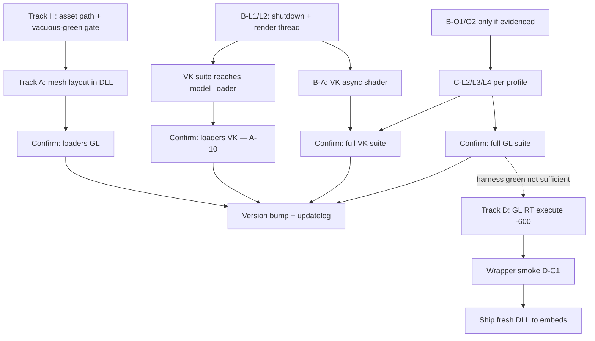

# Situation v2.4 Library Recovery Plan (Mesh PBR · Vulkan lifecycle · VD compositor)

**Status:** **Track D OPEN @ 2026-06-26** — OpenGL render-thread execute **`-600`** regression exposed by **wrapper apps** (harness still green @ 362); Track **C** closed @ 362 (readback); Track **B** partial (B-L4/B-L6/B-L7 optional)  
**Plan revision:** 2026-06-26 (v2.4.363 — Track D: GL render-thread `-600` / wrapper–harness gap; Lua embed workaround documented)  
**Current work baseline:** v2.4.362+ — canonical version in `situation_base_version.h`; **do not ship fresh `build/dll/situation_opengl.dll` to wrapper embeds until D-C1**
**Pre-recovery reference:** v2.4.345 — last snapshot before mesh PBR / harness / partial VK async fixes  
**Scope:** Fix regressions in `situation_opengl.dll` / `situation_vulkan.dll` introduced during v2.4.343–345 work — mesh loading, Vulkan async/shutdown, OpenGL VD/pattern compositor — **without going backwards** on behavior that already worked.

### Current focus (@ 2026-06-26)

| Priority | Work | Why now |
| -------- | ---- | ------- |
| **0** | **Track D — GL render-thread `-600`** | Fresh `situation_opengl.dll` kills **real apps** on first frame; harness full suite still green — **ship blocker for wrapper embeds** |
| **1** | **Siamese S3→S4** | Mechanical colocation — [`RENDERER_SIAMESE_COLOCATION_PLAN.md`](RENDERER_SIAMESE_COLOCATION_PLAN.md) |
| **2** | **Track B optional** | B-L4 audio shutdown, B-L6/B-L7 VK quad lifecycle — only if regressions reappear |

**Track D opened @ 363:** Wrapper demos (`hello_situation` Lua/Rust) die on **first** `SituationEndFrame` when linked against a **fresh** `build/dll/situation_opengl.dll`. Render thread logs `GL execute failed: -600` (`SITUATION_ERROR_OPENGL_GENERAL`). Known-good DLL from **2026-06-25** (`situation_opengl_new.dll.bak`, 3 770 370 bytes) works. See **§Track D**.

**Track C closed @ 362:** Root cause was **render-thread readback** (pre-swap screenshot + readback buffers), **not** VD compositor offset/restore. See §Failed approaches §2b and v2.4.362 baseline.

**Do not repeat:** compositor restore expansion, request-only screenshot gating without `EndFrame`→`Load` parity, `CreateReadbackBuffer` without loader GL context; **embedding fresh `build/dll` DLL into Lua exe without D-C1**.

---

## What this plan is

**This is a library recovery plan.** We ship DLLs, not test executables.

`sit_test_opengl.exe` / `sit_test_vulkan.exe` are **regression detectors**: they exercise public APIs the way real apps would and surface bugs we must fix in the library. A green run confirms the library behaves correctly; it is not the goal in itself.

### We are fixing

| Goal | Meaning |
| ---- | ------- |
| **Correct behavior** | Public APIs do what the SDK promises (load geometry, composite VDs, compile async shaders, shut down cleanly) |
| **Regression repair** | Restore behavior broken in v2.4.343–345; do not re-break fixes from v2.4.320–342 |
| **Backend parity** | Where the API promises OpenGL ≈ Vulkan, both backends must agree — verified by the same tests, not by weakening one side |

### We are not doing

| Anti-pattern | Why it is forbidden |
| ------------ | ------------------- |
| Loosening asserts, adding sleeps, or skipping tests to get green | Masks library bugs; apps would still break |
| Harness workarounds (`PollInputEvents` loops, extra frames) **instead of** library fixes | Hides lifecycle races; does not fix shutdown or compositor math |
| Shipping filtered-run green while full-suite order still fails | Going backwards — the v2.4.343–345 trap |
| Declaring parity in docs before full-suite confirmation on both backends | Metadata drift caused the versioning mess |
| **Vacuous greens** — `[SKIP]` asset missing → `[ OK ]` counts as gate pass | False target; Track A gates are meaningless without real asset load |
| **Blind B-O2 / “expand compositor restore” without polluter bisect** | VD execute path **already** calls `_SitGLBackupState` / `_SitGLRestoreState`; expanding fields without naming the polluter test **does not work** — reverted 2026-06-24 |
| **One library patch for all six GL pixel failures** | Bisect proves **three pollution profiles** (§C.1.3); bundling them guarantees backtrack |

---

## Failed approaches — do not repeat (2026-06-24 postmortem)

These were tried or seriously considered during recovery work. **They did not improve the release gate** and wasted time. Treat as hard negatives.

### 1. “Expand B-O2 / C-L7” as the first Track C code change

| What we assumed | What is true |
| --------------- | ------------ |
| VD compositor does not restore GL state | `SIT_OP_RENDER_VIRTUAL_DISPLAYS` **already** wraps execute in `_SitGLBackupState` → `_SitGLRestoreState` (`situation_impl_renderer.h`) |
| Adding viewport, texture units, UBO, shadow sync fixes all six tests | Patch was applied and **reverted same day** — **no** full-suite / module improvement |
| Order-dependent fail ⇒ compositor binding leak | Order-dependent fail only proves **something** persists across tests; **not** which API or which earlier test |

**Verdict:** Do **not** start Track C with another restore expansion. Next library change needs **C-I3 pixel evidence** + **named polluter test** (C-I2).

### 2. “One root cause for six failures”

Confirmed bisect @ 346 (GTX 1070, headless):

| Test | `--filter` alone | `--module virtual_display` | `--module graphics` | Full suite |
| ---- | ---------------- | -------------------------- | --------------------- | ---------- |
| `vd_offset_position` | PASS | **FAIL** | — | FAIL |
| `vd_color_only_no_depth` | PASS | **FAIL** | — | FAIL |
| `vd_idle_content_switch*` | PASS | **FAIL** | — | FAIL |
| `vd_idle_pattern_standby` | PASS | **PASS** | — | **FAIL** |
| `pattern_smpte_vd_bar_color` | PASS | — | **PASS** | **FAIL** |

**Three profiles — not one fix:**

| Profile | Scope | Likely polluter region |
| ------- | ----- | ---------------------- |
| **P1 — VD module order** | Four VD tests | Earlier tests **inside** `virtual_display` (blend/scale/`vd_composite_time` … before `vd_offset_position`) |
| **P2 — Pre-graphics cross-module** | `pattern_smpte_vd_bar_color` | Modules **before** `graphics` (threading, core, window, …) — *not* reproduced by `--module graphics` alone |
| **P3 — Pre-VD cross-module** | `vd_idle_pattern_standby` | `graphics`, `text_rendering`, … before `virtual_display` — *not* reproduced by `--module virtual_display` alone |

**Verdict:** A single compositor-restore patch **cannot** explain P2 and P3. Investigate each profile separately.

**Resolution @ v2.4.361–362:** All P1/P2/P3 symptoms were **one fix class** — **render-thread readback contract**, not compositor offset/FSM:

| Symptom class | Misread | Actual fix (v2.4.361–362) |
| ------------- | ------- | ------------------------- |
| P1 — VD module order (`vd_offset*`, color-only, idle×2) | Compositor offset / FSM | Always pre-swap screenshot; invalidate cache on RT handoff; `SituationRequestScreenCapture()` implemented |
| P2 — `pattern_smpte_vd_bar_color` full suite | Pre-graphics polluter | Same stale `screenshot_buffer` across modules |
| P3 — `vd_idle_pattern_standby` full suite | Cross-module VD state | Same readback race |

Bisect naming `vd_frame_time_multiplier` was **timing/queue artifact**, not root cause. **Do not** reopen compositor offset work unless new evidence after 362.

### 3. “Isolated pass ⇒ fix B-O before C-L” as a blanket rule

The decision tree (§C.1.2) still applies **per test**, but **B-O1/B-O2 is not a known missing feature** — acquire already resets soft-buffer state and `_SituationResetTrackedRasterStateForNewFrame()`. Jumping to B-O without a **specific** dirty state (viewport? FBO? global flag? offset math?) is guessing.

**Verdict:** Bisect first; then pick **one** fix class with evidence. C-L2/L3/L4 remain valid **if** polluter implicates offset / color-only FBO / idle FSM paths — not because the checklist says so first.

### 4. Filter / module-only green as progress

| Run | Misleading signal |
| --- | ----------------- |
| `--filter async_shader` 6/6 (VK) | Full suite still aborts in `core` |
| `--filter vd_offset` PASS | `--module virtual_display` still **FAIL** |
| `--module graphics` PASS (SMPTE) | Full suite still **FAIL** on SMPTE |

**Verdict:** Only **full suite** and **full module order** count toward G5/G6. Filters are bisect tools, not ship criteria.

### 5. Large harness + library change in one step

Proposed `--through` preamble bisect in harness — **not shipped** (reverted with B-O2 attempt). Acceptable future harness work: **small**, diagnostic-only, **after** manual bisect proves value.

**Verdict:** Harness changes do not fix library bugs; do not bundle with unproven DLL edits.

### 6. Rebuild without DLL load-path hygiene

A **stale `situation_opengl.dll`** in `build/tests/` (copied beside the exe) can shadow `build/dll/` on Windows → `0xC0000139` / false “we broke the harness” after rebuild.

**Verdict:** After rebuild, run from `build/tests/` with `PATH=build\dll;…` and **no** duplicate `situation_*.dll` next to the exe. Prefer `build\run_tests.bat`.

### 7. “Harness green ⇒ DLL safe for apps” (Track D @ 2026-06-26)

| What we assumed | What is true |
| --------------- | ------------ |
| Full `sit_test_opengl.exe` green @ 362 means `build/dll/situation_opengl.dll` is safe for all consumers | **Fresh DLL (2026-06-26 build)** fails **`hello_situation`** on **first presented frame** while harness still passes |
| Lua instant crash = binding / LuaJIT bug | **Library** `SITUATION_ERROR_OPENGL_GENERAL` (`-600`) from `_SituationGLExecuteCommands` on the **render thread**; Lua bindings are not the root cause |
| Rebuilding `build_situation.bat opengl` fixes GLFW log spam and is always safe | New DLL removes GLFW `0x00021001` spam (10-bit probe fixed) but **introduces** render execute failure in wrapper path |

**Verdict:** Add **wrapper smoke** (D-C1) to release gate alongside harness. Until D-C1: Lua embed uses `build/dll/situation_opengl_lua_embed.dll` (known-good copy) — see `wrappers/lua/README.md`.

### What actually works (keep doing)

1. **Matrix bisect:** filter → module → full suite (table above).
2. **Track B before Track C ship on VK** — shutdown blocks A-10, C-C9, and pollutes confidence.
3. **Name one polluter test** before any Track C library patch.
4. **C-I3** — log actual vs expected pixels on first fail (offset background, SMPTE `rgba[0]`, idle corners).
5. **Revert fast** when a patch does not move the release gate.

### Where the harness fits

Harness changes are **secondary** and only for:

- **Prerequisites** — resolve asset paths from any CWD (`sit_test_assets.h`); fail gates when required assets are absent (Track H)
- **Stricter detection** — assert `vertex_count > 0` so silent loader failures cannot return SUCCESS (Track A)
- **Attribution** — label teardown vs test name when the library crashes during shutdown (diagnostic, not a fix)
- **Failure diagnostics** — log actual pixel values / `SituationGetLastErrorMsg()` when the library output is wrong

Every fix must answer: *"Would a real application calling these APIs in this order hit the same bug?"* If yes → library fix. If only the harness sees it because of artificial sequencing → still likely a library lifecycle bug, not a test tweak.

### No going backwards

Before merging any patch:

- [ ] **Identify the regression** — which patch range introduced it (332 mesh validation, 345 VD compositor embed, etc.)
- [ ] **Fix forward** — correct implementation in the library; do not revert whole features unless proven unsalvageable
- [ ] **Confirm on full module order** — filtered `--filter` runs are development aids; release requires full `--module` or full suite on both backends where applicable
- [ ] **Preserve prior green behavior** — STL loader, text_rendering, VD scaling/blend, async shader — **restored @ 362** (full suite GL+VK green)

### v2.4.362 — full suite (release gate — user verified)

| Check | Command | v2.4.362 result | Implication |
| ----- | ------- | ----------------- | ----------- |
| GL full suite | `run_tests.bat opengl --headless` | **All pass** (user verified) | **G5/G6 satisfied** — Track C closed |
| VK full suite | `run_tests.bat vulkan --headless` | **All pass** (user verified) | G2/G6 satisfied; A-10 confirmable |
| GL modules | `graphics`, `virtual_display`, `transfer` | **120/120**, **34/34**, **12/12** @ 362 | Readback + transfer fixes landed |
| Library patches | v2.4.361–362 | Screenshot always-capture + RT handoff invalidation; `CreateReadbackBuffer` loader context; `CopyBuffer` CPU fallback | See `doc/updatelog_24_04.md` |

### v2.4.347 — full suite / full module (release gate)

| Check | Command | v2.4.347 result | Implication |
| ----- | ------- | ----------------- | ----------- |
| VK core module | `--module core --headless` | **5/5 runs, exit 0** (46/46) | Ghost AV in shutdown **fixed** — GDB: `_SituationCleanupVulkan` double-destroy |
| VK full suite | `sit_test_vulkan.exe --headless` | **553 pass / 3 fail / 9 skip** (~221 s) — **RESULTS printed** | Suite completes all modules; fails: `tone_synth.legacy_*` (3) — not shutdown |
| GL full suite | `sit_test_opengl.exe --headless` | *(unchanged @ 346)* **558 pass / 6 fail / 8 skip** | Track C open |
| VK model_loader | `--module model_loader --headless` | **Reachable in full suite** | G2 partial — A-10 can proceed |

### v2.4.346 — full suite / full module (release gate)

| Check | Command | v2.4.346 result | Implication |
| ----- | ------- | ----------------- | ----------- |
| GL graphics module | `--module graphics --headless` | **PASS** `pattern_smpte_vd_bar_color` | P2: fails only in **full suite**, not in graphics module alone |
| GL virtual_display module | `--module virtual_display --headless` | **28/32** — **4 FAIL** (offset, color-only, idle×2); `vd_idle_pattern_standby` **PASS** | P1: four tests; P3 standby is cross-module only |
| GL full suite | `sit_test_opengl.exe --headless` | **558 pass / 6 fail / 8 skip** (~152 s) | All three profiles visible together |
| GL VD failures (full suite) | (full suite order) | `pattern_smpte_vd_bar_color` (P2), four VD tests (P1), `vd_idle_pattern_standby` (P3) | See §C.1.3 — **three profiles**, not one compositor bug |
| GL loaders | `model_loader`, `obj_loader`, `stl_loader` modules | **All green** — BoomBox/teapot/bunny load + draw | **G0 + G1 (GL) satisfied** |
| VK full suite | `sit_test_vulkan.exe --headless` | **Aborts in `core`** — ghost AV after `[ OK ] module_core_assignment`; `window` partial then stop | **Earlier than 345** (345 died after `graphics`); B-L1/L2/L4 urgent |
| VK model_loader | *(not reached in full suite)* | — | Blocked until G2 |

### v2.4.346 — module / filter scoped (not release gate)

| Check | Command | v2.4.346 result | Implication |
| ----- | ------- | ----------------- | ----------- |
| VK async shader | `--module graphics --filter async_shader` | **6/6 pass** (per updatelog) | B-L3 ticket fix works **in isolation** — must reconfirm in full `graphics` order (B-C7) |
| VK model_loader | `--module model_loader --headless` | **5/5 pass** (per updatelog) | A-10 partial — module-only; full suite still blocked |
| GL SMPTE VD bar | `--module graphics --filter pattern_smpte_vd` | **PASS** | P2: filter OK; full suite FAIL |
| GL bisect matrix | (§Failed approaches §2) | Recorded @ 346 | **Required** before next Track C patch |

### v2.4.345 — pre-recovery reference (historical)

| Check | v2.4.345 result | Delta vs 346 |
| ----- | ----------------- | ------------ |
| GL SMPTE VD bar (filter) | **PASS** | 346 full `graphics`: **FAIL** — regression |
| GL VD full module | **28/32** — 4 FAIL | 346: **26/32** — 6 FAIL; `vd_idle_pattern_standby` regressed |
| VK async shader (filter) | 4/6 — poll **-1** | 346 filter: **6/6** — B-L3 landed |
| VK full suite | Aborts after `graphics` | 346: aborts in **`core`** — possibly order-sensitive or worse |
| GL model_loader | Vacuous green (SKIP BoomBox) | 346: real load — Track H fixed |

---

## Executive summary

Three library failure classes surfaced during v2.4.343–345, masked by narrow filtered runs and vacuous harness greens:

| Track | Library defect | Symptom in tests |
| ----- | -------------- | ---------------- |
| **A — Mesh PBR layout** | ~~Loaders + stride validation mismatch; GLTF swallows errors~~ | **Fixed @ 346** — loaders green on GL; VK module-only pending G2 |
| **B — Vulkan lifecycle & async shader** | ~~Render-thread shutdown, async compile ticket lifetime, cross-subsystem teardown~~ | **Shutdown fixed @ 347**; async filter **6/6**; 3 legacy audio fails in full suite |
| **C — OpenGL VD / pattern compositor** | ~~Frame-boundary state leak + compositor path~~ | **Fixed @ 362** — render-thread readback (not compositor math); full suite green |
| **D — GL render-thread execute / wrapper gap** | Fresh `situation_opengl.dll` returns **`-600`** on first `EndFrame` in **wrapper apps**; harness full suite still green | **OPEN @ 363** — Lua/Rust `hello_situation`; C `01_open_a_window` survives ~4 s on fresh DLL |
| **H — Harness prerequisites** | ~~`test_model_loader.c` ignores asset resolver~~ | **Fixed @ 346** |

Track A **library fix shipped in 346**; Track B shutdown **shipped in 347**; Track C **closed @ 362** (v2.4.361–362 readback hardening). **Track D opened @ 363** — harness gate is **not** sufficient for wrapper/consumer ship.

**Recovery-complete for harness gate:** full-suite GL+VK green @ v2.4.362 (user verified). **Wrapper ship blocked** until **G7 / D-C1**. Optional: formal 3× streak for **R-8** version policy; **B-L4/B-L6/B-L7** remain optional hardening, not blockers while suite stays green.

### OpenGL vs Vulkan contrast (@ v2.4.362)

| Area | OpenGL | Vulkan |
| ---- | ------ | ------ |
| Mesh loaders (GLTF/OBJ/STL) | **Works** | **Works** |
| Async shader unload/poll contract | **Works** | **Works** |
| VD/pattern / screen readback | **Works** (full suite) | **Works** (full suite) |
| `transfer` readback buffers | **12/12** | Green in full suite |
| Process survives full suite | **Yes** | **Yes** |
| Wrapper `hello_situation` (OpenGL, fresh DLL) | **FAIL** — render-thread `-600` frame 0 | *(not reprobed @ 363)* |

This split proves these are **library bugs in specific code paths**, not "the harness is flaky." Track D is the latest proof: **harness green ≠ all consumer paths safe**.

---

## Phase gates (hard stops — no backtrack)

Do **not** begin the next phase until every checkbox in the current gate is `[x]`. If a later phase completes but an earlier gate fails, **stop and fix backward** — do not ship.

| Gate | Unlocks | Required before proceeding | Status @ 362 |
| ---- | ------- | --------------------------- | ------------ |
| **G0 — Harness** | Track A confirmation | H-0 … H-3; `model_loader` shows **zero** `[SKIP] BoomBox` lines | **[x] Done** — 346 |
| **G1 — Track A library** | Track B investigation at scale | A-1 … A-8 merged; boombox loads with `vertex_count > 0` on **OpenGL** | **[x] Done (GL)** — VK confirmed @ 362 full suite |
| **G2 — Track B survival** | Track C full-module bisect on VK; A-10 | B-L1 … B-L2; B-C1 — full VK suite reaches `model_loader` | **[x] Done @ 362** — full VK suite green (user verified) |
| **G3 — Shared frame state** | Track C pixel fixes without shader rabbit-hole | C-I2 polluter named; C-I3 pixels logged; fix class chosen | **[x] Done @ 362** — readback contract (not compositor) |
| **G4 — Track B async** | Release candidate | B-L3, B-A1 … B-A3; B-C3, B-C4 | **[x] Done @ 362** — full suite green implies full-order async OK |
| **G5 — Track C complete** | Vulkan VD parity | C-L1 … C-L5; C-C1 … C-C8; C-C9 after G4 | **[x] Done @ 362** |
| **G6 — Release** | Recovery-complete version bump | R-1 … R-8; full GL + VK green | **[x] Done @ 362** — user verified; optional 3× streak for R-8 policy |
| **G7 — Wrapper smoke** | Ship fresh `situation_opengl.dll` to embeds | D-I1 … D-I6; D-L*; D-C1 … D-C5 | **[ ] Open @ 363** — blocks wrapper embeds |

---

## Progress dashboard

Tick when **all** items in that section are `[x]`.

- [x] **Track H** — Harness prerequisites (H-0 … H-3) — **346**
- [x] **Track A (GL)** — Mesh PBR layout + loaders (A-1 … A-9, A-11 GL) — **346**; A-10 VK **@ 362 full suite**
- [x] **Track B** — Vulkan lifecycle, async shader, shutdown — **core gates @ 347/362**; B-L4/B-L6/B-L7 optional hardening
- [x] **Track C** — OpenGL VD / pattern readback — **362** (v2.4.361–362)
- [ ] **Track D** — GL render-thread `-600` / wrapper–harness gap — **OPEN @ 363**
- [x] **Release (harness)** — Full-suite GL+VK green — **362** (user verified); **wrapper ship gated on G7**

---

## Master action checklist

Copy unchecked items into PR descriptions / commits as you land them.

### Track H — Harness prerequisites (gate G0) — **complete @ 346**

- [x] **H-0** `test_model_loader.c`: include `sit_test_assets.h`; resolve `BoomBox.glb` via `sit_test_resolve_harness_asset` (mirror `test_obj_loader.c`)
- [x] **H-1** `test_stl_loader.c`: same asset resolution for teapot STL path (if still single-prefix)
- [x] **H-2** Gate script: fail if `model_loader` output contains `[SKIP].*BoomBox` (vacuous green detector)
- [x] **H-3** Document in §A.3: tests may run from repo root **or** `build/tests/`; both must load BoomBox

### Track A — Mesh PBR layout — **library complete @ 346; VK confirm pending G2**

- [x] **A-0** *(Gate G0)* H-0 … H-3 done
- [x] **A-1** Add `SIT_MESH_LAYOUT_POS_NRM_TAN_TEX` to `situation_api_types_gpu.h` — **append before `SIT_MESH_LAYOUT_PULL` only**; document that numeric enum values shift (no persisted layout enums on disk today)
- [x] **A-2** `_SitMeshLayoutExpectedStride`: map `POS_NRM_TAN_TEX` → 48 bytes
- [x] **A-3** `_SitInferMeshLayoutFromStride`: `case 48` → `POS_NRM_TAN_TEX`; **unknown strides → error** via `CreateMeshEx` validation — remove silent `default → POS_NRM_TEX`
- [x] **A-4** `_SitGLGetOrCreateMeshVAO` (+ VK mesh IA if applicable): use layout enum, remove magic `stride == 48`
- [x] **A-5** `SituationLoadModel` (GLTF): `CreateMeshEx(..., POS_NRM_TAN_TEX)` + propagate error + rollback partial slot
- [x] **A-6** `SituationLoadModelFromOBJ`: explicit `POS_NRM_TAN_TEX` (verify error already propagates)
- [x] **A-7** Harness: on successful `SituationLoadModel`, **fail** if `gpu_mesh.vertex_count == 0` (no vacuous pass after H-0)
- [x] **A-8** Docs: align `situation_sdk.md` mesh layout text — **remove or defer** 32→48 auto-padding claim unless A-12 ships
- [x] **A-9** Confirm: `model_loader` + `obj_loader` modules green on **OpenGL** — **no SKIP lines** for required assets
- [ ] **A-10** Confirm: `model_loader` + `obj_loader` modules green on **Vulkan** — **unblocked @ 347** (G2 partial); run and tick
- [x] **A-11** Confirm: STL loader still green both backends (GL full suite; VK module-only per updatelog)
- [ ] **A-12** *(Optional, post-recovery)* Phase A2: 32→48 auto-upgrade in `SituationCreateMesh` if safe for legacy callers — **not a recovery blocker**

### Track B — Vulkan lifecycle & async shader

**Investigation (document findings before coding — blocks G2):**

- [x] **B-I1** Run `--module graphics --filter async_shader` on Vulkan (3×) — record pass/fail per test — **6/6 @ 346 (1× per updatelog; 3× still required for B-C6)**
- [ ] **B-I2** Run `--module graphics` full on Vulkan — reproduce abort + last test name
- [x] **B-I3** Run full `sit_test_vulkan.exe` — capture exit code + WER faulting module + last module reached — **@ 346: ghost AV in `core`; @ 347: suite completes 553/3/9**
- [ ] **B-I4** Bisect: render thread **on** vs **off** — note whether abort moves
- [x] **B-I5** Trace async ticket: `BeginLoadShaderFromMemory` → `UnloadShader` → poll (log ticket state) — **root cause: ABANDONED path skipped ctx free; fixed in 346 (B-L3)**
- [x] **B-I6** Write findings in this plan §B.1.3 or updatelog (fault site, thread, API) — **347: GDB findings in §B.1.3 + updatelog**
- [x] **B-I7** Document v2.4.351–352 VK internal quad findings (VD UBO overwrite, set-1 sampler bind, interim `quad_solid_texture`) — **§B.1.3 + §B.5 + `renderer_bolster_plan.md` Phase 7-bisF**

**Library fixes (order matters):**

- [x] **B-L1** Render thread: drain queue before destroying shader cache / `sit_render` — **347: join render thread first; shader cache shutdown before swapchain teardown**
- [x] **B-L2** `SituationShutdown`: join render thread before VMA / device destroy — **347: reorder + GPU flush; vma after descriptor pools**
- [x] **B-L3** `SituationUnloadShader`: cancel or await in-flight compile ticket (VK) — **346: abandon path frees ctx + ticket; filter 6/6**
- [ ] **B-L4** Audio: stop tones + wait callback idle in library at shutdown
- [ ] **B-L5** Window/icons: safe GPU resource destroy order vs window lifetime
- [ ] **B-A1** Mid-load unload: poll reaches ready or documented error (match OpenGL contract)
- [ ] **B-A2** `sync_shader_after_async_cycle`: completes within bounded time when compile succeeds
- [ ] **B-A3** Failed poll sets useful `SituationGetLastErrorMsg()` (ticket state)
- [ ] **B-O1** Reset dynamic raster state at frame acquire (both backends) — **only if C-I3 implicates tracked raster drift**; acquire path already calls `_SituationResetTrackedRasterStateForNewFrame()`
- [ ] **B-O2** VD compositor: further restore beyond existing `_SitGLBackupState`/`_SitGLRestoreState` — **blocked** until polluter + dirty field evidenced (§Failed approaches §1)
- [ ] **B-L6** Internal VK quad solid sampler lifecycle — **preferred Option A:** dedicated internal `VkImage` + descriptor set owned by quad renderer (**outside** `texture_registry`); teardown in `_SituationCleanupQuadRenderer` via graveyard after GPU pump (same pattern as VD images in `v2.5-api-expansion.md`). **Option B (fallback):** keep `SituationCreateTexture` but register as library-owned in `_SituationCleanupInternalDefaultResources` with documented graveyard-only destroy — only if Option A is blocked. **Do not** fix by shuffling destroy between shutdown helpers (reverted ad hoc @ 352).
- [ ] **B-L7** Shutdown destroy policy unification — runtime: always defer → per-frame graveyard → flush after fence; shutdown: `_SituationVulkanShutdownWaitGpuPump()` then flush **all** graveyards once in `_SituationCleanupVulkan`; remove or narrow `_SituationVulkanImmediateDestroyDuringShutdown()` in `SituationDestroyTexture` / mesh / buffer / shader / compute. **Exception:** shader-cache shutdown dedup path (347) stays special-cased. Canonical graveyard relationship: `VULKAN_SHADER_CACHE_PLAN.md` § “Relationship to graveyard”.

**Harness diagnostics only (after B-L/B-A, not instead of):**

- [ ] **B-D1** Print `RESULTS:` on fatal exit (partial summary)
- [ ] **B-D2** Label teardown in `g_sit_current_test_name`
- [ ] **B-D3** Log `SituationGetLastErrorMsg()` on async poll failure

**Confirmation:**

- [x] **B-C1** Full Vulkan suite completes all modules (`RESULTS:` printed) — **347: 553/3/9, ~221 s**
- [x] **B-C2** Zero ghost `ACCESS_VIOLATION` after `[ OK ]` (GTX 1070 ref) — **347: core 5/5 clean shutdown**
- [ ] **B-C3** `async_shader_poll_after_unload_during_load` green — **filter @ 346; full `graphics` order unverified**
- [ ] **B-C4** `sync_shader_after_async_cycle` green — **filter @ 346; full order unverified**
- [ ] **B-C5** No new leak warnings at module boundaries vs baseline
- [ ] **B-C6** 3 consecutive full Vulkan runs green
- [ ] **B-C7** `pattern_runtime_include_compile` green in **full** `graphics` module order (3×) — isolated pass alone is insufficient
- [ ] **B-C8** Zero false-positive `Leaked Texture (Slot 0, Gen 1)` at VK shutdown after B-L6 (full suite + `--module advanced` filter)
- [ ] **B-C9** `advanced.all_displays_windowed_fullscreen_cycle` VK green with documented GL visual parity (push-constant projection + set-1 bind regression guard)

### Track C — OpenGL VD / pattern compositor — **CLOSED @ v2.4.362**

**Edit targets (v2.4.360+):** GL VD composite twins → `situation_impl_vd.h`; frame opcodes → `situation_impl_renderer_frame_cmd.h`; readback fixes → `renderer_frame_cmd.h`, `renderer_lc.h`, `renderer_resources.h`, `situation_impl_image.h`.

**Investigation (classify before coding — blocks G3):**

- [x] **C-I1** Run `--filter pattern_smpte_vd` isolated vs `--module graphics` vs full suite — **all green @ 362**
- [x] **C-I2** Bisect matrix — polluter misread as `vd_frame_time_multiplier`; **root cause: readback race** @ 361–362
- [x] **C-I3** Wrong pixels documented — stale `screenshot_buffer` / missing capture (not compositor output)
- [x] **C-I4** SMPTE UBO audit — **not required** (P2 was readback)
- [x] **C-I5** Offset math / color-only FBO audit — **not required** (P1 was readback; VD placement correct once pixels fresh)
- [x] **C-I6** Document in plan — three profiles **collapsed to one fix class** @ 362

**Library fixes (shipped v2.4.361–362 — not compositor C-L*):**

- [x] **C-L*** — Superseded by readback hardening: always pre-swap capture, RT handoff invalidation, `SituationRequestScreenCapture()`, `CreateReadbackBuffer` loader context, `CopyBuffer` fallback
- [x] **C-L6** VK parity — full suite green both backends @ 362
- [x] **C-L7** Compositor restore expand — **not needed** (§Failed approaches §1)

**Confirmation:**

- [x] **C-C1** … **C-C6** — all listed VD/pattern tests green in full suite @ 362
- [x] **C-C7** — no regression in text_rendering, VD blend/scale, async shader
- [x] **C-C8** — full OpenGL suite green (user verified @ 362)
- [x] **C-C9** — full Vulkan suite green (user verified @ 362)

### Track D — GL render-thread execute `-600` / wrapper–harness gap — **OPEN @ v2.4.363**

**Edit targets:** `situation_impl_renderer_lc.h` (`_SituationGLExecuteCommands`, `_SituationRenderThreadEntry`); `situation_base_errno.h`; optional `sit_vd_compositor_gl_spirv_embed.*` link objects.

**Investigation (classify before coding — blocks G7):**

- [ ] **D-I1** Capture **first failing opcode** — read `gl_detail` from `_SituationGLExecuteCommands` (`GL 0x%X after opcode %d` @ `renderer_lc.h` ~2463–2465) or rebuild with `SITUATION_OPENGL_DEBUG`
- [ ] **D-I2** **DLL bisect** — compare `situation_opengl.dll` (3 770 866 B, 2026-06-26) vs `situation_opengl_new.dll.bak` (3 770 370 B, 2026-06-25); narrow which `.o` / embed object accounts for **+496 B**
- [ ] **D-I3** **Frame-0 packet diff** — log `soft_buffers[0].packet_count` + opcode sequence for harness minimal window path vs `hello_situation` (Lua/Rust) on first `EndFrame`
- [ ] **D-I4** **C example control** — `01_open_a_window` with fresh DLL for ≥30 s; record whether `-600` appears or only shader-heavy wrapper path fails
- [ ] **D-I5** **Harness nearest neighbor** — `--filter` / single-test runs that mirror wrapper frame 0 (user shader `LoadShaderFromMemory` + `EndFrame`); confirm green vs fail
- [ ] **D-I6** Document findings in §D.1.7 (opcode, GLenum, polluter hypothesis)

**Library fixes (order matters — after D-I*):**

- [ ] **D-L1** Fix root cause at identified execute opcode / GL state (TBD after D-I1)
- [ ] **D-L2** If embed/link delta: rebuild or pin `sit_vd_compositor_gl_spirv_embed` (or other +496 B object) with regression test
- [ ] **D-L3** *(Diagnostic)* Propagate render-thread `gl_detail` to `SituationGetLastErrorMsg()` on execute fail — aids future wrapper reports; **not** a substitute for D-L1

**Workaround (shipped @ 363 — not a library fix):**

- [x] **D-W1** `build/dll/situation_opengl_lua_embed.dll` — known-good copy (from `.bak`); **do not overwrite** `situation_opengl_new.dll.bak` during example rebuilds
- [x] **D-W2** `scripts/wrapper_compile_lua.bat` — prefer `situation_opengl_lua_embed.dll` → `.bak` → fresh `build/dll/situation_opengl.dll`; override `SIT_LUA_EMBED_DLL`
- [x] **D-W3** `tools/gen_lua_dll_embed.py` — canonical runtime extract names (`situation_opengl.dll`, `lua51.dll`)
- [x] **D-W4** `wrappers/lua/situation/helpers.lua` — default `SIT_OUTPUT_COLOR_8BIT` in `init_info_window()` (silences stale-DLL GLFW `0x00021001` spam; **orthogonal** to `-600`)
- [x] **D-W5** `wrappers/lua/README.md` — troubleshooting + embed DLL policy

**Confirmation:**

- [ ] **D-C1** **Wrapper smoke gate** — `hello_situation` Lua **and** Rust OpenGL run ≥60 s with **fresh** `build/dll/situation_opengl.dll` embedded or on PATH; **zero** `[Situation] Render thread GL execute failed: -600`
- [ ] **D-C2** `build/run_lua_dev.bat` with fresh DLL — PASS
- [ ] **D-C3** `sit_test_opengl.exe` full suite still green after D-L*
- [ ] **D-C4** `01_open_a_window` ≥30 s with fresh DLL — no `-600`
- [ ] **D-C5** Embed workaround can be relaxed (or CI fails) once D-C1 holds on three consecutive rebuilds

### Release gate

- [x] **R-1** §A.3 — GL + VK loaders confirmed @ 362 full suite
- [x] **R-2** §B.4 — full VK suite green @ 362 (B-C1/C2 core; B-C6 satisfied with user run)
- [x] **R-3** §C.4 — C-C1 … C-C9 @ 362
- [x] **R-4** Rebuild DLLs — v2.4.362 in `situation_base_version.h`
- [x] **R-5** `doc/updatelog_24_04.md` — v2.4.361–362 entries
- [x] **R-6** `doc/UPDATELOG.md` + `doc/whatsnew.md` — synced @ 362
- [ ] **R-7** `situation_sdk.md` / steering metadata — optional sync if API narrative mentions readback
- [ ] **R-8** **G6 recovery-complete** formal version bump — **362 shipped**; tick R-8 when declaring recovery tag in steering docs

---

# Track A — Mesh PBR layout (library)

> **Status @ v2.4.346:** Library + harness fixes **shipped**. G1 satisfied on OpenGL. A-10 (Vulkan full-suite confirm) blocked by G2.

## A.1 Problem *(fixed in 346 — retained for regression context)*

GLTF/OBJ loaders produce **48-byte** interleaved vertices (pos₃ + normal₃ + tangent₄ + uv₂). Before 346, `SituationCreateMesh(..., 12*sizeof(float), ...)` passed stride **48**, but `_SitInferMeshLayoutFromStride(48)` fell through to **`SIT_MESH_LAYOUT_POS_NRM_TEX` (expects 32 bytes)** → validation failed.

`SituationLoadModel` ignored the error:

```c
SituationError mesh_err = SituationCreateMesh(...);
(void)mesh_err;  // ← returned SUCCESS with empty gpu_mesh (pre-346)
```

**Not caused by VD compositor / SPIR-V embed.** Draw paths already support 48-byte PBR on both backends; only mesh **creation** is broken.

**Regression introduced:** v2.4.332 Phase C (`CreateMeshEx` + stride validation). Loaders never updated.

**Gate risk:** ~~Until H-0 ships, A-9 can show green while the library bug remains untested.~~ **Resolved @ 346.**

### Affected call sites *(post-346)*

| Loader | Stride | Error handling @ 346 |
| ------ | ------ | ---------------------- |
| `SituationLoadModel` (GLTF) | 48 | `CreateMeshEx` + rollback ✓ |
| `SituationLoadModelFromOBJ` | 48 | `POS_NRM_TAN_TEX` + propagates ✓ |
| `SituationLoadModelFromSTL` | 32 (8 floats) | Propagates ✓ — **must stay working** |

### Doc drift

`situation_sdk.md` claims 32→48 auto-padding in `SituationCreateMesh`; **not implemented** in `_SituationCreateMeshInternal`. A-8 must correct docs; do not implement A-12 during recovery unless explicitly scoped.

### Enum ABI (A-1)

Insert `SIT_MESH_LAYOUT_POS_NRM_TAN_TEX` immediately before `SIT_MESH_LAYOUT_PULL`. This shifts `PULL`'s numeric value. Safe today because layout enums are not serialized; grep for hard-coded layout integers before merging.

---

## A.2 Library fix (recommended)

> **Checklist:** A-1 … A-8 above (after A-0 / G0).

### Add explicit PBR layout enum

In `situation_api_types_gpu.h`:

```c
SIT_MESH_LAYOUT_POS_NRM_TEX = 0,   /* 32 B — legacy pos+normal+uv */
SIT_MESH_LAYOUT_POS_ONLY,
SIT_MESH_LAYOUT_POS_TEX,
SIT_MESH_LAYOUT_POS_NRM,
SIT_MESH_LAYOUT_POS_NRM_TAN_TEX, /* 48 B — PBR: pos+normal+tangent+uv (SituationVertexPBR) */
SIT_MESH_LAYOUT_PULL,
```

Update helpers in `situation_impl_renderer.h`:

| Helper | Change |
| ------ | ------ |
| `_SitMeshLayoutExpectedStride` | `POS_NRM_TAN_TEX` → 48 |
| `_SitInferMeshLayoutFromStride` | `case 48:` → `POS_NRM_TAN_TEX`; unknown strides must not silently map to 32-byte layout |
| `_SitGLGetOrCreateMeshVAO` | Prefer `vertex_layout == POS_NRM_TAN_TEX` over magic `stride == 48` |

### Loader fixes

```c
SituationError mesh_err = SituationCreateMeshEx(
    vertex_data, v_count, 12 * sizeof(float),
    index_data, i_count,
    SIT_MESH_LAYOUT_POS_NRM_TAN_TEX,
    &sit_mesh->gpu_mesh);
if (mesh_err != SITUATION_SUCCESS) { /* rollback + return mesh_err */ }
```

Apply to **GLTF and OBJ**. Add GLTF rollback mirroring OBJ (destroy partial meshes/textures/slot).

---

## A.3 Correctness confirmation (Track A)

> **Checklist:** A-9 … A-11 above. **Requires G0 + G1.**

Tests confirm library behavior; they are not the deliverable.

```powershell
Set-Location "C:\Users\User\Desktop\hobby\_kiro\situation\build\tests"
$env:PATH = "C:\msys64\mingw64\bin;C:\Users\User\Desktop\hobby\_kiro\situation\build\dll;$env:PATH"

# Vacuous-green detector (must print nothing)
& ".\sit_test_opengl.exe" --module model_loader --headless 2>&1 | Select-String "\[SKIP\].*BoomBox"
if ($LASTEXITCODE -ne 0 -or $?) { throw "BoomBox was skipped — gate failed" }

& ".\sit_test_opengl.exe" --module model_loader --headless
& ".\sit_test_vulkan.exe"  --module model_loader --headless   # after G2
& ".\sit_test_opengl.exe" --module obj_loader --headless
& ".\sit_test_vulkan.exe"  --module obj_loader --headless
```

- [x] GLTF/OBJ load produces non-empty mesh (GL) — **346 full suite**
- [ ] GLTF/OBJ load produces non-empty mesh (VK) — module-only @ 346; full suite pending G2
- [x] Mesh data readback matches uploaded PBR layout (GL)
- [ ] Mesh data readback matches uploaded PBR layout (VK) — pending G2
- [x] Draw produces non-black output (GL) — boombox/teapot/bunny draw tests pass
- [ ] Draw produces non-black output (VK) — pending G2 full suite
- [x] `SituationLoadModel` returns error (not SUCCESS) on mesh failure (GL) — harness asserts `vertex_count > 0`
- [ ] `SituationLoadModel` returns error (not SUCCESS) on mesh failure (VK) — pending G2
- [x] STL loader unchanged (GL + VK module-only)
- [x] Zero `[SKIP] BoomBox` lines in gate runs

---

# Track B — Vulkan lifecycle, async shader, shutdown (library)

## B.1 What the library is doing wrong

Full-suite `sit_test_vulkan.exe` exposes **real library defects**, not harness limitations:

| Class | Library behavior defect | Test symptom |
| ----- | ----------------------- | ------------ |
| **Deferred async work** | Render thread / audio / timers touch freed state after API calls return | Ghost `ACCESS_VIOLATION` after `[ OK ]` |
| **Async shader contract** | `UnloadShader` during compile leaves orphan ticket; poll never completes on VK | poll **-1** (OpenGL same API calls succeed) |
| **Shutdown order** | `SituationShutdown` / graphics teardown destroys resources before render thread drains | Process abort mid-suite; no modules 12–24 |
| **Leaked GPU resources** | Destroy paths skipped under error or module stress | Leak warnings → worse shutdown |
| **Internal VK 2D resources** | Library-owned quad solid sampler created via `SituationCreateTexture` → user slot 0; dangling scan runs before quad teardown | False `Leaked Texture (Slot 0, Gen 1)` at shutdown; ad hoc cleanup reorder rejected (§B.5) |
| **Shutdown immediate destroy** | `_SituationVulkanImmediateDestroyDuringShutdown()` bypasses graveyard on `SituationDestroyTexture` / mesh / buffer / shader | `[STUTTER]` / retain-reuse tension; fights `VULKAN_SHADER_CACHE_PLAN.md` graveyard contract (§B.5) |

The harness SEH **reveals** these; fixing SEH/summary printing does not fix the library.

### B.1.1 Observed runs

#### v2.4.346 full suite (GTX 1070)

| Phase | Outcome |
| ----- | ------- |
| filesystem, threading | OK |
| core | `[ OK ] module_core_assignment` then **ghost AV** (`ACCESS_VIOLATION 0xC0000005`) — harness reports FAIL on same test |
| window | Partial run after SEH — suite does not reach `graphics` |
| modules 12–24 | **Never executed** |

#### v2.4.346 filter / module-only

| Phase | Outcome |
| ----- | ------- |
| VK `--filter async_shader` | **6/6 pass** (B-L3 fix) |
| VK `--module model_loader` | **5/5 pass** |

#### v2.4.345 full suite (historical)

| Phase | Outcome |
| ----- | ------- |
| filesystem, threading | OK |
| core, window, input, timer, … | Ghost AV on deferred teardown (library) |
| graphics | `async_shader_poll_after_unload_during_load` **FAIL** (poll -1); other async_shader tests pass |
| modules 12–24 | **Never executed** — process died after `graphics` shutdown |

### B.1.2 Failure detail

#### Deferred crash after API returned (library lifecycle)

| API area | Example tests | Library hypothesis |
| -------- | --------------- | ------------------ |
| Render thread queue | `module_core_assignment` | Work queued after context partial teardown |
| Window / icons | `set_window_icons_multiple` | GPU upload lifetime vs window destroy order |
| Audio tones | `module_core_assignment` | Callback after `StopAllTones` / shutdown |
| Timers | `oscillator_ping_progress` | Timer fires into freed state |

#### Async shader (library — VK path)

| Test | v2.4.345 | v2.4.346 (filter) |
| ---- | -------- | ----------------- |
| `async_shader_begin_reports_in_progress` | PASS | PASS |
| `async_shader_load_memory_draw` | PASS | PASS |
| `async_shader_renderer_alive_while_loading` | PASS | PASS |
| `async_shader_unload_during_load` | PASS | PASS |
| `async_shader_poll_after_unload_during_load` | **FAIL** (poll -1) | **PASS** |
| `sync_shader_after_async_cycle` | *(often same class)* | PASS |

OpenGL passes the **same tests** on both versions. VK filter fixed in 346; **full `graphics` module order still unverified** (B-C7).

#### Shutdown abort

@ 345: after `graphics` module, leak warnings then process dies — render-thread AV during shutdown.  
@ 346: abort moved **earlier** to `core` (`module_core_assignment`) — same ghost-AV class; possibly order-sensitive or shutdown regression from 346 mesh/async changes.

**@ 347 (GDB-proven fix):** Ghost AV was **not** in test bodies — backtrace: `core_teardown` → `SituationShutdown` → `_SituationCleanupVulkan`. Primary bug: `_SitVkShaderCacheShutdown` destroyed identical `VkShaderModule` handles up to **5×**; secondary: duplicate `vkDestroyDescriptorPool` on overlapping pool lists. Fixes: shader-cache dedup, acquire post-create re-check, render-thread-first shutdown, VMA after pools, `seen_pools[]` dedup. **B-L4** (audio idle at shutdown) still open for legacy tone tests.

#### Order-sensitive graphics (B-C7)

`pattern_runtime_include_compile` passes in isolation (v2.4.345) but listed as pre-existing teardown crash in full order. Treat as **B track**, not C — confirm in full module only.

### B.1.3 Investigation findings

```
Date: 2026-06-24
Patch: v2.4.347 shutdown fix (GTX 1070, headless, GDB)

VK full suite @ 347:
  RESULTS: 553 pass / 3 fail / 9 skip (~221 s)
  Failures: tone_synth.legacy_play_tone_ex, legacy_play_tone, legacy_play_midi_note
  Shutdown: clean — no ghost AV

VK core @ 347:
  5/5 runs exit 0 (46/46 each)

GDB backtrace (pre-fix @ 346):
  nvoglv64.dll vkGetInstanceProcAddr
    ← _SituationCleanupVulkan()
    ← _SituationCleanupRenderer()
    ← SituationShutdown()
    ← core_teardown()  (test_core.c:46)

Root causes (347 fix):
  1. _SitVkShaderCacheShutdown Layer B: same VkShaderModule destroyed 2–5×
  2. _SitVkShaderCacheAcquireModules/Bundle: insert without post-create re-check
  3. vkDestroyDescriptorPool: manager / persistent / bindless / vd_pattern overlap
  4. SituationShutdown: render thread joined after thread-pool destroy (OpenGL did opposite)
  5. vmaDestroyAllocator before descriptor pool teardown

Files: situation_impl_renderer.h (_SitVkShaderCacheShutdown, Acquire*, _SituationCleanupVulkan)
       situation_impl_ctrl.h (SituationShutdown)

Date: 2026-06-24
Patch: v2.4.346 full-suite verification (GTX 1070, headless)

VK full suite:
  Fault: ACCESS_VIOLATION (0xC0000005) — ghost AV after test body returned
  Test name at crash: module_core_assignment (core module)
  Last module reached: core (window partial afterward — harness SEH continues)
  Modules never reached: graphics, virtual_display, model_loader (full order)

VK async_shader filter @ 346:
  async_shader_poll_after_unload_during_load: PASS (was poll -1 @ 345)
  Root cause (346 fix): _SituationVulkanFreeAsyncShaderLoad returned on ABANDONED
    without _SituationVkAsyncCompileFreeCtx → orphan ticket; next BeginLoad joined dead ticket
  File: situation_impl_renderer.h (B-L3)

Render thread on/off bisect: NOT RUN — required (B-I4)

GL full suite @ 346:
  558 pass / 6 fail / 8 skip
  Failures: pattern_smpte_vd_bar_color, vd_offset_position, vd_color_only_no_depth,
    vd_idle_content_switch, vd_idle_content_switch_colorburst, vd_idle_pattern_standby
  Classification: three pollution profiles P1/P2/P3 (§C.1.3); blind B-O2 expand reverted — no fix shipped

Date: 2026-06-24
Patch: v2.4.351–352 VK internal quad / VD correctness (GTX 1070)

Symptom (pre-351):
  advanced.all_displays_windowed_fullscreen_cycle — VK showed tiny flat 2D squares;
  OpenGL showed larger orbiting/spinning RGB cards on VD panels.

Root causes:
  1. VD quad draws recorded ortho into shared view UBO during command recording;
     SituationRenderVirtualDisplays overwrote UBO with main-window ortho before vkQueueSubmit
     → GPU executed VD draws against wrong projection (tiny tiles).
  2. Solid DrawQuad: fragment shader declares layout(set=1) sampler2D; no set-1 bind
     → validation VUID-vkCmdDraw-None-08600; missing/incorrect draws.

Interim fixes shipped (351–352 — correctness only, lifecycle still open):
  - Push-constant mat4 projection per internal quad/texture/YPQ draw (not UBO-dependent).
  - Internal 1×1 white texture via SituationCreateTexture → sit_render.vk.quad_solid_texture
    + set-1 bind on every solid DrawQuad.
  - Depth bias dynamic state on internal quad draws (VUID-04877).

Open lifecycle defects (plan tickets — do not ad hoc patch):
  - quad_solid_texture occupies user texture_registry slot 0 → false leak warning when
    _SituationCleanupDanglingResources runs before _SituationCleanupQuadRenderer.
  - Immediate destroy during SITUATION_STATE_SHUTTING_DOWN bypasses graveyard (B-L7).

Rejected ad hoc (@ 352): move quad_solid destroy to _SituationCleanupInternalDefaultResources
  without graveyard policy — reverted; see B-L6.

Cross-plan: renderer_bolster_plan.md Phase 7-bisF; plan_handles_ssbo.md D1 audit (v352).
```

---

## B.2 Investigation (find the library bug)

> **Checklist:** B-I1 … B-I6 above. **Blocks G2.**

```powershell
Set-Location "C:\Users\User\Desktop\hobby\_kiro\situation\build\tests"
$env:PATH = "C:\msys64\mingw64\bin;C:\Users\User\Desktop\hobby\_kiro\situation\build\dll;$env:PATH"

& ".\sit_test_vulkan.exe" --module graphics --filter async_shader --headless
& ".\sit_test_vulkan.exe" --module graphics --headless
& ".\sit_test_vulkan.exe" --headless; Write-Host "exit: $LASTEXITCODE"
```

**Not acceptable as "fix":** adding harness sleep/pump loops without a matching library guarantee that async work is drained at API boundaries.

---

## B.3 Library fixes (implementation)

> **Checklist:** B-L1 … B-D3 in master list. Files: `situation_impl_renderer.h`, `situation_impl_ctrl.h`, async shader, audio, window.

**Explicitly rejected as primary fix:** B-D* before B-L1/B-L3; post-test `EndFrame` loops without library drain API.

**Fix order:** B-L1 → B-L2 (suite survival) before B-L3/B-A* (async contract). **Track C:** C-I2 polluter + C-I3 pixels before any C-L or B-O patch (§Failed approaches).

---

## B.4 Correctness confirmation (Track B)

> **Checklist:** B-C1 … B-C9 above.

Full suite must complete because the **library** must survive real app shutdown after heavy graphics use:

```powershell
& "C:\Users\User\Desktop\hobby\_kiro\situation\build\run_tests.bat" vulkan --headless
```

---

## B.5 Internal VK 2D renderer lifecycle and shutdown defer policy

**Added @ plan revision 2026-06-24 (v2.4.352).** Captures findings from VK vs GL VD quad mismatch work. **Do not** land further lifecycle or destroy-path changes outside these tickets.

### B.5.1 Problem split (three issues — do not conflate)

| ID | Issue | Shipped? | Ticket |
| -- | ----- | -------- | ------ |
| **B.5.1a** | VD projection wrong at GPU execute (shared view UBO overwrite) | **Yes** — push-constant projection per draw (351) | Regression: **B-C9**; contract: **`renderer_bolster_plan.md` Phase 7-bisF** |
| **B.5.1b** | Solid `DrawQuad` missing Vulkan set-1 sampler bind | **Yes** — interim `quad_solid_texture` + bind (352) | **B-L6** replaces interim with proper internal ownership |
| **B.5.1c** | False leak warning + shutdown/stutter policy | **No** | **B-L6** + **B-L7** |

OpenGL solid quad uses `use_texture=0` with no registry texture — **target parity** is “no user-facing slot 0”, not necessarily identical GL/VK shader binding mechanics (see `plan_handles_ssbo.md` D1).

### B.5.2 B-L6 — Internal quad solid sampler (preferred Option A)

**Option A (preferred):** Quad renderer owns a dedicated 1×1 white `VkImage` / `VkImageView` / `VkDescriptorSet` **outside** `texture_registry`. No `SituationCreateTexture` for library-internal solid fills. Teardown: queue destroy through graveyard in `_SituationCleanupQuadRenderer` after `_SituationVulkanShutdownWaitGpuPump()`.

**Option B (fallback):** Keep public texture API for the white texel, but treat as library-owned: destroy only via graveyard in `_SituationCleanupInternalDefaultResources`, documented in code and SDK. Use only if Option A is blocked by descriptor-pool layout constraints.

**Explicitly rejected:**

- Shuffling `quad_solid_texture` destroy between `_SituationCleanupInternalDefaultResources` and `_SituationCleanupQuadRenderer` without graveyard policy (tried and reverted @ 352).
- Synchronous `vkDestroy*` during `_SituationCleanupDanglingResources` to silence leak scan.

**Confirmation:** **B-C8** — no `Leaked Texture (Slot 0, Gen 1)` at end of VK full suite or `--module advanced`.

### B.5.3 B-L7 — Shutdown destroy policy (graveyard canonical)

Align all shutdown GPU teardown with `VULKAN_SHADER_CACHE_PLAN.md` § “Relationship to graveyard”:

| Phase | Policy |
| ----- | ------ |
| **Runtime** | `SituationDestroyTexture` / mesh / buffer / shader → `_SituationDeferDestroy*` → per-frame graveyard → flush after fence |
| **Shutdown** | `_SituationVulkanShutdownWaitGpuPump()` → flush **all** graveyards **once** in `_SituationCleanupVulkan` → then swapchain / device teardown |
| **Exception** | Shader cache shutdown dedup (347) — already special-cased; do not generalize immediate destroy from this path |

**Non-goal:** Using immediate destroy during shutdown to reduce `[STUTTER]` — stutter attribution stays on Phase 10 / shader-cache retain-reuse (`renderer_bolster_plan.md` Phase 10, `ASYNC_SHADER_LOAD_HARDENING_PLAN.md`).

**Files (implementation):** `situation_impl_renderer.h` (`SituationDestroyTexture`, graveyard flush, `_SituationCleanupVulkan`), `situation_impl_ctrl.h` (`SituationShutdown` order vs `_SituationCleanupDanglingResources`).

### B.5.4 Implementation order

1. **B-L6** — remove slot-0 registry coupling (fixes false leak without reorder hacks).
2. **B-L7** — unify shutdown defer (may touch same teardown sites; land after B-L6 design is chosen).
3. **B-C8**, **B-C9** — confirm before marking G4/G6 items that depend on VK internal 2D stability.

---

# Track C — OpenGL VD / pattern compositor (library) — **CLOSED @ v2.4.362**

## C.1 What the library was drawing wrong *(historical @ 346 — fixed @ 362)*

OpenGL run **completed** but **six** pixel contracts failed in **full-suite order** @ 346. **Root cause @ 362:** render-thread **screenshot/readback contract** — stale `screenshot_buffer`, not compositor offset/FSM.

| Was classified as | Test evidence @ 346 | Fix @ 361–362 |
| ----------------- | ------------------- | ------------- |
| P2 SMPTE bar | `pattern_smpte_vd_bar_color` full suite FAIL | Always pre-swap capture + cache invalidation on RT handoff |
| P1 VD offset / color-only / idle | Four VD tests module-order FAIL | Same readback fix; VD layout was correct |
| P3 pattern standby | Full suite only | Same readback fix |

**Misread avoided:** compositor restore expansion, offset math changes (§Failed approaches §1–§2b).

### C.1.4 Resolution summary (@ v2.4.362)

| Patch | Library change |
| ----- | ---------------- |
| **361** | `SituationRequestScreenCapture()`; Siamese S2 VD execute colocation; bisect tooling |
| **362** | Always pre-swap screenshot; invalidate on RT queue; `CreateReadbackBuffer` loader GL context + `GL_DYNAMIC_STORAGE_BIT`; deferred map; `CopyBuffer` CPU fallback |

**Harness @ 362:** `graphics` 120/120, `virtual_display` 34/34, `transfer` 12/12, full suite GL+VK green (user verified).

### C.1.1 Observed runs *(historical)*

#### v2.4.346 full suite (GTX 1070)

| Module | Library outcome |
| ------ | --------------- |
| `graphics` | **FAIL** `pattern_smpte_vd_bar_color`; most other graphics tests pass |
| `text_rendering` | **8/8 OK** |
| `virtual_display` | **26/32** — 6 FAIL (see verified baseline); blend/scale/z-order mostly OK |

#### v2.4.345 full suite (historical)

| Module | Library outcome |
| ------ | --------------- |
| `graphics` | `pattern_smpte_vd_bar_color` **PASS** (filter) |
| `text_rendering` | Correct |
| `virtual_display` | **28/32** — 4 FAIL; `vd_idle_pattern_standby` PASS |

Leak warnings at module end = library destroy paths not run (often because test failed mid-path) — expect leaks to drop after C-L2..L4; do not chase leaks before fixing the four failures.

### C.1.2 Decision tree (use before writing shader code)

```
For each failing test, run: --filter → --module X → full suite (see §Failed approaches §2)

Isolated PASS + full module FAIL (same module)?
├─ YES → P1: polluter is an earlier test IN that module → C-I2 bisect within module
│         Fix may be C-L2/L3/L4, compositor math, or targeted state — NOT blind restore expand
└─ NO  → continue

Isolated PASS + full module PASS + full suite FAIL?
├─ YES → P2 or P3: polluter is an EARLIER MODULE → bisect which module (core? graphics? text_rendering?)
│         Fix is NOT the VD compositor restore path unless proven
└─ NO  → Always-wrong output in isolation → shader/UBO/path audit (C-L1, C-I4)
```

**@ 346:** Four VD tests = **P1**. SMPTE = **P2** (passes `--module graphics`). `vd_idle_pattern_standby` = **P3** (passes `--module virtual_display`).

### C.1.3 Pollution profiles (confirmed bisect — do not collapse)

| Profile | Tests | Repro command | Next investigation |
| ------- | ----- | ------------- | ------------------ |
| **P1** | `vd_offset_position`, `vd_color_only_no_depth`, `vd_idle_content_switch*` | `--module virtual_display` **FAIL**; `--filter` **PASS** | Walk test order in `test_virtual_display.c`; find first test after which offset fails (C-I2) |
| **P2** | `pattern_smpte_vd_bar_color` | `--module graphics` **PASS**; full suite **FAIL** | Bisect modules before `graphics` (threading → core → …) |
| **P3** | `vd_idle_pattern_standby` | `--module virtual_display` **PASS**; full suite **FAIL** | Bisect `graphics` + `text_rendering` before VD module |

Do **not** assign one fix to all profiles without completing this table.

---

## C.2 Investigation

> **Checklist:** C-I1 … C-I6 above. **Blocks G3.**

```powershell
Set-Location "C:\Users\User\Desktop\hobby\_kiro\situation\build\tests"
$env:PATH = "C:\msys64\mingw64\bin;C:\Users\User\Desktop\hobby\_kiro\situation\build\dll;$env:PATH"

& ".\sit_test_opengl.exe" --module graphics --filter pattern_smpte_vd --headless
& ".\sit_test_opengl.exe" --module virtual_display --filter "vd_offset|vd_color_only|vd_idle" --headless
& ".\sit_test_opengl.exe" --module virtual_display --headless
& ".\sit_test_opengl.exe" --headless
```

**Key bisect:** Use the §Failed approaches §2 matrix. **Do not** patch until a polluter test is named for the relevant profile (P1/P2/P3).

---

## C.3 Library fixes (implementation)

> **Checklist:** C-L1 … C-T1 in master list.

**Gate:** No C-L patch until **C-I2** names polluter + **C-I3** logs wrong pixels for that profile (§C.1.3).

**B-O2 note:** Compositor execute **already** restores via `_SitGLBackupState` / `_SitGLRestoreState`. Further restore work requires evidence of **which** GL field stays dirty — blind expansion **failed** (§Failed approaches §1).

---

## C.4 Correctness confirmation (Track C)

> **Checklist:** C-C1 … C-C9 above.

```powershell
& "C:\Users\User\Desktop\hobby\_kiro\situation\build\run_tests.bat" opengl --headless
```

C-C9 requires Track B complete — Vulkan cannot validate VD until suite survives past `graphics`.

---

# Track D — OpenGL render-thread execute `-600` / wrapper–harness gap (library) — **OPEN @ v2.4.363**

> **Why this track exists:** Track C closed the **harness** readback/compositor pixel failures @ v2.4.362. Track D is a **new regression class**: the **same** DLL that passes `sit_test_opengl.exe` full suite can **kill real wrapper apps** on the **first presented frame**. This is the recurring OpenGL pain point the user flagged @ 2026-06-26 — not a LuaJIT bug, not a GLFW log-spam cosmetic.

## D.0 Bug registry

| Field | Value |
| ----- | ----- |
| **ID** | `D-GL-RT-600` |
| **Opened** | 2026-06-26 @ v2.4.363 |
| **Severity** | **P0** — ship blocker for Lua/Rust/Python embeds and any consumer using fresh `build/dll/situation_opengl.dll` |
| **Error code** | `SITUATION_ERROR_OPENGL_GENERAL` = **`-600`** (`situation_base_errno.h`) |
| **User-visible symptom** | Window opens **black**, closes on first or second frame; Lua: instant exit after `SituationEndFrame` |
| **Stderr signature** | `[Situation] Render thread GL execute failed: -600` |
| **Harness @ 362** | `run_tests.bat opengl --headless` — **full suite green** on same machine |
| **Workaround** | Embed known-good DLL via `situation_opengl_lua_embed.dll` — see §D.5 |

**Not the same bug as Track C @ 361–362.** Track C was stale `screenshot_buffer` / readback context (`CreateReadbackBuffer` `-600` on **main thread**). Track D is **`_SituationGLExecuteCommands` failure on the render thread** during normal frame presentation — after readback hardening shipped.

---

## D.1 What the library is doing wrong

### D.1.1 Failure path (code)

1. Main thread records commands into `sit_render.gl.soft_buffers[frame_index]` and calls `SituationEndFrame()`.
2. Render thread `_SituationRenderThreadEntry` waits on frame fence, then calls `_SituationGLExecuteCommands(&sit_render.gl.soft_buffers[frame_index], frame_index)` (`situation_impl_renderer_lc.h` ~10394–10398).
3. Inside the execute loop, **each opcode** is followed by `glGetError()`; first non-`GL_NO_ERROR` returns:

```c
snprintf(gl_detail, sizeof(gl_detail),
    "_SituationGLExecuteCommands: GL 0x%X after opcode %d",
    (unsigned)gl_err, (int)p->opcode);
return _SituationSetErrorFromCode(SITUATION_ERROR_OPENGL_GENERAL, gl_detail);
```

(`situation_impl_renderer_lc.h` ~2460–2469)

4. Execute failure is logged to stderr but presentation may still attempt; wrapper apps treat non-success as fatal or exit the loop immediately.

**Investigation priority:** capture **`opcode`** and **`GL 0x…`** from `gl_detail` on the failing build — without this, fixes are guesswork (§Failed approaches §3).

### D.1.2 DLL artifact evidence (@ 2026-06-26, GTX 1070 ref)

| Artifact | Size (bytes) | Timestamp | `hello_situation` (Lua) | Notes |
| -------- | -----------: | --------- | ----------------------- | ----- |
| `build/dll/situation_opengl.dll` | **3 770 866** | 2026-06-26 12:25 | **FAIL** — first-frame `-600` | Fresh `build_situation.bat opengl` |
| `build/dll/situation_opengl_new.dll.bak` | **3 770 370** | 2026-06-25 02:11 | **PASS** | Canonical known-good |
| `build/dll/situation_opengl_lua_embed.dll` | **3 770 370** | 2026-06-25 02:11 | **PASS** | Copy of `.bak` for embed pipeline |

**Delta:** **+496 bytes** in fresh DLL — not a rebuild timestamp artifact; implies at least one linked object or embed blob changed between 2026-06-25 and 2026-06-26. **D-I2** must name the object.

**Guardrail:** **Do not overwrite** `situation_opengl_new.dll.bak` when rebuilding examples — it was accidentally overwritten once during 2026-06-26 testing.

### D.1.3 Reproduction matrix

| Consumer | Command / path | Fresh DLL (2026-06-26) | Known-good DLL |
| -------- | -------------- | ---------------------- | -------------- |
| **Lua** `hello_situation` | `build\build_lua_example.bat opengl hello_situation` | Black window → immediate exit; stderr `-600` | Demo runs (torus + HUD) |
| **Rust** `hello_situation` | OpenGL DLL on PATH / embed | Reported same class @ 363 | — |
| **Lua dev** | `build\run_lua_dev.bat` + fresh `build\dll\situation_opengl.dll` | **FAIL** | PASS with embed DLL |
| **C** `01_open_a_window` | `build\build_examples.bat opengl 01_open_a_window` | Ran **~4 s** (not instant crash) @ 363 | Not re-tested |
| **Harness** | `run_tests.bat opengl --headless` | **Green @ v2.4.362** baseline | — |

**Harness gap (§Failed approaches §7):** Full suite exercises hundreds of tests across modules but **does not** mirror wrapper **frame-0** opcode sequences (user shader load + draw + `EndFrame` in a single-process embed). **D-C1** adds wrapper smoke to the release gate.

### D.1.4 Secondary symptom — GLFW `0x00021001` spam (fixed in source; not root cause)

On **older** embedded DLLs with `SituationInitInfo.output_color_depth = SIT_OUTPUT_COLOR_AUTO`, startup logged:

```
GLFW Error 65537: Invalid window attribute 0x00021001
GLFW Error 65537: Invalid window attribute 0x00021002
GLFW Error 65537: Invalid window attribute 0x00021003
```

| Constant | Meaning |
| -------- | ------- |
| `0x00021001` | `GLFW_RED_BITS` |
| `0x00021002` | `GLFW_GREEN_BITS` |
| `0x00021003` | `GLFW_BLUE_BITS` |

**Cause:** Pre-363 code probed framebuffer bit depth via `glfwGetWindowAttrib` — invalid API for framebuffer attributes.

**Fixes shipped @ 363:**

| Layer | Change |
| ----- | ------ |
| Library | `_SituationOpenGLSetOutputColorDepthFromFramebuffer()` uses `glGetIntegerv(GL_RED_BITS / GL_GREEN_BITS / GL_BLUE_BITS)` after GLAD init (`situation_impl_renderer_lc.h` ~2636–2658) |
| Lua | `helpers.lua` → `init_info_window()` sets `output_color_depth = SIT_OUTPUT_COLOR_8BIT` |

**Critical:** Rebuilding fresh DLL **removes GLFW spam** but **introduces or exposes** the render-thread `-600` on wrapper path. Do not confuse the two issues.

### D.1.5 Hypotheses (unconfirmed — investigate via D-I*)

| # | Hypothesis | Rationale |
| - | ---------- | ----------- |
| **H1** | Updated **`sit_vd_compositor_gl_spirv_embed`** object in +496 B link | SPIR-V VD compositor linked into OpenGL DLL (`situation_impl_renderer_shader.h` includes `sit_vd_compositor_gl_spirv_embed.h`); first-frame execute may bind SPIR-V program path not hit by harness order |
| **H2** | **Frame-0 opcode** in wrapper differs from harness acquire/clear path | `hello_situation` loads user GLSL + draws + `EndFrame` immediately; bisect packet list (D-I3) |
| **H3** | **Render-thread GL state** after 363 init/10-bit probe change | Fresh DLL changed output-depth probe; wrapper uses 8-bit hint — interaction untested on frame 0 |
| **H4** | **Build/link hygiene** only | Benign `.rsrc merge failure: duplicate leaf: type 10 (VERSION)` documented in `doc/done/MAKEFILE_BUILD_MIGRATION_PLAN.md` — unlikely `-600` cause; note when bisecting |

**Rejected without evidence:**

- LuaJIT FFI / binding generator bug (failure is library `-600` from render thread, reproducible outside Lua with fresh DLL on PATH).
- Track C compositor restore expansion (§Failed approaches §1 — already reverted; different symptom class).
- “Rebuild fixes it” — **fresh rebuild is the failing artifact**.

### D.1.6 Relationship to prior `-600` fixes (v2.4.362)

| Prior fix | Thread | API | Track D? |
| --------- | ------ | --- | -------- |
| `CreateReadbackBuffer` loader GL context | Main / host | `SituationCreateReadbackBuffer` | **No** — transfer module green @ 362 |
| `CopyBuffer` CPU fallback | Render | `SIT_OP_COPY_BUFFER` | **No** — transfer 12/12 @ 362 |
| Pre-swap screenshot / readback invalidation | Render | `EndFrame` capture | **No** — VD/pattern pixels fixed @ 362 |

Track D is a **regression or latent path** not covered by harness @ 362, not a reopen of Track C readback math.

### D.1.7 Investigation log *(fill as D-I* complete)*

```
Date: 2026-06-26
Reporter: user + assistant (Lua embed pipeline)
Machine: GTX 1070, Windows 10, MinGW GCC 15.x

Repro (fresh DLL):
  build\build_situation.bat opengl
  build\build_lua_example.bat opengl hello_situation
  → black window, exit frame 0–1
  stderr: [Situation] Render thread GL execute failed: -600

Repro (known-good):
  copy /Y build\dll\situation_opengl_new.dll.bak build\dll\situation_opengl_lua_embed.dll
  build\build_lua_example.bat opengl hello_situation
  → demo runs

First failing opcode:  TBD (D-I1)
GLenum from gl_detail: TBD (D-I1)
Object bisect (+496 B): TBD (D-I2)
```

---

## D.2 Investigation

> **Checklist:** D-I1 … D-I6 above. **Blocks G7.**

```powershell
Set-Location "C:\Users\User\Desktop\hobby\_kiro\situation"

# 1. Confirm fresh vs known-good (Lua smoke)
copy /Y build\dll\situation_opengl_new.dll.bak build\dll\situation_opengl_lua_embed.dll
build\build_lua_example.bat opengl hello_situation

# 2. Repro fresh DLL (dev mode — no embed workaround)
build\build_situation.bat opengl
$env:PATH = "C:\Users\User\Desktop\hobby\_kiro\situation\build\dll;$env:PATH"
build\run_lua_dev.bat   # expect -600

# 3. C control (minimal loop)
build\build_examples.bat opengl 01_open_a_window
build\examples\01_open_a_window.exe

# 4. Harness still green?
build\run_tests.bat opengl --headless

# 5. DLL size check
Get-ChildItem build\dll\situation_opengl*.dll* | Select-Object Name, Length, LastWriteTime
```

**Not acceptable as "fix":** embedding known-good DLL forever (D-W* is **temporary**); silencing `-600` without fixing opcode; skipping wrapper smoke in release gate.

---

## D.3 Library fixes (implementation)

> **Checklist:** D-L1 … D-L3. **After D-I1 names opcode + GLenum.**

**Fix order:** D-I1 (opcode) → D-I2 (object bisect if needed) → D-L1 (targeted execute fix) → D-C1 … D-C5.

**Files (expected):** `situation_impl_renderer_lc.h` (execute loop, render-thread entry); possibly `situation_impl_renderer_shader.h`, `build/opengl/sit_vd_compositor_gl_spirv_embed.c`, `situation_impl_vd.h`.

---

## D.4 Correctness confirmation (Track D)

> **Checklist:** D-C1 … D-C5 above. **G7 requires D-C1 + D-C3.**

```bat
REM Wrapper smoke (release gate — run with FRESH build\dll\situation_opengl.dll)
build\build_situation.bat opengl
set SIT_LUA_EMBED_DLL=build\dll\situation_opengl.dll
build\build_lua_example.bat opengl hello_situation
build\examples\lua\hello_situation.exe

build\run_tests.bat opengl --headless
```

---

## D.5 Workaround — Lua embed (shipped @ 363, not a library fix)

Until **D-C1** passes on fresh DLL:

```bat
copy /Y build\dll\situation_opengl_new.dll.bak build\dll\situation_opengl_lua_embed.dll
build\build_lua_example.bat opengl hello_situation
```

| Mechanism | Location |
| --------- | -------- |
| Prefer known-good embed DLL | `scripts/wrapper_compile_lua.bat` |
| Canonical extract filenames at runtime | `tools/gen_lua_dll_embed.py` |
| User docs / troubleshooting | `wrappers/lua/README.md` |
| 8-bit default (GLFW spam) | `wrappers/lua/situation/helpers.lua` |

Override for testing fresh DLL: `set SIT_LUA_EMBED_DLL=build\dll\situation_opengl.dll` before `build_lua_example.bat`.

---

# Cross-track dependencies



- **G0 (H) and G1 (GL) satisfied @ 346** — do not re-do mesh/harness work unless regressions appear.
- **G7 (Track D) @ 363** — harness G6 **does not** unlock wrapper embeds; **D-C1** required.
- **B-L1/L2 before A-10 and C-C9** — VK suite must survive shutdown.
- **C-I2 + C-I3 before any C-L patch** — polluter + pixels; do not repeat blind B-O2 expand (§Failed approaches).
- **Library fixes first** (B-L, B-A, C-L when evidenced); harness diagnostics (B-D*, H-*) never instead of library work.
- Track C fixes should **propagate to Vulkan** compositor — not a second divergent implementation.
- **G6 recovery-complete bump only** after §A.3 + §B.4 + §C.4 on full suites; interim 346 patch documented in updatelog.

---

# Implementation order (hardened — do not reorder without updating gates)

Work top-to-bottom. Skipping investigation when root cause is unknown causes backtrack.

| Step | Work | Gate unlocked | Status @ 363 |
| ---- | ---- | ------------- | ------------ |
| **0a** | **Track D investigate: D-I1 … D-I6** | G7 classification | **[ ] Open — P0** |
| **0b** | **Track D fix: D-L1 … D-L3 + D-C1 … D-C5** | G7 / wrapper ship | **[ ] Blocked on 0a** |
| **0** | Track H: H-0 … H-3 | G0 | **[x] Done** |
| **1** | Track A library: A-1 … A-8 | G1 | **[x] Done** |
| **2** | Track A confirm GL: A-9, A-11 (OpenGL) | — | **[x] Done** |
| **3** | Track B investigate: B-I1 … B-I6 | — | **[~] Partial** — B-I4, B-I2 open |
| **4** | Track B shutdown: B-L1, B-L2 | G2 (partial) | **[x] Done @ 347** |
| **5** | Track C investigate: C-I2 polluter per profile, C-I3 pixels | G3 classification | **[~] Bisect matrix done** — polluter names open |
| **6** | Track C **evidence-based** fix (C-L* or targeted B-O) | G3 | **[ ] Blocked** — no patch until step 5 complete |
| **7** | Track C remaining profiles + regressions (P2, P3, C-L5) | — | **[ ] Open** |
| **8** | Track B async confirm: B-A1 … B-A3 (full order) | G4 | **[~] B-L3 filter done** |
| **9** | Track B deferred teardown: B-L4, B-L5 | — | **[ ] Open** |
| **9b** | Track B internal 2D lifecycle: **B-L6**, **B-L7** (§B.5) | B-C8, B-C9 | **[ ] Open** — correctness @ 351–352; lifecycle not landed |
| **10** | Track C VK port: C-L6 | C-C9 | **[ ] Blocked by G2/G4** |
| **11** | Diagnostics: B-D1 … B-D3 | — | **[ ] Open** |
| **12** | Confirm + ship: A-10, B-C1 … B-C9, C-C1 … C-C9, R-1 … R-8 | G6 | **[x] Harness @ 362** |
| **13** | **Track D wrapper smoke: D-C1 … D-C5** | G7 | **[ ] Open — P0** |

**Rationale:** **Track D (0a/0b) is P0 @ 363** — do not ship fresh OpenGL DLL to wrapper embeds until D-C1. Track B shutdown before Track C ship on VK. Track C library work requires **named polluter** per §C.1.3 — the 2026-06-24 blind B-O2 expand **did not work** and was reverted (§Failed approaches).

---

# Files touched (expected)

| Area | Files |
| ---- | ----- |
| Harness prerequisites | `test_model_loader.c`, `test_stl_loader.c`, `sit_test_assets.h`, optional gate in `run_tests.bat` |
| Mesh layout | `situation_api_types_gpu.h`, `situation_impl_renderer.h` |
| Loaders | `SituationLoadModel`, OBJ path in `situation_impl_renderer.h` |
| VK lifecycle | `situation_impl_renderer.h`, `situation_impl_ctrl.h`, async shader, internal quad (`quad_solid_texture`, graveyard flush) |
| OpenGL VD compositor | SPIR-V embed compositor, SMPTE VD, idle fallback, `SituationRenderVirtualDisplays` |
| **Track D — GL RT execute** | `situation_impl_renderer_lc.h`, `sit_vd_compositor_gl_spirv_embed.*`, `scripts/wrapper_compile_lua.bat`, `tools/gen_lua_dll_embed.py`, `wrappers/lua/` |
| Harness (detection/diagnostics only) | `test_model_loader.c`, `sit_test_framework.h`, optional pixel logging; **future:** wrapper smoke in `run_tests.bat` (D-C1) |
| Docs | `situation_sdk.md`, `updatelog_24_04.md`, `wrappers/lua/README.md`, `RGL_TEST_PATTERN_SHADER_MIGRATION_PLAN.md` |

---

# Non-goals

- New pattern types or §5.3 COLORBURST certification beyond restoring **existing** API contracts
- STUTTER / slow tests (`pattern_3d_grid_axis_red` ~5s) — performance, not correctness
- Harness-only green without library behavior change
- **G6-only** recovery-complete version bump — interim patches (346) documented in updatelog; do not declare recovery shipped until G6
- NVIDIA `0x502` post-VD drain workaround removal — separate fix; do not regress pixels
- **Duplicate `situation_*.dll` in `build/tests/`** — causes false crash after rebuild (§Failed approaches §6)

---

# Reference logs

### v2.4.346 — reverted blind B-O2 attempt (2026-06-24)

```
Attempt: expand _SitGLBackupState/_SitGLRestoreState (viewport, tex units, UBO, shadow sync)
Result: reverted same day — no change to module or full-suite fail count
Lesson: compositor already had backup/restore; see §Failed approaches §1
```

### v2.4.346 — OpenGL bisect matrix (confirmed)

```
vd_offset / vd_color_only / vd_idle_* : filter PASS, module virtual_display FAIL
vd_idle_pattern_standby               : filter PASS, module virtual_display PASS, full suite FAIL
pattern_smpte_vd_bar_color            : filter PASS, module graphics PASS, full suite FAIL
```

### v2.4.346 — OpenGL full suite (GTX 1070)

```
RESULTS: 572 total, 558 passed, 6 failed, 8 skipped
FAILED TESTS:
  - graphics.pattern_smpte_vd_bar_color
  - virtual_display.vd_offset_position
  - virtual_display.vd_color_only_no_depth
  - virtual_display.vd_idle_content_switch_colorburst
  - virtual_display.vd_idle_content_switch
  - virtual_display.vd_idle_pattern_standby
TIME: 152.31s
```

### v2.4.347 — Vulkan full suite (GTX 1070, shutdown fix)

```
[ OK ] module_core_assignment
… all modules …
RESULTS: 565 total, 553 passed, 3 failed, 9 skipped
FAILED TESTS:
  - tone_synth.legacy_play_tone_ex
  - tone_synth.legacy_play_tone
  - tone_synth.legacy_play_midi_note
TIME: 220.70s
exit: 1 (test failures — not ACCESS_VIOLATION)
```

### v2.4.346 — Vulkan full suite (GTX 1070, pre-fix)

```
[ OK ] module_core_assignment (320.7ms)
CRASH: ACCESS_VIOLATION (0xC0000005) in test 'module_core_assignment'
[FAIL] module_core_assignment (466.7ms)
… window module partial … (suite aborts before graphics)
```

### v2.4.345 — OpenGL `virtual_display` (historical)

```
[FAIL] vd_offset_position
[FAIL] vd_color_only_no_depth
[FAIL] vd_idle_content_switch_colorburst
[FAIL] vd_idle_content_switch
[ OK ] vd_idle_pattern_standby
… 28/32 pass
```

### v2.4.345 — Vulkan `async_shader` filter (historical — fixed @ 346)

```
[ OK ] async_shader_begin_reports_in_progress
[ OK ] async_shader_load_memory_draw
[ OK ] async_shader_renderer_alive_while_loading
[ OK ] async_shader_unload_during_load
[FAIL] async_shader_poll_after_unload_during_load — poll -1
```

### v2.4.363 — Track D: wrapper `-600` vs harness green (2026-06-26)

```
Fresh DLL:  build/dll/situation_opengl.dll           3770866 bytes  2026-06-26 12:25
Known-good: build/dll/situation_opengl_new.dll.bak  3770370 bytes  2026-06-25 02:11
Delta: +496 bytes

Lua hello_situation + fresh DLL:
  → window black, exit frame 0–1
  stderr: [Situation] Render thread GL execute failed: -600

Lua hello_situation + situation_opengl_lua_embed.dll (copy of .bak):
  → demo runs (user verified: "solid work, perfect")

Harness (baseline @ 362):
  run_tests.bat opengl --headless → full suite green

GLFW spam on OLD embed (AUTO color depth) — secondary, not root cause:
  Invalid window attribute 0x00021001 / 0x00021002 / 0x00021003
  (GLFW_RED/GREEN/BLUE_BITS via glfwGetWindowAttrib — fixed in source @ 363)

C control:
  01_open_a_window + fresh DLL → ran ~4 s (not instant crash)

Workaround pipeline:
  copy /Y build\dll\situation_opengl_new.dll.bak build\dll\situation_opengl_lua_embed.dll
  build\build_lua_example.bat opengl hello_situation
```

---

*Revision 2026-06-26: **Track D opened @ v2.4.363** — GL render-thread `-600` on wrapper apps; harness still green @ 362; Lua embed workaround + G7 wrapper-smoke gate. Prior: **Track C closed @ v2.4.362** — readback hardening; full suite GL+VK green (user verified).*