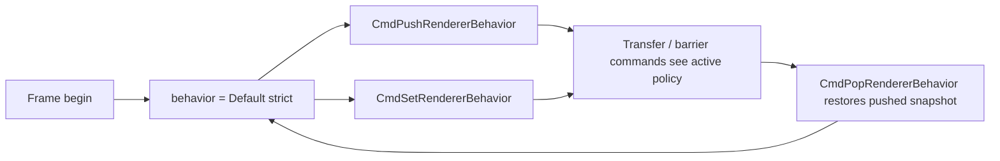

# Phase 14 — Renderer Behavior Policy Commands (Design)

**Date:** 2026-06-29  
**Status:** **COMPLETE @ v2.4.391** — Phase 14 command-stack slices 1–4 shipped. Companion **Phase 3b** readback harness shipped @ **v2.4.392** (`transfer.render_target_readback`, GL+VK).  
**Target line:** v2.4.x (after Phase 9 or first P10 slice)  
**Priority:** HIGH — maintainer-selected bolter target  
**Risk:** MEDIUM if layout-assist or usage-fallback slices ship before harness proofs; LOW for Slice 1 infrastructure + one knob  

**Primary files:**

| File | Role |
|------|------|
| `sit/situation_api_graphics.h` | Public policy struct + `SituationCmdSet/Push/PopRendererBehavior` |
| `sit/situation_impl_decl.h` | `SIT_OP_*` opcodes, GL packet args, stack limits |
| `sit/situation_impl_renderer_frame_cmd.h` | Record APIs, frame reset, `_SitGetActiveRendererBehaviorPolicy` |
| `sit/situation_impl_renderer_resources.h` | Transfer Cmd* consult policy (usage, filter, layout assist) |
| `sit/situation_impl_renderer_lc.h` | GL executor: behavior stack replay, assisted barriers at execute |
| `tests/harness/test_transfer.c` | `transfer.behavior_*` labels |
| `doc/RENDERER_COMMAND_STACK.md` | Status row → ✅ after Slice 1 |
| `doc/plan/renderer_bolster_plan.md` | Phase 14 cross-link |
| `doc/misc/RENDERER_BARRIER_COOKBOOK.md` | Strict-default + opt-in assist callouts |

**Related decisions:** Phase 3–4 bolster plan (strict transfer usage, explicit texture barriers, no hidden Y-flip), **`doc/RENDERER_COMMAND_STACK.md`** deferred row.

**Constraint:** default policy remains **strict, portable, Vulkan-safe**. Opt-in modes must be **visible in the command stream** and **testable on GL + VK**.

---

## Purpose

Today, “strict vs convenient” renderer behavior is encoded as **hard-coded validation** in transfer and barrier commands (see `SituationCmdBlitTexture` usage/filter checks in `situation_impl_renderer_resources.h`). The bolster plan deferred **assisted** behavior to Phase 14 so we never silently diverge between OpenGL and Vulkan.

Phase 14 adds **command-buffer-scoped policy state** — the same conceptual layer as `PushRasterState` / `PopRasterState`, but for cross-cutting renderer semantics:

- transfer usage strictness  
- texture layout handling  
- blit filter fallback  
- validation / reporting level  
- (reserved) coordinate flip policy — stays strict in v2.4; explicit per-blit flags are a future API, not a hidden global  

Users who want cookbook-style ergonomics opt in with recorded commands; everyone else keeps current strict errors.

---

## Background — what strict means today

| Area | Strict behavior (v2.4.387) | Deferred to Phase 14 |
|------|----------------------------|----------------------|
| **Transfer usage** | Missing `TRANSFER_SRC` / `TRANSFER_DST` → `SITUATION_ERROR_TEXTURE_INVALID_USAGE` / buffer equivalent | “Compatible” alias when backend could still perform the copy |
| **Texture layout** | No hidden pre/post transitions around blit/copy; caller owns `SituationCmdTextureBarrier` | Assisted transitions around transfer commands |
| **Blit filter** | Linear without sampled usage → error | Downgrade to nearest + `SituationLog(SIT_LOG_WARNING, …)` |
| **Coordinates** | Top-left API space; no implicit Y-flip | Global flip policy **not planned** — prefer explicit blit/region flags later |
| **Validation tone** | Fail with `_SituationSetErrorFromCode` | WARN / COMPAT modes for legacy examples (log + proceed where safe) |

Phase **3b** (`COLOR_ATTACHMENT` ↔ `TRANSFER_SRC` readback) shipped @ **v2.4.392** — behavior policy does **not** replace explicit barriers in strict mode. In **assisted layout** mode (Slice 3+), 3b is easier but strict path stays canonical in docs.

---

## API surface

### Policy axes (explicit enums — not bitflags)

Bitflags are avoided so each axis stays documented, testable, and extensible without combinatorial ambiguity.

```c
/* Default for every field: *_STRICT / *_EXPLICIT / SIT_RENDERER_VALIDATION_STRICT. */
typedef enum SituationTransferUsagePolicy {
    SIT_TRANSFER_USAGE_STRICT = 0,
    SIT_TRANSFER_USAGE_COMPATIBLE_FALLBACK
    /* SIT_TRANSFER_USAGE_AUTO_TEMP — v2.5+ only; requires temp resource pool; not v2.4. */
} SituationTransferUsagePolicy;

typedef enum SituationTextureLayoutPolicy {
    SIT_TEXTURE_LAYOUT_EXPLICIT = 0,
    SIT_TEXTURE_LAYOUT_ASSISTED
    /* SIT_TEXTURE_LAYOUT_TRACKED — v2.5; per-texture layout table + barrier synthesis. */
} SituationTextureLayoutPolicy;

typedef enum SituationBlitFilterPolicy {
    SIT_BLIT_FILTER_STRICT = 0,
    SIT_BLIT_FILTER_DOWNGRADE_NEAREST
} SituationBlitFilterPolicy;

typedef enum SituationCoordinatePolicy {
    SIT_COORDINATE_STRICT = 0
    /* Future: per-command flip flags on SituationTextureBlitRegion, not global policy. */
} SituationCoordinatePolicy;

typedef enum SituationRendererValidationPolicy {
    SIT_RENDERER_VALIDATION_STRICT = 0,
    SIT_RENDERER_VALIDATION_WARN,
    SIT_RENDERER_VALIDATION_COMPAT
} SituationRendererValidationPolicy;

typedef struct SituationRendererBehaviorPolicy {
    SituationTransferUsagePolicy transfer_usage;
    SituationTextureLayoutPolicy texture_layout;
    SituationBlitFilterPolicy blit_filter;
    SituationCoordinatePolicy coordinate;
    SituationRendererValidationPolicy validation;
} SituationRendererBehaviorPolicy;

SITAPI SituationRendererBehaviorPolicy SituationRendererBehaviorPolicyDefault(void);

SITAPI SituationError SituationCmdSetRendererBehavior(
    SituationCommandBuffer cmd,
    const SituationRendererBehaviorPolicy* policy);

SITAPI SituationError SituationCmdPushRendererBehavior(
    SituationCommandBuffer cmd,
    uint32_t scope_id);

SITAPI SituationError SituationCmdPopRendererBehavior(
    SituationCommandBuffer cmd,
    uint32_t scope_id);
```

**`SituationRendererBehaviorPolicyDefault()`** returns all-strict fields. Document as the only recommended production default.

**Partial updates:** v1 `Set` replaces the **whole** struct (no per-field mask). Callers copy default, mutate fields, then set — same ergonomics as filling `SituationRenderPassInfo` helpers.

---

## Command-stack semantics

Mirror **`PushRasterState` / `PopRasterState`** (`situation_impl_renderer_frame_cmd.h`):



| Rule | Behavior |
|------|----------|
| **Frame reset** | On `SituationAcquireFrameCommandBuffer` / VK frame setup: policy = `Default()`, stack depth = 0 (same slot as `raster_stack_depth` reset). |
| **`Set`** | Overwrites active policy; does not push stack. |
| **`Push`** | Saves active policy on stack, then leaves active unchanged (optional follow-up `Set` inside scope). **Alternative (chosen):** Push saves snapshot; nested `Set` inside scope modifies active only; Pop restores snapshot. Matches raster push = capture GL/VK state, then mutations, then pop restores. |
| **`Pop`** | Underflow → `SITUATION_ERROR_INVALID_PARAM`. `scope_id` recorded for debug/trace; mismatch vs push **does not fail** in release (raster parity). |
| **Max depth** | `SITUATION_MAX_BEHAVIOR_STACK_DEPTH` = **32** (new constant in `situation_api_config.h`). |
| **Render pass** | Policy is **not** pass-scoped unless user pushes/pops around pass bodies. No automatic push at `BeginRenderPass`. |
| **Secondary buffers** | N/A in v2.4 (single main cmd buffer). Future: inherit default at acquire; no cross-buffer stack sharing. |
| **VD / compositor** | Internal VD draw paths **ignore** user behavior policy (always strict internal). Only **user-recorded** transfer/barrier commands consult policy. |

### Recording vs execution (GL vs VK)

| Backend | Policy application |
|---------|-------------------|
| **Vulkan** | Transfer commands record immediately. Policy read at **record time** from `sit_render.vk` active policy + stack. Assisted layout (Slice 3) emits extra `vkCmdPipelineBarrier` at record time. |
| **OpenGL soft buffer** | Record `SIT_OP_SET/PUSH/POP_RENDERER_BEHAVIOR` packets. Maintain `current_policy` + stack on `SituationGLSoftCommandBuffer` during recording. Transfer packets store **handles only**; executor reads **executor-time** active policy when handling `SIT_OP_BLIT_TEXTURE` etc. Validation errors that must fail the API call happen at **record time** (match VK). |

**Invariant:** for the same command sequence, record-time errors on GL match VK (strict mode proofs unchanged).

---

## Internal architecture

### Shared helper

```c
static const SituationRendererBehaviorPolicy* _SitGetActiveRendererBehaviorPolicy(
#if defined(SITUATION_USE_OPENGL)
    const SituationGLSoftCommandBuffer* buf
#elif defined(SITUATION_USE_VULKAN)
    void
#endif
);
```

### Storage (parallel to raster stack)

**OpenGL** — extend `SituationGLSoftCommandBuffer` (`situation_impl_decl.h`):

```c
SituationRendererBehaviorPolicy behavior;
SituationRendererBehaviorPolicy behavior_stack[SITUATION_MAX_BEHAVIOR_STACK_DEPTH];
int behavior_stack_depth;
```

**Vulkan** — extend `sit_render.vk`:

```c
SituationRendererBehaviorPolicy behavior;
SituationRendererBehaviorPolicy behavior_stack[SITUATION_MAX_BEHAVIOR_STACK_DEPTH];
int behavior_stack_depth;
```

Reset both in the same frame-begin block that clears `raster_stack_depth` (`situation_impl_renderer_frame_cmd.h` ~L122, `situation_impl_renderer_lc.h` ~L10015).

### Opcodes (GL soft buffer)

| Opcode | Args | Executor |
|--------|------|----------|
| `SIT_OP_SET_RENDERER_BEHAVIOR` | full struct | copy to `buf->behavior` |
| `SIT_OP_PUSH_RENDERER_BEHAVIOR` | `scope_id` | push `behavior`, depth++ |
| `SIT_OP_POP_RENDERER_BEHAVIOR` | `scope_id` | pop → `behavior`, depth-- |

Vulkan: Push/Pop/Set update `sit_render.vk` immediately at API call (no Vk replay — policy is CPU-side state consulted when recording subsequent commands).

### Consultation points

Add `_SitValidateTransferTextureUsage(slot, required_flags, policy)` used by:

- `SituationCmdBlitTexture`
- `SituationCmdCopyTexture`
- `SituationCmdCopyBufferToTexture`
- `SituationCmdCopyTextureToBuffer`
- `SituationCmdCopyBufferEx` (buffer usage variant)

Add `_SitResolveBlitFilter(region, src_slot, policy)` → effective filter or error.

Slice 3+: `_SitMaybeEmitTransferLayoutBarriers(cmd, src, dst, policy)` before VK blit/copy and in GL executor.

---

## Per-axis behavior specification

### 1. Transfer usage (`SituationTransferUsagePolicy`)

| Mode | Textures | Buffers |
|------|----------|---------|
| **STRICT** (default) | Require exact usage bits (current code). | Require `TRANSFER_SRC` / `TRANSFER_DST`. |
| **COMPATIBLE_FALLBACK** | If missing `TRANSFER_SRC` but has `SAMPLED` and operation is read-only transfer from color texture: **allow** with WARNING when `validation >= WARN`. Still reject storage-only / incompatible formats. | No fallback in v2.4 slice — buffers stay strict. |

**Non-goals:** silently creating temp images, retroactively mutating `usage_flags` on the slot, or auto-barrier without layout policy.

### 2. Texture layout (`SituationTextureLayoutPolicy`)

| Mode | Behavior |
|------|----------|
| **EXPLICIT** (default) | Unchanged. User barriers required. VK assumes `TRANSFER_SRC_OPTIMAL` / `TRANSFER_DST_OPTIMAL` at blit/copy record (current). |
| **ASSISTED** (Slice 3) | Before transfer commands, if internal **optional** last-layout hint disagrees with required transfer layouts, insert barriers. Requires per-texture **hint** updated by `TextureBarrier` + transfer ops — not full tracked layout engine. |
| **TRACKED** (v2.5) | Full layout table; may synthesize barrier chains. Out of v2.4 scope. |

**Slice 1–2:** only `EXPLICIT` is functional; `ASSISTED` returns `NOT_IMPLEMENTED` from `Set` until Slice 3. **Slice 3 @ v2.4.390:** `ASSISTED` accepted; hint-based transfer layout synthesis wired.

### 3. Blit filter (`SituationBlitFilterPolicy`)

| Mode | Current strict check | Policy behavior |
|------|---------------------|-----------------|
| **STRICT** | Linear requires `SAMPLED \| COMPUTE_SAMPLED` | Unchanged — error `TEXTURE_FORMAT_UNSUPPORTED`. |
| **DOWNGRADE_NEAREST** | — | If linear requested but sampled usage missing: log WARNING (if `validation >= WARN`), execute as **nearest**; harness asserts pixel equality with nearest blit. |

GL FBO blit and VK `vkCmdBlitImage` both use resolved filter.

### 4. Coordinate (`SituationCoordinatePolicy`)

**v2.4:** only `STRICT`. Reserved field for ABI stability.

Future: `SituationTextureBlitRegion` flags (`flip_y`, `mirror_x`) — explicit per blit, not global policy (Phase 4 decision: no hidden backend flip).

### 5. Validation (`SituationRendererValidationPolicy`)

| Mode | Effect |
|------|--------|
| **STRICT** | Errors only; no policy downgrade logs. |
| **WARN** | Policy-driven fallbacks emit `SituationLog(SIT_LOG_WARNING, …)` once per command (include trace id + policy axis). |
| **COMPAT** | Same as WARN for v2.4; reserved for future “accept deprecated wrapper paths” — **does not** disable hard errors for invalid handles, OOB regions, or Vulkan validation breakers. |

---

## Delivery slices

Implement in order. Each slice is shippable with harness + UPDATELOG.

### Slice 1 — Infrastructure + blit filter downgrade (spike)

**Scope:**

- [x] Public struct, enums, `Default()`, `Set/Push/Pop` APIs + trace ids  
- [x] GL opcodes + executor replay; VK CPU stack  
- [x] Frame reset  
- [x] **`blit_filter` axis only** functional (`DOWNGRADE_NEAREST`)  
- [x] Other axes accepted in struct but must equal strict / explicit or `Set` returns `INVALID_PARAM` for unsupported combo (fail fast until slice lands)

**Harness (`test_transfer.c`):**

| Label | Proof |
|-------|-------|
| `transfer.behavior_policy_default_strict` | Linear-without-sampled still errors under default |
| `transfer.behavior_policy_push_pop` | Push → set downgrade → blit succeeds → pop → strict error returns |
| `transfer.behavior_blit_filter_downgrade` | Pixel match nearest reference |
| `transfer.behavior_stack_bounds` | overflow/underflow |

**Exit criteria:** command stream contains visible Set/Push/Pop; strict default unchanged for modules not using policy.

### Slice 2 — Transfer usage compatible fallback

- [x] Narrow COMPATIBLE_FALLBACK table (documented in cookbook)  
- [x] `transfer.behavior_transfer_usage_fallback` GL+VK  
- [x] Update **`RENDERER_BARRIER_COOKBOOK.md`** — strict path remains recommended  

### Slice 3 — Layout assisted (minimal hints)

- [x] Last-layout hint on texture slot updated by `TextureBarrier` + transfer  
- [x] Assisted barriers only for transfer-src/dst optimal around copy/blit  
- [x] Enables Phase **3b** harness `transfer.render_target_readback` with assisted **optional** path; strict path still required test  

### Slice 4 — Validation WARN/COMPAT + docs

- [x] Log formatting (`renderer behavior:` prefix), `SituationSetTraceLogLevel` interaction note  
- [x] Phase 12: **`guide/renderer_bolster.md`** section + command reference rows  
- [x] **`RENDERER_COMMAND_STACK.md`** row ✅  

---

## Error codes and trace

| Case | Result |
|------|--------|
| null cmd / null policy | `SITUATION_ERROR_INVALID_PARAM` |
| stack overflow/underflow | `SITUATION_ERROR_INVALID_PARAM` |
| unsupported enum value | `SITUATION_ERROR_INVALID_PARAM` |
| TRACKED before slice ships | `SITUATION_ERROR_NOT_IMPLEMENTED` from `Set` if requested |
| strict validation failure | existing errno (`TEXTURE_INVALID_USAGE`, etc.) |

New trace entries in `situation_base_trace.h` for the three Cmd* functions (follow `SituationCmdPushRasterState` numbering block).

---

## Non-goals (Phase 14)

- Global `SituationSetRendererBehavior` configure API (frame-wide hidden state) — **command buffer only**  
- Changing VD compositor, internal screenshot, or `EndFrame` present paths  
- Auto-temp textures (`AUTO_TEMP`) in v2.4  
- Full layout tracker (`TRACKED`) in v2.4  
- Implicit Y-flip or coordinate policy beyond strict  
- Weakening default strict behavior when policy commands are absent  

---

## Open questions (resolved for design)

| Question | Decision |
|----------|----------|
| Single struct vs split enums? | **Single struct**, explicit enum per axis |
| Bitflags vs enums? | **Enums** per axis |
| Partial Set with mask? | **Full struct replace** in v1 |
| Push before or after Set inside scope? | **Push captures current**; Set mutates active; Pop restores (raster model) |
| Max stack depth? | **32** |
| Pass-bound policy? | **User-managed** push/pop; no automatic pass scope |
| Internal draws respect policy? | **No** — user Cmd* only |
| MM-1 / Phase 14 ordering? | Phase 14 first (maintainer priority) |

---

## Maintainer sign-off checklist (Slice 1)

1. [x] Approve enum names and struct layout (ABI stable — add fields only at end in future)  
2. [x] Approve Slice 1 scope (infrastructure + blit filter only)  
3. [x] Confirm VD/internal paths exempt from policy  
4. [x] Record harness run in `doc/UPDATELOG.md` on ship  

---

## Suggested first PR shape

1. Decl + API headers + `Default()` + no-op strict path (all transfer commands call helper; strict branch = current code).  
2. Push/Pop/Set + frame reset + GL opcodes.  
3. `DOWNGRADE_NEAREST` in `_SitResolveBlitFilter`.  
4. Four harness tests.  
5. Doc: this file status → **Slice 1 shipped**, bolster plan checkboxes, command stack row.

Estimated touch surface: ~400–600 LOC + tests (similar magnitude to Phase 6 raster push/pop).
