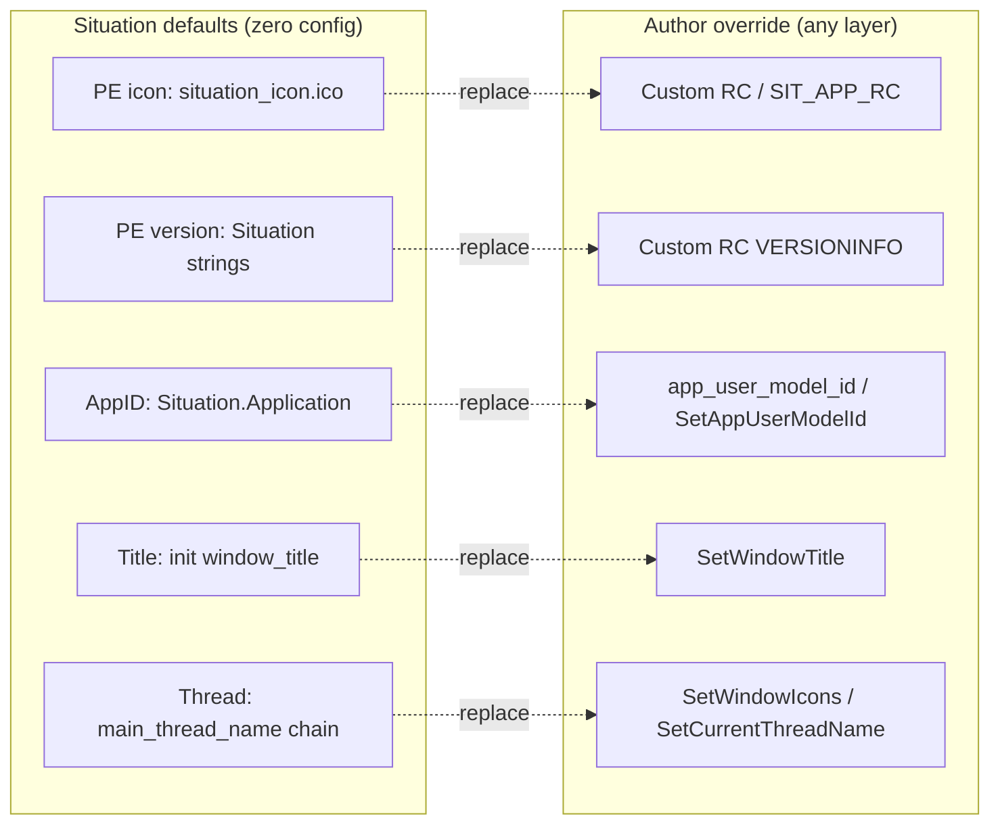

# Situation Application Identity Plan

**Status:** **`SIT_IDENTITY_PLAN`** — **Windows baseline complete @ v2.4.400** (WI-0 ✅ … WI-5 ✅). **Active tracks:** WI-6+ (Win32 shell polish), **LI-*** (Linux `.desktop` / WMClass), **MA-*** (macOS bundle).  
**Scope:** Cross-platform **process / shell / bundle / PE resource identity** for **any application built on Situation** — defaults the library owns out of the box, with **author overrides at every layer** (build-time resources, shell application ID, runtime window chrome, thread names).  
**Version map:** **v2.4.399** = WI-0–WI-4 (Win32 identity baseline). **v2.4.400** = WI-5 (`default_window_icon_path`). **v2.4.401+** = per approved slice below (WI-6 … MA-*).  
**Primary files:** `sit/platform/windows/` (shipped), `sit/platform/linux/` + `sit/platform/macos/` (planned), `sit/situation_impl_ctrl.h`, `sit/situation_api_types_system.h`, `sit/situation_api_platform.h`, `build/build_examples.bat`, `tests/harness/Makefile`, `doc/guide/windows_app_identity.md`.  
**Related plans:** `doc/done/MAKEFILE_BUILD_MIGRATION_PLAN.md` (§ Icon + VERSIONINFO for DLLs), `doc/plan/renderer_bolster_plan.md` **Phase 11-bis** (honesty-boundary pattern), `doc/plan/KTERM_CONSOLE_GOALS_PLAN.md` (console title polish).  
**Constraint:** keep public API cross-platform where possible; tag platform-only fields and behavior explicitly. **Library provides defaults; never block author overrides.** Repo examples use defaults unless they opt in to an override (none required today).

### Plan map (all platforms)

| Phase | Platform | Slices | Status | Target version |
|-------|----------|--------|--------|----------------|
| **I — Windows baseline** | Win32 | WI-0 … WI-5 | ✅ complete | v2.4.399–400 |
| **II — Win32 shell polish** | Win32 | WI-6 jump lists, WI-7 taskbar progress/overlay | Open | v2.4.401+ (TBD) |
| **III — Linux desktop** | Linux | LI-0 … LI-4 | Open | TBD (Linux port gate) |
| **IV — macOS bundle** | macOS | MA-0 … MA-3 | Open | TBD (macOS port gate) |

Former orphan tracks (**WI-L**, deferred jump lists / taskbar overlay) are **folded into this plan** — no separate identity roadmap.

---

## How to use this file

1. Read **§ Chess pieces** (Windows) and **§ Cross-platform identity layers** before implementing anything — shell identity is several independent mechanisms, not one API call.
2. **Architecture (all platforms):** [architecture.md](../architecture.md#application-identity-architecture-v24399) — cross-platform identity layers; Windows shipped detail; Linux (**LI-***) / macOS (**MA-***) roadmap below.
3. **Windows baseline (Phase I):** execute WI-0 … WI-5 in order — **complete @ v2.4.400**. Next Win32 work: **WI-6** / **WI-7** only after maintainer approval.
4. **`SetCurrentProcessExplicitAppUserModelID` must run before the first top-level window** (before `glfwCreateWindow`). Library hook belongs in `_SituationInitPlatform`, not after window creation.
5. **Build-time PE resources** (icon + version) default to **`sit_app.rc`**; authors override by linking their own RC (or `SIT_APP_RC` / harness `APP_RC=`) — same mechanism for examples, harness, and shipped products.
6. **Linux / macOS:** follow **LI-*** / **MA-*** slices when those platforms ship; reuse `SituationInitInfo` fields (`default_window_icon_path`, future `startup_wm_class`, bundle ID) — do not fork a second identity system.
7. When a slice ships, update `doc/UPDATELOG.md`, `doc/whatsnew.md`, platform guides, and [architecture.md](../architecture.md#application-identity-architecture-v24399). See **§ Version release gate**.
8. **No rogue implementation:** do not fork GLFW window creation, do not require MSVC resource compiler; Win32 COM for jump lists / taskbar APIs is **WI-6 / WI-7 only**, not baseline init.

---

## Cross-platform identity layers

Same **defaults + overrides** model on every OS. **Phase I (WI-*)** shipped the Windows column; **Phase III–IV** fill Linux and macOS.

| Layer | What users / OS see | Runtime (all platforms) | Windows @ v2.4.400 | Linux (**LI-***) | macOS (**MA-***) |
|-------|---------------------|-------------------------|--------------------|--------------------|------------------|
| **Bundle / PE metadata** | Explorer icon, Properties → Details, launcher name | — | `sit_app.rc` icon + `VS_VERSION_INFO` | `.desktop` + hicolor icons | `Info.plist` + `.icns` in bundle |
| **Shell application ID** | Pin/group/relaunch identity | — | `AppUserModelID` → **`Situation.Application`** | `StartupWMClass` + `.desktop` `StartupWMClass=` | `CFBundleIdentifier` |
| **Window title** | Title bar, live taskbar/dock label | `window_title`, `SituationSetWindowTitle()` | same | same | same |
| **Window icon (live)** | Taskbar / title bar / dock (running) | `SituationSetWindowIcons()`; **`default_window_icon_path`** @ init | same | same (X11/Wayland) | same |
| **Thread name** | Debugger / OS thread list | `main_thread_name` chain, `SituationSetCurrentThreadName()` | MinGW `OpenThread` path | `pthread_setname_np` / prctl | `pthread_setname_np` |
| **Shell shortcuts / polish** | Jump lists, progress, overlay | — | **WI-6**, **WI-7** (open) | `.desktop` `Actions=` (optional LI-4) | Dock tile progress (future) |

**Planned layout:**

```text
sit/platform/
├── windows/   ← Phase I shipped (WI-0–WI-5)
├── linux/     ← Phase III (LI-0–LI-4): .desktop templates, WMClass, icon theme
└── macos/     ← Phase IV (MA-0–MA-3): Info.plist defaults, .icns, bundle hooks
```

Cross-platform fields in `SituationInitInfo` (`app_user_model_id`, `default_window_icon_path`, future Linux/macOS fields) are **ignored or no-op off-platform** until the matching hook lands — same struct, platform-specific apply in `_SituationInitPlatform`.

---

## Core model — library defaults, author overrides

**Every Situation application** (game, tool, example, harness) gets a **coherent default identity** from the library. Authors replace **any layer** when they need their own branding — no special case for in-repo vs out-of-tree.



### Override matrix (all layers)

| Layer | What users see | **Library default** | **Author override** |
|-------|----------------|---------------------|---------------------|
| **1 — PE icon** | Explorer, Alt+Tab base, embedded window class | `sit_app.rc` → `situation_icon.ico` (hourglass) | Own `.rc` + `.ico` at link; `SIT_APP_RC=…` in build scripts |
| **2 — PE version** | Task Manager Description, Properties → Details | **`sit_app.rc`** extended with Situation `VS_VERSION_INFO` (WI-2) | Custom RC / `sit_app_template.rc` + `-DAPP_*` windres flags |
| **3 — AppUserModelID** | Pin-to-taskbar, jump lists, shell grouping | **`Situation.Application`** when `app_user_model_id` is NULL (WI-1) — not Windows path hash | `SituationInitInfo::app_user_model_id`, `SituationWin32SetAppUserModelId()` before init |
| **4a — Window title** | Title bar, taskbar label | `init_info.window_title` (author sets at init; no library string default beyond NULL) | `SituationSetWindowTitle()` |
| **4b — Window icon (runtime)** | Taskbar/title bar live icon | Match embedded PE icon if author did not call setter (WI-5 optional auto-load) | `SituationSetWindowIcons()` |
| **4c — Thread name** | Task Manager Threads, debuggers | `main_thread_name` → `window_title` → `"Sit Main"` | `SituationSetCurrentThreadName()` |
| **Shell shortcut** | Pinned Start/taskbar metadata | N/A (installer) | `.lnk` with matching AppUserModelID + optional relaunch icon/name |

**Precedence rules:**

1. **Build-time beats nothing** — if the author links no RC, default `sit_app.rc` applies (Situation icon + version).
2. **Explicit author RC replaces defaults entirely** for PE layers — windres object from custom RC wins over `sit_app.rc`; do not merge RC files silently.
3. **Runtime overrides win for live window** — `SetWindowTitle` / `SetWindowIcons` affect the running window only; they do not rewrite PE resources.
4. **AppID is process-global, set once** — first successful `SetCurrentProcessExplicitAppUserModelID` wins; init path runs only if not already set by `SituationWin32SetAppUserModelId()`.
5. **Examples use defaults by choice** — `demon_hunt` and other in-repo samples ship with Situation branding because they do not pass overrides, not because overrides are forbidden.

---

## The problem (honesty boundary)

Situation already controls **runtime window chrome**:

| Mechanism | API / field | What it affects |
|-----------|-------------|-----------------|
| Title bar / taskbar label | `SituationInitInfo::window_title`, `SituationSetWindowTitle` | Live window text |
| Taskbar / title-bar icon (runtime) | `SituationSetWindowIcon(s)` | Icon after window exists |
| Thread label | `main_thread_name`, `SituationSetCurrentThreadName` | Task Manager **Threads** tab, debuggers |

That is **not** full Windows executable identity. Windows additionally reads:

| Mechanism | Source | What it affects |
|-----------|--------|-----------------|
| **PE icon resource** | EXE `.rsrc` slot `1 ICON` | Explorer, Properties, Alt+Tab (before/during window), default taskbar icon |
| **PE version resource** | EXE `VS_VERSION_INFO` | Task Manager **Description**, file Properties dialog |
| **Process image name** | EXE filename on disk | Task Manager **Apps** name, default grouping |
| **App User Model ID (AppID)** | `SetCurrentProcessExplicitAppUserModelID` + matching shortcuts | Pin-to-taskbar, jump lists, shell "app" grouping, icon/name pairing when pinned |

**Honesty boundary:** Situation can own cross-platform **window title, runtime icon, and thread names**. **Full Win32 shell identity** requires **PE resources at link time** and **AppUserModelID at process start** — genuinely extra integration, not something `window_title` alone provides.

Today all examples and harness EXEs link the shared minimal resource:

```rc
// sit/platform/windows/sit_app.rc — icon only, Situation branding
1 ICON "situation_icon.ico"
```

DLLs carry version metadata in `situation_resource.rc`; EXEs today link icon-only `sit_app.rc`. **Goal:** extend the **default EXE RC** with Situation `VS_VERSION_INFO` + default AppID at init, while documenting **override at every layer** for any author building on the library.

---

## Existing Situation icon assets (shipped @ v2.4.274–275)

The project **already has** a production multi-resolution Windows icon. Piece 1 is wired via default `sit_app.rc`; authors replace it by linking a different RC.

| Asset | Path | Role |
|-------|------|------|
| **Source PNG** | `scripts/art/icon_source.PNG` | RGBA logo (664×614); canonical design input |
| **Generator** | `scripts/gen_situation_icon.py` | Pillow → multi-size `.ico` (16, 32, 48, 64, 128, 256) |
| **Committed ICO** | `sit/platform/windows/situation_icon.ico` | **Default** icon for all layers unless overridden |
| **Default EXE RC** | `sit/platform/windows/sit_app.rc` | Default `1 ICON` (+ `VS_VERSION_INFO` when WI-2 lands) |
| **Override template** | `sit/platform/windows/sit_app_template.rc` (WI-2) | Parameterized RC for full author branding |
| **DLL RC** | `sit/platform/windows/situation_resource.rc` | Library DLL identity (separate from app EXE) |

Regenerate after art changes:

```powershell
python scripts/gen_situation_icon.py
```

Build embed (examples/tests):

```powershell
windres sit\platform\windows\sit_app.rc -o build\sit_app_icon.o --include-dir sit\platform\windows
```

**What works today:** default hourglass on repo EXEs/DLLs. **What this plan adds:** Situation-owned defaults on **all four layers** where missing (EXE version strings, default AppID), plus **documented override hooks** so any author can rebrand without forking the library.

**In-repo posture:** examples (`demon_hunt`, console, `01_*`, …) and the harness **use library defaults** — same icon, same default AppID namespace (`Situation.Application` / `Situation.Example.*` where we set distinct titles). An author shipping `My Game.exe` uses the **same override mechanisms** with their own RC and AppID.

---

## Chess pieces — the four layers

Think of Win32 identity as four pieces on the board. They must **align by design**; Windows does not sync them for you.

```mermaid
flowchart TB
    subgraph build_time ["Build time (linker / windres)"]
        RC_ICON["1 ICON my_game.ico"]
        RC_VER["VS_VERSION_INFO<br/>FileDescription, ProductName"]
    end

    subgraph process_start ["Process start (before first window)"]
        APPID["SetCurrentProcessExplicitAppUserModelID<br/>L'Publisher.MyGame'"]
    end

    subgraph init ["SituationInit"]
        MAIN_NAME["main_thread_name → SetThreadDescription"]
        WIN_TITLE["window_title → glfwCreateWindow title"]
        WIN_ICON["SituationSetWindowIcon(s) optional"]
    end

    subgraph shell ["Windows Shell (external)"]
        LNK["Start Menu / desktop .lnk<br/>same AppUserModelID"]
    end

    RC_ICON --> Explorer["Explorer icon"]
    RC_ICON --> AltTab["Alt+Tab default icon"]
    RC_VER --> TaskMgrDesc["Task Manager Description"]
    APPID --> Pin["Pinned taskbar identity"]
    LNK --> Pin
    WIN_TITLE --> TaskbarLabel["Taskbar label"]
    WIN_ICON --> TaskbarIcon["Taskbar icon (live window)"]
    MAIN_NAME --> TaskMgrThread["Task Manager thread name"]
    EXE_NAME["my_game.exe filename"] --> TaskMgrApp["Task Manager Apps name"]
```



### Piece 1 — PE icon (`RT_ICON` / `RT_GROUP_ICON`, ID 1)

| | |
|--|--|
| **Controls** | Explorer file icon, embedded default for window class, Alt+Tab when no runtime override |
| **Library default** | `sit_app.rc` → `situation_icon.ico` |
| **Author override** | Custom RC at link time; `SIT_APP_RC` env in repo build scripts; `APP_ICON_FILE` in template |
| **Runtime override** | `SituationSetWindowIcons` — taskbar/title bar only; does not change Explorer |

### Piece 2 — PE version info (`VS_VERSION_INFO`)

| | |
|--|--|
| **Controls** | Properties → Details; Task Manager **Description** column |
| **Library default** | Extend **`sit_app.rc`** with Situation strings (WI-2) — e.g. `FileDescription`: `"Situation Application"` |
| **Author override** | Custom RC or `sit_app_template.rc` with `-DAPP_FILE_DESCRIPTION=…` etc. |
| **Not controlled by** | `window_title`, thread names, or runtime APIs |

Key string fields for shipped games/tools:

| Field | Typical value |
|-------|---------------|
| `FileDescription` | User-visible product name ("Demon Hunt") |
| `ProductName` | Same or publisher product line |
| `CompanyName` | Studio / author |
| `OriginalFilename` | Actual EXE name (`demon_hunt.exe`) |
| `FileVersion` / `ProductVersion` | Semver string |

### Piece 3 — App User Model ID (AppID)

| | |
|--|--|
| **Controls** | Taskbar pinning, jump lists, Start menu grouping, relaunch metadata |
| **Library default** | **`Situation.Application`** when `app_user_model_id` is NULL (WI-1) — explicit Situation ownership |
| **Author override** | `SituationInitInfo::app_user_model_id`, `SituationWin32SetAppUserModelId()` before init |
| **Must run** | Before **any** top-level HWND is created (before `glfwCreateWindow`) |
| **Format** | Reverse-DNS: `Publisher.Product` — stable across updates |

API (shell32, Win7+):

```c
HRESULT SetCurrentProcessExplicitAppUserModelID(PCWSTR AppID);
```

**Pinning rule:** a pinned shortcut's AppID must match the process AppID, or Windows may show the EXE filename and a mismatched icon from an older pin.

Optional companion (shortcut / installer time, not required in library):

- `PKEY_AppUserModel_RelaunchIconResource` — `path,resource_index` for custom pin icon
- `PKEY_AppUserModel_RelaunchDisplayNameResource` — display name for relaunch

### Piece 4 — Runtime window identity (cross-platform)

| | |
|--|--|
| **Controls** | Title bar text, taskbar label while running, live window icon |
| **Situation today** | **Implemented** — `window_title`, `SituationSetWindowTitle`, `SituationSetWindowIcon(s)` |
| **Thread naming** | **Implemented** — v2.4.247+ hybrid `OpenThread` + `SetThreadDescription`; `main_thread_name` → `window_title` → `"Sit Main"` |

**Known MinGW wrinkle (document, do not re-break):** `SetThreadDescription(GetCurrentThread(), …)` fails silently on the process main thread; use `OpenThread(THREAD_SET_LIMITED_INFORMATION, …, GetCurrentThreadId())`. See `situation_impl_threading_diag.h` and updatelog v2.4.247–248.

---

## Codebase audit — extend, do not duplicate (2026-06-29)

Searched `sit/`, `build/`, `tests/harness/`, and docs for prior Win32 identity / AppUserModelID / duplicate RC work.

### Verdict: **no second system to tear down**

There is **no** existing `SetCurrentProcessExplicitAppUserModelID`, `app_user_model_id`, `situation_win32_identity.h`, `sit_app_template.rc`, or `SIT_APP_RC` hook. WI-* is **greenfield for AppID** and **extends** what v2.4.269–277 already shipped for PE resources and thread naming.

### What already exists (keep and extend)

| System | Location | Role in identity stack | WI-* action |
|--------|----------|------------------------|-------------|
| **EXE PE icon** | `sit/platform/windows/sit_app.rc` | Layer 1 default | **Extend** with `VS_VERSION_INFO` (WI-2A); do not add a second default RC |
| **DLL PE icon + version** | `sit/platform/windows/situation_resource.rc` + `sit/Makefile` windres | **Library** identity only (ID `101`, `-DSIT_DLL_BASENAME`) | **Leave alone** — not app process identity |
| **Icon asset pipeline** | `scripts/art/icon_source.PNG` → `gen_situation_icon.py` → `situation_icon.ico` | Shared art for both RC files | Reuse; authors override with own `.ico` in custom RC |
| **Example EXE link** | `build/build_examples.bat` → `sit_app_icon.o` | Embeds default RC | Add `SIT_APP_RC` override (WI-3) — same file, not new pipeline |
| **Harness EXE link** | `tests/harness/Makefile` → `$(APP_ICON_OBJ)` from `sit_app.rc` | Same default RC | Same `SIT_APP_RC` / `APP_RC` make var (WI-3) — **updatelog v2.4.275 says build_tests.bat windres; actual owner is harness Makefile since Makefile migration** |
| **Runtime window title/icon** | `situation_impl_wdm.h` | Layer 4 | Already done — document as override path |
| **OS thread names** | `situation_impl_threading_diag.h` | Layer 4c | Already done (v2.4.247–248) — **not** a failed AppID attempt |
| **Init hook point** | `situation_impl_ctrl.h` → `_SituationInitPlatform()` before `glfwInit()` | Correct place for AppID | Add `_SituationWin32ApplyAppUserModelId` here (WI-1) |
| **shell32 link** | `sit/Makefile`, `tests/harness/Makefile` `SYSLIBS_*` | Already linked | Use direct `SetCurrentProcessExplicitAppUserModelID` or `GetProcAddress` — no new `-lshell32` |

### Relics removed or non-conflicts (do not revive)

| Item | Status | Note |
|------|--------|------|
| Root `situation_resource.rc` (inert `101 RCDATA`) | **Deleted @ v2.4.269** | Replaced by `sit/platform/windows/situation_resource.rc` |
| `situation_win32_identity.h` | **Does not exist** | Plan proposes **new** file — OK if it only holds AppID + UTF-16 helper; avoid duplicating thread naming from `threading_diag.h` |
| GLFW `GLFW_ICON` named resource | **Not used** | We use **`1 ICON`** (primary app icon). GLFW falls back to `IDI_APPLICATION` if no `GLFW_ICON`; our PE icon still shows in Explorer. Optional doc note only — no second icon slot required |
| `VkApplicationInfo.pApplicationName` | Uses `window_title` | Vulkan instance metadata — **unrelated** to shell AppID |
| MIDI `SIT_MidiDeviceIdentity` | `sit/aud/midi_device.h` | Device Inquiry SysEx — **unrelated** |
| `-lpropsys` on link line | Linked, **unused in sit/** for identity | Do not build AppID on propsys unless a future slice needs shortcut properties |

### Harness naming (related, not duplicate)

| File | Behavior | Identity layer |
|------|----------|----------------|
| `tests/harness/main.c` | `SituationSetCurrentThreadName("Sit Test")` on line 1 | Thread (4c) — predates module titles |
| `tests/harness/sit_test_window.h` | `main_thread_name = title` (`SIT_TEST_*`) | Thread (4c) — v2.4.247 alignment |

No AppID or PE override here yet. WI-4 may set optional harness AppID; do **not** add a parallel naming API.

### Implementation guardrails (anti–second-system)

1. **One default EXE RC:** `sit_app.rc` — extend in place (WI-2A). Author override = **replace link object**, not merge RCs.
2. **One AppID entry point:** `_SituationWin32ApplyAppUserModelId` + public `SituationWin32SetAppUserModelId` — do not scatter `SetCurrentProcessExplicitAppUserModelID` in WDM or GLFW callbacks.
3. **Do not move EXE version into `situation_resource.rc`** — that file stays DLL-scoped; Task Manager reads the **EXE** for the running process.
4. **Do not duplicate windres logic** — factor a shared `APP_RC` variable used by both `build_examples.bat` and `tests/harness/Makefile`.
5. **Thread naming stays in `threading_diag.h`** — AppID goes in `situation_win32_identity.h` or a `#if _WIN32` block in `ctrl.h`, not merged into thread naming.

---

## Current state audit (gaps only)

| Area | Current state | Gap |
|------|---------------|-----|
| EXE embedded icon | Default `sit_app.rc` → hourglass | Override path undocumented; no `SIT_APP_RC` hook |
| EXE version metadata | None on default EXE RC | Need Situation defaults in `sit_app.rc` + author template |
| Default AppUserModelID | — | Should default to `Situation.Application`, overridable |
| Author override story | Partial (runtime title/icon/thread) | Unified doc + build hooks for all layers |
| DLL version metadata | `situation_resource.rc` | Library identity only — distinct from app EXE |

## Design principles

- **Defaults first, overrides always:** Situation owns a coherent out-of-the-box identity on every layer it can; authors replace any layer without patching the library.
- **Same mechanism for everyone:** examples, harness, and shipped games use identical override hooks — repo samples simply leave defaults in place.
- **Separate DLL vs EXE identity:** `situation_resource.rc` describes the **library**; `sit_app.rc` (or author RC) describes the **application process**.
- **Early AppID:** apply library default or author value before window creation; idempotent; no-op on non-Windows.
- **Stable AppID across patches:** never embed version numbers in AppUserModelID strings.
- **Icon parity:** when authors override, document that embedded `.ico` and `SituationSetWindowIcons` should share the same asset set (16/32/48/256).
- **Do not conflate thread name with app name:** Task Manager Apps view uses EXE name + Description, not `SetThreadDescription`.
- **Explicit RC replaces default:** linking a custom windres object supersedes `sit_app.rc` — no silent merge.
- **windres-only:** MinGW workflow; no MSVC `rc.exe` requirement.
- **Fail-soft identity:** invalid AppID → debug log + fall back to previous/default; never fail `SituationInit`.

---

## Proposed public API surface

Signatures are proposals until implemented.

### SituationInitInfo extension

```c
    /**
     * Windows shell AppUserModelID (UTF-8).
     * NULL = library default SITUATION_DEFAULT_APP_USER_MODEL_ID ("Situation.Application").
     * Override with reverse-DNS string, e.g. "MyStudio.MyGame".
     * Applied before window creation during SituationInit unless already set via
     * SituationWin32SetAppUserModelId().
     */
    const char* app_user_model_id;
```

Add `#define SITUATION_DEFAULT_APP_USER_MODEL_ID "Situation.Application"` in `situation_api_config.h` or platform header.

Place near `main_thread_name` in `SituationInitInfo` (field ignored on non-Windows at runtime).

### Optional standalone helper (for pre-init callers)

```c
#if defined(_WIN32)
SITAPI SituationError SituationWin32SetAppUserModelId(const char* app_id_utf8);
#endif
```

Allows harness `main()` or console host to set AppID **before** `SituationInit` when init is deferred. Implementation shared with init path.

### Not proposed (app author / installer responsibility)

- Custom `VS_VERSION_INFO` generation inside Situation core — use RC template + windres
- Shortcut (.lnk) creation — installer / packaging
- Toast notifications — out of scope (separate notification plan if ever needed)
- Jump list customization — **WI-6** (this plan)
- Taskbar progress / overlay icon — **WI-7** (this plan; see existing Odin/SDL bindings in tree for reference)

---

## Internal implementation sketch

### New file (optional)

`sit/platform/windows/situation_win32_identity.h` — included only from `_SituationInitPlatform` / ctrl:

```c
static void _SituationWin32ApplyAppUserModelId(const char* app_id_utf8);
```

- Dynamically load `SetCurrentProcessExplicitAppUserModelID` from `shell32.dll` (or link `-lshell32` — already common).
- UTF-8 → UTF-16 via `MultiByteToWideChar`.
- Validate: non-empty, max length (e.g. 128 wchar), no spaces (Microsoft recommendation).
- Resolve AppID: `init_info->app_user_model_id` if set, else **`SITUATION_DEFAULT_APP_USER_MODEL_ID`**.
- Call from `_SituationInitPlatform` **before** `glfwInit`, unless `SituationWin32SetAppUserModelId` already succeeded.
- Also callable from `SituationWin32SetAppUserModelId` for early callers (author override before init).

### Hook order in `SituationInit` (Win32)

```
main()
  ├─ [optional] SituationWin32SetAppUserModelId()     ← harness / host apps
  ├─ SituationInit(init_info)
  │    ├─ _SituationSetCurrentThreadName(...)         ← existing (v2.4.247)
  │    ├─ _SituationInitPlatform()
  │    │    ├─ COM init                              ← existing
  │    │    ├─ _SituationWin32ApplyAppUserModelId()  ← author ID or Situation.Application default
  │    │    └─ glfwInit()
  │    └─ _SituationInitWindow()
  │         ├─ glfwCreateWindow(title)               ← window_title
  │         └─ [future] optional default icon from init_info
  └─ SituationSetWindowIcon(...)                     ← app choice
```

---

## Delivery slices — Phase I: Windows baseline (WI-0 … WI-5) ✅

Execute only after maintainer picks a slice. **Phase I complete @ v2.4.400.**

### WI-0 — Document & chess board (no new public API)

- [x] Add **`doc/guide/windows_app_identity.md`** — four layers, **defaults + override matrix**, mermaid diagram, pin/shortcut rules, MinGW thread naming footnote.
- [x] Cross-link from **`doc/guide/window_display.md`** (Window appearance table + troubleshooting row).
- [x] Cross-link from **`doc/situation_sdk.md`** § platform / windowing.
- [x] Add **troubleshooting** rows:

| Symptom | Likely cause | Fix |
|---------|--------------|-----|
| Explorer shows Situation hourglass but you wanted custom | Default RC still linked | Link author RC / set `SIT_APP_RC` |
| Task Manager Description says "Situation Application" | Default `VS_VERSION_INFO` | Override in custom RC |
| Pinned taskbar shows wrong name | AppID mismatch vs shortcut | Match author AppID on `.lnk` |
| Taskbar icon differs from Explorer | Runtime icon ≠ embedded RC | Align `SetWindowIcons` with linked `.ico` |
| Task Manager thread says "POSIX" | Pre-init thread naming / old build | v2.4.247+ naming path |

- [x] **`doc/UPDATELOG.md`** entry when doc lands.

**Exit criteria:** any author can choose **defaults only**, **full override**, or **mixed** (e.g. custom title + default icon) without reading impl headers.

### WI-1 — AppUserModelID (default + override)

- [x] Add `SITUATION_DEFAULT_APP_USER_MODEL_ID` (`"Situation.Application"`) and `SituationInitInfo::app_user_model_id`.
- [x] Implement `_SituationWin32ApplyAppUserModelId` in `sit/platform/windows/` or `situation_impl_ctrl.h` Win32 block.
- [x] Apply **library default** when field is NULL; apply **author value** when set.
- [x] Call before `glfwInit` in `_SituationInitPlatform` (skip if already set via public API).
- [x] Export `SituationWin32SetAppUserModelId` for pre-init author override.
- [x] Trace IDs in `situation_base_trace.h`.
- [x] Harness test: default AppID when NULL; invalid-param rejection (`win32_set_app_user_model_id_invalid`).
- [x] Document defaults + override in API index + monolith source.

**Exit criteria:** fresh init with NULL → `Situation.Application`; `init_info.app_user_model_id = "MyStudio.Game"` → author wins.

### WI-2 — Default EXE RC + author override template

Two deliverables: **upgrade the default** and **ship the override pattern**.

**A — Extend default `sit_app.rc`** (Situation-owned baseline for every app):

- [x] Add `VS_VERSION_INFO` to **`sit/platform/windows/sit_app.rc`** with Situation defaults:
  - `FileDescription`: `"Situation Application"`
  - `ProductName`: `"Situation"`
  - `CompanyName`: `"Jacques Morel"` (or project standard)
  - `OriginalFilename`: leave generic or omit fixed name
- [x] Keep `1 ICON "situation_icon.ico"`.
- [x] Verify examples/tests still link unchanged (windres only).

**B — Author override template** (any app replaces defaults):

- [x] Add **`sit/platform/windows/sit_app_template.rc`** — same structure, `-DAPP_*` windres flags:

| Define | Default (Situation) | Author example |
|--------|---------------------|----------------|
| `APP_ICON_FILE` | `situation_icon.ico` | `my_game.ico` |
| `APP_FILE_DESCRIPTION` | `Situation Application` | `My Game` |
| `APP_PRODUCT_NAME` | `Situation` | `My Game` |
| `APP_COMPANY_NAME` | `Jacques Morel` | `My Studio` |
| `APP_ORIGINAL_FILENAME` | (generic) | `my_game.exe` |

- [x] Document in **`doc/COMPILATION_GUIDE.md`**: link default RC vs custom RC.

**Exit criteria:** zero-config EXE shows Situation icon + Description; author windres with template shows full custom branding.

### WI-3 — Build script override hooks

- [x] **`build/build_examples.bat`**: `SIT_APP_RC=path\to\custom.rc` overrides default; unset → **`sit_app.rc`**.
- [x] **`tests/harness/Makefile`**: same override via `SIT_APP_RC` or `APP_RC=` make variable (canonical harness path — not `build_tests.bat` itself).
- [x] Document: **any** Situation app — in-repo or not — uses the same env var / link-line pattern.

**Exit criteria:** author sets `SIT_APP_RC` once and gets full PE override; omit it and get Situation defaults (current behavior + WI-2 version block).

### WI-4 — Repo validation (defaults in practice)

Demonstrate **defaults**, not forbid overrides.

- [x] Harness: inherits **`Situation.Application`** default (tests: `win32_app_user_model_id_default`, `win32_set_app_user_model_id_invalid`).
- [x] Examples (`demon_hunt`, console, …): **no RC override** — library defaults; distinct `window_title` only.
- [x] Document in guide: how an example *could* override (same steps as a shipped game).
- [x] KaOS console: default identity; cross-link console plan.

**Exit criteria:** repo builds prove zero-config Situation identity; docs show override path for external authors.

### WI-5 — Runtime default icon path → **v2.4.400** (Phase I completion)

**Completes Phase I (Windows baseline).** Nothing else ships as v2.4.400 unless it is WI-5 work or docs/tests for WI-5.

**Required for Phase I completion @ v2.4.400:**

- [x] **`SituationInitInfo::default_window_icon_path`** — optional author path; when set, load PNG/ICO after window exists and call `SituationSetWindowIcons` (closes PE vs live taskbar icon gap documented in override matrix).

**Moved to Phase II (no longer orphaned):**

- [ ] **WI-6** — Jump list APIs (`ICustomDestinationList`) — see **§ Phase II — WI-6**.
- [ ] **WI-7** — Taskbar progress / overlay icon (`ITaskbarList3`) — see **§ Phase II — WI-7**.

**Moved to Phase III / IV (no longer WI-L orphan track):**

- [ ] **LI-0 … LI-4** — Linux `.desktop` + `StartupWMClass` — see **§ Phase III — Linux desktop identity**.
- [ ] **MA-0 … MA-3** — macOS bundle identity — see **§ Phase IV — macOS bundle identity**.

**Release gate (mandatory before v2.4.400 — Phase I complete):**

1. [x] **Required WI-5** (`default_window_icon_path`) implemented + reviewed.
2. [x] **Build:** `build_situation.bat opengl` and `build_situation.bat static-opengl` succeed.
3. [x] **Tests:** `build_tests.bat static-opengl` succeeds; `identity_init` **2/2**, `win32_*` **2/2**.
4. [x] **Version bump:** `sit/situation_base_version.h` → **v2.4.400**; entries in updatelog + whatsnew.
5. [x] **Plan:** mark WI-5 ✅; **Phase I (WI-0–WI-5) complete @ v2.4.400**.

**Not blocking WI-0–4** (already shipped @ v2.4.399).

---

## Delivery slices — Phase II: Win32 shell polish (WI-6, WI-7)

Optional shell features that **depend on Phase I AppUserModelID** but are not required for baseline identity. Implement only when a first-party app or documented author API needs them.

**Prerequisites:** WI-1 AppUserModelID stable; process COM initialized in `_SituationInitPlatform` (existing).

### WI-6 — Jump lists (`ICustomDestinationList`)

- [ ] **`doc/guide/windows_app_identity.md`** — jump list section: AppID must match pinned shortcut; user vs recent tasks; honesty boundary vs installer `.lnk`.
- [ ] Internal helper in `sit/platform/windows/` (e.g. `situation_win32_jumplist.h`) — **not** called from default init; opt-in API only.
- [ ] Public API sketch (approve before implement):
  - `SituationWin32JumpListClear()` — reset destination list for current AppID.
  - `SituationWin32JumpListAddTask(const char* title_utf8, const char* exe_path_utf8, const char* args_utf8, const char* icon_path_utf8)` — append user task (bounded count).
  - `SituationWin32JumpListCommit()` — apply list (fail-soft on COM errors).
- [ ] Harness or example opt-in demo (not default harness identity).
- [ ] Trace IDs + API index when public.

**Exit criteria:** author with custom AppID can publish 1–10 pinned jump tasks; default init unchanged; no COM in baseline `_SituationInitPlatform` beyond existing CoInitializeEx.

**Version target:** v2.4.401+ (maintainer picks).

### WI-7 — Taskbar progress / overlay icon (`ITaskbarList3`)

Distinct from identity baseline — progress bars and overlay badges on the **live taskbar button**. Reference: existing Odin/SDL bindings in tree.

- [ ] **`doc/guide/windows_app_identity.md`** — taskbar overlay section (HWND from GLFW native handle; requires valid top-level window).
- [ ] Internal `situation_win32_taskbar.h` — `ITaskbarList3` via `GetProcAddress` / COM; MinGW-safe vtables.
- [ ] Public API sketch (approve before implement):
  - `SituationWin32SetTaskbarProgress(SituationWindow window, float fraction_0_to_1, SituationWin32TaskbarProgressState state)` — `TBPF_NORMAL` / `TBPF_INDETERMINATE` / `TBPF_ERROR` / hidden.
  - `SituationWin32SetTaskbarOverlayIcon(SituationWindow window, SituationImage icon, const char* description_utf8)` — small overlay on taskbar button; clear with NULL icon.
- [ ] Harness test behind `--filter taskbar` (headless-safe skip if no visible taskbar).
- [ ] Document: does not replace PE icon or `SetWindowIcons`; pairs with window HWND only.

**Exit criteria:** running window can show determinate progress and optional overlay; identity defaults unchanged when APIs not called.

**Version target:** v2.4.401+ (may ship same release as WI-6 or separately).

---

## Delivery slices — Phase III: Linux desktop identity (LI-0 … LI-4)

Replaces former **WI-L** orphan track. Gated on **Linux Situation port** (GLFW X11/Wayland build in CI). Same defaults + overrides model as Windows.

### Linux chess pieces

| Piece | Controls | Library default (proposed) | Author override |
|-------|----------|---------------------------|-----------------|
| **1 — `.desktop` file** | Launcher name, comment, categories, `Exec=` | Template `sit/platform/linux/situation_app.desktop.in` → `Name=Situation Application` | Author `.desktop` at install / `SIT_DESKTOP_FILE=` |
| **2 — Icon theme** | App menu / dash icon | Install `situation_icon.png` sizes under `hicolor/` (from `scripts/art/icon_source.PNG`) | Author icon set + `Icon=` basename |
| **3 — `StartupWMClass`** | Window ↔ launcher association (GNOME/KDE) | **`Situation.Application`** class string set on GLFW X11 window | `SituationInitInfo::startup_wm_class` (proposed) |
| **4 — Runtime window** | Title, live icon, thread name | Same as all platforms (`window_title`, `default_window_icon_path`, thread APIs) | Runtime setters |

**WMClass rule:** `.desktop` `StartupWMClass=` must match the X11 `WM_CLASS` instance/class the app sets **before** or **at** window creation — same honesty boundary as Win32 AppID vs `.lnk`.

### LI-0 — Document Linux identity (no new public API)

- [ ] Add **`doc/guide/linux_app_identity.md`** — four pieces, override matrix, `.desktop` install paths (user vs system), Flatpak/snaps out of scope note.
- [ ] Cross-link from [architecture.md](../architecture.md#application-identity-architecture-v24399), [window_display.md](../guide/window_display.md), [COMPILATION_GUIDE.md](../COMPILATION_GUIDE.md).
- [ ] **`doc/UPDATELOG.md`** entry when doc lands.

**Exit criteria:** Linux author can choose defaults-only, full override, or mixed without reading impl headers.

### LI-1 — `StartupWMClass` / X11 class alignment

- [ ] Proposed `SituationInitInfo::startup_wm_class` (UTF-8; NULL → **`SITUATION_DEFAULT_STARTUP_WM_CLASS`** `"Situation.Application"`).
- [ ] `_SituationLinuxApplyStartupWMClass()` in `sit/platform/linux/situation_linux_identity.h` — set via GLFW X11 hint or post-create `XClassHint` (Wayland: document limitation / XWayland path).
- [ ] Call from `_SituationInitPlatform` **before** first window (mirror Win32 AppID timing).
- [ ] Harness test on Linux CI only.

**Exit criteria:** `xprop WM_CLASS` matches default or author string; `.desktop` template documents matching `StartupWMClass=`.

### LI-2 — Default `.desktop` template + metadata

- [ ] **`sit/platform/linux/situation_app.desktop.in`** — parameterized `Name`, `Comment`, `Exec`, `Icon`, `StartupWMClass`, `Categories`.
- [ ] **`sit/platform/linux/situation_app.desktop`** — Situation defaults (committed generated or template output).
- [ ] Author override template with `-DAPP_*` style variables (parallel to `sit_app_template.rc`).

**Exit criteria:** packager can install default `.desktop` or substitute author file without patching library.

### LI-3 — Icon theme install hooks

- [ ] Script or Makefile target: `icon_source.PNG` → `hicolor/{16,32,48,64,128,256}x*/apps/situation.png` (or author basename).
- [ ] Document **`SIT_ICON_THEME_DIR=`** / install prefix for examples and harness on Linux.
- [ ] Align with **`default_window_icon_path`** — same PNG asset for runtime and theme when possible.

**Exit criteria:** launcher shows Situation icon from icon theme; runtime taskbar/window icon matches when author uses same asset.

### LI-4 — Build script integration + repo validation

- [ ] **`build/build_examples.sh`** (or Linux Makefile path): `SIT_DESKTOP_FILE=` override; default → library template.
- [ ] **`tests/harness/Makefile`**: Linux install/destdir test hook (optional `make install-desktop`).
- [ ] Examples: defaults in CI; doc shows override for shipped game `.desktop`.

**Exit criteria:** in-repo Linux build proves zero-config Situation desktop identity; docs show override path.

**Version target:** first Linux-capable release (TBD); LI slices may ship incrementally (LI-0 doc can land before full port).

---

## Delivery slices — Phase IV: macOS bundle identity (MA-0 … MA-3)

Gated on **macOS Situation port**. Bundle identity is **build-time + Info.plist**, not runtime PE.

### macOS chess pieces

| Piece | Controls | Library default (proposed) | Author override |
|-------|----------|---------------------------|-----------------|
| **1 — `Info.plist`** | Bundle name, version strings, category | Template with `CFBundleName` = Situation Application | Author plist / `SIT_INFO_PLIST=` |
| **2 — `CFBundleIdentifier`** | Dock, Spotlight, updates | **`com.situation.application`** (parallel to AppUserModelID) | `SituationInitInfo::bundle_identifier` (proposed) or plist |
| **3 — `.icns`** | Finder, Dock, Cmd+Tab | Generated from `icon_source.PNG` → `situation_icon.icns` | Author `.icns` in bundle `Resources/` |
| **4 — Runtime window** | Title, live icon | Cross-platform APIs | `SituationSetWindowIcons` + `default_window_icon_path` |

**Note:** macOS does not use Win32 AppUserModelID; **`app_user_model_id` remains ignored on macOS** unless we later map it for cross-installer convenience only.

### MA-0 — Document macOS identity (no new public API)

- [ ] Add **`doc/guide/macos_app_identity.md`** — bundle layout, plist keys, `.icns` generation, dock vs runtime icon.
- [ ] Cross-link architecture, COMPILATION_GUIDE, SDK § Application Identity.
- [ ] **`doc/UPDATELOG.md`** entry when doc lands.

**Exit criteria:** macOS author understands defaults vs override for plist, bundle ID, and icons.

### MA-1 — Default `Info.plist` template + bundle ID

- [ ] **`sit/platform/macos/SituationApp-Info.plist.in`** — `CFBundleIdentifier`, `CFBundleName`, `CFBundleShortVersionString`, `LSMinimumSystemVersion`, icon file name.
- [ ] Default **`CFBundleIdentifier`**: `com.situation.application` (`SITUATION_DEFAULT_BUNDLE_IDENTIFIER`).
- [ ] Optional runtime: validate bundle ID matches plist when app is launched from `.app` bundle (debug log only).

**Exit criteria:** default `.app` shows Situation name and ID in Finder Get Info.

### MA-2 — `.icns` asset pipeline

- [ ] Script: `scripts/gen_situation_icon_macos.py` (or extend `gen_situation_icon.py`) → `sit/platform/macos/situation_icon.icns`.
- [ ] **`CFBundleIconFile`** / `CFBundleIconName` in default plist → `situation_icon.icns`.
- [ ] Document author replacement (copy custom `.icns`, update plist).

**Exit criteria:** Dock and Finder use Situation icon from bundle; runtime icon can match via `default_window_icon_path`.

### MA-3 — Build / bundle hooks + validation

- [ ] Example macOS bundle recipe (CMake/Makefile): copy default plist + icns; `SIT_INFO_PLIST=` / `SIT_APP_ICNS=` overrides.
- [ ] Harness `.app` bundle in CI (minimal smoke).
- [ ] Document codesign/notarization as **author responsibility** (out of library scope).

**Exit criteria:** repo macOS example builds a `.app` with Situation default identity; override path documented.

**Version target:** first macOS-capable release (TBD).

---

## Anti-patterns — banned

| Anti-pattern | Why it is wrong |
|--------------|-----------------|
| Hard-code author branding inside library init | Identity must be default-or-override, not baked per-app |
| Silently merge author RC with `sit_app.rc` | Explicit link choice: default **or** override, not both |
| Set AppUserModelID **after** `glfwCreateWindow` | Shell already assigned identity |
| Put app `FileDescription` only in `situation_*.dll` | Task Manager reads **EXE** resources |
| Rely on `window_title` for Explorer icon | Title does not affect PE resources |
| Embed version numbers in AppUserModelID | Breaks pinned shortcuts on every update |
| Use `GetCurrentThread()` for main-thread `SetThreadDescription` on MinGW | Silent no-op — use `OpenThread` (v2.4.247 regression) |
| Require MSVC `rc.exe` | Breaks MinGW/windres workflow |

---

## Consent gate (mandatory)

**No agent or contributor may implement WI-6+, LI-*, or MA-* unless:**

1. [ ] This plan section is reviewed.
2. [ ] Maintainer names the approved slice (**WI-6**, **WI-7**, **LI-0** … **LI-4**, **MA-0** … **MA-3**).
3. [ ] Platform code stays in `sit/platform/{windows,linux,macos}/` or clearly `#if defined(...)` blocks in existing impl headers.
4. [ ] Full platform harness run recorded in **`doc/UPDATELOG.md`** when behavior changes.

---

## Verification checklist

| Check | How |
|-------|-----|
| Explorer icon | Right-click EXE → Properties → icon matches asset |
| File Description | Properties → Details → Description |
| Task Manager Description column | Matches `FileDescription` |
| Taskbar label | Matches `window_title` while running |
| Taskbar icon (windowed) | Matches largest supplied `SituationSetWindowIcons` size or embedded icon |
| Thread name | Task Manager → Details → Threads → main thread |
| AppUserModelID | `GetCurrentProcessExplicitAppUserModelID` or Process Explorer |
| Pin behavior | Pin while running → unpin → repin → name + icon stable |

---

## File touch matrix

| Slice | Files |
|-------|-------|
| WI-0 | `doc/guide/windows_app_identity.md`, `doc/guide/window_display.md`, `doc/situation_sdk.md`, `doc/architecture.md` (§ Application Identity) |
| WI-1 | `situation_api_types_system.h`, `situation_api_platform.h`, `situation_impl_ctrl.h`, `sit/platform/windows/situation_win32_identity.h`, `situation_base_trace.h`, `tests/harness/test_window.c` |
| WI-2 | `sit/platform/windows/sit_app.rc`, `sit_app_template.rc`, `doc/COMPILATION_GUIDE.md` |
| WI-3 | `build/build_examples.bat`, `tests/harness/Makefile`, `doc/COMPILATION_GUIDE.md` |
| WI-4 | `tests/harness/main.c`, `tests/harness/sit_test_window.h`, `doc/plan/KTERM_CONSOLE_GOALS_PLAN.md` (cross-link) |
| WI-5 | `situation_api_types_system.h`, `situation_impl_image.h`, `sit/platform/windows/situation_win32_window_icon.h`, `tests/harness/test_identity_init.c` |
| WI-6 | `sit/platform/windows/situation_win32_jumplist.h` (proposed), `doc/guide/windows_app_identity.md` |
| WI-7 | `sit/platform/windows/situation_win32_taskbar.h` (proposed), `doc/guide/windows_app_identity.md` |
| LI-0 | `doc/guide/linux_app_identity.md`, `doc/architecture.md`, `doc/COMPILATION_GUIDE.md` |
| LI-1–LI-4 | `sit/platform/linux/`, Linux build scripts, harness Makefile |
| MA-0 | `doc/guide/macos_app_identity.md`, `doc/architecture.md` |
| MA-1–MA-3 | `sit/platform/macos/`, macOS bundle build scripts |

---

## Relationship to existing shipped work

| Version | Relevance |
|---------|-----------|
| **v2.4.269–273** | DLL `VS_VERSION_INFO` via `situation_resource.rc` + Makefile |
| **v2.4.275** | Shared EXE icon via `sit_app.rc` |
| **v2.4.277** | Platform RC layout under `sit/platform/windows/` |
| **v2.4.239–248** | OS thread naming; main-thread MinGW fix; harness hybrid order |

| **v2.4.399** | WI-0–WI-4: AppUserModelID default + override, EXE `VS_VERSION_INFO`, `SIT_APP_RC` / `APP_RC=`, guide + harness |
| **v2.4.400** | WI-5: `default_window_icon_path`; **Phase I (Windows baseline) complete** ✅ |
| **v2.4.401+** | WI-6 / WI-7 (Win32 shell polish); LI-* / MA-* when Linux/macOS ports land |

This plan **extends** DLL + EXE resource work into a **cross-platform defaults + overrides** identity model for **any** Situation application.

---

## Version release gate

| Milestone | Version | When to bump |
|-----------|---------|--------------|
| WI-0 – WI-4 complete | **v2.4.399** | ✅ Shipped — Win32 identity baseline |
| WI-5 complete + verified | **v2.4.400** | ✅ Shipped — Phase I complete |
| WI-6 and/or WI-7 | **v2.4.401+** | Maintainer approval per slice |
| LI-* (Linux) | **TBD** | With Linux port; LI-0 doc may ship earlier |
| MA-* (macOS) | **TBD** | With macOS port; MA-0 doc may ship earlier |

**Do not** bundle unrelated library work into identity slice releases. Each approved slice gets its own version note in updatelog.

---

## Open questions (maintainer)

1. ~~**Default AppID string**~~ **Resolved:** **`Situation.Application`** (`SITUATION_DEFAULT_APP_USER_MODEL_ID`).
2. **Default EXE `FileDescription`:** `"Situation Application"` vs `"Built with Situation"`?
3. **Harness override:** use `Situation.TestHarness` explicitly or rely on `Situation.Application` like examples?
4. **Static link shell32:** acceptable for all DLL variants, or dynamic `GetProcAddress` only?
5. **Cross-platform init fields:** `app_user_model_id` (Win32), proposed `startup_wm_class` (Linux), proposed `bundle_identifier` (macOS) — prefer one `SituationInitInfo` with platform apply in `_SituationInitPlatform` vs per-OS extension structs.

---

## Summary — default vs override

| Layer | Situation default | Author override |
|-------|-------------------|-----------------|
| PE icon | `situation_icon.ico` via `sit_app.rc` | Custom RC / `SIT_APP_RC` |
| PE version strings | Situation text in `sit_app.rc` (WI-2) | `sit_app_template.rc` |
| AppUserModelID | `Situation.Application` (WI-1) | `app_user_model_id` / `SituationWin32SetAppUserModelId` |
| Window title | `window_title` at init | `SituationSetWindowTitle` |
| Window icon (runtime) | Embedded PE icon; **WI-5:** auto-load from `default_window_icon_path` | `SituationSetWindowIcons()` |
| Thread name | `main_thread_name` → title → `"Sit Main"` | `SituationSetCurrentThreadName` |
| Pin / shortcut | — | Installer `.lnk` + matching AppID |

**Phase I (WI-0–WI-5) ✅ @ v2.4.400.** **Open:** WI-6 / WI-7 (Win32 shell polish), LI-0–LI-4 (Linux), MA-0–MA-3 (macOS).
