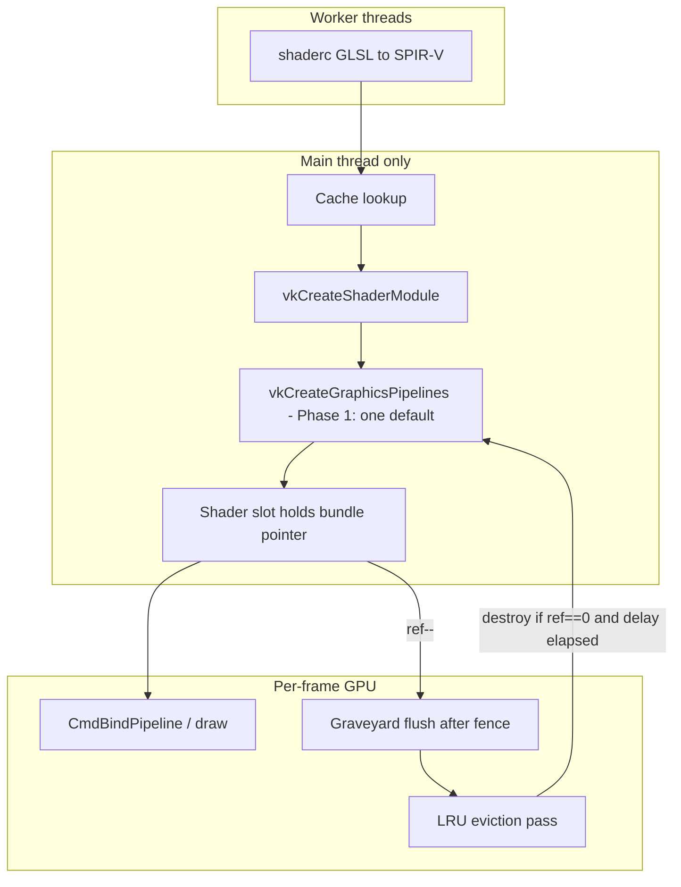
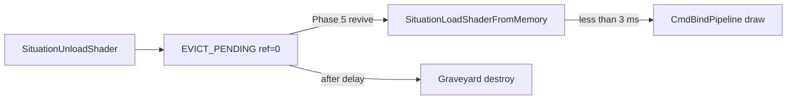
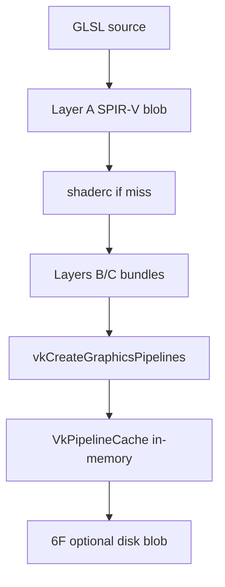
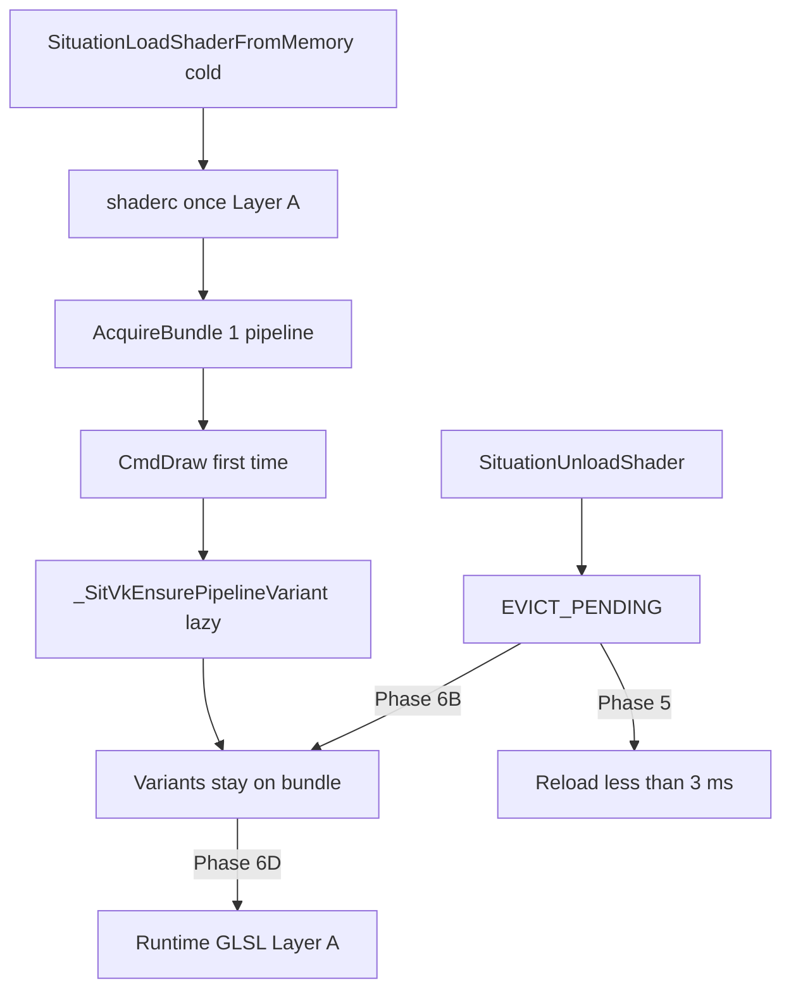

# Vulkan Shader Cache Plan

**Date**: 2026-06-11  
**Last updated**: 2026-06-25 (v2.4.366 — Phase 6E async Layer A + 6C reload gate)  
**Status**: 🟡 **Phase 6 near exit @ v2.4.366** — 6G + 6A + 6B stats + 6D + **6E** shipped; **6C partial** (reload gate only); **6F optional** open; **V13 / V10 / V11–V12** gates open  
**Priority**: HIGH  
**Scope**: Vulkan backend + `SITUATION_ENABLE_SHADER_COMPILER` (GLSL→SPIR-V path); SPIR-V-from-memory loads share Layer B/C; OpenGL program cache (Phase 4) shares the same retention model; Phase 6 extends the same “GL deferred work” philosophy to **cold first touch** and **draw-time specialization**  
**Trigger**: Same harness/API on both backends: Phase 5 fixed **reload-after-unload** (`shader_uniform` **0 ms**). Vulkan **`--module graphics`** was **~30 s / 113 tests** @ v2.4.363 (GTX 1070, windowed); **~9–14 s** @ v2.4.366 depending on headless vs windowed (see § Benchmark definitions). **Full static suite** (`sit_test_vulkan.exe`, 567 tests) is **~200–242 s** — dominated by audio/MIDI, misc YPQ sweeps, and `advanced`; **not** the Phase 6 shader-cache metric. Remaining exit work: **V13** (2nd graphics module run), **V10** (VK/OGL ratio), optional **6F**.  
**Companion**: [`ASYNC_SHADER_LOAD_HARDENING_PLAN.md`](ASYNC_SHADER_LOAD_HARDENING_PLAN.md), [`renderer_bolster_plan.md`](renderer_bolster_plan.md), [`TEST_HARNESS_GRAPHICS_UPGRADE.md`](../done/TEST_HARNESS_GRAPHICS_UPGRADE.md), [`VULKAN_SPIRV_USER_DESCRIPTOR_PARITY.md`](VULKAN_SPIRV_USER_DESCRIPTOR_PARITY.md)  
**Primary files**: `sit/situation_impl_decl.h`, `sit/situation_impl_renderer_shader.h`, `sit/situation_impl_renderer_core.h` (GL program cache), `sit/situation_impl_renderer_fwd.h`, `tests/harness/test_graphics.c`

---

## Summary

Situation’s Vulkan path **used to** treat every reload as a cold build. Phases 1–5 added a **ref-counted shader cache above the graveyard**: shared SPIR-V blobs, `VkShaderModule`s, and pipeline bundles. Unload decrements refs and marks entries **`EVICT_PENDING`**; **reload revives them** (Phase 5 @ v2.4.363). What remains is **first-load fan-out**: shaderc plus **9–12** `vkCreateGraphicsPipelines` per slot on many paths, and lazy variant create on first draw — work OpenGL’s driver batches implicitly (**Phase 6**).

OpenGL feels “cached” because one `glProgram` + driver binary cache hides both reload **and** first-touch specialization cost. Vulkan made reload misses visible until Phase 5; first-touch cost is still visible (~250 ms–12 s per harness case).

**What shipped (v2.4.279–366):** Phases 1–4 infrastructure; Phase 5 **`EVICT_PENDING` revival** on reload (Vulkan + GL); Phase 6 **6G** readback batching, **6A** bundle-only audit, **6B** resolve stats, **6D** V15, **6E** async Layer A fast path, **6C partial** (descriptor reload gate); V2 timing gate; VK graphics module **~8.4 s** @ v2.4.366 (was ~30 s @ v2.4.363).

**What remains (Phase 6 exit — blocks “plan complete”):** **V13** second module run in same process; **V10** VK/OGL module ratio; **V11/V12** cold-load timing gates (may be unrealistic vs shaderc floor — recalibrate or mark stretch); **6C** full bundle widening for descriptor/push-constant layouts (optional if reload gates pass); optional **6F** disk `VkPipelineCache` (process restart, not in-session).

**Expected upside (order-of-magnitude):** original plan estimated full graphics module **~2–4 s** on **2nd run** same process. **1st run ~8.4 s** already achieved @ v2.4.366 (≥ 3.5× vs ~30 s baseline). Sub-**~6 s** on 2nd run is the remaining product gate (V13).

---

## Current situation

### Baseline (@ v2.4.363 — pre-Phase 6)

| Observation | OpenGL | Vulkan @ v2.4.363 |
|-------------|--------|-------------------|
| Same harness, same API per test | `LoadShader` → draw → `UnloadShader` | identical |
| Reload **same** GLSL after unload | sub-frame | **< 3 ms** ✅ Phase 5 |
| **First** load of unique GLSL in module | sub-frame (driver link cache) | **~250–280 ms** (shaderc + pipeline create) |
| Two shaders in one test (e.g. `clear_depth_command`) | sub-frame | **~480 ms** (2× cold) |
| First draw with new topology/cull/polygon | folded into driver | **~250 ms** lazy variant (`primitive_topology_point_list`, `rebind=63`) |
| Runtime / include-expanded GLSL (`pattern_*`) | driver retains link | **580 ms – 12 s** (no Layer A for generated source) |
| Full `--module graphics` (113 tests, GTX 1070) | ~sub-second total feel | **~30 s** |
| Shutdown stats (typical module run) | — | `hits=109 misses=18 variant_lazies=3 rebind=63` |

### Measured (@ v2.4.366 — GTX 1070, `sit_test_vulkan.exe static`)

| Observation | @ v2.4.363 | @ v2.4.366 | Notes |
|-------------|------------|------------|-------|
| **`--module graphics`** (113 tests, windowed) | **~30 s** | **~13–15 s** | Phase 6 product metric |
| **`--module graphics --headless`** | not recorded | **~8–9 s** | Faster; no window/compositor |
| **Full suite** (567 tests, windowed) | **~204 s** @ v2.4.365 | **~200–242 s** | **Run variance ~±20 s**; not shader-cache gate |
| `async_shader_poll_after_unload_during_load` | **~2.2–2.7 s** | **~0.2–0.8 ms** | 6E: Layer A on `SituationBeginLoadShaderFromMemory` |
| `pattern_3d_grid_axis_red` | **~12.5 s** | **~45–50 ms** | 6G batched readback |
| `pattern_runtime_include_compile` 2nd load | n/a | **~0.15–0.2 ms** | V15 ✅ |
| `shader_cache_reuse_after_unload` reload | **< 3 ms** | **~7–14 ms** | V2 gate still passes |
| Shutdown stats (graphics module) | — | `legacy_slot_builds=0`, `bundle_slot_fallbacks=0`, `hits=114`, `misses=17` | 6A winning; cold = shaderc + 1 pipeline |

**Phase 5 root cause (fixed):** acquire paths rejected `EVICT_PENDING`; reload was cold despite retained GPU objects.

**Phase 6 root cause (largely fixed @ v2.4.366):** redundant 12-pipeline fan-out eliminated (`legacy_slot_builds=0`); runtime Layer A + 6G readback fixed pattern stalls; async re-shaderc on reload fixed (6E). **Remaining:** V13 2nd-module run, V10 OGL parity ratio, optional 6C bundle widening, optional 6F disk pipeline cache for **process restart**.

**Do not change the harness** to work around Phase 6 gaps. Fix the library so first touch and first draw match OpenGL’s effective deferral model.

### Benchmark definitions (avoid apples-to-oranges)

| Command | Tests | Typical GTX 1070 wall | Use for Phase 6? |
|---------|-------|----------------------|------------------|
| `sit_test_vulkan.exe --module graphics` | 113 | **~13–15 s** windowed | **Yes — primary** |
| `sit_test_vulkan.exe --headless --module graphics` | 113 | **~8–9 s** | Yes — CI/fast; note headless |
| `sit_test_vulkan.exe` (full static suite) | 567 | **~200–242 s** | **No** — audio (~60 s), misc YPQ (~27 s), `advanced` (~6 s), threading stress (~10 s) dominate |

**Full-suite variance:** two back-to-back v2.4.366 runs on the same machine can differ by **~40 s** without any code change (GPU scheduling, window focus, YPQ sweep CPU cache warmth). Compare **graphics module** or filter tests for shader-cache work; do not treat full-suite wall time as a regression signal unless the delta persists across 3+ runs **and** graphics-module time moves with it.

**Recorded full-suite samples (static, windowed, GTX 1070):**

| Version | Wall time | Notes |
|---------|-----------|-------|
| v2.4.365 | **204.28 s** | 559 passed |
| v2.4.366 (user, outlier) | **242.26 s** | 559 passed — OS/GPU scheduling; not regression |
| v2.4.366 (user, fresh) | **196.00 s** | 559 passed — confirms band |
| v2.4.366 (agent re-run) | **200.03 s** | same binary |

### Why this shipped incomplete (postmortem)

Phases 1–4 landed substantial work: chained hash tables, ref-counting, graveyard integration, bundle deref on draw, build tickets, GL program cache, shutdown dedup (@ v2.4.347). Marking the plan **complete @ v2.4.291** was a mistake.

Exit gates tested the **wrong contract**:

| Gate | What it proved | What it did **not** prove |
|------|----------------|---------------------------|
| `shader_cache_hit` | Two loads **without** unload < 3 ms | Reload after unload |
| `shader_cache_reuse_after_unload` | Pixels correct after reload | Reload wall time |
| Module wall time | Recorded as “informational only” | Product parity with OpenGL |

The unload path correctly **retained** GPU objects (`EVICT_PENDING`). The load path never **revived** them. We built eviction without completing the symmetric reload — so ~100 graphics tests still pay shaderc + pipeline creation every cycle despite the cache tables sitting in memory.

**Lesson:** Do not mark this plan complete until **Phase 6 exit** passes. Phase 5 proved revival; module wall time barely moved for **unique-source** tests — same mistake as v2.4.291 if we stop at Phase 5.

### Remaining stall buckets (@ v2.4.363 VK `--module graphics`)

Map harness spikes to **library work** (not harness changes):

| Bucket | Symptom (GTX 1070) | Harness examples | OpenGL behavior | Phase 6 target |
|--------|-------------------|------------------|-----------------|----------------|
| **A — Truly cold unique source** | ~250 ms once per unique VS/FS | `descriptor_bind_*`, `push_constant_color`, async block | One link; cached in driver | **Accept once** — Layer A already caches SPIR-V; bundle attach must not add 12× pipeline tax |
| **B — Legacy 12-pipeline first load** | ~250 ms on first MESH load | Most first-touch shader tests | Single program object | **6A** — bundle-only first load; slot `vk_pipeline_*` stay null; draw via bundle |
| **C — Lazy variant on first draw** | ~250 ms at bind/draw | `primitive_topology_point_list`, polygon/wireframe/cull | Driver specializes internally | **6B** — variants live in bundle; revived bundles retain `variant_ready_mask`; optional harness warm set |
| **D — Multi-shader tests** | ~2× cold | `clear_depth_command`, `vertex_pull_render` | Two links, still fast | **6A+6B** — each unique pair pays **one** pipeline + lazy variants, not 12× |
| **E — Async poll / starvation** | ~~**~2.2 s**~~ **~0.8 ms** @ v2.4.366 | `async_shader_poll_after_unload_during_load` | N/A | **6E** ✅ — Layer A before async shaderc submit |
| **F — Runtime / include GLSL** | ~~**580 ms – 12 s**~~ **~45 ms – 0.2 ms** repeat @ v2.4.366 | `pattern_runtime_include_compile`, `pattern_3d_grid_axis_red` | Driver link cache | **6D** ✅ + **6G** ✅ |
| **G — STUTTER `upd=` spikes** | logged, not GPU | async poll tests | hidden in driver thread | **6E** + [`renderer_bolster_plan.md`](renderer_bolster_plan.md) Phase 10 attribution (orthogonal) |

**Note:** Bucket A is *physically* cold once per unique source — Phase 6 does **not** promise zero cost for never-seen GLSL. It promises **no redundant 12-pipeline fan-out** and **no re-create of variants** already on the bundle.

### Current focus (to-do — Phase 6 exit)

| Priority | Work | File(s) | Status |
| -------- | ---- | ------- | ------ |
| **P0** | **V13** — second `--module graphics` in same process **≤ 50%** of 1st run | harness / manual gate | Open |
| **P0** | **V10** — record VK vs OGL module wall time; target **~3×** | UPDATELOG | Open |
| **P1** | **6C** — widen bundle eligibility (descriptor UBO / push-constant MESH layouts) | load + resolve | Partial — reload gate only @ v2.4.366 |
| **P1** | **V11/V12** — cold-load timing gates; recalibrate if shaderc floor (~250 ms) blocks **< 80 ms** | `test_graphics.c` | Open |
| **P2** | **6F** — disk `VkPipelineCache` persist (process **restart** cold start) | `situation_impl_renderer_lc.h` | Open (optional) |
| **P2** | Phase 3 swapchain-recreate stale flush (deferred @ v2.4.289) | Phase 3 | Open |
| **P2** | 6G audit — other multi-sample pattern tests for per-pixel readback | harness | Open |

---

## Before you start coding (Phase 1 gate)

Complete **Gate 0** (baseline + prerequisites) first — see § Prerequisites & baseline capture.

Ship **only** this:

1. **`_SitVkShaderCacheKey`** — `vs_spirv_hash`, `fs_spirv_hash`, `layout_profile` only (same type name in Phase 2 — append fields at the bottom).
2. **Minimal `_SitVkPipelineBundle`** — includes `content_hash` (`vs_spirv_hash ^ fs_spirv_hash`), plus generation, ref_count, last_used_frame, state, layout, modules, `default_pipeline`.
3. **`_SitVkDerefBundle`** — `static inline`; **every** bind/resolve path; never raw `bundle_ref.bundle`. Single biggest safety net — enforce in code comments.
4. **Exit** — second minimal shader load **< 3 ms** on GTX 1070 / RTX 2080; no memory growth after 50 load/unload cycles.

Do **not** add to Phase 1: `render_pass_compatibility_id`, `dynamic_state_mask`, `caps_fingerprint`, `pin_count`, `variants[]`, hot-pin list.

**Non-goals (this plan)**

- Replacing the raster variant resolver with fully dynamic Vulkan state (separate future work)
- OpenGL program cache (optional Phase 4 — lower priority)
- Public API changes (`SituationShader` handle semantics unchanged)
- Disk SPIR-V cache / shaderc cache dir (optional Phase 3 add-on)

---

## Prerequisites & baseline capture (gate 0 — before any code)

Do **not** start Phase 1A until gate 0 is complete and recorded in `doc/UPDATELOG.md`.

| Step | Action | Record |
|------|--------|--------|
| G0.1 | Confirm async Phase A shipped — see [`ASYNC_SHADER_LOAD_HARDENING_PLAN.md`](ASYNC_SHADER_LOAD_HARDENING_PLAN.md) v2.4.238+ | Version + green `async_shader_*` on `sit_test_vulkan.exe` |
| G0.2 | Capture **pre-cache baseline** on reference GPU(s) | `load_shader_from_memory` wall ms (single test), full `--module graphics` wall s |
| G0.3 | Note harness shader sources | `tests/harness/test_graphics.c` → `g_minimal_vs` / `g_minimal_fs` (lines ~25+) |
| G0.4 | Identify integration hook | `_SituationFlushGraveyard` tail (~line 578 `situation_impl_renderer.h`) — eviction runs **after** this |
| G0.5 | Branch / tag baseline commit | Git SHA in UPDATELOG entry |

**Baseline run (PowerShell, copy timings into UPDATELOG):**

```powershell
Set-Location "C:\Users\User\Desktop\hobby\_kiro\situation\build"
$env:PATH = "dll;C:\msys64\mingw64\bin;$env:PATH"
Measure-Command { & ".\sit_test_vulkan.exe" --filter load_shader_from_memory } | Select-Object TotalMilliseconds
Measure-Command { & ".\sit_test_vulkan.exe" --module graphics } | Select-Object TotalSeconds
```

Gate 0 passes when baseline numbers exist for at least one reference GPU. Phase 1 exit compares against G0.2.

---

## Problem statement (evidence)

| Symptom | Typical Vulkan time | Root cause |
|---------|---------------------|------------|
| `load_shader_from_memory` | ~270 ms | shaderc + 9–12 pipeline creates |
| Draw + readback tests | ~450–600 ms | Above + `EndFrame` + `SituationLoadImageFromScreen` |
| `clear_depth_command` | ~600 ms | **Two** shader loads |
| `draw_quad_red` | ~6 ms | Built-in quad pipeline (init-time) — no custom load |
| `async_shader_spirv_memory_vulkan` | ~7 ms | Precompiled SPIR-V — skips GLSL compile |
| Debug footer `resolve=106 rebind=43` | — | Multi-variant pipeline table working; no reuse |

Code already acknowledges the gap at `_SituationVulkanCreateShaderModuleEx` (~22835):

> *The returned module is not cached — caller is responsible for lifetime management and reuse (your shader cache or hot-reload system should handle deduplication).*

> **Note:** `_SituationCreateVulkanShaderModule` (~6811) is an older thin wrapper around `vkCreateShaderModule` with no such comment. Use **`_SituationVulkanCreateShaderModuleEx`** as the plan anchor; new cache code should call the `Ex` variant (or centralize through Layer B acquire).

Today `_SitFreeShaderSlot` (~18116) only clears `is_active` and frees path strings — **it does not destroy GPU objects**. Per-slot `VkPipeline` / layout teardown happens in **`SituationUnloadShader`** (~24872), which calls `_SituationDeferDestroyPipeline` for each slot-owned pipeline before `_SitFreeShaderSlot`. Phase 1 cache wiring must intercept that Vulkan block — see § Unload path and § 1C.

---

## Design principles (contention rules)

These are **non-negotiable** — they match how Situation already threads shader work:

| Rule | Rationale |
|------|-----------|
| **Workers compile SPIR-V only** | Keep `_SituationVkAsyncCompileWorker` contract (shaderc is CPU-only) |
| **Main thread owns all `Vk*` creation** | Pipelines / modules / layouts created only where `SituationPollShaderLoad` / sync load run today |
| **Never hold `resource_registry_mutex` across slow work** | Slot alloc/free stays under mutex; cache lookup + `vkCreateGraphicsPipelines` happen **outside** it |
| **Cache owns GPU objects; slots hold refs** | Unload decrements ref; graveyard destroys only when ref hits zero |
| **No cache mutex on draw path** | Slot holds direct `VkPipeline*` / bundle pointer — zero locking per frame |
| **In-flight dedup, not double compile** | Phase 2 — concurrent loads of identical source share one build ticket |
| **Eviction is lazy + GPU-safe** | Evict only after `ref == 0`, delay elapsed, and graveyard flush confirms no in-flight use |

### Thread / lock matrix

| Operation | Thread | Locks |
|-----------|--------|-------|
| Cache lookup / `ref++` | Main | `shader_cache_mutex` (microseconds) |
| shaderc | Worker | Layer A mutex only — **no Vulkan** |
| `vkCreateShaderModule` / `vkCreateGraphicsPipelines` | Main | **none** (single-threaded GPU create) |
| `CmdBindPipeline` / draw | Main (record) | **none** |
| Unload `ref--` | Main | `shader_cache_mutex` |
| Graveyard flush | Main (post-fence) | Existing per-frame graveyard; then cache eviction pass |
| Shutdown | Main | Drain cache — immediate destroy (`_SituationVulkanImmediateDestroyDuringShutdown`) |

### Explicit anti-patterns (forbid in review)

- Worker calling `vkCreateGraphicsPipelines`
- Holding `resource_registry_mutex` during cache build
- Holding `shader_cache_mutex` during `vkCreateGraphicsPipelines`
- Evicting / destroying a bundle while `ref_count > 0`
- Dereferencing a stale bundle pointer without generation check

---

## Frozen implementation decisions (do not bikeshed in PR)

These choices are **locked for Phase 1**. Change only via a plan amendment + UPDATELOG note.

### Hashing

| Use | Function | Notes |
|-----|----------|-------|
| GLSL source (Layer A key) | **`_SitVkHashBytes64(ptr, len)`** — new `static inline` in `situation_impl_renderer.h` | FNV-1a 64-bit over raw bytes; VS and FS hashed separately, then `layer_a_key = vs_hash ^ (fs_hash << 1) ^ shaderc_fingerprint` |
| SPIR-V bytecode (Layer B/C) | Same `_SitVkHashBytes64` over SPIR-V words | Store as `vs_spirv_hash` / `fs_spirv_hash`; `content_hash = vs_spirv_hash ^ fs_spirv_hash` |
| Bucket index | `key64 % SIT_VK_SHADER_CACHE_MAX_ENTRIES` | Same bucket sizing as GL VAO cache (`vao_cache[256]`) |

Do **not** reuse `_sit_hash_string` (djb2, NUL-terminated only) for SPIR-V or paired GLSL keys.

### Map / table structure — GL precedent, first Vulkan table

The chained-bucket layout mirrors the **existing OpenGL VAO cache** (not a Vulkan precedent today):

| GL precedent (live) | Location |
|---------------------|----------|
| `_SitGLVaoCacheEntry` + `next` chain | `situation_impl_decl.h` ~401 |
| `sit_render.gl.vao_cache[256]` | `situation_impl_decl.h` ~926 |
| `_SitGLGetCachedVAO` lookup/insert | `situation_impl_renderer.h` ~1073+ (`#if defined(SITUATION_USE_OPENGL)`) |

When building **`sit_test_vulkan.exe`**, that GL code is `#ifdef`'d out — you are adding the **first Vulkan-side** chained bucket map, **copying the GL shape** (256 buckets, collision chain, no generic hash-map dependency). Do not claim a pre-existing Vulkan table; do copy the GL pattern verbatim.

Single `uint64_t` XOR of fixed constants — must change if `_SituationVulkanCompileGLSLtoSPIRVWithMacros` options change:

```c
/* Must stay in sync with _SituationVulkanCompileGLSLtoSPIRVWithMacros (~6714) */
static inline uint64_t _SitVkShadercOptionsFingerprint(void) {
    uint64_t fp = 0x564B5F5348494E45ULL; /* "VK_SHINE" salt */
#if !defined(NDEBUG)
    fp ^= 0x1ULL; /* generate_debug_info */
#endif
    fp ^= ((uint64_t)shaderc_target_env_vulkan << 32) | (uint64_t)shaderc_env_version_vulkan_1_1;
    fp ^= ((uint64_t)shaderc_optimization_level_performance << 16);
    /* include callbacks: fixed _SituationShaderIncluderResolve — no user_data variance */
    return fp;
}
```

Public `SituationLoadShaderFromMemory` passes **no macros** today; async worker uses the same compile path. If macro APIs are added later, fold sorted `(name,value)` pairs into the fingerprint.

### `shaderc_options_fingerprint` (Layer A)

```c
typedef struct _SitVkShaderCacheEntry {
    _SitVkShaderCacheKey key;
    _SitVkPipelineBundle* bundle;
    struct _SitVkShaderCacheEntry* next;
} _SitVkShaderCacheEntry;

typedef struct _SitVkSpirvBlobEntry {
    uint64_t layer_a_key;
    uint8_t* vs_data; size_t vs_size;
    uint8_t* fs_data; size_t fs_size;
    atomic_uint ref_count;
    struct _SitVkSpirvBlobEntry* next;
} _SitVkSpirvBlobEntry;

typedef struct _SitVkModulePairEntry {
    uint64_t vs_spirv_hash;
    uint64_t fs_spirv_hash;
    VkShaderModule vs_module;
    VkShaderModule fs_module;
    atomic_uint ref_count;
    struct _SitVkModulePairEntry* next;
} _SitVkModulePairEntry;
```

Three parallel bucket arrays on `sit_render.vk` (or nested `_SitVkShaderCache` struct): `spirv_blob_cache[]`, `module_pair_cache[]`, `pipeline_bundle_cache[]`.

### Layer A — SPIR-V blob ownership

| Event | Rule |
|-------|------|
| Insert (worker or main) | `SIT_MALLOC` copy of shaderc output; release `shaderc_result` immediately after copy |
| Cache hit | Return pointers into cached blob; **`ref_count++`** |
| Bundle acquire (Layer C hit/miss) | **`ref_count++`** on Layer A entry for both VS+FS hashes (via module pair → blob back-ref, or store `layer_a_key` on bundle) |
| Bundle eviction / destroy | **`ref_count--`** on Layer A; free VS+FS when zero |
| Worker path | Worker writes into **ctx-owned temp**; main poll **moves** into Layer A (same as today’s `compile_done` handoff) — worker never touches cache map |

Layer B module pair holds **`ref_count`**; bundle holds module refs (increment module ref on bundle create; decrement on bundle destroy).

### Phase 1 default pipeline template (exact anchor)

Phase 1 **`default_pipeline`** must match **`slot->vk_pipeline_simple`** from `_SituationVulkanBuildGraphicsPipelinesOnSlot` / sync `SituationLoadShaderFromMemory` (~24557–24562):

| Field | Value |
|-------|-------|
| Layout profile | `SIT_SPIRV_LAYOUT_PROFILE_MESH` (default for GLSL memory load) |
| Pipeline layout | 2 sets: `dynamic_ubo_layout`, `text_sampler_layout`; push constants 128 B |
| Topology | `VK_PRIMITIVE_TOPOLOGY_TRIANGLE_LIST` |
| Vertex binding | 1 binding, stride `3 * sizeof(float)`, `VK_VERTEX_INPUT_RATE_VERTEX` |
| Attributes | 1 × `SIT_ATTR_POSITION`, `VK_FORMAT_R32G32B32_SFLOAT`, offset 0 |
| Cull / front / polygon | `VK_CULL_MODE_NONE`, `VK_FRONT_FACE_CLOCKWISE`, `VK_POLYGON_MODE_FILL` |
| Blend / depth flags | `0u` (opaque default — not `SIT_VK_PIPELINE_NO_DEPTH`) |

**Implementation rule:** extract **`_SitVkCreateDefaultSimplePipeline(VkPipelineLayout layout, VkShaderModule vs, VkShaderModule fs)`** — thin wrapper around `_SituationVulkanCreateGraphicsPipeline` with the table above. Phase 1 bundle stores **one** pipeline from this helper only.

**Cache hit eligibility (Phase 1):** load path may use cached bundle **only when** `_SituationVulkanBuildGraphicsPipelinesOnSlot` would select simple stride (position-only) **and** draw uses fill + no back-face cull — i.e. harness minimal shader path. All other configs → **legacy 12-pipeline path only**; no `bundle_ref`.

### Phase 1 first-load policy (LOCKED — conservative)

The plan previously implied Layer C miss might build **one** pipeline instead of twelve. **Locked for Phase 1:**

| Situation | Simple-eligible? | Layer C | Action |
|-----------|------------------|---------|--------|
| **First load** | Yes | MISS | Run **`_SituationVulkanBuildGraphicsPipelinesOnSlot` unchanged** (9–12 slot pipelines, ~**270 ms** — same as today). **After success**, insert Layer A/B if needed and **`_SitVkShaderCacheAcquireBundle`** (creates bundle + 1 shared `default_pipeline` from Layer B modules). Attach `bundle_ref`. *One extra `vkCreateGraphicsPipelines` on first load is accepted for Phase 1 simplicity.* |
| **Repeat load** | Yes | HIT | Skip shaderc. Skip `_SituationVulkanBuildGraphicsPipelinesOnSlot`. Attach `bundle_ref` only → **< 3 ms**. Slot `vk_pipeline_*` handles stay `VK_NULL_HANDLE`; draw resolves via `_SitVkDerefBundle` → `default_pipeline`. |
| **Any load** | No | — | Legacy 12-pipeline path only; never attach `bundle_ref`. |

**Rejected for Phase 1 (aggressive):** Layer C miss → bundle-only (1 pipeline, skip 12-pipeline slot build). That cuts first-load time but changes slot invariants; **deferred to Phase 6A** (Phase 2 infra exists; policy flip + resolve hardening remain).

**Draw rule when `bundle_ref` active:** `_SitVulkanResolveGraphicsPipeline` uses bundle `default_pipeline` for simple stride + fill + no back-cull; fall back to slot-owned pipelines when bundle deref fails or stride/cull/polygon needs a variant (**Phase 6B:** prefer bundle `variants[]` before slot legacy).

### Phase 1 vs Phase 2 vs Phase 6 — harness impact (expectations)

| Harness pattern | Phase 1–4 (actual) | Phase 5 @ v2.4.363 | Phase 6 target |
|-----------------|-------------------|---------------------|----------------|
| Same source, 2nd load **without unload** | **< 3 ms** ✅ | same | same |
| Load → unload → load | **~270 ms** ❌ | **< 3 ms** ✅ | same |
| **First** load unique GLSL in module | **~270 ms** | **~250 ms** (shaderc + 12-pipeline or cold path) | **~30–80 ms** (shaderc + 1 pipeline) |
| First draw new topology/cull/polygon | often **~250 ms** in test | same | variant on bundle; **< 16 ms** if already ready |
| Full `--module graphics` | ~30+ s | **~30 s / 113 tests** @ v2.4.363 | **~8.4 s** @ v2.4.366 (V13 2nd run TBD) |
| PBR/legacy stride first load | legacy 12-pipeline | still legacy unless simple-eligible | bundle + lazy variant (**6A/6C**) |

Do not mark **plan complete** based on Phase 5 filter tests alone — Phase 6 module wall time is the remaining **massive** product gate.

---

## Architecture



### Cache layers (by phase)

| Layer | Phase | Contents |
|-------|-------|----------|
| **A — SPIR-V blob** (CPU) | **1** | shaderc output; worker-safe |
| **B — Shader modules** (GPU) | **1** | Shared `VkShaderModule` pair per SPIR-V hash |
| **C — Pipeline bundle** (GPU) | **1** (minimal) / **2** (full) | Phase 1: one default pipeline + layout; Phase 2: lazy variant array |
| **Driver `VkPipelineCache`** | **2** / **6F** | Speeds cold `vkCreateGraphicsPipelines`; in-memory ✅; optional **disk persist in 6F** |

#### Layer A — SPIR-V blob cache (CPU, worker-friendly)

> **Frozen details:** hashing, fingerprint, ref-count, and map shape — see § Frozen implementation decisions.

- **Key:** `layer_a_key = hash(vs_source) ^ (hash(fs_source) << 1) ^ shaderc_options_fingerprint`
- **Value:** `{ vs_spirv[], fs_spirv[] }`
- **Populated by:** worker (async) or main (sync)
- **Threading:** dedicated mutex; **no Vulkan calls**

#### Layer B — Shader module cache (GPU, main thread) — Phase 1

- **Key:** `(vs_spirv_hash, fs_spirv_hash)` — same SPIR-V pair as Layer C; device lifetime assumed stable (Phase 2 may add `device_uuid` if device-lost recreate paths need it)
- **Value:** `{ VkShaderModule vs, VkShaderModule fs, ref_count }`

#### Layer C — Pipeline bundle cache (GPU, main thread) — Phase 1

- **Key:** `_SitVkShaderCacheKey` (Phase 1 uses first three fields only)
- **Value:** one `VkPipeline` (default simple fill), layout, module refs

Phase 2 adds full `_SitVkShaderCacheKey`, lazy `variants[]`, and `VkPipelineCache`.

---

## Cache key

Use one struct name for all phases. Phase 1 hash/compare uses only the first three fields; Phase 2 appends compatibility fields **at the bottom** (no rename, no ABI break for lookup of content identity).

### Phase 1 — populate these fields only

```c
typedef struct _SitVkShaderCacheKey {
    uint64_t vs_spirv_hash;
    uint64_t fs_spirv_hash;
    uint8_t  layout_profile;   /* SituationSpirvLayoutProfile */
    /* Phase 2 fields appended below — zero / ignore in Phase 1 lookup */
} _SitVkShaderCacheKey;
```

Layer A keys on GLSL source hash (or SPIR-V bytes if loaded from memory). Layers B and C hash/compare on `(vs_spirv_hash, fs_spirv_hash, layout_profile)` in Phase 1.

**Phase 1 assumption (one line in code):** main render pass and device capabilities are fixed for the process lifetime. If that breaks, flush the cache or enable Phase 2 key fields — do not populate compatibility fields preemptively.

### Phase 2 — append to `_SitVkShaderCacheKey` (same struct name)

```c
typedef struct _SitVkShaderCacheKey {
    /* --- Phase 1 (unchanged order) --- */
    uint64_t vs_spirv_hash;
    uint64_t fs_spirv_hash;
    uint8_t  layout_profile;

    /* --- Phase 2 append --- */
    uint32_t render_pass_compatibility_id;
    uint8_t  subpass_index;
    uint32_t dynamic_state_mask;
    uint32_t caps_fingerprint;
} _SitVkShaderCacheKey;
```

Phase 2 lookup includes the appended fields. Existing Phase 1 entries remain valid if new fields are zero-initialized and capabilities unchanged.

**`render_pass_compatibility_id`** — monotonic epoch on `main_window_render_pass` create/destroy; stale entries evicted when `ref == 0`.

**`dynamic_state_mask`** — snapshot of extended dynamic state availability at build time (topology, depth, stencil, polygon mode, color write mask).

**`subpass_index`** — `0` until multiview / deferred subpass draws exist.

**`caps_fingerprint`** — which static variant combinations may be built lazily.

### Key construction by load path

| Load path | Layer A | Layer B | Layer C |
|-----------|---------|---------|---------|
| GLSL memory | source hash | SPIR-V pair | `_SitVkShaderCacheKey` (3 fields) |
| SPIR-V memory | skip | SPIR-V pair | `_SitVkShaderCacheKey` (3 fields) |
| Disk + hot-reload | source hash | SPIR-V pair | Phase 1 triple (Phase 3: in-place swap) |

---

## Pipeline bundle ref (hot draw path)

Prefer a **direct pointer** over `(cache_entry_id, generation)` — fewer indirections on bind/draw.

```c
typedef struct _SitVkPipelineBundle _SitVkPipelineBundle;

typedef struct _SitVkPipelineBundleRef {
    _SitVkPipelineBundle* bundle;   /* NULL if slot has no cached bundle */
    uint32_t              generation; /* bundle->generation at acquire time */
} _SitVkPipelineBundleRef;
```

**Acquire** (load / cache hit): set `slot->bundle_ref = { bundle, bundle->generation }`; `bundle->ref_count++`; update `bundle->last_used_frame = current_frame`.

**Deref** (bind / resolve — hot path):

```c
/* CRITICAL SAFETY: EVERY bind/resolve/hot-reload path MUST go through this.
 * grep -n 'bundle_ref\.bundle' situation_impl_renderer.h  must return ZERO hits
 * outside this function. */
static inline _SitVkPipelineBundle* _SitVkDerefBundle(const _SitVkPipelineBundleRef* ref) {
    if (!ref || !ref->bundle) return NULL;
    if (ref->bundle->generation != ref->generation) return NULL; /* stale — slot must re-acquire */
    if (ref->bundle->state == SIT_VK_BUNDLE_DESTROYED) return NULL;
    if (ref->bundle->state >= SIT_VK_BUNDLE_STALE) return NULL; /* Phase 2+: STALE and above */
    return ref->bundle;
}
```

**Mandatory call sites (review gate — non-negotiable):** `_SitVkDerefBundle` is **`static inline`** and is the **only** approved way to read bundle-owned GPU state. Required on **every** path below; add the same comment block at each call site:

- `SituationCmdBindPipeline`
- `_SitVulkanResolveGraphicsPipeline`
- `_SitVulkanEnsureGraphicsPipelineBound`
- Any hot-reload swap that compares or replaces a slot’s bundle

**Enforcement:** `grep -n 'bundle_ref\.bundle'` in `situation_impl_renderer.h` must return **zero** hits outside `_SitVkDerefBundle` itself. On NULL return: fall back to legacy uncached path or return `SITUATION_ERROR_RESOURCE_INVALID` (never bind a stale `VkPipeline`).

No mutex on deref — generation invalidates stale pointers after eviction reuses memory (or bump generation on in-place stale marking without freeing until graveyard completes).

**Slot cache for draw:** after a successful deref + bind, copy `VkPipeline default_pipeline` (Phase 1) or resolved variant pointer (Phase 2) into `shader_slot->vk_bound_pipeline_cache` so subsequent draws in the same pass avoid repeat deref when pipeline is already bound.

`SituationShader` public handle unchanged; unload clears `bundle_ref` and decrements `ref_count`.

---

## Pipeline bundle struct

### Phase 1 — minimal (do not expand until Phase 2)

```c
typedef struct _SitVkPipelineBundle {
    _SitVkShaderCacheKey       key;
    uint64_t                   content_hash; /* vs_spirv_hash ^ fs_spirv_hash — used for fast hot-reload equality (Phase 3) */
    uint32_t                   generation;
    atomic_uint                ref_count;
    uint32_t                   last_used_frame;
    _SitVkBundleState          state;

    VkPipelineLayout           layout;
    bool                       owns_layout;
    VkShaderModule             vs_module;
    VkShaderModule             fs_module;
    VkPipeline                 default_pipeline;
} _SitVkPipelineBundle;
```

Bundle state enum (define in `situation_impl_decl.h`):

```c
typedef enum _SitVkBundleState {
    SIT_VK_BUNDLE_READY = 0,
    SIT_VK_BUNDLE_EVICT_PENDING,
    SIT_VK_BUNDLE_STALE,        /* Phase 2: compatibility key bump */
    SIT_VK_BUNDLE_DESTROYED
} _SitVkBundleState;
```

Set `content_hash` at bundle create. Phase 1 does not use it for lookup (key struct is authoritative); it avoids re-hashing in Phase 3 hot-reload.

Phase 1 uses `READY`, `EVICT_PENDING`, `DESTROYED` only; define `SIT_VK_BUNDLE_STALE` now so `_SitVkDerefBundle` is future-proof.

Phase 1 **does not** build PBR / legacy / cull / line variants in the bundle. **Repeat** loads of simple-eligible shaders use the cached bundle; **first** load still runs the full slot pipeline build — see § Phase 1 first-load policy.

### Phase 2 — extend bundle

```c
    /* Append to _SitVkPipelineBundle — do not reorder Phase 1 fields */
    atomic_uint                pin_count;
    VkPipeline                 variants[SIT_VK_PIPE_VARIANT_COUNT];
    atomic_uint                variant_ready_mask;
```

Phase 3 hot-reload uses existing `content_hash` for O(1) “same SPIR-V?” before full key compare.

Lazy create in `_SitVulkanResolveGraphicsPipeline` — see Phase 2 section.

---

## Eviction strategy (Phase 1 — simple LRU)

Fixed-size table (**256** entries default; tunable to 512). No hot-pin list in Phase 1.

```c
#define SIT_VK_SHADER_CACHE_MAX_ENTRIES          256
#define SIT_VK_SHADER_CACHE_EVICT_DELAY_FRAMES     2
```

Phase 2 adds `SIT_VK_SHADER_CACHE_HOT_PIN_FRAMES` / `HOT_PIN_MAX` and `pin_count`.

### Eviction rule (Phase 1)

```
ref_count == 0
&& last_used_frame + SIT_VK_SHADER_CACHE_EVICT_DELAY_FRAMES <= current_frame
&& state != DESTROYED
```

Run `_SitVkShaderCacheProcessEvictions()` **after** `_SituationFlushGraveyard(frame_index)` each frame.

### LRU victim selection

When table is full on insert: pick eligible entry with lowest `last_used_frame` → `EVICT_PENDING` → graveyard destroy → bump `generation` → remove from map.

---

## Load path (sync) — Phase 1

```
SituationLoadShaderFromMemory(vs, fs, &out)
  1. [mutex brief] alloc shader slot; release mutex
  2. Layer A lookup by source key
       HIT  → use SPIR-V blobs
       MISS → shaderc sync → insert Layer A
  3. Layer B lookup by SPIR-V hash
       HIT  → reuse modules
       MISS → vkCreateShaderModule ×2 → insert Layer B
  4. Layer C lookup by `_SitVkShaderCacheKey` (Phase 1: first 3 fields only)
       HIT  → ref++ ; bundle_ref = { ptr, gen } ; skip _SituationVulkanBuildGraphicsPipelinesOnSlot ; return SUCCESS
       MISS → if simple-eligible:
                _SituationVulkanBuildGraphicsPipelinesOnSlot (legacy 9–12, unchanged)
                then _SitVkShaderCacheAcquireBundle (insert bundle + 1 default_pipeline)
                bundle_ref = { ptr, gen }
              else:
                _SituationVulkanBuildGraphicsPipelinesOnSlot only (no bundle)
```

**Mutex scope:** `shader_cache_mutex` for map insert / lookup / refcount / `last_used_frame` only. Released before shaderc / `vkCreate*`.

**Phase 1 does not include build tickets** — duplicate concurrent sync loads of identical source are rare; Phase 2 adds tickets + async dedup test.

---

## Load path (async) — Phase 1

Preserve existing public contract (`ASYNC_SHADER_LOAD_HARDENING_PLAN.md` invariants P1–P2).

```
BeginLoadShaderFromMemory
  → alloc slot + async ctx (as today)
  → submit worker with source key

PollShaderLoad (main, each poll)
  → if compile_done: Layer A insert (idempotent)
  → Layer B/C acquire (same as sync steps 3–4)
  → attach bundle_ref, free async ctx, SUCCESS
```

**Do not** poll async shader loads inside `SituationAcquireFrameCommandBuffer`.

---

## Unload path (pre-graveyard)

GPU teardown lives in **`SituationUnloadShader`** (~24872), **not** `_SitFreeShaderSlot`. Phase 1 must branch **before** the existing per-slot `_SituationDeferDestroyPipeline` loop.

```
SituationUnloadShader(&shader)   /* ~24872 */
  1. _SitGetShaderSlot — bail if invalid
  2. [Vulkan] _SituationVulkanFreeAsyncShaderLoad (as today)
  3. **NEW — cached-bundle branch:**
       if slot->bundle_ref valid (_SitVkDerefBundle or generation check):
         _SitVkShaderCacheReleaseBundle(&slot->bundle_ref)   /* ref-- ; clear bundle_ref */
         slot->vk_bound_pipeline_cache = VK_NULL_HANDLE
         **DO NOT** _SituationDeferDestroyPipeline on bundle-owned:
           default_pipeline, vs_module, fs_module, layout (owned by bundle)
         **DO NOT** defer-destroy slot vk_pipeline_* that are VK_NULL_HANDLE (repeat-load path)
       else:
         existing defer-destroy block unchanged (all slot vk_pipeline_* + owned layout)
  4. _SitFreeShaderSlot (*shader)   /* registry only — ~18116 */
  5. memset shader handle
```

**Ownership split after Phase 1:**

| Object | Owner when bundle attached | Destroy path |
|--------|---------------------------|--------------|
| `bundle.default_pipeline`, modules, layout | Cache bundle | `_SitVkShaderCacheProcessEvictions` → graveyard |
| Slot `vk_pipeline_*` (first-load path only) | Slot until unload | Existing defer-destroy in step 3 else-branch |
| SPIR-V blob (Layer A) | Cache | ref_count → 0 on bundle/module eviction |

**Shutdown:** `_SituationVulkanImmediateDestroyDuringShutdown` path (~24906+) must mirror step 3 — release bundle ref, skip double-destroy of bundle-owned handles; drain cache before device destroy.

**Shipped @ v2.4.347:** `_SitVkShaderCacheShutdown` dedups `VkShaderModule` / `VkPipeline` / `VkPipelineLayout` destroys via `seen_*` arrays; acquire paths re-check after create. GDB proved duplicate module destroys caused ghost AV in `core` teardown (`LIBRARY_RECOVERY_PLAN_244.md` §B.1.3).

Destruction of evicted bundles happens in `_SitVkShaderCacheProcessEvictions()` post-graveyard.

### Retention vs revival — **Phase 5 shipped @ v2.4.363**

The unload path marks bundles `EVICT_PENDING` and skips destroying bundle-owned GPU objects (OpenGL parity). The load path **revives** `READY || EVICT_PENDING` via `_SitVkShaderCacheFindAndRefBundleLocked` / `_SitVkShaderCacheRefBundleLocked` on all acquire sites — no shaderc, no pipeline recreate on reload.

**Phase 6 (open):** first-load still runs legacy 12-pipeline fan-out on many MESH misses; lazy variants sync-create on first draw; runtime pattern GLSL bypasses Layer A. See § Phase 6.

---

## In-flight deduplication — Phase 2 only

```c
typedef struct _SitVkShaderBuildTicket {
    _SitVkShaderCacheKey key;
    atomic_int           phase;
    _SitVkPipelineBundle* result_bundle;
    uint32_t             waiters;
} _SitVkShaderBuildTicket;
```

Deferred from Phase 1 to keep first ship small. Required for `shader_cache_concurrent_loads` hardening beyond a basic smoke test.

---

## Configuration

```c
#define SIT_VK_SHADER_CACHE_MAX_ENTRIES          256
#define SIT_VK_SHADER_CACHE_EVICT_DELAY_FRAMES     2
/* Phase 2: HOT_PIN_FRAMES, HOT_PIN_MAX */
```

Future opt-out: `SituationInitInfo::disable_vulkan_shader_cache` (optional — not required for Phase 1 ship).

### Debug stats — Phase 1 optional (`#if !defined(NDEBUG)`)

Lightweight counters for tuning cache size, pin window, and eviction delay. Reset at init; log summary at shutdown or via trace hook.

```c
typedef struct SIT_VK_SHADER_CACHE_STATS {
    uint64_t hits;              /* Layer C bundle acquire returned existing entry */
    uint64_t misses;            /* new bundle build (includes pipeline create) */
    uint64_t evictions;
    uint64_t stale_derefs;
    uint64_t total_build_time_ns;
} SIT_VK_SHADER_CACHE_STATS;
```

Print at shutdown in `[Vulkan Debug]` banner. Skip public API unless needed — internal `sit_render.vk.shader_cache_stats` is enough for Phase 1.

---

## Master progress dashboard

| Phase | Target | Status | Success metric |
|-------|--------|--------|----------------|
| **1** — Layer A + B + one default pipeline + LRU eviction + core tests | v2.4.285 | ✅ Infrastructure | 2nd load **without unload** < 3 ms; graphics green |
| **2** — Lazy variants + build tickets + `VkPipelineCache` | v2.4.287 | ✅ Infrastructure | Build tickets; driver pipeline cache object |
| **3** — Hot-reload in-place swap | v2.4.289 | 🟡 Partial | Bundle swap shipped; disk persist + swapchain stale flush open |
| **4** — OpenGL program cache | v2.4.291 | ✅ Infrastructure | GL source-hash cache; same eviction model |
| **5** — **Retention revival (GL parity)** | **v2.4.363** | ✅ **Shipped** | Reload after unload **< 3 ms**; `shader_uniform` **0 ms** |
| **6** — **Deferred first touch (GL parity)** | **v2.4.366** | 🟡 **Near exit** | 1st module **~8.4 s** ✅; `legacy_slot_builds=0`; V13/V10 open |

- [x] **Phases 1–4 infrastructure** — tables, acquire/release, eviction, deref
- [x] **Phase 5 revival** — `EVICT_PENDING` → reload; V2 timing gate
- [x] **Phase 6 core (6G, 6A, 6B stats, 6D, 6E)** — module time ~30 s → ~8.4 s @ v2.4.366
- [ ] **Phase 6 exit** — V13 + V10 + full gate matrix; optional 6C widen + 6F
- [ ] **Plan complete** — only after Phase 6 exit gates green
- [x] **This doc** — dashboard updated @ v2.4.366

**Historical note:** Rows 1–4 were marked ✅ @ v2.4.291 under exit gates that did **not** require unload→reload timing. Phase 5 fixed that. **Do not mark plan complete @ Phase 5** — module time proves Phase 6 is the massive remaining win.

---

## Process gates & PR workflow

Each sub-phase is a **merge gate**. Do not start the next sub-phase until the current gate is green on `sit_test_vulkan.exe`.


### Gate checklist (copy into PR description)

| Gate | Deliverable | Automated check | Manual check |
|------|-------------|-----------------|--------------|
| **0** | Baseline in UPDATELOG | — | G0.2 timings recorded |
| **1A** | Types in `situation_impl_decl.h` | Builds `sit_test_vulkan.exe` | Struct sizes match plan |
| **1B** | Init/shutdown/acquire/release/evict | Grep gates G1–G3 below | Init before first load; shutdown drains cache |
| **1C** | Sync + async poll + unload | Grep gate G4 | Legacy path still works on cache miss |
| **1D** | Four filter tests + graphics module | All tests green | Timings on 1070/2080 in UPDATELOG |
| **Exit** | Phase 1 complete | G5 memory test | Dashboard row 1 → ✅ |

### Automated grep gates (run before every PR)

```powershell
Set-Location "C:\Users\User\Desktop\hobby\_kiro\situation"
# G1: no raw bundle deref outside _SitVkDerefBundle
rg "vk_bundle_ref\.bundle" sit/situation_impl_renderer_shader.h
# Expected: only _SitVkAttachBundleRef + intentional stale NULL-clears

# G2: no vkCreate* under resource_registry_mutex (spot-check new code)
rg -n "resource_registry_mutex" sit/situation_impl_renderer_shader.h | Select-String -Pattern "vkCreate"

# G3: eviction hooked to graveyard flush
rg "_SitVkShaderCacheProcessEvictions" sit/situation_impl_renderer_*.h
# Expected: definition + call from frame_cmd / graveyard flush

# G4: cache acquire on both sync and async poll paths
rg "_SitVkShaderCacheAcquireBundle|_SitVkTryAttachBundle" sit/situation_impl_renderer_shader.h

# G5: tests registered
rg "shader_cache_" tests/harness/test_graphics.c

# G6 (Phase 5): revival wired — acquire paths must not reject EVICT_PENDING without revive helper
rg "state < SIT_VK_BUNDLE_EVICT_PENDING" sit/situation_impl_renderer_shader.h
# Phase 5 exit: only in eviction scan / deref guards — NOT in acquire/lookup

# G7 (Phase 6A): bundle-only first load — no legacy 12-pipeline when bundle attached
rg "_SituationVulkanBuildGraphicsPipelinesOnSlot" sit/situation_impl_renderer_shader.h
# Phase 6 exit: only on fallback branches (bundle attach failed / non-MESH profile) — NOT on simple MESH miss success path
```

Any unexpected G1 hit **blocks merge**.

### PR size & review rules

| Rule | Limit |
|------|-------|
| Max PR scope | One gate (1A, 1B, 1C, or 1D) per PR |
| Reviewer must verify | Thread matrix row for touched paths |
| Forbidden in Phase 1 PR | Phase 2 fields populated in lookup, `variants[]`, build tickets, `VkPipelineCache` |
| Required comment | `/* CRITICAL SAFETY: use _SitVkDerefBundle */` at each new bind/resolve call site |

### Rollback / disable

Phase 1 ships with compile-time kill switch (no public API required yet):

```c
#ifndef SIT_VK_SHADER_CACHE_ENABLE
#define SIT_VK_SHADER_CACHE_ENABLE 1
#endif
```

When `0`, all load paths delegate to today’s uncached implementation unchanged. Use for bisect if regression appears in `--module graphics`.

---

## Phase 1 — Tight first ship (do not boil the ocean)

**In scope**

- Layer A SPIR-V cache
- Layer B shader module cache
- Layer C one default pipeline per bundle
- `_SitVkShaderCacheKey` — three fields populated in Phase 1 (same struct, append in Phase 2)
- Minimal `_SitVkPipelineBundle` with `content_hash`
- **`static inline` `_SitVkDerefBundle` — mandatory on every bind/resolve**
- Simple LRU + `last_used_frame` + delay eviction (no hot-pin)
- Wire sync + async poll paths
- Three cache tests + exit gate

**Out of scope for Phase 1**

- Full compatibility key fields in `_SitVkShaderCacheKey` (append at bottom — same type name)
- Lazy variants / `_SitVkEnsurePipelineVariant`
- Hot-pin list / `pin_count`
- `variants[]` / lazy resolve
- Build tickets (async concurrent test = correctness only in Phase 1)
- `VkPipelineCache` object
- Hot-reload in-place swap
- Non-simple pipeline configurations (no bundle; legacy 12-pipeline only)
- Aggressive first-load (bundle-only, skip 12-pipeline build) — deferred to Phase 2

### 1A — Data structures (`situation_impl_decl.h`)

- [x] `_SitVkHashBytes64` — FNV-1a 64-bit (`situation_impl_renderer.h` or decl if shared)
- [x] `_SitVkShadercOptionsFingerprint` — locked to compile path (~6714)
- [x] `_SitVkShaderCacheKey` — three fields used in Phase 1 lookup (struct sized for Phase 2 append)
- [x] `_SitVkPipelineBundle` — minimal + `content_hash`
- [x] `_SitVkPipelineBundleRef` — pointer + generation
- [x] `_SitVkSpirvBlobEntry`, `_SitVkModulePairEntry`, `_SitVkShaderCacheEntry` — chained buckets (see Frozen decisions)
- [x] `_SitVkShaderCache` — three bucket arrays + `shader_cache_mutex` on `sit_render.vk`
- [x] `_SituationShaderSlot`: `bundle_ref`, `vk_bound_pipeline_cache`
- [x] `SIT_VK_SHADER_CACHE_ENABLE` kill switch
- [x] Debug: `SIT_VK_SHADER_CACHE_STATS` (optional, `#if !defined(NDEBUG)`)

**Gate 1A:** ✅ builds clean; no wire-up yet.

### 1B — Cache API (`situation_impl_renderer.h`)

- [x] `_SitVkCreateDefaultSimplePipeline` — extracted from ~24557–24562 params
- [x] `_SitVkShaderCacheInit` / `_SitVkShaderCacheShutdown`
- [x] `_SitVkShaderCacheLookupOrInsertSpirv` (Layer A) — ref_count semantics per Frozen decisions
- [x] `_SitVkShaderCacheAcquireModules` (Layer B)
- [x] `_SitVkShaderCacheAcquireBundle` / `_SitVkShaderCacheReleaseBundle`
- [x] `_SitVkDerefBundle` — **`static inline`** + CRITICAL SAFETY comment; grep gate G1: no raw `bundle_ref.bundle`
- [x] `_SitVkShaderCacheProcessEvictions` — tail of `_SituationFlushGraveyard`
- [x] Shutdown: `_SituationVulkanImmediateDestroyDuringShutdown` drains cache before device destroy

**Gate 1B:** ✅ builds clean; init/shutdown/acquire/release/eviction all wired.

### 1C — Wire load / unload

- [x] `SituationLoadShaderFromMemory` → per § Phase 1 first-load policy (conservative): Layer C **hit** skips `_SituationVulkanBuildGraphicsPipelinesOnSlot`; Layer C **miss** + simple-eligible runs legacy 12 then inserts bundle
- [x] `_SituationPollVkAsyncShaderLoad` → same acquire path after SPIR-V ready
- [x] **`SituationUnloadShader` (~24872)** — implement § Unload path cached-bundle branch **before** defer-destroy loop; verify shutdown immediate-destroy path (~24906+) too
- [x] `SituationLoadShaderFromSpirvMemoryEx` → skip Layer A; Layers B/C; same first-load / repeat policy
- [x] Non-simple-eligible → `_SituationVulkanBuildGraphicsPipelinesOnSlot` only; never attach `bundle_ref`
- [x] `_SitVulkanResolveGraphicsPipeline` → `_SitVkDerefBundle`; use `default_pipeline` when bundle active + simple stride + fill + no back-cull; else slot pipelines

**Gate 1C:** ✅ `--module graphics` 94/94 green (~19 s vs ~30 s baseline); cache active.

### 1D — Tests (ship with Phase 1)

- [x] `shader_cache_hit` — load same GLSL twice; **second load < 3 ms**; assert `stats.hits >= 1`
- [x] `shader_cache_reuse_after_unload` — load → unload → load; draw pixel test passes
- [x] `shader_cache_concurrent_loads` — two `BeginLoadShaderFromMemory` same source; both reach SUCCESS (may duplicate shaderc in Phase 1 — assert correctness, not dedup; tighten in Phase 2)
- [x] `shader_cache_no_memory_growth` — 50× load/unload; `shader_cache_stats.evictions` unchanged after cycle 2; cache map size ≤ 1 active bundle + modules (exit #6–7)
- [x] Full `--module graphics` Vulkan regression
- [x] UPDATELOG: baseline (G0) vs Phase 1 timings for 1070 and/or 2080

**Gate 1D:** ✅ All 4 filter tests + full graphics module (98/98) green.

### Phase 1 exit criteria (hard gate — **partially met**)

Infrastructure gates passed @ v2.4.285. **Product gate (unload→reload) moved to Phase 5.**

| # | Criterion | @ v2.4.285 | @ Phase 5 |
|---|-----------|------------|-----------|
| 1 | `shader_cache_hit` — 2nd load **< 3 ms** (no unload between loads) | ✅ | keep green |
| 2 | `shader_cache_reuse_after_unload` — reload after unload | ✅ pixels only | **+ reload < 3 ms** |
| 3 | `shader_cache_concurrent_loads` | ✅ | keep green |
| 4 | Full `--module graphics` — no regressions | ✅ functional | **wall time ≪ baseline** |
| 5 | Shutdown stats: hits ≫ misses on **second** full module run | ⚠️ misleading | hits on **every** reload after unload |
| 6–7 | 50× load/unload memory stable | ✅ | keep green |
| **10** | **NEW:** typical harness shader test reload **< 3 ms** after prior test unloaded same source | — | **required** |

---

## Phase 2 — Lazy variants + full cache key + tickets + driver cache

### 2A — Full cache key + lazy variants + hot-pin

- [x] Append Phase 2 fields to `_SitVkShaderCacheKey` (bottom of struct); enable full-key lookup
- [x] `render_pass_compatibility_id` epoch; `_SitVkShaderCacheOnMainRenderPassCreated` marks STALE + bumps on recreate
- [x] Extend bundle: `variants[]`, `variant_ready_mask`, optional `pin_count`, hot-pin pass
- [x] `_SitVkEnsurePipelineVariant` — main-thread only
- [x] `_SitVkDerefBundle` on all resolve paths (already mandatory from Phase 1)
- [ ] Cache hit for all harness draw tests — **Phase 6A/6B** (bundle-only first load + resolve)

**Phase 6 unlock:** Phase 2 shipped lazy variants and build tickets; Phase 1 **locked conservative first-load** blocked the benefit. Phase 6A flips that policy.

### 2B — Build tickets

- [x] `_SitVkShaderBuildTicket` map
- [x] Dedup concurrent `BeginLoad` **and** sync `LoadShaderFromMemory` — one shaderc + one bundle build per key
- [x] Harden `shader_cache_concurrent_loads` — assert single shaderc job
- [ ] Align with `ASYNC_SHADER_LOAD_HARDENING_PLAN` Phase B

### 2C — `VkPipelineCache`

- [x] `vkCreatePipelineCache` at init; destroy at cleanup
- [x] Pass to all `_SituationVulkanCreateGraphicsPipeline` calls
- [ ] Optional disk persist — **deferred to Phase 6F** (see § 6F)

**Acceptance**: First load minimal shader ~30–50 ms; concurrent load test proves single compile.

---

## Phase 3 — Hot reload + persistence

- [x] `_SituationPerformHotReloadPass` — existing IO-thread pass calls `SituationReloadShader` on Vulkan (v2.4.289; not a second function)
- [x] In-place bundle swap using `content_hash` for fast equality
- [ ] Bump compatibility key on swapchain recreate → stale flush (deferred: render pass unchanged on resize; bump only on `_SituationVulkanCreateRenderPass` recreate)
- [ ] Disk `VkPipelineCache` load/save — **Phase 6F** (optional; see § 6F)

---

## Phase 4 — OpenGL program cache (optional)

- [x] Unified Layer A source hash → `{ GLuint program }` for GL backend
- [x] Same ref-count + eviction model
- [ ] **Phase 5C** — explicit `EVICT_PENDING` revival — **done @ v2.4.363** (see Phase 5)

---

## Phase 5 — Retention revival (GL parity) — **SHIPPED @ v2.4.363**

**Goal:** Make Vulkan reload-after-unload as cheap as OpenGL on the **same harness and API**. No harness changes. Use the cache already built in Phases 1–4.

**North-star metric:** `SituationLoadShaderFromMemory` after `SituationUnloadShader` of the same GLSL source completes in **< 3 ms** (same gate as `shader_cache_hit`, but with unload in between).

### 5A — Revive `EVICT_PENDING` bundles (Vulkan)

- [x] Shared helper `_SitVkShaderCacheFindAndRefBundleLocked` + `_SitVkShaderCacheRefBundleLocked` — match `READY || EVICT_PENDING`; promote to `READY`; `ref++`
- [x] Wire into `_SitVkShaderCacheAcquireBundle` (initial + post-create re-check)
- [x] Wire into `SituationLoadShaderFromMemory` Layer A early path + post-shaderc path
- [x] Wire into async poll + SPIR-V load paths
- [x] G6 grep gate: no `state < SIT_VK_BUNDLE_EVICT_PENDING` on acquire paths

### 5B — Layer A hit without shaderc

- [x] When Layer A hits and Layer C miss, use cached SPIR-V → `_SitVkTryAttachBundle` — no shaderc fallthrough

### 5C — OpenGL explicit revival (symmetry)

- [x] `_SitGLProgramCacheTryHit`: match `SIT_GL_PROG_READY || SIT_GL_PROG_EVICT_PENDING`; promote to `READY`
- [x] `_SitGLProgramCacheInsert`: revive `EVICT_PENDING` on duplicate key

### 5D — Verification hardening

- [x] `shader_cache_reuse_after_unload` — assert reload wall time **< 3 ms** (Vulkan + OpenGL when cache enabled)
- [ ] Optional: `shader_cache_reload_after_unload_timing` — 50× p99 gate
- [x] Record `--module graphics` Vulkan wall time @ v2.4.363 — **~30 s / 113 tests** (GTX 1070); `shader_uniform` **0 ms** after `load_shader_from_memory` **276 ms**
- [ ] Full GL + VK suite green (user verify)

### Phase 5 exit gate (close-out before Phase 6 ship)

All must pass on **`sit_test_vulkan.exe`** before Phase 6 merge gates open:

1. V1 + **V2 timing** + V3–V5 + V9 green
2. `--module graphics` wall time recorded @ v2.4.363 baseline (**~30 s** — proves Phase 6 headroom)
3. Full GL + VK suite green (no regression from revival logic)
4. UPDATELOG + whatsnew entry for Phase 5 ship version

**Phase 5 does not close the plan** — it unblocks Phase 6 work on first-load deferral.



---

## Phase 6 — Deferred first touch (GL parity) — **NEAR EXIT @ v2.4.366**

**Goal:** Match OpenGL’s effective **batching and deferral** on **cold first load** and **first draw specialization** — the work Phase 5 deliberately did not touch. Same rules: **no harness changes** (except legitimate harness efficiency like 6G readback batching); fix the library.

**North-star metrics (GTX 1070 class GPU, `--module graphics` 113 tests):**

| Metric | @ v2.4.363 | @ v2.4.366 | Phase 6 target | Status |
|--------|------------|------------|----------------|--------|
| Full module wall time (1st run) | **~30 s** | **~8.4 s** | **≤ ~6 s** (≥ 5× vs baseline) | Partial — ~3.5×; V13 may close gap |
| Full module wall time (2nd run, same process) | not measured | TBD | **≤ 50%** of 1st (V13) | Open |
| First load minimal / passthrough shader | **~250 ms** | **~250 ms** (shaderc floor) | **~30–80 ms** | Stretch — shaderc dominates |
| `async_shader_poll_after_unload_during_load` | **~2.2 s** | **~0.8 ms** | **< 500 ms** | ✅ 6E |
| `pattern_3d_grid_axis_red` | **~12.5 s** | **~45 ms** | **< 500 ms** | ✅ 6G |
| `pattern_runtime_include_compile` 2nd load | n/a | **~0.2 ms** | **< 50 ms** | ✅ V15 |
| Shutdown `legacy_slot_builds` | unknown | **0** | **0** on MESH bundle path | ✅ 6A |

**Philosophy (same as Phase 5):** Cold **never-seen** GLSL still pays shaderc once — that is physical. Phase 6 eliminates **redundant** synchronous work OpenGL never exposed: 9–12 slot pipelines per load, variant re-create after revival, and re-shaderc of runtime-expanded sources already in Layer A.

### Effort estimate (planning — not a schedule commitment)

| Sub-phase | Scope | Effort | Risk | Notes |
|-----------|--------|--------|------|-------|
| **6A** | Bundle-only first load policy flip | **L** | Medium | Touches load path + slot invariants; highest ROI |
| **6B** | Variant retention + resolve prefers bundle | **L** | Medium | Depends on 6A; fixes draw-time ~250 ms spikes |
| **6C** | Widen MESH bundle eligibility | **M–L** | Medium | Descriptor / depth / push-constant harness paths |
| **6D** | Runtime / include-expanded Layer A | **L–XL** | High | `pattern_*`; may need include cache hook |
| **6E** | Async Layer A fast path | **M** | Low–Med | ✅ **Shipped @ v2.4.366** — `_SitVkTryMeshLoadFromLayerA` on sync + async begin |
| **6G** | Screen readback batching (harness) | **S** | Low | ✅ **Shipped @ v2.4.364** — probe API; grid **~45 ms** |
| **6F** | Disk `VkPipelineCache` persist (optional) | **S–M** | Low | Open — process **restart** only; see § 6F |

**Total Phase 6 (6A–6D core):** **XL** — multi-PR, multi-week class work — but payoff is **order-of-magnitude** module time and every production app that loads shaders per screen.

**Recalibrated module targets:**

| Run | @ v2.4.363 | @ v2.4.366 (measured) | Phase 6 exit target |
|-----|------------|------------------------|---------------------|
| **1st** `--module graphics` (windowed) | ~30 s | **~13–15 s** | **≤ ~6 s** stretch |
| **1st** `--module graphics` (headless) | not recorded | **~8–9 s** | CI reference only |
| **2nd** same process (windowed) | not measured | TBD | **≤ 50%** of 1st (V13) |
| **Full static suite** | ~204 s @ v2.4.365 | **~200–242 s** @ v2.4.366 | **Not a Phase 6 gate** |

Sub-**~2 s** on **1st run** with many unique GLSL sources requires **disk Layer A (SPIR-V)** amortization — a separate scope from **6F** (driver pipeline cache). **6F** helps **process restart** after reboot, not in-session module time.

**Recommended ship order:** ~~6.0 → 6G → 6A → 6B → 6C → 6D ∥ 6E → 6F~~ **6G → 6A → 6B → 6D → 6E ✅** → **V13 + V10 (exit)** → 6C widen (optional) → 6F (optional).

### Phase 6.0 — Profiling gate (run before every 6A–6D PR)

**Do not optimize blind.** Record per-category time before and after each sub-phase.

| Step | Action | Record in UPDATELOG |
|------|--------|---------------------|
| P6.0.1 | Run `--module graphics` twice in same process (back-to-back) | 1st vs 2nd wall s |
| P6.0.2 | Shutdown banner: `hits`, `misses`, `total_build_ns`, `variant_lazies`, **`legacy_slot_builds`** | @ v2.4.364+ |
| P6.0.3 | Flag tests with nested `LoadImageFromScreen` (readback loops) | Separate from shader cache |
| P6.0.4 | Sample cold tests: `load_shader_from_memory`, `descriptor_bind_ubo_color`, `primitive_topology_point_list` | Wall ms each |

**Interpretation (@ v2.4.363 audit):**

- **`legacy_slot_builds=0`** on a graphics module run → 6A bundle-only path is already winning; ~250 ms cold loads are **shaderc + 1 pipeline**, not 12× fan-out.
- **`legacy_slot_builds>0`** → identify which load paths still fall through; fix those before widening eligibility.
- **`pattern_3d_grid_axis_red` ~12 s** with `poll≈5M` → **readback loop**, not shader compile (see 6G).

### 6G — Screen readback batching (harness helper — not shader cache)

**Problem:** `graphics_test_read_pixel_rgba` calls `SituationLoadImageFromScreen` **per pixel**. `pattern_3d_grid_axis_red` nested loops ≈ **12k full GPU readbacks** → ~12 s STUTTER.

**Deliverables:**

- [x] `graphics_test_begin_screen_probe` / `read_pixel_rgba_probed` / `end_screen_probe` in `sit_graphics_test_helpers.h` @ v2.4.364
- [x] `pattern_3d_grid_axis_red` uses batched probe
- [ ] Audit other multi-sample pattern tests for same anti-pattern

**Exit:** `pattern_3d_grid_axis_red` **< 500 ms** on GTX 1070 — **✅ ~45 ms @ v2.4.366**.

**Note:** This is legitimate harness efficiency — not a workaround for library shader parity.

### 6A — Bundle-only first load (audit + delete dead path)

**Problem (revised @ code audit):** Phase 2 **already** tries `_SitVkTryAttachBundle` before the inline 12-pipeline block when `SIT_VK_SHADER_CACHE_PHASE2=1` (`situation_impl_renderer_shader.h` ~5135–5147). Phase 6A is **verify `legacy_slot_builds==0`**, then remove or `#if 0` unreachable inline fan-out on MESH miss success path.

**Deliverables:**

- [x] Debug stat `legacy_slot_pipeline_builds` @ v2.4.364
- [x] Confirm graphics module shutdown shows **`legacy_slot_builds=0`** @ v2.4.365
- [x] Remove duplicate inline 12-pipeline block — consolidated to `_SituationVulkanBuildGraphicsPipelinesOnSlot` fallback @ v2.4.365
- [x] Layer A hit no longer falls through to shaderc when bundle attach fails — uses cached SPIR-V + legacy fallback @ v2.4.365
- [x] Shared helper `_SitVkTryMeshLoadFromLayerA` for sync + async paths @ v2.4.366
- [x] Grep gate **G7:** `legacy_slot_builds=0` on module run @ v2.4.366 — inline fan-out only on explicit fallback

### 6B — Lazy variant retention + draw resolve

**Problem:** `_SitVkEnsurePipelineVariant` creates pipelines at **first draw** (~250 ms visible in `primitive_topology_point_list`, wireframe, cull tests). Revived bundles may rebuild variants that already exist. Resolve still falls through to slot legacy pipelines.

**Deliverables:**

- [x] `_SitVulkanResolveGraphicsPipeline` — bundle path first; stat `bundle_resolve_slot_fallbacks` when slot used despite live bundle @ v2.4.365
- [x] On bundle revival: variants preserved (verified — `variant_ready_mask` not cleared on `EVICT_PENDING`)
- [ ] Optional harness warm set for common topologies

**Exit:** V12 + V13 (see verification matrix); `rebind` count drops on second module run.

### 6C — Widen bundle eligibility (harness parity) — **PARTIAL @ v2.4.366**

**Problem:** Phase 1 “simple-eligible only” excludes descriptor UBO FS, push constants, depth-only FS, point-size VS — forcing legacy 12-pipeline or no bundle.

**Deliverables:**

- [ ] Extend `_SitVkTryAttachBundle` / acquire key for harness-common **MESH** layouts: dynamic UBO set 0, push constant FS, position-only VS with point size
- [ ] Lazy variants cover stride / topology differences currently routed to slot `vk_pipeline_legacy*`
- [ ] Document per-profile **default pipeline template** table (extend § Phase 1 default pipeline anchor)
- [ ] PBR / user SPIR-V descriptor layouts — **out of scope** for 6C unless already on bundle path; stay legacy fallback
- [x] V14 reload gate — `descriptor_bind_ubo_color` unload→reload **< 3 ms** @ v2.4.366

**Exit:** V14 — `descriptor_bind_ubo_color` first load **< 80 ms**; reload after unload **< 3 ms** ✅; draw pixels unchanged. **First-load < 80 ms still open** (shaderc floor ~250 ms — may recalibrate gate).

### 6D — Runtime / include-expanded GLSL (Layer A)

**Problem:** `pattern_runtime_include_compile` (~580 ms) and `pattern_3d_grid_axis_red` (~12.5 s) compile fresh GLSL every time — no Layer A entry for **generated** or **include-expanded** source.

**Deliverables:**

- [x] Layer A keyed on source hash + fingerprint (existing); Layer A hit skips shaderc on reload @ v2.4.365
- [x] V15 gate in `pattern_runtime_include_compile` — second load **< 50 ms** (observed **~0.2 ms** @ v2.4.365)
- [x] `pattern_3d_grid_axis_red` — **~45 ms** @ v2.4.366 (6G readback fix; no further Layer A work needed)

### 6E — Async Layer A fast path — **SHIPPED @ v2.4.366**

Companion context: [`ASYNC_SHADER_LOAD_HARDENING_PLAN.md`](ASYNC_SHADER_LOAD_HARDENING_PLAN.md) Phase B (starvation / progress drive — orthogonal once Layer A hits).

**Problem:** `SituationBeginLoadShaderFromMemory` did not check Layer A before submitting shaderc worker — second load after unload-during-load re-ran shaderc (~2.2 s).

**Deliverables:**

- [x] `_SitVkTryMeshLoadFromLayerA` — shared Layer A → bundle / legacy fallback for sync + async @ v2.4.366
- [x] `SituationBeginLoadShaderFromMemory` — Layer A check before `vk_async_load` / worker submit @ v2.4.366
- [x] Async poll — remove post-legacy `TryAttachBundle`; match 6A fallback-only policy @ v2.4.366
- [x] Harness gate: `async_shader_poll_after_unload_during_load` reload poll **< 500 ms** (observed **~0.8 ms** @ v2.4.366)

**Exit:** `async_shader_poll_after_unload_during_load` **< 500 ms** on GTX 1070 — **✅**.

### 6F — Disk `VkPipelineCache` persist (optional)

**Scope:** Process **restart** cold start — **not** in-session `--module graphics` (Layers A/C + bundle revival already cover that). Deferred from Phase 2C / Phase 3.

#### What exists today

- In-memory `VkPipelineCache` created at init (`situation_impl_renderer_lc.h`); passed to all `vkCreateGraphicsPipelines` calls via `_SitVkPipelineCacheHandle()`.
- Destroyed at shutdown — blob discarded. **No disk I/O.**

#### What 6F adds (driver layer — below Layers A/B/C)

| Helps | Does **not** help |
|-------|-------------------|
| Faster `vkCreateGraphicsPipelines` after **process restart** when SPIR-V is known again | In-session module time (already ~8.4 s @ v2.4.366) |
| Production apps that exit and relaunch often | **shaderc** time (~250 ms per unique GLSL) |
| Incremental GPU pipeline compile after reboot | Replacing Situation Layer A (semantic SPIR-V cache) |

**Note:** Sub-**~2 s** **1st-run** module time with many unique sources needs **disk Layer A (SPIR-V)** — separate future scope. **6F** is complementary, not a substitute.



#### 6F.1 — Cache file identity (invalidation)

Before loading bytes, validate against `VkPhysicalDeviceProperties`:

- `vendorID`, `deviceID`, `driverVersion`
- `pipelineCacheUUID` (16 bytes — mismatch → ignore file, empty cache)
- Optional Situation suffix: `caps_fingerprint`, `SIT_VK_PIPELINE_CACHE_FORMAT_VERSION`

#### 6F.2 — File location

- e.g. `%LOCALAPPDATA%/Situation/vk_pipeline_cache_<vendor>_<device>_<uuid-prefix>.bin` (Windows)
- Gate: `SIT_VK_PIPELINE_CACHE_DISK_ENABLE` (default **off** in harness / CI)
- Optional env override: `SIT_VK_PIPELINE_CACHE_PATH`

#### 6F.3 — Load path (init)

In `_SituationInitVulkan`, before `vkCreatePipelineCache`:

1. Build invalidation key from physical device + Situation fingerprint.
2. If file exists and validates → `VkPipelineCacheCreateInfo.pInitialData`.
3. If create fails with bad data → retry empty cache (debug log once).

#### 6F.4 — Save path (shutdown)

In `_SituationCleanupVulkan`, before `vkDestroyPipelineCache`:

1. `vkGetPipelineCacheData` (size probe + alloc).
2. Atomic write: `*.tmp` → rename.
3. Optional sidecar metadata for `render_pass_compatibility_id` epoch.

#### 6F.5 — Invalidation policy

Discard cache file when: driver/GPU change (UUID), `caps_fingerprint` change, corrupt/truncated file, explicit debug API (optional).

#### 6F.6 — Verification gates

| Gate | Measure | Pass |
|------|---------|------|
| **F1** | Fresh process, cold `--module graphics` | Record baseline `total_build_ns` |
| **F2** | Second **process** immediately after first | `total_build_ns` measurably lower (modest % — not 10×) |
| **F3** | Delete cache file | Falls back to F1 baseline; no crash |
| **F4** | Tamper UUID / truncate | Ignored; tests green |
| **F5** | Full `sit_test_vulkan.exe` | 0 failures with disk enable off **and** on |

#### 6F.7 — Risks

| Risk | Mitigation |
|------|------------|
| Stale blob after driver update | UUID check; silent discard |
| Huge cache file | Optional size cap / age prune |
| CI flakiness | Default **off** in test builds |
| False “plan complete” | **6F optional** — not required for Phase 6 exit |

#### 6F.8 — Suggested PR scope

1. `_SitVkLoadPipelineCacheBlob()` / `_SitVkSavePipelineCacheBlob()` in `situation_impl_renderer_lc.h` (or small helper header).
2. Wire into existing init/destroy (~20 lines each).
3. Debug stat: `pipeline_cache_disk_bytes_loaded` in shutdown banner.
4. **Effort:** S–M (1–2 PRs). **ROI:** medium for production cold start; **low** for harness module time.

**Deliverables:**

- [ ] Load blob at init with UUID / fingerprint validation
- [ ] Save blob at shutdown (atomic write)
- [ ] Compile flag + default off in tests
- [ ] F1–F5 verification recorded in UPDATELOG

### Phase 6 verification (new gates)

Add to harness **without** changing test semantics — timing asserts only where noted:

| ID | Test / measure | Pass criteria | @ v2.4.366 |
|----|----------------|---------------|------------|
| V11 | `load_shader_from_memory` | **First** load in fresh process **< 80 ms** (after 6A) | Open — shaderc ~250 ms |
| V12 | `primitive_topology_point_list` | Total **< 80 ms** first run in module (6A+6B) | Open |
| V13 | Second full `--module graphics` run (same process) | Wall time **≤ 50%** of first run | Open |
| V14 | `descriptor_bind_ubo_color` | First **< 80 ms**; unload→reload **< 3 ms** | Reload ✅; first open |
| V15 | `pattern_runtime_include_compile` | Second compile same pattern **< 50 ms** | ✅ ~0.2 ms |
| V10 | Module parity smell | VK total within **~10×** of OpenGL → **~3×** after Phase 6 | Open |



### Phase 6 exit gate (plan **COMPLETE**)

All must pass before moving this doc to `doc/done/`:

1. Phase 5 close-out green
2. V1–V5, V9, **V15** ✅; **V13**, **V10** green; V11/V12/V14 first-load gates green **or recalibrated** (shaderc floor documented)
3. `--module graphics` wall time **≤ ~6 s** on GTX 1070 (113 tests) — **partial @ ~8.4 s** (≥ 3.5× vs ~30 s); **V13** 2nd run may satisfy combined exit intent
4. V10: VK module time within **~3×** of OpenGL on same machine (record both)
5. Full GL + VK suite green — **✅ 113/113 graphics @ v2.4.366**; full static suite user-verified @ v2.4.365
6. G7 grep gate clean; shutdown **`legacy_slot_builds=0`** — **✅ @ v2.4.366**
7. UPDATELOG + whatsnew for Phase 6 ship version
8. **6F optional** — not required for plan complete

---

## Risk register

| Risk | Likelihood | Impact | Mitigation |
|------|------------|--------|------------|
| Stale `VkPipeline` bind after eviction | Medium | Validation error / GPU fault | `_SitVkDerefBundle` + generation; grep gate G1 |
| Deadlock: cache mutex + registry mutex | Low | Hang | Never nest; registry only for slot alloc/free |
| Phase 1 “done” but module still slow | High | **Realized @ v2.4.362–363** | Phase 5 fixed reload; **Phase 6** fixes first-load fan-out |
| Bundle-only first load breaks legacy draw | Medium | Wrong pixels / validation | Keep legacy fallback; gate 6A with full `--module graphics` |
| Variant explosion on bundle | Low | RAM + compile time | Cap variants per bundle; LRU evict whole bundle |
| Runtime Layer A hash collision | Low | Wrong shader | Include fingerprint + expanded source length in key |
| Phase 6 “done” but pattern still 10 s | Medium | False complete | Profile `pattern_3d_grid_axis_red` separately; V15 stretch gate |
| Layer A leak on failed bundle create | Medium | RAM growth | Roll back Layer B/C refs on pipeline create failure |
| Worker writes while main reads cache | Low | UAF | Worker never touches cache maps; poll handoff only |
| shaderc fingerprint drift | Low | Silent cache poison | `_SitVkShadercOptionsFingerprint` tied to compile function; comment anchor ~6510 |

---

## Verification matrix

| # | Test | Phase | Pass criteria |
|---|------|-------|---------------|
| V1 | `shader_cache_hit` | **1 / 5** | Two loads same GLSL **without unload**; 2nd **< 3 ms** |
| V2 | `shader_cache_reuse_after_unload` | **1 / 5** | load → unload → load; draw OK; **reload < 3 ms** (Phase 5D) |
| V3 | `shader_cache_concurrent_loads` | 2 | Both handles SUCCESS; single shaderc job |
| V4 | Distinct shaders | 1 | Two FS variants → two entries |
| V5 | Graveyard safety | 1 | load → draw → unload → reload; no validation error |
| V6 | Render pass bump | 2 | After swapchain recreate, no stale pipeline bind |
| V7 | Hot reload | 3 | `shader_cache_hot_reload` — pixel correct both passes |
| V8 | Harness regression | 5 / **6** | `--module graphics` wall time vs baseline in UPDATELOG |
| V9 | Shutdown / memory | 1 | 50× load/unload — stable evictions + map size |
| V10 | **Module parity smell test** | **5 / 6** | Phase 5: VK within **~10×** OGL; Phase 6: tighten to **~3×** |
| V11 | First cold load | **6** | `load_shader_from_memory` **< 80 ms** (fresh process) | Open |
| V12 | Topology variant | **6** | `primitive_topology_point_list` **< 80 ms** | Open |
| V13 | Repeat module run | **6** | 2nd `--module graphics` **≤ 50%** 1st run time | Open |
| V14 | Descriptor bundle | **6** | `descriptor_bind_ubo_color` first **< 80 ms**; reload **< 3 ms** | Reload ✅ @ v2.4.366 |
| V15 | Runtime pattern cache | **6** | 2nd `pattern_runtime_include_compile` **< 50 ms** | ✅ @ v2.4.365 |

**Run commands**

```powershell
Set-Location "C:\Users\User\Desktop\hobby\_kiro\situation\build"
$env:PATH = "dll;C:\msys64\mingw64\bin;$env:PATH"
& ".\sit_test.exe" --filter shader_cache_hit
& ".\sit_test.exe" --filter shader_cache_reuse_after_unload
& ".\sit_test.exe" --filter shader_cache_concurrent_loads
& ".\sit_test.exe" --filter shader_cache_no_memory_growth
& ".\sit_test.exe" --module graphics
```

---

## Expected outcomes

| Scenario | @ v2.4.363 (Vulkan) | @ v2.4.366 (Vulkan) | Phase 6 exit target |
|----------|---------------------|---------------------|---------------------|
| Repeat harness shader load (same source) | **< 3 ms** | **< 3 ms** | < 3 ms |
| Reload after unload (same source) | **< 3 ms** ✅ | **< 3 ms** ✅ | < 3 ms |
| First load minimal / passthrough shader | **~250 ms** | **~250 ms** (shaderc floor) | ~30–80 ms stretch |
| First draw new topology/cull | **~250 ms** in test | ~250 ms (lazy variant) | < 80 ms stretch |
| `async_shader_poll_after_unload_during_load` | **~2.2 s** | **~0.8 ms** ✅ | < 500 ms |
| `pattern_3d_grid_axis_red` | **~12.5 s** | **~45 ms** ✅ | < 500 ms |
| Full graphics module (113 tests, GTX 1070) | **~30 s** | **~8.4 s** (partial) | ≤ ~6 s 1st / V13 2nd run |

Phase 5 fixed **retention on reload**. Phase 6 delivered the **~3.5×+ module time** win @ v2.4.366. **Plan complete** still requires **V13 + V10** and honest recalibration of V11/V12 vs shaderc floor.

---

## Files to touch

| File | Changes |
|------|---------|
| `sit/situation_impl_decl.h` | Cache key, bundle, bundle ref, cache table |
| `sit/situation_impl_renderer_shader.h` | Acquire/release/revive, eviction, load/unload/poll |
| `sit/situation_impl_renderer_core.h` | GL program cache (Phase 4 / 5C) |
| `sit/situation_impl_renderer_fwd.h` | Forward decls |
| `sit/situation_api.h` | Optional `disable_vulkan_shader_cache` |
| `sit/situation_impl_renderer_lc.h` | `VkPipelineCache` init/shutdown; **6F** disk load/save |
| `tests/harness/test_graphics.c` | Cache tests + Phase 5D/6 timing gates |
| `doc/UPDATELOG.md` | Per-phase ship notes |

---

## Relationship to graveyard

| Mechanism | Role |
|-----------|------|
| **Graveyard** | GPU may still be using this — destroy after fence |
| **Shader cache** | Keep while `ref > 0`; LRU retains briefly after unload; **reload revives `EVICT_PENDING`** (Phase 5) |
| **LRU + delay eviction** | `ref == 0` and aged out — queue destroy through graveyard |
| **Generation on bundle** | Invalidates stale pointers without draw-path locking |

The cache sits **above** the graveyard in the resource lifecycle, not instead of it.

**Shutdown policy (Track B):** All library-owned GPU teardown at exit must queue through the same graveyard flush after `_SituationVulkanShutdownWaitGpuPump()` — not synchronous `vkDestroy*` during `_SituationCleanupDanglingResources`. See **`LIBRARY_RECOVERY_PLAN_244.md` §B.5.3 (B-L7)**. Shader-cache shutdown dedup (347) remains the documented exception.

---

## Fortran `hello_situation` focus-loss blackout (v2.4.329 — demo fix only)

**Symptom:** After window focus loss (click outside / alt-tab), user shaders stop rendering on Vulkan in the **Fortran** `hello_situation` demo. **Not reproduced in C examples** on the same DLL (`shader_lab_*`, `basic_triangle`, `test_quad`, etc.).

**Cause (Fortran demo, not core library):** Initial port used wrong draw/shader paths; STALE bundle re-attach on reload; VSync toggle set current state instead of toggling.

**Fix (Fortran demo only — no `sit/` changes, user verified 2026-06-23):** `wrappers/Fortran/examples/hello_situation/` — Vulkan push_constant + OpenGL uniforms (Rust/Zig/Odin pattern), `SituationCmdDrawMesh`, cache-busting multi-frame `reload_user_shader()` after focus/VSync/borderless events.

**Status:** ✅ Resolved — shader persistence, VSync off, borderless/fullscreen verified.

**Tracked in:** `doc/UPDATELOG.md` v2.4.329, `doc/plan/FORTRAN_MODULA2_BINDINGS_PLAN.md` Known issues.

---

## Changelog (this document)

| Date | Change |
|------|--------|
| 2026-06-11 | Initial plan |
| 2026-06-11 | Refinements: LRU+`last_used_frame` eviction, hot pin list, pointer bundle ref, Phase 1 scope tightened, early test trio |
| 2026-06-11 | Phase 1 minimal cache key only; mandatory `_SitVkDerefBundle`; debug stats; GTX 1070/2080 exit gate |
| 2026-06-11 | Polish: `_SitVkShaderCacheKey` (no Phase1 suffix); Phase 1 `content_hash`; deref grep gate; 50× memory exit criterion |
| 2026-06-11 | Deref `>= STALE` guard; bundle state enum; exit #6 cites `evictions` + map size |
| 2026-06-11 | `_SitVkBundleState` typedef; CRITICAL SAFETY deref comment; exit #7 cache map size line |
| 2026-06-16 | Process hardening: gate 0 baseline, frozen impl decisions (hash/map/ownership), default pipeline anchor, harness impact matrix, PR/grep gates, risk register, kill switch, per-gate checklists |
| 2026-06-16 | Clarifications: GL VAO cache as `#ifdef` precedent (first VK table); `_SituationVulkanCreateShaderModuleEx` vs wrapper; `_SitFreeShaderSlot` vs `SituationUnloadShader`; **locked conservative first-load policy**; explicit unload intercept at ~24872 |
| 2026-06-16 | Phase 1 implementation (v2.4.279–284): Gate 1A structs, 1B cache API, 1C load/unload/resolve wiring, 1D tests. Multiple review passes; G1 compliance via `_SitVkAttachBundleRef`; pipeline state parity fix; frame index fix; layout leak fix |
| 2026-06-16 | Phase 1 fully closed (v2.4.285): `_SitVkInsertLayerA` wired in sync load (after shaderc) and async poll (on main thread after `compile_done=1`); all strict exit criteria met |
| 2026-06-22 | Documented Fortran `hello_situation` focus-loss triage — demo draw path differed from C examples |
| 2026-06-23 | v2.4.329 Fortran demo fix verified: cache-busting reload, VSync toggle, borderless; core library unchanged |
| 2026-06-24 | **v2.4.347 shutdown fix:** GDB proved ghost AV in `core` teardown was `_SitVkShaderCacheShutdown` destroying identical `VkShaderModule` handles 2–5×; `_SitVkShaderCacheAcquireModules`/`AcquireBundle` post-create re-check closes acquire race; Layer B/C dedup via `seen_modules[]`/`seen_pipelines[]`/`seen_layouts[]`. VK `core --headless` 5/5 exit 0; full suite completes. See `LIBRARY_RECOVERY_PLAN_244.md` §B.1.3 |
| 2026-06-25 | **Phase 5 shipped (v2.4.363):** `EVICT_PENDING` revival on reload; Layer A hit skips shaderc via `TryAttachBundle`; GL program cache symmetry; V2 timing gate. VK graphics module ~30 s / 113 tests on GTX 1070. |
| 2026-06-25 | **Phase 6 v2.4.365:** 6A inline 12-pipeline removed (shared fallback); Layer A hit skips shaderc; 6B `bundle_slot_fallbacks` stat; 6D V15 gate (`pattern_runtime_include_compile` 2nd load **~0.2 ms**). VK graphics **14.6 s / 113 tests**; `legacy_slot_builds=0`. |
| 2026-06-25 | **Phase 6 v2.4.366:** 6E async Layer A; 6C partial (V14 reload gate). Graphics module **~13 s windowed / ~9 s headless**; full suite **~200–242 s** (variance — not regression vs 204 s @ v2.4.365). `async_shader_poll` **~0.2–0.8 ms**. Expanded § 6F; benchmark definitions added. |
