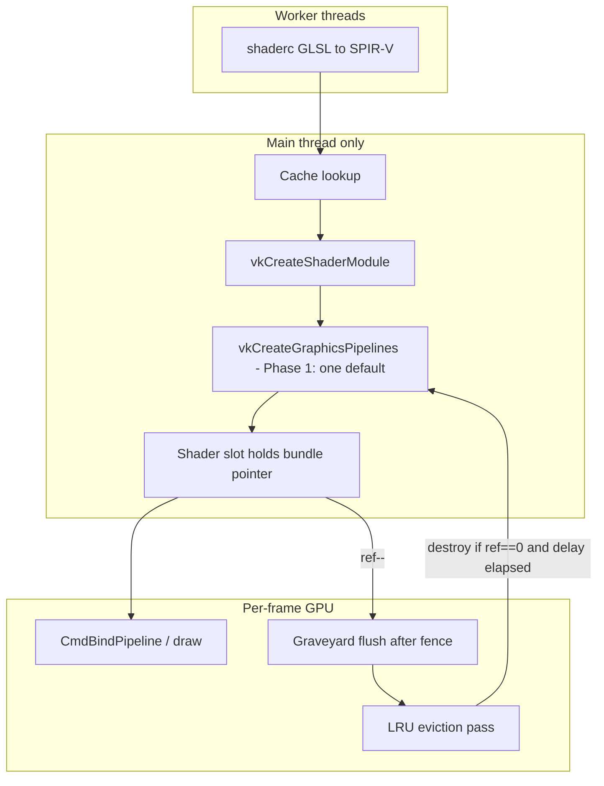

# Vulkan Shader Cache Plan

**Date**: 2026-06-11  
**Status**: NOT STARTED  
**Priority**: HIGH  
**Scope**: Vulkan backend + `SITUATION_ENABLE_SHADER_COMPILER` (GLSL→SPIR-V path); SPIR-V-from-memory loads share Layer B/C  
**Trigger**: Graphics harness — OpenGL ~315 tests in seconds; Vulkan ~88 tests ~30+ s because every `SituationLoadShaderFromMemory` rebuilds shaderc output and **9–12 `VkPipeline` objects** with no reuse  
**Companion**: [`ASYNC_SHADER_LOAD_HARDENING_PLAN.md`](ASYNC_SHADER_LOAD_HARDENING_PLAN.md), [`renderer_bolster_plan.md`](renderer_bolster_plan.md), [`TEST_HARNESS_GRAPHICS_UPGRADE.md`](TEST_HARNESS_GRAPHICS_UPGRADE.md), [`VULKAN_SPIRV_USER_DESCRIPTOR_PARITY.md`](VULKAN_SPIRV_USER_DESCRIPTOR_PARITY.md)  
**Primary files**: `sit/situation_impl_decl.h`, `sit/situation_impl_renderer.h`, `sit/situation_impl_renderer_fwd.h`, `tests/harness/test_graphics.c`

---

## Summary

Situation’s Vulkan path treats every shader load as a cold build: shaderc compiles GLSL to SPIR-V, then the main thread creates a private `VkPipelineLayout` (mesh profile) and calls `vkCreateGraphicsPipelines` **9–12 times** per shader (PBR / legacy / simple vertex layouts × cull variants × optional wireframe variants). `SituationUnloadShader` defers all of that to the per-frame **graveyard** and destroys it — there is **no cross-load reuse**.

OpenGL feels “cached” because one `glProgram` + driver binary cache hides the cost. Situation does not app-level dedupe on either backend; Vulkan makes the miss brutally visible (~270 ms per harness test that loads a shader).

This plan adds a **ref-counted shader cache above the graveyard**: shared SPIR-V blobs, `VkShaderModule`s, and one default pipeline per bundle (Phase 1). Unload decrements refs; destruction flows through the existing graveyard after GPU fences.

**Phase 1 is intentionally tight:** Layer A + B + one default pipeline, **three-field cache key**, **minimal bundle struct**, **`static inline` `_SitVkDerefBundle` on every bind/resolve**. No compatibility key fields, no hot-pin, no variants, no build tickets. Phase 2 adds lazy variants and the full key.

---

## Before you start coding (Phase 1 gate)

Ship **only** this:

1. **`_SitVkShaderCacheKey`** — `vs_spirv_hash`, `fs_spirv_hash`, `layout_profile` only (same type name in Phase 2 — append fields at the bottom).
2. **Minimal `_SitVkPipelineBundle`** — includes `content_hash` (`vs_spirv_hash ^ fs_spirv_hash`), plus generation, ref_count, last_used_frame, state, layout, modules, `default_pipeline`.
3. **`_SitVkDerefBundle`** — `static inline`; **every** bind/resolve path; never raw `bundle_ref.bundle`. Single biggest safety net — enforce in code comments.
4. **Exit** — second minimal shader load **< 3 ms** on GTX 1070 / RTX 2080; no memory growth after 50 load/unload cycles.

Do **not** add to Phase 1: `render_pass_compatibility_id`, `dynamic_state_mask`, `caps_fingerprint`, `pin_count`, `variants[]`, hot-pin list.

**Non-goals (this plan)**

- Replacing the raster variant resolver with fully dynamic Vulkan state (separate future work)
- OpenGL program cache (optional Phase 4 — lower priority)
- Public API changes (`SituationShader` handle semantics unchanged)
- Disk SPIR-V cache / shaderc cache dir (optional Phase 3 add-on)

---

## Problem statement (evidence)

| Symptom | Typical Vulkan time | Root cause |
|---------|---------------------|------------|
| `load_shader_from_memory` | ~270 ms | shaderc + 9–12 pipeline creates |
| Draw + readback tests | ~450–600 ms | Above + `EndFrame` + `SituationLoadImageFromScreen` |
| `clear_depth_command` | ~600 ms | **Two** shader loads |
| `draw_quad_red` | ~6 ms | Built-in quad pipeline (init-time) — no custom load |
| `async_shader_spirv_memory_vulkan` | ~7 ms | Precompiled SPIR-V — skips GLSL compile |
| Debug footer `resolve=106 rebind=43` | — | Multi-variant pipeline table working; no reuse |

Code already acknowledges the gap at `_SituationVulkanCreateShaderModuleEx`:

> *The returned module is not cached — caller is responsible for lifetime management and reuse (your shader cache or hot-reload system should handle deduplication).*

Today `_SitFreeShaderSlot` only clears `is_active`; GPU objects are destroyed on unload via graveyard with no retention.

---

## Design principles (contention rules)

These are **non-negotiable** — they match how Situation already threads shader work:

| Rule | Rationale |
|------|-----------|
| **Workers compile SPIR-V only** | Keep `_SituationVkAsyncCompileWorker` contract (shaderc is CPU-only) |
| **Main thread owns all `Vk*` creation** | Pipelines / modules / layouts created only where `SituationPollShaderLoad` / sync load run today |
| **Never hold `resource_registry_mutex` across slow work** | Slot alloc/free stays under mutex; cache lookup + `vkCreateGraphicsPipelines` happen **outside** it |
| **Cache owns GPU objects; slots hold refs** | Unload decrements ref; graveyard destroys only when ref hits zero |
| **No cache mutex on draw path** | Slot holds direct `VkPipeline*` / bundle pointer — zero locking per frame |
| **In-flight dedup, not double compile** | Phase 2 — concurrent loads of identical source share one build ticket |
| **Eviction is lazy + GPU-safe** | Evict only after `ref == 0`, delay elapsed, and graveyard flush confirms no in-flight use |

### Thread / lock matrix

| Operation | Thread | Locks |
|-----------|--------|-------|
| Cache lookup / `ref++` | Main | `shader_cache_mutex` (microseconds) |
| shaderc | Worker | Layer A mutex only — **no Vulkan** |
| `vkCreateShaderModule` / `vkCreateGraphicsPipelines` | Main | **none** (single-threaded GPU create) |
| `CmdBindPipeline` / draw | Main (record) | **none** |
| Unload `ref--` | Main | `shader_cache_mutex` |
| Graveyard flush | Main (post-fence) | Existing per-frame graveyard; then cache eviction pass |
| Shutdown | Main | Drain cache — immediate destroy (`_SituationVulkanImmediateDestroyDuringShutdown`) |

### Explicit anti-patterns (forbid in review)

- Worker calling `vkCreateGraphicsPipelines`
- Holding `resource_registry_mutex` during cache build
- Holding `shader_cache_mutex` during `vkCreateGraphicsPipelines`
- Evicting / destroying a bundle while `ref_count > 0`
- Dereferencing a stale bundle pointer without generation check

---

## Architecture



### Cache layers (by phase)

| Layer | Phase | Contents |
|-------|-------|----------|
| **A — SPIR-V blob** (CPU) | **1** | shaderc output; worker-safe |
| **B — Shader modules** (GPU) | **1** | Shared `VkShaderModule` pair per SPIR-V hash |
| **C — Pipeline bundle** (GPU) | **1** (minimal) / **2** (full) | Phase 1: one default pipeline + layout; Phase 2: lazy variant array |
| **Driver `VkPipelineCache`** | **2** | Speeds cold `vkCreateGraphicsPipelines`; optional disk persist in Phase 3 |

#### Layer A — SPIR-V blob cache (CPU, worker-friendly)

- **Key:** `hash(vs_source) ^ hash(fs_source) ^ shaderc_options_fingerprint`
- **Value:** `{ vs_spirv[], fs_spirv[] }`
- **Populated by:** worker (async) or main (sync)
- **Threading:** dedicated mutex; **no Vulkan calls**

#### Layer B — Shader module cache (GPU, main thread) — Phase 1

- **Key:** `(vs_spirv_hash, fs_spirv_hash)` — same SPIR-V pair as Layer C; device lifetime assumed stable (Phase 2 may add `device_uuid` if device-lost recreate paths need it)
- **Value:** `{ VkShaderModule vs, VkShaderModule fs, ref_count }`

#### Layer C — Pipeline bundle cache (GPU, main thread) — Phase 1

- **Key:** `_SitVkShaderCacheKey` (Phase 1 uses first three fields only)
- **Value:** one `VkPipeline` (default simple fill), layout, module refs

Phase 2 adds full `_SitVkShaderCacheKey`, lazy `variants[]`, and `VkPipelineCache`.

---

## Cache key

Use one struct name for all phases. Phase 1 hash/compare uses only the first three fields; Phase 2 appends compatibility fields **at the bottom** (no rename, no ABI break for lookup of content identity).

### Phase 1 — populate these fields only

```c
typedef struct _SitVkShaderCacheKey {
    uint64_t vs_spirv_hash;
    uint64_t fs_spirv_hash;
    uint8_t  layout_profile;   /* SituationSpirvLayoutProfile */
    /* Phase 2 fields appended below — zero / ignore in Phase 1 lookup */
} _SitVkShaderCacheKey;
```

Layer A keys on GLSL source hash (or SPIR-V bytes if loaded from memory). Layers B and C hash/compare on `(vs_spirv_hash, fs_spirv_hash, layout_profile)` in Phase 1.

**Phase 1 assumption (one line in code):** main render pass and device capabilities are fixed for the process lifetime. If that breaks, flush the cache or enable Phase 2 key fields — do not populate compatibility fields preemptively.

### Phase 2 — append to `_SitVkShaderCacheKey` (same struct name)

```c
typedef struct _SitVkShaderCacheKey {
    /* --- Phase 1 (unchanged order) --- */
    uint64_t vs_spirv_hash;
    uint64_t fs_spirv_hash;
    uint8_t  layout_profile;

    /* --- Phase 2 append --- */
    uint32_t render_pass_compatibility_id;
    uint8_t  subpass_index;
    uint32_t dynamic_state_mask;
    uint32_t caps_fingerprint;
} _SitVkShaderCacheKey;
```

Phase 2 lookup includes the appended fields. Existing Phase 1 entries remain valid if new fields are zero-initialized and capabilities unchanged.

**`render_pass_compatibility_id`** — monotonic epoch on `main_window_render_pass` create/destroy; stale entries evicted when `ref == 0`.

**`dynamic_state_mask`** — snapshot of extended dynamic state availability at build time (topology, depth, stencil, polygon mode, color write mask).

**`subpass_index`** — `0` until multiview / deferred subpass draws exist.

**`caps_fingerprint`** — which static variant combinations may be built lazily.

### Key construction by load path

| Load path | Layer A | Layer B | Layer C |
|-----------|---------|---------|---------|
| GLSL memory | source hash | SPIR-V pair | `_SitVkShaderCacheKey` (3 fields) |
| SPIR-V memory | skip | SPIR-V pair | `_SitVkShaderCacheKey` (3 fields) |
| Disk + hot-reload | source hash | SPIR-V pair | Phase 1 triple (Phase 3: in-place swap) |

---

## Pipeline bundle ref (hot draw path)

Prefer a **direct pointer** over `(cache_entry_id, generation)` — fewer indirections on bind/draw.

```c
typedef struct _SitVkPipelineBundle _SitVkPipelineBundle;

typedef struct _SitVkPipelineBundleRef {
    _SitVkPipelineBundle* bundle;   /* NULL if slot has no cached bundle */
    uint32_t              generation; /* bundle->generation at acquire time */
} _SitVkPipelineBundleRef;
```

**Acquire** (load / cache hit): set `slot->bundle_ref = { bundle, bundle->generation }`; `bundle->ref_count++`; update `bundle->last_used_frame = current_frame`.

**Deref** (bind / resolve — hot path):

```c
/* CRITICAL SAFETY: EVERY bind/resolve/hot-reload path MUST go through this.
 * grep -n 'bundle_ref\.bundle' situation_impl_renderer.h  must return ZERO hits
 * outside this function. */
static inline _SitVkPipelineBundle* _SitVkDerefBundle(const _SitVkPipelineBundleRef* ref) {
    if (!ref || !ref->bundle) return NULL;
    if (ref->bundle->generation != ref->generation) return NULL; /* stale — slot must re-acquire */
    if (ref->bundle->state == SIT_VK_BUNDLE_DESTROYED) return NULL;
    if (ref->bundle->state >= SIT_VK_BUNDLE_STALE) return NULL; /* Phase 2+: STALE and above */
    return ref->bundle;
}
```

**Mandatory call sites (review gate — non-negotiable):** `_SitVkDerefBundle` is **`static inline`** and is the **only** approved way to read bundle-owned GPU state. Required on **every** path below; add the same comment block at each call site:

- `SituationCmdBindPipeline`
- `_SitVulkanResolveGraphicsPipeline`
- `_SitVulkanEnsureGraphicsPipelineBound`
- Any hot-reload swap that compares or replaces a slot’s bundle

**Enforcement:** `grep -n 'bundle_ref\.bundle'` in `situation_impl_renderer.h` must return **zero** hits outside `_SitVkDerefBundle` itself. On NULL return: fall back to legacy uncached path or return `SITUATION_ERROR_RESOURCE_INVALID` (never bind a stale `VkPipeline`).

No mutex on deref — generation invalidates stale pointers after eviction reuses memory (or bump generation on in-place stale marking without freeing until graveyard completes).

**Slot cache for draw:** after a successful deref + bind, copy `VkPipeline default_pipeline` (Phase 1) or resolved variant pointer (Phase 2) into `shader_slot->vk_bound_pipeline_cache` so subsequent draws in the same pass avoid repeat deref when pipeline is already bound.

`SituationShader` public handle unchanged; unload clears `bundle_ref` and decrements `ref_count`.

---

## Pipeline bundle struct

### Phase 1 — minimal (do not expand until Phase 2)

```c
typedef struct _SitVkPipelineBundle {
    _SitVkShaderCacheKey       key;
    uint64_t                   content_hash; /* vs_spirv_hash ^ fs_spirv_hash — used for fast hot-reload equality (Phase 3) */
    uint32_t                   generation;
    atomic_uint                ref_count;
    uint32_t                   last_used_frame;
    _SitVkBundleState          state;

    VkPipelineLayout           layout;
    bool                       owns_layout;
    VkShaderModule             vs_module;
    VkShaderModule             fs_module;
    VkPipeline                 default_pipeline;
} _SitVkPipelineBundle;
```

Bundle state enum (define in `situation_impl_decl.h`):

```c
typedef enum _SitVkBundleState {
    SIT_VK_BUNDLE_READY = 0,
    SIT_VK_BUNDLE_EVICT_PENDING,
    SIT_VK_BUNDLE_STALE,        /* Phase 2: compatibility key bump */
    SIT_VK_BUNDLE_DESTROYED
} _SitVkBundleState;
```

Set `content_hash` at bundle create. Phase 1 does not use it for lookup (key struct is authoritative); it avoids re-hashing in Phase 3 hot-reload.

Phase 1 uses `READY`, `EVICT_PENDING`, `DESTROYED` only; define `SIT_VK_BUNDLE_STALE` now so `_SitVkDerefBundle` is future-proof.

Phase 1 **does not** build PBR / legacy / cull / line variants. Cache hit only for mesh-profile shaders that match the default simple pipeline template; **cache miss → existing legacy 12-pipeline path unchanged**.

### Phase 2 — extend bundle

```c
    /* Append to _SitVkPipelineBundle — do not reorder Phase 1 fields */
    atomic_uint                pin_count;
    VkPipeline                 variants[SIT_VK_PIPE_VARIANT_COUNT];
    atomic_uint                variant_ready_mask;
```

Phase 3 hot-reload uses existing `content_hash` for O(1) “same SPIR-V?” before full key compare.

Lazy create in `_SitVulkanResolveGraphicsPipeline` — see Phase 2 section.

---

## Eviction strategy (Phase 1 — simple LRU)

Fixed-size table (**256** entries default; tunable to 512). No hot-pin list in Phase 1.

```c
#define SIT_VK_SHADER_CACHE_MAX_ENTRIES          256
#define SIT_VK_SHADER_CACHE_EVICT_DELAY_FRAMES     2
```

Phase 2 adds `SIT_VK_SHADER_CACHE_HOT_PIN_FRAMES` / `HOT_PIN_MAX` and `pin_count`.

### Eviction rule (Phase 1)

```
ref_count == 0
&& last_used_frame + SIT_VK_SHADER_CACHE_EVICT_DELAY_FRAMES <= current_frame
&& state != DESTROYED
```

Run `_SitVkShaderCacheProcessEvictions()` **after** `_SituationFlushGraveyard(frame_index)` each frame.

### LRU victim selection

When table is full on insert: pick eligible entry with lowest `last_used_frame` → `EVICT_PENDING` → graveyard destroy → bump `generation` → remove from map.

---

## Load path (sync) — Phase 1

```
SituationLoadShaderFromMemory(vs, fs, &out)
  1. [mutex brief] alloc shader slot; release mutex
  2. Layer A lookup by source key
       HIT  → use SPIR-V blobs
       MISS → shaderc sync → insert Layer A
  3. Layer B lookup by SPIR-V hash
       HIT  → reuse modules
       MISS → vkCreateShaderModule ×2 → insert Layer B
  4. Layer C lookup by `_SitVkShaderCacheKey` (Phase 1: first 3 fields only)
       HIT  → ref++ ; bundle_ref = { ptr, gen } ; return SUCCESS
       MISS → vkCreatePipelineLayout (if mesh) + ONE vkCreateGraphicsPipelines (default simple)
              insert bundle ; ref=1 ; attach to slot
```

**Mutex scope:** `shader_cache_mutex` for map insert / lookup / refcount / `last_used_frame` only. Released before shaderc / `vkCreate*`.

**Phase 1 does not include build tickets** — duplicate concurrent sync loads of identical source are rare; Phase 2 adds tickets + async dedup test.

---

## Load path (async) — Phase 1

Preserve existing public contract (`ASYNC_SHADER_LOAD_HARDENING_PLAN.md` invariants P1–P2).

```
BeginLoadShaderFromMemory
  → alloc slot + async ctx (as today)
  → submit worker with source key

PollShaderLoad (main, each poll)
  → if compile_done: Layer A insert (idempotent)
  → Layer B/C acquire (same as sync steps 3–4)
  → attach bundle_ref, free async ctx, SUCCESS
```

**Do not** poll async shader loads inside `SituationAcquireFrameCommandBuffer`.

---

## Unload path (pre-graveyard)

```
SituationUnloadShader(&shader)
  1. Clear slot bundle_ref + bound pipeline cache
  2. bundle->ref_count--
  3. if ref_count == 0:
       eligible for eviction after delay (do not destroy immediately)
  4. _SitFreeShaderSlot (registry only)
```

Destruction happens only in `_SitVkShaderCacheProcessEvictions()` post-graveyard.

---

## In-flight deduplication — Phase 2 only

```c
typedef struct _SitVkShaderBuildTicket {
    _SitVkShaderCacheKey key;
    atomic_int           phase;
    _SitVkPipelineBundle* result_bundle;
    uint32_t             waiters;
} _SitVkShaderBuildTicket;
```

Deferred from Phase 1 to keep first ship small. Required for `shader_cache_concurrent_loads` hardening beyond a basic smoke test.

---

## Configuration

```c
#define SIT_VK_SHADER_CACHE_MAX_ENTRIES          256
#define SIT_VK_SHADER_CACHE_EVICT_DELAY_FRAMES     2
/* Phase 2: HOT_PIN_FRAMES, HOT_PIN_MAX */
```

Future opt-out: `SituationInitInfo::disable_vulkan_shader_cache` (optional — not required for Phase 1 ship).

### Debug stats — Phase 1 optional (`#if !defined(NDEBUG)`)

Lightweight counters for tuning cache size, pin window, and eviction delay. Reset at init; log summary at shutdown or via trace hook.

```c
typedef struct SIT_VK_SHADER_CACHE_STATS {
    uint64_t hits;              /* Layer C bundle acquire returned existing entry */
    uint64_t misses;            /* new bundle build (includes pipeline create) */
    uint64_t evictions;
    uint64_t stale_derefs;
    uint64_t total_build_time_ns;
} SIT_VK_SHADER_CACHE_STATS;
```

Print at shutdown in `[Vulkan Debug]` banner. Skip public API unless needed — internal `sit_render.vk.shader_cache_stats` is enough for Phase 1.

---

## Master progress dashboard

| Phase | Target | Status | Success metric |
|-------|--------|--------|----------------|
| **1** — Layer A + B + one default pipeline + LRU eviction + core tests | v2.4.x | ⬜ Not started | **Exit:** 2nd minimal shader load **< 3 ms** on GTX 1070 / RTX 2080 |
| **2** — Lazy variants + build tickets + `VkPipelineCache` + concurrent test | v2.4.x | ⬜ Not started | First minimal load ~30–50 ms (1 pipeline lazy path) |
| **3** — Hot-reload in-place swap + disk pipeline cache | v2.4.x | ⬜ Not started | Hot-reload same handle; no full rebuild |
| **4** — OpenGL program cache (optional) | v2.5? | ⬜ Not started | Harness parity on GL reload |

- [ ] **Plan complete** — verification matrix green; harness Vulkan wall time ≥ 5× faster vs baseline
- [ ] **This doc** — dashboard updated per phase

---

## Phase 1 — Tight first ship (do not boil the ocean)

**In scope**

- Layer A SPIR-V cache
- Layer B shader module cache
- Layer C one default pipeline per bundle
- `_SitVkShaderCacheKey` — three fields populated in Phase 1 (same struct, append in Phase 2)
- Minimal `_SitVkPipelineBundle` with `content_hash`
- **`static inline` `_SitVkDerefBundle` — mandatory on every bind/resolve**
- Simple LRU + `last_used_frame` + delay eviction (no hot-pin)
- Wire sync + async poll paths
- Three cache tests + exit gate

**Out of scope for Phase 1**

- Full compatibility key fields in `_SitVkShaderCacheKey` (append at bottom — same type name)
- Lazy variants / `_SitVkEnsurePipelineVariant`
- Hot-pin list / `pin_count`
- `variants[]` / lazy resolve
- Build tickets (async concurrent test = correctness only in Phase 1)
- `VkPipelineCache` object
- Hot-reload in-place swap
- Non-simple pipeline configurations (cache miss → legacy path)

### 1A — Data structures (`situation_impl_decl.h`)

- [ ] `_SitVkShaderCacheKey` — three fields used in Phase 1 lookup (struct sized for Phase 2 append)
- [ ] `_SitVkPipelineBundle` — minimal + `content_hash`
- [ ] `_SitVkPipelineBundleRef` — pointer + generation
- [ ] `_SitVkShaderCache` — hash map + LRU, `shader_cache_mutex`
- [ ] `_SituationShaderSlot`: `bundle_ref`, `vk_bound_pipeline_cache`
- [ ] Debug: `SIT_VK_SHADER_CACHE_STATS` (optional, `#if !defined(NDEBUG)`)

### 1B — Cache API (`situation_impl_renderer.h`)

- [ ] `_SitVkShaderCacheInit` / `_SitVkShaderCacheShutdown`
- [ ] `_SitVkShaderCacheLookupOrInsertSpirv` (Layer A)
- [ ] `_SitVkShaderCacheAcquireModules` (Layer B)
- [ ] `_SitVkShaderCacheAcquireBundle` / `_SitVkShaderCacheReleaseBundle`
- [ ] `_SitVkDerefBundle` — **`static inline`** + CRITICAL SAFETY comment; grep gate: no raw `bundle_ref.bundle`
- [ ] `_SitVkShaderCacheProcessEvictions` — tail of `_SituationFlushGraveyard`

### 1C — Wire load / unload

- [ ] `SituationLoadShaderFromMemory` → Phase 1 cache path
- [ ] `_SituationPollVkAsyncShaderLoad` → same acquire path after SPIR-V ready
- [ ] `SituationUnloadShader` → `ReleaseBundle` (no per-pipeline defer destroy for cached bundles)
- [ ] `SituationLoadShaderFromSpirvMemoryEx` → skip Layer A

### 1D — Tests (ship with Phase 1)

- [ ] `shader_cache_hit` — load same GLSL twice; **second load < 3 ms**
- [ ] `shader_cache_reuse_after_unload` — load → unload → load; draw pixel test passes
- [ ] `shader_cache_concurrent_loads` — two `BeginLoadShaderFromMemory` same source; both reach SUCCESS (may duplicate shaderc in Phase 1 — assert correctness, not dedup; tighten in Phase 2)
- [ ] `shader_cache_no_memory_growth` — 50× load/unload; `shader_cache_stats.evictions` unchanged after cycle 2; cache map size ≤ 1 active bundle + modules (exit #6–7)
- [ ] Full `--module graphics` Vulkan regression

### Phase 1 exit criteria (hard gate)

All must pass on **`sit_test_vulkan.exe`** before Phase 1 is marked done:

1. **`shader_cache_hit`** — second load of harness minimal shader (`g_minimal_vs` / `g_minimal_fs`) **< 3 ms** wall time on **GTX 1070 and RTX 2080** (record both in UPDATELOG).
2. **`shader_cache_reuse_after_unload`** — green; pixel draw correct after reload.
3. **`shader_cache_concurrent_loads`** — both async handles reach SUCCESS.
4. Full **`--module graphics`** — no regressions vs pre-cache baseline.
5. Debug shutdown banner shows sensible `SIT_VK_SHADER_CACHE_STATS` (hits ≫ misses on second full module run).
6. **No memory growth** after **50 load/unload cycles** of the same minimal shader — no increase in `sit_render.vk.shader_cache_stats.evictions` after cycle 2; no leak warnings at shutdown; optional: `SituationGetVRAMUsage()` stable.
7. **Cache map size stable** after 50 load/unload cycles (≤ 1 active bundle + associated modules).

---

## Phase 2 — Lazy variants + full cache key + tickets + driver cache

### 2A — Full cache key + lazy variants + hot-pin

- [ ] Append Phase 2 fields to `_SitVkShaderCacheKey` (bottom of struct); enable full-key lookup
- [ ] `render_pass_compatibility_id` epoch; `STALE` state + flush
- [ ] Extend bundle: `variants[]`, `variant_ready_mask`, optional `pin_count`, hot-pin pass
- [ ] `_SitVkEnsurePipelineVariant` — main-thread only
- [ ] `_SitVkDerefBundle` on all resolve paths (already mandatory from Phase 1)
- [ ] Cache hit for all harness draw tests

### 2B — Build tickets

- [ ] `_SitVkShaderBuildTicket` map
- [ ] Dedup concurrent `BeginLoad` / sync loads — one shaderc + one bundle build per key
- [ ] Harden `shader_cache_concurrent_loads` — assert single shaderc job
- [ ] Align with `ASYNC_SHADER_LOAD_HARDENING_PLAN` Phase B

### 2C — `VkPipelineCache`

- [ ] `vkCreatePipelineCache` at init; destroy at cleanup
- [ ] Pass to all `_SituationVulkanCreateGraphicsPipeline` calls
- [ ] Optional disk persist (Phase 3)

**Acceptance**: First load minimal shader ~30–50 ms; concurrent load test proves single compile.

---

## Phase 3 — Hot reload + persistence

- [ ] `_SituationPerformHotReloadPass` — in-place bundle swap on existing slot
- [ ] In-place bundle swap using `content_hash` for fast equality
- [ ] Bump compatibility key on swapchain recreate → stale flush
- [ ] Disk `VkPipelineCache` load/save (optional)

---

## Phase 4 — OpenGL program cache (optional)

- [ ] Unified Layer A source hash → `{ GLuint program }` for GL backend
- [ ] Same ref-count + eviction model

---

## Verification matrix

| # | Test | Phase | Pass criteria |
|---|------|-------|---------------|
| V1 | `shader_cache_hit` | **1** | Two loads same minimal GLSL; 2nd **< 3 ms** on **GTX 1070 / RTX 2080** |
| V2 | `shader_cache_reuse_after_unload` | **1** | load → unload → load; draw pixel test OK |
| V3 | `shader_cache_concurrent_loads` | **1** (correctness) / **2** (dedup) | Both handles SUCCESS; Phase 2: one shaderc job |
| V4 | Distinct shaders | 1 | Two FS variants → two entries |
| V5 | Graveyard safety | 1 | load → draw → unload → reload; no validation error |
| V6 | Render pass bump | 2 | After swapchain recreate, no stale pipeline bind |
| V7 | Hot reload | 3 | mtime bump; handle stable |
| V8 | Harness regression | 1+ | `--module graphics` wall time vs baseline in UPDATELOG |
| V9 | Shutdown / memory | **1** | 50× load/unload — no `evictions` increase after cycle 2; map size ≤ 1 bundle + modules |

**Run commands**

```powershell
Set-Location "C:\Users\User\Desktop\hobby\_kiro\situation\build"
$env:PATH = "dll;C:\msys64\mingw64\bin;$env:PATH"
& ".\sit_test.exe" --filter shader_cache_hit
& ".\sit_test.exe" --filter shader_cache_reuse_after_unload
& ".\sit_test.exe" --filter shader_cache_concurrent_loads
& ".\sit_test.exe" --filter shader_cache_no_memory_growth
& ".\sit_test.exe" --module graphics
```

---

## Expected outcomes

| Scenario | Today (Vulkan) | After Phase 1 | After Phase 2 |
|----------|----------------|---------------|---------------|
| Repeat harness shader load | ~270 ms | **< 3 ms** | < 3 ms |
| First load minimal shader | ~270 ms | ~50–80 ms (1 pipeline) | ~30–50 ms |
| `clear_depth_command` (2 shaders) | ~600 ms | ~100 ms first / ~6 ms repeat | same |
| Full graphics module (88 tests) | ~30+ s | ~5–8 s (est.) | ~2–4 s (est.) |

Phase 1 improves repeat loads dramatically; full module time drops but may still rebuild 12 variants on cache miss until Phase 2.

---

## Files to touch

| File | Changes |
|------|---------|
| `sit/situation_impl_decl.h` | Cache key, bundle, bundle ref, cache table |
| `sit/situation_impl_renderer.h` | Acquire/release, eviction, load/unload/poll |
| `sit/situation_impl_renderer_fwd.h` | Forward decls |
| `sit/situation_api.h` | Optional `disable_vulkan_shader_cache` |
| `tests/harness/test_graphics.c` | Three cache tests (Phase 1) |
| `doc/UPDATELOG.md` | Per-phase ship notes |

---

## Relationship to graveyard

| Mechanism | Role |
|-----------|------|
| **Graveyard** | GPU may still be using this — destroy after fence |
| **Shader cache** | Keep while `ref > 0`; LRU retains briefly after unload |
| **LRU + delay eviction** | `ref == 0` and aged out — queue destroy through graveyard |
| **Generation on bundle** | Invalidates stale pointers without draw-path locking |

The cache sits **above** the graveyard in the resource lifecycle, not instead of it.

---

## Changelog (this document)

| Date | Change |
|------|--------|
| 2026-06-11 | Initial plan |
| 2026-06-11 | Refinements: LRU+`last_used_frame` eviction, hot pin list, pointer bundle ref, Phase 1 scope tightened, early test trio |
| 2026-06-11 | Phase 1 minimal cache key only; mandatory `_SitVkDerefBundle`; debug stats; GTX 1070/2080 exit gate |
| 2026-06-11 | Polish: `_SitVkShaderCacheKey` (no Phase1 suffix); Phase 1 `content_hash`; deref grep gate; 50× memory exit criterion |
| 2026-06-11 | Deref `>= STALE` guard; bundle state enum; exit #6 cites `evictions` + map size |
| 2026-06-11 | `_SitVkBundleState` typedef; CRITICAL SAFETY deref comment; exit #7 cache map size line |
