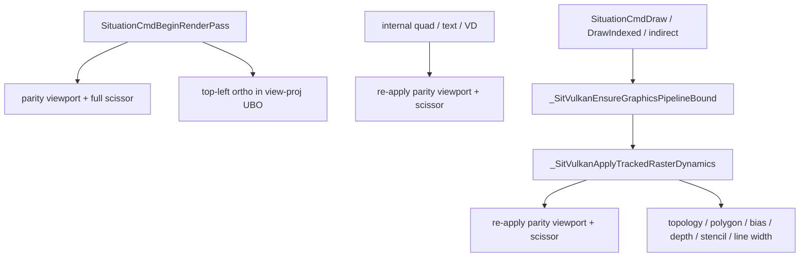

# Vulkan Viewport / Scissor Sanitisation Plan

**Date:** 2026-06-08  
**Status:** PROPOSED — implementation pending maintainer sign-off  
**Target version:** **v2.4.221** (tentative codename: **"Vulkan Viewport Scissor Sanitisation"**)  
**Builds on:** **v2.4.220** (`_SitVulkanApplyGraphicsViewportScissor` OpenGL-parity viewport — behaviour **must not change**)  
**Priority:** MEDIUM — refactor only; no new public API  
**Risk:** LOW if gates followed; regression surface is viewport/scissor + tracked raster dynamics on Vulkan user draws  

**Primary files:**

| File | Role |
|------|------|
| `sit/situation_impl_renderer_frame_cmd.h` | Viewport/scissor helpers, draw/bind paths, `BeginRenderPass` |
| `sit/situation_impl_renderer_fwd.h` | Forward declarations |
| `sit/situation_impl_vd.h` | VD compositor viewport/scissor (optional slice B) |
| `doc/UPDATELOG.md` / `doc/whatsnew.md` | Ship notes |
| `doc/plan/renderer_bolster_plan.md` | Cross-link Phase 7-bis follow-up |

**Related releases:** **v2.4.175** (tracked raster hygiene), **v2.4.189** (OpenGL-parity viewport for pass + internal 2D), **v2.4.220** (graphics hygiene parity alignment)

**Constraint:** `[VK only]` — OpenGL soft-buffer paths are untouched.

---

## Purpose

After **v2.4.220**, the **behaviour** of Vulkan viewport/scissor on tracked user draws is correct and verified. The **structure** still carries technical debt from incremental fixes:

1. Two byte-identical helpers (`_SitVulkanApply2DViewportScissor` and `_SitVulkanApplyGraphicsViewportScissor`).
2. `_SitVulkanApplyTrackedRasterDynamics` recorded **twice** on every `SituationCmdDraw` / `DrawIndexed` / indirect draw.
3. `FillViewport2DOpenGLParity` + scissor setup **inlined** in `BeginRenderPass`, VD compositor, and `_SitVulkanApplyVDCompositingDynamicState`.

This plan consolidates helpers and command-buffer traffic **without altering** the v2.4.220 viewport convention (OpenGL-parity negative height + full render-area scissor).

---

## Background — correct model (do not regress)

### Matched pair (Phase 7-bis)

| Component | Helper / value |
|-----------|----------------|
| Projection UBO | `_SitVulkanFillOrthoProjection2D` → `glm_ortho(0, w, h, 0, …)` |
| Viewport | `_SitVulkanFillViewport2DOpenGLParity` → `y = height`, `height = -height` |

Do **not** reintroduce `projection[1][1] *= -1` or per-shader Y/UV flips. See `doc/plan/renderer_bolster_plan.md` Phase 7-bis blocker note.

### Per-render-pass flow (after v2.4.220)



**Hygiene intent:** internal draws can leave scissor or dynamic state wrong; tracked user draws must reset **full render area** + **parity viewport** before `vkCmdDraw*`.

---

## Scope

### In scope

- Merge duplicate viewport/scissor helpers into one canonical internal API.
- Remove redundant `_SitVulkanApplyTrackedRasterDynamics` calls on draw entry points.
- Optional: parameterized extent helper shared by VD compositor and `BeginRenderPass` (slice B).
- Forward-declaration cleanup in `situation_impl_renderer_fwd.h`.
- Patch notes + plan status update.

### Out of scope (explicit)

- Changing OpenGL-parity viewport math or ortho UBO writes.
- Honouring `SituationCmdSetViewport` across subsequent draws (today: full-area reset wins — **document only**, no behaviour change in this plan).
- Merging `_SitVulkanApplyQuadDrawDynamicState` / `_SitVulkanApplyVDCompositingDynamicState` with full `_SitVulkanApplyTrackedRasterDynamics` (different topology/depth contracts).
- OpenGL renderer changes.
- New public API or harness tests (existing modules must stay green).

---

## Current call graph (audit)

### Viewport/scissor helpers (identical body after v2.4.220)

| Symbol | Call sites |
|--------|------------|
| `_SitVulkanFillViewport2DOpenGLParity` | Low-level math only — **keep** |
| `_SitVulkanApply2DViewportScissor` | `_SitVulkanApplyQuadDrawDynamicState`, `SituationCmdDrawTextEx` |
| `_SitVulkanApplyGraphicsViewportScissor` | `_SitVulkanApplyTrackedRasterDynamics` only |
| Inline `FillViewport2DOpenGLParity` + scissor | `SituationCmdBeginRenderPass`, `_SitVulkanApplyVDCompositingDynamicState`, `situation_impl_vd.h` (×2) |

### Double `_SitVulkanApplyTrackedRasterDynamics`

| Path | Calls dynamics |
|------|----------------|
| `_SitVulkanEnsureGraphicsPipelineBound` | **Always** (line ~13451), even when pipeline does not rebind |
| `SituationCmdDraw` | Ensure **then** dynamics again (~13817–13818) |
| `SituationCmdDrawIndexed` | Ensure **then** dynamics again (~13866–13867) |
| Indirect draw (`_SituationCmdDrawIndirectRecord`) | Ensure **then** dynamics again (~13944–13945) |
| `SituationCmdBindPipeline` | Ensure only (correct) |
| `SituationCmdBindVertexBuffer` | Ensure only (correct — dynamics deferred to draw) |
| `_SitVulkanApplyRasterState` (no bound shader) | dynamics only via else branch (~13475) |

**Conclusion:** remove the **second** dynamics call on the three draw record paths only. Keep dynamics inside `EnsureGraphicsPipelineBound`.

---

## Proposed internal API

### Layer 1 — math (unchanged)

```c
static void _SitVulkanFillViewport2DOpenGLParity(float width, float height, VkViewport* out_vp);
```

Keep the name: it documents *why* the flip exists, even when used outside “2D-only” call sites.

### Layer 2 — extent-based record (new)

```c
/** Record OpenGL-parity viewport + scissor for explicit pixel extent (w × h). */
static void _SitVulkanCmdSetViewportScissorForExtent(VkCommandBuffer vk_cmd, float w, float h);
```

Implementation:

- Clamp `w`, `h` to `>= 1.0f`.
- `_SitVulkanFillViewport2DOpenGLParity(w, h, &vp)`.
- `VkRect2D sc = {{0, 0}, {(uint32_t)w, (uint32_t)h}}`.
- `vkCmdSetViewport` / `vkCmdSetScissor` index 0.

`void` by design — same as existing helpers; null cmd / zero extent → early return (no error propagation). Aligns with **Internal Hardening** “void by design” for record-only hygiene (Phase 9 pattern).

### Layer 3 — active render area (replaces both duplicates)

```c
/** Re-apply parity viewport + scissor for sit_render.vk.current_render_area (swapchain fallback). */
static void _SitVulkanApplyRenderAreaViewportScissor(VkCommandBuffer vk_cmd);
```

Implementation:

- Resolve `VkExtent2D extent` from `current_render_area.extent`, fallback `swapchain_extent` (same logic as today).
- If `width == 0 || height == 0` → return.
- `_SitVulkanCmdSetViewportScissorForExtent(vk_cmd, (float)extent.width, (float)extent.height)`.

### Deprecate / remove

| Remove | Replace with |
|--------|----------------|
| `_SitVulkanApply2DViewportScissor` | `_SitVulkanApplyRenderAreaViewportScissor` |
| `_SitVulkanApplyGraphicsViewportScissor` | `_SitVulkanApplyRenderAreaViewportScissor` |

**Naming rationale:** “Render area” is neutral — used by internal 2D **and** tracked user-draw hygiene after v2.4.220. Avoid “2D” (implies internal-only) and “Graphics” (implies user-only).

---

## Implementation slices

Execute **in order**. Do not combine slice A + B in one commit unless harness is run between them when bisecting.

### Slice A — merge helpers + dedupe dynamics (required)

**Files:** `situation_impl_renderer.h`, `situation_impl_renderer_fwd.h`

#### A1 — Add new helpers

1. Add `_SitVulkanCmdSetViewportScissorForExtent` immediately after `_SitVulkanFillViewport2DOpenGLParity`.
2. Add `_SitVulkanApplyRenderAreaViewportScissor` delegating to extent helper.

#### A2 — Rewire call sites

| Site | Change |
|------|--------|
| `_SitVulkanApplyTrackedRasterDynamics` | `_SitVulkanApplyRenderAreaViewportScissor` |
| `_SitVulkanApplyQuadDrawDynamicState` | `_SitVulkanApplyRenderAreaViewportScissor` |
| `SituationCmdDrawTextEx` (Vulkan) | `_SitVulkanApplyRenderAreaViewportScissor` |
| Delete | `_SitVulkanApply2DViewportScissor`, `_SitVulkanApplyGraphicsViewportScissor` |

#### A3 — Remove duplicate dynamics on draw

Remove standalone `_SitVulkanApplyTrackedRasterDynamics(vk_cmd)` **after** `EnsureGraphicsPipelineBound` in:

- `SituationCmdDraw`
- `SituationCmdDrawIndexed`
- `_SituationCmdDrawIndirectRecord` (Vulkan branch)

**Keep** dynamics inside `_SitVulkanEnsureGraphicsPipelineBound` (always runs).

**Keep** `_SitVulkanApplyRasterState` else-branch dynamics when no shader is bound.

#### A4 — Forward declarations

In `situation_impl_renderer_fwd.h`:

- Add `_SitVulkanCmdSetViewportScissorForExtent`, `_SitVulkanApplyRenderAreaViewportScissor`.
- Remove `_SitVulkanApply2DViewportScissor`, `_SitVulkanApplyGraphicsViewportScissor`.

#### A5 — Build + verify (gate)

```powershell
Set-Location "<repo>"
.\build_situation.bat vulkan
.\build_tests.bat vulkan
Set-Location build
$env:PATH = "dll;C:\msys64\mingw64\bin;$env:PATH"
.\sit_test_vulkan.exe --module graphics
.\sit_test_vulkan.exe --module virtual_display
```

**Exit criteria (Slice A):**

- [ ] DLL + tests build clean.
- [ ] Vulkan `graphics` count unchanged vs pre-patch baseline (reference: **89/89** post–v2.4.189).
- [ ] Vulkan `virtual_display` **21/21**.
- [ ] No new grep hits for removed symbol names in `sit/`.

---

### Slice B — dedupe inline extent setup (optional, same version or follow-up)

**Files:** `situation_impl_renderer.h`, `situation_impl_vd.h`

Only after Slice A is green.

| Site | Change |
|------|--------|
| `SituationCmdBeginRenderPass` (Vulkan) | Set `current_render_area` **before** viewport record, then `_SitVulkanApplyRenderAreaViewportScissor(cmd)` **or** `_SitVulkanCmdSetViewportScissorForExtent` with `renderArea.extent` |
| `_SitVulkanApplyVDCompositingDynamicState` | `_SitVulkanCmdSetViewportScissorForExtent(vk_cmd, vp_w, vp_h)` + keep topology/depth lines |
| `situation_impl_vd.h` compositor setup (~838, ~1091) | `_SitVulkanCmdSetViewportScissorForExtent(vk_cmd, target_width, target_height)` |

#### VD extent caution

In current VD compositor code, `target_width` / `target_height` are derived from `composite_fb_w` / `composite_fb_h` (swapchain extent). Scissor extent uses the same values. **Safe** to use one extent helper.

If a future change reintroduces `glfwGetFramebufferSize` for composite dimensions **without** matching viewport math, **do not** blindly call `_SitVulkanApplyRenderAreaViewportScissor` there — use explicit `_SitVulkanCmdSetViewportScissorForExtent` with the **same** `w`/`h` passed to `_SitVulkanFillOrthoProjection2D`.

#### BeginRenderPass reorder note

Today:

1. `vkCmdBeginRenderPass`
2. inline viewport/scissor
3. `current_render_area = render_pass_info.renderArea`

Proposed:

1. `vkCmdBeginRenderPass`
2. `current_render_area = render_pass_info.renderArea`
3. `_SitVulkanCmdSetViewportScissorForExtent(cmd, extent.width, extent.height)` **or** `_SitVulkanApplyRenderAreaViewportScissor` if area is already stored

Verify `current_render_area` is not read between steps by other code in the same function (it is not today).

**Exit criteria (Slice B):** same harness gates as Slice A + visual smoke: live-window metrics overlay top-left, listen-test scope/spectrum bottom-left (Vulkan).

---

## What must NOT change (regression checklist)

| Invariant | Verification |
|-----------|----------------|
| Parity viewport math: `y = h`, `height = -h` | Code review + `primitive_topology_line_list` |
| Full render-area scissor `{{0,0}, extent}` on hygiene path | `compute_image_write`, VD compositor tests |
| Tracked topology/depth/stencil/line-width still applied before user draw | `polygon_mode_line_wireframe`, `depth_bias_overlap`, stencil tests |
| Internal quad/text still use triangle-strip + quad depth dynamics | `draw_quad_red`, `draw_textured_checkerboard`, `draw_metrics_overlay` |
| `EnsureGraphicsPipelineBound` still applies dynamics on **every** call | `draw_pipeline_basic`, bind-then-draw ordering tests |
| OpenGL paths unchanged | `sit_test_opengl.exe --module graphics` spot check |

---

## Risk analysis

| Risk | Likelihood | Mitigation |
|------|------------|------------|
| Removing second dynamics call misses state if Ensure is skipped | Low | Draw paths already require Ensure; grep audit for draw without Ensure |
| BeginRenderPass reorder reads stale `current_render_area` | Low | Only reorder within same function; Slice B optional |
| VD wrong extent if composite ≠ render area | Low today | Use explicit extent helper; document in VD comment |
| Symbol rename breaks external forks greping internals | N/A | Symbols are `static` / internal only |

---

## Verification matrix (pre-ship)

| Module | Filter (minimum) | Expect |
|--------|------------------|--------|
| `graphics` | `primitive_topology_line_list` | pass |
| `graphics` | `draw_quad_red`, `draw_textured_checkerboard` | pass |
| `graphics` | `draw_metrics_overlay` | pass |
| `graphics` | `cmd_set_viewport_scissor` | pass (records custom viewport; next draw resets — unchanged contract) |
| `graphics` | full module | same pass count as baseline |
| `virtual_display` | full module | 21/21 |
| Manual | Demon Hunt / listen overlay window | no Y flip regression |

Record command in `doc/UPDATELOG.md` verification table.

---

## Ship checklist (v2.4.221)

- [ ] Slice A implemented and gated.
- [ ] Slice B implemented (optional) and gated.
- [ ] `sit/situation_base_version.h` → PATCH **221**, DESCRIPTION **"Vulkan Viewport Scissor Sanitisation"**.
- [ ] `doc/UPDATELOG.md` — prepend v2.4.221 (library refactor, no public API change).
- [ ] `doc/whatsnew.md` — bullet under v2.4.221.
- [ ] This plan — Status → **SHIPPED**, check phase boxes.
- [ ] `doc/plan/renderer_bolster_plan.md` — one-line cross-link under Phase 7-bis follow-up (optional).

---

## Explicit non-goals (future work)

| Item | Why deferred |
|------|----------------|
| `custom_viewport_active` tracking for `SituationCmdSetViewport` | API semantics change; needs design + harness |
| Merge quad/VD dynamic-state helpers with full tracked raster dynamics | Different topology and depth contracts |
| Reduce dynamics work inside `Ensure` when pipeline unchanged | Micro-optimisation; needs profiling proof |
| Extract viewport helpers to separate `.h` | Premature until CORE_RENDERER_SPLIT |

---

## Summary

**v2.4.220 fixed correctness.** **v2.4.221 sanitises structure:**

1. One render-area viewport/scissor helper instead of two duplicates.
2. One dynamics application per draw instead of two.
3. Optionally one extent-based recorder instead of four inline copies.

Behaviour stays on the unified OpenGL-parity per-render-pass model. Slice A is the minimum shippable unit; Slice B is polish once A is green.
