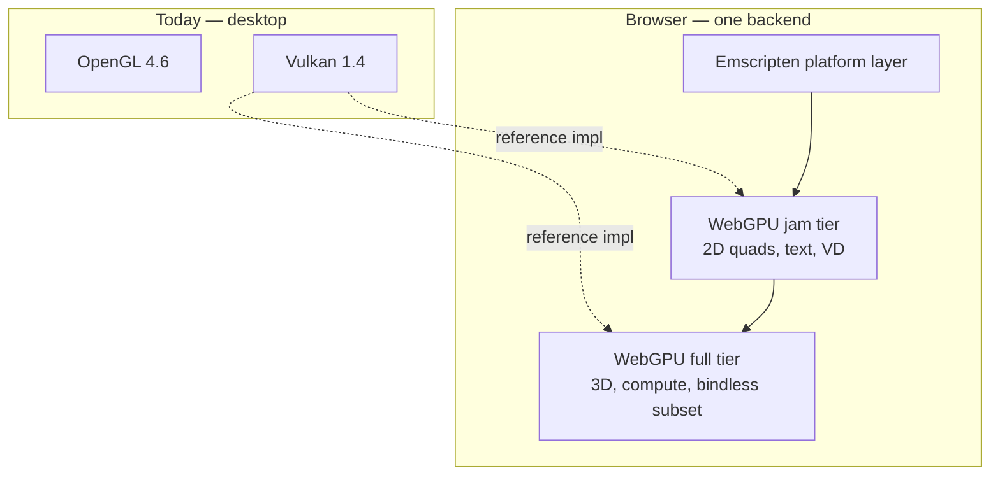
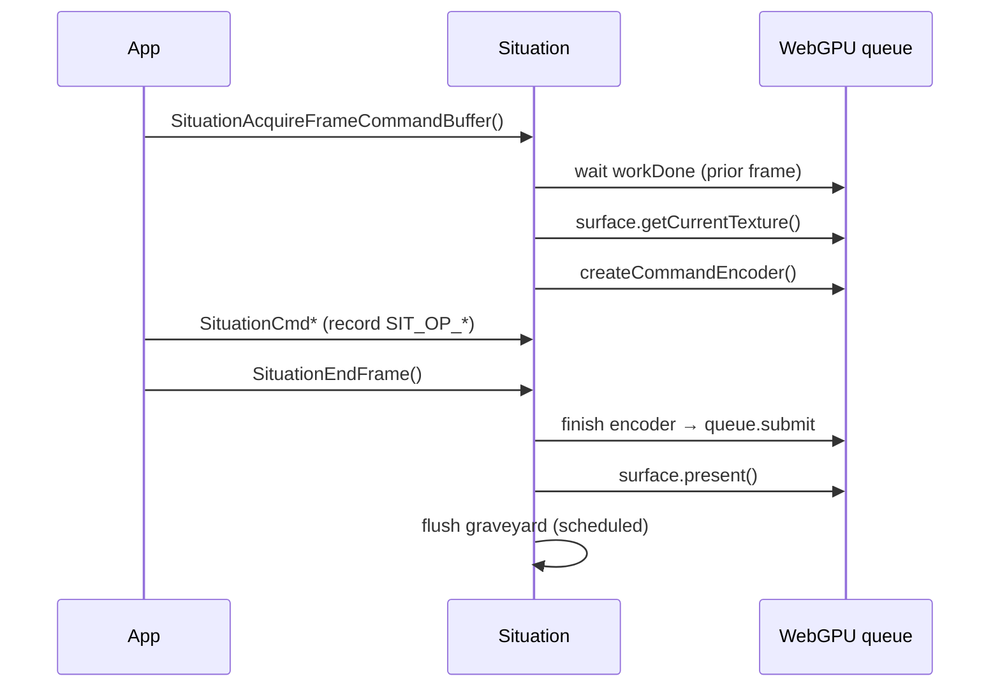
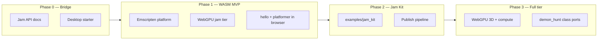

# WASM Game Jam Plan

**Status:** proposed (not started)  
**Scope:** Browser-playable **WebAssembly** builds for Situation-based **game jams** — itch.io-friendly output, minimal API surface for 2D titles, same-source desktop + web targets.  
**Target line:** v2.4.x bridge work + v2.5+ full Web reach (aligns with [ROADMAP.md](../ROADMAP.md) §10 *Web & Reach*).  
**Primary files:** `sit/situation_impl_ctrl.h`, `sit/situation_impl_wdm.h`, `sit/situation_impl_renderer.h`, `sit/situation_impl_input.h`, `sit/situation_impl_audio.h`, `sit/situation_impl_io.h`, `sit/situation_api.h`, `examples/platformer_plumber.c`, `examples/hello_world.c`, `doc/COMPILATION_GUIDE.md`.  
**Related plans:** [ROADMAP.md](../ROADMAP.md) (§10), [COMPILATION_GUIDE.md](../COMPILATION_GUIDE.md), [renderer_bolster_plan.md](renderer_bolster_plan.md).  
**Constraint:** Ship a documented **`SITUATION_JAM_WEB`** profile with explicit supported / degraded / unsupported API lists. **No WebGL backend** — one web renderer only.

---

## How to use this file

1. Read **§ Requirements summary** and **§ Why not WebGL 2** before scoping work.
2. Execute phases in order unless a maintainer explicitly reprioritizes.
3. Phase 1 ships **WebGPU jam tier** (2D only) — not a separate throwaway renderer.
4. Phase 3 expands the **same** WebGPU backend to full tier (3D, compute) — no second web graphics stack.
5. When a phase ships, update `doc/UPDATELOG.md`, `doc/whatsnew.md`, `doc/COMPILATION_GUIDE.md`, and link from `doc/ROADMAP.md` §10.

---

## Requirements summary

| Requirement | Required when? | Notes |
|-------------|----------------|-------|
| **Emscripten platform port** | Phase 1+ | Window, main loop, FS, threading policy, audio wiring, desktop API stubs. |
| **WebGPU backend (`SITUATION_USE_WEBGPU`)** | Phase 1+ | The **only** browser graphics path. Jam tier first (2D), full tier later (3D/compute). |
| ~~WebGL 2 jam profile~~ | **Rejected** | See § Why not WebGL 2. |



**What does *not* work today:** compiling the desktop library with Emscripten and expecting GL 4.6 or Vulkan to run in a browser ([COMPILATION_GUIDE.md](../COMPILATION_GUIDE.md)).

---

## Why not WebGL 2

WebGL 2 was considered as a faster Phase 1 shortcut. **Rejected** for Situation-specific reasons:

| Argument for WebGL 2 | Why it fails here |
|----------------------|-------------------|
| "Reuse the OpenGL backend" | Situation requires **GL 4.6** (DSA, compute, SPIR-V, MDI). WebGL 2 is GLES 3.0 — almost none of the existing GL path transfers. You would write new renderer code anyway. |
| "Ship jams sooner" | You would ship on a **legacy API**, then rewrite the same browser surface for WebGPU. Double cost. |
| "Broader browser support" | WebGPU is supported in current Chrome, Firefox, and Safari. Jam targets are itch.io players on modern browsers — acceptable minimum is WebGPU-capable. |
| "Matches ROADMAP" | [ROADMAP.md](../ROADMAP.md) §10 already names **WebGPU (Dawn)** — not WebGL. |

**Better approach:** Build WebGPU once. Phase 1 implements a **narrow jam tier** (2D draw path only). Phase 3 extends the same backend — pipelines, compute, 3D — rather than replacing it.

**Implementation reference:** Mirror the **Vulkan** command-buffer replay path (`situation_impl_renderer.h`), not OpenGL. WebGPU encoders, bind groups, and pipeline layouts align with Vulkan semantics far more than with WebGL 2.

---

## Product requirement

Jam-based learning depends on **shareable browser builds** (`.wasm` + HTML, static hosting, itch.io).

| Requirement | Engineering implication |
|-------------|-------------------------|
| Low-friction iteration | Small examples, one-screen scope, fast compile/run |
| Jam-shaped workflow | 48–72h titles, keyboard-first, few external deps |
| Shareable artifact | Single-command web build output |
| API continuity | Jam APIs identical on desktop and web; profile macros gate unsupported features |

Reference examples: `examples/platformer_plumber.c` (Phase 1 target), `examples/demon_hunt.c` (Phase 3 target).

---

## Current state audit

| Area | Current state | Gap |
|------|---------------|-----|
| **Platform** | Windows 10+ shipping | No `__EMSCRIPTEN__` platform layer in core `sit/` |
| **Graphics** | OpenGL 4.6 / Vulkan 1.4 desktop only | WebGPU backend — zero implementation today |
| **Windowing** | GLFW desktop | GLFW-emscripten or HTML5 canvas bridge |
| **Audio** | miniaudio (`MA_EMSCRIPTEN` in `ext/miniaudio.h`) | Wire through `SituationInit`; validate Web Audio |
| **Threading** | Generational pool + I/O thread | Jam default: single-thread; `disable_io_thread` exists |
| **I/O** | Loose files, hot-reload | Preload / embed assets |
| **WASM in codebase** | k-term shell Emscripten stub only | No wasm build lane, no web renderer |
| **Roadmap** | §10: Emscripten + WebGPU unchecked | This plan operationalizes §10 |

**Existing hooks:** `disable_io_thread`, miniaudio `MA_EMSCRIPTEN`, unified `SituationCmd*` command buffer (Vulkan path is the WebGPU template).

---

## Architecture: three backends, one web renderer

| Backend | Macro | Target | Status |
|---------|-------|--------|--------|
| OpenGL 4.6 | `SITUATION_USE_OPENGL` | Desktop | Shipped |
| Vulkan 1.4 | `SITUATION_USE_VULKAN` | Desktop | Shipped |
| WebGPU | `SITUATION_USE_WEBGPU` | Browser | **Phase 1** (jam tier) → **Phase 3** (full tier) |

### WebGPU capability tiers (same backend, growing surface)

| Tier | Phase | Command coverage |
|------|-------|------------------|
| **Jam** | 1 | `BeginRenderPass`, clear, viewport/scissor, textured quads, text, virtual display blit, basic blend |
| **Full** | 3 | Indexed/instanced mesh draw, compute dispatch, storage buffers, indirect draw subset, 3D examples |

Do **not** fork `SITUATION_USE_WEBGL2` or maintain parallel web renderers.

Full implementation breakdown: **§ WebGPU support proposal** (below).

### Emscripten platform layer (Phase 1 prerequisite)

| Subsystem | File(s) | Work |
|-----------|---------|------|
| Lifecycle | `situation_impl_ctrl.h` | Init / shutdown under `__EMSCRIPTEN__` |
| Window | `situation_impl_wdm.h` | Canvas, resize, DPI |
| Input | `situation_impl_input.h` | Keyboard, mouse, gamepad |
| Main loop | `situation_impl_ctrl.h` | `emscripten_set_main_loop` |
| Filesystem | `situation_impl_io.h` | Preload VFS / embed |
| Threading | `situation_impl_threading.h` | Single-thread jam default |
| Audio | `situation_impl_audio.h` | `MA_EMSCRIPTEN` |
| Desktop probes | `situation_impl_io.h` | Stubs |

---

## WebGPU support proposal

This section is the **implementation spec** for `SITUATION_USE_WEBGPU` — what to build, which files to touch, how Vulkan maps to WebGPU, and what each tier must ship. Reference backend: **Vulkan deferred path** in `situation_impl_renderer.h` (not OpenGL soft replay).

### WGPU-0 — Preconditions (compile-time plumbing)

Today `situation_api.h` requires exactly one of `SITUATION_USE_OPENGL` or `SITUATION_USE_VULKAN`. WebGPU adds a third mutually exclusive backend.

| Task | File | Work |
|------|------|------|
| WGPU-0.1 | `sit/situation_api.h` | Allow `SITUATION_USE_WEBGPU` as third backend; `#error` if more than one selected |
| WGPU-0.2 | `sit/situation_impl_deps.h` | Include WebGPU headers (`webgpu.h` / `webgpu/webgpu.h` / Dawn) under `#if defined(SITUATION_USE_WEBGPU)`; exclude GLAD, VMA, Vulkan SDK |
| WGPU-0.3 | `sit/situation_impl_ctrl.h` | `_SituationInitRenderer` dispatches `_SituationInitWebGPU` / `_SituationCleanupWebGPU` |
| WGPU-0.4 | `sit/situation_impl_decl.h` | Add `_SituationWebGPUState` to `_SituationRenderState` union (alongside `vk` / `gl`) |
| WGPU-0.5 | `sit/situation_impl_renderer_fwd.h` | Forward declarations for all `_SituationWebGPU*` helpers |
| WGPU-0.6 | `sit/situation_impl_renderer.h` | `#elif defined(SITUATION_USE_WEBGPU)` branches in frame acquire, end frame, resource create/destroy |
| WGPU-0.7 | `sit/situation_impl_vd.h` | VD compositor record path for WebGPU (today `#if VK` / `#elif GL`) |
| WGPU-0.8 | `sit/situation_impl_image.h` | Texture upload / screenshot paths for WebGPU |
| WGPU-0.9 | `sit/situation_impl_wdm.h` | Surface resize → swapchain recreate hook |
| WGPU-0.10 | `sit/situation_impl_input.h` | Cursor/clipboard if tied to GL/VK-only paths |

**New primary module (recommended):** `sit/situation_impl_renderer_webgpu.h` — included from `situation_impl_renderer.h` when `SITUATION_USE_WEBGPU` is set. Keeps the 20k-line renderer file from growing further.

---

### WGPU-1 — Runtime stack (spike decision)

| Option | Pros | Cons | Recommendation |
|--------|------|------|----------------|
| **A: Emscripten `-sUSE_WEBGPU=1`** | Native emsdk integration, canvas surface helpers, ships with wasm link | Tied to emsdk WebGPU maturity; C API via emscripten ports | **Default for Phase 1 spike** |
| **B: Dawn wasm** | Matches ROADMAP “Dawn” wording; desktop-identical WGPU C API | Heavier binary, separate build of Dawn; more moving parts | Fallback if A blocks on surface/device |
| **C: wgpu-native via FFI** | Rust ecosystem | Extra FFI layer; not aligned with Situation C11 kernel | Reject |

**Spike deliverable:** device + queue + canvas surface + one `wgpuSurfacePresent` loop documented in `build/emscripten/README.md`.

---

### WGPU-2 — `_SituationWebGPUState` (proposed fields)

Mirror `_SituationVulkanState` ([`situation_impl_decl.h`](../sit/situation_impl_decl.h) ~L740) with WebGPU equivalents:

| Vulkan concept | WebGPU object | Notes |
|----------------|---------------|-------|
| `VkInstance` / `VkDevice` | `WGPUInstance`, `WGPUDevice`, `WGPUQueue` | Request `texture-compression-bc` etc. only if needed |
| `VkSurfaceKHR` + swapchain | `WGPUSurface` + `WGPUSurfaceConfiguration` | `format` = `BGRA8Unorm` or `RGBA8Unorm` per browser |
| `VkSwapchainKHR` images | `WGPUTexture` swapchain views × N | `MAX_FRAMES_IN_FLIGHT` = 2 (jam); 3 optional full tier |
| `VkCommandPool` / buffers | `WGPUCommandEncoder` per frame | Record all `SIT_OP_*` into one encoder + passes |
| `VkFence` / semaphores | `WGPUQueue.onSubmittedWorkDone` / timeline | Jam tier: blocking `workDone` ok; full tier: async |
| `VkRenderPass` | `WGPURenderPassDescriptor` | Cached per attachment layout (color+depth combo) |
| `VkFramebuffer` | `WGPURenderPassDescriptor` color/depth attachments | No separate FB object |
| `VkPipeline` | `WGPURenderPipeline` / `WGPUComputePipeline` | Jam: 4–6 baked pipelines; full: shader registry |
| `VkDescriptorSet` | `WGPUBindGroup` | Jam: fixed layouts per internal shader |
| `VkBuffer` + VMA alloc | `WGPUBuffer` | Staging via `wgpuQueueWriteBuffer` |
| `VkImage` | `WGPUTexture` + `WGPUTextureView` | Reuse `_SituationTextureSlot` registry |
| Graveyard / deferred destroy | `pending_destroy[]` flushed on `workDone` | Same pattern as Vulkan graveyard |

```c
// Proposed — situation_impl_decl.h (names TBD at implementation)
typedef struct _SituationWebGPUState {
    WGPUInstance instance;
    WGPUDevice device;
    WGPUQueue queue;
    WGPUSurface surface;
    WGPUSurfaceConfiguration surface_config;
    WGPUTextureFormat swapchain_format;
    uint32_t frame_index;
    uint32_t frames_in_flight;          // 2 jam default
    WGPUTexture swapchain_textures[SITUATION_MAX_FRAMES_IN_FLIGHT];
    WGPUTextureView swapchain_views[SITUATION_MAX_FRAMES_IN_FLIGHT];
    WGPUCommandEncoder frame_encoder;   // null outside record window
    bool encoder_open;
    // Internal pipelines (jam tier)
    WGPURenderPipeline pipeline_quad;
    WGPURenderPipeline pipeline_text;
    WGPURenderPipeline pipeline_vd_composite;
    WGPURenderPipeline pipeline_vd_scene;
    WGPUBindGroupLayout bgl_quad;
    WGPUBindGroupLayout bgl_text;
    WGPUBuffer ubo_frame;               // ortho projection, tint, etc.
    // Depth for main pass (if VD/main window uses depth)
    WGPUTexture depth_texture;
    WGPUTextureView depth_view;
    // Graveyard
    _SituationWebGPUGraveyard graveyards[SITUATION_MAX_FRAMES_IN_FLIGHT];
} _SituationWebGPUState;
```

**Registry reuse:** `_SituationTextureSlot`, `_SituationBufferSlot`, `_SituationShaderSlot` stay. Each slot gains WebGPU handles (`WGPUTexture`, `WGPUBuffer`, `WGPUBindGroup`) the way slots today hold `VkImage` / `VkBuffer`.

---

### WGPU-3 — Frame lifecycle (Vulkan parity)

Map to existing three-phase contract ([situation_command_reference.md](../situation_command_reference.md)):



| Step | Vulkan today | WebGPU implementation |
|------|--------------|----------------------|
| Acquire | `vkAcquireNextImageKHR` + wait fence | `wgpuSurfaceGetCurrentTexture` + prior `workDone` |
| Record | `vkCmd*` into `VkCommandBuffer` | `wgpuCommandEncoder*` / `wgpuRenderPassEncoder*` |
| Submit | `vkQueueSubmit` + semaphores | `wgpuQueueSubmit` (1 command buffer jam tier) |
| Present | `vkQueuePresentKHR` | `wgpuSurfacePresent` |
| Resize | `_SituationVulkanRecreateSwapchain` | `_SituationWebGPURecreateSwapchain` on canvas resize |

---

### WGPU-4 — Command replay map (`SIT_OP_*` → WebGPU)

Soft ops are defined in [`situation_impl_decl.h`](../sit/situation_impl_decl.h) (`SIT_OP_BEGIN_RENDER_PASS` … `SIT_OP_COPY_TEXTURE_TO_BUFFER`). Replay happens at `SituationEndFrame` on Vulkan; WebGPU follows the same **record-then-submit** model.

#### Jam tier (Phase 1) — must implement

| `SIT_OP_*` | `SituationCmd*` source | WebGPU action |
|------------|------------------------|---------------|
| `SIT_OP_BEGIN_RENDER_PASS` | `SituationCmdBeginRenderPass` | `beginRenderPass` with load/store from `SituationRenderPassInfo` |
| `SIT_OP_END_RENDER_PASS` | `SituationCmdEndRenderPass` | `end` render pass encoder |
| `SIT_OP_SET_VIEWPORT` | `SituationCmdSetViewport` | `setViewport` |
| `SIT_OP_SET_SCISSOR` | `SituationCmdSetScissor` | `setScissorRect` |
| `SIT_OP_SET_BLEND_ENABLE` | `SituationCmdSetBlendEnable` | pipeline variant or `setBlendConstant` path |
| `SIT_OP_SET_BLEND_FUNC_SEPARATE` | `SituationCmdSetBlendFuncSeparate` | baked blend state in pipeline |
| `SIT_OP_DRAW_QUAD` | `SituationCmdDrawQuad` | internal quad pipeline + global VBO |
| `SIT_OP_DRAW_TEXTURE_YPQ` | `SituationCmdDrawTexture` / YPQ grade | textured quad + optional grade pipeline |
| `SIT_OP_DRAW_TEXT` | `SituationCmdDrawText` | internal text pipeline + glyph atlas bind group |
| `SIT_OP_DRAW_TEXT_EX` | `SituationCmdDrawTextEx` | same + scale/rotation push data |
| `SIT_OP_RENDER_VIRTUAL_DISPLAYS` | VD compositor | composite pass — mirror `_SituationVulkan` VD path |
| `SIT_OP_PRESENT` | swapchain present | implicit in `EndFrame` present |
| `SIT_OP_PUSH_RASTER_STATE` / `POP` | raster stack | jam: cache small state stack CPU-side; rebind pipeline on pop |

#### Jam tier — explicit stubs (return success or `NOT_SUPPORTED` with log)

All other `SIT_OP_*` values: compute, indirect draw, user mesh draw, transfer copy/blit, debug groups, indexed viewport arrays, stencil/depth bias variants beyond VD needs.

#### Full tier (Phase 3) — add incrementally

| Group | `SIT_OP_*` / commands | Priority |
|-------|----------------------|----------|
| **User mesh draw** | `BIND_PIPELINE`, `BIND_VERTEX_BUFFER`, `BIND_INDEX_BUFFER`, `DRAW`, `DRAW_INDEXED`, `DRAW_MESH` | P0 for 3D examples |
| **Descriptors** | `BIND_DESCRIPTOR_SET`, `SET_PUSH_CONSTANT`, `BIND_TEXTURE_SET` | P0 |
| **Compute** | `BIND_COMPUTE_PIPELINE`, `DISPATCH`, `DISPATCH_INDIRECT` | P1 — `mandelbrot`, `gpu_particle_simulation` |
| **Barriers** | `PIPELINE_BARRIER`, `BUFFER_BARRIER`, `TEXTURE_BARRIER` | P1 — map to `renderPass`/`compute` visibility + `queue.writeTexture` ordering |
| **Transfer** | `COPY_BUFFER`, `COPY_TEXTURE`, `BLIT_TEXTURE`, buffer↔texture | P2 |
| **Indirect** | `DRAW_INDIRECT`, `DRAW_INDEXED_INDIRECT` | P2 — if WebGPU feature `indirect` available |
| **Debug** | `BEGIN_DEBUG_GROUP`, `END_DEBUG_GROUP` | P3 |

Track coverage in a matrix file: `doc/plan/WASM_WEBGPU_COMMAND_MATRIX.md` (create at Phase 1 start).

---

### WGPU-5 — Internal shaders (jam tier)

Vulkan compiles embedded GLSL → SPIR-V at init via shaderc (`_SituationVulkanInitInternalRenderers`). WebGPU jam tier **does not use shaderc at runtime** — ship **prebuilt WGSL** (or SPIR-V → `naga` at build time).

| Internal pipeline | GLSL source today (`situation_impl_decl.h`) | WebGPU deliverable |
|-------------------|---------------------------------------------|-------------------|
| Quad | `SIT_QUAD_VERTEX_SHADER` / `SIT_QUAD_FRAGMENT_SHADER` | `shaders/webgpu/quad.wgsl` |
| Text | `SIT_TEXT_VERTEX_SHADER` / `SIT_TEXT_FRAGMENT_SHADER` | `shaders/webgpu/text.wgsl` |
| VD scene | `SIT_VD_*_SHADER_SRC` | `shaders/webgpu/vd_scene.wgsl` |
| VD composite | `SIT_COMPOSITE_*_SHADER_SRC` | `shaders/webgpu/vd_composite.wgsl` |
| YPQ grade (optional jam) | `SIT_YPQ_GRADE_FRAGMENT_SHADER` | `shaders/webgpu/ypq_grade.wgsl` |

**Build-time step (proposed):**

```bash
# Option 1: hand-write WGSL for jam tier (fastest spike)
# Option 2: naga CLI SPIR-V → WGSL from existing internal SPIR-V blobs
naga spv quad.vert.spv --stage vertex   > shaders/webgpu/quad.wgsl
```

**Init function:** `_SituationWebGPUInitInternalRenderers()` — mirrors `_SituationVulkanInitInternalRenderers` ([`situation_impl_renderer.h`](../sit/situation_impl_renderer.h) ~L5223):

- [ ] Create bind group layouts (frame UBO, texture sampler at binding 0/1)
- [ ] Create render pipelines from WGSL modules
- [ ] Upload quad VBO + text glyph atlas default
- [ ] Register internal `SituationShader` handles if full tier needs them; jam tier may use opaque internal slots

---

### WGPU-6 — Resource creation path

| API | Vulkan path today | WebGPU work |
|-----|-------------------|-------------|
| `SituationCreateTexture` / `Ex` | `VkImage` + view + sampler | `wgpuDeviceCreateTexture` + view; format map from `SituationColorEncoding` |
| `SituationUpdateBuffer` | staging + `vkCmdCopyBuffer` | `wgpuQueueWriteBuffer` (jam) or staging buffer copy (full) |
| `SituationCreateBuffer` | VMA `VkBuffer` | `wgpuDeviceCreateBuffer` with `MapWrite` / `CopyDst` usage |
| `SituationLoadShader` (user) | SPIR-V + `VkPipeline` | **Phase 3** — WGSL module registry; jam tier returns `NOT_SUPPORTED` |
| `SituationCreateMesh` | VBO + IBO + pipeline | **Phase 3** |
| Font atlas bake | `SituationBakeFontAtlas` | Upload atlas to `WGPUTexture`; same CPU path |

**Format mapping (initial):**

| `SituationColorEncoding` | WebGPU format |
|--------------------------|---------------|
| `SITUATION_COLOR_LINEAR` | `WGPUTextureFormat_RGBA8Unorm` |
| `SITUATION_COLOR_SRGB` | `WGPUTextureFormat_RGBA8UnormSrgb` |

---

### WGPU-7 — Virtual Display compositor

VD is critical for jam examples (`platformer_plumber` may render to VD). Today split across `situation_impl_vd.h` + renderer.

| Component | Work |
|-----------|------|
| VD offscreen color target | `WGPUTexture` per `SituationVirtualDisplay` — same size/policy as VK RGBA8 |
| VD depth | Optional jam — match VK “depth always on” or simplify jam profile to color-only |
| `SituationCmdBeginRenderPass` to VD | Render pass targeting VD texture view |
| `SIT_OP_RENDER_VIRTUAL_DISPLAYS` | Composite pass: sample VD textures → main swapchain; port `_SitVulkanApplyVDCompositingDynamicState` logic |
| Scaling modes | Integer / fit / stretch — same CPU rect math; GPU full-screen triangle |

---

### WGPU-8 — Barriers and layouts (full tier)

Vulkan uses `SituationCmdTextureBarrier` with explicit layouts. WebGPU uses **usage flags** + pass boundaries.

| Vulkan layout / access | WebGPU strategy |
|------------------------|-----------------|
| `TRANSFER_DST` | `TextureUsageCopyDst` + write before render pass |
| `SHADER_READ` | `TextureUsageTextureBinding` |
| `COLOR_ATTACHMENT` | `TextureUsageRenderAttachment` |
| `STORAGE` | `TextureUsageStorageBinding` (compute tier) |
| `pipelineBarrier` | Split: render pass load/store + `queue.submit` ordering; avoid explicit barrier until needed |

Implement `_SituationWebGPUTextureBarrier` as usage/queue transition helper in Phase 3 — not Phase 1.

---

### WGPU-9 — Work packages & sequencing

| ID | Package | Depends | Phase | Est. |
|----|---------|---------|-------|------|
| WP-1 | Compile plumbing (WGPU-0) | — | 1 | 3–5 d |
| WP-2 | Device/surface/swapchain + clear screen | WP-1, Emscripten WDM | 1 | 5–7 d |
| WP-3 | Frame encoder + begin/end pass | WP-2 | 1 | 3–5 d |
| WP-4 | Internal quad WGSL + `SIT_OP_DRAW_QUAD` | WP-3 | 1 | 3–5 d |
| WP-5 | Texture upload + `DrawTexture` | WP-4 | 1 | 5–7 d |
| WP-6 | Text pipeline + font atlas | WP-5 | 1 | 5–7 d |
| WP-7 | VD offscreen + composite | WP-5 | 1 | 7–10 d |
| WP-8 | `hello_world` + `platformer_plumber` green | WP-6, WP-7 | 1 | 5 d |
| WP-9 | User mesh + bind groups + indexed draw | WP-8 | 3 | 2–3 wk |
| WP-10 | Compute dispatch + storage textures | WP-9 | 3 | 2 wk |
| WP-11 | Barriers + copy/blit commands | WP-9 | 3 | 2 wk |
| WP-12 | `demon_hunt` shader path subset | WP-9–11 | 3 | 3–4 wk |

**Phase 1 exit = WP-8 complete.** Phase 3 exit = WP-9–12 per example scope gate.

---

### WGPU-10 — Testing & validation

| Layer | Approach |
|-------|----------|
| **Smoke** | `emrun` + canvas pixel readback (1×1 probe) after clear |
| **Harness** | New `tests/harness/test_webgpu_jam.c` — begin pass, draw quad, end frame; run under wasm or native Dawn if available |
| **Visual** | Screenshot compare vs desktop GL for `hello_world` text layout (manual Phase 1) |
| **CI** | Headless wasm build compile-only until GPU runner exists |

Defer `sit_test.exe` full module parity on wasm until Phase 3.

---

### WGPU-11 — Explicit non-goals

| Non-goal | Reason |
|----------|--------|
| WebGL 1/2 backend | Legacy; rejected (§ Why not WebGL 2) |
| Runtime shaderc on wasm | Heavy; jam uses prebuilt WGSL |
| Bindless / descriptor indexing | Desktop VK feature; WebGPU limits differ — Phase 3+ research |
| Multi-window / multi-surface | Desktop WDM; browser = single canvas Phase 1 |
| OpenGL or Vulkan on web | Impossible in browser without translation layers |
| Feature parity with `SITUATION_USE_VULKAN` on day one | Jam tier first; full tier tracked in command matrix |

---

### WGPU-12 — Open decisions (resolve in spike)

- [ ] Emscripten `USE_WEBGPU` C API vs Dawn native wasm link?
- [ ] WGSL hand-written vs `naga` from existing internal SPIR-V?
- [ ] Jam tier: depth buffer on main pass or color-only simplify?
- [ ] `BGRA8Unorm` vs `RGBA8Unorm` swapchain — detect from `surface.getCapabilities()`?
- [ ] Store WGSL as embedded strings vs separate files loaded from MEMFS?

---

## Design principles

1. **One web renderer** — WebGPU only; no WebGL detour.
2. **Vulkan-shaped WebGPU** — implement against command-buffer semantics, not GL immediate mode.
3. **Jam slice first** — ~30 APIs documented for Phase 1; grow with tier expansion.
4. **Same source, profile macros** — desktop `SITUATION_USE_OPENGL` / `SITUATION_USE_VULKAN` vs web `SITUATION_USE_WEBGPU`.
5. **Single-thread default** — `SITUATION_JAM_WEB` safe init defaults.
6. **Preserve frame contract** — poll → update → acquire cmd → `SituationEndFrame`.

---

## Compile profiles

### `SITUATION_JAM_WEB`

| Setting | Value |
|---------|-------|
| `SITUATION_JAM_WEB` | Defined before `#include "situation.h"` |
| `SITUATION_USE_WEBGPU` | Browser graphics backend |
| `init_info.disable_io_thread` | `true` |
| `init_info.hot_reload_poll_rate` | `0.0` |

### Jam tier (Phase 1) — supported

- Keyboard / mouse / gamepad
- `SituationCmdDrawQuad`, text, virtual display compositing
- Tone pool, loaded SFX, simple BGM
- Timers, oscillators, FPS limiter
- Embedded / preloaded assets

### Jam tier — disabled or stubbed

- Hot-reload, PortMidi, k-term shell, DXGI, process enumeration
- Desktop GL / Vulkan backends
- Compute, indirect draw, bindless, advanced barriers (Phase 3)

---

## Phased delivery



---

## Phase 0 — Desktop jam bridge

**Goal:** Documentation and starter curation on desktop while web infrastructure is built.  
**Duration:** 1–2 weeks.

### Deliverables

- [ ] `doc/JAM_QUICK_START.md`
- [ ] `doc/JAM_API_SLICE.md` — tag symbols: desktop / web jam tier / web full tier
- [ ] Jam starter: `examples/platformer_plumber.c` or `examples/jam_starter.c`

### Exit criteria

- [ ] `platformer_plumber` builds on Windows from documented commands.
- [ ] API slice reviewed; no false web-support claims.

---

## Phase 1 — WASM MVP (Emscripten + WebGPU jam tier)

**Goal:** `hello_world` and `platformer_plumber` playable in a WebGPU-capable browser.  
**Duration:** 6–10 weeks (honest — WebGPU from scratch is heavier than a WebGL shim, but not throwaway).  
**Does not include:** Full-tier compute, 3D mesh pipeline, pthread pool.

### 1.0 — Spike (week 1–2, gate before bulk impl)

- [ ] Choose runtime: **Emscripten WebGPU** vs **Dawn wasm** — record decision.
- [ ] Choose shader path: WGSL hand-written vs SPIR-V → `naga` vs GLSL → `tint`.
- [ ] Prove: clear screen → one textured quad on canvas via `SituationCmd*` or thinnest wrapper.
- [ ] Document minimum browser matrix from spike results.

### 1.1 — Toolchain & layout

- [ ] Pin Emscripten SDK + WebGPU flags in `doc/COMPILATION_GUIDE.md`.
- [ ] `build/emscripten/Makefile`, `build_wasm.bat`.
- [ ] `web/shell.html` — canvas, WebGPU adapter request, click-to-start audio, focus trap.

### 1.2 — Emscripten platform layer

- [ ] Init / shutdown, WDM canvas, input, main loop, preload FS, IO stubs (see architecture table).

### 1.3 — `SITUATION_JAM_WEB` init defaults

- [ ] Centralize in `situation_impl_ctrl.h`; document in SDK + compilation guide.

### 1.4 — WebGPU jam tier

- [ ] Device / queue / swapchain lifecycle.
- [ ] Map jam-tier `SituationCmd*`: begin/end pass, clear, viewport, scissor, draw quad, draw text, VD composite.
- [ ] Texture upload path (staging buffer → `wgpuQueueWriteTexture`).
- [ ] Frame sync (surface present, basic error scope).
- [ ] Publish explicit unsupported list for jam tier.

### 1.5 — Audio

- [ ] `MA_EMSCRIPTEN` through `SituationInit`; platformer BGM/SFX after user gesture.

### 1.6 — Example targets

- [ ] `examples/hello_world.c` — web target.
- [ ] `examples/platformer_plumber.c` — web target + asset preload.

### Exit criteria

| Check | Pass |
|-------|------|
| Build | One command → `index.html` + `.wasm` + `.js` |
| GPU | Runs on WebGPU-capable Chrome/Firefox/Safari |
| Play | Platformer move + jump |
| Audio | Audible after click-to-start |
| No WebGL | Zero `SITUATION_USE_WEBGL2` / WebGL context code |

---

## Phase 2 — Jam Kit

**Goal:** Repeatable clone → build → publish workflow.  
**Duration:** 4–6 weeks after Phase 1.

### Deliverables

- [ ] `examples/jam_kit/` — starter, assets, `build_web.sh`, `index.html`, README.
- [ ] Asset pipeline, itch.io publish guide, troubleshooting (autoplay, focus, memory).
- [ ] Additional ports: `shapes.c`, `tone_test.c` subset.

### Exit criteria

- [ ] Fresh clone → itch.io upload in &lt; 4 hours (dry run).

---

## Phase 3 — WebGPU full tier (v2.5+)

**Goal:** Near-desktop graphics in browser; closes [ROADMAP.md](../ROADMAP.md) §10.  
**Prerequisite:** Phase 1 WebGPU jam tier stable — **extend, do not replace**.

### Tasks

- [ ] Expand `SituationCmd*` coverage: mesh draw, compute dispatch, storage buffers, barriers.
- [ ] Shader pipeline for user/custom shaders (WGSL module registry).
- [ ] Optional pthread pool + COOP/COEP hosting docs.
- [ ] Port `demon_hunt.c`-class examples.
- [ ] Wasm harness subset for web profiles.

### Exit criteria

- [ ] ROADMAP §10 complete; capability matrix full tier **supported**.

---

## Capability matrix

| Feature | Desktop | Web jam tier (Ph 1) | Web full tier (Ph 3) |
|---------|---------|---------------------|----------------------|
| 2D platformer / arcade | Yes | **Target** | Yes |
| Keyboard / mouse | Yes | **Target** | Yes |
| Simple audio | Yes | **Target** | Yes |
| Virtual display composite | Yes | **Target** | Yes |
| Hot-reload | Yes | No | Partial |
| Thread pool | Yes | No | Optional |
| GL 4.6 / Vulkan 1.4 | Yes | N/A | N/A |
| Compute shaders | Yes | No | **Target** |
| `demon_hunt`-class 3D | Yes | No | **Target** |
| WebGL fallback | N/A | **No** | **No** |

---

## Timeline

| Window | Milestone | Deliverable |
|--------|-----------|-------------|
| Weeks 1–2 | Phase 0 | Jam docs + desktop starter |
| Weeks 3–4 | Phase 1 spike | WebGPU quad proof + toolchain decision |
| Weeks 5–10 | Phase 1 impl | Emscripten platform + jam tier + platformer in browser |
| Weeks 11–14 | Phase 2 | `examples/jam_kit/` |
| v2.5+ | Phase 3 | Full WebGPU tier, 3D ports |

---

## Risks & mitigations

| Risk | Impact | Mitigation |
|------|--------|------------|
| WebGPU Phase 1 takes longer than a WebGL shim | Later first browser build | Accept longer Phase 1; avoid throwaway WebGL rewrite |
| Shader translation (GLSL/SPIR-V → WGSL) | Blocker for text/quad pipelines | Week 1–2 spike; hand-write jam WGSL if converter path fails |
| Browser WebGPU variance | Safari/FF edge cases | Spike defines minimum matrix; document unsupported combos |
| No filesystem on web | Asset failures | Preload manifest in jam kit |
| Audio autoplay | Silent games | Click-to-start in shell HTML |
| Scope creep (531 APIs) | Never ships | `JAM_API_SLICE` + jam tier gate |

---

## Documentation updates (on ship)

- [ ] `doc/UPDATELOG.md`
- [ ] `doc/whatsnew.md`
- [ ] `doc/COMPILATION_GUIDE.md` — Emscripten + `SITUATION_USE_WEBGPU`
- [ ] `doc/ROADMAP.md` §10 — link here; check tasks
- [ ] `README.md` — web status (WebGPU, no WebGL)

---

## Open questions

- [ ] Emscripten built-in WebGPU vs Dawn wasm build?
- [ ] WGSL: hand-written jam shaders vs SPIR-V/`naga` vs GLSL/`tint`?
- [ ] GLFW-emscripten vs direct canvas for WDM?
- [ ] Embed assets vs `--preload-file` default for jam kit?
- [ ] Pthreads in Phase 1 or Phase 3 only?
- [ ] Minimum browser versions after spike?

---

## Emscripten build blueprint

**Status of this section:** The plan above is strategic (phases, architecture, tiers). This section is the **procedural** complement — how to get Situation to compile and link under Emscripten. Commands are **proposed** until the Phase 1 spike produces a green build; update flags here when the spike lands.

### What the plan was missing (honest audit)

| Present today | Missing until this section / spike |
|---------------|----------------------------------|
| Phase checklist (“add `build/emscripten/Makefile`”) | Concrete `emcc` invocation |
| Subsystem port table (`ctrl`, `wdm`, …) | Dependency include/exclude matrix |
| `SITUATION_JAM_WEB` macro list | Ordered “first green compile” stub strategy |
| “Pin SDK in COMPILATION_GUIDE” | EMSDK install + env activation steps |

**You cannot run `emcc` on Situation today and expect success.** Desktop GL/Vulkan paths, Win32 APIs, and unported subsystems will fail immediately. Build work is **stub-first**, then **enable subsystems**.

---

### 0 — Toolchain setup

```bash
# Install emsdk (once per machine)
git clone https://github.com/emscripten-core/emsdk.git
cd emsdk
./emsdk install latest    # pin exact version in COMPILATION_GUIDE after spike
./emsdk activate latest
source ./emsdk_env.sh     # Windows: emsdk_env.bat

emcc --version            # must succeed before any Situation wasm work
```

**Pin after spike:** record `EMSCRIPTEN_VERSION` in `doc/COMPILATION_GUIDE.md` and `build/emscripten/emsdk.version`.

---

### 1 — Build model (same as desktop examples)

Situation ships **header-only + one implementation TU**. Web builds follow **Model 2** from [COMPILATION_GUIDE.md](../COMPILATION_GUIDE.md):

```c
// examples/hello_world.c (or jam main.c) — single translation unit
#define SITUATION_IMPLEMENTATION
#define SITUATION_JAM_WEB
#define SITUATION_USE_WEBGPU
#include "situation.h"
```

- **Do not** try to emit a `situation_webgpu.dll` equivalent first.
- **Do** compile `example.c` + entire Situation impl into one `.wasm` module (same pattern as `build_examples.bat`, but `emcc` instead of `gcc`).

**Output layout (target):**

```
build/emscripten/
  hello_world/
    index.html      # from web/shell.html + --shell-file
    hello_world.js  # glue
    hello_world.wasm
```

---

### 2 — Dependency matrix for Emscripten

| Dependency | Desktop | Emscripten jam build | Action |
|------------|---------|----------------------|--------|
| **cglm** | Headers only | Headers only | Keep `-Iext/cglm/include` |
| **stb_*** | Embedded in impl | Same | No change |
| **miniaudio** | Embedded | `MA_EMSCRIPTEN` path | Ensure `__EMSCRIPTEN__` defined; link Web Audio via emcc |
| **GLFW** | `libglfw3` | GLFW emscripten port **or** drop for Phase 1 spike | Build `ext/glfw` with `emcmake`, **or** stub WDM until canvas-only path works |
| **GLAD / OpenGL** | Desktop GL backend | **Exclude** | `SITUATION_USE_OPENGL` off |
| **Vulkan SDK / VMA** | Desktop VK backend | **Exclude** | `SITUATION_USE_VULKAN` off |
| **shaderc** | Vulkan runtime compile | **Exclude** jam tier | No `SITUATION_ENABLE_SHADER_COMPILER`; jam WGSL offline |
| **PortMidi** | Optional MIDI | **Exclude** | `#ifdef` stub in jam profile |
| **FFmpeg** | Video ext | **Exclude** | Not in jam slice |
| **tinycthread** | Thread pool | **Exclude** or single-thread | `SITUATION_JAM_WEB` + `disable_io_thread`; no worker threads Phase 1 |
| **WebGPU** | N/A | **Required** | `-sUSE_WEBGPU=1` (or Dawn wasm — spike decides) |

---

### 3 — Proposed `emcc` command (jam / hello_world)

Template — **not verified** until spike. Adjust when first compile fails.

```bash
emcc examples/hello_world.c \
  -o build/emscripten/hello_world/index.html \
  -I. -Iext -Iext/cglm/include -Iext/glfw/include \
  -DSITUATION_IMPLEMENTATION \
  -DSITUATION_JAM_WEB \
  -DSITUATION_USE_WEBGPU \
  -sUSE_WEBGPU=1 \
  -sALLOW_MEMORY_GROWTH=1 \
  -sEXPORTED_RUNTIME_METHODS='["ccall","cwrap"]' \
  --shell-file web/shell.html \
  -O2
```

**With assets (platformer):**

```bash
  --preload-file examples/assets@/assets
```

**Phase 1 default:** no pthreads. Do **not** add `-sUSE_PTHREADS=1` until Phase 3 and COOP/COEP hosting is documented.

**If using GLFW emscripten** (optional — open question):

```bash
emcmake cmake -B build/emscripten/glfw -S ext/glfw \
  -DGLFW_BUILD_WASM=ON   # exact flag TBD per GLFW version
# then -Lbuild/emscripten/glfw/src -lglfw3
```

---

### 4 — First green compile strategy (ordered)

Do not attempt a full Situation port in one step. Order:

| Step | Goal | Typical blockers |
|------|------|------------------|
| **4a** | Empty `main()` → `.wasm` + shell HTML | EMSDK path, shell file |
| **4b** | `SituationInit` returns success with **all render/audio/thread stubs** | Win32 includes, GLFW, Vulkan/GL init |
| **4c** | WebGPU init: clear framebuffer one color | No `SITUATION_USE_WEBGPU` impl yet — spike here |
| **4d** | Input poll + `SituationWindowShouldClose` loop via `emscripten_set_main_loop` | Desktop `main()` while-loop |
| **4e** | Jam-tier draw: quad + text | WGSL pipelines, texture upload |
| **4f** | miniaudio `MA_EMSCRIPTEN` + one `SituationPlayTone` | User-gesture unlock in shell |
| **4g** | `platformer_plumber.c` with `--preload-file` | Asset paths, remaining API gaps |

**Stub rule:** Under `#if defined(SITUATION_JAM_WEB) && defined(__EMSCRIPTEN__)`, return `SITUATION_SUCCESS` or no-op for desktop-only APIs until the subsystem is ported. Track stubs in a checklist inside `situation_impl_ctrl.h` / per-module comments.

---

### 5 — Code changes required before `emcc` succeeds

These are **minimum** ports — the plan’s Phase 1.2 broken into compile-blocking items:

#### 5.1 — `situation_impl_ctrl.h`

- [ ] Guard or replace desktop-only init (Win32 DXGI, process enum, exclusive WASAPI).
- [ ] Replace blocking `while (!ShouldClose())` expectation: export frame fn for `emscripten_set_main_loop`.
- [ ] Apply `SITUATION_JAM_WEB` defaults (`disable_io_thread`, `hot_reload_poll_rate = 0`).

#### 5.2 — `situation_impl_wdm.h`

- [ ] Canvas-backed window create (WebGPU surface).
- [ ] `SituationPollInputEvents` via GLFW-emscripten or EMS HTML5 API.
- [ ] Stub multi-monitor / DXGI queries.

#### 5.3 — `situation_impl_renderer.h` (+ new WebGPU module)

- [ ] Add `#elif defined(SITUATION_USE_WEBGPU)` backend branch.
- [ ] Jam tier only: pass begin/end, clear, viewport, scissor, draw quad, draw text, VD blit.
- [ ] Ensure GL and Vulkan paths are **not** compiled when `SITUATION_USE_WEBGPU` is set.

#### 5.4 — `situation_impl_threading.h`

- [ ] Jam web: `SituationCreateThreadPool` no-op or single-thread inline execution.
- [ ] Do not spawn `io_thread` when `disable_io_thread` + `__EMSCRIPTEN__`.

#### 5.5 — `situation_impl_io.h`

- [ ] Map `SituationLoadFile` / paths to MEMFS / preload VFS.
- [ ] Stub `SituationGetProcessList`, drive queries, shell open.

#### 5.6 — `situation_impl_audio.h`

- [ ] Select miniaudio Emscripten backend (`MA_EMSCRIPTEN`).
- [ ] Disable or stub PortMidi includes.

#### 5.7 — Build scripts (repo artifacts)

- [ ] `build/emscripten/Makefile` — targets: `hello_world`, `platformer_plumber`.
- [ ] `build_wasm.bat` — Windows wrapper calling `emcc` with same flags.
- [ ] `web/shell.html` — canvas, WebGPU adapter request, click-to-start, keyboard focus.

---

### 6 — Verify loop

```bash
# Build
./build_wasm.bat hello_world        # or make -C build/emscripten hello_world

# Serve (Python example)
cd build/emscripten/hello_world && python -m http.server 8080

# Or
emrun --browser chrome build/emscripten/hello_world/index.html
```

**Pass:** browser console has no uncaught Emscripten abort; canvas shows cleared color (4c) then quad (4e).

---

### 7 — Where docs live after spike

| Doc | Content |
|-----|---------|
| **This plan** | Strategic phases + blueprint (update flags in §3 when green) |
| **`doc/COMPILATION_GUIDE.md`** | Canonical EMSDK pin, full flag reference, troubleshooting |
| **`examples/jam_kit/README.md`** | Copy-paste build for jammers (Phase 2) |

Until the spike completes, **`COMPILATION_GUIDE.md` has no Emscripten section** — that is expected.
