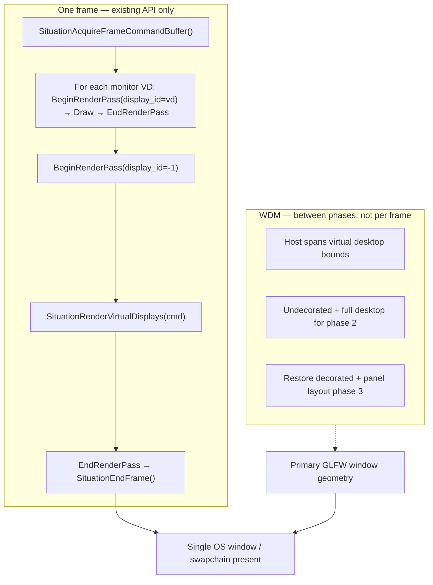

# Renderer Bolster Plan

**Status:** in progress (**Phase 11 foundation shipped v2.4.188**. **VD bolster v2.4.x:** VD-1, VD-4a, VD-2, VD-3, VD-5 committed; **VD-4b MSAA gated** — v2.5 default unless scope gate passes. **Phase 6 closed v2.4.187**. **Phase 11-bis multi-monitor VD presentation — design only; no implementation without maintainer consent.**)  
**Scope:** command-buffer, render-pass, synchronization, copy/blit, indirect draw, raster-state, Virtual Display target control, **multi-monitor presentation via WDM + VD compositing (v2.4.x)**, and query API hardening for the existing OpenGL 4.6 / Vulkan 1.4 renderer stack.  
**Target line:** v2.4.x worksheet; keep coordinated with v2.5 planning, but do not treat this as the v2.5 boundary.  
**Primary files:** `sit/situation_api.h`, `sit/situation_impl_decl.h`, `sit/situation_impl_renderer.h`, `sit/situation_impl_vd.h`, **`sit/situation_impl_wdm.h`**, `sit/situation_base_trace.h`, `tests/harness/test_graphics.c`, `tests/harness/test_virtual_display.c`, **`tests/harness/test_advanced.c`**, `tests/harness/test_compute.c` (Phase -1 pilot), `tests/harness/test_transfer.c` (Phase 4.1 pilot).  
**Related plans:** `doc/plan/v2.5-api-expansion.md`, `doc/plan/RENDERER_AUDIT_PLAN.md`, `doc/plan/TEST_HARNESS_GRAPHICS_UPGRADE.md`, `doc/plan/VD_EXTRACTION_PLAN.md`.  
**Constraint:** keep Situation's public API backend-neutral; tag exceptions as `[GL only]`, `[VK only]`, or `[deferred]`.

---

## How to use this file

1. Execute phases in order, starting with Phase -1, unless a maintainer explicitly reprioritizes.
2. Treat signatures as proposals until implemented; keep final public declarations in `situation_api.h` as single-line `SITAPI` entries with EOL comments.
3. Every shipped command must have both a public API entry and backend behavior documented here.
4. Every command-buffer feature needs OpenGL and Vulkan tests unless explicitly tagged `[backend-specific]`.
5. When a phase ships, add/update `doc/UPDATELOG.md`, `doc/whatsnew.md`, and any relevant API docs.
6. **No rogue implementation:** do not add parallel frame lifecycles, auxiliary GLFW/GL presentation paths, or test-only renderer bypasses. New work must extend the existing **`AcquireFrameCommandBuffer` → command buffer → `SituationEndFrame`** contract unless a phase is explicitly approved and documented here first.

---

## Current state audit

The command stack is stronger than the initial gap list implies, but uneven. Some primitives already exist, while others are hidden behind render-pass setup or internal helpers.

| Area | Current state | Gap |
|------|---------------|-----|
| Render-pass clears | `SituationRenderPassInfo` already has `color_attachment`, `depth_attachment`, `stencil_attachment`, `loadOp`, `storeOp`, and `clear`. OpenGL honors color/depth clear on `SIT_OP_BEGIN_RENDER_PASS`; Vulkan passes `VkClearValue`s into `vkCmdBeginRenderPass`. | No standalone recorded clear command. OpenGL path does not visibly clear stencil in the begin-pass code path. Docs/readme do not make clear-values discoverable enough. |
| Compute dispatch | `SituationCmdDispatch` exists and maps to `SIT_OP_DISPATCH` / `glDispatchCompute` / `vkCmdDispatch`. | No `SituationCmdDispatchIndirect`; dispatch API returns `void` despite invalid command/pipeline cases being possible. |
| Barriers | `SituationCmdPipelineBarrier(cmd, src_flags, dst_flags)` exists; `SituationMemoryBarrier` is deprecated. OpenGL maps to `glMemoryBarrier`; Vulkan builds stage/access masks. | Barrier model is flag-only and underspecified for resource/image layout transitions, transfer usage, indirect commands, render target transitions, and compute -> graphics cases. |
| Buffer copy | `SituationCmdCopyBuffer` exists and records `SIT_OP_COPY_BUFFER` / `glCopyBufferSubData` / `vkCmdCopyBuffer`. | Only one offset and one size; no source/destination offset split; no typed error result; no buffer -> texture or texture -> buffer command. |
| Texture copy/blit | Public texture copy/blit plus `SituationCmdCopyBufferToTexture` / `SituationCmdCopyTextureToBuffer` for matching RGBA8 color 2D textures with explicit barriers. | Depth/stencil, array layers beyond layer 0, and buffer-row pitch on upload deferred or partial. |
| Indirect drawing | OpenGL internally uses MDI (`glMultiDrawArraysIndirect`, `glMultiDrawElementsIndirect`) to batch normal draw calls. Internal GL command structs are named `_SituationGLDraw*IndirectCommand`. | No public `SituationCmdDrawIndirect`, `SituationCmdDrawIndexedIndirect`, or indirect count/multi variants. Vulkan public path lacks matching command exposure. |
| Raster state | **Phase 6 closed (v2.4.187).** Public fixed-function raster commands through stencil, push/pop (**`SITUATION_MAX_RASTER_STACK_DEPTH` 256**), line width, color mask, polygon mode, depth bias, front face, topology. GL soft replay + VK dynamic state / pipeline variants. Harness **434/434** GL, **424/424** VK (GTX 1070). | **`SituationCmdSetMultisampleState`** stub only — **`NOT_IMPLEMENTED`** until **v2.5 render-target Phase 6** (MSAA surfaces + resolve). Not part of bolster Phase 6 closure. |
| Index buffer | `SituationCmdBindIndexBuffer(cmd, buffer, offset)` exists and is documented as 32-bit only. | No `SituationIndexType`; 16-bit indices are impossible through the public command stack. |
| Viewports | `SituationCmdSetViewport` and `SituationCmdSetScissor` exist for one viewport/scissor. | No indexed viewport/scissor array for future multi-viewport. |
| Push constants | `SituationCmdSetPushConstant` and `SituationCmdSetPushConstantData` exist, but the GL path marks `SIT_OP_SET_PUSH_CONSTANT_DATA` as not implemented. | API is still raw: no named range/layout metadata, unclear layout contracts, and mixed contract-id vs shader/offset forms. |
| Queries | Draw count/latency/histogram APIs exist at a high level. | No recorded timestamp or occlusion query commands. No query pool/result API. |
| Render target model | Virtual displays are the composited offscreen abstraction. **Compositing** (blend, opacity, z-order, visibility, scaling, offset) is largely **shipped**. **Attachment / quality / HDR** policy is **fixed at create** (linear RGBA8, depth always on, VK load/store baked, filter from scaling). See **§ Phase 11 — Virtual Display bolster** taxonomy. | Full VD configuration surface: attachment control, quality, compositing sampler, performance hints, advanced resolve/usage (v2.5). General **`SituationRenderTarget`** for non-composited offscreen deferred to v2.5. |
| Test harness layout | `test_compute.c` owns dispatch/barriers; `test_transfer.c` owns Phase 4 copy/blit/barrier command tests (Phase 4.1); `test_virtual_display.c` owns VD API/compositing/scaling/blend (**21** tests, post–v2.4.173 Unreleased). `test_graphics.c` keeps draw/raster/SPIR-V interop coverage. **`test_advanced.c`** holds multi-monitor **spanning-host + multi-VD** integration (design: **Phase 11-bis**). | Further splits (e.g. raster-only) deferred until module count stays manageable. True **per-monitor OS window** presentation deferred to **v2.5 multi-present** (see **Phase 11-bis Tier B**). |

---

## Design principles

- **Command-buffer first:** anything affecting GPU ordering or render state should be recordable on `SituationCommandBuffer`.
- **Prefer explicit `SituationError`:** new commands should return `SituationError` whenever validation, resource lookup, backend capability, or command-buffer state can fail. Keep `void` only for true fire-and-forget helpers with no meaningful caller action.
- **Preserve errno transparency:** public APIs and internal helpers should propagate specific `SituationError` values where logically possible. Avoid silent returns in new code; use the existing error-setting/reporting path so users can understand invalid handles, unsupported capabilities, bad state, and backend failures.
- **GL + VK parity by default:** Vulkan semantics should drive synchronization clarity; OpenGL should emulate safely with state tracking and conservative barriers where exact mapping is impossible.
- **Keep high-level helpers:** do not remove `SituationCmdDrawMesh`, `SituationCmdDrawQuad`, `SituationCmdDrawText`, or Virtual Display helpers. Bolster the lower-level layer they sit on.
- **VD owns target policy:** each **`SituationVirtualDisplay`** stores defaults for attachments, color/HDR, rendering quality, compositing, and performance hints. **`SituationRenderPassInfo`** may override per pass (inherit sentinel → VD default). See **§ Phase 11 — Virtual Display bolster**.
- **Owner defaults, configure-first:** tier **B** VD fields (quality, sampler, attachment defaults, compositing) change via **`SituationSetVirtualDisplay*`** / **`SituationConfigureVirtualDisplay`** — **configure-only in v1**. Pass mechanics (viewport/scissor/mid-pass clear, **`SituationRenderPassInfo`**) stay on the command buffer. **`SituationCmdSetVirtualDisplay*`** recorded mirrors are **post-v1 / optional** — add only when command-stream ordering is proven necessary; not part of v1 scope.
- **Avoid leaking backend structs:** no `Vk*` / `GL*` types in public signatures. Use Situation enums/descs.
- **Make tests black-box:** prefer image/readback/harness validation over private state inspection.
- **Single presentation contract:** one Situation instance, one primary command buffer per frame, one **`SituationEndFrame`** that presents the main swapchain. Multi-monitor output in **v2.4.x** is achieved by **WDM host placement + N Virtual Displays composited into that swapchain** — not by inventing a second frame API.
- **WDM owns window geometry; VD owns pixels:** monitor queries, host size/position, fullscreen, and undecorated state are **Window & Display Module** (`situation_impl_wdm.h`). Offscreen content, per-monitor panels, and compositing layout are **Virtual Display Module** (`situation_impl_vd.h`). The renderer executes both through the **same** command buffer.

---

## Proposed public API surface

Signatures are proposals. Names should be settled before implementation.

### Clears

```c
SITAPI SituationError SituationCmdClearColor(SituationCommandBuffer cmd, ColorRGBA color);
SITAPI SituationError SituationCmdClearDepth(SituationCommandBuffer cmd, float depth);
SITAPI SituationError SituationCmdClearStencil(SituationCommandBuffer cmd, uint32_t stencil);
SITAPI SituationError SituationCmdClear(SituationCommandBuffer cmd, uint32_t clear_flags, const SituationClearValue* clear_value);
```

Proposed flags:

```c
typedef enum SituationClearFlags {
    SIT_CLEAR_COLOR   = 1u << 0,
    SIT_CLEAR_DEPTH   = 1u << 1,
    SIT_CLEAR_STENCIL = 1u << 2
} SituationClearFlags;
```

### Compute dispatch

```c
SITAPI SituationError SituationCmdDispatchEx(SituationCommandBuffer cmd, uint32_t group_count_x, uint32_t group_count_y, uint32_t group_count_z);
SITAPI SituationError SituationCmdDispatchIndirect(SituationCommandBuffer cmd, SituationBuffer indirect_buffer, size_t offset);
```

`SituationCmdDispatch` remains as the existing void compatibility wrapper during this plan. Wrapper retirement/deprecation decisions are deferred to Phase 13.

### Barriers and synchronization

```c
SITAPI SituationError SituationCmdPipelineBarrierEx(SituationCommandBuffer cmd, const SituationPipelineBarrierDesc* desc);
SITAPI SituationError SituationCmdBufferBarrier(SituationCommandBuffer cmd, const SituationBufferBarrierDesc* desc);
SITAPI SituationError SituationCmdTextureBarrier(SituationCommandBuffer cmd, SituationTexture texture, const SituationTextureBarrierDesc* desc);
```

The current `SituationCmdPipelineBarrier(cmd, src_flags, dst_flags)` should remain as a convenience wrapper for common compute/read/write transitions during this plan. Wrapper retirement/deprecation decisions are deferred to Phase 13.

### Copy and blit

```c
SITAPI SituationError SituationCmdCopyBufferEx(SituationCommandBuffer cmd, SituationBuffer src, size_t src_offset, SituationBuffer dst, size_t dst_offset, size_t size);
SITAPI SituationError SituationCmdCopyTexture(SituationCommandBuffer cmd, SituationTexture src, SituationTexture dst, const SituationTextureCopyRegion* region);
SITAPI SituationError SituationCmdBlitTexture(SituationCommandBuffer cmd, SituationTexture src, SituationTexture dst, const SituationTextureBlitRegion* region);
SITAPI SituationError SituationCmdCopyBufferToTexture(SituationCommandBuffer cmd, SituationBuffer src, size_t src_offset, SituationTexture dst, const SituationTextureCopyRegion* dst_region);
SITAPI SituationError SituationCmdCopyTextureToBuffer(SituationCommandBuffer cmd, SituationTexture src, const SituationTextureCopyRegion* src_region, SituationBuffer dst, size_t dst_offset, size_t dst_row_pitch);
```

### Indirect draw

```c
SITAPI SituationError SituationCmdDrawIndirect(SituationCommandBuffer cmd, SituationBuffer indirect_buffer, size_t offset, uint32_t draw_count, uint32_t stride);
SITAPI SituationError SituationCmdDrawIndexedIndirect(SituationCommandBuffer cmd, SituationBuffer indirect_buffer, size_t offset, uint32_t draw_count, uint32_t stride);
```

Potential future variants:

```c
SITAPI SituationError SituationCmdDrawIndirectCount(...);
SITAPI SituationError SituationCmdDrawIndexedIndirectCount(...);
```

Keep count variants deferred unless there is an immediate example/test need.

### Raster state completion

```c
SITAPI SituationError SituationCmdSetFrontFace(SituationCommandBuffer cmd, SituationFrontFace front_face);
SITAPI SituationError SituationCmdSetPrimitiveTopology(SituationCommandBuffer cmd, SituationPrimitiveTopology topology);
SITAPI SituationError SituationCmdSetPolygonMode(SituationCommandBuffer cmd, SituationPolygonMode mode);
SITAPI SituationError SituationCmdSetDepthBias(SituationCommandBuffer cmd, bool enable, float constant_factor, float clamp, float slope_factor);
SITAPI SituationError SituationCmdSetLineWidth(SituationCommandBuffer cmd, float width);
SITAPI SituationError SituationCmdSetColorWriteMask(SituationCommandBuffer cmd, bool r, bool g, bool b, bool a);
SITAPI SituationError SituationCmdSetStencilTest(SituationCommandBuffer cmd, bool enable, const SituationStencilState* front, const SituationStencilState* back);
SITAPI SituationError SituationCmdSetMultisampleState(SituationCommandBuffer cmd, const SituationMultisampleState* state);
```

### Index buffer flexibility

```c
typedef enum SituationIndexType {
    SIT_INDEX_UINT16 = 0,
    SIT_INDEX_UINT32 = 1
} SituationIndexType;

SITAPI SituationError SituationCmdBindIndexBufferEx(SituationCommandBuffer cmd, SituationBuffer buffer, size_t offset, SituationIndexType index_type);
```

Keep `SituationCmdBindIndexBuffer` as a `UINT32` wrapper during this plan. Wrapper retirement/deprecation decisions are deferred to Phase 13.

### Multi-viewport future-proofing

```c
SITAPI SituationError SituationCmdSetViewportIndexed(SituationCommandBuffer cmd, uint32_t index, float x, float y, float width, float height);
SITAPI SituationError SituationCmdSetScissorIndexed(SituationCommandBuffer cmd, uint32_t index, int x, int y, int width, int height);

/* Phase 11 foundation (v2.4.188): begin-pass helpers — see SituationRenderPassInfo docs in situation_api.h */
static inline SituationRenderPassInfo SituationRenderPassInfoDefault(int display_id, ColorRGBA clear_color);
static inline SituationRenderPassInfo SituationRenderPassInfoLoad(int display_id);
static inline uint32_t SituationRenderPassConfigurationKey(const SituationRenderPassInfo* info);
```

Defer viewport/scissor **array** commands until multi-viewport examples exist; indexed API covers interim use.

### Virtual Display configuration (Phase 11 — see taxonomy + delivery slices)

Single creation desc; **`SituationCreateVirtualDisplayEx`**. Legacy **`SituationCreateVirtualDisplay`** wraps today’s defaults. Field groups match **§ Configuration taxonomy** (reference only — actionables live in delivery slices).

```c
typedef enum SituationVirtualDisplayColorFormat {
    SIT_VD_FORMAT_RGBA8_UNORM = 0,
    SIT_VD_FORMAT_RGBA8_SRGB  = 1,
    /* VD-6 / v2.5: R16G16B16A16_SFLOAT, B10G11R11_UFLOAT, R8_UNORM, … */
} SituationVirtualDisplayColorFormat;

typedef enum SituationVirtualDisplayDepthStencilMode {
    SIT_VD_DEPTH_NONE    = 0,
    SIT_VD_DEPTH_D24     = 1,  /* default today */
    SIT_VD_DEPTH_D24S8   = 2
} SituationVirtualDisplayDepthStencilMode;

typedef enum SituationFilterMode { SIT_FILTER_NEAREST = 0, SIT_FILTER_LINEAR = 1 } SituationFilterMode;
typedef enum SituationMipmapFilterMode { SIT_MIP_FILTER_NEAREST = 0, SIT_MIP_FILTER_LINEAR = 1 } SituationMipmapFilterMode;
typedef enum SituationAddressMode {
    SIT_ADDRESS_CLAMP_TO_EDGE = 0, SIT_ADDRESS_REPEAT = 1, SIT_ADDRESS_MIRRORED_REPEAT = 2
} SituationAddressMode;

typedef enum SituationVirtualDisplayUpdateMode {
    SIT_VD_UPDATE_DYNAMIC = 0,  /* default: dirty + frame_time drive refresh */
    SIT_VD_UPDATE_STATIC  = 1   /* frame_time_mult=0 + manual dirty only */
} SituationVirtualDisplayUpdateMode;

typedef enum SituationVirtualDisplayMemoryHint {
    SIT_VD_MEMORY_DEFAULT = 0,
    SIT_VD_MEMORY_PREFER_SPEED = 1,
    SIT_VD_MEMORY_PREFER_QUALITY = 2
} SituationVirtualDisplayMemoryHint;

typedef struct SituationVirtualDisplayAttachmentDefaults {
    SituationAttachmentLoadOp  color_load;
    SituationAttachmentStoreOp color_store;
    SituationAttachmentLoadOp  depth_load;
    SituationAttachmentStoreOp depth_store;
    SituationAttachmentLoadOp  stencil_load;   /* when D24S8 */
    SituationAttachmentStoreOp stencil_store;
    SituationClearValue        clear;
} SituationVirtualDisplayAttachmentDefaults;

typedef struct SituationVirtualDisplaySamplerDesc {
    SituationFilterMode       min_filter;
    SituationFilterMode       mag_filter;
    SituationMipmapFilterMode mip_filter;
    SituationAddressMode      wrap_u;
    SituationAddressMode      wrap_v;
    float                     max_anisotropy;  /* 1.f = off */
    uint32_t                  max_mip_level;     /* LOD clamp when compositing */
} SituationVirtualDisplaySamplerDesc;

typedef struct SituationVirtualDisplayDesc {
    /* Resolution */
    Vector2 resolution;

    /* §2 Attachment configuration */
    SituationVirtualDisplayColorFormat     color_format;
    SituationVirtualDisplayDepthStencilMode depth_stencil_mode;

    /* §3 Color / HDR + §2 load/store */
    SituationVirtualDisplayAttachmentDefaults attachments;

    /* §1 Rendering quality (into + composite) — msaa_samples: VD-4b / v2.5 default */
    int                       msaa_samples;        /* 1 = off; v2.4: create-only, always 1 until VD-4b */
    uint32_t                  color_mip_levels;    /* storage mips to allocate / generate */
    SituationVirtualDisplaySamplerDesc composite_sampler;

    /* §4 Compositing / presentation */
    Vector2              offset;
    float                opacity;
    int                  z_order;
    bool                 visible;
    SituationScalingMode scaling_mode;   /* layout rect only */
    SituationBlendMode   blend_mode;

    /* §5 Performance / memory */
    SituationVirtualDisplayUpdateMode  update_mode;
    SituationVirtualDisplayMemoryHint  memory_hint;

    /* Timing (existing) */
    double frame_time_mult;
} SituationVirtualDisplayDesc;

SITAPI SituationError SituationCreateVirtualDisplayEx(const SituationVirtualDisplayDesc* desc, int* out_id);

/* Configure subsets (non-recorded); mirror fields on SituationConfigureVirtualDisplay where overlap exists */
SITAPI SituationError SituationSetVirtualDisplayAttachmentDefaults(int id, const SituationVirtualDisplayAttachmentDefaults* d);
SITAPI SituationError SituationSetVirtualDisplayClearColor(int id, ColorRGBA color);
SITAPI SituationError SituationSetVirtualDisplaySampler(int id, const SituationVirtualDisplaySamplerDesc* sampler);
SITAPI SituationError SituationSetVirtualDisplayMaxAnisotropy(int id, float max_anisotropy);
SITAPI SituationError SituationSetVirtualDisplayMipLevels(int id, uint32_t color_mip_levels, uint32_t sampler_max_mip_level);

/* VD-4b / v2.5 default — omit from v2.4 implementation unless scope gate passes */
SITAPI SituationError SituationSetVirtualDisplayMsaaSamples(int id, int samples);

static inline SituationRenderPassInfo SituationRenderPassInfoInherit(int display_id);

/* Post-v1 (optional): SituationCmdSetVirtualDisplayMsaaSamples / MaxAnisotropy / MipLevels —
 * recorded mirrors of configure APIs. Not in v1 public surface; see § Decision (v1). */
```

**§6 Advanced / future** (not in desc v1): multisample resolve mode, per-sample shading rate, custom resolve/compositing shaders, **`SituationTextureUsage`**-style render-target flags, **`SituationCmdSetVirtualDisplay*`** — see delivery slices **VD-6** / post-v1.

### Queries

```c
SITAPI SituationError SituationCreateQueryPool(SituationQueryType type, uint32_t count, SituationQueryPool* out_pool);
SITAPI void SituationDestroyQueryPool(SituationQueryPool* pool);
SITAPI SituationError SituationCmdResetQueryPool(SituationCommandBuffer cmd, SituationQueryPool pool, uint32_t first_query, uint32_t query_count);
SITAPI SituationError SituationCmdWriteTimestamp(SituationCommandBuffer cmd, SituationPipelineStage stage, SituationQueryPool pool, uint32_t query_index);
SITAPI SituationError SituationCmdBeginOcclusionQuery(SituationCommandBuffer cmd, SituationQueryPool pool, uint32_t query_index);
SITAPI SituationError SituationCmdEndOcclusionQuery(SituationCommandBuffer cmd);
SITAPI SituationError SituationGetQueryPoolResults(SituationQueryPool pool, uint32_t first_query, uint32_t query_count, uint64_t* out_results, uint32_t flags);
```

---

## Phase -1 — Compute harness split pilot

**Purpose:** create the right test landing zone before renderer API work starts. Move existing compute-only coverage out of `test_graphics.c` into a new `tests/harness/test_compute.c`, wire it into the harness/build flow, and define where future compute-vs-graphics interop tests belong.

Current state: compute dispatch, barriers, SSBO readback, and related validation are mixed into `test_graphics.c`. That made sense while the command stack was small, but Phase 2 and Phase 3 will add more compute-specific coverage and should not keep expanding the graphics module.

### Phase -1A — Create the pilot compute module

- [x] Inventory compute-adjacent tests in `tests/harness/test_graphics.c`.
- [x] Classify tests as:
  - [x] **Pure compute:** compute pipeline creation, bind compute pipeline, dispatch, SSBO writes, barriers, async/readback counters, workgroup-limit checks.
  - [x] **Graphics interop:** compute output consumed by a graphics pass, compute-generated draw arguments, texture/image results validated through rendered pixels.
  - [x] **Graphics-only:** render pass, raster state, draw, texture sampling, virtual display, framebuffer readback.
- [x] Create `tests/harness/test_compute.c` as a copy-and-fit pilot module, using the existing harness module pattern instead of designing a new framework.
- [x] Copy pure compute tests into `test_compute.c` with minimal behavior changes.
- [x] Keep the source tests in `test_graphics.c` during this first step so coverage is duplicated, not moved, while fitment is still in progress.
- [x] Add module-local setup/teardown, helper includes, shader strings, and shared helpers needed for `test_compute.c` to compile independently.

### Phase -1B — Wire the module into the harness

- [x] Add compute module registration/list labels that match the existing harness style.
- [x] Wire `test_compute.c` into `build_tests.bat` and any backend-specific test build paths.
- [x] Build the same `test_compute.c` into both OpenGL and Vulkan harness executables, matching the existing `test_graphics.c` pattern.
- [x] Confirm module filters can run compute independently:
  - [x] OpenGL: `sit_test.exe --module compute`
  - [x] Vulkan: `sit_test_vulkan.exe --module compute`
- [ ] Add labels for current and future tests:
  - [x] `compute.dispatch_basic`
  - [x] `compute.barrier_ssbo_readback`
  - [ ] `compute.readback_counter`
  - [x] `compute.workgroup_limits`
  - [ ] `compute.dispatch_indirect` once Phase 2 lands

### Phase -1C — Prove backend coverage and behavior

- [x] Keep backend separation explicit:
  - [x] Use compile-time backend guards only for backend-specific shader text, setup details, or unsupported behavior.
  - [x] Do not split into separate `test_compute_gl.c` / `test_compute_vk.c` files unless a test is genuinely backend-specific.
  - [x] Add an inline backend coverage note for each moved test: `[GL+VK]`, `[GL only]`, `[VK only]`, or `[deferred]`.
  - [x] Record any backend skip with the reason and expected follow-up, not as an unlabelled pass.
- [x] Add a Phase -1 compute test matrix:
  - [x] test label
  - [x] source test copied from `test_graphics.c`
  - [x] backend coverage (`GL+VK`, `GL only`, `VK only`)
  - [x] assertion type (`buffer/readback`, `compile/link`, `no-crash`, `capability query`)
  - [x] owner phase for future expansion
- [x] Run/confirm both backends for the new compute module before removing the legacy graphics copy.
- [x] Compare compute test results against the duplicated graphics coverage and investigate any mismatched skip/pass/fail behavior.

### Phase -1D — Retire the legacy graphics copy

- [x] Remove pure compute duplicates from `test_graphics.c` after `test_compute.c` proves equivalent backend coverage.
- [x] Keep graphics interop tests in `test_graphics.c` unless the final assertion is buffer/readback-only.
- [x] Re-run/confirm graphics module filters so removing duplicated compute tests did not drop graphics coverage.
- [x] Update this plan if the split reveals better names or ownership boundaries for compute/graphics interop coverage.
- [x] Update `doc/UPDATELOG.md` with test count/module changes once the split lands.

**Exit criteria:** `test_compute.c` exists, owns pure compute dispatch/barrier/readback coverage, is included in both OpenGL and Vulkan test builds, has a visible backend coverage matrix, and `test_graphics.c` keeps only graphics and graphics-interop coverage.

---

## Phase 0 — Scope lock and current-state cleanup

**Purpose:** document what already exists and prevent duplicate APIs from being designed around stale assumptions.

- [x] Confirm whether this bolster targets the next patch line (`v2.4.x`) or a larger minor line (`v2.5+`): **target v2.4.x as a renderer-hardening worksheet, coordinated with but not blocked on v2.5**.
- [x] Decide whether new commands should all return `SituationError`, including replacements for existing void commands (`SituationCmdDispatch`, `SituationCmdCopyBuffer`, `SituationCmdPipelineBarrier`): **yes where logically sound; any command that can validate inputs, handles, backend support, or state should return `SituationError`**.
- [x] Decide compatibility policy: wrappers stay forever, or deprecated once `Ex` versions ship: **keep wrappers through this plan; move wrapper retirement/deprecation to Phase 13 (last phase + 1)**.
- [ ] Add a "Renderer command stack status" table to API docs, marking existing, new, and deferred commands.
- [x] Audit `situation_api.h` for stale comments that still imply no dispatch/barrier/copy support. Phase 3C updated clear, barrier, memory-barrier, and legacy copy comments.
- [x] Audit `sit/situation_impl_renderer.h` comments that mention internal-only barriers/copies and update them once public commands land. Phase 3C updated dispatch and deprecated memory-barrier guidance.
- [ ] Create a backend parity matrix for every proposed command: OpenGL, Vulkan, tests, fallback behavior, and exact `SituationError` behavior.
- [ ] Define common validation helper style for command buffer APIs: null command, invalid handle, out-of-bounds offset/size, unsupported backend caps, invalid state, and backend failure propagation.
- [ ] Audit new/internal helper boundaries for silent returns and convert them to specific `SituationError` returns where callers can act on the failure.

### Backend parity and errno matrix template

Every new command should have one row before implementation starts:

| Command | Phase | OpenGL behavior | Vulkan behavior | Tests | Fallback/unsupported behavior | Error returns |
|---------|-------|-----------------|-----------------|-------|-------------------------------|---------------|
| `SituationCmdExample` | Phase N | Record/execute GL mapping, or `[GL only]` reason | Record/execute VK mapping, or `[VK only]` reason | GL+VK harness labels | `SITUATION_ERROR_NOT_IMPLEMENTED` / backend-specific unsupported error / documented no-op / deferred | null cmd, invalid handle, invalid range, invalid state, backend failure |
| `SituationCmdClear*` / `SituationCmdClear` | Phase 1 | Record `SIT_OP_CLEAR`; execute color/depth via GL clear commands; stencil command returns `SITUATION_ERROR_NOT_IMPLEMENTED` until stencil attachments/state are exposed consistently | Use `vkCmdClearAttachments` for active render-pass attachment clears when the selected format supports the requested aspects; begin-pass load clears continue through `VkClearValue` | `graphics.clear_color_command`, `graphics.clear_depth_command`, `graphics.clear_stencil_conditional` | Return `SITUATION_ERROR_NO_RENDER_PASS_ACTIVE` outside an active render pass; texture clears remain deferred to transfer/texture phases; unsupported stencil aspect returns `SITUATION_ERROR_NOT_IMPLEMENTED` | not initialized, null cmd, invalid clear flags/value, no active render pass, command buffer full, GL/VK command failure |
| `SituationCmdDispatchEx` / `SituationCmdDispatch` | Phase 2 | Validate command/groups, record existing `SIT_OP_DISPATCH`; legacy wrapper drops the returned error after setting last-error state | Validate command/groups, record `vkCmdDispatch`; legacy wrapper drops the returned error after setting last-error state | `compute.dispatch_basic`, `compute.dispatch_ex_invalid_params` | Keep `SituationCmdDispatch` as compatibility wrapper through Phase 13; bound-pipeline validation waits for compute bind-state tracking | not initialized, null cmd, zero group count, command buffer full, VK command failure, future missing pipeline/binding errors |
| `SituationCmdDispatchIndirect` | Phase 2 | Validate indirect buffer/range/usage, record `SIT_OP_DISPATCH_INDIRECT`, execute `glDispatchComputeIndirect` from `GL_DISPATCH_INDIRECT_BUFFER` | Validate indirect buffer/range/usage, call `vkCmdDispatchIndirect` with a `VK_BUFFER_USAGE_INDIRECT_BUFFER_BIT` buffer | `compute.dispatch_indirect_cpu_filled`, `compute.dispatch_indirect_validation` | CPU-filled indirect commands are supported now; compute-generated indirect commands require Phase 3 barrier guidance before proof | not initialized, null cmd, invalid handle, missing indirect usage, misaligned/out-of-range command, command buffer full |
| `SituationCmdPipelineBarrierEx` | Phase 3 | Validate global stage/access descriptor, translate to existing GL soft barrier packet and `glMemoryBarrier` bits | Validate global stage/access descriptor, map directly to `VkMemoryBarrier` stage/access masks | `compute.pipeline_barrier_no_crash`, `compute.dispatch_indirect_compute_generated` | Old `SituationCmdPipelineBarrier` remains as wrapper/convenience API | not initialized, null cmd/desc, missing stage masks, command buffer full, backend command failure |
| `SituationCmdBufferBarrier` | Phase 3 | Validate buffer handle/range and stage/access descriptor, then conservatively translate through the existing GL soft barrier packet | Validate buffer handle/range and stage/access descriptor, then record `VkBufferMemoryBarrier` for the requested byte range | `compute.pipeline_barrier_no_crash`, `compute.dispatch_indirect_buffer_barrier` | GL has no buffer-layout equivalent, so range is validation-only there | not initialized, null cmd/desc, invalid buffer handle, missing stage masks, zero/out-of-range size, unsupported stage mask |
| `SituationCmdTextureBarrier` | Phase 3/4 prerequisite | Validate texture handle/usage/mip range, then record a conservative GL soft barrier packet; no GL layout state is tracked | Validate texture handle/usage/mip range, then record `VkImageMemoryBarrier` for explicit old/new layout and color aspect | `transfer.texture_barrier_validation` | First slice is color-only 2D textures, layer 0, explicit caller-provided old/new layouts; attachment/present ownership returns `SITUATION_ERROR_NOT_IMPLEMENTED` until render-target ownership is exposed | not initialized, null cmd/desc, invalid texture handle, missing sampled/storage/transfer usage, invalid mip/layer range, unsupported layout |
| `SituationCmdCopyBufferEx` / `SituationCmdCopyBuffer` | Phase 4 | Validate transfer usage/ranges, record `SIT_OP_COPY_BUFFER` with independent source/destination offsets, execute `glCopyNamedBufferSubData`; legacy wrapper maps `src_offset=offset`, `dst_offset=0` | Validate transfer usage/ranges, record `vkCmdCopyBuffer` with independent source/destination offsets; legacy wrapper maps `src_offset=offset`, `dst_offset=0` | `transfer.copy_buffer_ex_offsets`, `transfer.copy_buffer_ex_validation`; `graphics.async_buffer_readback` | Legacy wrapper preserves shipped readback semantics | not initialized, null cmd, invalid handle, missing transfer usage, zero/out-of-range size, command buffer full |
| `SituationCmdBlitTexture` | Phase 4 | Validate color 2D texture handles/usage/rects, record `SIT_OP_BLIT_TEXTURE`, execute via temporary read/draw FBOs and `glBlitNamedFramebuffer` | Validate color 2D texture handles/usage/rects, record `vkCmdBlitImage` using `VK_IMAGE_LAYOUT_TRANSFER_SRC_OPTIMAL` / `TRANSFER_DST_OPTIMAL` | `transfer.blit_texture_validation`, `transfer.blit_texture_same_size_asymmetric`, `transfer.blit_texture_scaled_nearest_asymmetric` | First slice is matching RGBA8 color formats, layer 0, explicit barriers before/after; no implicit flips or hidden transitions | not initialized, null cmd/region, invalid handles, missing transfer usage, invalid rect/mip/layer, unsupported format/filter |
| `SituationCmdCopyTexture` | Phase 4 | Validate color 2D texture handles/usage/region, record `SIT_OP_COPY_TEXTURE`, execute `glCopyImageSubData` | Validate color 2D texture handles/usage/region, record `vkCmdCopyImage` using `VK_IMAGE_LAYOUT_TRANSFER_SRC_OPTIMAL` / `TRANSFER_DST_OPTIMAL` | `transfer.copy_texture_validation`, `transfer.copy_texture_same_size_asymmetric` | Exact-size copy only (`src_rect` extent written at `dst_x`/`dst_y`); same coordinate contract as blit; explicit barriers before/after | not initialized, null cmd/region, invalid handles, missing transfer usage, invalid rect/mip/layer, unsupported format |
| `SituationCmdCopyBufferToTexture` / `SituationCmdCopyTextureToBuffer` | Phase 4 | Validate buffer/texture transfer usage and region bounds; record soft ops; execute via PBO `glTextureSubImage2D` / `glGetTextureSubImage` | Validate buffer/texture transfer usage and region bounds; record `vkCmdCopyBufferToImage` / `vkCmdCopyImageToBuffer` with caller-owned transfer layouts | `transfer.copy_buffer_to_texture_*`, `transfer.copy_texture_to_buffer_*` | Buffer upload uses tightly packed RGBA8 rows; texture readback supports optional `dst_row_pitch`; explicit texture barriers before/after | not initialized, null cmd/region, invalid handles, missing transfer usage, invalid rect/mip/layer/buffer range, unsupported format |

### Shared errno mapping table

Use existing `sit/situation_base_errno.h` codes first. Add new error codes only when an existing code would hide a materially different failure mode.

| Failure class | Preferred `SituationError` | Notes |
|---------------|----------------------------|-------|
| API called before init | `SITUATION_ERROR_NOT_INITIALIZED` | Return before touching renderer state. |
| Null pointer / bad enum / impossible scalar value | `SITUATION_ERROR_INVALID_PARAM` | Include the parameter name in `_SituationSetErrorFromCode` detail. |
| Null/corrupt/stale resource handle | `SITUATION_ERROR_INVALID_RESOURCE_HANDLE` | Prefer over EOL `SITUATION_ERROR_RESOURCE_INVALID` in new code. |
| Already destroyed resource | `SITUATION_ERROR_RESOURCE_ALREADY_DESTROYED` | Use when generation/slot proves use-after-free rather than generic invalid handle. |
| Buffer offset/size out of bounds | `SITUATION_ERROR_BUFFER_INVALID_SIZE` or `SITUATION_ERROR_BUFFER_OVERFLOW` | Use `BUFFER_INVALID_SIZE` for read/copy ranges, `BUFFER_OVERFLOW` for writes/appends beyond capacity. |
| Wrong usage flags for resource role | `SITUATION_ERROR_BUFFER_INVALID_USAGE` | Applies to transfer src/dst, indirect buffer, storage/uniform role checks. Add a texture-specific errno only if texture usage validation needs distinct reporting. |
| No frame command buffer acquired | `SITUATION_ERROR_NO_ACTIVE_COMMAND_BUFFER` | Prefer over silent return for command-buffer APIs. |
| Command buffer packet/data capacity exhausted | `SITUATION_ERROR_COMMAND_BUFFER_FULL` | GL soft command buffer already uses this; propagate it from new recorders. |
| Command recording failed for other renderer reasons | `SITUATION_ERROR_RENDER_COMMAND_FAILED` | Use when the command cannot be recorded but no narrower code exists. |
| Command requires an active render pass | `SITUATION_ERROR_NO_RENDER_PASS_ACTIVE` | Example: attachment clears if Phase 1 chooses render-pass-only clear commands. |
| Command is illegal during an active render pass | `SITUATION_ERROR_RENDER_PASS_ACTIVE` | Example: future transfer commands if backend requires them outside a render pass. |
| Nested render pass attempted | `SITUATION_ERROR_RENDER_PASS_ALREADY_ACTIVE` | Use for begin-pass while a pass is already active. |
| Backend-neutral feature not implemented yet | `SITUATION_ERROR_NOT_IMPLEMENTED` | Use for deferred API surface before a backend implementation exists. |
| Backend-specific capability unsupported | `SITUATION_ERROR_OPENGL_UNSUPPORTED` / `SITUATION_ERROR_VULKAN_UNSUPPORTED` | Use the backend-specific code when a concrete backend lacks a required version, extension, feature, or limit. |
| OpenGL command/backend failure | `SITUATION_ERROR_OPENGL_GENERAL` or narrower OpenGL code | Include `glGetError`/context detail where available. |
| Vulkan command/backend failure | `SITUATION_ERROR_VULKAN_COMMAND_FAILED` / `SITUATION_ERROR_VULKAN_COMMAND_BUFFER_FAILED` / narrower Vulkan code | Include `VkResult` in the detail string. |
| Pipeline bind/layout failure | `SITUATION_ERROR_PIPELINE_BIND_FAIL` | Use for incompatible graphics/compute pipeline state, descriptor layout mismatch, or invalid bound pipeline. |
| Compute pipeline creation/dispatch failure | `SITUATION_ERROR_COMPUTE_PIPELINE_CREATION_FAILED` / `SITUATION_ERROR_COMPUTE_DISPATCH_FAILED` | Keep compute-specific failures in the compute errno range where appropriate. |
| Required compute binding missing | `SITUATION_ERROR_COMPUTE_BUFFER_BINDING_MISSING` | Use for dispatch validation when required SSBO/storage binding is absent. |
| Internal invariant violation | `SITUATION_ERROR_INTERNAL_STATE_CORRUPTED` | Fatal/library bug; detail must name the violated invariant. |

### Existing renderer-relevant errno inventory

These codes already exist in `sit/situation_base_errno.h` and should be reused before proposing additions.

| Code | Value | Use in this plan |
|------|-------|------------------|
| `SITUATION_SUCCESS` | `0` | Successful validation/record/execute. |
| `SITUATION_ERROR_GENERAL` | `-1` | Last-resort fallback only; prefer a narrower code below. |
| `SITUATION_ERROR_NOT_IMPLEMENTED` | `-2` | Deferred backend-neutral API or deliberately unimplemented command path. |
| `SITUATION_ERROR_NOT_INITIALIZED` | `-3` | Command/API called before `SituationInit`. |
| `SITUATION_ERROR_INVALID_PARAM` | `-7` | Null pointers, bad enum values, invalid scalar inputs, invalid descriptor structs. |
| `SITUATION_ERROR_MEMORY_ALLOCATION` | `-8` | CPU-side allocation failure while recording/creating command metadata. |
| `SITUATION_ERROR_INTERNAL_STATE_CORRUPTED` | `-9` | Broken internal invariant; should include high-detail diagnostics. |
| `SITUATION_ERROR_RESOURCE_INVALID` | `-500` | Existing/EOL invalid handle code; new code should prefer `SITUATION_ERROR_INVALID_RESOURCE_HANDLE`. |
| `SITUATION_ERROR_BUFFER_INVALID_SIZE` | `-501` | Buffer copy/read/write range is out of bounds or size is zero when invalid. |
| `SITUATION_ERROR_RENDER_COMMAND_FAILED` | `-502` | Command could not be recorded and no narrower command-buffer errno applies. |
| `SITUATION_ERROR_RENDER_PASS_ACTIVE` | `-503` | Command is illegal while a render pass is active. |
| `SITUATION_ERROR_INVALID_RESOURCE_HANDLE` | `-510` | Null, corrupt, stale, or generation-mismatched resource handle. |
| `SITUATION_ERROR_RESOURCE_ALREADY_DESTROYED` | `-511` | Proven use-after-destroy when slot/generation metadata can distinguish it. |
| `SITUATION_ERROR_BUFFER_MAP_FAILED` | `-512` | Readback/query/copy staging map failure. |
| `SITUATION_ERROR_BUFFER_OVERFLOW` | `-513` | Append/write would exceed backing capacity. |
| `SITUATION_ERROR_BUFFER_INVALID_USAGE` | `-514` | Buffer missing transfer/indirect/storage/uniform usage required by command. |
| `SITUATION_ERROR_TEXTURE_UPLOAD_FAILED` | `-520` | Texture upload/create path failed before command execution. |
| `SITUATION_ERROR_NO_ACTIVE_COMMAND_BUFFER` | `-530` | No frame command buffer is available/acquired. |
| `SITUATION_ERROR_COMMAND_BUFFER_FULL` | `-531` | Command packet/data arena is full or already broken. |
| `SITUATION_ERROR_NO_RENDER_PASS_ACTIVE` | `-540` | Command requires an active render pass but none is active. |
| `SITUATION_ERROR_RENDER_PASS_ALREADY_ACTIVE` | `-541` | Nested begin-render-pass attempt. |
| `SITUATION_ERROR_BACKEND_MISMATCH` | `-550` | Wrong backend path or handle/backend mismatch. |
| `SITUATION_ERROR_BACKEND_SPECIFIC` | `-551` | Backend failed but the plan has no narrower GL/VK errno. Include detail string. |
| `SITUATION_ERROR_PIPELINE_BIND_FAIL` | `-552` | Incompatible/missing bound pipeline, layout mismatch, invalid pipeline handle. |
| `SITUATION_ERROR_SHADER_LOAD_IN_PROGRESS` | `-553` | Shader/pipeline not ready yet; relevant when command validates bound shader state. |
| `SITUATION_ERROR_INDIRECT_COMMAND_INVALID` | `-556` | Indirect command offset, range, alignment, or backing payload is invalid. |
| `SITUATION_ERROR_OPENGL_GENERAL` | `-600` | `glGetError` or OpenGL command failure with no narrower code. |
| `SITUATION_ERROR_OPENGL_UNSUPPORTED` | `-602` | Required OpenGL version/extension/capability missing. |
| `SITUATION_ERROR_OPENGL_FBO_INCOMPLETE` | `-620` | Clear/copy/blit path requires an FBO and completeness fails. |
| `SITUATION_ERROR_OPENGL_SPIRV_UNAVAILABLE` | `-636` | GL SPIR-V path unavailable; keep shader-related command validation explicit. |
| `SITUATION_ERROR_VULKAN_UNSUPPORTED` | `-703` | Required Vulkan feature/extension/capability missing. |
| `SITUATION_ERROR_VULKAN_COMMAND_FAILED` | `-720` | Vulkan command pool/buffer record helper failed. |
| `SITUATION_ERROR_VULKAN_COMMAND_BUFFER_FAILED` | `-721` | Vulkan command record/submit/sync failed. |
| `SITUATION_ERROR_VULKAN_RENDERPASS_FAILED` | `-730` | Render pass creation/selection failure. |
| `SITUATION_ERROR_VULKAN_FRAMEBUFFER_FAILED` | `-731` | Framebuffer creation/selection failure. |
| `SITUATION_ERROR_VULKAN_PIPELINE_CREATION_FAILED` | `-747` | Graphics/compute pipeline creation failure. |
| `SITUATION_ERROR_VULKAN_DESCRIPTOR_FAILED` | `-735` | Descriptor set/pool/layout operation failed. |
| `SITUATION_ERROR_VULKAN_MEMORY_ALLOCATION_FAILED` | `-750` | VMA/Vulkan allocation failure. |
| `SITUATION_ERROR_VULKAN_VALIDATION_LAYER_ERROR` | `-751` | Validation-layer-reported backend error. |
| `SITUATION_ERROR_SHADER_COMPILATION_FAILED` | `-752` | shaderc/compiler failure. |
| `SITUATION_ERROR_COMPUTE_PIPELINE_CREATION_FAILED` | `-800` | Compute pipeline creation failed outside a backend-specific narrower code. |
| `SITUATION_ERROR_COMPUTE_DISPATCH_FAILED` | `-801` | Compute dispatch validation/execution failed. |
| `SITUATION_ERROR_COMPUTE_BUFFER_BINDING_MISSING` | `-802` | Required compute buffer/storage binding missing before dispatch. |

### Proposed errno additions for this plan

Add these to `sit/situation_base_errno.h` before first code use. Values below intentionally occupy gaps in the existing rendering range.

| Proposed code | Proposed value | Needed by | Message |
|---------------|----------------|-----------|---------|
| `SITUATION_ERROR_TEXTURE_INVALID_USAGE` | `-521` | Phase 3/4 texture barriers, copy/blit, buffer-texture transfers | Texture missing required sampled/storage/transfer/render-target usage flags |
| `SITUATION_ERROR_TEXTURE_REGION_INVALID` | `-522` | Phase 4 copy/blit/texture readback region validation | Texture region, mip, layer, extent, or row pitch is invalid or out of bounds |
| `SITUATION_ERROR_TEXTURE_FORMAT_UNSUPPORTED` | `-523` | Phase 4 blit/copy, Phase 11 render-target follow-up | Texture format cannot be used for requested operation |
| `SITUATION_ERROR_QUERY_RESULT_NOT_READY` | `-557` | Phase 10 non-blocking query result reads | Query result is not available yet; caller may poll again later |

If a phase repeatedly needs another missing generic code, add it to the X-macro errno table first, preserve numbering gaps, then use it in the API and tests.

**Exit criteria:** final scope and naming are locked; no phase implements a duplicate of an already shipped command.

---

## Phase 1 — Clear commands and render-pass clarity

**Purpose:** make clearing discoverable and recordable outside begin-render-pass setup.

Current state: `SituationRenderPassInfo` can clear attachments through `loadOp = SIT_LOAD_OP_CLEAR`, and recorded `SituationCmdClear*` commands now cover explicit mid-pass color/depth clears. OpenGL begin-pass color/depth clears are implemented; stencil remains deferred until stencil attachments/state are exposed consistently. Vulkan clear values are supplied to `vkCmdBeginRenderPass`, and mid-pass clears use `vkCmdClearAttachments`.

Clear path guidance:

- Use `SituationRenderPassInfo` + `SIT_LOAD_OP_CLEAR` when an attachment should be cleared as the render pass begins.
- Use `SituationCmdClear*` when command order matters inside an already active render pass, such as mid-pass reset, explicit intent in a command stream, or future sub-region clear work.
- OpenGL stencil command clears currently report `SITUATION_ERROR_NOT_IMPLEMENTED` when the active backend/attachment state cannot guarantee a real stencil target. Begin-pass stencil load clears are also deliberately deferred until the stencil phase exposes consistent attachment ownership.

- [x] Add `SituationClearFlags` in `situation_api.h`.
- [x] Add `SituationCmdClearColor`, `SituationCmdClearDepth`, `SituationCmdClearStencil`, and `SituationCmdClear`.
- [x] Add `SIT_OP_CLEAR` or split opcodes (`SIT_OP_CLEAR_COLOR`, `SIT_OP_CLEAR_DEPTH_STENCIL`) in `situation_impl_decl.h`.
- [x] Add packet fields for clear flags and `SituationClearValue`.
- [x] Implement OpenGL clears with `glClearBufferfv`, `glClearBufferfi`, or `glClear` after preserving/restoring relevant color/depth/stencil write masks as needed.
- [x] Implement Vulkan clears with `vkCmdClearAttachments` inside a render pass for attachment clears.
- [x] Define behavior outside an active render pass:
  - [x] Option A: return `SITUATION_ERROR_NO_RENDER_PASS_ACTIVE`.
  - [x] Option B: allow texture clears in a later texture-clear command only.
- [ ] Fix/verify OpenGL begin-pass stencil clear when `stencil_attachment.loadOp == SIT_LOAD_OP_CLEAR`. Deferred until stencil attachments/state are exposed consistently; current command test deliberately avoids making begin-pass stencil load clear part of Phase 1 proof.
- [x] Add docs explaining two clear paths:
  - [x] render-pass load clear (`SituationRenderPassInfo`) for beginning a pass.
  - [x] recorded clear commands for mid-pass clear regions / explicit intent.
- [x] Add harness test: clear color then read framebuffer pixel.
- [x] Add harness test: clear depth affects depth-tested draw outcome.
- [x] Add harness test: stencil clear path if stencil attachment is actually exposed/available in both backends. Current coverage accepts `SITUATION_SUCCESS` when the active attachment supports stencil and `SITUATION_ERROR_NOT_IMPLEMENTED` when it does not; stencil-tested draw outcome remains deferred to the raster-state/stencil phase.

**Exit criteria:** users can clear color/depth explicitly, unsupported stencil clears fail transparently, and tests prove the implemented command paths behave consistently. Full stencil load/store and stencil-tested draw proof remain with the raster-state/stencil work.

---

## Phase 2 — Error-return compute and indirect dispatch

**Purpose:** complete compute command ergonomics without breaking current callers.

Current state: `SituationCmdDispatchEx` and `SituationCmdDispatchIndirect` exist, while legacy `SituationCmdDispatch` remains as a `void` compatibility wrapper. `SituationCmdBindComputePipeline` still returns `void`.

- [x] Add `SituationCmdDispatchEx` returning `SituationError`.
- [x] Keep `SituationCmdDispatch` as a compatibility wrapper around `SituationCmdDispatchEx`.
- [x] Add `SituationDispatchIndirectCommand` public struct:
  - [x] `uint32_t group_count_x`
  - [x] `uint32_t group_count_y`
  - [x] `uint32_t group_count_z`
- [x] Add `SituationCmdDispatchIndirect`.
- [x] Add `SIT_OP_DISPATCH_INDIRECT`.
- [x] Validate indirect buffer handle and offset alignment.
- [x] Add/confirm buffer usage flag for indirect arguments (`SITUATION_BUFFER_USAGE_INDIRECT` or equivalent): **existing `SITUATION_BUFFER_USAGE_INDIRECT_BUFFER` is used**.
- [x] OpenGL: bind `GL_DISPATCH_INDIRECT_BUFFER`, call `glDispatchComputeIndirect`, unbind/restore tracked state.
- [x] Vulkan: call `vkCmdDispatchIndirect`.
- [x] Add barrier guidance: writes to indirect argument buffer require `SituationCmdPipelineBarrierEx` or `SituationCmdBufferBarrier` before dispatch indirect.
- [x] Add harness test: CPU-filled indirect dispatch writes expected SSBO count.
- [x] Add harness test: compute-generated indirect dispatch argument, barrier, indirect dispatch.
- [x] Add harness test: direct dispatch `Ex` success path and invalid parameter validation.

**Exit criteria:** direct dispatch has validated error-return path; indirect dispatch is available and tested on GL+VK.

---

## Phase 3 — Barrier model upgrade

**Purpose:** move from narrow flag-only barriers to a resource-aware model suitable for compute -> graphics, transfer -> shader, render target -> texture, and indirect workflows.

Current state: `SituationCmdPipelineBarrier(cmd, src_flags, dst_flags)` exists and maps to `glMemoryBarrier` / `vkCmdPipelineBarrier`. It is useful but underspecified for resource transitions, Vulkan layouts, and transfer/copy commands.

### Probable deep dive: `SituationTextureLayout`

Texture layout is the first Phase 3 item expected to disrupt multiple renderer paths. Unlike a global memory barrier, it implies a resource state contract over time:

- Vulkan needs explicit old/new layouts for attachment, sampling, transfer, and presentation workflows.
- OpenGL has no equivalent layout state, so the API must express intent without making GL users reason in Vulkan-only terms.
- Existing texture upload, mip generation, render-pass attachment, present/readback, and future copy/blit paths already perform backend-local transitions.
- Automatic internal layout tracking would touch command-buffer recording, deferred execution, render-pass ownership, cross-frame texture reuse, and future transfer commands.

Policy for the first layout slice: treat `SituationTextureLayout` as an explicit vocabulary for user-declared intent, not as an immediate engine-wide state tracker. Prefer an opt-in `SituationTextureBarrierDesc` where callers provide `old_layout` and `new_layout`; Vulkan maps those directly to `VkImageMemoryBarrier`, while OpenGL maps to conservative `glMemoryBarrier` bits or no-op behavior where layout has no GL meaning. Do not add automatic current-layout tracking until the explicit barrier path is proven by cookbook tests and the ownership rules are documented.

Open questions to answer in the deep dive:

- Which paths already own implicit texture transitions, and should any become public barriers instead?
- What initial layout should `SituationCreateTexture` promise after upload and mip generation?
- How should render-pass load/store transitions interact with an explicit post-pass texture barrier?
- How should swapchain/present layout be represented without exposing backend-specific handles?
- Which validation errors should distinguish invalid layout pairs from unsupported backend behavior?

- [x] Inventory existing `SITUATION_BARRIER_*` flags and document exact GL/VK mapping.
- [x] Add `SituationPipelineStage` enum with backend-neutral stages:
  - [x] top/bottom
  - [x] transfer
  - [x] vertex input
  - [x] vertex shader
  - [x] fragment shader
  - [x] color attachment
  - [x] depth/stencil attachment
  - [x] compute shader
  - [x] indirect command
  - [x] host
- [x] Add `SituationAccessFlags` enum:
  - [x] indirect command read
  - [x] index/vertex read
  - [x] uniform read
  - [x] shader read/write
  - [x] color attachment read/write
  - [x] depth/stencil read/write
  - [x] transfer read/write
  - [x] host read/write
- [x] Add `SituationTextureLayout` enum for Vulkan-style intent:
  - [x] undefined
  - [x] general
  - [x] color attachment
  - [x] depth/stencil attachment
  - [x] shader read
  - [x] transfer src
  - [x] transfer dst
  - [x] present
- [x] Add `SituationPipelineBarrierDesc` for global memory barriers.
- [x] Add `SituationBufferBarrierDesc` for a buffer range.
- [x] Add `SituationTextureBarrierDesc` for a texture subresource range and old/new layout.
- [ ] Implement OpenGL mapping conservatively with `glMemoryBarrier` bits and optional texture barriers where applicable.
  - [x] Current slices cover global and buffer-range barriers through the existing GL soft barrier packet.
  - [x] Texture barrier first slice validates texture ranges/usages and maps to the existing conservative GL soft barrier packet.
- [ ] Implement Vulkan mapping with `VkMemoryBarrier`, `VkBufferMemoryBarrier`, and `VkImageMemoryBarrier`.
  - [x] Current slices cover `VkMemoryBarrier`, `VkBufferMemoryBarrier`, and first-slice color `VkImageMemoryBarrier`.
- [x] Keep old `SituationCmdPipelineBarrier(src_flags, dst_flags)` as a convenience wrapper.
- [x] Add docs with cookbook examples (`doc/RENDERER_BARRIER_COOKBOOK.md`):
  - [x] compute writes SSBO -> vertex shader reads (harness-backed; see SPIR-V/SSBO graphics tests)
  - [x] compute writes image -> fragment samples texture (`graphics.compute_image_write`)
  - [x] transfer writes texture -> fragment samples texture (transfer barrier + blit/copy tests)
  - [x] compute writes indirect buffer -> indirect dispatch
  - [ ] Color attachment → transfer readback (cookbook + harness)
    - [ ] **3a Doc:** swapchain / `SituationReadFramebuffer` / `SituationLoadImageFromScreen` — not `CopyTextureToBuffer` on swapchain
    - [ ] **3b Implement:** `SituationCmdTextureBarrier` `COLOR_ATTACHMENT` ↔ `TRANSFER_SRC` for textures with attachment + transfer usage
    - [ ] **3b Harness:** `transfer.render_target_readback` (GL + VK): `EndRenderPass` → barrier → `CopyTextureToBuffer` → pixel assert
    - [ ] **3c Deferred:** Virtual Display export and `SituationRenderTarget` readback (**VD-6** / v2.5)
- [x] Add tests for the cookbook cases where existing harness resources permit. Current proofs: `compute.dispatch_indirect_compute_generated`, `compute.dispatch_indirect_buffer_barrier`, `graphics.texture_barrier_validation`.

**Exit criteria:** synchronization API can express real resource transitions without users needing backend-specific knowledge. Current partial exit: global stage/access barriers, buffer-range barriers, and first-slice explicit texture layout barriers are implemented. Texture barriers intentionally do not track current layout; callers provide old/new layout, and attachment/present ownership remains deferred.

---

## Phase 4 — Copy and blit operations

**Purpose:** expose general transfer commands instead of one special buffer-copy path and one special present path.

Current state: `SituationCmdCopyBufferEx` exists for buffer-to-buffer copies with independent source/destination offsets and explicit validation. Legacy `SituationCmdCopyBuffer` remains as a `void` wrapper that preserves shipped behavior: source offset is the old `offset` parameter and destination offset is `0`. The Phase 3/4 prerequisite `SituationCmdTextureBarrier` exposes explicit texture layout transitions for color-only 2D texture mip ranges. `SituationCmdBlitTexture`, `SituationCmdCopyTexture`, `SituationCmdCopyBufferToTexture`, and `SituationCmdCopyTextureToBuffer` share matching RGBA8 color textures, 2D/layer 0, explicit caller-owned transfer layouts, and no implicit Y flip.

### Blit region design notes

`SituationTextureBlitRegion` is a high-leverage API surface and should not be implemented until its semantics are pinned down. Target shape: source rectangle, destination rectangle, source/destination mip level, source/destination array layer, and filter mode. Rectangles use `x`, `y`, `width`, `height` fields in Situation API space; backend implementations convert to endpoint pairs where needed. It should map cleanly to Vulkan `VkImageBlit` while staying understandable for OpenGL/FBO blit users.

Design decisions and remaining TODOs:

- [x] Define coordinate convention: use `x`, `y`, `width`, `height` rectangles in public API structs; backend code derives endpoint pairs internally.
- [x] Define Situation-space Y origin for blits, and whether backend Y-flip is ever implicit. **Decision after code scan:** public blit rectangles use Situation 2D API space: origin is top-left, `y` increases downward, matching scissor, text/quad ortho, Virtual Display offsets, and `SitRectangle` draw APIs. Backends may convert internally for GL/VK coordinate systems, but `SituationCmdBlitTexture` must not introduce backend-dependent implicit content flips: source top-left maps to destination top-left. Explicit flip/mirror behavior is deferred to a future flag or transform API, not hidden in backend mapping.
- [x] Decide first slice scope: likely color-only, 2D textures, mip 0, layer 0, nearest/linear filter. **Decision:** first implementation slice is color-only 2D texture blit, mip 0, layer 0.
- [x] Define filter behavior: nearest vs linear, and which formats forbid linear filtering. **Decision:** default/zero filter is nearest. Linear is explicit and only valid for color formats/usages that are filterable on the active backend. Reject linear for depth/stencil, integer/data formats, and storage-only/data-oriented textures unless later capability checks prove safe support.
- [x] Defer or explicitly reject depth/stencil blits until depth/stencil attachment ownership is settled. **Decision:** first blit slice is color-only. Depth/stencil blit requests should return an explicit unsupported/error result until render-target depth/stencil ownership and stencil behavior are settled.
- [x] Define usage requirements: source must have transfer-src/read usage, destination must have transfer-dst/write usage. **Decision:** first copy/blit command slices are strict by default. Missing transfer usage returns `SITUATION_ERROR_TEXTURE_INVALID_USAGE` for textures or `SITUATION_ERROR_BUFFER_INVALID_USAGE` for buffers. Future convenience/fallback behavior should be opt-in through renderer behavior policy commands, not silent backend-specific fallback.
- [x] Define layout expectations: explicit texture barriers before/after blit once `SituationTextureLayout` lands. **Decision:** strict/default mode does not perform hidden pre/post layout transitions. Users should express `barrier into blit usage -> blit -> barrier into next usage` with `SituationCmdTextureBarrier`. Future assisted transitions belong to Phase 14 behavior policy commands, not the default blit contract.
- [x] Add tests for same-size blit/copy parity and scaled blit readback before broadening scope. **Decision:** first blit tests must include asymmetric source pixels/rectangles so vertical flips, wrong origin, and nearest/linear sampling mistakes are visible in readback.

- [x] Add `SituationCmdCopyBufferEx` with independent `src_offset` and `dst_offset`.
- [x] Keep `SituationCmdCopyBuffer` as compatibility wrapper using the same offset for source/destination or define it as source offset 0 -> destination offset 0 (must match current behavior after audit). **Audit result:** legacy behavior was `src_offset = offset`, `dst_offset = 0`; the wrapper preserves that.
- [x] Define `SituationTextureCopyRegion`:
  - [x] mip level
  - [x] array layer (layer 0 only in first slice)
  - [x] source rect plus destination `dst_x`/`dst_y` (exact-size copy; no scaling)
  - [ ] row pitch for buffer copies where needed (deferred to buffer↔texture commands)
- [x] Define `SituationTextureBlitRegion` with source/destination rectangles and mip/layer fields.
- [x] Add `SituationCmdCopyTexture`.
- [x] Add `SituationCmdBlitTexture`.
- [x] Add `SituationCmdCopyBufferToTexture`.
- [x] Add `SituationCmdCopyTextureToBuffer`.
- [ ] Add usage flag validation for transfer source/destination buffers/textures.
  - [x] Buffer copy validates `SITUATION_BUFFER_USAGE_TRANSFER_SRC` and `SITUATION_BUFFER_USAGE_TRANSFER_DST`.
  - [x] Texture barriers validate transfer usage before entering `TRANSFER_SRC` / `TRANSFER_DST`.
- [ ] OpenGL:
  - [x] `glCopyImageSubData` for texture -> texture copy.
  - [x] FBO blit fallback for compatible color textures (blit path).
  - [x] PBO path for buffer <-> texture (`glTextureSubImage2D` / `glGetTextureSubImage`).
- [ ] Vulkan:
  - [x] `vkCmdCopyImage` (public copy command)
  - [x] `vkCmdBlitImage`
  - [x] `vkCmdCopyBufferToImage` (public upload command)
  - [x] `vkCmdCopyImageToBuffer` (public readback command)
  - [x] integrate with new texture barriers/layouts for the first blit slice.
- [ ] Add tests:
  - [x] buffer copy with different source/destination offsets.
  - [x] texture -> texture copy, read back destination.
  - [x] texture blit scaling, read back destination.
  - [x] buffer -> texture upload via command buffer.
  - [x] texture -> buffer readback via command buffer.

**Exit criteria:** users can express common transfer workflows without special-case APIs or immediate stalls.

---

## Phase 4.1 — Transfer harness split

**Purpose:** keep Phase 4 command-buffer transfer tests in a dedicated harness module so `test_graphics.c` does not accumulate another large batch of recorded-command tests. Enables fast, focused runs: `sit_test.exe --module transfer`.

**Scope (moved out of `test_graphics.c`):**

- `SituationCmdTextureBarrier` validation
- `SituationCmdBlitTexture` validation + readback
- `SituationCmdCopyTexture` validation + readback
- `SituationCmdCopyBufferToTexture` / `SituationCmdCopyTextureToBuffer` validation + readback
- `SituationCmdCopyBufferEx` validation + offset readback

**Not in this module (stay elsewhere):**

- **Compute:** dispatch, pipeline/buffer barriers, SSBO proofs → `test_compute.c`
- **Graphics interop:** compute writes texture then graphics samples → `test_graphics.c` (future)
- **SPIR-V / draw / VD / raster:** → `test_graphics.c` + `test_graphics_spirv.c`

### Phase 4.1A — Create the transfer module

- [x] Create `tests/harness/test_transfer.c` using the existing `SitTestModule` pattern (`g_module_transfer`, module name `transfer`).
- [x] Move Phase 4 transfer tests out of `test_graphics.c` (no duplicate registration in graphics).
- [x] Add module-local setup/teardown and small helpers (`transfer_texture_barrier`, pixel assert helpers).

### Phase 4.1B — Wire the harness

- [x] Register `g_module_transfer` in `tests/harness/sit_test_registry.c` (after compute, before misc).
- [x] Add `test_transfer.c` to `build_tests.bat` for OpenGL and Vulkan harness executables.
- [x] Confirm filters:
  - `sit_test.exe --module transfer`
  - `sit_test.exe --module transfer --filter copy_texture`

### Phase 4.1C — Plan matrix labels

Use `transfer.*` labels in the API matrix (replacing `graphics.*` for moved tests):

| Command / area | Harness labels |
|----------------|----------------|
| `SituationCmdTextureBarrier` | `transfer.texture_barrier_validation` |
| `SituationCmdBlitTexture` | `transfer.blit_texture_*` |
| `SituationCmdCopyTexture` | `transfer.copy_texture_*` |
| `SituationCmdCopyBufferToTexture` / `SituationCmdCopyTextureToBuffer` | `transfer.copy_buffer_to_texture_*`, `transfer.copy_texture_to_buffer_*` |
| `SituationCmdCopyBufferEx` | `transfer.copy_buffer_ex_*` |

### Phase 4.1D — Future transfer tests land here

- [ ] Buffer-row pitch upload tests for `CopyBufferToTexture` when API gains `src_row_pitch`.
- [ ] Transfer + compute interop (SSBO fill → barrier → copy to texture) — graphics module unless assertion is buffer-only.
- [ ] Any new `graphics.copy_*` matrix rows should be renamed to `transfer.*` when added.

**Exit criteria:** `--module transfer` runs all Phase 4 transfer command tests on GL+VK without pulling the full graphics module; `test_graphics.c` no longer registers those cases.

---

## Phase 5 — Indirect draw support

**Purpose:** expose explicit indirect draw commands while preserving internal MDI batching.

Current state: OpenGL internally uses MDI to batch normal draws, but users cannot supply an indirect command buffer. Vulkan public indirect draw commands are not exposed.

- [x] Add public structs matching API layout, not backend names:
  - [x] `SituationDrawIndirectCommand`
  - [x] `SituationDrawIndexedIndirectCommand`
- [x] Verify struct memory layout matches Vulkan and OpenGL requirements:
  - [x] draw arrays: vertex count, instance count, first vertex, first instance.
  - [x] indexed: index count, instance count, first index, vertex offset, first instance.
- [x] Add `SituationCmdDrawIndirect`.
- [x] Add `SituationCmdDrawIndexedIndirect`.
- [x] Add `SIT_OP_DRAW_INDIRECT` and `SIT_OP_DRAW_INDEXED_INDIRECT`.
- [x] Add buffer usage validation for indirect command buffers.
- [x] Define required stride behavior and minimum stride. **Decision:** first slice `draw_count = 1`; stride = `sizeof(command struct)`.
- [x] Define interaction with currently bound vertex/index buffers and pipeline. **Decision:** same bindings as `SituationCmdDraw` / `DrawIndexed`; active render pass required.
- [x] OpenGL:
  - [x] bind `GL_DRAW_INDIRECT_BUFFER`.
  - [x] call `glDrawArraysIndirect` (single draw; MDI batching remains internal for `SIT_OP_DRAW`).
  - [x] call `glDrawElementsIndirect` (`GL_UNSIGNED_INT`; Phase 7 for index-type flexibility).
  - [ ] `glMultiDraw*Indirect` from user buffer (deferred).
- [x] Vulkan:
  - [x] call `vkCmdDrawIndirect`.
  - [x] call `vkCmdDrawIndexedIndirect`.
- [x] Add optional future note for count variants requiring GL `ARB_indirect_parameters` / Vulkan draw-indirect-count feature.
- [x] Add tests:
  - [x] CPU-filled indirect draw draws expected pixels.
  - [x] CPU-filled indexed indirect draw draws expected pixels.
  - [x] compute-generated indirect draw arguments with barrier.

**Exit criteria:** public indirect draws work on both backends and coexist with internal OpenGL MDI batching. **First slice met**; multi-draw/count variants remain follow-up.

---

## Phase 6 — Raster state completion

**Purpose:** finish the common fixed-function state layer so examples do not need backend-specific escape hatches.

**Status:** **Closed (v2.4.187).** Fixed-function raster command layer is complete on both backends (harness green). **`SituationCmdSetMultisampleState`** is intentionally **out of scope** — see **§ MSAA / multisample (not Phase 6)** below.

**Exit criteria (met):** common fixed-function state can be recorded and replayed deterministically on both backends, except multisample command (deferred with documented rationale).

### MSAA / multisample — not Phase 6 (no dedicated MSAA phase)

There is **no separate “MSAA phase”** in the bolster plan. Multisample work is owned elsewhere:

| Track | Location | Scope |
|-------|----------|--------|
| **VD attachment + color + sampler** | **`doc/plan/renderer_bolster_plan.md` § Phase 11 — VD-1 … VD-3, VD-4a** | Load/store inherit, optional depth, format, composite sampler, aniso/mips |
| **VD MSAA + resolve** | Same § — **VD-4b** (v2.5 default) | MSAA attachments + resolve; scope gate for v2.4 |
| **MSAA policy / resolve wiring** | Same § Phase 11 | Wire **`SituationCmdSetMultisampleState`** after VD/RT MSAA attachments exist |
| **Public stub (today)** | **`SituationMultisampleState`** + **`SituationCmdSetMultisampleState`** in **`situation_api.h`** | Types exist; command returns **`NOT_IMPLEMENTED`** until v2.5 RT model lands |

**Why Phase 6 stopped short:** sample shading / sample mask / alpha-to-coverage only make sense once the app can **create and resolve MSAA color attachments** — not on the current swapchain-only / VD offscreen model. **`SituationGetGraphicsCaps`** already exposes max MSAA sample info; **`SITUATION_FLAG_MSAA_4X_HINT`** is a separate init hint, not the Phase 6 command stack.

**When multisample command ships:** implement **`SituationCmdSetMultisampleState`** once **VD-4b** MSAA attachments exist — see **§ Scope gate — VD-4b MSAA**.

### Phase 6A — Front face + primitive topology (**done**, v2.4.161–167)

- [x] Add `SituationFrontFace` enum:
  - [x] `SIT_FRONT_FACE_CCW`
  - [x] `SIT_FRONT_FACE_CW`
- [x] Add `SituationPrimitiveTopology` enum:
  - [x] triangle list
  - [x] triangle strip
  - [x] line list
  - [x] line strip
  - [x] point list
  - [ ] **[v2.4.187]** deferred: patches/tessellation
- [x] Add `SituationPolygonMode` enum:
  - [x] fill
  - [x] line
  - [x] point
- [x] Add `SituationStencilState`:
  - [x] compare op
  - [x] fail op
  - [x] depth fail op
  - [x] pass op
  - [x] compare mask
  - [x] write mask
  - [x] reference
- [x] Add `SituationMultisampleState` (type only — fields match planned command):
  - [x] sample shading enable
  - [x] min sample shading
  - [x] sample mask
  - [x] alpha-to-coverage
- [x] Implement `SituationCmdSetFrontFace`.
- [x] Implement `SituationCmdSetPrimitiveTopology`.
- [x] Implement `SituationCmdSetPolygonMode`.
- [x] Implement `SituationCmdSetDepthBias`.
- [x] Implement `SituationCmdSetLineWidth`.
- [x] Implement `SituationCmdSetColorWriteMask`.
- [x] Implement `SituationCmdSetStencilTest`.
- [ ] Implement `SituationCmdSetMultisampleState` — **`[out of scope Phase 6]`** → **v2.5 render-target Phase 6** (stub returns **`NOT_IMPLEMENTED`** since v2.4.185; message updated v2.4.187).
- [x] Document Vulkan dynamic-state vs static-variant policy (**§ Vulkan raster state policy**, v2.4.187).
- [ ] `[future port]` Decide GL fallback/error behavior for polygon mode on ES/Web targets if/when ported.
- [x] Implement actual push/pop raster state stack or mark `SituationCmdPushRasterState` / `SituationCmdPopRasterState` deprecated until stack exists.
- [x] Add tests for front-face/cull interaction.
  - [x] Verify front-face/cull interaction parity on Vulkan harness (6-bisG closure).
- [x] Add tests for topology line drawing where harness can read pixels.
- [x] Add tests for topology point drawing where harness can read pixels.
- [x] Add tests for depth bias using a deterministic overlap case.
- [x] Add tests for color write mask.
- [x] Add stencil tests if stencil attachment is available.

**Exit criteria:** common fixed-function state can be recorded and replayed deterministically on both backends.

**Phase 6A harness (verified 2026-05-28):**

- [x] `sit_test.exe --module graphics --filter front_face` — 1/1
- [x] `sit_test.exe --module graphics --filter primitive_topology` — 2/2 (GL point-list required `current_primitive_mode_set`; `GL_POINTS` is 0)
- [x] `sit_test_vulkan.exe --module graphics --filter front_face` — 1/1
- [x] `sit_test_vulkan.exe --module graphics --filter primitive_topology` — 2/2

### Phase 6B — Remaining raster state (**done**, v2.4.183–186)

- [x] Polygon mode + depth bias APIs + GL soft replay + Vulkan dynamic state (`POLYGON_MODE`, `DEPTH_BIAS_*`)
- [x] Tests: `polygon_mode_line_wireframe`, `depth_bias_overlap` (**OpenGL module-order green at v2.4.183**)
- [x] Vulkan metrics overlay / default-font text orientation (**v2.4.176**) — **`draw_metrics_overlay`** green; live window top-left HUD
- [x] **`polygon_mode_line_wireframe`** on Vulkan — green (GTX 1070, verified v2.4.187)
- [x] Line width, color write mask, stencil, push/pop APIs + GL/VK paths
- [x] OpenGL: line width, color write mask, stencil test, push/pop stack (**v2.4.185**)
- [x] Vulkan: line width dynamic state in pipelines (**v2.4.185**)
- [x] Vulkan: color write / stencil / push-pop (**v2.4.186**, **6-bisH**)
- [x] Tests: color write mask, stencil (if attachment available), push/pop, line width validation
- [x] Push/pop raster stack (**`SITUATION_MAX_RASTER_STACK_DEPTH` 256**; GL execute-time; VK tracked-state **v2.4.186**)

### Phase 6 closure — **v2.4.187** (shipped)

Documentation and hygiene slice that **closes Phase 6** without implying multisample shipped:

| Item | Status | Notes |
|------|--------|-------|
| Vulkan **`polygon_mode_line_wireframe`** | **Done** | Verified green post–v2.4.186 |
| **§ Vulkan raster state policy** | **Done** | Dynamic vs static-variant table below |
| **6-bisC** variant debug counters | **Done** | Debug builds; log on **`_SituationCleanupVulkan`** |
| **6-bisD** harness assert cleanup | **Done** | **`sit_test_fail_impl`** → crash cleanup |
| **`SITUATION_MAX_RASTER_STACK_DEPTH` (256)** | **Done** | Unified in **`situation_api.h`** |
| **`SituationCmdSetMultisampleState`** | **Out of scope** | → **v2.5 render-target Phase 6** (see **§ MSAA / multisample**) |
| **6-bisA** topology in variant key | **Optional / open** | Not required for Phase 6 closure |
| Patches/tessellation topology | **`[future]`** | Not Phase 6 |
| GL ES/Web polygon-mode port | **`[future port]`** | Not Phase 6 |
| Vulkan 2D projection debt audit | **`[closed v2.4.177]`** | Phase 7-bis |

### Vulkan raster state policy (**v2.4.187**)

Internal policy for Phase 6 public raster APIs on Vulkan (OpenGL uses soft-command GL state replay unless noted):

| Public API / state | Mechanism | Notes |
|--------------------|-----------|-------|
| Viewport / scissor | **Dynamic** (`VK_DYNAMIC_STATE_VIEWPORT`, `SCISSOR`) | Re-applied on pipeline bind via **`_SitVulkanApplyTrackedRasterDynamics`**. |
| Primitive topology | **Dynamic** (`VK_EXT_extended_dynamic_state`) | Tracked default **`TRIANGLE_LIST`** on frame acquire + pipeline rebind. |
| Cull mode + front face | **Static pipeline variants** (6-bis) | **`_SitVulkanSelectRasterVariant`** when **`CULL_BACK`**; dynamic cull/front not used for determinism. |
| Polygon mode **LINE** | **Static `vk_pipeline_*_line` variants** | **`extendedDynamicState3PolygonMode` intentionally off** — dyn3 would override static line mode. |
| Polygon mode **POINT** | **Dynamic** (`vkCmdSetPolygonModeEXT`) when dyn3 enabled | Otherwise **`NOT_IMPLEMENTED`**. |
| Depth test / write / compare | **Dynamic** (`VK_EXT_extended_dynamic_state`) | Tracked fields; push/pop restores via **`_SitVulkanApplyTrackedExtendedRasterDynamics`**. |
| Depth bias | **Dynamic** (`VK_EXT_extended_dynamic_state2`) when enabled | **`NOT_IMPLEMENTED`** for enable when feature missing. |
| Line width | **Dynamic** (`VK_DYNAMIC_STATE_LINE_WIDTH`) | Non-1.0 requires **`wideLines`**. |
| Color write mask | **Dynamic** (`VK_EXT_extended_dynamic_state3`) | Partial mask **`NOT_IMPLEMENTED`** without feature. |
| Stencil test / ops | **Dynamic** (ext dyn1 test/op + core compare/ref/mask) | Enable requires D24S8/D32S8 depth format. |
| Push / pop raster stack | **Tracked CPU stack** + **`vkCmd*`** on pop | Depth **256** — **`SITUATION_MAX_RASTER_STACK_DEPTH`**. |
| Multisample command | **`[out of scope Phase 6]`** | **`SituationCmdSetMultisampleState`** stub → **v2.5 render-target Phase 6** (see **§ MSAA / multisample**). |

---

## Phase 6-bis — Vulkan raster-state parity fallback

**Purpose:** guarantee front-face/cull/topology correctness on Vulkan stacks where dynamic raster-state behavior is unreliable, while preserving backend-neutral public APIs.

**Why this exists:** Phase 6 introduced `SituationCmdSetFrontFace` and `SituationCmdSetPrimitiveTopology`, but Vulkan harness parity for front-face/cull interaction remains unstable. Dynamic-state commands alone are not sufficient on all driver/feature combinations.

### Scope

- Keep current public API unchanged (`SituationCmdSetCullMode`, `SituationCmdSetFrontFace`, `SituationCmdSetPrimitiveTopology`).
- Add a Vulkan-internal **pipeline variant fallback** path for raster state tuples.
- Keep dynamic topology state; use static pipeline raster variants for cull/front-face determinism.
- Do not introduce backend-specific public handles or knobs in this phase.

### Current implementation status

- Vulkan builds static raster variants for shader pipeline families (`vk_pipeline`, `vk_pipeline_legacy`, `vk_pipeline_simple`) with explicit back-face + front-face combinations.
- Unified selector (`_SitVulkanResolveGraphicsPipeline` / `_SitVulkanEnsureGraphicsPipelineBound`) routes all graphics bind/draw entry points.
- Topology uses tracked dynamic default (`TRIANGLE_LIST`) applied on pipeline bind/rebind.
- **Closure:** `front_face_cull_interaction` green on Vulkan after rebuild + topology-default hardening (6-bisG).

### 6-bisA — Raster state key + variant policy

- [x] Define internal Vulkan raster-state key for graphics draw pipelines:
  - [x] cull mode (`NONE/BACK/FRONT`) - implemented fallback coverage for `BACK` parity path.
  - [x] front face (`CW/CCW`)
  - [ ] **[v2.4.187]** primitive topology (initially list/strip/line/point values already in API)
- [x] Define policy:
  - [x] dynamic-state path remains enabled (topology)
  - [x] variant path is authoritative fallback for cull/front-face
- [x] Ensure keying works with existing pipeline family (`vk_pipeline`, `vk_pipeline_legacy`, `vk_pipeline_simple`) without exploding combinatorics.

### 6-bisB — Variant creation and selection

- [x] Add internal helper to materialize/select rasterized Vulkan pipeline variants for the active shader slot.
- [x] Ensure draw paths that currently rebind based on vertex stride also apply the requested raster-state variant.
- [x] Keep current descriptor/push-constant layout behavior unchanged.
- [x] Ensure fallback works for:
  - [x] `SituationCmdDraw`
  - [x] `SituationCmdDrawIndexed`
  - [x] `SituationCmdDrawIndirect`
  - [x] `SituationCmdDrawIndexedIndirect`
  - [x] `SituationCmdDrawMesh` stride-based pipeline selection

### 6-bisC — Lifetime and cache discipline

- [x] Add cache ownership/lifetime rules so variant pipelines are destroyed with shader slot teardown/hot-reload.
- [x] Prevent duplicate variant creation across repeated state toggles in one run.
- [x] **[v2.4.187]** Add debug diagnostics counter/logging for variant hits/misses (debug-only; shutdown log in **`_SituationCleanupVulkan`**).

### 6-bisD — Validation matrix

- [x] OpenGL regression:
  - [x] `sit_test.exe --module graphics --filter front_face` stays green
  - [x] `sit_test.exe --module graphics --filter primitive_topology` stays green
- [x] Vulkan parity:
  - [x] `sit_test_vulkan.exe --module graphics --filter front_face` green (`front_face_cull_interaction`)
  - [x] `sit_test_vulkan.exe --module graphics --filter primitive_topology` green
- [x] **[v2.4.187]** Harness assert path invokes registered crash cleanup (**`sit_test_fail_impl`**).

### 6-bisE — Documentation and status updates

- [x] Update `doc/UPDATELOG.md` with explicit OpenGL and Vulkan verification lines for the parity fix.
- [x] Update this plan section:
  - [x] mark Vulkan parity sub-item under Phase 6 front-face tests complete
  - [x] note whether dynamic state remains active fast path vs fully replaced by variant selection

### 6-bisF — Deterministic selection hardening (closure slice)

- [x] Consolidate Vulkan graphics pipeline choice into one internal selector (family + raster variant) shared by:
  - [x] `SituationCmdBindPipeline`
  - [x] `SituationCmdBindVertexBuffer`
  - [x] `SituationCmdDraw` / `SituationCmdDrawIndexed`
  - [x] `SituationCmdDrawIndirect` / `SituationCmdDrawIndexedIndirect`
  - [x] `SituationCmdDrawMesh`
- [x] Remove residual mixed-policy behavior (no split dynamic/static cull-front paths).
- [x] Add debug-only invariants for impossible selection states (null/mismatched family-variant tuple).
- [x] Re-run focused Vulkan parity (`front_face_cull_interaction`) and promote only when green.
- [x] Keep this slice narrow: architecture cleanup only for deterministic behavior, no public API changes.

### 6-bisG — Vulkan front-face parity closure

- [x] Isolate remaining mismatch in `front_face_cull_interaction` with a strict cause-first audit:
  - [x] confirm clip-space orientation + viewport transform assumptions used by this test on Vulkan
  - [x] confirm rasterizer `frontFace` mapping aligns with the actual winding at rasterization time (static variants + unified selector)
  - [x] confirm no hidden state mutation between pass 1 and pass 2 (tracked topology default on rebind)
- [x] Apply the smallest deterministic fix (topology default on pipeline bind/rebind + selector hardening), without introducing backend-specific API behavior.
- [x] Re-run focused validation:
  - [x] `sit_test_vulkan.exe --module graphics --filter front_face_cull_interaction`
  - [x] `sit_test_vulkan.exe --module graphics --filter primitive_topology_line_list`
  - [x] OpenGL front-face regression still green
- [x] Promote 6-bis from in-progress to complete only after Vulkan front-face parity is green and documented in `UPDATELOG.md`.

**Exit criteria:** Vulkan front-face/cull interaction and primitive topology tests are green with deterministic behavior across targeted drivers, and the fallback architecture is documented as an internal renderer policy (not a public API fork).

### 6-bisH — Vulkan Phase 6B raster dynamic parity

**Purpose:** bring **`SituationCmdSetColorWriteMask`**, **`SituationCmdSetStencilTest`**, and **`SituationCmdPushRasterState`** / **`PopRasterState`** to Vulkan parity with OpenGL using **`VK_EXT_extended_dynamic_state3`** color write mask, **`VK_EXT_extended_dynamic_state`** stencil test/op, core stencil compare/write/reference dynamics, plus tracked depth/line-width state.

**Scope:**

- Keep public API unchanged; no backend-specific knobs.
- Track raster fields per frame (`dynamic_color_write_mask`, depth/stencil/line-width/bias, cull/front-face) and re-apply on pipeline rebind.
- Push/pop captures/restores tracked state and re-issues `vkCmd*` (pipeline rebind when cull/front-face variant changes).
- Stencil enable requires depth/stencil attachment (`D32S8` / `D24S8`); disable via `vkCmdSetStencilTestEnable(false)`.
- Multisample API remains deferred.

- [x] Enable `extendedDynamicState3ColorWriteMask` at device create (polygon mode dyn3 stays off).
- [x] Load `vkCmdSetColorWriteMaskEXT`, `vkCmdSetStencilTestEnable`, `vkCmdSetStencilOp` (+ core compare/write/reference).
- [x] Add dynamic pipeline states: `COLOR_WRITE_MASK_EXT`, `STENCIL_TEST_ENABLE`, `STENCIL_OP`, compare/write/reference masks.
- [x] Wire **`SituationCmdSetColorWriteMask`**, **`SetStencilTest`**, **`PushRasterState`**, **`PopRasterState`**; track depth/line width for stack restore.
- [x] Reset tracked raster + stack depth on frame acquire.
- [x] Validation matrix:
  - [x] `sit_test_vulkan.exe --module graphics --filter color_write_mask_blocks_red`
  - [x] `sit_test_vulkan.exe --module graphics --filter push_pop_raster_color_mask`
  - [x] `sit_test_vulkan.exe --module graphics --filter stencil_test_command_conditional`
  - [x] `sit_test_vulkan.exe --module graphics --filter line_width_command`
  - [x] OpenGL regression filters above stay green
  - [x] Full Vulkan harness **424/424** after rebuild (**v2.4.186**, GTX 1070)
- [x] Document in **`doc/UPDATELOG.md`** (**v2.4.186**)

---

## Phase 7 — Index type flexibility

**Purpose:** unblock compact meshes and common asset formats that use 16-bit indices.

Current state: `SituationCmdBindIndexBuffer` is hardcoded/documented as 32-bit.

- [x] Add `SituationIndexType`.
- [x] Add `SituationCmdBindIndexBufferEx(cmd, buffer, offset, index_type)`.
- [x] Keep existing `SituationCmdBindIndexBuffer` as `SIT_INDEX_UINT32`.
- [x] Extend `bind_ibo` packet with index type.
- [x] Track current index type in GL state for `glDrawElements*`.
- [x] Map `SIT_INDEX_UINT16` to `GL_UNSIGNED_SHORT` / `VK_INDEX_TYPE_UINT16`.
- [x] Map `SIT_INDEX_UINT32` to `GL_UNSIGNED_INT` / `VK_INDEX_TYPE_UINT32`.
- [x] Validate index-buffer offset alignment based on type.
- [ ] Update high-level mesh creation if it remains strictly `uint32_t`; decide if `SituationCreateMeshEx` should allow `uint16_t`. **Deferred:** `SituationCreateMesh` remains `uint32_t` indices; use buffers + `BindIndexBufferEx` for UINT16 paths.
- [x] Add tests for 16-bit indexed draw.
- [x] Add tests for invalid offset alignment.

**Exit criteria:** indexed draw can use 16-bit or 32-bit indices with clear validation.

**Verified (2026-05-28):** OpenGL and Vulkan harness `bind_index_buffer` filter — 3/3 pass each.

---

## Phase 7-bis — Vulkan 2D projection / orientation cleanup

**Purpose:** replace the accumulated per-path Y/UV compensations with **one** clip-space adjustment on the view-projection UBO, so on-screen rendering, VD compositing, text, textured quads, and CPU readback all agree without ad hoc flips.

**Status (v2.4.177):** **Complete.** Unified fix: `_SitVulkanFillOrthoProjection2D` + Vulkan quad/text **shader** V flip and text vertex `target_h - y` push constant. CPU workarounds removed. **`projection[1][1] *= -1`** after top-left `glm_ortho` remains **invalid** (see blocker note below).

**Blocker note (do not regress):** Applying `projection[1][1] *= -1.0f` after `glm_ortho(0, w, h, 0, …)` clips internal-quad geometry because that ortho already uses negative Y scale (`bottom=h`, `top=0`).

**Readback / `SituationImageFlip` policy (do not conflate with the above):**

- **OpenGL `SituationLoadImageFromScreen`:** keep `SituationImageFlip(SIT_FLIP_VERTICAL)` — required because `glReadPixels` returns bottom row first (including pre-swap `screenshot_buffer` in `EndFrame`). **v2.4.183:** call **`glFinish()`** before capture so the back buffer is complete (fixes flaky strict readback tests).
- **Vulkan `SituationLoadImageFromScreen`:** **no** `SituationImageFlip` on the pre-present screenshot cache path — `vkCmdCopyImageToBuffer` rows already match top-left display order (v2.4.169). Adding a readback flip to “match OpenGL” would invert harness pixels vs the live window.
- **VD:** no separate image flip; orientation follows the same ortho + compositor quad path as the main window.

**Why piecemeal removal broke things:** a naïve projection-only change without removing UV/text workarounds regressed multiple `graphics` readback tests; v2.4.176 fixed live-window text by **adding** Y/V helpers, not by unified projection. Removing one workaround in isolation breaks **on-screen** output, not just tests.

### 7-bisA — Audit ortho / view-proj write sites

- [x] `SituationCmdBeginRenderPass` and VD compositor use `_SitVulkanFillOrthoProjection2D`.
- [x] OpenGL paths unchanged (no Vulkan shader convention on GL).

### 7-bisB — Single 2D ortho helper (not `[1][1]` negation)

- [x] `_SitVulkanFillOrthoProjection2D` — `glm_ortho(0, w, h, 0, …)` at UBO write time.
- [x] Vulkan quad/text shaders: V flip in FS; text VS uses `target_h` push constant.
- [x] No `SituationImageFlip` on Vulkan readback.

### 7-bisC — Remove draw-time workarounds (same commit as 7-bisB)

- [x] Removed Vulkan UV flip in `SituationCmdDrawTexture`.
- [x] Removed CPU text transforms and grid-font V swap.

### 7-bisD — Validation

- [x] Full Vulkan harness on reference GTX 1070: **417/417** (83/83 graphics, 21/21 virtual_display) at v2.4.177.
- [x] `SituationLoadImageFromScreen` doc: shader convention, no Vulkan flip on cache path.
- [x] `doc/UPDATELOG.md` v2.4.177.

**Exit criteria:** Vulkan 2D draws (quads, textures, text, VD composite) and `SituationLoadImageFromScreen` readback match live-window orientation **without** per-path UV/Y mirrors; OpenGL readback flip unchanged; no new readback flip on Vulkan cache path.

**Non-goals:**

- [ ] Do not “fix” orientation by flipping readback to pass harness tests.
- [ ] Do not remove OpenGL `SituationImageFlip` in `LoadImageFromScreen`.
- [ ] `build/situation_full.c` is a regenerated amalgamation — not source of truth for flip behavior.

**Suggested timing:** after Phase 7 index-type work is stable; can proceed in parallel with remaining Phase 6 raster items but **must** land UV/text/projection changes atomically.

---

## Phase 7-ter — OpenGL deferred executor foundation (v2.4.181–183)

**Purpose:** make the OpenGL **record → execute-at-EndFrame** model production-safe: correct render-pass tracking at execute time, deterministic raster/VAO/texture state across soft-buffer replay, and reliable pre-swap screenshot readback. **Prerequisite for RGL** and any further OpenGL graphics work.

**Status (v2.4.183):** **Complete (foundation slice).** Full OpenGL harness **428/428**; **`graphics`** **94/94** on reference GTX 1070.

### 7-terA — Execute-time render pass tracking (v2.4.181)

- [x] **`exec_inside_render_pass`** derived from **`SIT_OP_BEGIN_RENDER_PASS` / `SIT_OP_END_RENDER_PASS`** packet stream at execute (not **`recording_render_pass_active`**, which **`SituationCmdEndRenderPass`** clears at record time).
- [x] **`_SituationGLValidateInternalQuadDrawReady` / `TextDrawReady`:** `require_recorded_render_pass` — `true` on record, `false` on execute.
- [x] Fixes **`NO_RENDER_PASS_ACTIVE` (-540)** on internal quad/text/texture draws after EndRenderPass record.

### 7-terB — Execute hygiene: raster, indexed draw, polygon/depth (v2.4.183)

- [x] **`_SituationGLApplyBaselineRasterState()`** — front face CCW, polygon fill, polygon offset off, program point size off, stencil off, depth mask on, index defaults, global VAO.
- [x] Called from **`SituationAcquireFrameCommandBuffer`**, start/end of **`_SituationGLExecuteCommands`** (after shadow-cache reset at start).
- [x] **`SIT_OP_DRAW_INDEXED`** — bind global VAO before draw.
- [x] Texture bind execute — virtual bindless **`glProgramUniform1i`** only when user program active; else **`glBindTextureUnit`**; track **`current_bound_texture_id`**.
- [x] **`SIT_OP_DRAW_QUAD`** — rebind texture unit 0, refresh ortho from pass target size each batch.
- [x] Harness green: **`polygon_mode_line_wireframe`**, **`depth_bias_overlap`**, **`module_order_point_then_polygon`**.

### 7-terC — Textured quad readback + screenshot sync (v2.4.183)

- [x] **`glFinish()`** before pre-swap **`glReadPixels`** into **`screenshot_buffer`** (both EndFrame paths).
- [x] **`SituationLoadImageFromScreen` (OpenGL):** cached path **`memcpy`** + **one** vertical flip (no double-flip).
- [x] **`SituationCreateTextureEx`:** non-mipmap textures use **`GL_NEAREST`** (stable strict pixel readback).
- [x] Harness green: **`texture_format_preservation`**, **`screen_readback_corner_layout`**, **`texture_cpu_gpu_cpu_roundtrip`**, **`draw_textured_checkerboard`**.

### 7-terD — Validation

- [x] `build\sit_test.exe` → **428/428**
- [x] `build\sit_test.exe --module graphics` → **94/94**
- [x] **`doc/UPDATELOG.md`** v2.4.181, v2.4.183

**Exit criteria:** OpenGL full harness green with deferred execute; no module-order-only failures in polygon/depth-bias/textured-readback class; screenshot readback stable (not flaky).

**Non-goals (deferred):**

- [ ] RGL / bindless-first public API (starts after this foundation).
- [ ] OpenGL quad FS V-flip to match Vulkan (not required when readback + upload convention is consistent).
- [ ] Automatic **`SituationEndFrame`** GL error string surfacing for all **`-600`** paths.

**Related hardening (not bolster phase slots):** **v2.4.179–180** quad/text pre-draw validation — see **`doc/plan/INTERNAL_HARDENING_PLAN.md`** Phases 12–13.

---

## Phase 8 — Multi-viewport and scissor future-proofing

**Purpose:** add indexed viewport/scissor without forcing every user into arrays.

**Status (v2.4.184):** **Indexed slice complete.** Array API and multi-viewport example/tests remain open — batch commands ship when a real multi-viewport example lands (planned; indexed + loop is interim).

Current state: single viewport/scissor commands exist; indexed variants added.

- [x] Query backend support:
  - [x] OpenGL max viewports (`GL_MAX_VIEWPORTS`).
  - [x] Vulkan `maxViewports`.
- [x] Add `SituationGraphicsCaps.max_viewports`.
- [x] Add `SituationCmdSetViewportIndexed`.
- [x] Add `SituationCmdSetScissorIndexed`.
- [ ] Add optional `SituationCmdSetViewports` / `SituationCmdSetScissors` array API when multi-viewport examples need it (examples planned; indexed API is interim).
- [x] OpenGL: use `glViewportIndexedf` and `glScissorIndexed` when index > 0; index 0 can use existing path.
- [x] Vulkan: use `vkCmdSetViewport` / `vkCmdSetScissor` with first viewport/scissor index.
- [x] Define behavior when index exceeds backend limit (`SITUATION_ERROR_INVALID_PARAM`).
- [x] Add tests for index 0 wrapper parity (`core.viewport_index_zero_parity`).
- [x] Add backend capability test for max viewport count (`core.get_graphics_caps`, `core.viewport_index_out_of_range`).
- [ ] Defer multi-viewport rendering tests until a real multi-viewport example exists.

**Exit criteria:** API is future-ready without breaking simple single-viewport users. **Indexed slice met; array API + multi-viewport example pending.**

---

## Phase 9 — Push constant layout cleanup

**Purpose:** make push/root constants less raw and more consistent across GL/VK.

Current state: two forms exist (`contract_id` and shader/offset/data), and GL has an unimplemented packet for `SIT_OP_SET_PUSH_CONSTANT_DATA`.

- [ ] Audit all uses of `SituationCmdSetPushConstant`.
- [ ] Audit all uses of `SituationCmdSetPushConstantData`.
- [ ] Decide canonical form:
  - [ ] contract-id based for existing standard constants.
  - [ ] shader + named range for user constants.
  - [ ] raw offset only for advanced users.
- [ ] Add `SituationPushConstantRange` or `SituationPushConstantLayout` descriptor if needed.
- [ ] Implement OpenGL `SIT_OP_SET_PUSH_CONSTANT_DATA` by mapping to uniforms/UBO update according to shader metadata, or return `SITUATION_ERROR_UNSUPPORTED` until reflection exists.
- [ ] Vulkan: validate offset/size against pipeline layout push constant ranges.
- [ ] Add docs describing alignment/size limits.
- [ ] Add tests for push constant update affecting draw output.
- [ ] Add tests for invalid range/size errors.

**Exit criteria:** there is one recommended push-constant path, and the alternate path is either deprecated or fully implemented.

---

## Phase 10 — Queries: timestamps and occlusion

**Purpose:** provide GPU-side timing and visibility primitives for profiling and conditional workflows.

Current state: CPU/frame metrics exist, but no command-buffer query pool API.

- [ ] Add opaque `SituationQueryPool` handle.
- [ ] Add `SituationQueryType`:
  - [ ] timestamp
  - [ ] occlusion
  - [ ] pipeline statistics `[deferred]`
- [ ] Add `SituationCreateQueryPool`.
- [ ] Add `SituationDestroyQueryPool`.
- [ ] Add `SituationCmdResetQueryPool`.
- [ ] Add `SituationCmdWriteTimestamp`.
- [ ] Add `SituationCmdBeginOcclusionQuery`.
- [ ] Add `SituationCmdEndOcclusionQuery`.
- [ ] Add `SituationGetQueryPoolResults`.
- [ ] Define result availability behavior:
  - [ ] non-blocking returns `SITUATION_ERROR_NOT_READY`.
  - [ ] blocking flag waits for completion.
- [ ] OpenGL:
  - [ ] use `glGenQueries`, `glQueryCounter`, `glBeginQuery`, `glEndQuery`, `glGetQueryObjectui64v`.
- [ ] Vulkan:
  - [ ] use `VkQueryPool`, `vkCmdWriteTimestamp`, `vkCmdBeginQuery`, `vkCmdEndQuery`, `vkGetQueryPoolResults`.
- [ ] Add timestamp frequency conversion helper if Vulkan timestamp period differs from nanoseconds.
- [ ] Add tests:
  - [ ] timestamp query returns monotonically increasing values.
  - [ ] occlusion query distinguishes drawn vs fully clipped/scissored primitive.

**Exit criteria:** users can measure GPU sections and basic visibility without backend code.

---

## Phase 11 — Render-pass follow-up + Virtual Display bolster

**Active next target** (maintainer reprioritized ahead of Phases 8 array API, 9, and 10).

**Purpose:** (1) render-pass clarity for main window and VD targets; (2) full VD configuration surface per taxonomy below.

**Status (v2.4.188):** **VD-0 foundation shipped.** Remaining work: **VD-1 … VD-6** delivery slices.

**Primary code:** `sit/situation_impl_vd.h`, `SituationCmdBeginRenderPass` VD branch, `tests/harness/test_virtual_display.c`.

Current state: `SituationRenderPassInfo` supports load/store/clear for main window or VD. Compositing presentation is largely shipped; attachment/quality/HDR knobs are not. General **`SituationRenderTarget`** → **VD-6** / v2.5.

**VD-0 — Render-pass foundation (shipped):** see delivery slice **VD-0** below (no duplicate checklist here).

### Virtual Display bolster — configuration taxonomy

**Reference only** (no checkboxes here). **Actionables:** delivery slices **VD-1 … VD-6** below. **Shipped** compositing fields are documented for completeness; new work targets gaps.

| Category | Knob | Today | Target slice |
|----------|------|-------|--------------|
| **1. Rendering quality** | MSAA sample count | `1` (single-sample FBO) | **VD-4b** (v2.5 default; v2.4 optional — see scope gate) |
| | Anisotropic filtering level | off (`anisotropyEnable = false`) | **VD-4a** |
| | Mipmap generation / mip filter mode | 1 mip; `mipmapMode` unused | **VD-4a** |
| | Min / mag filter modes | inferred from **`SituationScalingMode`** | **VD-3** (explicit **`composite_sampler`**) |
| **2. Attachment configuration** | Color format | `RGBA8` UNORM only | **VD-1** (UNORM + SRGB); **VD-6** (float/HDR formats) |
| | Depth buffer present | always on | **VD-1** (optional none) |
| | Stencil buffer present | bundled in depth path only | **VD-1** (`D24S8` mode) |
| | Depth/stencil format | device default / `GL_DEPTH_COMPONENT24` | **VD-1** (explicit mode enum; no exotic formats v1) |
| | Load/store per attachment | VK baked at VD create; GL honors **`SituationRenderPassInfo`** partially | **VD-1** (VD defaults + inherit merge) |
| **3. Color / HDR behavior** | Color space / encoding | linear only | **VD-2** (sRGB vs linear); **VD-6** (HDR) |
| | HDR metadata / tone-map hints | — | **VD-6** (v2.5+) |
| | Per-VD default clear color | none stored | **VD-2** |
| **4. Compositing / presentation** | Blend mode | **shipped** (`SituationBlendMode`) | maintain |
| | Opacity | **shipped** | maintain |
| | Z-order / layer | **shipped** | maintain |
| | Visibility flag | **shipped** | maintain |
| | Scaling mode (stretch/fit/integer) | **shipped** | maintain (layout only) |
| | Position / offset | **shipped** (`offset`) | maintain |
| **5. Performance / memory** | Mipmap levels to generate | `1` | **VD-4a** (`color_mip_levels`) |
| | Memory usage hints (speed vs quality) | — | **VD-5** |
| | Update frequency (static vs dynamic) | **`is_dirty`** + **`frame_time_mult`** (partial) | **VD-5** (`update_mode` enum) |
| **6. Advanced / future** | Multisample resolve mode | implicit end-pass | **VD-6** |
| | Sample shading rate | **`SituationCmdSetMultisampleState`** stub | **VD-4b** / **VD-6** (after MSAA attachments exist) |
| | Custom resolve / compositing shader | internal compositor only | **VD-6** |
| | Render-target usage flags (color/depth/storage/…) | fixed at create | **VD-6** / **`SituationRenderTarget`** (v2.5) |

**Own → operate → command** (see **§ Mutability & rebuild policy** for which layer applies):

| Layer | Responsibility |
|-------|----------------|
| **Own** | Fields on **`SituationVirtualDisplay`** / **`SituationVirtualDisplayDesc`** (taxonomy columns). |
| **Operate** | VD create/destroy, begin/end pass, resolve, mipgen, compositor sampler rebuild — backend reads VD storage. |
| **Configure** | **`SituationSetVirtualDisplay*`** / **`SituationConfigureVirtualDisplay`** — immediate owner update; rebuild per policy below. |
| **Pass override** | **`SituationRenderPassInfo`** on **`SituationCmdBeginRenderPass`** — per-pass only; does not mutate VD defaults. |

**Decision (v1): configure-only for tier B.** All VD quality and attachment-default mutations ship as **`SituationSetVirtualDisplay*`** (and existing **`SituationConfigureVirtualDisplay`** where overlap exists). **Do not** add **`SituationCmdSetVirtualDisplay*`** in v1 — recorded mirrors remain a documented future option if a harness/example requires same-buffer ordering with draws. Tier **A** is never command-recordable.

**Invariants:**

- Compositor and harness read **single-sample, resolved** VD color (never MSAA views).
- **`SituationRenderPassConfigurationKey`** gains format, depth/stencil presence, load/store when VD passes go dynamic (**VD-1**). MSAA sample count enters the key only if **VD-4b** ships.
- **`SituationCmdSetMultisampleState`**: in-pass raster flags only; **not** a substitute for VD **`msaa_samples`**.
- Pixel-art preset: `msaa=1`, `aniso=1`, `max_mip_level=0`, `NEAREST` sampler, optional `SRGB` + integer scaling.

### Mutability & rebuild policy

Three **configuration tiers** — avoids mixing “VD personality” with per-pass mechanics.

| Tier | When | Examples | Changes GPU attachments? |
|------|------|----------|---------------------------|
| **A — Create-only** | **`SituationCreateVirtualDisplayEx`** (or destroy + recreate) | **`resolution`**, **`color_format`**, **`depth_stencil_mode`**, **`color_mip_levels`** (storage count) | Yes — full FBO/FB/pass allocation |
| **B — Configure-time** | **`SituationSetVirtualDisplay*`** / **`SituationConfigureVirtualDisplay`** | Attachment **defaults** (incl. default clear), **composite sampler**, **`msaa_samples`**, compositing (opacity, blend, offset, …), **`update_mode`**, **`memory_hint`** | Depends — see rebuild classes below |
| **C — Pass override** | **`SituationCmdBeginRenderPass`** + **`SituationRenderPassInfo`** | This pass’s load/store/clear — **does not write back** to VD defaults | No — selects/clears attachments for **one pass** only |

**Recorded VD owner updates (post-v1, not v1 scope):** a future **`SituationCmdSetVirtualDisplay*`** family could mirror tier **B** when an update must land in the command stream (e.g. MSAA toggle synchronized with a scripted cut). **v1 ships configure APIs only** for quality and attachment defaults. Add recorded cmds in a later slice when a concrete test proves ordering value. Do **not** duplicate tier **A** on the command buffer.

**Rebuild classes (tier B):**

| Class | Fields | When rebuild runs | Notes |
|-------|--------|-------------------|-------|
| **Light** | min/mag/mip filter, wrap, **`max_anisotropy`**, **`sampler.max_mip_level`** | Before next **`SituationRenderVirtualDisplays`** that samples this VD | Sampler + descriptor only |
| **Heavy** | **`msaa_samples`**, attachment default changes that alter pass compatibility | **Frame boundary** — after **`SituationEndFrame`**, before next **`BeginRenderPass`** into this VD | Set **`pending_gpu_rebuild`**; fail configure if VD is **inside an active pass** |
| **None** | Default clear color, load/store **defaults** (storage only) | Next **`BeginRenderPass`** merge | No FBO rebuild — affects inherit helper output only |

**Rules:**

1. **Never** rebuild FBO/render pass **mid-pass** on a VD that is the current render target.
2. **Heavy** changes queue to end-of-frame; compositor continues using **previous** attachments until the boundary (document one-frame delay).
3. **Create-only** fields require **`SituationDestroyVirtualDisplay`** + recreate (or explicit **`SituationRecreateVirtualDisplay`** later — not v1).
4. Pass overrides (**tier C**) never trigger rebuild; they only affect the current pass instance.

### Pass inherit semantics (tier C)

**Mental model:** create/configure sets **VD defaults**; begin-pass chooses **this frame’s** attachment behavior.

- **Do not** add **`SIT_LOAD_OP_INHERIT`** to the public load-op enum in v1 — avoids polluting every **`SituationRenderPassInfo`** call site.
- **Do** provide helpers that **read** VD defaults and fill a normal pass struct:

```c
/* All attachment ops/clears copied from VD storage — typical game-world VD each frame */
static inline SituationRenderPassInfo SituationRenderPassInfoInherit(int display_id);

/* Explicit override pattern: start from inherit, then patch one field */
SituationRenderPassInfo pass = SituationRenderPassInfoInherit(world_vd);
pass.color_attachment.loadOp = SIT_LOAD_OP_LOAD;  /* multi-pass: keep previous color */
SituationCmdBeginRenderPass(cmd, &pass);
```

- **`SituationRenderPassInfoDefault(display_id, clear)`** — sugar for “inherit but force this clear color **this pass only**” (does not change VD stored default unless caller also calls **`SituationSetVirtualDisplayClearColor`**).
- **`SituationRenderPassInfoLoad(display_id)`** — sugar for all **`SIT_LOAD_OP_LOAD`** (multi-pass composite inside VD).

Pass structs are always **explicit ops** at the API boundary; “inherit” is a **helper**, not a third load-op state.

### Prioritized delivery order (maintainer)

Agreed priority — **VD-1 first**. Quality work splits: **VD-4a** (sampler/mips/aniso) is comfortable in **v2.4.x**; **VD-4b** (MSAA + resolve) is **borderline** — default **v2.5** unless explicitly committed after a spike (see scope gate).

| Priority | Slice | v2.4.x | Rationale |
|----------|-------|--------|-----------|
| **High** | **VD-1** | **committed** | Multi-pass LOAD, optional depth, pass cache — foundation |
| **Medium–High** | **VD-4a** | **committed** | Aniso + mipgen — light/heavy rebuild but no MSAA resolve graph |
| **Medium** | **VD-2** | **committed** | sRGB + stored clear |
| **Medium** | **VD-3** | **committed** | Explicit composite sampler |
| **Lower** | **VD-5** | **committed** | Update mode / memory hints |
| **Gated** | **VD-4b** | **v2.5 default** | MSAA attachments + resolve + compositor invariant — see below |

**v2.4.x line after VD-1:** **VD-4a → VD-2 → VD-3 → VD-5**. Do **not** start VD-4b until maintainer sign-off.

### Scope gate — VD-4b MSAA (commit before implementation)

MSAA on composited VDs is deceptively heavy. It is **not** the same class of work as aniso or mip LOD (sampler-only). Treat **VD-4b** like **VD-6** unless a spike proves otherwise.

**What VD-4b adds beyond VD-1:**

| Area | Complexity |
|------|------------|
| Attachments | MSAA color + MSAA depth (or separate resolve target); 2× VRAM vs single-sample |
| Render passes | Per-(VD, samples, format, depth) **`VkRenderPass`** variants; GL MSAA FBO + resolve FBO |
| Resolve | Implicit end-pass resolve (VK subpass dependency or explicit blit); must complete before composite |
| Compositor invariant | Composite **always** samples resolved single-sample color — never MSAA view |
| Reconfigure | **`pending_gpu_rebuild`** at frame boundary; in-flight pass safety |
| Harness | Pixel proof that edges soften with 4× and composite/readback still matches single-sample path |
| **`SituationCmdSetMultisampleState`** | Still separate (raster flags); wires only after MSAA attachments exist |

**Default plan (recommended):** defer **VD-4b** to **v2.5** alongside **`SituationRenderTarget`** MSAA policy. **v2.4.x ships VD-4a** (aniso, mips, explicit sampler) on top of VD-1 — real quality wins without resolve plumbing.

**Commit to v2.4.x MSAA only if all of:**

1. [ ] VD-1 harness green on **both** GL + VK with dynamic pass cache.
2. [ ] Spike doc or PR notes: resolve path chosen (VK subpass vs explicit resolve pass), FBO layout, one-frame rebuild delay accepted.
3. [ ] Explicit maintainer OK — MSAA is optional polish for current examples (pixel-art / tone synth), not blocking sub-osc or scope work.
4. [ ] Time budget acknowledged (~multi-file GL+VK, not a single-sitting patch).

If any item fails → **VD-4b stays v2.5**; close v2.4 VD bolster at **VD-4a** without MSAA actionables left open.

### Virtual Display bolster — delivery slices (actionables)

Execute **VD-1 → VD-4a → VD-2 → VD-3 → VD-5** in **v2.4.x**; **VD-4b** only after scope-gate sign-off (else **v2.5**). **VD-6** and main-window RT track **v2.5**. One checklist per slice — no duplicate tasks elsewhere in this file.

#### VD-0 — Render-pass foundation (**shipped v2.4.188**)

- [x] **`SituationRenderPassInfo`** load/store/clear docs.
- [x] **`SituationRenderPassInfoDefault`** / **`Load`** helpers.
- [x] **`SituationRenderPassConfigurationKey`** (load/store + target class).
- [x] Harness **`core.render_pass_*`**.

#### VD-1 — Attachment configuration

- [ ] Store **`SituationVirtualDisplayAttachmentDefaults`** + **`color_format`** + **`depth_stencil_mode`** on **`SituationVirtualDisplay`** (tier A/B fields).
- [ ] **`SituationRenderPassInfoInherit(display_id)`** — copies VD attachment defaults into explicit pass struct (**tier C**; no public inherit load-op enum).
- [ ] **`SituationCmdBeginRenderPass`** uses pass struct as-is (no hidden VD merge except via helpers caller chooses).
- [ ] **OpenGL:** omit depth/stencil FB attachment when **`SIT_VD_DEPTH_NONE`**.
- [ ] **Vulkan:** dynamic **`VkRenderPass`** cache keyed by **`SituationRenderPassConfigurationKey`** + format + depth mode + load/store from **resolved** pass info.
- [ ] **`SituationCreateVirtualDisplayEx`** + legacy create wrapper.
- [ ] Harness: **`vd_load_color_attachment`**, **`vd_color_only_no_depth`**, **`vd_configure_attachment_defaults`**.

#### VD-2 — Color / HDR behavior (first slice)

- [ ] **`SIT_VD_FORMAT_RGBA8_UNORM`** vs **`SIT_VD_FORMAT_RGBA8_SRGB`** — GL/VK storage + compositor sampling (no double gamma).
- [ ] **`SituationSetVirtualDisplayClearColor`** — tier B stored default; **`SituationRenderPassInfoInherit`** copies it into pass clear.
- [ ] Document readback encodes stored values (linear vs sRGB).
- [ ] Harness: **`vd_default_clear_color`**, **`vd_srgb_format_composite`**.

#### VD-3 — Compositing sampler (presentation gaps only)

Compositing presentation (**blend, opacity, z-order, visibility, scaling, offset**) — **no new actionables** (already shipped + **`test_virtual_display.c`**).

- [ ] Decouple **`composite_sampler`** from **`scaling_mode`** (tier B, **light** rebuild).
- [ ] **`SituationSetVirtualDisplaySampler`** — rebuild sampler + descriptor before next composite.
- [ ] Harness: **`vd_sampler_nearest_upscale`**, **`vd_sampler_repeat_wrap`** (if compositor UV scope allows).

#### VD-4a — Rendering quality (sampler / mips — v2.4.x committed)

- [ ] **`SituationSetVirtualDisplayMaxAnisotropy`** / **`SetVirtualDisplayMipLevels`** — configure APIs only (**v1: no recorded mirror**).
- [ ] **`max_anisotropy`** on composite sampler (**light** rebuild); clamp to **`SituationGraphicsCaps`**.
- [ ] **`color_mip_levels`** + post-resolve mipgen; **`sampler.max_mip_level`** / **`mip_filter`** (**light** + tier-A storage if mip count set at create).
- [ ] Reject sampler/mip configure while VD is active render target inside a pass (same rule as heavy rebuild).
- [ ] Harness: aniso/mip visible on scaled composite where measurable.

#### VD-4b — MSAA + resolve (**v2.5 default — v2.4 only if scope gate passes**)

- [ ] Per-VD **`msaa_samples`** (tier B, **heavy** rebuild) — MSAA color+depth during pass; **resolve → single-sample** before composite.
- [ ] **`SituationSetVirtualDisplayMsaaSamples`** — configure API only (**v1: no `SituationCmdSetVirtualDisplayMsaaSamples`**).
- [ ] Add **MSAA sample count** to **`SituationRenderPassConfigurationKey`** and VD pass cache.
- [ ] Wire **`SituationCmdSetMultisampleState`** (sample shading / alpha-to-coverage) once MSAA attachments exist.
- [ ] Harness: **`vd_msaa_resolve_composite`**.

*Do not check these off in v2.4.x unless scope gate items are all satisfied.*

#### VD-5 — Performance / memory

- [ ] **`SituationVirtualDisplayUpdateMode`** — explicit static (`frame_time_mult=0`, dirty-driven) vs dynamic.
- [ ] **`SituationVirtualDisplayMemoryHint`** — map to GL/VK allocation preferences where supported; no-op fallback otherwise.
- [ ] Document interaction with **`SituationSetVirtualDisplayDirty`** and **`frame_time_mult`**.

#### VD-6 — Advanced / future (v2.5 — planning only, no v2.4 actionables)

- [ ] Multisample **resolve mode** (single-sample average vs custom).
- [ ] **HDR** formats + metadata / tone-map hints on composite.
- [ ] **Custom compositing** / resolve shader hook (replace internal VD quad path).
- [ ] **Usage flags** on VD color/depth (sampled, storage, transfer) — or defer to **`SituationRenderTarget`**.
- [ ] **`SituationRenderTarget`** for non-composited offscreen + resolve/readback helpers.

#### VD bolster — implementation order

**v2.4.x (committed):**

1. **VD-1** — attachment + pass cache.
2. **VD-4a** — aniso + mips (no MSAA).
3. **VD-2** — sRGB + stored clear.
4. **VD-3** — explicit composite sampler.
5. **VD-5** — update/memory hints.

**v2.5 (default) or v2.4 only after scope gate:**

6. **VD-4b** — MSAA + resolve.
7. **VD-6** / main-window RT.

#### VD bolster — test matrix (`test_virtual_display.c`)

| Test | Slice | Proves |
|------|-------|--------|
| `vd_default_clear_color` | VD-2 | Inherit clear from VD storage |
| `vd_load_color_attachment` | VD-1 | LOAD preserves prior pass |
| `vd_color_only_no_depth` | VD-1 | Depth optional |
| `vd_configure_attachment_defaults` | VD-1 | Runtime attachment roundtrip |
| `vd_srgb_format_composite` | VD-2 | sRGB vs linear |
| `vd_sampler_nearest_upscale` | VD-3 | NEAREST + stretch layout |
| `vd_msaa_resolve_composite` | VD-4b | Resolved color sampled (v2.5 / gated) |
| *(existing 21 tests)* | — | Compositing/scaling/blend/z-order |

#### VD bolster — non-goals (v2.4)

- Stencil-only VD without color.
- Main-window swapchain sRGB/HDR policy (separate track).
- **`SituationRenderTarget`** without compositor stack (**VD-6** / v2.5).
- **VD-4b MSAA** — unless scope gate passes (default: v2.5).

**Exit criteria (Phase 11 VD bolster — v2.4.x):** **VD-1, VD-4a, VD-2, VD-3, VD-5** actionables complete; harness covers those slices; legacy **`SituationCreateVirtualDisplay`** preserved via wrapper. **VD-4b not required** to close v2.4.x VD work.

### Main window + generic render target (Phase 11 remainder)

Separate from VD compositor stack:

- [ ] Main window dynamic render-pass cache wired to **`SituationCmdBeginRenderPass`** (today: fixed **`main_window_render_pass`**).
- [ ] Coordinate non-VD **`SituationRenderTarget`** with copy/blit/readback (**VD-6** / v2.5).

**Exit criteria (Phase 11 overall):** render-pass foundation shipped; VD bolster exit criteria met; no conflict with v2.5 RT APIs.

---

## Phase 11-bis — Multi-monitor Virtual Display presentation (WDM + compositor)

**Status:** **design / consent gate only** — **do not implement** until maintainer explicitly approves a slice below.  
**Purpose:** document the **only** convention-compliant way to show **independent content on every monitor at once** with Situation today, and the **v2.5** path for true per-monitor OS windows without breaking the command-buffer model.  
**Motivation:** harness **`advanced.all_displays_windowed_fullscreen_cycle`** and future multi-monitor examples must not reintroduce rogue GLFW side windows, parallel **`BeginFrame`/`EndFrame`** APIs, or OpenGL-on-Vulkan bypass paths.

### What users want (reference scenario)

One integration test / example, three phases (e.g. 2 s each):

| Phase | Expected behavior |
|-------|-------------------|
| **1 — Windowed panels** | Every connected monitor shows a **1024×768** panel with **independent** animated content, **all visible simultaneously**. |
| **2 — Fullscreen** | Each panel expands to **fill its monitor** (still simultaneous). |
| **3 — Restore** | Back to **1024×768 windowed** panels on every monitor. |

Timing, harness window default (**`SIT_TEST_WINDOW_WIDTH` / `HEIGHT`**), and teardown restoring primary monitor window mode must stay aligned with **`tests/harness/sit_test_window.h`**.

### Architectural facts (non-negotiable)

| Fact | Implication |
|------|-------------|
| Situation owns **one** primary GLFW window (`sit_gs.sit_glfw_window`) and **one** main swapchain presentation path per frame. | Simultaneous output uses **one** composited framebuffer presented once per **`SituationEndFrame`**. |
| Virtual Displays are **offscreen render targets** composited by **`SituationRenderVirtualDisplays`** inside a **main-window** render pass (`display_id == -1`). | Per-monitor content = **one VD per monitor**, each rendered via **`SituationCmdBeginRenderPass(cmd, &rp)`** with **`rp.display_id = vd_id`**. |
| Window placement and fullscreen are **WDM** (`SituationSetWindowSize`, **`SituationSetWindowPosition`**, **`SituationSetWindowState`**, **`SituationSetDisplayMode`**, monitor queries). | Phase transitions change **host window geometry**, not the frame-loop shape. |
| Command-buffer first; no hidden second renderer. | **Forbidden:** auxiliary present loops, shared-context monitor windows, **`SituationMonitorWindow*`**-style APIs, test-only GL draws outside **`SituationCmd*`** / **`SituationEndFrame`**. |

### Tier A — Spanning host + multi-VD (v2.4.x, **in scope** for bolster)

**Model:** treat the **virtual desktop** as one host surface; map each physical monitor to a VD panel inside it.



**Per-frame sequence (unchanged from any other VD app):**

1. **`SituationPollInputEvents`** / **`SituationUpdateTimers`**
2. **`SituationAcquireFrameCommandBuffer`**
3. For each monitor panel: **`SituationCmdBeginRenderPass`** → draw (e.g. **`SituationCmdDrawQuad`**) → **`SituationCmdEndRenderPass`**
4. Main pass: **`display_id = -1`**, clear → **`SituationRenderVirtualDisplays`** → **`SituationCmdEndRenderPass`**
5. **`SituationEndFrame`**

**Between phases (WDM only):**

| Phase | Host window (WDM) | VD layout (configure) |
|-------|-------------------|------------------------|
| 1 | Decorated; size = virtual desktop bounds; position = desktop origin | One VD per monitor; **1024×768** internal resolution; **`offset`** centers panel in monitor rect (relative to host client origin) |
| 2 | **Undecorated**; host covers full virtual desktop | Recreate or reconfigure VDs to **monitor width×height**; offset = monitor origin relative to host |
| 3 | Same as phase 1 | Same as phase 1 |

**Important honesty boundary:** Tier A is **one OS window** spanning monitors (or the virtual desktop). It is **not** N separate taskbar entries. It **does** satisfy simultaneous independent VD content and phased fullscreen *layout* when phase 2 fills each monitor region. Document this in examples so users are not surprised.

**Current harness reference:** `tests/harness/test_advanced.c` — implements Tier A today. Keep it; refine only through approved slices below.

### Tier B — True per-monitor OS windows (v2.5+, **out of scope** for v2.4 bolster)

**User-visible goal:** N monitors → N native windows, each with its own client area and optional per-monitor fullscreen — still **one command buffer**, **one `SituationEndFrame`**.

**Parking lot item:** **`doc/plan/v2.5-api-expansion.md` § P — Multi-window command-buffer association**.

**Design constraints (preview only — no code until v2.5 spike + consent):**

| Layer | Responsibility |
|-------|----------------|
| **WDM** | Create/destroy **secondary present surfaces** bound to **`situation_monitor_id`**; **`SituationSetDisplayMode`**-style fullscreen **per surface**; no raw GLFW in public API. |
| **Renderer** | Register secondary swapchains/surfaces; **`SituationEndFrame`** presents **all** registered surfaces that received a main or dedicated pass this frame. |
| **VD / RT** | Optional: bind a VD to a **present surface id** for compositing target, **or** render pass **`display_id`** maps to surface — **one** model chosen at spike time; do not duplicate Tier A offset math and Tier B surface binding without migration story. |
| **Command buffer** | **No** parallel lifecycle. Same **`SituationCmdBeginRenderPass`**, **`SituationRenderVirtualDisplays`**, **`SituationEndFrame`**. |

**Spike deliverables before any Tier B code:**

1. [ ] Present model: single shared swapchain image vs N swapchains vs hybrid.
2. [ ] Vulkan: N **`VkSurfaceKHR`** / swapchains; GL: shared context vs per-window (document choice).
3. [ ] Input/focus routing when multiple visible windows.
4. [ ] Harness strategy: **`advanced`** Tier B variant or separate **`window.multi_present_*`** tests.
5. [ ] **Explicit maintainer sign-off.**

### Anti-patterns — **banned** (learned from v2.4.192 revert)

Do **not** repeat these; they break conventions and were reverted:

| Anti-pattern | Why it is wrong |
|--------------|-----------------|
| New **`SituationMonitorWindowBeginFrame` / `DrawQuad` / `EndFrame`** | Bypasses command buffer, render-pass cache, render thread, and backend parity. |
| Hidden OpenGL windows on Vulkan builds for “monitor output” | Second presentation stack; not backend-neutral; untestable against main renderer. |
| Aux GLFW + GLAD test harness outside **`SituationCmd*`** | Same as above; couples tests to implementation detail. |
| Cycling **`SituationSetDisplayMode`** on the single host window | Only one monitor visible at a time — fails the simultaneous requirement. |
| Implementing Tier B APIs under time pressure without a plan section | Exactly what Phase 11-bis exists to prevent. |

### Proposed v2.4.x delivery slices (Tier A hardening)

Execute **only after maintainer picks a slice**. Default: **documentation + harness stability first**, optional thin WDM helpers second.

#### MM-0 — Document & stabilize (no new public API)

- [ ] Add **`doc/MULTI_MONITOR_VD.md`** (or SDK §3.6 appendix): Tier A diagram, phase table, honesty boundary (one OS window).
- [ ] Align **`test_advanced.c`** comments with this plan; no behavioral change unless fixing bugs.
- [ ] Cross-link from **`doc/situation_sdk.md` §3.6** Virtual Display compositor.
- [ ] **`doc/UPDATELOG.md`** entry when doc lands.

**Exit criteria:** a maintainer can implement multi-monitor VD without reading harness internals or re-discovering banned patterns.

#### MM-1 — WDM query helpers (optional convenience)

Thin wrappers in **`situation_impl_wdm.h`** — **no renderer changes**:

```c
typedef struct SituationVirtualDesktopBounds {
    int x, y, width, height;
} SituationVirtualDesktopBounds;

SITAPI SituationError SituationGetVirtualDesktopBounds(SituationVirtualDesktopBounds* out_bounds);
SITAPI SituationError SituationSetWindowVirtualDesktopSpan(bool undecorated);
```

- [ ] **`SituationGetVirtualDesktopBounds`** — union of **`SituationGetMonitor*`** / **`SituationGetDisplays`** (same math as harness **`advanced_desktop_bounds`**).
- [ ] **`SituationSetWindowVirtualDesktopSpan`** — applies size/position + optional **`SITUATION_FLAG_WINDOW_UNDECORATED`**; does **not** create VDs.
- [ ] Harness refactor: **`test_advanced.c`** uses helpers if shipped; otherwise keep local math.
- [ ] Tests in **`test_window.c`**: bounds on 1- and 2-monitor setups (no pixel animation).

**Exit criteria:** WDM helpers are pure geometry; frame loop unchanged.

#### MM-2 — VD placement helper (optional)

Reduce duplicated offset math; stays **configure-time**, tier B mutate policy from Phase 11:

```c
typedef enum SituationMonitorPanelMode {
    SIT_MONITOR_PANEL_WINDOWED = 0,  /* centered panel_w x panel_h on monitor */
    SIT_MONITOR_PANEL_FULLSCREEN = 1 /* panel = monitor pixel rect */
} SituationMonitorPanelMode;

SITAPI SituationError SituationConfigureVirtualDisplayForMonitor(
    int display_id,
    int situation_monitor_id,
    int panel_width,
    int panel_height,
    SituationMonitorPanelMode mode,
    const SituationVirtualDesktopBounds* host_span);
```

- [ ] Computes **`offset`** + internal **`resolution`** for **`SituationConfigureVirtualDisplay`** / recreate policy.
- [ ] Does **not** auto-create VDs; caller still **`SituationCreateVirtualDisplay`**.
- [ ] Harness **`advanced`** uses helper when present.

**Exit criteria:** one call replaces manual offset math; compositor and command buffer untouched.

#### MM-3 — Advanced harness phases (validation)

- [ ] **`all_displays_windowed_fullscreen_cycle`**: assert phase 1 panel sizes, phase 2 fullscreen layout, phase 3 restore (existing test + clearer stderr diagnostics).
- [ ] Optional readback spot-check per VD id (if stable on CI) — **black-box**, via existing readback APIs only.
- [ ] Document CI risk: spanning window may be intrusive; keep **`requires_context = true`**; no headless claim.

**Exit criteria:** OpenGL + Vulkan harness green; test documents Tier A limitation in stderr banner.

### Consent gate (mandatory)

**No agent or contributor may implement Tier A slices MM-1+ or any Tier B code unless:**

1. [ ] This **Phase 11-bis** section is reviewed.
2. [ ] Maintainer names the approved slice (**MM-0**, **MM-1**, **MM-2**, **MM-3**, or Tier B spike).
3. [ ] Implementation stays in listed primary files; **no** new `situation_impl_mwin.h`-style modules without plan update.
4. [ ] Full OpenGL + Vulkan harness run recorded in **`doc/UPDATELOG.md`**.

### Relationship to Phase 11 VD bolster

| Phase 11 VD slice | Multi-monitor interaction |
|-------------------|---------------------------|
| **VD-1 … VD-5** | Independent — attachment/sampler/clear quality applies per monitor VD like any VD. |
| **VD-4b MSAA** | Each monitor VD may have **`msaa_samples`**; compositor still samples resolved color. |
| **Pass helpers** | **`SituationRenderPassInfoInherit(vd_id)`** per monitor pass; same frame loop. |
| **Tier B multi-present** | **VD-6** / v2.5 — may supersede offset-based Tier A for apps that need N OS windows. |

### Phase 11-bis — non-goals

- [ ] N separate OS windows in v2.4.x (Tier B only).
- [ ] Parallel frame APIs or second **`SituationEndFrame`**.
- [ ] Virtual Display changes that bypass **`SituationRenderVirtualDisplays`** for multi-monitor.
- [ ] **`SituationSetDisplayMode`** loop as a “multi-monitor” strategy.
- [ ] Implementation without consent gate checklist above.

**Exit criteria (Phase 11-bis v2.4.x):** **MM-0** doc shipped; harness stable; optional **MM-1/MM-2** only if approved; Tier B remains design-only in v2.5 parking lot.

---

## Phase 12 — Documentation, examples, and migration

**Purpose:** make the bolstered command stack usable without reading renderer internals.

- [ ] Add `doc/RENDERER_COMMAND_STACK.md` or extend existing API docs with a command stack chapter.
- [ ] Add a README subsection listing the command categories:
  - [ ] render pass
  - [ ] state
  - [ ] binding
  - [ ] draw
  - [ ] compute
  - [ ] transfer
  - [ ] synchronization
  - [ ] queries
- [ ] Add cookbook snippets:
  - [ ] clear + draw triangle
  - [ ] compute writes texture + barrier + draw texture
  - [ ] copy texture to readback buffer
  - [ ] indirect draw from CPU-filled command buffer
  - [ ] timestamp scope
  - [ ] **multi-monitor Tier A:** spanning host + one VD per monitor + **`SituationRenderVirtualDisplays`** (see **Phase 11-bis** / **`doc/MULTI_MONITOR_VD.md`** when MM-0 lands)
- [ ] Mark deprecated wrappers in docs, not just attributes:
  - [ ] `SituationMemoryBarrier`
  - [ ] `SituationCmdBeginRenderToDisplay`
  - [ ] `SituationCmdEndRender`
  - [ ] old `SituationCmdBindIndexBuffer` once `Ex` ships
- [ ] Update `doc/UPDATELOG.md` for each shipped phase.
- [ ] Update `doc/whatsnew.md` when a group of phases lands.

**Exit criteria:** users can find the command they need and understand when to use old wrappers versus new explicit APIs.

---

## Phase 13 — Compatibility wrapper review

**Purpose:** review old `void` wrappers only after the bolstered `SituationError`-returning APIs have shipped and real examples/tests prove the replacement paths.

Current policy: wrappers are kept through Phases 1-12. They are not promised forever, but removal/deprecation should not be mixed into feature phases.

- [ ] Inventory wrappers whose `Ex` or replacement APIs shipped:
  - [ ] `SituationCmdDispatch`
  - [ ] `SituationCmdPipelineBarrier`
  - [ ] `SituationCmdCopyBuffer`
  - [ ] `SituationCmdBindIndexBuffer`
  - [ ] any other compatibility helpers introduced during this plan.
- [ ] For each wrapper, decide one of:
  - [ ] keep as stable convenience API.
  - [ ] document as compatibility API with no deprecation warning.
  - [ ] mark deprecated in docs and headers for a later removal window.
- [ ] Confirm examples and docs prefer the `SituationError`-returning path when the caller can act on failures.
- [ ] Confirm wrappers call the new implementation internally and do not duplicate backend behavior.
- [ ] Add migration notes for any wrapper marked deprecated.

**Exit criteria:** compatibility wrappers have an explicit post-plan policy without blocking v2.4 renderer hardening.

---

## Phase 14 — Renderer behavior policy commands

**Purpose:** expose opt-in behavior settings as command-buffer state, so advanced users can tune strictness, fallbacks, and convenience behavior without weakening default backend parity.

Current policy: new renderer commands should be strict and explicit by default. Convenience behavior can be powerful, but it must be visible in the command stream and testable instead of hidden behind backend-specific fallback.

- [ ] Define `SituationRendererBehaviorPolicy` or split scoped enums for:
  - [ ] transfer usage strictness: strict usage required, allow compatible fallback, or auto-temp fallback.
  - [ ] texture layout handling: explicit barriers only, assisted layout transitions, or future tracked layout mode.
  - [ ] copy/blit filtering fallback: reject unsupported linear filtering or downgrade to nearest with warning.
  - [ ] coordinate behavior: no implicit flip by default; future explicit flip/mirror policy only if needed.
  - [ ] validation/reporting level: strict errors, warnings, or compatibility mode for legacy examples.
- [ ] Add command-stack APIs such as:
  - [ ] `SituationCmdSetRendererBehavior(cmd, policy_flags)`.
  - [ ] `SituationCmdPushRendererBehavior(cmd)`.
  - [ ] `SituationCmdPopRendererBehavior(cmd)`.
- [ ] Define inheritance/reset rules:
  - [ ] command-buffer default state at frame begin.
  - [ ] behavior inside and outside render passes.
  - [ ] behavior interaction with render lists and secondary/future command buffers.
- [ ] Keep default behavior strict, portable, and Vulkan-safe.
- [ ] Add tests proving behavior changes are command-order scoped and restore correctly after pop.

**Exit criteria:** tweakable renderer behavior exists as explicit command state, not hidden global magic, and strict defaults remain the documented best-practice path.

---

## Test strategy

- [ ] Add narrow API validation tests for every new command:
  - [ ] null command buffer
  - [ ] invalid resource handle
  - [ ] offset/size out of bounds
  - [ ] unsupported capability
- [ ] Add GL+VK black-box behavior tests for every command that affects pixels or buffers.
- [ ] Prefer existing readback helpers:
  - [ ] `SituationReadFramebuffer`
  - [ ] `SituationReadTexture`
  - [ ] `SituationCreateReadbackBuffer`
  - [ ] `SituationReadBuffer`
- [ ] Add list mode labels so users can filter new tests:
  - [ ] `graphics.clear_*`
  - [ ] `graphics.copy_blit_*`
  - [ ] `graphics.indirect_*`
  - [ ] `graphics.raster_state_*`
  - [ ] `compute.dispatch_basic`
  - [ ] `compute.barrier_ssbo_readback`
  - [ ] `compute.readback_counter`
  - [ ] `compute.dispatch_indirect`
  - [ ] `graphics.query_*`
- [ ] Track expected OpenGL/Vulkan test count deltas in `doc/UPDATELOG.md`.

---

## Open questions

- [ ] Should clear commands be valid only inside render passes, or should texture clears be separate commands?
- [ ] Should old `SituationCmdPipelineBarrier(src_flags, dst_flags)` remain the common path, with resource barriers as advanced API?
- [ ] Should indirect command structs be public C structs, or should users fill raw buffers using documented byte layouts?
- [ ] How much primitive topology should Vulkan pipeline creation pre-enable as dynamic state?
- [ ] Should polygon line mode be exposed if future Web/GLES targets cannot support it cleanly?
- [ ] Should query results be frame-delayed by design to avoid blocking, matching readback guidance?
- [ ] **VD inherit:** helper-only (**`SituationRenderPassInfoInherit`**) — no public **`SIT_LOAD_OP_INHERIT`** in v1? (**decided: helper-only**)
- [ ] **VD dynamic render passes (Vulkan):** render-pass cache vs **`VK_KHR_dynamic_rendering`**? (**VD-1**)
- [ ] **sRGB composite:** hardware sRGB view vs shader fallback? (**VD-2**)
- [x] **VD command vs configure:** **v1 = configure-only** for tier B quality/settings; **`SituationCmdSetVirtualDisplay*`** post-v1 optional.
- [ ] **VD-6 vs v2.5:** which advanced knobs stay on VD vs move to **`SituationRenderTarget`**?
- [ ] **Multi-monitor Tier B:** single spike owner — **`SituationEndFrame` multi-present** vs per-surface command-buffer targets? (**Phase 11-bis Tier B** / v2.5 § P)
- [x] **Multi-monitor Tier A:** spanning host + multi-VD is the v2.4.x approach; no parallel frame API (**Phase 11-bis** — decided)
- [ ] **MM-1/MM-2 helpers:** ship in v2.4.x or keep harness-local math only?

---

## Suggested execution order

1. Phase -1: compute harness split pilot, so later compute tests land in the right module.
2. Phase 0: scope lock and audit.
3. Phase 1: clear commands, because users notice this first and tests are straightforward.
4. Phase 2 + Phase 3: compute error returns, indirect dispatch, and stronger barriers because they unlock correct compute workflows.
5. Phase 4: transfer commands, building on the stronger barrier model.
6. Phase 5: indirect draw, building on transfer/barrier/indirect-buffer usage.
7. Phase 6 + Phase 7: raster completeness and index type flexibility.
8. **Phase 7-bis:** Vulkan 2D projection cleanup (unified clip-space fix; remove UV/text workarounds atomically; do not flip readback for tests).
9. **Phase 7-ter:** OpenGL deferred executor foundation (**v2.4.181–183**; full OpenGL harness green before RGL).
10. Phase 8 + Phase 9: future-proof viewports and push constants.
11. Phase 10: queries.
12. **Phase 11 VD bolster (v2.4.x):** **VD-1 → VD-4a → VD-2 → VD-3 → VD-5**. **VD-4b** MSAA only after scope gate (else v2.5 with **VD-6**).
13. **Phase 11-bis (consent-gated):** **MM-0** doc first; **MM-1 … MM-3** only if maintainer approves; **Tier B** design stays in v2.5 parking lot until spike.
14. Phase 12: docs, examples, migration.
15. Phase 13: compatibility wrapper review.

---

## Non-goals for this plan

- [ ] Do not redesign the entire renderer module split.
- [ ] Do not remove Virtual Displays.
- [ ] Do not expose raw `VkCommandBuffer` / GL object state as the primary solution.
- [ ] Do not make FFmpeg/video depend on this work, except where future video readback benefits from copy/blit/readback commands.
- [ ] Do not require lock-free command buffers; correctness and backend parity come first.
- [ ] **Do not add parallel presentation stacks** (rogue monitor-window APIs, aux GL contexts, or test-only bypasses of **`SituationEndFrame`**). See **Phase 11-bis — Anti-patterns**.
- [ ] **Do not implement Phase 11-bis MM-1+ or Tier B without maintainer consent** on the checklist in that section.
