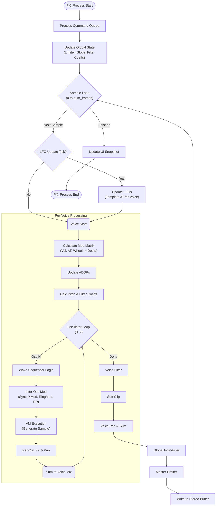

<div align="center">
  
</div>

# Polysonix
**Version 1.9.37 (March 2026) | **Author:** Jacques Morel | **Copyright (c) 2025-2026**

A single-header polyphonic synthesizer engine.

For detailed changes, see the [Update Log](doc/updatelog.md).

<details>
<summary>Table of Contents</summary>

- [Overview](#overview)
- [Key Features](#key-features)
- [Design Principles](#design-principles)
- [CPU vs GPU Backends](#cpu-vs-gpu-backends)
- [Concurrency Model](#concurrency-model)
- [Audio Signal Flow](#audio-signal-flow)
- [Usage](#usage)
- [Quick Start Example](#quick-start-example)
- [Dependencies](#dependencies)
- [Core API Functions](#core-api-functions)
- [Data Structures](#data-structures)
- [Changelog](#changelog)
- [Polysonix Waveform Scripting Language](#polysonix-waveform-scripting-language)
- [License](#license)

</details>

## Overview
polysonix.h is a flexible, stereo polyphonic synthesizer engine designed to be easily embedded into applications. It is built upon the 'px_vm'
expression engine, allowing for dynamically generated waveforms and complex modulation possibilities via a powerful virtual machine.

This library encapsulates all audio processing and state management, deliberately separating the synthesis core from application-specific logic
like UI, input handling, and audio device management.

## Key Features
- **Thread-Safe by Design:** The library is 100% lock-free. Control functions (like `PX_NoteOn`, `PX_SetFilterParam`) can be safely called from any
  UI or main thread, while the `PX_Process` function runs on the dedicated real-time audio thread.
- **Dynamic Waveform Generation:** Leverages the `px_vm` library to execute bytecode expressions for oscillators and LFOs, enabling complex,
  evolving timbres that go far beyond simple wavetables. Includes advanced mathematical functions, LFSR noise generation, and **Markov chains** for probability-based state transitions.
- **Rich Synthesis Architecture:**
  - **Polyphony:** Configurable number of voices (up to 16) with intelligent voice stealing.
  - **Triple Oscillator Architecture:** Each voice features **3 independent oscillators**, each with its own Waveform, Mix Level, Pan, Coarse Tuning (±24 semitones), Fine Tuning (±100 cents), and Wave Sequencer state. This enables massive stacked sounds, chords, and complex multi-timbral textures within a single voice.
  - **Oscillator Interactions (v1.7):** Advanced inter-oscillator modulation features for analog/digital hybrid sounds:
    *   **Cross-Modulation (FM/PM):** Oscillator N modulates the phase of Oscillator N-1, creating metallic, bell-like FM textures.
    *   **Phase Distortion (PD):** Casio-style phase warping per oscillator for resonant, sharp timbres without filters.
    *   **Oscillator Sync:** Hard/Soft synchronization where Oscillator N resets to Oscillator N-1's cycle, enabling classic "tearing" leads.
    *   **Ring Modulation:** Oscillator N amplitude modulates Oscillator N-1 (or vice versa depending on routing), creating sum/difference frequencies for sci-fi and robotic effects.
    *   **Bitcrush (v1.7.1 / v1.8.2):** Per-oscillator bit-reduction for "clean/dirty" layering, with fully modulatable depth (independent of wave sequencing).
  - **Portamento/Glide (v1.8.3):** Unified polyphonic glide with multiple modes: Off, Step Linear (legacy Unilegato), and Smooth RC (exponential, analog-style). Configurable for legato-only or always-on behavior, with per-note overlap detection.
  - **ADSR Envelopes**: Up to 3 independent ADSR envelopes per voice for modulating various parameters.
  - **LFOs**: Up to 3 independent Low-Frequency Oscillators (LFOs) with their own ADSRs and flexible routing.
  - **Advanced Multi-Mode Filter:** A highly flexible state-variable filter per voice with key tracking, drive, and extensive modulation.
    *   **Modes:** Standard (LP, BP, HP, Notch, Allpass) and Combos (LP+BP, LP+HP, BP+HP).
    *   **Selectable Slopes:**
        *   **6 dB/oct (1-pole):** Gentle, Korg MS-20, Roland SH series, EMS VCS3. Uses **parallel independent filters** for true combo modes (e.g., LP+BP is accurately summed).
        *   **12 dB/oct (2-pole):** Aggressive, Oberheim-style (SVF topology).
        *   **18 dB/oct (3-pole):** Balanced, Roland-style.
        *   **24 dB/oct (4-pole):** Smooth, Moog-style.
  - **Global Post-Filter:** A dedicated stereo master filter (LP/HP/BP/Notch/etc.) placed after voice mixing for final tone shaping of the entire mix.
  - **Unified Modulation Matrix:** A comprehensive 16-slot modulation matrix allowing standard controllers to modulate nearly any synthesis parameter (Oscillators, Filters, LFOs, ADSRs).
    *   **Sources:** Velocity, Channel Aftertouch, **Polyphonic Aftertouch**, Mod Wheel, Pitch Bend, **Key Track**.
    *   **Response Curves:** Velocity and Aftertouch inputs can be shaped using **Linear, Exponential, Logarithmic, or S-Curve** mappings for expressive control.
- **Stereo Signal Path:** Full stereo output with per-oscillator panning, per-voice panning, and LFO pan modulation.
- **Built-in Dynamics:** Includes a per-voice soft-clipper to prevent harsh transients and a master bus lookahead limiter to prevent final output clipping.
- **Oscillator Quality Modes**: Choose between per-sample calculation for quality or interpolated modes for performance.
- **Wave Sequencing (v1.5+):** A powerful, bytecode-driven sequencer integrated directly into the voice engine.
    *   **Time-Locked Mode (v1.8):** Optional mode where step durations are calculated in real-time based on pitch, maintaining consistent rhythmic timing across the keyboard range.
    *   **Full ROM Library:** Includes 256 professionally designed wave sequences covering Leads, Pads, Rhythms, Glitch, and Experimental textures.
    *   **Independent Sequencing:** Each of the 3 oscillators has its own sequence state, allowing for polyrhythms and complex layering.
    *   **Per-Cycle Precision:** Logic updates exactly at waveform cycle boundaries for phase-perfect transitions.
    *   **Generative Features:** Probability-based Mute and Skip steps, Random Octave, and Random Wave selection, with **Polyphonic RNG** seeding.
    *   **Per-Step FX:** Non-destructive Bitcrush, Ring Modulation, and Cross-Modulation (XMod) sequencing.
    *   **Amplitude Modulation (v1.7.11):** Per-step envelope shaping (Ramp, Triangle, Sine, Gate, Exp) or Random S&H level modulation for rhythmic gating.
    *   **Glide Modes:** Supports standard stepped glide and analog-style **Exponential Glide** per step.
    *   **Zero-Allocation:** Runs entirely on a static 64KB ROM, suitable for embedded environments.
- **Decoupled Design:** The engine is completely independent of any graphics or windowing library. The host application is responsible for the audio
  callback, making the engine portable to any backend (e.g., Situation, PortAudio, SDL, MiniAudio).

## Design Principles
- **Header-Only:** Designed for easy integration. Simply define `POLYSONIX_IMPLEMENTATION` in one C/C++ file.
- **No Built-in Effects:** Focuses on core synthesis (oscillators, sequencing, modulation) — pair with your DAW/modular chain for reverb, delay, etc.
- **State Encapsulation:** All synthesizer state is managed within an opaque `PxSynth` handle, ensuring no global state and allowing for multiple
  synth instances if needed.
- **Data-Driven UI:** The library provides a suite of `PX_Get...Info()` functions that return read-only snapshots of the internal state. This allows the host
  application to build a detailed UI without directly accessing internal memory, ensuring a stable and glitch-free API.

## Synth Instance vs. Patch: The Core Concept

Polysonix deliberately separates **what the synth actually is** from **what sound it’s currently making**.
This mirrors real hardware synthesizers and keeps the engine safe, predictable, and real-time friendly.

### Synth Instance = The "Hardware"

A **Synth Instance** is created once with a fixed configuration (`PxConfig`):

```c
PxConfig cfg = {
    .num_voices       = 16,     // maximum polyphony
    .num_lfos         = 3,      // number of global LFOs
    .num_voice_adsrs  = 3,      // ADSRs per voice
    .sample_rate      = 44100.0f,
    // ... other fixed settings
};
PxSynth* synth = PX_Create(&cfg);
```

This defines the structural limits of the synth — things that cannot change after creation:

*   How many notes can play simultaneously (`num_voices`)
*   How many global LFOs exist
*   How many ADSRs each voice has
*   Sample rate, oscillator update mode, etc.

Think of each `PxSynth*` as a separate hardware synth or module:

*   Want a dedicated bass-drum synth? Create a 1-voice instance tuned low.
*   Want a monophonic lead with always-on glide? Create a 1-voice mono synth.
*   Want Prophet-style 5-voice polyphony? Create a 5-voice instance.
*   Need bass + chords + lead in one project? Create multiple instances — each with its own role.

These limits are fixed for life — just like you can't suddenly turn a 6-voice into a 16-voice by flipping a switch.

### Patch = The "Sound Program" / Preset

A **Patch** is a complete snapshot of sound parameters only:

*   Oscillator settings (wave_idx, tuning, mix, pan, enabled, bitcrush, cross-mod, etc.)
*   Glide/portamento behavior
*   Filter settings
*   Modulation matrix routings
*   ADSR and LFO templates (attack/decay/sustain/release, wave, frequency, etc.)
*   Global voice pan, limiter threshold, etc.

When you save a preset (`PX_SavePreset`), only these tonal/timbral parameters are stored.
When you load a preset (`PX_LoadPreset`), it completely overwrites the current sound — but never changes the synth instance’s structural limits (voice count, LFO count, ADSR count).

### How It Behaves in Practice

**Monosynth instance (`num_voices = 1`):**
A patch running on this instance behaves monophonically. Glide/portamento works smoothly, only one note plays at a time — classic mono synth behavior.

**Polysynth instance (`num_voices = 16`):**
The same patch configuration running on this instance plays polyphonically (up to 16 notes). Glide only triggers on overlaps if `glide_legato_only` is true.

**Important:** While the patch data is structurally compatible, `PX_LoadPreset` strictly enforces that the source and destination instances have matching configurations (including voice count) to prevent errors. To transfer patches between instances with different voice counts, use the `PX_Bank` API.

**Load mismatch?**
If you try to load a preset saved from a 32-voice synth into your 16-voice instance → load fails safely (config hash mismatch error). No silent corruption, no surprises.

### Why This Separation Is Powerful (and Hardware-Like)

*   **Real-time safety** — No dynamic reallocation mid-audio callback → zero risk of glitches or xruns.
*   **Predictable performance** — CPU/memory usage is known upfront per instance.
*   **Modular workflow** — Create exactly the instruments you need (mono bass, poly chords, gliding lead) — all from the same engine.
*   **Hardware authenticity** — Presets change the sound, not the machine — just like loading a patch into a Minimoog doesn't give it more voices.

### Summary

*   **Synth Instance** = the fixed "hardware" (polyphony, LFO/ADSR counts, sample rate, etc.) — set once at creation.
*   **Patch** = the sound program (oscillators, glide, filter, modulation, etc.) — fully overwrites timbre when loaded.

A preset cannot morph one synth instance into another. It can only shape how each voice sounds.

This architecture is one of the things that makes Polysonix feel like real analog hardware while remaining tiny, embeddable, and programmable.

You can run multiple instances side-by-side — each with its own patch, each playing its own role — all perfectly in sync and lightweight.

## CPU vs GPU Backends

Polysonix utilizes a unified backend architecture defined in `px_vm.h`. By default, the highly optimized CPU virtual machine is used. To enable the GPU backend, simply define `POLYSONIX_USE_GPU` before including `polysonix.h`.

```mermaid
flowchart TD
    %% Common Frontend
    App[User Application] -->|Define Waveform| Expr["Expression String\n(e.g. 'sin(x) + sigma(...)')"]
    Expr -->|Compile| Compiler[Polysonix Compiler]
    Compiler -->|Generate| Bytecode["Bytecode (Reverse Polish Notation)"]

    %% Backend Selection
    Bytecode --> Mode{Backend Defined?}

    %% CPU Path
    Mode -->|Default| CPU_Exec[CPU Execution]
    subgraph CPU_Exec ["CPU Backend (px_vm.h)"]
        direction TB
        CPU_VM["CPU VM\n(Recursive, Computed Gotos)"] -->|Synthesize| CPU_Out[Float Audio Buffer]
    end

    %% GPU Path
    Mode -->|POLYSONIX_USE_GPU| GPU_Exec[GPU Execution]
    subgraph GPU_Exec ["GPU Backend (px_vm.comp)"]
        direction TB
        Serializer["Serializer\n(Packs structs for std430)"] -->|Upload| SSBO[GPU SSBO Buffer]
        SSBO -->|Bindless Access| Shader["Compute Shader VM\n(Iterative, Explicit Stack)"]
        Shader -->|Parallel Dispatch| GPU_Out[Float Buffer / Texture]
    end

    %% Comparison styling
    classDef cpu fill:#3f0f3f,stroke:#6f1f6f,stroke-width:2px;
    classDef gpu fill:#0f3f3f,stroke:#1f6f6f,stroke-width:2px;
    class CPU_Exec,CPU_VM,CPU_Out cpu;
    class GPU_Exec,Serializer,SSBO,Shader,GPU_Out gpu;
```



### CPU Backend
The default engine, fully implemented in `px_vm.h`.

*   **Zero Dependencies:** Pure C99.
*   **Low Latency:** Instant response, ideal for real-time playing.
*   **Optimized VM:** Uses "Computed Gotos" and register caching.
*   **Recursive:** Natural handling of complex nested expressions.

### GPU Backend (`POLYSONIX_USE_GPU`)
Enables the OpenGL 4.6 Compute Shader path.

*   **Technology:** OpenGL 4.6, Bindless Descriptors (`GL_EXT_buffer_reference2`), SSBOs.
*   **Throughput:** Massive parallelism for texture generation or additive synthesis.
*   **Iterative VM:** The shader (`px_vm.comp`) uses an explicit stack to handle complex logic without recursion.

### Comparative Performance Analysis

The choice between CPU and GPU backends depends largely on the specific requirements of your application, particularly the trade-off between **latency** and **throughput**.

| Feature | CPU Backend | GPU Backend |
| :--- | :--- | :--- |
| **Ideal Use Case** | Real-time interactive synthesis (games, instruments), low-latency audio playback | Offline rendering, audio visualization, massive additive synthesis, texture generation |
| **Latency** | **Negligible** (< 1ms). Direct memory access allows for instant reaction to user input. | **Moderate** (~2-10ms). Requires PCIe transfer, driver dispatch overhead, and read-back synchronization. |
| **Throughput** | **High**. Limited by CPU core count and clock speed. Best for serial processing of independent voices. | **Massive**. Capable of calculating thousands of samples in parallel. Scaling is nearly linear until VRAM bandwidth is saturated. |
| **Complexity Limit** | High complexity (nested loops) can stall the audio thread and cause dropouts. | Can handle extremely complex math and heavy `sigma()` loops without blocking the main CPU thread. |
| **Architecture** | Recursive Stack VM (Uses System Stack) | Iterative State Machine VM (Uses Explicit Stack) |
| **Key Tech** | C99, Computed Gotos | OpenGL 4.6, Bindless SSBOs |

#### Throughput vs. Latency: The Crossover Point

The CPU backend is faster for small-to-medium workloads due to zero dispatch overhead. The GPU backend becomes superior when the sheer volume of calculations (samples * complexity) justifies the fixed cost of communicating with the graphics card.

```text
Performance (Samples/Sec)
      ^
      |                                     / (GPU Backend)
      |                                   /
      |                                 /
      |                               /   <-- Massive Parallelism Scaling
      |                             /
      |---------------------------/-------- (CPU Backend Limit)
      |                         /
      |                       /
      |                     /  <-- Crossover Point (~10k+ concurrent samples)
      |                   /
      |_________________/
      0               Load (Complexity * Polyphony) ->
```

#### Detailed Benchmarks

**CPU Backend:**
Aggressively optimized using computed gotos and register caching.
- **Average Execution Time:** ~100 ns per sample (Apple Silicon M3).
- **Standard Waves:** ~85 ns.
- **Complex/Sigma:** ~200 ns.
- *See [PERFORMANCE_REPORT.md](doc/PERFORMANCE_REPORT.md) for full details.*

**GPU Backend:**
- **Execution Time:** Variable, but effectively "free" for the main CPU thread.
- **Dispatch Cost:** Fixed overhead of ~10-50µs per dispatch depending on driver/OS.
- **Throughput:** Can generate 48kHz audio for 1000+ voices simultaneously in real-time on mid-range hardware.

## Concurrency Model
This library is **THREAD-SAFE**. It uses a lock-free producer/consumer model.
- **Producer (Main/UI Thread):** Calls to control functions like `PX_NoteOn` or `PX_SetFilterParam` do not modify the synth state directly. Instead,
    they place a "command" into a lock-free queue. This is a very fast operation that will not block the UI.
- **Consumer (Audio Thread):** At the beginning of each `PX_Process` call, the audio thread quickly drains the command queue,
    applying all pending state changes in a safe, sequential manner. This ensures the synth's state is perfectly consistent
    for the entire duration of the audio block processing.
- **UI Data:** `Get` functions read from a snapshot of the synth's state, which is safely updated by the audio thread after it finishes processing a block.
    This prevents data races and ensures the UI displays a stable, coherent view of the synthesizer's actual sounding parameters.

## Audio Signal Flow

The following diagram illustrates the signal processing pipeline executed within `PX_Process` for every audio block:



## Usage
To use this library, do this in **one** C or C++ file:
```c
#define POLYSONIX_IMPLEMENTATION
#include "polysonix.h"
```
All other files can simply `#include "polysonix.h"`.

1.  Define `POLYSONIX_IMPLEMENTATION` in one C/C++ file before including this header.
2.  Include `polysonix.h` in any other files that need to interact with the synthesizer.
3.  Create a `PxConfig` struct and populate it with your desired settings (sample rate, voices, etc.).
4.  Call `PX_Create()` with your config to get a `PxSynth` instance.
5.  In your audio callback, call `PX_Process()` to generate audio samples.
6.  Use `PX_NoteOn()` and `PX_NoteOff()` from your main thread to control notes.
7.  When finished, call `PX_Destroy()` to free all resources.

## Quick Start Example
```c
// main.c
#include "situation.h" // Your audio framework
#define POLYSONIX_IMPLEMENTATION
#include "polysonix.h"

// Global synth instance
static PxSynth* synth = NULL;

// Audio callback wrapper
static uint64_t AudioCallback(void* user_data, void* buffer, uint64_t bytes_to_read) {
    if (!synth) return 0;

    // Calculate frames (assuming stereo float)
    uint64_t frames = bytes_to_read / (sizeof(float) * 2);

    // Generate float audio directly into the output buffer
    // Polysonix outputs interleaved float samples (-1.0 to 1.0)
    PX_Process(synth, (float*)buffer, (int)frames);

    return bytes_to_read;
}

int main() {
    // 1. Init Situation and dependencies
    SituationInitInfo info = { .window_width = 800, .window_height = 600, .window_title = "Synth" };
    SituationInit(0, NULL, &info);

    // 2. Configure and create the synth
    // PX_Create automatically initializes the waveform engine and cache
    PxConfig config = { .num_voices=8, .sample_rate=48000 };
    synth = PX_Create(&config);

    // Optional: Configure Oscillator 0 (enabled by default in Triple Oscillator architecture)
    PX_SetOscWave(synth, 0, 5); // Set Osc 0 to wave index 5

    // 3. Start Audio Stream
    SituationAudioFormat fmt = { .sample_rate = 48000, .channels = 2, .bit_depth = 32 };
    SituationSound stream;
    SituationLoadSoundFromStream(AudioCallback, NULL, NULL, &fmt, true, &stream);
    SituationPlayLoadedSound(&stream);

    // 4. Main loop
    while (!SituationWindowShouldClose()) {
        SituationPollInputEvents();

        if (SituationIsKeyPressed(SIT_KEY_C)) PX_NoteOn(synth, 60, 0, SIT_KEY_C, 1.0f);
        if (SituationIsKeyReleased(SIT_KEY_C)) PX_NoteOff(synth, SIT_KEY_C);

        // ... render ...
        SituationEndFrame();
    }

    // 5. Clean up
    SituationStopLoadedSound(&stream);
    SituationUnloadSound(&stream);
    PX_Destroy(synth);
    free_bytecode_cache();
    px_vm_free_lfsr_tables();
    SituationShutdown();
}
```

## Dependencies
- **Required:** `px_vm.h` is automatically included by `polysonix.h`. `PX_Create()` automatically handles the initialization of LFSR tables and the bytecode cache.

## Core API Functions

The API is designed to be simple and thread-safe.

**Core**
- `PX_Create(const PxConfig* config)`: Creates and initializes a synthesizer instance.
- `PX_Destroy(PxSynth* s)`: Destroys a synthesizer instance and frees all associated memory.
- `PX_Process(PxSynth* s, float* stereo_buffer, int num_frames)`: Processes a block of audio.

**Patch Management (v1.7.3+)**
- `PX_SavePreset(s, filename, name)` / `PX_LoadPreset(s, filename)`: Saves/loads the current patch to a binary `.syx` file.
- `PX_SavePresetToBus(...)` / `PX_LoadPresetFromBus(...)`: Abstract IO for saving/loading patches to memory or custom streams.
- `PX_CreatePatchBank(config)` / `PX_DestroyPatchBank(bank)`: Manages a bank of 128 patches in memory.
- `PX_Bank_SaveToSlot(bank, idx, s)` / `PX_Bank_LoadFromSlot(bank, idx, s)`: Transfers patches between the live synth and a bank slot.

**Note Control**
- `PX_NoteOn(PxSynth* s, int midi_note, int wave_idx, int key_id, float velocity)`: Triggers a new note.
- `PX_NoteOff(PxSynth* s, int key_id)`: Releases a note.
- `PX_PolyAftertouch(PxSynth* s, int key_id, float pressure)`: Sets polyphonic aftertouch pressure for a note.

### Oscillator Control (v1.6 - v1.7)
Polysonix features a Triple Oscillator Architecture. Functions take an `osc_idx` (0-2).

- `PX_SetOscEnabled(s, osc_idx, enabled)` / `PX_GetOscEnabled`
- `PX_SetOscWave(s, osc_idx, wave_idx)` / `PX_GetOscWave`
- `PX_SetOscCoarseTune(s, osc_idx, semitones)` / `PX_GetOscCoarseTune`
- `PX_SetOscFineTune(s, osc_idx, cents)` / `PX_GetOscFineTune`
- `PX_SetOscMix(s, osc_idx, level)` / `PX_GetOscMix`
- `PX_SetOscPan(s, osc_idx, pan)` / `PX_GetOscPan`
- `PX_SetOscSequence(s, osc_idx, seq_id)`: Assigns a wave sequence to an oscillator.
- `PX_GetOscSequence(s, osc_idx)`

**v1.7 Interaction Features:**
- `PX_SetOscCrossMod(s, osc_idx, enabled, depth)` / `PX_GetOscCrossMod` / `PX_GetOscCrossModEnabled`
- `PX_SetOscPhaseDist(s, osc_idx, enabled, amount)` / `PX_GetOscPhaseDist` / `PX_GetOscPhaseDistEnabled`
- `PX_SetOscSync(s, osc_idx, enabled, softness)` / `PX_GetOscSync` / `PX_GetOscSyncEnabled`
- `PX_SetOscRingMod(s, osc_idx, enabled, depth)` / `PX_GetOscRingMod` / `PX_GetOscRingModEnabled`
- `PX_SetOscBitcrush(s, osc_idx, enabled, depth)` / `PX_GetOscBitcrush` / `PX_GetOscBitcrushEnabled`

**v1.8 Time-Locked Wave Sequencing:**
- `PX_SetWSeqFixedTime(s, enabled)` / `PX_GetWSeqFixedTime`: Enables or disables Time-Locked mode.
- `PX_SetWSeqRefFreq(s, freq)` / `PX_GetWSeqRefFreq`: Sets the reference frequency (e.g., 440.0 Hz) for time scaling.

**v1.8.3 Static Glide / Portamento:**
- `PX_SetGlideMode(s, mode)` / `PX_GetGlideMode`: Sets the glide behavior (Off, Step Linear, Smooth RC).
- `PX_SetGlideTime(s, time_s)` / `PX_GetGlideTime`: Sets the glide duration/time constant.
- `PX_SetGlideLegatoOnly(s, enabled)` / `PX_GetGlideLegatoOnly`: If true, only glide on overlapping notes.
- `PX_SetGlideAlways(s, enabled)` / `PX_GetGlideAlways`: Force glide on every note.

The library also provides a comprehensive set of `PX_Set...` and `PX_Get...` functions for controlling all aspects of the synthesizer, including:

- Voice ADSR parameters
- LFO parameters and routing
- Filter parameters (Per-Voice and Global)
- **Velocity/Aftertouch Curves**
- Global settings like pan and limiter
- Unilegato settings

Additionally, there are several `PX_Get...Info()` functions that provide read-only snapshots of the internal state for UI display.

## Triple Oscillator & Cross-Modulation Examples

Polysonix allows for complex voice architectures by combining three independent oscillators per voice with cross-modulation capabilities.

### Example: Massive Detuned Supersaw
Stack 3 sawtooth waves with detuning and panning.

```c
// Enable all 3 oscillators
PX_SetOscEnabled(synth, 0, true);
PX_SetOscEnabled(synth, 1, true);
PX_SetOscEnabled(synth, 2, true);

// Set all to Sawtooth (assuming index 1 is Saw)
PX_SetOscWave(synth, 0, 1);
PX_SetOscWave(synth, 1, 1);
PX_SetOscWave(synth, 2, 1);

// Detune Osc 1 and 2
PX_SetOscFineTune(synth, 1, -15.0f); // -15 cents
PX_SetOscFineTune(synth, 2, +15.0f); // +15 cents

// Spread stereo field
PX_SetOscPan(synth, 1, -0.5f); // Left
PX_SetOscPan(synth, 2, +0.5f); // Right

// Balance mix
PX_SetOscMix(synth, 0, 1.0f); // Center is loud
PX_SetOscMix(synth, 1, 0.7f); // Sides slightly quieter
PX_SetOscMix(synth, 2, 0.7f);
```

### Example: Metallic FM Bell
Use Oscillator 1 to modulate the phase of Oscillator 0 (Cross-Mod).

```c
// Enable Osc 0 (Carrier) and Osc 1 (Modulator)
PX_SetOscEnabled(synth, 0, true);
PX_SetOscEnabled(synth, 1, true); // Must be enabled to run, even if mix is 0

// Carrier: Sine wave
PX_SetOscWave(synth, 0, 0);

// Modulator: Sine wave, tuned up 2 octaves + 7 semitones (ratio 3:1 approx)
PX_SetOscWave(synth, 1, 0);
PX_SetOscCoarseTune(synth, 1, 31.0f);

// Set modulation depth on Carrier (Osc 1 modulates Osc 0)
// Note: In Polysonix, Osc N modulates Osc N-1.
// So enable CrossMod on Osc 1 to have it modulate Osc 0.
PX_SetOscCrossMod(synth, 1, true, 0.7f); // 70% FM depth

// Hide the modulator's direct output
PX_SetOscMix(synth, 1, 0.0f);
```

### Example: Ring Modulated Bass
Combine a sub-oscillator with a ring-modulated upper harmonic.

```c
// Osc 0: Sub Bass (Sine)
PX_SetOscWave(synth, 0, 0);
PX_SetOscCoarseTune(synth, 0, -12.0f);

// Osc 1: Harmonic (Triangle), tuned a fifth up
PX_SetOscWave(synth, 1, 2); // Assuming 2 is Triangle
PX_SetOscCoarseTune(synth, 1, 7.0f);

// Enable Ring Mod on Osc 1 (Multiplies Osc 1 output with Osc 0 output)
PX_SetOscRingMod(synth, 1, true, 1.0f); // Full Ring Mod

// Mix result
PX_SetOscMix(synth, 0, 0.8f); // Strong sub
PX_SetOscMix(synth, 1, 0.6f); // Ring mod texture
```

## Data Structures & Enums

### Enums
Enums are used extensively in `polysonix.h` to define modes, targets, and parameters.

*   `PxOscillatorType`: `PX_OSC_TYPE_BYTECODE`, `PX_OSC_TYPE_SAMPLE`, `PX_OSC_TYPE_GENERATED`, `PX_OSC_TYPE_FM4OP`.
*   `PxOscillatorUpdateMode`: `PX_OSC_UPDATE_MODE_PER_SAMPLE`, `PX_OSC_UPDATE_MODE_FIXED_RATE`, `PX_OSC_UPDATE_MODE_NYQUIST`.
*   `PxADSRState`: `PX_ADSR_STATE_IDLE`, `PX_ADSR_STATE_ATTACK`, `PX_ADSR_STATE_DECAY`, `PX_ADSR_STATE_SUSTAIN`, `PX_ADSR_STATE_RELEASE`.
*   `PxFilterMode`: `PX_FILTER_MODE_OFF`, `PX_FILTER_MODE_LP`, `PX_FILTER_MODE_BP`, `PX_FILTER_MODE_HP`, `PX_FILTER_MODE_LP_BP`, `PX_FILTER_MODE_LP_HP`, `PX_FILTER_MODE_BP_HP`, `PX_FILTER_MODE_NOTCH`, `PX_FILTER_MODE_ALLPASS`.
*   `PxCurveType`: `PX_CURVE_LINEAR` (default), `PX_CURVE_EXP`, `PX_CURVE_LOG`, `PX_CURVE_S`.
*   `PxADSRDestination`: `PX_ADSR_DEST_NONE`, `PX_ADSR_DEST_PARAM1` (Mod A), `PX_ADSR_DEST_PARAM2` (Mod B), `PX_ADSR_DEST_PARAM3` (Mod C), `PX_ADSR_DEST_AMP`, `PX_ADSR_DEST_FREQUENCY`, `PX_ADSR_DEST_LFO0_OUTPUT_LEVEL`, `PX_ADSR_DEST_LFO1_OUTPUT_LEVEL`, `PX_ADSR_DEST_LFO2_OUTPUT_LEVEL`, `PX_ADSR_DEST_FILTER_CUTOFF`, `PX_ADSR_DEST_FILTER_ENV_INPUT`, `PX_ADSR_DEST_FILTER_RESONANCE`.
*   `PxLFODestination`: `PX_LFO_DEST_NONE`, `PX_LFO_DEST_PARAM1`, `PX_LFO_DEST_PARAM2`, `PX_LFO_DEST_PARAM3`, `PX_LFO_DEST_FILTER_CUTOFF`, `PX_LFO_DEST_AMP`, `PX_LFO_DEST_PITCH`, `PX_LFO_DEST_PAN`.
*   `PxADSRParamType`: `PX_ADSR_PARAM_ATTACK`, `PX_ADSR_PARAM_DECAY`, `PX_ADSR_PARAM_SUSTAIN`, `PX_ADSR_PARAM_RELEASE`.
*   `PxFilterParamType`: `PX_FILTER_PARAM_CUTOFF`, `PX_FILTER_PARAM_RESONANCE`, `PX_FILTER_PARAM_ENV_AMOUNT`, `PX_FILTER_PARAM_DRIVE`, `PX_FILTER_PARAM_KEYTRACK`, `PX_FILTER_PARAM_POLES`.
*   `PxLFOParamType`: `PX_LFO_PARAM_FREQUENCY`.
*   `PxWseqAmpModType` (v1.7.11): `PX_WSEQ_AMP_RAMP_DOWN` (Pluck), `PX_WSEQ_AMP_RAMP_UP` (Reverse), `PX_WSEQ_AMP_TRIANGLE`, `PX_WSEQ_AMP_SINE`, `PX_WSEQ_AMP_SQUARE` (Gate 50%), `PX_WSEQ_AMP_PULSE_25` (Gate 25%), `PX_WSEQ_AMP_EXP_DOWN` (Percussive), `PX_WSEQ_AMP_RANDOM` (S&H).
*   `PxWSeqEndAction`: `PX_WSEQ_END_STOP`, `PX_WSEQ_END_HOLD`, `PX_WSEQ_END_LOOP`, `PX_WSEQ_END_PINGPONG`, `PX_WSEQ_END_REVERSE`.
*   `PxWSeqGlideMode`: `PX_WSEQ_GLIDE_OFF`, `PX_WSEQ_GLIDE_STEP`, `PX_WSEQ_GLIDE_SMOOTH`.
*   `PxGlideMode` (v1.8.3): `PX_GLIDE_OFF`, `PX_GLIDE_STEP_LINEAR`, `PX_GLIDE_SMOOTH_RC`.
*   `PxModSource`: `PX_MOD_SRC_VELOCITY`, `PX_MOD_SRC_AFTERTOUCH`, `PX_MOD_SRC_MODWHEEL` (CC #1), `PX_MOD_SRC_PITCHBEND`, `PX_MOD_SRC_POLY_AFTERTOUCH`, `PX_MOD_SRC_KEY_TRACK`.
*   `PxModDestination`:
    *   **ADSR:** `PX_MOD_DEST_ADSR1_ATTACK` to `PX_MOD_DEST_ADSR3_RELEASE` (3 ADSRs * 4 Params).
    *   **LFO:** `PX_MOD_DEST_LFO1_FREQ`, `PX_MOD_DEST_LFO1_DEPTH` (Up to LFO3).
    *   **Oscillator:** `PX_MOD_DEST_OSC1_PITCH`, `PX_MOD_DEST_OSC1_MIX`, `PX_MOD_DEST_OSC1_PAN`, `PX_MOD_DEST_OSC1_MODA`... (Up to OSC3).
    *   **Oscillator FX (v1.7+):** `PX_MOD_DEST_OSC1_CROSS_MOD_DEPTH`, `PX_MOD_DEST_OSC1_PHASE_DIST`, `PX_MOD_DEST_OSC1_RING_MOD_DEPTH`, `PX_MOD_DEST_OSC1_BITCRUSH_DEPTH`... (Up to OSC3).
    *   **Legacy/Global:** `PX_MOD_DEST_OSC_MODA`, `PX_MOD_DEST_OSC_MODB`, `PX_MOD_DEST_OSC_MODC`, `PX_MOD_DEST_FILTER_CUTOFF`.

### Core Structures

**`PxOscillator`**
Configuration for a single oscillator in the triple-oscillator voice architecture.
```c
typedef struct {
    bool  enabled;
    int   wave_idx;         // Bytecode waveform index
    float coarse_semitones; // Tuning offset (-24 to +24)
    float fine_cents;       // Fine tuning (-100 to +100)
    float mix_level;        // Output mix level (0.0 to 1.0)
    float pan;              // Stereo pan position (-1.0 to 1.0)
    int   sequence_id;      // Active Wave Sequence ID (-1 = Disabled)

    // v1.7 Features
    bool  cross_mod_enabled;    // Osc n modulates n-1
    float cross_mod_depth;      // 0.0–1.0 (matrix modulatable)
    bool  phase_dist_enabled;   // Phase Distortion on/off
    float phase_dist_amount;    // 0.0–1.0 (warp factor)
    bool  osc_sync_enabled;     // Sync to previous osc
    float osc_sync_softness;    // 0.0 (hard) to 1.0 (soft)
    bool  ring_mod_enabled;     // Ring mod with previous osc
    float ring_mod_depth;       // 0.0–1.0

    // v1.7.1 Features
    bool  bitcrush_enabled;
    float bitcrush_depth;       // 0.0–1.0 (matrix modulatable)
} PX_ALIGN_64 PxOscillator; // Padded to exactly 64 bytes for cache/GPU alignment
```

**`PxConfig`**
Configuration settings passed to `PX_Create`.
```c
typedef struct PxConfig {
    int num_voices;                     // Max simultaneous voices (e.g., 16)
    int num_lfos;                       // Global LFOs (e.g., 3)
    int num_voice_adsrs;                // ADSRs per voice (e.g., 3)
    float sample_rate;                  // Sample rate in Hz (e.g., 44100.0f)
    int samples_per_lfo_update;         // Audio samples between LFO updates
    float lfo_update_interval_ms;       // LFO update interval in ms
    PxOscillatorUpdateMode osc_update_mode; // Quality vs Performance mode
    float osc_fixed_update_rate_hz;     // Rate for FIXED_RATE mode
    float nyquist_precision_multiplier; // Multiplier for NYQUIST mode
    bool use_gpu;                       // Enable GPU acceleration (if supported)
} PxConfig;
```

**`PxVoiceInfo`**
Read-only snapshot of a voice's real-time state (via `PX_GetVoiceInfo`).
```c
typedef struct PxVoiceInfo {
    bool active;                // Is the voice currently playing/releasing?
    int midi_note;              // MIDI note number
    float frequency;            // Current frequency in Hz
    float pan_position;         // Stereo pan (-1.0 to 1.0)
    float effective_amplitude;  // Final amplitude
    PxADSRState adsr_states[3]; // Current state (IDLE, ATTACK, etc.) of ADSRs
    float adsr_levels[3];       // Current output level of ADSRs
    float lfo_outputs[3];       // Current output value of LFOs
    int active_wave_indices[3]; // Current waveform index of each oscillator
} PxVoiceInfo;
```

### Wave Sequencing Structures

**`PxWaveSeqStep`**
Defines a single step in a wave sequence (packed into 8 bytes).
```c
typedef struct {
    uint16_t wave_idx;        // The waveform index (0-65535)
    uint16_t duration_cycles; // Duration of the step in oscillator cycles
    int16_t  pitch_offset;    // Pitch offset in cents (-32768 to +32767)
    uint16_t flags;           // Bitwise logic flags (PX_WSEQ_*)
} PxWaveSeqStep;
```

**`PxWaveSequence`**
Defines a complete Wave Sequence, including global settings and step data.
```c
typedef struct {
    const char* name;             // Descriptive name
    uint8_t  end_action;          // PxWSeqEndAction
    uint8_t  glide_mode;          // PxWSeqGlideMode
    uint8_t  adsr_retrig_phase;   // PxADSRState (Target phase on retrigger)
    // ... modulation and probability settings ...
    PxWaveSeqStep steps[PX_MAX_WSEQ_STEPS];
} PxWaveSequence;
```

**`PxLFOInfo`**
Read-only snapshot of an LFO's state (via `PX_GetLFOInfo`).
```c
typedef struct PxLFOInfo {
    bool enabled;           // Is LFO active?
    int wave_idx;           // Waveform index
    float frequency;        // Rate in Hz
    bool reset_on_key_on;   // Does phase reset on Note On?
    bool adsr_enabled;      // Is internal ADSR active?
    float adsr_level;       // Current internal ADSR level
    float phase;            // Current phase (0.0 to 1.0)
    float raw_output;       // Raw waveform output (-1.0 to 1.0)
    float final_output;     // Final output after ADSR shaping
} PxLFOInfo;
```

**`PxLimiterInfo`**
Read-only snapshot of the limiter (via `PX_GetLimiterInfo`).
```c
typedef struct PxLimiterInfo {
    bool initialized;           // Is limiter running?
    float gain_reduction_db;    // Current reduction in dB (non-negative)
} PxLimiterInfo;
```

**Other Structures**
*   `PxSynth`: An opaque handle representing the synthesizer instance.
*   `PxPatch`: A struct that holds the editable parameters of the sound (internal use, modified via API). (Includes glide mode, time, legato-only, and always flags (v1.8.3))
*   `PxWaveInfo`: Information about a specific waveform (name, compilation status).
*   `PxADSRParams`: Configuration for an ADSR envelope (attack, decay, sustain, release, enabled).
*   `PxLFOParams`: Configuration for an LFO (waveform, frequency, etc.).

## Changelog
See [updatelog.md](doc/updatelog.md) for detailed changes, including v1.8.3 glide/portamento.

## Polysonix Waveform Scripting Language
The Polysonix Waveform Scripting Language is a domain-specific language for defining mathematical expressions that generate audio waveforms in the Polysonix synthesizer. Expressions are stored as strings, tokenized, parsed into an abstract syntax tree (AST), compiled into bytecode, and executed by a virtual machine (VM) for real-time audio synthesis.

### Language Structure
The language follows a C-like mathematical expression grammar. Expressions are composed of:

- **Literals**: Floating-point numbers (e.g., `1.0`, `0.5`).
- **Variables**: `x`, `FREQUENCY`, `MOD_A`, `MOD_B`, `MOD_C`, `RAND_OFFSET`, and loop variables (e.g., `k`).
- **Constants**: `PI`, `TWO_PI`, `PI_OVER_2`, `THREE_PI_OVER_2`, `E`, LFSR type constants.
- **Functions**: Mathematical, utility, and LFSR functions (e.g., `sin`, `sigma`, `lfsr_val`).
- **Operators**: Arithmetic, unary, comparison, logical, and ternary.
- **Grouping**: Parentheses `()` for precedence and function arguments.
- **Commas**: Separate function arguments.

### Operand Symbols
The language supports the following operators:

- **Arithmetic (Binary)**: `+`, `-`, `*`, `/`, `%`
- **Unary**: `+`, `-`, `!`
- **Comparison**: `<`, `>`, `<=`, `>=`, `==`, `!=`
- **Logical**: `&&`, `||`, `^`
- **Ternary**: `?`, `:`
- **Other**: `()`, `,`

### Variables and Parameters
- `x`: Phase, typically normalized from 0 to 2*PI over one wave cycle.
- `FREQUENCY`: Current note frequency in Hertz (Hz).
- `MOD_A`, `MOD_B`, `MOD_C`: Modulation parameters, typically ranging from -1.0 to 1.0.
- `RAND_OFFSET`: A per-wave random value, typically from 0.0 to 1.0, constant for the duration of one wave generation.
- `k`: Default loop variable name for the `sigma()` summation function.

### Constants
- `PI`, `TWO_PI`, `PI_OVER_2`, `THREE_PI_OVER_2`, `INV_PI`, `INV_TWO_PI`, `INV_PI_OVER_2`, `E`
- **LFSR Types**: `LFSR_4BIT` through `LFSR_17BIT`, `LFSR_GALOIS`, `LFSR_FIBONACCI`

### Functions
- **Trigonometric**: `sin`, `cos`, `tan`, `asin`, `acos`, `atan`
- **Numeric**: `fma`, `abs`, `tanh`, `exp`, `log`, `log10`, `floor`, `ceil`, `min`, `max`, `sqrt`, `pow`, `rand`, `exp2`, `log2`, `expm1`, `log1p`, `hypot`, `copysign`, `scalbn`
- **Taming**: `clamp`, `mix`, `ramp`
- **Summation**: `sigma(k, start, end, step, expr)`
- **LFSR**: `lfsr_val`, `lfsr_noise`, `lfsr_clock`
- **Probability**: `prob(chance, true, false)`
- **Dynamic Selection**: `select(param, v1, v2, ...)`, `smooth_select(param, v1, v2, ...)`
- **State/Generative**: `markov(id, trigger, p00, p01, ...)`

### Advanced Math Functions
The VM provides several optimized, advanced math functions, useful for shaping signals and calculating pitch or amplitude scaling accurately.

| Function | What it does | Why it's useful in a synth | Example |
| :--- | :--- | :--- | :--- |
| `fma(frac, b, a)` | Fused Multiply-Add | Faster + more accurate than a*b + c | `fma(frac, (b-a), a)` |
| `exp2(x)` | 2^x (very fast) | Octave/pitch calculations, exponential envelopes | `exp2(pitch)` |
| `log2(x)` | log₂(x) | Frequency → MIDI note, log scaling | `log2(freq / 440.0) * 12.0` |
| `expm1(x)` | e^x - 1 (accurate near 0) | Envelopes, small exponential curves | `expm1(-time * decay)` |
| `log1p(x)` | log(1+x) (accurate near 0) | Logarithmic controls, dB calculations | `20.0 * log1p(gain)` |
| `hypot(x, y)` | √(x² + y²) without overflow | Stereo panning, vector length | `hypot(left, right)` |
| `copysign(mag, sgn)` | Copy sign from one value to another | Phase, direction, bipolar signals | `copysign(1.0, velocity)` |
| `scalbn(x, exp)` | x × 2^exp (extremely fast) | Fast pitch shifting, octave jumps | `scalbn(freq, octave)` |
| `remquo(x, y)` | Remainder (fast modulo) | Phase wrapping | `remquo(phase, PI)` |
| `nextafter(x, y)` | Next representable float | Smooth ramps, anti-aliasing | `nextafter(signal, 1.0)` |
| `fdim(x, y)` | Positive difference | max(0, x-y) without branching | `fdim(signal, threshold)` |
| `nan()` | Create NaN | Safe state signaling | `nan()` |
| `inf()` | Create Infinity | Extreme value signaling | `inf()` |
| `lgamma(x)` | log(|Gamma(x)|) | Advanced synthesis | `lgamma(x)` |
| `tgamma(x)` | Gamma function | Complex nonlinearities | `tgamma(x)` |

### Examples

**Basic Sawtooth Wave**
```
1.0 - (x / PI)
```

**Pulse Width Modulation (PWM)**
```
x < (PI + MOD_A * PI) ? 1.0 : -1.0
```

**Additive Synthesis with Sigma**
```
sigma(k, 1.0, 8.0, 1.0, sin(x*k)/k)
```

**LFSR-based Noise**
```
lfsr_noise(LFSR_8BIT, 2.0 + MOD_B)
```

## Seeking Partners
Polysonix is MIT-licensed and designed for easy embedding. Looking for JUCE/VCV Rack developers to create VST3/AU/CLAP or Rack module wrappers (revenue share or bounty). DM @jmorel33!

## License
polysonix.h is licensed under the MIT License. See the [LICENSE](LICENSE) file for details.
