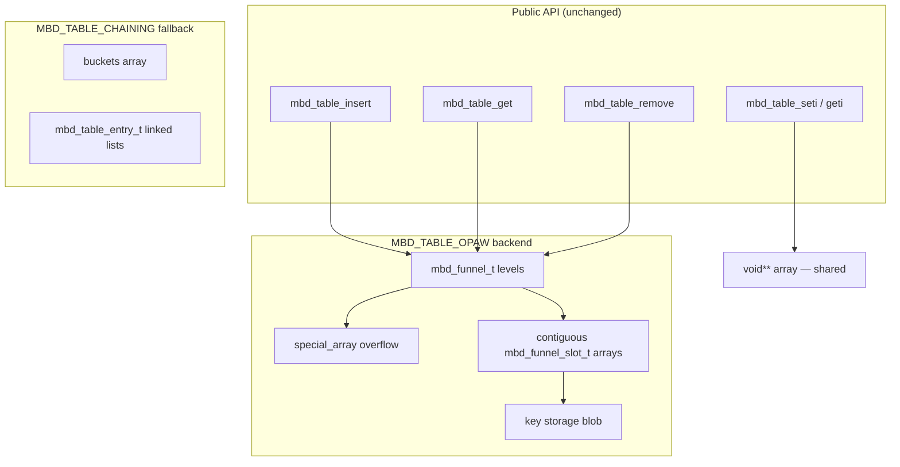

# MyBuddy OPAW Table Redesign: Funnel Hashing for `mbd_table`

**Author:** Systems Architecture (Draft)  
**Date:** June 23, 2026  
**Status:** Draft  
**Target:** MyBuddy v1.7.0 (`sit/mybuddy/`), primary file `mbd_strings.h`  
**Paper:** Farach-Colton, Krapivin, Kuszmaul — *Optimal Bounds for Open Addressing Without Reordering* (arXiv:2501.02305, v2 Feb 2025)

---

## Overview

MyBuddy's companion utility `mbd_table` (`mbd_strings.h:245–480`) is a hybrid separate-chaining hash table plus parallel `void**` array. It works but imposes **per-entry heap allocations** (entry node + `mbd_strdup` key), **pointer-chasing cache misses** on every lookup hop, and **O(n) worst-case** chain walks under adversarial keys. The core buddy allocator (`mybuddy_impl.h`) is unrelated to open addressing; the OPAW opportunity is isolated to the string/table utilities.

This design replaces the chaining backend with **Funnel Hashing** (OPAW Theorem 2), an open-addressing scheme with proven worst-case expected probe bounds **O(log² δ⁻¹)** under greedy insertion without reordering. We preserve the public `mbd_table_*` inline API, retain the parallel integer-indexed array (`mbd_table_seti`/`geti`), and gate the new backend behind `MBD_TABLE_OPAW`. A rigorous cost model shows that at MyBuddy's current δ = 0.25 the asymptotic probe improvement is modest, but **allocator pressure reduction** and **cache locality** dominate real-world gains. **No production `mbd_table_*` caller exists today** (grep confirms only `tests/test_strings.c`); projected Situation workloads (e.g., asset manifests) are hypothetical until integration picks a map type.

---

## Background & Motivation

### Current `mbd_table` (verified in repo)

```c
// mbd_strings.h:246-259 — current layout
typedef struct mbd_table_entry {
    char *key;
    void *value;
    struct mbd_table_entry *next;
} mbd_table_entry_t;

typedef struct mbd_table {
    mbd_table_entry_t **buckets;   // mbd_calloc(capacity, sizeof pointer)
    size_t capacity;
    size_t size;
    void **array;                  // parallel index store (unchanged)
    size_t array_capacity;
} mbd_table_t;
```

| Property | Value (verified) |
|---|---|
| Hash | djb2 (`mbd_table_hash`, line 264) |
| Load factor | Resize at `size >= capacity * 0.75` → **δ = 0.25**, **δ⁻¹ = 4** |
| Resize | Double capacity, re-chain (line 330–348) |
| Per-insert allocs | Up to 3: `mbd_table_entry_t`, `mbd_strdup(key)`, resize `buckets[]` |
| Deletion | Supported (`mbd_table_remove`, line 419) — unlinks + frees key/entry |
| Callers | **Only** `sit/mybuddy/tests/test_strings.c` (grep confirms no production use yet) |
| Benchmarks | `tests/benchmark.c` — alloc-only; **no table microbench** |

### Pain points mapped to MyBuddy allocator behavior

1. **Buddy pool fragmentation:** Each `mbd_table_insert` allocates a 24-byte entry node and a variable-length key string as disjoint `mbd_alloc` blocks. Under Situation's mixed small-object workload (strings, ECS handles, 4 KiB pages per `README.md`), this creates order-3/4 buddy splits and thread-cache pressure unrelated to the table's logical size.
2. **Cache misses:** Chain traversal is `buckets[i] → entry → next → entry`. Each hop is a dependent load; on a cold table with n = 10⁴ entries and average chain length λ ≈ 1.33, a miss costs ~50–100 ns vs. ~4 ns L1 hit.
3. **Probe + strcmp coupling:** Every chain hop runs `strcmp`. OPAW bounds count **probes** (array index visits); MyBuddy must add **per-probe strcmp cost** to the cost model.
4. **Adversarial chains:** Separate chaining degrades to O(n) with crafted keys; OPAW funnel retains O(log² δ⁻¹) worst-case expected probes regardless of key distribution (random-hash model).

### OPAW paper results (insert-only model)

**Model:** Insert (1−δ)n keys into array of size n. No reordering of existing elements. δ = empty-slot fraction; load factor = 1−δ. Require δ⁻¹ power-of-two, δ > O(1/n).

| Scheme | Amortized expected probes | Worst-case expected probes | Insertion (worst-case expected) |
|---|---|---|---|
| Uniform probing (Yao baseline) | O(δ⁻¹) | **Θ(δ⁻¹)** | O(δ⁻¹) |
| **Elastic** (Thm 1, non-greedy) | **O(1)** | **O(log δ⁻¹)** | O(log δ⁻¹) |
| **Funnel** (Thm 2, greedy) | O(log δ⁻¹) | **O(log² δ⁻¹)** | O(log² δ⁻¹) |

Matching lower bounds: Ω(log δ⁻¹) non-greedy; Ω(log² δ⁻¹) greedy. Reference: [optopenhash](https://github.com/sternma/optopenhash) (Python).

**Critical caveat for MyBuddy:** Theorem statements assume **insert-only**. With deletions, even uniform probing lacks tight dynamic bounds; optimal amortized probe complexity in the dynamic setting is δ^{−Ω(1)}. `mbd_table_remove` exists and is tested — deletion policy is a first-class design requirement, not an afterthought.

---

## Goals & Non-Goals

### Goals

1. Replace chaining backend with OPAW Funnel Hashing, preserving `mbd_table_*` public signatures.
2. Rigorous asymptotic analysis mapping paper bounds to MyBuddy's δ, n, and operation mix (insert/get/remove/update).
3. Contiguous open-address slot arrays via `mbd_calloc`; minimize per-entry `mbd_alloc` calls.
4. Compile-time feature flag `MBD_TABLE_OPAW` with fallback to legacy chaining (`MBD_TABLE_CHAINING`).
5. δ⁻¹ power-of-two resize policy aligned with paper (δ ∈ {0.5, 0.25, 0.125, …}).
6. Extend `test_strings.c` + new `bench_table.c` microbenchmark at varying δ.
7. Ordered, mergeable PR plan.

### Non-Goals

- Changing `mybuddy_impl.h` arena/thread-cache/remote-free architecture.
- Thread-safe `mbd_table` (current API is single-threaded inline functions; unchanged).
- Elastic hashing in v1 (deferred; see Alternatives).
- Situation integration wiring (tracked separately in `MYBUDDY_SITUATION_INTEGRATION_PLAN.md`).
- String builder / `mbd_string_view` changes.

---

## Proposed Design

### Scheme selection: Funnel Hashing (greedy)

**Decision: Funnel over Elastic for MyBuddy v1.7.**

| Criterion | Funnel | Elastic | Winner |
|---|---|---|---|
| Implementation complexity (header-only C) | Hierarchical levels + greedy linear bucket scan | Non-greedy "snap-back" probe past first empty slot; per-level load thresholds | **Funnel** |
| `mbd_table_remove` compatibility | Tombstones + periodic rebuild; bounds degrade anyway in dynamic setting | Same tombstone problem; better insert bounds don't transfer to deletions | Tie (both need rebuild policy) |
| Worst-case expected probes at δ=0.25 | O(log² 4) = O(4) | O(log 4) = O(2) | Elastic (marginal at this δ) |
| Worst-case at δ=0.05 (95% load) | O(log² 20) ≈ O(17) | O(log 20) ≈ O(4.3) | Elastic |
| Greedy insert matches existing `mbd_table_insert` mental model | Yes — place in first empty slot in probe sequence | No — counterintuitive overshoot | **Funnel** |
| Reference port available | `optopenhash/funnel_hashing.py` (566 lines, self-contained) | `optopenhash/elastic_hashing.py` (437 lines, level occupancy logic) | **Funnel** (simpler control flow) |
| Lookup path | Scan ≤ β slots per level, early exit on empty | Quadratic probes up to level size | **Funnel** (bounded β scan) |

At δ = 0.25 the probe bound difference is **2× vs 4×** — dwarfed by eliminating 1–2 allocations per insert and pointer chasing. Funnel's greedy bucket scan maps cleanly to C `for` loops without elastic's conditional probe-limit branching. Elastic remains a v1.8+ experiment behind `MBD_TABLE_ELASTIC` if benchmarks at high δ (≥ 0.95 load) justify the complexity.

### Architecture



### Funnel parameters (from paper + optopenhash reference)

For table capacity **n** and empty-slot fraction **δ**:

```
α  = ceil(4 · log₂(δ⁻¹) + 10)          // number of funnel levels
β  = ceil(2 · log₂(δ⁻¹))               // bucket width (slots per bucket)
special_size = max(1, floor(3·δ·n / 4))  // overflow array
primary_size = n - special_size
```

Level bucket counts follow geometric decay: `a_i = round(a₁ · 0.75^i)` where `a₁ = primary_buckets / (4 · (1 − 0.75^α))`.

**MyBuddy default δ = 0.25:**

| Parameter | Value |
|---|---|
| δ⁻¹ | 4 (power of two ✓) |
| α | ceil(4·2 + 10) = **18** |
| β | ceil(2·2) = **4** |
| Max inserts before rebuild | (1−δ)n = **0.75n** (matches current 75% policy) |

### Data layout

#### Slot structure (32 bytes on 64-bit, cache-line friendly)

```c
typedef enum {
    MBD_SLOT_EMPTY     = 0,
    MBD_SLOT_OCCUPIED  = 1,
    MBD_SLOT_TOMBSTONE = 2,
} mbd_slot_state_t;

typedef struct mbd_funnel_slot {
    uint32_t    key_hash;    // salted per-level hash, full 32-bit
    uint16_t    key_len;     // strlen of stored key
    uint8_t     state;       // mbd_slot_state_t
    uint8_t     flags;       // bit0: key_is_inline
    void       *value;
    union {
        char    key_inline[16];  // SSO: keys ≤ 15 chars + NUL
        char   *key_ptr;         // heap key for len ≥ 16
    } key;
} mbd_funnel_slot_t;  // sizeof = 8+8+16 = 32 bytes

#if defined(MBD_TABLE_OPAW)
_Static_assert(sizeof(mbd_funnel_slot_t) == 32,
               "mbd_funnel_slot_t must be exactly 32 bytes (LP64 cache-line slot)");
#endif
```

**Supported target:** 64-bit LP64 (`void*` = 8B). On 32-bit ABIs the union alignment may exceed 32B — funnel backend is **64-bit only** until a padded layout is validated.

**Key storage strategy:**
- **SSO (≤15 chars):** Key stored in `key_inline`; zero additional allocations. Covers short identifiers typical in game/asset maps (`"mesh"`, `"player_01"`).
- **Long keys (>15 chars):** `mbd_strdup` into `key_ptr`; one alloc (down from two: entry + key).
- **Update in place:** If key exists, overwrite `value` only; no new alloc.

#### Funnel table structure

```c
typedef struct mbd_funnel_level {
    mbd_funnel_slot_t *slots;   // mbd_calloc(level_size, 32)
    size_t             size;    // a_i * β
    size_t             buckets; // a_i
    uint32_t           salt;    // per-level hash salt
} mbd_funnel_level_t;

typedef struct mbd_funnel {
    mbd_funnel_level_t *levels;
    size_t              level_count;    // α (trimmed if bucket budget exhausted)
    mbd_funnel_slot_t  *special;        // mbd_calloc(special_size, 32)
    size_t              special_size;
    uint32_t            special_salt;
    size_t              tombstones;     // deleted slots
    double              delta;          // empty fraction target (0.25 default)
} mbd_funnel_t;

typedef struct mbd_table {
#if defined(MBD_TABLE_OPAW)
    mbd_funnel_t funnel;
#else
    mbd_table_entry_t **buckets;
#endif
    size_t   size;            // live entries — stable top-level in BOTH backends
    size_t   capacity;        // table slot budget n — stable top-level in BOTH backends
    void   **array;           // UNCHANGED — parallel index store
    size_t   array_capacity;
} mbd_table_t;
```

**`size` / `capacity` compatibility:** `tests/test_strings.c:81` reads `t->size` after `mbd_table_remove`. Both backends therefore expose `size` and `capacity` as **top-level** `mbd_table_t` fields. The OPAW backend mirrors `t->size`/`t->capacity` on every insert/remove/resize/rebuild; tombstone count remains internal in `funnel.tombstones`. Callers should treat `size`/`capacity` as the supported field-access surface; other fields are backend-private.

**Allocation budget per table of capacity n (δ=0.25):**

| Component | Legacy chaining | OPAW funnel |
|---|---|---|
| Table struct | 1 × `mbd_alloc(40B)` | 1 × `mbd_alloc(~80B)` |
| Index storage | 1 × `mbd_calloc(n, 8)` pointers | 1 × `mbd_calloc(n, 32)` slots (levels + special) |
| Per-insert | 1 × entry (24B) + 1 × key | 0 alloc (SSO) or 1 × key (long) |
| Resize | 1 × `mbd_calloc(2n, 8)` | Full funnel rebuild (1 × `mbd_calloc(2n, 32)` levels) |

For n = 4096, 3072 live entries (75% load), average key 12 chars:
- **Legacy:** 3072 × (24 + ~16) ≈ **123 KiB** in disjoint blocks + 32 KiB bucket array.
- **OPAW:** ~128 KiB contiguous slots + ~0 KiB entry overhead (SSO) ≈ **128 KiB** in 1–19 arrays vs. 6144+ fragments.

**Small-n overhead (δ=0.25, lazy level allocation):**

Levels are allocated **on demand** — only levels with `level_size > 0` after geometry trim receive `mbd_calloc`. Reference trims α when the bucket budget is exhausted (often 2–4 live levels at n ≤ 64).

| n | Live levels (typ.) | `mbd_calloc` calls | Metadata bytes | Expected probes (insert) |
|---|---|---|---|---|
| 16 | 2–3 | 3–4 (levels + special + struct) | ~0.5–1 KiB | ≤ 4 |
| 64 | 3–5 | 5–6 | ~2–4 KiB | ≤ 4 |
| 4096 | ~18 | ~19 | ~128 KiB | ≤ 4 (paper bound) |

At `test_strings.c` scale (capacity 8 after resize), funnel metadata (~0.5 KiB) exceeds the legacy 64B bucket array but remains negligible vs. per-insert alloc churn. Chaining wins on **fixed overhead** at n < 32; OPAW wins on **per-op alloc count** even at small n.

### Probe sequence design

#### Per-level hash (replaces bare djb2 % capacity)

```c
static inline uint32_t mbd_funnel_hash(const char *key, uint32_t salt) {
    uint32_t h = 5381u ^ salt;
    int c;
    while ((c = (unsigned char)*key++))
        h = h * 33u + (uint32_t)c;
    return h;
}
```

Salt per level (and special array) generated at table creation via an internal helper — **no public random API exists** in `mybuddy_api.h`:

```c
// mybuddy_impl.h — internal accessor (PR-1); callable only after mbd_init()
static inline uint32_t mbd_get_secret_key(void) {
    return mbd_secret_key;   /* populated by mbd_init() from OS entropy */
}

// mbd_strings.h — internal, file-local static counter
static uint32_t mbd_funnel_salt_seq;

static inline uint32_t mbd_funnel_salt(void) {
    /* Requires mbd_init() first so mbd_get_secret_key() returns OS-seeded value. */
    uint32_t s = (uint32_t)mbd_table_hash("__salt__");
    s ^= (uint32_t)(uintptr_t)&mbd_funnel_salt_seq;  /* ASLR entropy */
    s ^= mbd_funnel_salt_seq++;
    s ^= mbd_get_secret_key();                       /* OS entropy from mbd_init */
    return s ? s : 0x9E3779B9u;
}
```

Salts are assigned per level in `mbd_funnel_new` and refreshed on rebuild. `mbd_get_secret_key()` wires the existing `mbd_secret_key` (already used by `mbd_hash_ptr`) into salt generation — no new public API, no reference to nonexistent `mbd_secure_random_u32()`.

#### Key equality helper (shared by insert/get/remove)

```c
static inline int mbd_funnel_key_eq(const mbd_funnel_slot_t *slot,
                                    const char *key, size_t key_len,
                                    uint32_t key_hash) {
    if (slot->state != MBD_SLOT_OCCUPIED) return 0;
    if (slot->key_hash != key_hash) return 0;   /* fast reject — hash is per-level salted */
    if (slot->key_len != (uint16_t)key_len) return 0;
    if (slot->flags & 1)  /* inline */
        return memcmp(slot->key.key_inline, key, key_len) == 0
            && slot->key.key_inline[key_len] == '\0';
    return strcmp(slot->key.key_ptr, key) == 0;
}
```

#### Insert (greedy funnel — mirrors optopenhash)

```c
// Pseudocode — mbd_funnel_insert(f, t, key, value)
key_len = strlen(key);
if (t->size >= (size_t)((1.0 - f->delta) * t->capacity))
    mbd_funnel_grow(f, t, t->capacity * 2);   /* pre-check before any slot write */
if (t->size >= (size_t)((1.0 - f->delta) * t->capacity))
    return 0;  /* grow failed — silent no-op, size unchanged (parity with chaining) */

for each level i:
    h = mbd_funnel_hash(key, level.salt[i])
    bucket = h % level.buckets
    for idx in [bucket*β, bucket*β + β):
        if slot[idx] is EMPTY or TOMBSTONE:
            occupy slot[idx]; set key_hash=h, key_len; copy key (SSO or strdup)
            if TOMBSTONE: f->tombstones--
            t->size++
            return 1
        if mbd_funnel_key_eq(&slot[idx], key, key_len, h):
            slot[idx].value = value  /* update — t->size unchanged */
            return 1

/* Special array — port optopenhash/funnel_hashing.py verbatim */
size = f->special_size
probe_limit = max(1, ceil(log(log(t->capacity + 1) + 1)))
h = mbd_funnel_hash(key, f->special_salt)
for j in [0, probe_limit):
    idx = (h + j) % size
    if special[idx] is EMPTY or TOMBSTONE: occupy; t->size++; return 1
    if mbd_funnel_key_eq(&special[idx], key, key_len, h): update value; return 1
idx1 = h % size
idx2 = (h + 1) % size
if special[idx1] or special[idx2] is EMPTY or TOMBSTONE: occupy; t->size++; return 1
/* All special paths exhausted — should not happen if load check passed; trigger grow */
mbd_funnel_grow(f, t, t->capacity * 2)
return mbd_funnel_insert(f, t, key, value)  /* one retry; else return 0 */
```

**Probe count per insert (expected, paper bounds):**
- Per level: ≤ β = O(log δ⁻¹) slots scanned.
- Total levels: α = O(log δ⁻¹).
- **Worst-case expected total probes: O(log² δ⁻¹).**

#### Lookup

Within each β-bucket window, use standard open-addressing tombstone rules: **continue past `TOMBSTONE`, stop only on `EMPTY`**. This preserves keys inserted after a deleted neighbor in the same bucket.

```c
// Pseudocode — mbd_funnel_get(f, key)
key_len = strlen(key);
for each level i:
    h = mbd_funnel_hash(key, level.salt[i])   /* recompute per level — hash is salted */
    bucket = h % level.buckets
    for idx in [bucket*β, bucket*β + β):
        switch slot[idx].state:
            case OCCUPIED:
                if mbd_funnel_key_eq(&slot[idx], key, key_len, h): return slot[idx].value
                continue
            case TOMBSTONE:
                continue   /* keep scanning — do NOT stop */
            case EMPTY:
                break      /* end bucket window — fall through to next level */

/* Special array — same tombstone/empty rules as insert */
size = f->special_size
probe_limit = max(1, ceil(log(log(t->capacity + 1) + 1)))   /* same formula as insert */
h = mbd_funnel_hash(key, f->special_salt)
for j in [0, probe_limit):
    idx = (h + j) % size
    switch special[idx].state:
        case OCCUPIED:
            if mbd_funnel_key_eq(&special[idx], key, key_len, h): return special[idx].value
            continue
        case TOMBSTONE:
            continue   /* keep scanning — do NOT stop */
        case EMPTY:
            break      /* end linear probe — fall through to idx1/idx2 */
idx1 = h % size
idx2 = (h + 1) % size
for idx in [idx1, idx2]:
    switch special[idx].state:
        case OCCUPIED:
            if mbd_funnel_key_eq(&special[idx], key, key_len, h): return special[idx].value
        case TOMBSTONE:
            continue
        case EMPTY:
            continue   /* idx fallbacks only compare occupied slots */
return NULL
```

**Required test (PR-5):** insert A and B into the same β-window, remove A (tombstone), assert `mbd_table_get(B)` still succeeds.

**Probe bounds:**
- **Paper worst-case expected probes:** O(log² δ⁻¹) ≈ 4 at δ=0.25.
- **Deterministic scan cap:** ≤ α·β + probe_limit + 2 special fallbacks ≤ **77** slot visits at n=4096 (α=18, β=4, probe_limit≈3 → 72+3+2=77; not expected in practice).

#### Remove + deletion policy

**Phase 1 (v1.7): Tombstone marking with rebuild trigger.**

```c
void mbd_funnel_remove(mbd_funnel_t *f, mbd_table_t *t, const char *key) {
    // locate slot (same probe as get)
    slot.state = MBD_SLOT_TOMBSTONE;
    free key if heap; clear value
    t->size--;
    f->tombstones++;
    if (f->tombstones > t->size / 2 || f->tombstones > (1-f->delta)*t->capacity*0.15)
        mbd_funnel_rebuild(f, t);  // compact: reinsert all OCCUPIED into fresh table
}
```

**Rebuild** allocates fresh funnel at same capacity (or double if at max load), reinserts live entries — O(n) but restores δ and eliminates tombstone probe inflation.

**Effective δ degradation:** Tombstones count as occupied for probing. If tombstone ratio τ, effective δ' = δ − τ. Rebuild trigger at τ > 15% of capacity keeps effective δ' ≥ 0.21 (within 15% of target).

**Why not backward shift (Robin Hood)?** Shifts reorder elements, violating OPAW's no-reordering model and invalidating level-bucket invariants. Rebuild is simpler and rare under typical insert-heavy workloads.

### Allocation failure and table-full behavior

Parity with current `mbd_table_insert` (lines 376–382): **silent no-op on failure** — no abort, no partial state, `t->size` never incremented on a failed insert.

| Failure site | Behavior |
|---|---|
| `mbd_calloc` for level/special/struct | Return `NULL` from `mbd_funnel_new`; `mbd_table_new` returns `NULL` |
| `mbd_strdup` for long key during insert | Free any partial slot write; return 0; `t->size` unchanged |
| `mbd_funnel_grow` / rebuild mid-insert | Free partial new funnel; retain old table; return 0 |
| Special array exhausted (all paths full) | Attempt `mbd_funnel_grow` once; on second failure return 0 |
| Insert at `t->size >= (1-δ)*t->capacity` | **Grow first** (never hard-fail while grow succeeds) |

Reference Python raises `RuntimeError`; MyBuddy matches existing void/0-return API semantics. PR-5 adds OOM injection tests (mock `mbd_alloc` failure or cap pool size).

### Resize / rebuild policy

| Trigger | Action |
|---|---|
| `t->size >= (1-δ) * t->capacity` | **Grow:** new n' = 2·t->capacity, δ unchanged, rebuild funnel from scratch |
| Tombstone threshold | **Compact:** same t->capacity, rebuild in place |
| `mbd_table_new(initial)` | δ = 0.25 default; t->capacity = max(initial, 16); δ⁻¹ = 4 ✓ |

**Power-of-two δ⁻¹ constraint:** Only use δ ∈ {0.5, 0.25, 0.125, 0.0625, …}. The existing 75% load factor maps exactly to δ = 0.25. Do not use 70% or 80% — they break the paper's δ⁻¹ ∈ {2^k} requirement.

```c
#ifndef MBD_TABLE_DELTA
#define MBD_TABLE_DELTA 0.25
#endif
#define MBD_TABLE_MAX_LOAD (1.0 - MBD_TABLE_DELTA)  // 0.75
```

### API compatibility

All public functions retain identical signatures and semantics:

| Function | Behavior change |
|---|---|
| `mbd_table_new(cap)` | Creates funnel backend when `MBD_TABLE_OPAW` defined |
| `mbd_table_free(t)` | Frees all levels + special + heap keys |
| `mbd_table_insert(t, key, val)` | Funnel greedy insert; update-if-exists preserved |
| `mbd_table_get(t, key)` | Funnel search; NULL if missing |
| `mbd_table_remove(t, key)` | Tombstone + conditional rebuild |
| `mbd_table_seti/geti` | **Unchanged** — parallel array independent of hash backend |
| `mbd_table_hash(key)` | Retained for array-less uses; funnel uses salted variant internally |

**Struct field access:** `tests/test_strings.c:81` reads `t->size` directly. **`size` and `capacity` remain stable top-level fields** in both backends (see Data layout). No other field access by callers is supported; `funnel` internals are backend-private.

### Feature flag and migration

```c
// mbd_strings.h — compile-time backend selection (mutually exclusive)

#if defined(MBD_TABLE_OPAW) && defined(MBD_TABLE_CHAINING)
#error "At most one of MBD_TABLE_OPAW and MBD_TABLE_CHAINING may be defined"
#elif defined(MBD_TABLE_OPAW)
  // funnel implementation
#elif defined(MBD_TABLE_CHAINING)
  // explicit legacy chaining (escape hatch after v1.7.0 default flip)
#else
  // default backend — chaining in v1.6.x; flip to OPAW in PR-7 (v1.7.0)
  // existing chaining implementation
#endif
```

**Migration timeline:**
1. **v1.7.0-alpha:** `MBD_TABLE_OPAW` opt-in; both backends compiled via `#if`; four CI targets (`test_strings`, `test_strings_opaw`, `test_table_dynamic`, `test_table_dynamic_opaw`) run under `make test`.
2. **v1.7.0-rc:** All gates in **Benchmark acceptance table** (below) must pass.
3. **v1.7.0:** Flip `#else` default to OPAW; retain `MBD_TABLE_CHAINING` escape hatch for one release.
4. **v1.8.0:** Remove chaining backend.

### Benchmark acceptance table (unified gate — Rollout, KD-9, PR-7)

| Metric | Criterion | Blocks default flip? |
|---|---|---|
| **Get throughput** | OPAW ≥ **1.3×** chaining at n=4096, SSO keys (12-char), 75% load | **Yes** |
| **Insert throughput** | Within **±10%** of chaining at n=4096 | **Yes** |
| **Remove throughput** | Within **±10%** of chaining at n=4096 | **Yes** |
| **Correctness** | `test_strings`, `test_strings_opaw`, `test_table_dynamic`, `test_table_dynamic_opaw` green | **Yes** |
| **Optional sweep** | Document n ∈ {256, 65536} in `bench_table.c`; no hard gate unless regression >20% | No |

Insert/remove regressions **do block** the default flip even if get exceeds 1.3×.

---

## Asymptotic Analysis Mapped to MyBuddy Workloads

### Variable definitions

| Symbol | Meaning | MyBuddy default |
|---|---|---|
| n | Table capacity (slots) | 16 → 2^k growth |
| δ | Empty slot fraction | 0.25 |
| δ⁻¹ | Inverse empty fraction | 4 |
| u | Live entries (load) | ≤ 0.75n |
| τ | Tombstone fraction | ≤ 0.15n (enforced by rebuild) |
| β | Bucket width | 4 |
| α | Funnel levels | 18 |
| L | Average key length (bytes) | workload-dependent |
| C_strcmp | strcmp cost per probe | ~L cycles |
| C_alloc | mbd_alloc amortized | ~50–200 ns (cache hit/miss) |
| C_miss | L2/L3 cache miss | ~50–100 ns |

### Probe bounds by load factor

| δ | Load | δ⁻¹ | Uniform Θ(δ⁻¹) | Funnel O(log² δ⁻¹) | Elastic O(log δ⁻¹) |
|---|---|---|---|---|---|
| 0.25 | 75% | 4 | 4 | ≈ 4 | ≈ 2 |
| 0.10 | 90% | 10 | 10 | ≈ 11 | ≈ 3.3 |
| 0.05 | 95% | 20 | 20 | ≈ 17 | ≈ 4.3 |
| 0.02 | 98% | 50 | 50 | ≈ 33 | ≈ 5.6 |
| 0.01 | 99% | 100 | 100 | ≈ 44 | ≈ 6.6 |

At MyBuddy's default δ = 0.25, probe counts are **constant-bounded** for all schemes. The win is **not probe asymptotics** at default load — it is **constant-factor** improvements from memory layout and allocation count.

### End-to-end operation cost model

Define **Work(op)** = probe_visits × (C_hash + C_strcmp) + alloc_count × C_alloc + cache_misses × C_miss.

#### Insert (new key, SSO path)

| | Legacy chaining | OPAW funnel |
|---|---|---|
| Paper worst-case expected probes | 1 + λ/2 ≈ 1.7 (chain hops) | **≤ 4** at δ=0.25 (O(log² δ⁻¹)) |
| Deterministic scan cap | O(n) adversarial | ≤ α·β + probe_limit + 2 ≤ **77** slot visits |
| Measured P99 (target, bench_table) | baseline | ≤ 8 (implementation sanity bound) |
| strcmp / key_eq calls | 1.7 × L | ≤ 4 × L |
| mbd_alloc | **2** (entry + key) | **0** (SSO) |
| Cache misses | 2–3 (bucket + entry) | 0–1 (contiguous slot) |
| **Dominant term** | **2 × C_alloc** | **4 × C_strcmp** |

Break-even: 2 × C_alloc ≈ 100–400 ns vs. 4 × L ≈ 16–64 ns for L = 4–16. **SSO insert wins by 3–10×** on allocation-heavy MyBuddy paths.

#### Insert (long key, len > 15)

| | Legacy | OPAW |
|---|---|---|
| mbd_alloc | 2 | **1** (key only) |
| Probes | 1.7 | ≤ 4 |

Savings: 1 alloc per insert ≈ 50–200 ns.

#### Get (hit, SSO key)

| | Legacy | OPAW |
|---|---|---|
| Probes | 1.7 | ≤ 4 (β per level, often level 0 hit) |
| Cache misses | 2–3 | **0–1** (single slot array scan, prefetchable) |
| strcmp | 1.7 × L | ≤ 4 × L |

For L = 8: legacy ~14–24 strcmp chars with 2 misses; funnel ~32 strcmp chars, 0 misses. **Funnel wins when C_miss > 30 ns** (typical L2 miss).

#### Remove

| | Legacy | OPAW |
|---|---|---|
| Find cost | Same as get | Same as get |
| Delete cost | O(1) unlink + 2 free | Tombstone O(1); periodic O(n) rebuild |
| Amortized | O(1) | O(1) amortized with rebuild every Ω(n) deletes |

Rebuild amortization: if rebuild every 0.15n deletes, amortized remove = O(1 + 1/0.15) ≈ O(7) slot copies — acceptable for n ≤ 10⁵.

#### Resize

| | Legacy | OPAW |
|---|---|---|
| Cost | O(n) re-chain, pointer rewiring only | O(n) reinsert into new funnel |
| Alloc | 1 × bucket array | 1 × full slot arrays |
| Rehash strcmp | n × L | n × L × avg_probes |

Resize is rare (every 0.75n inserts). OPAW resize is comparable or faster due to sequential slot writes vs. linked-list pointer chasing.

### Workload scenarios (concrete n)

#### W1: Test workload (`test_strings.c`)
- 5 inserts, 1 resize (4→8), 3 gets, 1 remove, 3 seti.
- Dominated by correctness; either backend O(1). OPAW validates API parity.

#### W2: Asset manifest (**hypothetical** — no `mbd_table` call site in Situation today)
- **Scenario:** Future asset-path map if Situation integration adopts `mbd_table` (not referenced in `MYBUDDY_SITUATION_INTEGRATION_PLAN.md`).
- n = 65536, u = 49152 (75%), keys = 20-char paths, 90% get / 10% insert.
- Legacy: 49152 × **24B** entry nodes (`char*` + `void*` + `next*`) ≈ **1.15 MiB** + 49152 × ~24B key strings ≈ 1.15 MiB + 512 KiB bucket array ≈ **2.8 MiB fragmented** across 98k+ blocks.
- OPAW: 65536 × 32B ≈ 2.0 MiB contiguous slots + 49152 × ~24B heap keys (len > 15) ≈ 1.15 MiB ≈ **3.15 MiB** in ~20 arrays.
- **Footprint trade-off:** OPAW uses ~12% more total bytes but **eliminates 49k entry-node allocations** and co-locates slot metadata. Win is **latency** (cache locality, fewer misses), not raw byte count.
- Expected get speedup: **1.5–2.5×** (engineering estimate; validate in `bench_table.c` when a consumer exists).

#### W3: Dynamic symbol table (stress)
- n = 4096, 50% insert / 30% get / 20% remove, random keys.
- Tombstone rebuild fires ~every 600 removes.
- Probe inflation without rebuild: δ_eff drops from 0.25 → 0.10 after 600 tombstones; **rebuild policy essential**.

#### W4: High-load config table (future)
- δ = 0.05, n = 16384, insert-only config at startup.
- Uniform Θ(20) vs funnel O(17) vs elastic O(4.3).
- **Elastic would win here** — motivates v1.8 evaluation if Situation needs 95%+ load.

---

## API / Interface Changes

### New compile-time macros (`mbd_strings.h`)

```c
/* Backend selection — exactly one active */
/* #define MBD_TABLE_OPAW       1  */  /* Funnel hashing (OPAW Thm 2) */
/* #define MBD_TABLE_CHAINING   1  */  /* Legacy separate chaining */

#ifndef MBD_TABLE_DELTA
#define MBD_TABLE_DELTA 0.25
#endif

/* Optional: override funnel constants (testing only) */
/* #define MBD_TABLE_FUNNEL_ALPHA_OVERRIDE  0 */
/* #define MBD_TABLE_FUNNEL_BETA_OVERRIDE   0 */
```

### New internal symbols (not public API)

// mybuddy_impl.h (PR-1)
static inline uint32_t       mbd_get_secret_key(void);

// mbd_strings.h / mbd_funnel.h
static inline uint32_t       mbd_funnel_salt(void);
static inline uint32_t       mbd_funnel_hash(const char *key, uint32_t salt);
static inline int            mbd_funnel_key_eq(const mbd_funnel_slot_t *slot,
                                                const char *key, size_t key_len,
                                                uint32_t key_hash);
static inline mbd_funnel_t  *mbd_funnel_new(size_t capacity, double delta);
static inline void           mbd_funnel_free(mbd_funnel_t *f);
static inline int            mbd_funnel_insert(mbd_funnel_t *f, mbd_table_t *t,
                                                const char *key, void *value);
static inline void          *mbd_funnel_get(const mbd_funnel_t *f, const char *key);
static inline int            mbd_funnel_remove(mbd_funnel_t *f, mbd_table_t *t,
                                                const char *key);
static inline void           mbd_funnel_rebuild(mbd_funnel_t *f, mbd_table_t *t);
static inline void           mbd_funnel_grow(mbd_funnel_t *f, mbd_table_t *t, size_t new_cap);
```

### Makefile additions (PR-5 wires CI)

```makefile
# Add to TESTS variable (currently omits test_strings at Makefile:13):
TESTS += tests/test_strings tests/test_strings_opaw \
         tests/test_table_dynamic tests/test_table_dynamic_opaw

tests/test_strings: tests/test_strings.c mbd_strings.h mybuddy.h
	$(CC) $(CFLAGS) $< -o $@ $(EXTRA_LIBS)    # default: chaining backend

tests/test_strings_opaw: tests/test_strings.c mbd_strings.h mybuddy.h
	$(CC) $(CFLAGS) -DMBD_TABLE_OPAW $< -o $@ $(EXTRA_LIBS)

tests/test_table_dynamic: tests/test_table_dynamic.c mbd_strings.h mybuddy.h
	$(CC) $(CFLAGS) $< -o $@ $(EXTRA_LIBS)    # chaining backend

tests/test_table_dynamic_opaw: tests/test_table_dynamic.c mbd_strings.h mybuddy.h
	$(CC) $(CFLAGS) -DMBD_TABLE_OPAW $< -o $@ $(EXTRA_LIBS)

tests/bench_table: tests/bench_table.c mbd_strings.h mybuddy.h
	$(CC) $(BENCH_CFLAGS) $< -o $@ $(EXTRA_LIBS)

# Extend the existing `test` target recipe (Makefile:44–58) — build via $(TESTS),
# then execute each binary explicitly (matching test_basic … test_brutal pattern):
test: $(TESTS)
	@echo "=== test_strings ==="
	@./tests/test_strings
	@echo "=== test_strings_opaw ==="
	@./tests/test_strings_opaw
	@echo "=== test_table_dynamic ==="
	@./tests/test_table_dynamic
	@echo "=== test_table_dynamic_opaw ==="
	@./tests/test_table_dynamic_opaw
	@echo "=== test_basic ==="
	@./tests/test_basic
	# … existing test_basic through test_brutal blocks unchanged …
```

All four string-table binaries **build** via `TESTS` and **run** via the extended `test` recipe. `test_strings.c` includes `mbd_strings.h` directly (not only `mybuddy.h`). Tombstone/rebuild stress (`test_table_dynamic_opaw`) is mandatory before PR-7 — chaining-only dynamic stress does not gate the OPAW flip.

---

## Data Model Changes

No persistent schema migration — in-memory only. `mbd_table_t` backend field changes behind `#if defined(MBD_TABLE_OPAW)`; **`size` and `capacity` remain at stable offsets** in both backends. Callers should prefer function API; direct `t->size` access is supported for test/assert use.

**Size comparison (n = 4096, δ = 0.25):**

| Field | Chaining | OPAW |
|---|---|---|
| Header | 40 B | 80 B |
| Index | 32 KiB (4096 × 8B ptrs) | 128 KiB (4096 × 32B slots) |
| Entries | 3072 × 24B = 72 KiB (fragmented) | (in index) |
| Keys | 3072 × ~16B avg = 49 KiB (fragmented) | 3072 × ~16B = 49 KiB |
| **Total** | ~153 KiB + allocator metadata | ~177 KiB contiguous |

OPAW uses ~15% more bytes for slots but **eliminates 3072 entry-node allocations** and co-locates metadata with keys (SSO).

---

## Alternatives Considered

### 1. Keep separate chaining (status quo)
- **Pro:** O(1) delete, simple, proven in tests.
- **Con:** 2 allocs/insert, pointer chasing, O(n) adversarial.
- **Verdict:** Reject as default for v1.7; retain as fallback.

### 2. Elastic hashing (OPAW Theorem 1)
- **Pro:** O(log δ⁻¹) worst-case probes; O(1) amortized expected.
- **Con:** Non-greedy snap-back insert is error-prone in C; per-level occupancy branching; no better deletion story.
- **Verdict:** Defer to v1.8 behind `MBD_TABLE_ELASTIC` if high-δ benchmarks warrant.

### 3. Flat open addressing (linear probing + tombstones)
- **Pro:** Simplest implementation; one array.
- **Con:** Θ(δ⁻¹) worst-case (Yao optimal for greedy uniform); cluster-sensitive; no OPAW improvement.
- **Verdict:** Reject — strictly worse bounds than funnel at δ < 0.25.

### 4. Robin Hood / backward-shift deletion
- **Pro:** No tombstones; stable probe lengths.
- **Con:** Reorders elements — violates OPAW model; complex with funnel levels.
- **Verdict:** Reject.

### 5. Arena-allocated chaining (keys in bump pool)
- **Pro:** Reduces allocator fragmentation without probe algorithm change.
- **Con:** Doesn't improve probe bounds or cache locality; pool lifetime coupling.
- **Verdict:** Complementary optimization; doesn't replace OPAW.

### 6. Swiss tables / `flat_hash_map` / single-array Robin Hood
- **Pro:** One contiguous slot array; SIMD-friendly probing (Swiss); Robin Hood caps probe variance with simpler code than multi-level funnel; at δ=0.25 uniform probing Θ(4) matches funnel's ≈4 expected probes — similar constant factors for locality/SSO wins.
- **Con:** Swiss tables need platform-specific SIMD or careful portable fallbacks; Robin Hood backward-shift deletion reorders elements (OPAW paper model incompatible); neither offers O(log² δ⁻¹) guarantee at high δ (e.g., δ=0.05 where funnel O(17) beats uniform Θ(20)).
- **Verdict:** Viable simpler alternative for δ=0.25-only workloads, but rejected for v1.7 because: (1) OPAW funnel gives **adversarial probe insurance** as δ decreases in future high-load configs (W4); (2) reference implementation and paper bounds provide a correctness anchor; (3) multi-level geometry is isolated behind `MBD_TABLE_OPAW` without changing the public API. Revisit if PR-2/PR-3 implementation cost exceeds 1200 LOC with no measurable win over a single-array Robin Hood + SSO prototype in `bench_table.c`.

---

## Security & Privacy Considerations

| Threat | Severity | Mitigation |
|---|---|---|
| Hash-flooding DoS (adversarial keys) | Medium | Per-level random salts via `mbd_funnel_hash(key, level.salt)`; salts from `mbd_funnel_salt()` (XORs `mbd_get_secret_key()`); refreshed on rebuild |
| Algorithmic complexity attack via tombstones | Low | Rebuild cap at τ = 15%; bounded funnel levels α |
| Key leakage via freed slots | Low | `mbd_funnel_remove` zeroes `key_inline`; `mbd_free` heap keys |
| Predictable salt (weak PRNG) | Low | `mbd_funnel_salt()` XORs `mbd_get_secret_key()` (OS-seeded at `mbd_init`), ASLR stack address, `mbd_table_hash("__salt__")`, and monotonic counter; salts refreshed on rebuild |
| Use-after-free on values | N/A | Unchanged — values not freed by table (documented) |

No auth, network, or PII scope. Table is in-process, single-threaded.

---

## Observability

### Debug counters (guarded by `MYBUDDY_DEBUG`)

```c
typedef struct mbd_funnel_stats {
    uint64_t inserts;
    uint64_t updates;
    uint64_t removes;
    uint64_t rebuilds;
    uint64_t tombstones_peak;
    uint64_t probe_steps_total;   // sum of slot visits
    uint64_t sso_hits;            // inline key inserts
} mbd_funnel_stats_t;
```

### Metrics to log in `bench_table.c`

- P50/P95/P99 probe steps per insert/get
- Rebuild count per 10⁶ ops
- `mbd_get_stats()` delta: `total_allocated_bytes` before/after n inserts; also log `splits` / `coalesces` across benchmark phases (quantify fragmentation win)
- Cache misses via `perf stat` (Linux) or VTune (Windows) — optional CI skip

### Alerting thresholds (production guidance)
- `rebuilds / removes > 0.5` → tombstone threshold too aggressive; tune down
- `probe_steps_p99 > α·β + probe_limit + 2` (77 at n=4096, δ=0.25) → likely implementation bug or salt collision

---

## Rollout Plan

| Stage | Audience | Flag | Gate |
|---|---|---|---|
| 1. Land funnel backend | Dev | `MBD_TABLE_OPAW` opt-in | `test_strings` + `test_strings_opaw` + `test_table_dynamic` + `test_table_dynamic_opaw` green |
| 2. Microbench | Dev | both backends | **Benchmark acceptance table** passes (get ≥1.3×; insert/remove ±10%) |
| 3. RC default flip | Early adopters | OPAW default | 1 week soak in Situation fork |
| 4. GA v1.7.0 | All | OPAW default | Chaining deprecated |
| 5. v1.8.0 | All | Remove chaining | Clean up `#if` |

**Rollback:** Define `MBD_TABLE_CHAINING` in consumer `CFLAGS`; no runtime state.

---

## Open Questions

1. **Default flip timing:** Should v1.7.0 default to OPAW before Situation Phase 1 integration, or after M1–M5 mixed-allocator fixes land?
2. **SSO threshold:** Is 15 bytes optimal for Situation key lengths, or should we measure and use 23 (fit in 32B slot with 8B value ptr)?
3. **Elastic v1.8:** At what δ does the team require Elastic over Funnel? Proposed gate: δ ≤ 0.05 with insert-only workload.
4. **Salt rotation on rebuild only vs. per-table:** Paper assumes fixed hash family; is rebuild-time salt refresh sufficient?
5. **`test_strings` in CI:** **Resolved in PR-5** — add all four targets to `TESTS` (`test_strings`, `test_strings_opaw`, `test_table_dynamic`, `test_table_dynamic_opaw`) and extend the `test` recipe to execute each binary explicitly.

---

## References

- Krapivin, Farach-Colton, Kuszmaul — [arXiv:2501.02305](https://arxiv.org/abs/2501.02305) (OPAW, Jan 2025)
- Reference implementation — [github.com/sternma/optopenhash](https://github.com/sternma/optopenhash)
- MyBuddy `mbd_strings.h` — `sit/mybuddy/mbd_strings.h:245–480`
- MyBuddy core allocator — `sit/mybuddy/mybuddy_impl.h` (arenas, thread caches unchanged; PR-1 adds `mbd_get_secret_key()` only)
- Situation integration — `doc/plan/MYBUDDY_SITUATION_INTEGRATION_PLAN.md`
- Scaling / hardening context — `sit/mybuddy/SCALING_PLAN.md`, `HARDENING_PLAN.md`

---

## PR Plan

Ordered, independently mergeable PRs. Funnel port is **~800–1200 LOC** in C (reference Python is ~120 lines dense logic). Extract `mbd_funnel.h` (included by `mbd_strings.h`) in PR-1 to keep diffs reviewable.

| PR | Title | Files | Est. LOC | Depends on |
|---|---|---|---|---|
| **PR-1** | `mbd_funnel` types + geometry + `mbd_funnel_new`/`free` + salt helpers + `mbd_get_secret_key()` + `_Static_assert` | `mbd_funnel.h`, `mbd_strings.h`, `mybuddy_impl.h` | ~320 | — |
| **PR-2** | Funnel insert/get + SSO + special-array fallback (no remove) | `mbd_funnel.h` | ~600–800 | PR-1 |
| **PR-3** | Tombstone remove + rebuild + resize/grow + alloc-failure paths | `mbd_funnel.h` | ~600–800 | PR-2 |
| **PR-4** | Wire `mbd_table_*` public API to funnel backend | `mbd_strings.h` | ~200 | PR-3 |
| **PR-5** | CI tests: `test_strings` + `test_strings_opaw` + `test_table_dynamic` + `test_table_dynamic_opaw` + tombstone/regression + OOM; extend `test` recipe | `tests/*.c`, `Makefile` | ~450 | PR-4 |
| **PR-6** | `bench_table.c` microbenchmark (δ sweep) | `tests/bench_table.c`, `Makefile` | ~300 | **PR-5** |
| **PR-7** | Default flip `MBD_TABLE_OPAW` + UPDATELOG v1.7.0 | `mbd_strings.h`, `mybuddy_version.h`, `UPDATELOG.md` | ~50 | PR-5, PR-6 (acceptance table) |
| **PR-8** | Remove chaining backend | `mbd_strings.h` | ~-400 | PR-7 + 1 release cycle |

**PR-5 test coverage (mandatory before PR-7):**
- Existing `test_strings.c` under both backends (including `t->size` check at line 81).
- Tombstone regression: insert A+B same β-window, remove A, get B succeeds.
- `test_table_dynamic.c` under **both** backends (`test_table_dynamic` chaining + `test_table_dynamic_opaw`): random insert/get/remove (50/30/20 mix per W3), assert `t->size` invariant, cap rebuild count, verify gets after deletes.
- OOM: insert returns without incrementing `t->size` when alloc fails.

PR-6 **must not merge before PR-5** — benchmarks without CI parity tests weaken the PR-7 gate.

---

## Key Decisions

| # | Decision | Rationale |
|---|---|---|
| **KD-1** | **Funnel Hashing** as OPAW scheme (not Elastic) | Greedy insert matches simple C control flow; reference port available; at δ=0.25 probe difference is marginal vs. alloc/locality wins; Elastic deferred to v1.8 |
| **KD-2** | **δ = 0.25** (75% load) preserved | Matches existing `mbd_table_resize` threshold; δ⁻¹ = 4 satisfies paper power-of-two constraint |
| **KD-3** | **Tombstone deletion + periodic rebuild** | Paper is insert-only; rebuild restores δ; avoids element reordering; chaining-style O(1) unlink incompatible with open-address levels |
| **KD-4** | **32-byte slot with 15-byte SSO** | Fits buddy 32B minimum alignment; eliminates alloc for short keys (majority of identifier workloads) |
| **KD-5** | **Compile-time `MBD_TABLE_OPAW` flag** | Header-only library has no runtime plugin model; matches `MYBUDDY_IMPLEMENTATION` pattern |
| **KD-6** | **Parallel `void** array unchanged** | `mbd_table_seti/geti` are orthogonal to hash backend; zero migration risk |
| **KD-7** | **Salted per-level djb2** | Preserves existing hash spirit; `mbd_funnel_salt()` XORs `mbd_get_secret_key()` for OS entropy; full 32-bit compare before strcmp |
| **KD-8** | **Rebuild (not grow) on tombstone threshold** | Keeps capacity stable during delete-heavy phases; grow only on load factor |
| **KD-9** | **Benchmark acceptance table** (get ≥1.3×; insert/remove ±10%; correctness green) | Unified gate referenced in Rollout, Migration, and PR-7; insert/remove regressions block flip |
| **KD-10** | **Minimal `mybuddy_impl.h` change: `mbd_get_secret_key()`** | One `static inline` accessor exposing existing `mbd_secret_key` for salt generation; no allocator architecture changes per SCALING_PLAN/HARDENING_PLAN scope |